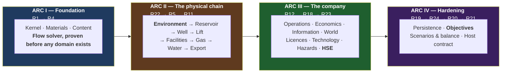

# OGSim — Master Tracker

**The single source of truth for what is designed, what is built, and what is
next.** Updated at the close of every phase.

**Status legend:** ⬜ not started · 🟦 in progress · ✅ complete · ❌ blocked

---

## Current state

| | |
|---|---|
| **Phase** | R0 ✅ closed · R1-C (contract layer) ✅ complete · R1 ✅ tasks complete (gate open on deferred verification) · R2 ✅ complete · ****R3 ✅ complete**** |
| **Design docs** | 24 design + 1 research + 25 phase docs, 17 catalogue sheets ([C16 terrain](catalog/C16_TERRAIN_CLASSES.md) newest) + tech tree, 18 SDDs (000–017). Coherence log: **81 findings**, 61–81 from the code passes. |
| **Code status** | Contract layer complete and **the kernel is implemented behind it**: quantities + `DetMath` + spatial, entity registry, clock, PCG64 streams, log, audit trail, fault policies, event bus, command bus, module composition, state registration, segmentation and the 14-stage tick pipeline. 0 warnings, 0 errors, **236/236 tests** (28 contract + 189 kernel + 19 architecture). Every implemented member traces to a pinned SDD section (F-1). |
| **Repository** | `The-Tech-Idea/Beep.OilGasSim`, branch `master`. The OGSim tree was copied in from the workspace it was authored in and the prior occupant of this repo removed in the same commit; work lands directly on `master`, one task per commit. |
| **Next** | **R2 — materials, properties, streams**, once R1’s gate closes. R1’s tasks are all done; four verification items are not, and none can be closed by writing kernel code: **R1-V2** (the compile-failure corpus needs a Roslyn negative-compilation harness), **R1-V6** (cross-platform byte identity needs the CI matrix of [SDD-000](sdd/SDD-000_ENGINEERING_STANDARDS.md) §6), and **R1-V14/V20/V22** (11 architecture checks whose subject assemblies do not exist — [R1 §5b](phases/R1_KERNEL.md)). Laws L1–L5 and determinism rules D-2…D-8 are now **mechanically enforced** on every build. Commit style `R<n>.<m>: <what>` |

> **Phase numbers are stable identifiers, not execution order.** They are assigned
> in the order phases are designed; §"Execution order" below is authoritative for
> sequence. R22 (Environment) executes at the start of Arc II, R23 (HSE) after
> R18, and R24 (Objectives) before R20 — because that is where their dependencies
> place them.

---

## R0 — Design ✅ (closed by owner instruction, 2026-08-06)

| # | Document | Status |
|---|---|---|
| R0.1 | [design/00_VISION.md](design/00_VISION.md) — what the game is | ✅ drafted |
| R0.2 | [design/01_CONCEPT_MATRIX.md](design/01_CONCEPT_MATRIX.md) — every concept, mapped | ✅ drafted |
| R0.3 | [design/02_DOMAIN_MODEL.md](design/02_DOMAIN_MODEL.md) — entities and relationships | ✅ drafted |
| R0.4 | [design/03_ARCHITECTURE.md](design/03_ARCHITECTURE.md) — layers, contracts, composition, tick | ✅ drafted |
| R0.5 | [design/04_MATERIAL_AND_FLOW.md](design/04_MATERIAL_AND_FLOW.md) — the one flow engine | ✅ drafted |
| R0.6 | [design/05_SIMULATION_MODELS.md](design/05_SIMULATION_MODELS.md) — the equation catalogue | ✅ drafted |
| R0.7 | [design/06_WORLD_AND_EXPLORATION.md](design/06_WORLD_AND_EXPLORATION.md) — map, discovery, information | ✅ drafted |
| R0.8 | [design/07_TECHNOLOGY.md](design/07_TECHNOLOGY.md) — the technology graph | ✅ drafted |
| R0.9 | [design/08_ECONOMICS.md](design/08_ECONOMICS.md) — money, fiscal regimes, reserves | ✅ drafted |
| R0.10 | [design/09_DIAGNOSTICS.md](design/09_DIAGNOSTICS.md) — log, audit, fault policy | ✅ drafted |
| R0.11 | [design/10_CONTENT_AND_UNITS.md](design/10_CONTENT_AND_UNITS.md) — data format, units | ✅ drafted |
| R0.12 | [design/11_PERSISTENCE.md](design/11_PERSISTENCE.md) — save, load, determinism | ✅ drafted |
| R0.13 | [design/12_VERIFICATION.md](design/12_VERIFICATION.md) — how each phase proves itself | ✅ drafted |
| R0.14 | [research/PPDM_ALIGNMENT.md](research/PPDM_ALIGNMENT.md) — standards research | ✅ drafted |
| R0.15 | [design/13_ENVIRONMENT.md](design/13_ENVIRONMENT.md) — the operating environment and its effects | ✅ drafted |
| R0.16 | [design/14_HSE.md](design/14_HSE.md) — health, safety, environment as a discipline | ✅ drafted |
| R0.17 | [design/15_TIME_AND_EXECUTION.md](design/15_TIME_AND_EXECUTION.md) — **turn-based engine, real-time-with-pause game** | ✅ drafted |
| R0.18 | [design/16_EVENT_MATRIX.md](design/16_EVENT_MATRIX.md) — every event, trigger, payload, severity | ✅ drafted |
| R0.19 | [design/17_CROSS_IMPACT_MATRIX.md](design/17_CROSS_IMPACT_MATRIX.md) — how everything affects everything; the feedback loops | ✅ drafted |
| R0.20 | [design/18_GAME_MODES.md](design/18_GAME_MODES.md) — objectives, missions, challenges, scenarios, campaign | ✅ drafted |
| R0.21 | [design/19_GLOSSARY.md](design/19_GLOSSARY.md) — naming discipline | ✅ drafted |
| R0.22 | [design/20_PLAYER_DECISIONS.md](design/20_PLAYER_DECISIONS.md) — the decision catalogue and its design test | ✅ drafted |
| R0.23 | [design/21_INTEGRATION.md](design/21_INTEGRATION.md) — **time × events × cross-impact**; propagation delays, loop periods, loop-entry alerts | ✅ drafted |
| R0.24 | [design/22_DESIGN_COHERENCE.md](design/22_DESIGN_COHERENCE.md) — **change-impact map, rule registry, identifier scheme, coherence log** | ✅ drafted |
| R0.25 | Per-phase design documents R1–R25 ([phases/](phases/)) | ✅ drafted |
| R0.26 | Second pass — tick pipeline corrected to 14 stages; docs 00–12 integrated with 13–21 | ✅ done |
| R0.27 | Third pass — identifier scheme unified (18 findings logged); content gaps in 05–11, 19, 20 closed | ✅ done |
| R0.28 | Fourth pass — coherence checks executed; L5 ownership violation fixed; cross-cutting couplings added to 14 phase docs; read-model contract specified (findings 19–27) | ✅ done |
| R0.29 | Fifth pass — Affects/Affected-by coupling headers on all 23 design docs; stale counts, diagram/table disagreement and glossary duplicates fixed (findings 28–31) | ✅ done |
| R0.30 | Sixth pass — **six simulation-logic defects fixed** (findings 32–37): conservation equation completed, solver non-convergence made survivable via the shut-in ladder, stage-4 lag semantics declared, pressure surveys added, integration error bounded, inventory provenance/blending specified | ✅ done |
| R0.31 | Seventh pass — **reality-level system** (finding 38): three accessibility axes, the Advisor as player-side autopilot, presets, profile-stamped scores; PD-D1/D2/D4, I-D5 and D5 resolved into it; phase R25 added | ✅ done |
| R0.32 | **SDD layer** ([sdd/](sdd/)): rolling-wave policy, [SDD-000 engineering standards](sdd/SDD-000_ENGINEERING_STANDARDS.md) (platform, determinism rules D-1..D-8, testing, CI), [SDD-001 kernel contracts](sdd/SDD-001_KERNEL_CONTRACTS.md) (signatures for R1) | 🟦 drafted |
| R0.33 | Eighth pass — **the surface world** (findings 39–40): world generation made discoverable (G16/G17, ownership map); the surface expanded from one pipeline line into the eight-step sub-pipeline of 06 §5.1a — terrain, hydrology, settlements, networks, third-party infrastructure, derived profiles, computed remoteness, slow settlement growth | ✅ done |
| R0.33b | [SDD-002](sdd/SDD-002_STREAMS_AND_FLOW.md) — streams, elements, **the solver algorithm pinned** (damping λ, pro-rata throttling, every tolerance, the ladder) | ✅ drafted |
| R0.33d | [SDD-003](sdd/SDD-003_SUBSURFACE_AND_WELLS.md) — subsurface & wells: **SI forms of every formula**, bisection specs, lift hooks, coning gate | ✅ drafted |
| R0.33e | SDD-000 gains implementation-fidelity rules F-1..F-4 (no unspecified member, no unpinned constant or formula, SDD-first on conflict); SDD-001 gains spatial primitives | ✅ done |
| R0.33s | **Fourth SDD review pass** (finding 60): the gas-lift recycle loop closed with a one-tick lag (the pass's one architectural find); command inventory derived from the decision catalogue; carried interest, operation-level masses, the inspectable-save acceptance, audit-replay data rooms, belief re-keying | ✅ done |
| R0.33r | **Third SDD review pass** (finding 59): the referenced-but-undefined class — `ContentId`, `DisposedMass`, **the double→Money half-even boundary that makes INV2's exactness real**, type-curve-only reserves, the AdvisorView layering fix, scripted entries as commands, and five smaller pins | ✅ done |
| R0.33q | **Second SDD review pass** (finding 58): ten gaps incl. three contradictions — the `IEngine` duplicate, the trig-free `NextNormal` pin, and **the 30/360 calendar decision** unifying the segment grid, weather days, berth calendars and day-rates on one arithmetic; conservation check completed with `Sourced`/`Disposed`; the `Aggregate` predicate node | ✅ done |
| R0.33p | **SDD review pass** (finding 57): nine gaps fixed — day-grid alignment of all stochastic positions, choke decoupling in the solver, power/flare/VRU transforms pinned, SlotKind drift, and the three genuinely uncovered areas closed by [SDD-016](sdd/SDD-016_ENVIRONMENT_RUNTIME.md) (weather as daily AR(1) on the /30 grid), [SDD-017](sdd/SDD-017_HOST_SURFACE.md) (the full host surface + path registry) and SDD-012 §4b (the bow-tie as arithmetic) | ✅ done |
| R0.33o | **The slot system** (finding 56): tech→equipment/material/treatment→effect closed for every unlock kind — `fits` on all unlockables, slot-scoped effects for consumables, C15 catalogue sheet (muds, inhibitors, polymer, CO₂, biocide) | ✅ done |
| R0.33n | Uniformity closed over buildings (finding 55): facility types = templates in JSON, never code; the Support unit family (camps, warehouses, bases, airstrips) — non-stream buildings through the same content/construction/condition machinery | ✅ done |
| R0.33m | **Non-negotiable 11** (finding 54): definition-driven, plugin-first stated as one global rule; the moddability contract table (10 §1b) — content edits for everything, plugins for new behaviour, engine edits for neither | ✅ done |
| R0.33l | SDD-010..015 (world-gen, rivals, hazards, persistence formats, objectives, advisor) — **the SDD set is complete: every build phase has its software design document**; `Rn.0` becomes a review task | ✅ drafted |
| R0.33k | [SDD-008](sdd/SDD-008_INFORMATION_AND_BELIEFS.md) beliefs + [SDD-009](sdd/SDD-009_ECONOMICS_ENGINE.md) economics — the two heaviest formula surfaces pinned: one conjugate update rule, Beta POS, WLS/BIC inference, deterministic VOI; integer double-entry, **the PSC algorithm with mandatory hand-computed fixtures**, UoP depreciation, the reserves/RRR algorithm | ✅ drafted |
| R0.33j | [SDD-006](sdd/SDD-006_FACILITIES_AND_TRANSPORT_ELEMENTS.md) facility/transport transforms + [SDD-007](sdd/SDD-007_OPERATIONS_ENGINE.md) operations engine — Arc II's surface chain and R12 now at signature level; spec-gate proxies, tank backpressure and outcome-draw timing pinned | ✅ drafted |
| R0.33i | [SDD-004](sdd/SDD-004_CONTENT_PIPELINE.md) content pipeline + [SDD-005](sdd/SDD-005_CAPABILITIES_AND_EFFECTS.md) capabilities & effects — the gating/tier/detectability systems of passes 10–11 now at signature level, incl. **the pinned envelope-combination rule** (a design refinement 13 §2.1 had left open); SDD-003 gains the accumulation truth attributes | ✅ drafted |
| R0.33h | **The catalogue layer** (finding 53): 14 per-station equipment sheets + the TECH_TREE gate registry (~50 nodes with era/prereqs/routes/opens) — the authoring spec content JSONs are written from | ✅ drafted |
| R0.33g | Eleventh pass — **geology's tech dimension + full dependency revision** (findings 51–52): detectability D0–D3 and access classes as truth attributes; the re-opening loop; the activity-gating matrix across all operations; `AllCapabilities` as the pre-R17 composition; era-layering guaranteed in world-gen | ✅ done |
| R0.33f | Tenth pass — **the equipment-tier system** (finding 50): technology gates catalogue entries (`requiresTech`); tiers in eleven places, each with its own money, install time and datasheet-borne physics; service route rents gated tiers; SDD-003 pins tier-curve consumption | ✅ done |
| R0.33c | Ninth pass — **full re-read of the simulation core** (02, 04, 05, 07, 08, 11 read line-by-line; findings 41–49): gas-condensate model, coning/standoff physics, the asset market, insurance, two missing hazards, injector abandonment, and an intra-document identifier collision | ✅ done |
| R0.34 | **Gate closed 2026-08-06** — owner instruction: "lets start with code". Open decisions proceed on their recommendations; SDD set 000–017 stands | ✅ closed |
| **R1-C** | **Contract layer built**: `OGSim.slnx` (net10.0, nullable, warnings-as-errors), `OGSim.Kernel` (13 files — quantities, volume types, Money, identity, 30/360 time, RNG streams, log/audit/fault, events, commands, modules/segments/state, streams, effects, spatial) + `OGSim.Contracts` (8 files — flow, subsurface, wells, facilities, capabilities/gating, operations, information, the full `IEngine`/`ReadModel` surface). **Builds clean: 0 warnings, 0 errors; 9/9 smoke tests green.** First rule-F-4 event handled by the book (finding 61: `Stream`→`MaterialStream`). No implementations — signatures, data records and pinned one-liners only | ✅ |
| **R1-C2** | **Second contract pass** (findings 62–66): solver gains `FlowTopology` (elements had no wiring!), `IEffectState` + gating fourth arg, `TickContext.Segments` nullable-until-stage-4, EconomicsContracts + IntegrityContracts + `IPipeline` + `ICommandValidator/Applier`, `Observation`/`IBeliefStore`. SDD-001/002/005 back-annotated. **[23_FUNCTION_MATRIX](design/23_FUNCTION_MATRIX.md)** created: full contract→function→SDD→phase→consumer→pin matrix + dependency/pipeline mermaid graphs. 10/10 smoke tests (incl. an implementability fake for `IFlowElement`) | ✅ |
| **R1-C3** | **Third contract pass** (findings 67–72): commit family `ICommitTarget`+3 (the only mutation path finally has types), `IEngine.WriteSave` + `IEngineFactory`/`EngineSetup` (the host could not save or start!), ContentContracts.cs (non-negotiable 11's front door: catalogues, sources, load failures, `GatedDefinition`, `Era`) + `IModuleRegistry`, `IMigrationStep`, six missing R21 §2.4b read-model projections (compartments, IPR/VLP curves, spec margins, nominations, VOI, FinanceView), `Bg` typed as `FormationVolumeFactor`. SDD-002/003/004/017 back-annotated | ✅ |
| **R1-C4** | **Fourth contract pass** (findings 73–75): `SolveReport` gains its converged state (`ElementSolution`, `CompletionState`) — it was diagnostics-only, leaving the §9 commit step and S0 seeding with no input; exact `Money * long`; `IEventBus.Publish` stamps and returns `EventId`. Kernel files re-audited (Diagnostics/Events/Money line-by-line; issuance patterns now consistent) | ✅ |
| **R1-C5** | **Fifth contract pass** (finding 76, owner-prompted): the last two deferred slots declared — `WorldContracts.cs` (`IWorldGenerator`, `IWorldSink` + typed geology/surface/region handoff records, `IWeatherModel`), SDD-010 §4 / SDD-016 §1 pinned first. ~~Every 03 §3.2 replaceable slot is now a compiled type~~ — **corrected by pass 9 (finding 82): three were not** (`IHydraulicModel`, `ISeparationModel`, `IObservationModel`). R15.0/R16.0 demoted from "declare the contract" to "review granularity" | ✅ |
| **R1-C6** | **Sixth contract pass** (findings 77–78): systematic SDD-interface-vs-code diff (all pinned interfaces declared ✓) + line-by-line audit of the last unreviewed kernel files (Identity/Time/Random/Volumes/Spatial/Commands). Caught pass 3 correcting itself: `Bg` re-typed to a new `GasFormationVolumeFactor` (gas bridges to `StandardGasVolume`, never stock-tank); `NextInt` doc sync | ✅ |
| **R1-C7** | **Owner-driven pass** (findings 79–80): `WorldParameters` — the new-world knobs (size, land fraction, richness, maturity, climate severity, rivals, start era), template-scoped, range-checked at `CreateNew`; terrain-class content kind + [C16](catalog/C16_TERRAIN_CLASSES.md) authoring sheet (plains/hills/mountain/desert/rock-plateau/swamp; sea = bathymetry). SDD-004/010 amended; 15/15 tests | ✅ |
| **R1-C11** | **All 18 SDDs revised to signature parity** — each read section-by-section against its contract files, not name-diffed. **300 of 300 public engine types are now declared in an SDD** (was 88). Found and fixed: `ConstraintWriter`, `EnvelopeContext`, `CompartmentId`, `PerforationId`, `OperationId`, `RelinquishmentSchedule`, `CommitmentItem` — seven phantom types signatures depended on; `FinanceView` missing from `ReadModel` beneath a note claiming the section count matched; `MoveEnvelope` unable to express the rule its own §4.1 pins; `Gating` as a static class (L1/L2); `Duration` where whole days were meant, twice. [SDD-000](sdd/SDD-000_ENGINEERING_STANDARDS.md) §8 gains **F-5** (an amendment edits its block, never sits beneath it — 5 instances) and **F-6** (identity is `EntityId<T>`; no per-entity id types — 3 instances) | ✅ |
| **R1-C10** | **Tenth contract pass — full SDD-vs-code audit, both directions.** Of 300 public types, 62 were declared in no SDD at all (F-1 says implementations are not exempt) and 32 SDD-declared types had no code. Closed now: the **three §3.2 slots** declared (`ISeparationModel` + `SeparationEfficiency`, `IHydraulicModel` + `PipeGeometry`, `IObservationModel`), **[SDD-002](sdd/SDD-002_STREAMS_AND_FLOW.md) §2b’s whole surface** built (5 distributions, `IPropertyKind`, `IProperty`, `IMaterial`, `IMaterialCatalog`, `Dimension`), and **[SDD-001](sdd/SDD-001_KERNEL_CONTRACTS.md) §12b** naming R1’s 13 concrete types — F-1 had been honoured for the interfaces and quietly broken for the classes behind them. Gap 62 → 51; the rest are per-phase and close at each `Rn.0`. One design error caught while writing: the first `ISeparationModel` draft duplicated `IFluidPropertyModel.SplitAt` — phase *existence* is thermodynamics, phase *recovery* is equipment | ✅ |
| **R1-C9** | **Ninth contract pass (finding 82), run as R2.0** — a sweep of every `I<Name>` the 25 phase documents promise against code and SDDs: 62 undeclared. **Three [03](design/03_ARCHITECTURE.md) §3.2 slots were genuinely missing** and are now pinned (`IHydraulicModel`/`ISeparationModel` in [SDD-006](sdd/SDD-006_FACILITIES_AND_TRANSPORT_ELEMENTS.md) §0, `IObservationModel` in [SDD-008](sdd/SDD-008_INFORMATION_AND_BELIEFS.md) §3); R2’s property/material surface written as [SDD-002](sdd/SDD-002_STREAMS_AND_FLOW.md) §2b with the **P90-low/P10-high** convention pinned; ~20 equipment names recorded as **never to be declared** ([02](design/02_DOMAIN_MODEL.md) §4.1 forbids a facility-type hierarchy — they are content templates behind `IFlowElement`). Phase docs corrected at each `Rn.0`, not swept | ✅ |
| **R1-C8** | **Eighth contract pass** (finding 81): the spatial read surface — `IEngine.World`/`WorldView` (static world beside the per-tick ReadModel; public knowledge only), `Site` coordinates on well/facility views, licence polygons, believed prospect outlines with POS. Found by walking the host's screens against the declared surface; SDD-017 §1c + R21 §2.4b amended | ✅ |

---

## The build plan

Four arcs. **Nothing starts until R0.34 closes.**

**Why the flow solver comes before any domain (R4 before R5):** the solver is the
riskiest single component and the one everything else depends on. Proving it
against synthetic flow elements — before a reservoir or a well exists — means its
correctness is established independently of any domain modelling. If the solver
design is wrong, that is discovered in Arc I and not in Arc III.

---

## Arc I — Foundation

### Phase R1 — Kernel 🟦  *(all 18 tasks done; gate open on deferred verification)*
> 📄 [phases/R1_KERNEL.md](phases/R1_KERNEL.md)

| # | Task | Status |
|---|---|---|
| R1.0 | **SDD review** ([SDD_INDEX](sdd/SDD_INDEX.md) §1) — SDD-001 and the R1 phase doc read against the committed contract layer. Five drifts corrected under rule F-4 *before* any code: the missing `weather` RNG stream, R1-V19's "across leap years" against a 30/360 calendar, §9's `Segment(double…)`/`AvailabilitySet` block, the undeclared `Area` dimension, and `ILog`'s phantom `EventName`/`LogFields` | ✅ |
| R1.1 | Dimensions, units, `IQuantity`; conversion; nonlinear scales — **plus `DetMath`** (§1.3), the `Area` dimension, the volumetric rate family, the §1.4 spatial algorithms and the §11 fault carriers. 37 kernel tests | ✅ |
| R1.2 | `IEntityId<T>`, `IEntityRegistry`; resolution faults — **F-4: the interface had no `Register`**, so `Resolve` could never return and the registry was unimplementable as declared. Ids begin at 1; registration is write-once | ✅ |
| R1.3 | `ISimulationClock` — read-only interface, `Advance()` on the concrete type only; 30/360 `AddMonths`/`MonthsUntil`; `GameDate` month validated | ✅ |
| R1.4 | `IRandomSource` with independent per-subsystem streams — PCG64 XSL-RR, eight streams seeded by **name** not ordinal, closed-form `Seek`, Marsaglia polar `NextNormal`, rejection-sampled `NextInt`. R1-V5 proven byte-identical | ✅ |
| R1.5 | `ILog` — structured, levelled, nested correlation scopes; `ILogSink`/`LogRecord` declared (F-1: design 09 §3 named a sink that no type existed for) | ✅ |
| R1.6 | `IAuditTrail` — append-only, queryable, bounded. Retention is a **cause-graph closure**, not a category filter: a prunable entry that still explains live state survives (09 §4.4) | ✅ |
| R1.7 | `IFaultPolicy` — classification, strict and resilient implementations, both complete configurations per 09 §5.3 | ✅ |
| R1.8 | `IEventBus` — outbound only. `Seal()` on the concrete bus, not the interface, so only the pipeline can close a tick (EM2) | ✅ |
| R1.9 | `ICommand`, `ICommandBus` — validate → audit → apply → publish. **F-4: `Apply` now returns its events and receives the submission `AuditId`** — `Accepted.Immediate` had no source and an applier could not satisfy INV12 | ✅ |
| R1.10 | `IModule` + **`ModuleComposer`** — all five R1 §2.9 checks, every problem reported. **F-4: `IModuleRegistry` named two different things** (03 §3.1 validator vs the content plugin binder); `StageParticipation` gained `Order` because check 5 had no data to check | ✅ |
| R1.11 | `IStateOwner` registration only — exclusive ownership (L5) + fixed key-order visiting. **There is no `IStateSerializer`**: SDD-001 §10 declares none and the serializer proper is SDD-013/R19; the name was not invented here | ✅ |
| R1.12 | Architecture test suite — **18 checks live**, reflection + Roslyn (closes open item S000-2: both, chosen per rule). 11 deferred with their trigger phase, listed in [R1 §5b](phases/R1_KERNEL.md) rather than written as tests asserting nothing | ✅ |
| R1.13 | **`AdvanceTick()` — the turn-based engine surface**; no wall-clock anywhere. **F-4: `TickResult` moved to the kernel** (the pipeline cannot reference Contracts) and gained **`TickAbandoned`** — `FaultResolution` had three outcomes where `TickResult` had two | ✅ |
| R1.14 | **Sub-tick segmentation** — whole-day /30ths positions (INV9 as integer arithmetic), 4-segment budget, merges ranked by the pinned estimator and **every merge audited** | ✅ |
| R1.15 | Calendar — month, quarter, year, season boundaries; real labels over 30/360 | ✅ |
| R1.16 | Event taxonomy — categories, severity, stage, loop role, segment-boundary flag, cause chain, **no-subscriber rule**. INV12/IR6 and IR4 enforced at publish; the no-subscriber rule is an absence, architecture-tested at R1.12 | ✅ |
| R1.17 | Tick pipeline — the 14 stages of [03](design/03_ARCHITECTURE.md) §6, order declared in one place and walked; fault resolutions obeyed (continue / abandon whole / halt) | ✅ |
| R1.18 | Deterministic event ordering — `(stage, day, subject, event id)`; **F-4: SDD-001 §6 still said `double SubTickPosition`** against the committed /30ths-grid `int Day` | ✅ |

### Phase R2 — Materials, properties, streams ⬜
> 📄 [phases/R2_MATERIALS.md](phases/R2_MATERIALS.md)

| # | Task | Status |
|---|---|---|
| R2.1 | `IPropertyKind` catalogue; dimension binding; valid ranges. **F-4: R2 §3 specified a build that cannot compile** (contracts in Contracts, implementations in Kernel) — the material layer is kernel currency, per SDD-002 §1 | ✅ |
| R2.2 | `IProperty` — value, provenance, uncertainty, as-of; validated against its kind at construction, **tails included** (a centre in range with a P90 outside it is refused) | ✅ |
| R2.3 | Distribution types; log-normal product propagation — five sealed kinds, **P90-low/P10-high** on the contract; product of log-normals analytic (R2-V5) | ✅ |
| R2.4 | `IMaterial`, `IMaterialCatalog` — ordinals assigned from the id sort and nowhere else, so two runs of the same content index `Composition` identically | ✅ |
| R2.5 | `MaterialStream` — composition, P, T, provenance; **no cached phase split** (elements ask the fluid model at (composition, P, T)); `Split` preserves conditions and provenance | ✅ |
| R2.6 | Stream algebra — `Composition` Plus/Scaled/Split, `Allocation.Blend`; split-then-mix round-trips **to the bit** (R2-V3), randomised sequences conserve mass (R2-V4) | ✅ |
| R2.7 | Black-oil property model (`IFluidPropertyModel`) — Standing, Vazquez-Beggs, Beggs-Robinson, Lee-Gonzalez-Eakin, Dranchuk-Abou-Kassem, all forms now pinned in [SDD-003 §4.1](sdd/SDD-003_SUBSURFACE_AND_WELLS.md). **Field units inside one declared boundary** — §2 amended: empirical correlations have no SI form, their constants are fitted coefficients. Pinned by invariants, continuity and round-trip; **published worked examples deferred to R5 (S003-4)** | ✅ |
| R2.8 | Volume-condition types: rb / stb / scf, non-interchangeable — delivered at R1.1 with the rate family; gas bridges to `StandardGasVolume`, never stock-tank | ✅ |

### Phase R3 — Content pipeline ⬜
> 📄 [phases/R3_CONTENT.md](phases/R3_CONTENT.md)

| # | Task | Status |
|---|---|---|
| R3.1 | Content format, schema, `"3200 psi"` unit syntax — closed vocabulary, affine temperature scales, **volume condition carried by the token** (`rb` and `stb` are not interchangeable), decimal comma refused rather than guessed, nearest-token hint on a typo. **R3.0: two layering/placement corrections** — the content surface moved to `OGSim.Kernel` (its bases were unreachable from the records deriving from them) and the unit table out of `PhysicalConstants` | ✅ |
| R3.2 | Six-stage validation — stages 1–3 per-file and unconditional, 4–6 cross-file and gated on a complete index (**a parse failure would otherwise cascade into spurious dangling references**) | ✅ |
| R3.3 | Load report — every failure in the batch, each naming source, file, JSON path and stage; catalogues on success or failures otherwise, **never both** | ✅ |
| R3.4 | `ICatalog<T>` and typed indices — catalogues keyed by the definition’s runtime type, id-sorted so ordinals are save-stable | ✅ |
| R3.5 | Model plugin binding by name — `PluginRegistry` keyed by **(name, contract)**, so a price model named where a drive belongs fails at load rather than on the tick that first used it. Stage 6 asks the KIND which plugins its datasheet names (`PluginsOf`), so the loader never learns a field name | ✅ |
| R3.6 | Mod loading through the identical path; a later source replaces an entry **whole**, and two sources at one declared order is a failure naming both | ✅ |
| R3.7 | Shipped catalogues — `content/` exists: 5 property kinds, 9 materials (the PPDM/PRODML product list of research §5), 3 rock types. **`property-kind` is a bootstrap kind** loaded in its own pass, because stage 3 binds units against the dimension it declares and stage 4 comes later. Fluid systems deferred to R5 with the reservoir that consumes them | ✅ |

### Phase R4 — Flow solver core 🟨
> 📄 [phases/R4_FLOW_SOLVER.md](phases/R4_FLOW_SOLVER.md)
> `src/OGSim.Flow` — references Contracts and Kernel only.

| # | Task | Status |
|---|---|---|
| R4.0 | SDD review — SDD-002 §5, §7, §8 amended: `TransformInput.SolvedRate` (finding 96), deferrals moved from S3 to §8's attribution pass (finding 97), S4's boundary pressure pinned, S3's unrelievable-constraint fault | ✅ |
| R4.1 | `IFlowElement` — ports, constraints, transform. **Availability is not on the element**: an unavailable element is absent from the segment's network (04 §4) | ✅ |
| R4.2 | Network construction and validation; tree topology. Kahn's algorithm with the ready set in ascending id, so the order is not merely *a* topological order but always the same one | ✅ |
| R4.3 | Forward propagation and constraint evaluation, in topological order | ✅ |
| R4.4 | Throttle and back-propagation to convergence. **S2 receives `SolvedRate`** — without it S3's cap adjusted a number the forward pass never read, and a bound constraint could survive all 200 iterations | ✅ |
| R4.5 | **Bottleneck attribution** — binding element + deferred volume, computed once on the converged state against the completions' uncapped targets, so the figure does not depend on how many iterations convergence took | ✅ |
| R4.6 | Mass conservation invariant, checked after **every** transform — what makes an INV1 breakdown attributable to one element rather than to the network | ✅ |
| R4.7 | Non-convergence engages the audited shut-in ladder and the tick **completes** (04 §4.0b); ladder exhaustion is the invariant fault | ✅ |
| R4.8 | Synthetic flow elements — source, sink, restrictor, splitter, manifold, completion. A completion is one object in both roles, because the solver solves a rate for it and then asks the same element to turn that rate into a stream | ✅ |
| R4.9 | FV suite ([04](design/04_MATERIAL_AND_FLOW.md) §9) — **partial, see below** | 🟨 |

**R4.9 honestly: 6 of 13 covered, 7 need a domain or a tick loop R4 does not have.**
Test names carry their FV number so coverage is readable from the test list.

| FV | Covered | Where / why not |
|---|---|---|
| FV1 Conservation | ✅ | Hand-built chains + **200 randomised networks × 3 seeds**, generated valid-by-construction. The design asks for 1,000 *ticks*; there is no tick loop until R7, so the per-solve half is proven here and the loop half belongs with the loop |
| FV2 Depletion shape | ⬜ | Needs a reservoir (R5) — an Arps curve cannot be checked against synthetic elements |
| FV3 Operating point | 🟨 | Convergence onto the IPR and the DEAD outcome are pinned, recomputed independently from the report. The **parameter sweep against IPR ∩ VLP** needs a real VLP (R6) |
| FV4 Bottleneck attribution | ✅ | The element is named and the deferred volume matches the analytic answer; a second test pins that the volume is damping-independent |
| FV5 Backpressure propagation | ✅ | A larger downstream drop measurably reduces withdrawal; a pressure-decoupled completion is unmoved by the same swing |
| FV6 Spec gating | ⬜ | Needs a spec gate and a flare (R6). The network build already refuses a spec gate with no Reject port |
| FV7 Material agnosticism | 🟨 | The solver contains no material-identity branch and the architecture tests check it; the synthetic-material equivalence half needs R5's materials |
| FV8 Determinism | 🟨 | Repeat solves agree to the bit. **Cross-platform state hashing is not covered** — no state hash exists until R7, and CI has no Linux leg yet (R1-V6) |
| FV9 Convergence | ✅ | Budget exhaustion engages the ladder, audited with its cause, and the solve completes rather than faulting |
| FV10 Allocation | ✅ | A commingle allocates back in mass proportion, shares summing to exactly 1 |
| FV11 Segmentation | ⬜ | Needs the segment loop (R7); R4 solves one segment given to it |
| FV12 Segmentation ≠ averaging | ⬜ | As FV11 |
| FV13 Segment commit atomicity | ⬜ | Needs `ICommitTarget` and the stage-6 commit (R7) |

---

## Arc II — The physical chain

### Phase R22 — Environment and Setting ⬜  *(executes first in Arc II)*
> 📄 [phases/R22_ENVIRONMENT.md](phases/R22_ENVIRONMENT.md)

| # | Task | Status |
|---|---|---|
| R22.1 | `IEnvironmentProfile` — terrain, water depth, climate, access, ground, sensitivity, utilities | ⬜ |
| R22.2 | Effect application — restrict option / move envelope / change parameter, **shared with technology** | ⬜ |
| R22.3 | `IWeatherModel` — seasonal baseline, stochastic variation, persistence, extremes | ⬜ |
| R22.4 | Within-tick weather profile — days lost, composing with R1.14 segmentation | ⬜ |
| R22.5 | `IForecast` — accuracy declining with horizon | ⬜ |
| R22.6 | Access windows — seasonal availability, opening and closing events | ⬜ |
| R22.7 | Ambient conditions into flow assurance and equipment derating | ⬜ |
| R22.8 | EN1–EN12 verification suite ([13](design/13_ENVIRONMENT.md) §8) | ⬜ |

### Phase R5 — Subsurface 🟨
> 📄 [phases/R5_SUBSURFACE.md](phases/R5_SUBSURFACE.md)
> `src/OGSim.Subsurface` — **every type internal**, enforced by
> `Truth_SubsurfaceExposesNoPublicType`.

| # | Task | Status |
|---|---|---|
| R5.0 | SDD review — nine findings, six of them defects in SDD-003 (see below) | ✅ |
| R5.1 | `IReservoirCompartment` and its truth types — `InPlace` (kg, deliberately not `Composition`'s kg/s), `ContactSet`, `RockTruth`, `CompartmentLink`, `InitialConditions`, `CumulativeProduction` | ✅ |
| R5.2 | PVT is `IFluidPropertyModel`, built at R2.7; `Bw` added here (finding 101) | ✅ |
| R5.3 | Tank material balance — Havlena-Odeh grouping, **cumulative from initial conditions**, bisection | ✅ |
| R5.4 | `IDriveMechanism` — six implementations, distinguished by which of §3.1's terms each **admits**, and each refusing a compartment that contradicts it | ✅ |
| R5.5 | `IAquiferModel` — Fetkovich influx, bounded by remaining expansion, weakening as it delivers | ✅ |
| R5.6 | Compartment connectivity and transmissibility | ⬜ — `CompartmentLink` declared; the multi-compartment solve is not written |
| R5.7 | `p/Z` for gas — its own balance, since the oil form is identically zero at `N = 0` (finding 105) | ✅ |
| R5.8 | ~~`IReservoir`, `IField` aggregates~~ | ⬜ — deferred (finding 103): groupings with no behaviour in R5, and L3 forbids declaring a member that has none |
| R5.9 | Model tests — MX3 ✅, MB2 ✅, MB1 partial | 🟨 |

**R5.0's findings.** Six are defects in SDD-003, three are stale phase-doc text.

| # | Finding |
|---|---|
| 98 | Two sections both numbered §4.1, making every `SDD-003 §4.1` citation ambiguous under F-3 |
| 99 | **§3.1 balanced cumulative expansion against one tick's withdrawal.** Read as written, pressure would have fallen by roughly the ratio of field life to one month — which is to say hardly at all. Now cumulative from initial conditions, which is also self-correcting |
| 100 | §3.1's expansion forms cited "the black-oil forms of 05 §3.1", and 05 §3.1 states the balance **in words** with no algebra. The citation pointed at nothing; the forms are now stated in the SDD |
| 101 | `IFluidPropertyModel` had no `Bw`, so the withdrawal term could not be evaluated for any compartment producing water |
| 104 | Design 02 §2.2 promises six different pressure-vs-withdrawal relationships; the SDD specified one balance for all six. Resolved by §4.2b — a drive is defined by **which terms it admits**, which is the standard classification and needs no invented physics |
| 105 | §3.1's form is expressed per stock-tank m³ of oil, so a gas reservoir (`N = 0`) had no root and was unimplementable. §3.1b added |
| 106 | The validity limit was stated against "a fraction of expansion capacity", which has **no well-defined value**: `Bg → ∞` at the bracket floor makes any compartment's capacity effectively infinite and the limit could never fire. Now on the pressure step |
| 102 | R5 §2.2 said the compartment **is** an `IFlowElement`. Design 23 pins `ICompletion : IFlowElement, never the reverse`; and an element publishes its outlet pressure into every downstream stream, so a compartment element would broadcast reservoir pressure in the phase meant to establish the boundary against exactly that |
| 103 | Five deliverables named in R5 §3 are declared in no SDD (`IFluidSystem`, `IMaterialBalanceModel`, `IStratigraphicUnit`, `IReservoir`, `IField`), and `IAquifer` is declared as `IAquiferModel` |

**What R5 proves, and what it cannot.** Recovery factor emerges — MB2's 5–30% band
is hit for producing GOR from 3× to 12× `Rsi`, and retaining the liberated gas
instead gives 72%, an order of magnitude from one mechanism. But **the band is a
property of the GOR history**, which R5 does not determine: how much liberated gas
is produced is set by relative permeability and the well. So R5-V3/R5-V4 as
written — "recovery lands in band MB1/MB2" — are only half provable here, and the
band test driven by a simulated production history belongs with R6.

### Phase R6 — Wells 🟨
> 📄 [phases/R6_WELLS.md](phases/R6_WELLS.md)
> `src/OGSim.Wells` — references Contracts and Kernel only; never `OGSim.Subsurface`.

| # | Task | Status |
|---|---|---|
| R6.0 | SDD review — three findings; `ICompletionTarget` removed, `IWellComponent` specified, `IChoke` kept out (see below) | ✅ |
| R6.1 | `IWell` — identity, status machine, classification | ⬜ — contract declared at R1; the status machine is a **command** table (R6 §2.5) and commands arrive with R12 |
| R6.2 | `IWellbore`, `Trajectory` — geometry, sidetracks | ⬜ — contracts declared; no implementation needed until world-gen builds one (R15) |
| R6.3 | `ICompletion` — the network's source element | ✅ |
| R6.4 | `Perforation` — reservoir link, isolation, skin | ✅ — skin is **per perforation**, and isolating a zone genuinely removes its contribution |
| R6.5 | `IInflowModel` — SI Darcy and the Vogel composite, per perforation | ✅ — gas back-pressure deferred with the gas well that needs it |
| R6.6 | `IOutflowModel` — hydrostatic + Darcy-Weisbach friction, Colebrook by exactly 20 Newton steps | ✅ |
| R6.7 | **Operating point** — IPR ∩ VLP by bisection; the well that dies reports `Dead`, never `Flowing(0)` | ✅ |
| R6.8 | `IWellComponent` — specified (finding 108) and declared | 🟨 — the instance type exists; the catalogue and condition/degradation belong to R18 |
| R6.9 | Choke — critical and sub-critical flow | ✅ — a `ChokeSetting` read from a content tier, **not** an `IChoke` |
| R6.10 | Multi-perforation commingling and allocation | 🟨 — several perforations sum correctly and an isolated one contributes nothing; per-perf kh apportionment of the compartment's own withdrawal needs R5.6's multi-compartment solve |
| R6.11 | Model tests MX1, MX2, FV3 | ✅ — plus R6-V2/V3/V4/V6/V7/V8/V9/V14 |

**R6.0's findings.**

| # | Finding |
|---|---|
| 107 | **`ICompletionTarget` and `ICompletion` were one concept under two names.** R4 declared the former in `OGSim.Flow` because its synthetic tests could not supply a wellbore — a testing convenience that bought an N1 violation and a seam R6 would have bridged with an adapter, making "one engine" true everywhere except where the wells attach. Removed; `IsPressureDecoupled` moved to `ICompletion`, where §6.3 already decides it. **The solver's separate completion list went too**: since `ICompletion : IFlowElement` every completion is already in the network, and taking a second list let the two disagree — exactly the defect FV7 exposed at R4 |
| 108 | `IWellComponent` is specified by design 02 §3.2 and 01 B6, is an R6 task, and was declared in no SDD. Specified in SDD-003 §5.1: an instance carrying only condition and install date, against a catalogue tier carrying everything else |
| 109 | R6 §3 named `IWellPath` (declared as `Trajectory`), `IPerforation` (declared as `Perforation`, deliberately id-less) and `IChoke` (which finding 82(c) says must **never** be declared) |

**R6-V14 emerges, and finding a fixture bug proved something about the mechanism.**
A strong well on a shared line suppresses a weak one, with no rule anywhere
saying so. It does **not** emerge against a fixed-ΔP element: the coupling is
entirely rate-mediated — more throughput, more drop across the shared line,
higher pressure at both wellheads — so with R4's constant-drop restrictor both
wells solved to exactly the rates they had alone, to the last digit. Nothing was
wrong with the solver; there was no channel for the interaction. The fixture is
now `ΔP = k·ṁ²`, and R8 supplies the real hydraulics.

**The "one engine" claim holds.** R4's solver was written and verified against
elements with no domain meaning, before any well existed. Accommodating a real
completion required exactly one change to it — finding 107, which **removed** a
parameter.

### Phase R7 — Artificial lift 🟨
> 📄 [phases/R7_LIFT.md](phases/R7_LIFT.md)
> `src/OGSim.Wells` extension.

| # | Task | Status |
|---|---|---|
| R7.0 | SDD review — finding 110: `ILiftMethod` could not express one of §6.2's three hooks | ✅ |
| R7.1 | `ILiftMethod : IWellComponent`, `LiftEffect`, `LiftEnvelope`, `EnvelopeAssessment` — out of envelope **degrades and raises hazard**, never refuses | ✅ |
| R7.2 | Gas lift — volume-weighted density reduction; the optimum is emergent | ✅ |
| R7.3 | ESP — piecewise-linear catalogue curve scaled by ρ_mix/ρ_ref, power draw = hydraulic/η | ✅ |
| R7.4 | Rod pump — displacement cap | ✅ |
| R7.5 | PCP — the same relation, distinguished by its envelope, per §6.2 | ✅ |
| R7.6 | Lift selection advisory | ⬜ — deferred to R15's advisor, which owns recommendation surfaces; `Assess` gives it everything it needs |

**R7's verification.** R7-V1 ✅ · R7-V2 ✅ · R7-V3 ✅ · R7-V4 ✅ · R7-V5 ✅ ·
R7-V6 ✅ · R7-V7 🟨 (the ESP's power draw is computed and asserted; the facility
balance that *consumes* it is R8.8) · R7-V8 ⬜ (deferred to R13 by the phase doc).

**R7-V4's optimum is emergent, and that is the check.** Gas-lift injection has an
interior optimum: too little does not lighten the column, too much adds volume
that must be pushed up the same tubing, and friction goes as v². The test asserts
the optimum is *neither* at zero *nor* at the end of the sweep — either extreme
would mean one of the two competing terms was missing from the model.

**Two defects found by R7-V2, both structural.**

| Finding | |
|---|---|
| 111 | **The operating-point bracket floor was a second copy of a fact the outflow model owns** (law L5). `Completion` passed `hydrostaticFloorPa` alongside the model; the moment a pump was fitted the copy still described the *unlifted* column, so the floor sat above reservoir pressure and every lifted well reported `Dead` without a search ever running. The floor is now asked of the model — `RequiredBottomhole(0, wellhead)` — which already accounts for whatever is installed |
| 112 | **Gas lift returned no effect at zero rate**, on the reasoning that there was no liquid to lighten. But the gas goes down the tubing whether or not the well produces, so at zero rate the column is *pure injected gas* — the lightest it ever gets. Combined with finding 111 this made revival impossible: the bracket floor is evaluated at zero rate, so a method whose benefit vanished there could never enter the search in which it would have saved the well |

`L2_NoOptionalContractParameter` also caught a defaulted `ILiftMethod? lift = null`
on the outflow model. The rule is right and the default was wrong: "natural flow"
and "someone forgot to pass the pump" are not a distinction a default can make.

### Phase R8 — Facilities and separation 🟨
> 📄 [phases/R8_FACILITIES.md](phases/R8_FACILITIES.md)
> `src/OGSim.Facilities`.

| # | Task | Status |
|---|---|---|
| R8.0 | SDD review — finding 113 (`InPlace` promoted to the kernel) and the deliverables correction below | ✅ |
| R8.1 | `IFacility` — recursive container, site, cost centre | ⬜ — contract declared at R1; it owns no behaviour until R13 makes it a cost centre |
| R8.2 | Units as `IFlowElement` | ✅ — separator, tank and custody point; **no `IFacilityUnit` type**, per finding 82(c) |
| R8.3 | `ISeparationModel` — fixed-efficiency split, carry-over/under, **dual capacity** | ✅ |
| R8.4 | Multi-stage separation | ⬜ — **not expressible without components; gated at R9** (see below) |
| R8.5 | Oil treating — treater, desalter, stabiliser | ⬜ — these are content tiers behind the same separator/spec machinery; deferred with R9's component split, which is what a treater changes |
| R8.6 | Tank — inventory, ullage, **backpressure when full** | ✅ |
| R8.7 | The spec gate | ✅ — every breach named with its margin; all-or-nothing rejection |
| R8.8 | `IPowerSource` and the power balance | ✅ — declared duty at stage 4, shed by priority then by size |
| R8.9 | Manifold, commingling, provenance-preserving mixing | ✅ — proven at R4 (FV10) and reused; `Allocation.Blend` is the kernel's |
| R8.10 | Flowlines | ⬜ — `IPipeline` declared; the hydraulics are SDD-006 §6 and share SDD-003 §6.2's Colebrook, which R6 already ships |

**R8's verification.** R8-V1 ✅ · R8-V2 ✅ · R8-V3 ✅ · R8-V5 ✅ · R8-V6 ✅ ·
R8-V7 ✅ (including R7-V7's ESP-fleet coupling, now real) · R8-V10 ✅ ·
R8-V4 ⬜ · R8-V8 ⬜ (treating, with R8.5) · R8-V9 ⬜ (templates, with R8.1).

**R8-V4 is not expressible yet, and the reason is a finding.** Staged separation
recovers more stock-tank liquid because the gas removed at high pressure is
*leaner* — mostly methane — so the liquid keeps its intermediates, where one
large drop to low pressure vaporises them. That is a statement about **component
composition**, and SDD-006 §4 is explicit that components exist in exactly one
place: the NGL plant's per-component recovery fractions (FD2). With a scalar
oil/gas/water composition every arrangement of stages retains the same mass by
construction. A first draft asserted otherwise and got the sign wrong, which is
how the gap was found. Gated at R9.

**Finding 113: `InPlace` belonged in the kernel.** R5 declared it `internal` to
`OGSim.Subsurface`; the tank's inventory is the identical concept — kilograms by
material ordinal — and could not reach it. Two copies would be exactly the
duplication CLAUDE.md's rule prevents ("a type two modules need is either a
kernel type or a design smell"). Promoted to `MaterialInventory`, with the one
kg/s → kg crossing (`From(rate, duration)`) in one place. `InPlace` survives as
a `using` alias so SDD-003 §3's domain name stays at the call sites.

Writing the tank found the error that type exists to prevent: it held a
`Composition`, which is kg/**s**, so committing a receipt tried to scale a rate
by 2 592 000 and the kernel refused. Storing a rate as an inventory is precisely
what SDD-003 §3 split the two types to stop.

**Deliverables correction (finding 114).** R8 §3 names `ISeparator`, `ITreater`,
`IStabiliser`, `IDesalter`, `ITank` and `IFlowNode` — six of the ~20 equipment
interfaces [22](design/22_DESIGN_COHERENCE.md) finding 82(c) records as never to
be declared, since 02 §4.1 admits no facility-type hierarchy and non-negotiable
11 makes each a content template behind `IFlowElement`. `ISpecification` is
declared as the record `Specification`. The concrete classes here are
implementations selected by `ContentId`, which is the intended shape.

### Phase R9 — Gas processing 🟨
> 📄 [phases/R9_GAS.md](phases/R9_GAS.md)
> `src/OGSim.Facilities` extension.

| # | Task | Status |
|---|---|---|
| R9.0 | SDD review — three findings; **compression was specified nowhere** | ✅ |
| R9.1 | Staged polytropic compression — equal stage ratio, interstage cooling, heat derating | ✅ |
| R9.2 | Dehydration | ✅ |
| R9.3 | Sweetening; sulphur by-product | ✅ |
| R9.4 | NGL extraction and the component split | ✅ — FD2's boundary, now a declared type |
| R9.5 | Flare — **and the oil cap when flaring is limited** | ✅ |
| R9.6 | Gas re-injection path | ⬜ — needs R10's injector completion; the drive already declares `AcceptedInjectants` |
| R9.7 | Sales gas specification gate | ✅ — R8.7's gate, with gas limits |
| R9.8 | Model tests MX6, SC3 | ✅ MX6 · SC3 with R9.6 |

**R9's verification.** R9-V1 ✅ · R9-V2 ✅ · R9-V3 ✅ · R9-V4 ✅ · R9-V5 ✅ ·
R9-V6 ✅ · R9-V7 ✅ · **R9-V8 ✅** · R9-V11 ✅ · R9-V9/R9-V10 ⬜ with R9.6.

**R9-V8 holds — the phase's headline.** With flaring capped and no other gas
outlet, oil falls monotonically as the cap tightens, and the deferred volume
names the flare. Nothing in the engine implements this: the flare is an element
that reports a capacity, S3 throttles the completions feeding a violated
constraint, and the throttled rate is the well's oil as much as its gas. The
behaviour is the composition of two rules written phases apart, neither of which
mentions the other. An environmental rule is a physical production constraint
rather than a fine.

**R9.0's findings.**

| # | Finding |
|---|---|
| 115 | **Compression was specified in no SDD at all.** R9.1 names it, R9-V1 pins it against "the polytropic formula", MX6 tests it — and no document stated the formula, the staging rule, the discharge temperature or the ratio limit. The whole task was unimplementable under F-1. Written as SDD-006 §3b |
| 116 | **The component split had no declared type.** FD2 makes the NGL plant the one place components exist, SDD-006 §4 names the split, nothing declared what one IS. R8-V4 and R8.5 were both gated on it, so the gap blocked three tasks across two phases |
| 117 | R9 §3 names `ICompressor`, `IDehydrator`, `IAcidGasRemoval`, `INglExtraction` and `IFlare` — five more of finding 82(c)'s never-declare list |
| 118 | **INV1 is on TOTAL mass, not per material.** SDD-002 §5 said "per material", true of every element that existed when it was written. The NGL plant is the first that CONVERTS — propane in gas becomes liquid propane — so per-material closure is false for it and always will be. SDD-006 §4 already said "mass closure" and the solver has always checked totals; only that one line disagreed |

Writing R9-V8 also found a fixture recording state inside `Transform`. §8's
attribution pass re-runs every transform at the completions' **uncapped** targets,
so an impure element ends up holding the uncapped answer — and the first version
of the test reported no throttling at any cap. Transform is required to be pure
(SDD-002 §5); the converged values live in the report.

### Phase R10 — Water handling 🟨
> 📄 [phases/R10_WATER.md](phases/R10_WATER.md)

| # | Task | Status |
|---|---|---|
| R10.0 | SDD review — two findings; **neither the S-curve nor injectivity had a form** | ✅ |
| R10.1 | Water treatment units | ⬜ — R8's `RemovalUnit` covers skim/hydrocyclone/filter as content tiers; the catalogue is content, not code |
| R10.2 | Injection and disposal wells; injectivity | ✅ — with decline and remediation |
| R10.3 | Pressure support coupling back to the compartment | ✅ — `CumulativeInjected` was in the balance from R5; R10 supplies what fills it |
| R10.4 | Waterflood as an `IDriveMechanism` | ✅ — an addition, not an edit |
| R10.5 | Water cut S-curve; SC4 | ✅ |

**R10's verification.** SC4/R10-V1 ✅ · R10-V3 ✅ · R10-V4 ✅ · R10-V5 ✅ ·
R10-V6 ✅ · R10-V2/V7 ⬜ (both need a completion whose perforations carry their
own saturation — R6.10's per-perf work) · R10-V8 ⬜ (economic limit, R13) ·
R10-V9 ⬜ (whole-chain water balance, with the tick loop) · R10-V10 ⬜ (R13).

**The S-curve is not a shape that is drawn.** CAL3 asks for "a recognisable
S-curve after breakthrough" and no document said what curve. It is what
fractional flow does when relative permeabilities are power laws — the standard
Corey treatment — and the test asserts the steepest rise is *interior*, which a
straight line would fail. A fitted sigmoid would have drawn the same picture and
taught nobody anything, because it would not respond to viscosity: a viscous oil
waters out early through the mobility ratio in the denominator, and that falls
out rather than being asserted beside it.

**R10.0's findings.**

| # | Finding |
|---|---|
| 119 | CAL3's S-curve had no algebraic form in any document. R10.5, R10-V1 and SC4 all pin against it. Written as SDD-003 §3.1c (Corey + fractional flow) |
| 120 | `ConstraintKind.Injectivity` was declared in SDD-002 §5 and nothing said how to compute one. R10.2 and R10-V4 both need it. Written as SDD-003 §3.1d, including the plugging law that makes disposal an ongoing problem rather than a one-time build |

Two bugs of my own, both caught rather than shipped. `WaterfloodDrive` first
declared its injectants with `new`, which hides the base property — every caller
holds an `IDriveMechanism`, so the interface would have returned the base's empty
list and the flood would have accepted nothing. The test now goes through the
interface deliberately. Then `L2_NoOptionalContractParameter` caught the
constructor default that replaced it; required is better anyway, since "this
drive takes no injectant" is a statement each mechanism should make rather than
omit.

### Phase R11 — Transport and export 🟨
> 📄 [phases/R11_TRANSPORT.md](phases/R11_TRANSPORT.md)

| # | Task | Status |
|---|---|---|
| R11.0 | SDD review — finding 121 (`IBerth`/`ICargo` undeclared) and 122 (Colebrook duplicated) | ✅ |
| R11.1 | `IPipeline`; `IHydraulicModel` — Darcy-Weisbach and the pressure-squared gas form | ✅ |
| R11.2 | Pump and compressor stations | 🟨 — R9's compressor serves a station unchanged; the liquid pump is the same shape and arrives with R11.8's tariffs |
| R11.3 | Linefill and inventory in transit | ✅ |
| R11.4 | Flow-assurance risk flags | 🟨 — erosional velocity reports as a constraint feeding hazard severity; hydrate/wax margins need R18's hazard model to consume them |
| R11.5 | Terminal, tank farm | ✅ — R8's tank, in a farm; no new type (finding 82(c)) |
| R11.6 | `IBerth`, `ICargo` — scheduling, laytime, demurrage | ⬜ — **blocked**: `ICargo` is an `IOperation` and R12 declares `IOperation` |
| R11.7 | `ICustodyTransferPoint` — metering, spec gate, revenue event | 🟨 — the gate is R8.7; the metering-uncertainty draw needs R14's `measurement` RNG stream in a tick |
| R11.8 | Third-party transport contracts and tariffs | ⬜ — R13's economics |
| R11.9 | Model tests MX4, MX5; SC8 | 🟨 — MX4 ✅ MX5 ✅; SC8 needs the tick loop |

**R11's verification.** MX4/R11-V1 ✅ · MX5/R11-V2 ✅ · R11-V3 ✅ · R11-V4 ✅ ·
R11-V5 ✅ · R11-V7 ✅ · R11-V12 partial ✅ · R11-V6/V8/V9/V10/V11/V13 ⬜ with the
tasks above. **R11-V13 (whole-chain conservation) needs the tick loop** and is
the moment "one engine" is fully verified — it belongs with R7's loop, not here.

**G1 holds: capacity is never configured.** A pipeline declares geometry and a
rating and nothing else; throughput is asked of the hydraulics for the fluid
actually flowing. The gas line's collapse (R11-V3) and the viscosity sensitivity
(R11-V4) are both *impossible to express* against a stored `maxRate`, and a test
asserts the type has no such field.

**R11.0's findings.**

| # | Finding |
|---|---|
| 121 | `IBerth` and `ICargo` are declared in no SDD. SDD-006 §7 describes berth occupancy and cargo laytime in text only, and `ICargo` is specified as an `IOperation` — a contract R12 introduces. R11.6 is genuinely blocked rather than merely unwritten |
| 122 | **Colebrook-White was duplicated in spirit and about to be in fact.** SDD-006 §6 says "the SAME 20-Newton-steps-from-0.02 procedure pinned in SDD-003 §6.2 — one implementation, shared", and it lived privately inside the well's VLP where the pipeline could not reach it. Moved to the kernel as `Friction`: what is pinned is the ITERATION — fixed steps from a fixed seed — which is determinism rather than domain physics. Two copies would have been two chances to get one equation wrong, showing up as a tubing string and a pipeline disagreeing about the same fluid |

---

## Arc III — The company

### Phase R12 — Operations and scheduling 🟨
> 📄 [phases/R12_OPERATIONS.md](phases/R12_OPERATIONS.md)
> `src/OGSim.Operations`. **SDD-007 needed no amendment** — the first phase since
> R4 whose SDD specified everything its tasks required.

| # | Task | Status |
|---|---|---|
| R12.0 | SDD review — no findings | ✅ |
| R12.1 | `IOperation` — duration, cost profile, resources, prerequisites, outcome | ✅ |
| R12.2 | Scheduler; resource contention | ✅ |
| R12.3 | `IRig` — availability and reservation | 🟨 — the calendar and contention are built; day-rate contracting is R13's |
| R12.4 | Drilling operations; depth progress; hazards | 🟨 — drilling **is** an operation template; depth progress and the disaster-day hazard need R18 to consume `DisasterDay` |
| R12.5 | Completion and workover operations | 🟨 — same shape, same engine; each is a content template with its own outcome table |
| R12.6 | Construction operations | 🟨 — as R12.5 |
| R12.7 | `IPersonnel` — skill effect on duration and risk | ⬜ — `ResourceNeeds.Crew` declares the disciplines; the skill model is undeclared (would need an SDD-007 amendment) |
| R12.8 | Abandonment operations | ⬜ — needs `IObligationRegistry` (SDD-007 §7) and R13's accrual |

**R12's verification.** R12-V1 ✅ · R12-V2 ✅ · R12-V3 ✅ · R12-V4 ✅ · R12-V5 ✅ ·
R12-V6 ✅ · R12-V7 ✅ · R12-V8 ✅ · R12-V11 ✅ · R12-V9 ⬜ (R12.7) ·
R12-V10 ⬜ (R12.8).

**Three things this phase gets right that matter later.**

*Cost accrues over the operation.* A six-month well spends money for six months,
so an over-committed company runs out of money **mid-well** rather than
discovering the bill on completion. R12-V2 asserts the halfway figure directly.

*Contention is a rejection with an actionable reason.* Not "unavailable" — "rig 7
is committed; next free on day 150", and a test submits at exactly that day to
prove the quoted date is real. Reservations cover the **worst-case** duration, so
a delayed operation never finds its rig double-booked; a test submits at day 100,
past the base duration but inside the worst case, and is correctly refused.

*The dice are checkable.* Every outcome is audited with its stream, its draw and
the threshold it crossed, and R12-V7 verifies the recorded draw actually falls
under the recorded threshold. R12-V5 runs 20 000 trials and requires all six
grades — including Disaster at 1%, which is the one a sloppy cumulative
comparison drops off the end.

### Phase R13 — Economics 🟨
> 📄 [phases/R13_ECONOMICS.md](phases/R13_ECONOMICS.md)
> `src/OGSim.Company`. SDD-009 needed no amendment either.

| # | Task | Status |
|---|---|---|
| R13.0 | SDD review — no findings | ✅ |
| R13.1 | `CostLedger` — double-entry, **INV2 with no tolerance** | ✅ |
| R13.2 | `IPriceModel` plugins | ⬜ — contract declared; the OU-in-log-space model needs the `Price` RNG stream in a tick |
| R13.3 | `ISalesContract` — spot, term, take-or-pay, hedge | ⬜ |
| R13.4 | `IFiscalRegime` — royalty/tax, PSC, service | ✅ — sliding scale is a content table over the same PSC machinery |
| R13.5 | `ITreasury` — cash, debt, equity, RBL | 🟨 — the ledger holds cash, debt and equity as accounts; borrowing-base mechanics need R13.7's reserves |
| R13.6 | P&L and balance sheet | 🟨 — the accounts and the trial balance are here; the statements are a projection R19's read model owns |
| R13.7 | `IReservesBooking` — 1P/2P/3P; RRR | ⬜ — needs R14's belief percentiles |
| R13.8 | Economic limit; abandonment provision | ⬜ — needs `IObligationRegistry` (R12.8) |
| R13.9 | `IWorkingInterest`; farm-outs | ⬜ |
| R13.10 | Insolvency and restructuring | ⬜ |
| R13.11 | SC6 | ⬜ — needs R13.2's price model |

**R13's verification.** R13-V1 ✅ · R13-V2 ✅ · R13-V4 ✅ · R13-V5 ✅ ·
R13-V3/V6..V13 ⬜ with the tasks above.

**INV2 caught a real bug on its first run.** The opening entry debited *both*
cash and equity, and the trial balance came out by exactly twice the opening
cash. Equity is a credit balance; credit-balance accounts carry negative
balances in a signed convention, which is ordinary double-entry rather than an
error. An invariant with a tolerance term would have swallowed a hundred-million
discrepancy as easily as a rounding one.

**The exactness is real, not a slogan.** The double→Money boundary is pinned:
every crossing rounds half-even exactly once, at the movement entering the
ledger. Inside, the arithmetic is pure integer. A thousand postings of `i/3`
cents balance to the cent, and `Money`'s checked arithmetic overflows rather
than wrapping — so an impossible balance throws instead of drifting.

**R13-V5's carryforward is the part implementations get wrong.** An
under-recovered PSC period carries its unrecovered cost forward **in full, with
no interest, forever**. A regime that wrote it off would quietly hand the
contractor's money to the state, and no test of a single profitable period would
notice. Tested over five consecutive under-recovered periods.

Every fiscal figure asserted is **hand-computed in the test from the declared
rates**, per SDD-009 §3.2's mandate — a fixture that called the code twice would
verify only that the arithmetic is repeatable.

### Phase R14 — Information and uncertainty 🟨
> 📄 [phases/R14_INFORMATION.md](phases/R14_INFORMATION.md)
> `src/OGSim.Information`. SDD-008 needed no amendment — three phases running.

| # | Task | Status |
|---|---|---|
| R14.0 | SDD review — no findings | ✅ |
| R14.1 | Truth stays behind the wall | ✅ — `ObservationSampler.Sample` **is** the wall: a bare double goes in, an `Observation` comes out, and `Apply` is the only writer |
| R14.2 | `Belief` — prior, posterior, the one conjugate update | ✅ |
| R14.3 | `IObservationModel` and the sampler | ✅ |
| R14.4 | Seismic surveys; detect-class tiers | 🟨 — the gate is `SigmaFor` returning **null**, which the sampler honours; the survey catalogue is content |
| R14.5 | Logs, cores, tests, build-ups | 🟨 — each is a source id with its own σ per kind; the catalogue is content, and the `measurement` stream is already wired |
| R14.6 | Production-history inference; the `p/Z` deduction | ⬜ — R5.7's line is built and R14's store can hold the deduction; joining them needs the tick loop's history |
| R14.7 | POS — the five-element Beta-Bernoulli | ✅ |
| R14.8 | P10/P50/P90 | ✅ |
| R14.9 | Value-of-information | ⬜ — needs R13.7's reserves to value the change |
| R14.10 | Play-level belief correlation | ✅ — a **shared Beta** is the correlation |

**The wall is an absence, and that is the enforcement.** `IBeliefStore` has
`Apply` and `Get` and nothing else: no `Set`, no seed-from-truth, no bulk import.
World generation delivers initial beliefs through the same door every in-game
measurement uses (R15-V10), so there is no belief-copy path for truth to leak
down. A method that does not exist cannot be called by mistake, reached by
reflection in a hurry, or added "just for the loader".

**`Get` returns null rather than a wide prior**, deliberately: "we have never
looked" and "we looked and learned little" are different states, and only the
first should leave a map region unrendered.

**Two details that carry a lot of the design.** Provenance records the *best*
contributor, not the latest — a cheap seismic pass after an expensive core does
not make the belief seismic-grade, and the player-facing "how do we know this?"
would be a lie if it did. And INV8's σ floor stops repeated observation
collapsing a reservoir property to certainty, with `Measured` exempt because a
custody meter's reading *is* the quantity.

**R14.10 is one line, and that is the point.** A shared factor Beta *is* the play
correlation: a dry hole failing on source rock moves every prospect sharing that
factor, because they were never independent. Correlating outcomes instead would
have needed a covariance nobody could state.

### Phase R15 — World generation 🟨
> 📄 [phases/R15_WORLD.md](phases/R15_WORLD.md)
> `src/OGSim.World`. SDD-010 needed no amendment — four phases running.

**Built:** the eleven-step pipeline with **per-step substreams** (R15.1), traps
and fill-spill charge (R15.4–5), log-normal accumulation sizing with derived
`AccessRequirements` (R15.7), a heightfield whose bathymetry *is* the field below
zero (R15.7a), jurisdictions (R15.8), **initial beliefs through the observation
door** (R15.9), and PV7 (R15.10).

**Deferred, and each for a stated reason:** R15.2/R15.3 (stratigraphy, burial and
thermal history) are table lookups on content that does not exist yet; R15.6's
era-layering quota resampling needs the class-quota bands from content;
R15.7b–d (settlements, transport, land status) need the terrain classes and cost
tables the same content supplies. The pipeline's *shape* is in place and each is
a step body rather than new machinery.

**PV7 is a property of the construction, not of discipline.** The whole world is
a function of one number, and each step draws from its own substream derived from
`SplitMix64(worldSeed ^ FNV1a(stepName))` — so editing step 7 cannot shift step
9's draws. A test verifies exactly that: a hundred draws from the charge stream
leave the surface stream's first value unchanged. Names rather than numbers, so
inserting a step renumbers nothing. The hash is FNV-1a because
`string.GetHashCode` is randomised per process and would make a world
unreproducible between two runs of *the same binary*.

**R15-V10 holds — the leak test, and R14's wall proven end to end.** Regional
beliefs arrive as `Observation`s through the same conjugate update every in-game
survey uses, with σ so wide that P10/P90 span more than an order of magnitude.
And an above-tier accumulation gets **no observation at all** — not a vague one,
since a vague reading still says "something is here", and the point of a subtlety
class is that a subtle trap is invisible until the survey tier catches up.

| # | Finding |
|---|---|
| 123 | **`Polygon`'s record equality compared its vertices by REFERENCE.** A record's generated equality does not recurse into an `ImmutableArray` member, so two polygons with identical vertices compared unequal — and two with *different* vertices would have compared equal had they shared an array. Found by PV7 reporting two regenerations of one seed as different worlds: the invariant was right and the comparison was wrong. `Allocation` already carried the override for the same reason; the geometry types did not. The same trap sits on any contract record holding a collection, which is why the PV7 test now compares compartments element by element and says so |

### Phase R16 — Company, licences, regulation 🟨
> 📄 [phases/R16_COMPANY.md](phases/R16_COMPANY.md)
> SDD-011 needed no amendment — five phases running.

| # | Task | Status |
|---|---|---|
| R16.0 | SDD review — no findings. **`ILicence` moved** out of `InformationContracts.cs`, the standing task SDD-011 §1 assigned to this phase | ✅ |
| R16.1 | `ICompany` | ✅ — an identity marker; the company's *state* is the ledger (R13) and the licences below |
| R16.2 | `Licence` — term, work commitment, relinquishment clock | ✅ |
| R16.3 | Licence rounds and bidding | ✅ |
| R16.4 | Rivals; their results as public data | ✅ |
| R16.5 | `IRegulator` — inspections, penalties | ⬜ — SDD-011 §5 says findings *read R23's barrier state*, which R23 owns |
| R16.6 | Jurisdiction rule set | 🟨 — `LicenceTerms` carries the fiscal and HSE regime ids; the rules they name are R23's |
| R16.7 | Flaring caps and their production consequence | ✅ — **delivered at R9** (R9-V8): the cap is an element capacity and S3 does the rest |

**The fairness claim, made concrete.** SDD-011 §2's rule is that *a rival is a
policy over beliefs, never a reader of truth* — and the test builds two rivals
with identical personalities and deliberately different beliefs about one block,
then shows the optimist bids more. Truth does not enter that test at all. A
rival with no belief does not bid, and **cannot**, because there is no truth for
it to reach: the architecture test keeping truth `internal` to
`OGSim.Information` protects the player by construction, with no rival-specific
data path to audit.

**Rival technology is deterministic diffusion**, not dice: a node arrives at
*era start + their tech lag*. The player races real clocks and can learn a
rival's pace — which is a strategy. Dice would make a rival's capability
unknowable rather than merely unknown.

**R16-V5 needed no new mechanism, which is the point.** A rival's result
publishes as an ordinary `Observation` with extra σ — you read their press
release, not their logs — and updates the player's beliefs through the identical
conjugate path. Sigmas combine **in quadrature**, because precision is what adds;
adding them directly would make two disclosures of one well worse than one.

**The bond forfeits whole, not pro-rata.** That is what a bond is: it secures the
promise, not a fraction of it, and a pro-rata forfeit would make a token well a
cheap way to keep most of the money.

### Phase R17 — Technology ⬜
> 📄 [phases/R17_TECHNOLOGY.md](phases/R17_TECHNOLOGY.md)

| # | Task | Status |
|---|---|---|
| R17.1 | `ITechnology` as content; effect kinds | ⬜ |
| R17.2 | Model-swap, envelope-extension and option-unlock effects | ⬜ |
| R17.3 | Four acquisition routes | ⬜ |
| R17.4 | Ongoing technology costs | ⬜ |
| R17.5 | The shipped technology graph | ⬜ |
| R17.6 | Era gating | ⬜ |
| R17.7 | **Catalogue gating** — `requiresTech`/`availableFromEra` on equipment entries; install-command validation; service-route rental of gated tiers | ⬜ |

### Phase R18 — Degradation, hazards, maintenance ⬜
> 📄 [phases/R18_HAZARDS.md](phases/R18_HAZARDS.md)

| # | Task | Status |
|---|---|---|
| R18.1 | `IDegradationModel` — severity-weighted condition decay | ⬜ |
| R18.2 | `IHazardModel` — condition-driven failure rates | ⬜ |
| R18.3 | Incident types and consequences | ⬜ |
| R18.4 | Maintenance strategies — run-to-failure, scheduled, condition-based | ⬜ |
| R18.5 | Availability feeding tick stage 4 | ⬜ |
| R18.6 | SC7 | ⬜ |

### Phase R23 — Health, Safety and Environment ⬜  *(executes after R18)*
> 📄 [phases/R23_HSE.md](phases/R23_HSE.md)

| # | Task | Status |
|---|---|---|
| R23.1 | `IBarrier`, barrier sets, **strength derived from equipment condition** | ⬜ |
| R23.2 | Bow-tie evaluation — threats → preventive → top event → mitigating → consequences | ⬜ |
| R23.3 | Incident tiers and consequences; response and investigation operations | ⬜ |
| R23.4 | **Near-miss generation** — the free warning | ⬜ |
| R23.5 | Personal and process safety, tracked separately | ⬜ |
| R23.6 | Health hazards; fatigue coupled to R12 crew configuration | ⬜ |
| R23.7 | `IEmissionsLedger` — CO₂, methane, flaring, SOx/NOx, VOC; carbon price | ⬜ |
| R23.8 | Discharges, waste, spills with sensitivity multiplier | ⬜ |
| R23.9 | Induced seismicity from disposal volumes | ⬜ |
| R23.10 | `ISocialLicence` — drivers and effects on permits and access | ⬜ |
| R23.11 | ESG standing → cost of capital coupling | ⬜ |
| R23.12 | HS1–HS14 verification suite ([14](design/14_HSE.md) §10) | ⬜ |

---

## Arc IV — Hardening

### Phase R19 — Persistence and determinism ⬜
> 📄 [phases/R19_PERSISTENCE.md](phases/R19_PERSISTENCE.md)

| # | Task | Status |
|---|---|---|
| R19.1 | Save format, header, module blocks | ⬜ |
| R19.2 | Restore ordering from declared dependencies | ⬜ |
| R19.3 | Migration chain and fixtures | ⬜ |
| R19.4 | Audit trail persistence and summarisation | ⬜ |
| R19.5 | PV1–PV8 verification suite | ⬜ |
| R19.6 | Cross-platform determinism in CI | ⬜ |

### Phase R24 — Objectives, Challenges and Missions ⬜  *(executes before R20)*
> 📄 [phases/R24_OBJECTIVES.md](phases/R24_OBJECTIVES.md)

| # | Task | Status |
|---|---|---|
| R24.1 | `IObjective` — predicate, target, deadline, weight, kind, visibility | ⬜ |
| R24.2 | Predicate vocabulary across nine domains, reading **only the read model** | ⬜ |
| R24.3 | Combinators — `all-of`, `any-of`, `sequence`, `count-of-N`, `sustained-for`, `never` | ⬜ |
| R24.4 | Evaluation at tick stage 12 against sealed state — **observe, never influence** | ⬜ |
| R24.5 | Deadlines, expiry, failure conditions, progress events | ⬜ |
| R24.6 | The eight scoring dimensions and the composite | ⬜ |
| R24.7 | `IScenario` and `ICampaign` — loading, declared persistence, branching | ⬜ |
| R24.8 | Modifier application, reusing fidelity/model/content selection | ⬜ |
| R24.9 | GM1–GM13 verification suite ([18](design/18_GAME_MODES.md) §7) | ⬜ |

### Phase R20 — Scenarios and balance ⬜
> 📄 [phases/R20_SCENARIOS.md](phases/R20_SCENARIOS.md)

| # | Task | Status |
|---|---|---|
| R20.1 | SC1 — the full-lifecycle acceptance test | ⬜ |
| R20.2 | SC2, SC5, SC9, SC10 | ⬜ |
| R20.3 | Calibration CAL1–CAL10 | ⬜ |
| R20.4 | Balance content pass | ⬜ |
| R20.5 | The twelve missions ([18](design/18_GAME_MODES.md) §3.2) as content | ⬜ |
| R20.6 | The ten challenge patterns ([18](design/18_GAME_MODES.md) §3.3) as content | ⬜ |
| R20.7 | Four-era campaign chapters ([18](design/18_GAME_MODES.md) §3.5) | ⬜ |
| R20.8 | CI-V1–CI-V13 — the cross-impact and feedback-loop suite ([17](design/17_CROSS_IMPACT_MATRIX.md) §7) | ⬜ |
| R20.9 | PD1–PD7 — the decision-catalogue suite ([20](design/20_PLAYER_DECISIONS.md) §8) | ⬜ |
| R20.10 | I-V1–I-V16 — the **integration** suite ([21](design/21_INTEGRATION.md) §8) | ⬜ |
| R20.11 | SC11–SC13 — hostile environment, HSE neglect, slow-loop visibility | ⬜ |
| R20.12 | Coherence checks ([22](design/22_DESIGN_COHERENCE.md) §6.1) scripted in CI | ⬜ |

### Phase R21 — Host contract ⬜
> 📄 [phases/R21_HOST.md](phases/R21_HOST.md)

| # | Task | Status |
|---|---|---|
| R21.1 | Immutable read model published at tick close | ⬜ |
| R21.2 | Command submission surface | ⬜ |
| R21.3 | Audit query surface — the player-facing "why?" | ⬜ |
| R21.4 | Belief and uncertainty projection for map rendering | ⬜ |
| R21.5 | Reference headless client proving the contract is sufficient | ⬜ |
| R21.6 | The 16 required read-model projections ([R21](phases/R21_HOST.md) §2.4b) | ⬜ |

---

### Phase R25 — Advisor and Reality Profiles ⬜  *(executes after R21)*
> 📄 [phases/R25_ADVISOR.md](phases/R25_ADVISOR.md)

| # | Task | Status |
|---|---|---|
| R25.1 | `IRealityProfile` content — fidelity × Advisor levels × forgiveness × alert profile | ⬜ |
| R25.2 | `OGSim.Advisor` — reads only the R21 surface, acts only through the command bus | ⬜ |
| R25.3 | Per-domain assist levels — Manual / Advise / Confirm / Auto, changeable mid-game | ⬜ |
| R25.4 | Recommendation reasoning — every proposal carries its "why" in domain terms | ⬜ |
| R25.5 | The judgement cap — exploration and sanction decisions never exceed *Advise* | ⬜ |
| R25.6 | Forgiveness levers wired to model/content selection | ⬜ |
| R25.7 | Presets Story / Tycoon / Engineer / Simulation / Custom | ⬜ |
| R25.8 | Score stamping and mid-game preset changes logged | ⬜ |
| R25.9 | GM14–GM17 verification | ⬜ |

## Execution order

**Authoritative sequence.** Phase numbers are stable identifiers; this is the
order they are built in.

| # | Phase | Arc | Why here |
|---|---|---|---|
| 1 | R1 Kernel | I | Everything depends on it. The laws, the clock, the tick, events |
| 2 | R2 Materials | I | The three abstractions the flow engine is built from |
| 3 | R3 Content | I | Early, so every later phase is content-driven from its first commit |
| 4 | R4 Flow solver | I | **Proven against synthetic elements before any domain exists** |
| 5 | **R22 Environment** | II | Facilities, transport, operations and world-gen all read a setting |
| 6 | R5 Subsurface | II | Where the material comes from |
| 7 | R6 Wells | II | The connection; the operating point |
| 8 | R7 Lift | II | The answer to R6's dead well |
| 9 | R8 Facilities | II | Separation, treating, tanks, specs |
| 10 | R9 Gas | II | The longest chain; the flaring cap |
| 11 | R10 Water | II | The late-game villain and its counterweight |
| 12 | R11 Transport | II | **Completes the chain: reservoir → berth** |
| 13 | R12 Operations | III | Everything now takes time, money and a resource |
| 14 | R13 Economics | III | Closes custody → cash → the next well |
| 15 | R14 Information | III | Truth and belief separate; the exploration game begins |
| 16 | R15 World | III | The world to explore |
| 17 | R16 Company | III | Licences, rivals, regulation |
| 18 | R17 Technology | III | Capability as a procurement decision |
| 19 | R18 Hazards | III | Condition, failure, maintenance strategy |
| 20 | **R23 HSE** | III | Needs R18's condition model and R16's regulator |
| 21 | R19 Persistence | IV | Every module has been registering state since R1 |
| 22 | **R24 Objectives** | IV | R20's scenarios are built *on* this |
| 23 | R20 Scenarios | IV | **SC1 — the acceptance test for the whole engine** |
| 24 | R21 Host contract | IV | Formalise the boundary; prove it with a reference client |
| 25 | **R25 Advisor & reality profiles** | IV | Consumes the R21 surface; the reference client generalises into the Advisor |

## Summary

| Arc | Phases (execution order) | Focus | Gate |
|---|---|---|---|
| **0** | R0 | Design | Owner approval |
| **I** | R1 → R2 → R3 → R4 | Kernel, materials, content, **solver proven standalone** | Every FV check that does not require a domain or a tick loop passes with synthetic elements — FV1, FV4, FV5, FV9, FV10 in full, FV3/FV7/FV8 in the part R4 owns. The rest are gated at the phase that supplies what they need (see R4.9) |
| **II** | R22 → R5 → R6 → R7 → R8 → R9 → R10 → R11 | Environment, then the physical chain reservoir to berth | SC3, SC4, SC8 pass; R11-V13 whole-chain conservation |
| **III** | R12 → R13 → R14 → R15 → R16 → R17 → R18 → R23 | The company: operations, money, information, world, tech, risk | SC6, SC7 pass; HS3 holds |
| **IV** | R19 → R24 → R20 → R21 → R25 | Persistence, objectives, balance, host contract, **Advisor & reality profiles** | **SC1 passes; GM15 Advisor purity holds** |

---

## §5 — Open decisions awaiting the owner

Consolidated from every design document. Each names a recommendation; where a
document had to assume, it assumed the recommendation and said so.

| Ref | Decision | Recommendation |
|---|---|---|
| [D1](design/00_VISION.md) | Time step | Monthly |
| [D2](design/00_VISION.md) | World scope | Several fictional basins |
| [D3](design/00_VISION.md) | Offshore | Onshore first; offshore as an expansion |
| [D4](design/00_VISION.md) | Competitors | AI rivals bidding and drilling |
| [D5](design/00_VISION.md) | Fidelity dial | Per-model, selectable |
| [M1](design/02_DOMAIN_MODEL.md) | Compartment discovery | Inferred from data, not given |
| [M2](design/02_DOMAIN_MODEL.md) | Property representation | Full distributions |
| [M3](design/02_DOMAIN_MODEL.md) | Well component granularity | ~8 kinds, extensible by content |
| [M4](design/02_DOMAIN_MODEL.md) | Commingling | Available from the start |
| [M5](design/02_DOMAIN_MODEL.md) | Working interests | From the start |
| [A1](design/03_ARCHITECTURE.md) | Command application | Queued with effective date |
| [A2](design/03_ARCHITECTURE.md) | Read model | Full snapshot per tick |
| [AD3](design/03_ARCHITECTURE.md) | Solver failure | ✅ Resolved: the physical shut-in ladder ([04](design/04_MATERIAL_AND_FLOW.md) §4.0b) — abandonment made the game un-continuable |
| [A4](design/03_ARCHITECTURE.md) | Module granularity | The eleven listed |
| [A5](design/03_ARCHITECTURE.md) | Parallelism | Fully sequential |
| [F1](design/04_MATERIAL_AND_FLOW.md) | Solver method | Forward-propagate and throttle |
| [F2](design/04_MATERIAL_AND_FLOW.md) | Phase behaviour | Black oil, component split at NGL only |
| [F3](design/04_MATERIAL_AND_FLOW.md) | Intra-tick resolution | One steady-state solve |
| [F4](design/04_MATERIAL_AND_FLOW.md) | Network topology | Tree-only first |
| [F5](design/04_MATERIAL_AND_FLOW.md) | Metering | Small realistic error |
| [S1–S5](design/05_SIMULATION_MODELS.md) | Correlations, uncertainty, layers, temperature, sand | See document |
| [W1–W6](design/06_WORLD_AND_EXPLORATION.md) | Map, basins, interpretation, rivals, geography, POS display | See document |
| [T1–T4](design/07_TECHNOLOGY.md) | Eras, rival tech, research direction, obsolescence | See document |
| [E1–E5](design/08_ECONOMICS.md) | Accounting depth, insolvency, currency, inflation, reserves booking | See document |
| [G1–G5](design/09_DIAGNOSTICS.md) | Audit persistence, invariants, sinks, granularity, release policy | See document |
| [C1–C5](design/10_CONTENT_AND_UNITS.md) | Format, unit syntax, schema, location, localisation | See document |
| [P1–P4](design/11_PERSISTENCE.md) | Save format, truth persistence, autosave, ironman | See document |
| [EV1–EV5](design/13_ENVIRONMENT.md) | Weather granularity, offshore scope, climate drift, environment reveals, induced seismicity | See document |
| [HS-D1–HS-D5](design/14_HSE.md) | Fatalities, barrier granularity, carbon pricing, social licence, HSE fidelity | See document |
| [TM-D1–TM-D5](design/15_TIME_AND_EXECUTION.md) | Tick length, segment budget, turn-based option, auto-pause defaults, real dates | See document |
| [EM-D1–EM-D4](design/16_EVENT_MATRIX.md) | Event volume, history, custom alerts, grouping | See document |
| [CI-D1–CI-D3](design/17_CROSS_IMPACT_MATRIX.md) | Loop visibility, coupling strengths, lag lengths | See document |
| [GM-D1–GM-D6](design/18_GAME_MODES.md) | Campaign structure, leaderboards, objective visibility, mission count, narrative, editor | See document |
| [PD-D1–PD-D4](design/20_PLAYER_DECISIONS.md) | Automation, decision support, undo, difficulty via decision count | See document |

**Superseded:** open decision **D1** (time step) is now answered in
[15_TIME_AND_EXECUTION](design/15_TIME_AND_EXECUTION.md) — the engine is
turn-based, the game is real-time-with-pause, the tick is monthly. **D3**
(offshore) is superseded by **EV2** — onshore plus shallow offshore at v1.

**Highest-impact decisions**, if the owner wants to answer only a few:

| Ref | Question | Recommendation |
|---|---|---|
| **TM-D1** | Tick length | Monthly |
| **EV2** | Offshore scope at v1 | Onshore + shallow offshore |
| **F1** | Solver method | Forward-propagate and throttle |
| **E1** | Accounting depth | Full accrual, with a balance sheet |
| **C2** | Unit syntax in content | Inline — `"3200 psi"` |
| **HS-D1** | Fatalities modelled | Yes, soberly, never scored |
| **GM-D1** | Campaign structure | Linked era chapters, persistent company |

Everything else can proceed on its recommendation.

---

## Conventions

- **Phases are append-only.** Numbers are stable references; new work is added at
  the bottom rather than renumbering.
- **Commits:** `Phase R<n>.<m>: <what>` and a follow-up `Phase R<n>.<m> docs:`
  ticking the tracker row.
- **Every phase's first task is its SDD** (`Rn.0`, per
  [sdd/SDD_INDEX.md](sdd/SDD_INDEX.md)): signatures and algorithms reviewed on
  paper before implementation. Foundation SDDs (000–002) precede R1 entirely.
- **A phase is complete only when all seven gates in
  [12_VERIFICATION](design/12_VERIFICATION.md) §6 hold.**
- **No phase introduces a stub, a fallback, a default dependency or a swallowed
  exception.** If a phase appears to need one, that is a design gap — reopen the
  design document, do not work around it.
