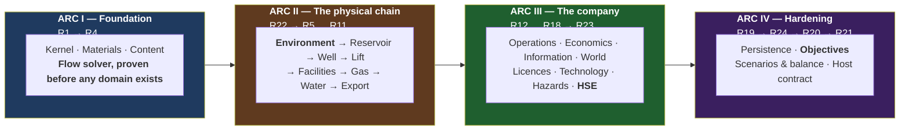

# OGSim — Master Tracker

**The single source of truth for what is designed, what is built, and what is
next.** Updated at the close of every phase.

**Status legend:** ⬜ not started · 🟦 in progress · ✅ complete · ❌ blocked

---

## Current state

| | |
|---|---|
| **Phase** | R0 ✅ closed · R1-C (contract layer) ✅ complete · **R1 🟦 in progress — R1.0 and R1.1 done** |
| **Design docs** | 24 design + 1 research + 25 phase docs, 17 catalogue sheets ([C16 terrain](catalog/C16_TERRAIN_CLASSES.md) newest) + tech tree, 18 SDDs (000–017). Coherence log: **81 findings**, 61–81 from the code passes. |
| **Code status** | **Contract layer complete**: `OGSim.Kernel` (13 files) + `OGSim.Contracts` (14 files) + smoke tests — 0 warnings, 0 errors, **15/15 tests** (verified in this repo, 2026-08-06). Eight review passes (R1-C…C8 below); every member traceable to a pinned SDD section; every 03 §3.2 replaceable slot typed. |
| **Repository** | `The-Tech-Idea/Beep.OilGasSim`, branch `master`. The OGSim tree (`plans/`, `src/`, `tests/`, `OGSim.slnx`, `Directory.Build.props` — 130 files, ~18,700 lines) was **copied in from the workspace it was authored in**; the prior occupant of this repo was removed at the same time. R0 + R1-C therefore have **no commit of their own here** — their first commit in this repository is still pending, and `git log` before it shows only the removed project's history. |
| **Next** | **R1.2 onward** — identity registry, clock, RNG streams, then the log/audit/fault services. `OGSim.Architecture.Tests` (R1.12) is the phase's other half and is not started, so laws L1–L5 and rules D-1…D-8 currently hold by review, not by test. Commit style `R<n>.<m>: <what>` |

> **Phase numbers are stable identifiers, not execution order.** They are assigned
> in the order phases are designed; §"Execution order" below is authoritative for
> sequence. R22 (Environment) executes at the start of Arc II, R23 (HSE) after
> R18, and R24 (Objectives) before R20 — because that is where their dependencies
> place them.

---

## R0 — Design ✅ (closed by owner instruction, 2026-08-06)

| # | Document | Status |
|---|---|---|
| R0.1 | [design/00_VISION.md](design/00_VISION.md) — what the game is | ✅ drafted |
| R0.2 | [design/01_CONCEPT_MATRIX.md](design/01_CONCEPT_MATRIX.md) — every concept, mapped | ✅ drafted |
| R0.3 | [design/02_DOMAIN_MODEL.md](design/02_DOMAIN_MODEL.md) — entities and relationships | ✅ drafted |
| R0.4 | [design/03_ARCHITECTURE.md](design/03_ARCHITECTURE.md) — layers, contracts, composition, tick | ✅ drafted |
| R0.5 | [design/04_MATERIAL_AND_FLOW.md](design/04_MATERIAL_AND_FLOW.md) — the one flow engine | ✅ drafted |
| R0.6 | [design/05_SIMULATION_MODELS.md](design/05_SIMULATION_MODELS.md) — the equation catalogue | ✅ drafted |
| R0.7 | [design/06_WORLD_AND_EXPLORATION.md](design/06_WORLD_AND_EXPLORATION.md) — map, discovery, information | ✅ drafted |
| R0.8 | [design/07_TECHNOLOGY.md](design/07_TECHNOLOGY.md) — the technology graph | ✅ drafted |
| R0.9 | [design/08_ECONOMICS.md](design/08_ECONOMICS.md) — money, fiscal regimes, reserves | ✅ drafted |
| R0.10 | [design/09_DIAGNOSTICS.md](design/09_DIAGNOSTICS.md) — log, audit, fault policy | ✅ drafted |
| R0.11 | [design/10_CONTENT_AND_UNITS.md](design/10_CONTENT_AND_UNITS.md) — data format, units | ✅ drafted |
| R0.12 | [design/11_PERSISTENCE.md](design/11_PERSISTENCE.md) — save, load, determinism | ✅ drafted |
| R0.13 | [design/12_VERIFICATION.md](design/12_VERIFICATION.md) — how each phase proves itself | ✅ drafted |
| R0.14 | [research/PPDM_ALIGNMENT.md](research/PPDM_ALIGNMENT.md) — standards research | ✅ drafted |
| R0.15 | [design/13_ENVIRONMENT.md](design/13_ENVIRONMENT.md) — the operating environment and its effects | ✅ drafted |
| R0.16 | [design/14_HSE.md](design/14_HSE.md) — health, safety, environment as a discipline | ✅ drafted |
| R0.17 | [design/15_TIME_AND_EXECUTION.md](design/15_TIME_AND_EXECUTION.md) — **turn-based engine, real-time-with-pause game** | ✅ drafted |
| R0.18 | [design/16_EVENT_MATRIX.md](design/16_EVENT_MATRIX.md) — every event, trigger, payload, severity | ✅ drafted |
| R0.19 | [design/17_CROSS_IMPACT_MATRIX.md](design/17_CROSS_IMPACT_MATRIX.md) — how everything affects everything; the feedback loops | ✅ drafted |
| R0.20 | [design/18_GAME_MODES.md](design/18_GAME_MODES.md) — objectives, missions, challenges, scenarios, campaign | ✅ drafted |
| R0.21 | [design/19_GLOSSARY.md](design/19_GLOSSARY.md) — naming discipline | ✅ drafted |
| R0.22 | [design/20_PLAYER_DECISIONS.md](design/20_PLAYER_DECISIONS.md) — the decision catalogue and its design test | ✅ drafted |
| R0.23 | [design/21_INTEGRATION.md](design/21_INTEGRATION.md) — **time × events × cross-impact**; propagation delays, loop periods, loop-entry alerts | ✅ drafted |
| R0.24 | [design/22_DESIGN_COHERENCE.md](design/22_DESIGN_COHERENCE.md) — **change-impact map, rule registry, identifier scheme, coherence log** | ✅ drafted |
| R0.25 | Per-phase design documents R1–R25 ([phases/](phases/)) | ✅ drafted |
| R0.26 | Second pass — tick pipeline corrected to 14 stages; docs 00–12 integrated with 13–21 | ✅ done |
| R0.27 | Third pass — identifier scheme unified (18 findings logged); content gaps in 05–11, 19, 20 closed | ✅ done |
| R0.28 | Fourth pass — coherence checks executed; L5 ownership violation fixed; cross-cutting couplings added to 14 phase docs; read-model contract specified (findings 19–27) | ✅ done |
| R0.29 | Fifth pass — Affects/Affected-by coupling headers on all 23 design docs; stale counts, diagram/table disagreement and glossary duplicates fixed (findings 28–31) | ✅ done |
| R0.30 | Sixth pass — **six simulation-logic defects fixed** (findings 32–37): conservation equation completed, solver non-convergence made survivable via the shut-in ladder, stage-4 lag semantics declared, pressure surveys added, integration error bounded, inventory provenance/blending specified | ✅ done |
| R0.31 | Seventh pass — **reality-level system** (finding 38): three accessibility axes, the Advisor as player-side autopilot, presets, profile-stamped scores; PD-D1/D2/D4, I-D5 and D5 resolved into it; phase R25 added | ✅ done |
| R0.32 | **SDD layer** ([sdd/](sdd/)): rolling-wave policy, [SDD-000 engineering standards](sdd/SDD-000_ENGINEERING_STANDARDS.md) (platform, determinism rules D-1..D-8, testing, CI), [SDD-001 kernel contracts](sdd/SDD-001_KERNEL_CONTRACTS.md) (signatures for R1) | 🟦 drafted |
| R0.33 | Eighth pass — **the surface world** (findings 39–40): world generation made discoverable (G16/G17, ownership map); the surface expanded from one pipeline line into the eight-step sub-pipeline of 06 §5.1a — terrain, hydrology, settlements, networks, third-party infrastructure, derived profiles, computed remoteness, slow settlement growth | ✅ done |
| R0.33b | [SDD-002](sdd/SDD-002_STREAMS_AND_FLOW.md) — streams, elements, **the solver algorithm pinned** (damping λ, pro-rata throttling, every tolerance, the ladder) | ✅ drafted |
| R0.33d | [SDD-003](sdd/SDD-003_SUBSURFACE_AND_WELLS.md) — subsurface & wells: **SI forms of every formula**, bisection specs, lift hooks, coning gate | ✅ drafted |
| R0.33e | SDD-000 gains implementation-fidelity rules F-1..F-4 (no unspecified member, no unpinned constant or formula, SDD-first on conflict); SDD-001 gains spatial primitives | ✅ done |
| R0.33s | **Fourth SDD review pass** (finding 60): the gas-lift recycle loop closed with a one-tick lag (the pass's one architectural find); command inventory derived from the decision catalogue; carried interest, operation-level masses, the inspectable-save acceptance, audit-replay data rooms, belief re-keying | ✅ done |
| R0.33r | **Third SDD review pass** (finding 59): the referenced-but-undefined class — `ContentId`, `DisposedMass`, **the double→Money half-even boundary that makes INV2's exactness real**, type-curve-only reserves, the AdvisorView layering fix, scripted entries as commands, and five smaller pins | ✅ done |
| R0.33q | **Second SDD review pass** (finding 58): ten gaps incl. three contradictions — the `IEngine` duplicate, the trig-free `NextNormal` pin, and **the 30/360 calendar decision** unifying the segment grid, weather days, berth calendars and day-rates on one arithmetic; conservation check completed with `Sourced`/`Disposed`; the `Aggregate` predicate node | ✅ done |
| R0.33p | **SDD review pass** (finding 57): nine gaps fixed — day-grid alignment of all stochastic positions, choke decoupling in the solver, power/flare/VRU transforms pinned, SlotKind drift, and the three genuinely uncovered areas closed by [SDD-016](sdd/SDD-016_ENVIRONMENT_RUNTIME.md) (weather as daily AR(1) on the /30 grid), [SDD-017](sdd/SDD-017_HOST_SURFACE.md) (the full host surface + path registry) and SDD-012 §4b (the bow-tie as arithmetic) | ✅ done |
| R0.33o | **The slot system** (finding 56): tech→equipment/material/treatment→effect closed for every unlock kind — `fits` on all unlockables, slot-scoped effects for consumables, C15 catalogue sheet (muds, inhibitors, polymer, CO₂, biocide) | ✅ done |
| R0.33n | Uniformity closed over buildings (finding 55): facility types = templates in JSON, never code; the Support unit family (camps, warehouses, bases, airstrips) — non-stream buildings through the same content/construction/condition machinery | ✅ done |
| R0.33m | **Non-negotiable 11** (finding 54): definition-driven, plugin-first stated as one global rule; the moddability contract table (10 §1b) — content edits for everything, plugins for new behaviour, engine edits for neither | ✅ done |
| R0.33l | SDD-010..015 (world-gen, rivals, hazards, persistence formats, objectives, advisor) — **the SDD set is complete: every build phase has its software design document**; `Rn.0` becomes a review task | ✅ drafted |
| R0.33k | [SDD-008](sdd/SDD-008_INFORMATION_AND_BELIEFS.md) beliefs + [SDD-009](sdd/SDD-009_ECONOMICS_ENGINE.md) economics — the two heaviest formula surfaces pinned: one conjugate update rule, Beta POS, WLS/BIC inference, deterministic VOI; integer double-entry, **the PSC algorithm with mandatory hand-computed fixtures**, UoP depreciation, the reserves/RRR algorithm | ✅ drafted |
| R0.33j | [SDD-006](sdd/SDD-006_FACILITIES_AND_TRANSPORT_ELEMENTS.md) facility/transport transforms + [SDD-007](sdd/SDD-007_OPERATIONS_ENGINE.md) operations engine — Arc II's surface chain and R12 now at signature level; spec-gate proxies, tank backpressure and outcome-draw timing pinned | ✅ drafted |
| R0.33i | [SDD-004](sdd/SDD-004_CONTENT_PIPELINE.md) content pipeline + [SDD-005](sdd/SDD-005_CAPABILITIES_AND_EFFECTS.md) capabilities & effects — the gating/tier/detectability systems of passes 10–11 now at signature level, incl. **the pinned envelope-combination rule** (a design refinement 13 §2.1 had left open); SDD-003 gains the accumulation truth attributes | ✅ drafted |
| R0.33h | **The catalogue layer** (finding 53): 14 per-station equipment sheets + the TECH_TREE gate registry (~50 nodes with era/prereqs/routes/opens) — the authoring spec content JSONs are written from | ✅ drafted |
| R0.33g | Eleventh pass — **geology's tech dimension + full dependency revision** (findings 51–52): detectability D0–D3 and access classes as truth attributes; the re-opening loop; the activity-gating matrix across all operations; `AllCapabilities` as the pre-R17 composition; era-layering guaranteed in world-gen | ✅ done |
| R0.33f | Tenth pass — **the equipment-tier system** (finding 50): technology gates catalogue entries (`requiresTech`); tiers in eleven places, each with its own money, install time and datasheet-borne physics; service route rents gated tiers; SDD-003 pins tier-curve consumption | ✅ done |
| R0.33c | Ninth pass — **full re-read of the simulation core** (02, 04, 05, 07, 08, 11 read line-by-line; findings 41–49): gas-condensate model, coning/standoff physics, the asset market, insurance, two missing hazards, injector abandonment, and an intra-document identifier collision | ✅ done |
| R0.34 | **Gate closed 2026-08-06** — owner instruction: "lets start with code". Open decisions proceed on their recommendations; SDD set 000–017 stands | ✅ closed |
| **R1-C** | **Contract layer built**: `OGSim.slnx` (net10.0, nullable, warnings-as-errors), `OGSim.Kernel` (13 files — quantities, volume types, Money, identity, 30/360 time, RNG streams, log/audit/fault, events, commands, modules/segments/state, streams, effects, spatial) + `OGSim.Contracts` (8 files — flow, subsurface, wells, facilities, capabilities/gating, operations, information, the full `IEngine`/`ReadModel` surface). **Builds clean: 0 warnings, 0 errors; 9/9 smoke tests green.** First rule-F-4 event handled by the book (finding 61: `Stream`→`MaterialStream`). No implementations — signatures, data records and pinned one-liners only | ✅ |
| **R1-C2** | **Second contract pass** (findings 62–66): solver gains `FlowTopology` (elements had no wiring!), `IEffectState` + gating fourth arg, `TickContext.Segments` nullable-until-stage-4, EconomicsContracts + IntegrityContracts + `IPipeline` + `ICommandValidator/Applier`, `Observation`/`IBeliefStore`. SDD-001/002/005 back-annotated. **[23_FUNCTION_MATRIX](design/23_FUNCTION_MATRIX.md)** created: full contract→function→SDD→phase→consumer→pin matrix + dependency/pipeline mermaid graphs. 10/10 smoke tests (incl. an implementability fake for `IFlowElement`) | ✅ |
| **R1-C3** | **Third contract pass** (findings 67–72): commit family `ICommitTarget`+3 (the only mutation path finally has types), `IEngine.WriteSave` + `IEngineFactory`/`EngineSetup` (the host could not save or start!), ContentContracts.cs (non-negotiable 11's front door: catalogues, sources, load failures, `GatedDefinition`, `Era`) + `IModuleRegistry`, `IMigrationStep`, six missing R21 §2.4b read-model projections (compartments, IPR/VLP curves, spec margins, nominations, VOI, FinanceView), `Bg` typed as `FormationVolumeFactor`. SDD-002/003/004/017 back-annotated | ✅ |
| **R1-C4** | **Fourth contract pass** (findings 73–75): `SolveReport` gains its converged state (`ElementSolution`, `CompletionState`) — it was diagnostics-only, leaving the §9 commit step and S0 seeding with no input; exact `Money * long`; `IEventBus.Publish` stamps and returns `EventId`. Kernel files re-audited (Diagnostics/Events/Money line-by-line; issuance patterns now consistent) | ✅ |
| **R1-C5** | **Fifth contract pass** (finding 76, owner-prompted): the last two deferred slots declared — `WorldContracts.cs` (`IWorldGenerator`, `IWorldSink` + typed geology/surface/region handoff records, `IWeatherModel`), SDD-010 §4 / SDD-016 §1 pinned first. **Every 03 §3.2 replaceable slot is now a compiled type**; R15.0/R16.0 demoted from "declare the contract" to "review granularity" | ✅ |
| **R1-C6** | **Sixth contract pass** (findings 77–78): systematic SDD-interface-vs-code diff (all pinned interfaces declared ✓) + line-by-line audit of the last unreviewed kernel files (Identity/Time/Random/Volumes/Spatial/Commands). Caught pass 3 correcting itself: `Bg` re-typed to a new `GasFormationVolumeFactor` (gas bridges to `StandardGasVolume`, never stock-tank); `NextInt` doc sync | ✅ |
| **R1-C7** | **Owner-driven pass** (findings 79–80): `WorldParameters` — the new-world knobs (size, land fraction, richness, maturity, climate severity, rivals, start era), template-scoped, range-checked at `CreateNew`; terrain-class content kind + [C16](catalog/C16_TERRAIN_CLASSES.md) authoring sheet (plains/hills/mountain/desert/rock-plateau/swamp; sea = bathymetry). SDD-004/010 amended; 15/15 tests | ✅ |
| **R1-C8** | **Eighth contract pass** (finding 81): the spatial read surface — `IEngine.World`/`WorldView` (static world beside the per-tick ReadModel; public knowledge only), `Site` coordinates on well/facility views, licence polygons, believed prospect outlines with POS. Found by walking the host's screens against the declared surface; SDD-017 §1c + R21 §2.4b amended | ✅ |

---

## The build plan

Four arcs. **Nothing starts until R0.34 closes.**

**Why the flow solver comes before any domain (R4 before R5):** the solver is the
riskiest single component and the one everything else depends on. Proving it
against synthetic flow elements — before a reservoir or a well exists — means its
correctness is established independently of any domain modelling. If the solver
design is wrong, that is discovered in Arc I and not in Arc III.

---

## Arc I — Foundation

### Phase R1 — Kernel 🟦
> 📄 [phases/R1_KERNEL.md](phases/R1_KERNEL.md)

| # | Task | Status |
|---|---|---|
| R1.0 | **SDD review** ([SDD_INDEX](sdd/SDD_INDEX.md) §1) — SDD-001 and the R1 phase doc read against the committed contract layer. Five drifts corrected under rule F-4 *before* any code: the missing `weather` RNG stream, R1-V19's "across leap years" against a 30/360 calendar, §9's `Segment(double…)`/`AvailabilitySet` block, the undeclared `Area` dimension, and `ILog`'s phantom `EventName`/`LogFields` | ✅ |
| R1.1 | Dimensions, units, `IQuantity`; conversion; nonlinear scales — **plus `DetMath`** (§1.3), the `Area` dimension, the volumetric rate family, the §1.4 spatial algorithms and the §11 fault carriers. 37 kernel tests | ✅ |
| R1.2 | `IEntityId<T>`, `IEntityRegistry`; resolution faults | ⬜ |
| R1.3 | `ISimulationClock` | ⬜ |
| R1.4 | `IRandomSource` with independent per-subsystem streams | ⬜ |
| R1.5 | `ILog` — structured, levelled, nested correlation scopes | ⬜ |
| R1.6 | `IAuditTrail` — append-only, queryable, bounded | ⬜ |
| R1.7 | `IFaultPolicy` — classification, strict and resilient implementations | ⬜ |
| R1.8 | `IEventBus` — outbound only | ⬜ |
| R1.9 | `ICommand`, `ICommandBus` — validate → audit → apply → publish | ⬜ |
| R1.10 | `IModule`, `IModuleRegistry` — declaration, validation, composition failure | ⬜ |
| R1.11 | `IStateSerializer`, `IStateOwner` — registration only | ⬜ |
| R1.12 | Architecture test suite — all 23 checks in [12](design/12_VERIFICATION.md) §2 | ⬜ |
| R1.13 | **`AdvanceTick()` — the turn-based engine surface**; no wall-clock anywhere | ⬜ |
| R1.14 | **Sub-tick segmentation** — fractional positions and durations, 4-segment budget, audited merges | ⬜ |
| R1.15 | Calendar — month, quarter, year, season boundaries; real dates | ⬜ |
| R1.16 | Event taxonomy — categories, severity, stage, loop role, segment-boundary flag, cause chain, **no-subscriber rule** | ⬜ |
| R1.17 | Tick pipeline — the 14 stages of [03](design/03_ARCHITECTURE.md) §6, with per-stage read isolation | ⬜ |
| R1.18 | Deterministic event ordering — `(stage, sub-tick, entity id, event id)` | ⬜ |

### Phase R2 — Materials, properties, streams ⬜
> 📄 [phases/R2_MATERIALS.md](phases/R2_MATERIALS.md)

| # | Task | Status |
|---|---|---|
| R2.1 | `IPropertyKind` catalogue; dimension binding; valid ranges | ⬜ |
| R2.2 | `IProperty` — value, provenance, uncertainty, as-of | ⬜ |
| R2.3 | Distribution types; log-normal product propagation | ⬜ |
| R2.4 | `IMaterial`, `IMaterialCatalog` | ⬜ |
| R2.5 | `IStream` — composition, P, T, phase split, provenance | ⬜ |
| R2.6 | Stream algebra — mix, split, convert; provenance preserved | ⬜ |
| R2.7 | Black-oil property model (`IFluidPropertyModel`) | ⬜ |
| R2.8 | Volume-condition types: rb / stb / scf, non-interchangeable | ⬜ |

### Phase R3 — Content pipeline ⬜
> 📄 [phases/R3_CONTENT.md](phases/R3_CONTENT.md)

| # | Task | Status |
|---|---|---|
| R3.1 | Content format, schema, `"3200 psi"` unit syntax | ⬜ |
| R3.2 | Six-stage validation ([10](design/10_CONTENT_AND_UNITS.md) §3.1) | ⬜ |
| R3.3 | Load report — every failure in the batch | ⬜ |
| R3.4 | `ICatalog<T>` and typed indices | ⬜ |
| R3.5 | Model plugin binding by name | ⬜ |
| R3.6 | Mod loading through the identical path; override and conflict rules | ⬜ |
| R3.7 | Shipped catalogues: materials, property kinds, rock types, fluid systems | ⬜ |

### Phase R4 — Flow solver core ⬜
> 📄 [phases/R4_FLOW_SOLVER.md](phases/R4_FLOW_SOLVER.md)

| # | Task | Status |
|---|---|---|
| R4.1 | `IFlowElement` — ports, constraints, transform, availability | ⬜ |
| R4.2 | Network construction and validation; tree topology | ⬜ |
| R4.3 | Forward propagation and constraint evaluation | ⬜ |
| R4.4 | Throttle and back-propagation to convergence | ⬜ |
| R4.5 | **Bottleneck attribution** — binding element + deferred volume | ⬜ |
| R4.6 | Mass conservation invariant | ⬜ |
| R4.7 | Non-convergence as a fault; tick abandoned whole | ⬜ |
| R4.8 | Synthetic flow elements for testing (source, sink, restrictor, splitter, buffer) | ⬜ |
| R4.9 | FV1–FV13 verification suite ([04](design/04_MATERIAL_AND_FLOW.md) §9) | ⬜ |

---

## Arc II — The physical chain

### Phase R22 — Environment and Setting ⬜  *(executes first in Arc II)*
> 📄 [phases/R22_ENVIRONMENT.md](phases/R22_ENVIRONMENT.md)

| # | Task | Status |
|---|---|---|
| R22.1 | `IEnvironmentProfile` — terrain, water depth, climate, access, ground, sensitivity, utilities | ⬜ |
| R22.2 | Effect application — restrict option / move envelope / change parameter, **shared with technology** | ⬜ |
| R22.3 | `IWeatherModel` — seasonal baseline, stochastic variation, persistence, extremes | ⬜ |
| R22.4 | Within-tick weather profile — days lost, composing with R1.14 segmentation | ⬜ |
| R22.5 | `IForecast` — accuracy declining with horizon | ⬜ |
| R22.6 | Access windows — seasonal availability, opening and closing events | ⬜ |
| R22.7 | Ambient conditions into flow assurance and equipment derating | ⬜ |
| R22.8 | EN1–EN12 verification suite ([13](design/13_ENVIRONMENT.md) §8) | ⬜ |

### Phase R5 — Subsurface ⬜
> 📄 [phases/R5_SUBSURFACE.md](phases/R5_SUBSURFACE.md)

| # | Task | Status |
|---|---|---|
| R5.1 | `IReservoirCompartment` — in-place volumes, pressure, properties | ⬜ |
| R5.2 | `IFluidSystem` — PVT behaviour, bubble point, phase evolution | ⬜ |
| R5.3 | Tank material balance | ⬜ |
| R5.4 | `IDriveMechanism` — six implementations | ⬜ |
| R5.5 | `IAquifer` — influx model | ⬜ |
| R5.6 | Compartment connectivity and transmissibility | ⬜ |
| R5.7 | `p/Z` behaviour for gas — exactly linear when volumetric | ⬜ |
| R5.8 | `IReservoir`, `IField` aggregates | ⬜ |
| R5.9 | Model tests MX3, MB1, MB2 | ⬜ |

### Phase R6 — Wells ⬜
> 📄 [phases/R6_WELLS.md](phases/R6_WELLS.md)

| # | Task | Status |
|---|---|---|
| R6.1 | `IWell` — identity, status machine, classification | ⬜ |
| R6.2 | `IWellbore`, `IWellPath` — geometry, sidetracks | ⬜ |
| R6.3 | `ICompletion` | ⬜ |
| R6.4 | `IPerforation` — reservoir link, isolation, skin | ⬜ |
| R6.5 | `IInflowModel` — Darcy, Vogel, composite, gas back-pressure | ⬜ |
| R6.6 | `IOutflowModel` — hydrostatic, friction, acceleration | ⬜ |
| R6.7 | **Operating point** — IPR ∩ VLP; the well that dies | ⬜ |
| R6.8 | `IWellComponent` — the equipment tree | ⬜ |
| R6.9 | Choke — critical and sub-critical flow | ⬜ |
| R6.10 | Multi-perforation commingling and allocation | ⬜ |
| R6.11 | Model tests MX1, MX2, FV3 | ⬜ |

### Phase R7 — Artificial lift ⬜
> 📄 [phases/R7_LIFT.md](phases/R7_LIFT.md)

| # | Task | Status |
|---|---|---|
| R7.1 | `ILiftMethod` contract and envelope declaration | ⬜ |
| R7.2 | Gas lift | ⬜ |
| R7.3 | ESP — pump curve, power draw, gas sensitivity | ⬜ |
| R7.4 | Rod pump | ⬜ |
| R7.5 | PCP | ⬜ |
| R7.6 | Lift selection advisory (envelope matching) | ⬜ |

### Phase R8 — Facilities and separation ⬜
> 📄 [phases/R8_FACILITIES.md](phases/R8_FACILITIES.md)

| # | Task | Status |
|---|---|---|
| R8.1 | `IFacility` — recursive container, site, cost centre | ⬜ |
| R8.2 | `IFacilityUnit` as `IFlowElement` | ⬜ |
| R8.3 | `ISeparationModel` — split, efficiency, carry-over/under, dual capacity | ⬜ |
| R8.4 | Multi-stage separation | ⬜ |
| R8.5 | Oil treating — treater, desalter, stabiliser | ⬜ |
| R8.6 | `ITank` — inventory, ullage, **backpressure when full** | ⬜ |
| R8.7 | `ISpecification` — the spec gate | ⬜ |
| R8.8 | `IPowerSource` and the power balance | ⬜ |
| R8.9 | Manifold, commingling, provenance-preserving mixing | ⬜ |
| R8.10 | Flowlines | ⬜ |

### Phase R9 — Gas processing ⬜
> 📄 [phases/R9_GAS.md](phases/R9_GAS.md)

| # | Task | Status |
|---|---|---|
| R9.1 | `ICompressionModel` — staged, polytropic, power | ⬜ |
| R9.2 | Dehydration | ⬜ |
| R9.3 | Sweetening; sulphur by-product | ⬜ |
| R9.4 | NGL extraction and component split | ⬜ |
| R9.5 | Flare — emissions, penalty, **and the oil cap when flaring is limited** | ⬜ |
| R9.6 | Gas re-injection path | ⬜ |
| R9.7 | Sales gas specification gate | ⬜ |
| R9.8 | Model tests MX6, SC3 | ⬜ |

### Phase R10 — Water handling ⬜
> 📄 [phases/R10_WATER.md](phases/R10_WATER.md)

| # | Task | Status |
|---|---|---|
| R10.1 | Water treatment units | ⬜ |
| R10.2 | Injection and disposal wells; injectivity | ⬜ |
| R10.3 | Pressure support coupling back to the compartment | ⬜ |
| R10.4 | Waterflood as an `IDriveMechanism` | ⬜ |
| R10.5 | Water cut S-curve; SC4 | ⬜ |

### Phase R11 — Transport and export ⬜
> 📄 [phases/R11_TRANSPORT.md](phases/R11_TRANSPORT.md)

| # | Task | Status |
|---|---|---|
| R11.1 | `IPipeline`; `IHydraulicModel` — Darcy-Weisbach and Panhandle | ⬜ |
| R11.2 | Pump and compressor stations | ⬜ |
| R11.3 | Linefill and inventory in transit | ⬜ |
| R11.4 | Flow-assurance risk flags — hydrate, wax, corrosion, erosion | ⬜ |
| R11.5 | Terminal, tank farm | ⬜ |
| R11.6 | `IBerth`, `ICargo` — scheduling, laytime, demurrage | ⬜ |
| R11.7 | `ICustodyTransferPoint` — metering, spec gate, the revenue event | ⬜ |
| R11.8 | Third-party transport contracts and tariffs | ⬜ |
| R11.9 | Model tests MX4, MX5; SC8 | ⬜ |

---

## Arc III — The company

### Phase R12 — Operations and scheduling ⬜
> 📄 [phases/R12_OPERATIONS.md](phases/R12_OPERATIONS.md)

| # | Task | Status |
|---|---|---|
| R12.1 | `IOperation` — duration, cost profile, resources, prerequisites, outcome | ⬜ |
| R12.2 | Scheduler; resource contention | ⬜ |
| R12.3 | `IRig` — contracting, day rate, availability | ⬜ |
| R12.4 | Drilling operations; depth progress; hazards | ⬜ |
| R12.5 | Completion and workover operations | ⬜ |
| R12.6 | Construction operations | ⬜ |
| R12.7 | `IPersonnel` — disciplines, skill, effect on duration and risk | ⬜ |
| R12.8 | Abandonment operations | ⬜ |

### Phase R13 — Economics ⬜
> 📄 [phases/R13_ECONOMICS.md](phases/R13_ECONOMICS.md)

| # | Task | Status |
|---|---|---|
| R13.1 | `ICostLedger` — CAPEX, OPEX, accrual; cash conservation invariant | ⬜ |
| R13.2 | `IPriceModel` plugins; quality and location differentials | ⬜ |
| R13.3 | `ISalesContract` — spot, term, take-or-pay, hedge | ⬜ |
| R13.4 | `IFiscalRegime` — royalty/tax, PSC, service, sliding scale | ⬜ |
| R13.5 | `ITreasury` — cash, debt, equity, reserve-based lending | ⬜ |
| R13.6 | P&L and balance sheet | ⬜ |
| R13.7 | `IReservesBooking` — 1P/2P/3P, contingent; **RRR** | ⬜ |
| R13.8 | Economic limit detection; abandonment provision accrual | ⬜ |
| R13.9 | `IWorkingInterest`; farm-outs | ⬜ |
| R13.10 | Insolvency and restructuring | ⬜ |
| R13.11 | SC6 | ⬜ |

### Phase R14 — Information and uncertainty ⬜
> 📄 [phases/R14_INFORMATION.md](phases/R14_INFORMATION.md)

| # | Task | Status |
|---|---|---|
| R14.1 | `ITruthModel` — **internal to the assembly**, architecture-tested | ⬜ |
| R14.2 | `IBelief<T>` — prior, posterior, Bayesian update | ⬜ |
| R14.3 | `IInformationSource` and `IObservationModel` | ⬜ |
| R14.4 | Seismic surveys — 2-D, 3-D, 4-D; **observation tiers define the detectable set (D0–D3); re-screening and re-processing** | ⬜ |
| R14.5 | Well logs, cores, well tests, **pressure build-up surveys** (cost = the shut-in itself) | ⬜ |
| R14.6 | Production-history inference; the `p/Z` deduction | ⬜ |
| R14.7 | `IRiskFactorSet` — the five-element POS | ⬜ |
| R14.8 | `IVolumetricEstimate` — P10/P50/P90 | ⬜ |
| R14.9 | Value-of-information computation | ⬜ |
| R14.10 | Play-level belief correlation | ⬜ |

### Phase R15 — World generation ⬜
> 📄 [phases/R15_WORLD.md](phases/R15_WORLD.md)

| # | Task | Status |
|---|---|---|
| R15.1 | `IWorldGenerator`; the eleven-step pipeline | ⬜ |
| R15.2 | Tectonic setting, stratigraphy | ⬜ |
| R15.3 | **Burial and thermal history** — the oil/gas/barren switch | ⬜ |
| R15.4 | Structure, traps, migration, charge | ⬜ |
| R15.5 | Accumulations; log-normal size distribution | ⬜ |
| R15.6 | Plays and prospects; correlation structure; **detectability/accessibility class assignment with era-layering bands** | ⬜ |
| R15.7a | Surface: terrain and hydrology — elevation, terrain classes, rivers, coastline, **bathymetry** | ⬜ |
| R15.7b | Surface: settlements — siting logic, population, **slow growth responding to employment** | ⬜ |
| R15.7c | Surface: transport network, utilities, **third-party infrastructure with tariffs**; computed remoteness | ⬜ |
| R15.7d | Surface: land status → sensitivity; **environment profiles derived, not authored** (9.8) | ⬜ |
| R15.8 | Jurisdictions | ⬜ |
| R15.9 | Initial beliefs | ⬜ |
| R15.10 | Determinism test PV7; band tests MB4, MB5 | ⬜ |

### Phase R16 — Company, licences, regulation ⬜
> 📄 [phases/R16_COMPANY.md](phases/R16_COMPANY.md)

| # | Task | Status |
|---|---|---|
| R16.1 | `ICompany` | ⬜ |
| R16.2 | `ILicence` — term, work commitment, relinquishment clock | ⬜ |
| R16.3 | Licence rounds and bidding | ⬜ |
| R16.4 | Rival operators; their results as public data | ⬜ |
| R16.5 | `IRegulator` — inspections, penalties, licence risk | ⬜ |
| R16.6 | Jurisdiction rule set — emissions caps, flaring rules, discharge standards *(the state they constrain is R23's)* | ⬜ |
| R16.7 | Flaring caps and their production consequence | ⬜ |

### Phase R17 — Technology ⬜
> 📄 [phases/R17_TECHNOLOGY.md](phases/R17_TECHNOLOGY.md)

| # | Task | Status |
|---|---|---|
| R17.1 | `ITechnology` as content; effect kinds | ⬜ |
| R17.2 | Model-swap, envelope-extension and option-unlock effects | ⬜ |
| R17.3 | Four acquisition routes | ⬜ |
| R17.4 | Ongoing technology costs | ⬜ |
| R17.5 | The shipped technology graph | ⬜ |
| R17.6 | Era gating | ⬜ |
| R17.7 | **Catalogue gating** — `requiresTech`/`availableFromEra` on equipment entries; install-command validation; service-route rental of gated tiers | ⬜ |

### Phase R18 — Degradation, hazards, maintenance ⬜
> 📄 [phases/R18_HAZARDS.md](phases/R18_HAZARDS.md)

| # | Task | Status |
|---|---|---|
| R18.1 | `IDegradationModel` — severity-weighted condition decay | ⬜ |
| R18.2 | `IHazardModel` — condition-driven failure rates | ⬜ |
| R18.3 | Incident types and consequences | ⬜ |
| R18.4 | Maintenance strategies — run-to-failure, scheduled, condition-based | ⬜ |
| R18.5 | Availability feeding tick stage 4 | ⬜ |
| R18.6 | SC7 | ⬜ |

### Phase R23 — Health, Safety and Environment ⬜  *(executes after R18)*
> 📄 [phases/R23_HSE.md](phases/R23_HSE.md)

| # | Task | Status |
|---|---|---|
| R23.1 | `IBarrier`, barrier sets, **strength derived from equipment condition** | ⬜ |
| R23.2 | Bow-tie evaluation — threats → preventive → top event → mitigating → consequences | ⬜ |
| R23.3 | Incident tiers and consequences; response and investigation operations | ⬜ |
| R23.4 | **Near-miss generation** — the free warning | ⬜ |
| R23.5 | Personal and process safety, tracked separately | ⬜ |
| R23.6 | Health hazards; fatigue coupled to R12 crew configuration | ⬜ |
| R23.7 | `IEmissionsLedger` — CO₂, methane, flaring, SOx/NOx, VOC; carbon price | ⬜ |
| R23.8 | Discharges, waste, spills with sensitivity multiplier | ⬜ |
| R23.9 | Induced seismicity from disposal volumes | ⬜ |
| R23.10 | `ISocialLicence` — drivers and effects on permits and access | ⬜ |
| R23.11 | ESG standing → cost of capital coupling | ⬜ |
| R23.12 | HS1–HS14 verification suite ([14](design/14_HSE.md) §10) | ⬜ |

---

## Arc IV — Hardening

### Phase R19 — Persistence and determinism ⬜
> 📄 [phases/R19_PERSISTENCE.md](phases/R19_PERSISTENCE.md)

| # | Task | Status |
|---|---|---|
| R19.1 | Save format, header, module blocks | ⬜ |
| R19.2 | Restore ordering from declared dependencies | ⬜ |
| R19.3 | Migration chain and fixtures | ⬜ |
| R19.4 | Audit trail persistence and summarisation | ⬜ |
| R19.5 | PV1–PV8 verification suite | ⬜ |
| R19.6 | Cross-platform determinism in CI | ⬜ |

### Phase R24 — Objectives, Challenges and Missions ⬜  *(executes before R20)*
> 📄 [phases/R24_OBJECTIVES.md](phases/R24_OBJECTIVES.md)

| # | Task | Status |
|---|---|---|
| R24.1 | `IObjective` — predicate, target, deadline, weight, kind, visibility | ⬜ |
| R24.2 | Predicate vocabulary across nine domains, reading **only the read model** | ⬜ |
| R24.3 | Combinators — `all-of`, `any-of`, `sequence`, `count-of-N`, `sustained-for`, `never` | ⬜ |
| R24.4 | Evaluation at tick stage 12 against sealed state — **observe, never influence** | ⬜ |
| R24.5 | Deadlines, expiry, failure conditions, progress events | ⬜ |
| R24.6 | The eight scoring dimensions and the composite | ⬜ |
| R24.7 | `IScenario` and `ICampaign` — loading, declared persistence, branching | ⬜ |
| R24.8 | Modifier application, reusing fidelity/model/content selection | ⬜ |
| R24.9 | GM1–GM13 verification suite ([18](design/18_GAME_MODES.md) §7) | ⬜ |

### Phase R20 — Scenarios and balance ⬜
> 📄 [phases/R20_SCENARIOS.md](phases/R20_SCENARIOS.md)

| # | Task | Status |
|---|---|---|
| R20.1 | SC1 — the full-lifecycle acceptance test | ⬜ |
| R20.2 | SC2, SC5, SC9, SC10 | ⬜ |
| R20.3 | Calibration CAL1–CAL10 | ⬜ |
| R20.4 | Balance content pass | ⬜ |
| R20.5 | The twelve missions ([18](design/18_GAME_MODES.md) §3.2) as content | ⬜ |
| R20.6 | The ten challenge patterns ([18](design/18_GAME_MODES.md) §3.3) as content | ⬜ |
| R20.7 | Four-era campaign chapters ([18](design/18_GAME_MODES.md) §3.5) | ⬜ |
| R20.8 | CI-V1–CI-V13 — the cross-impact and feedback-loop suite ([17](design/17_CROSS_IMPACT_MATRIX.md) §7) | ⬜ |
| R20.9 | PD1–PD7 — the decision-catalogue suite ([20](design/20_PLAYER_DECISIONS.md) §8) | ⬜ |
| R20.10 | I-V1–I-V16 — the **integration** suite ([21](design/21_INTEGRATION.md) §8) | ⬜ |
| R20.11 | SC11–SC13 — hostile environment, HSE neglect, slow-loop visibility | ⬜ |
| R20.12 | Coherence checks ([22](design/22_DESIGN_COHERENCE.md) §6.1) scripted in CI | ⬜ |

### Phase R21 — Host contract ⬜
> 📄 [phases/R21_HOST.md](phases/R21_HOST.md)

| # | Task | Status |
|---|---|---|
| R21.1 | Immutable read model published at tick close | ⬜ |
| R21.2 | Command submission surface | ⬜ |
| R21.3 | Audit query surface — the player-facing "why?" | ⬜ |
| R21.4 | Belief and uncertainty projection for map rendering | ⬜ |
| R21.5 | Reference headless client proving the contract is sufficient | ⬜ |
| R21.6 | The 16 required read-model projections ([R21](phases/R21_HOST.md) §2.4b) | ⬜ |

---

### Phase R25 — Advisor and Reality Profiles ⬜  *(executes after R21)*
> 📄 [phases/R25_ADVISOR.md](phases/R25_ADVISOR.md)

| # | Task | Status |
|---|---|---|
| R25.1 | `IRealityProfile` content — fidelity × Advisor levels × forgiveness × alert profile | ⬜ |
| R25.2 | `OGSim.Advisor` — reads only the R21 surface, acts only through the command bus | ⬜ |
| R25.3 | Per-domain assist levels — Manual / Advise / Confirm / Auto, changeable mid-game | ⬜ |
| R25.4 | Recommendation reasoning — every proposal carries its "why" in domain terms | ⬜ |
| R25.5 | The judgement cap — exploration and sanction decisions never exceed *Advise* | ⬜ |
| R25.6 | Forgiveness levers wired to model/content selection | ⬜ |
| R25.7 | Presets Story / Tycoon / Engineer / Simulation / Custom | ⬜ |
| R25.8 | Score stamping and mid-game preset changes logged | ⬜ |
| R25.9 | GM14–GM17 verification | ⬜ |

## Execution order

**Authoritative sequence.** Phase numbers are stable identifiers; this is the
order they are built in.

| # | Phase | Arc | Why here |
|---|---|---|---|
| 1 | R1 Kernel | I | Everything depends on it. The laws, the clock, the tick, events |
| 2 | R2 Materials | I | The three abstractions the flow engine is built from |
| 3 | R3 Content | I | Early, so every later phase is content-driven from its first commit |
| 4 | R4 Flow solver | I | **Proven against synthetic elements before any domain exists** |
| 5 | **R22 Environment** | II | Facilities, transport, operations and world-gen all read a setting |
| 6 | R5 Subsurface | II | Where the material comes from |
| 7 | R6 Wells | II | The connection; the operating point |
| 8 | R7 Lift | II | The answer to R6's dead well |
| 9 | R8 Facilities | II | Separation, treating, tanks, specs |
| 10 | R9 Gas | II | The longest chain; the flaring cap |
| 11 | R10 Water | II | The late-game villain and its counterweight |
| 12 | R11 Transport | II | **Completes the chain: reservoir → berth** |
| 13 | R12 Operations | III | Everything now takes time, money and a resource |
| 14 | R13 Economics | III | Closes custody → cash → the next well |
| 15 | R14 Information | III | Truth and belief separate; the exploration game begins |
| 16 | R15 World | III | The world to explore |
| 17 | R16 Company | III | Licences, rivals, regulation |
| 18 | R17 Technology | III | Capability as a procurement decision |
| 19 | R18 Hazards | III | Condition, failure, maintenance strategy |
| 20 | **R23 HSE** | III | Needs R18's condition model and R16's regulator |
| 21 | R19 Persistence | IV | Every module has been registering state since R1 |
| 22 | **R24 Objectives** | IV | R20's scenarios are built *on* this |
| 23 | R20 Scenarios | IV | **SC1 — the acceptance test for the whole engine** |
| 24 | R21 Host contract | IV | Formalise the boundary; prove it with a reference client |
| 25 | **R25 Advisor & reality profiles** | IV | Consumes the R21 surface; the reference client generalises into the Advisor |

## Summary

| Arc | Phases (execution order) | Focus | Gate |
|---|---|---|---|
| **0** | R0 | Design | Owner approval |
| **I** | R1 → R2 → R3 → R4 | Kernel, materials, content, **solver proven standalone** | FV1–FV13 pass with synthetic elements |
| **II** | R22 → R5 → R6 → R7 → R8 → R9 → R10 → R11 | Environment, then the physical chain reservoir to berth | SC3, SC4, SC8 pass; R11-V13 whole-chain conservation |
| **III** | R12 → R13 → R14 → R15 → R16 → R17 → R18 → R23 | The company: operations, money, information, world, tech, risk | SC6, SC7 pass; HS3 holds |
| **IV** | R19 → R24 → R20 → R21 → R25 | Persistence, objectives, balance, host contract, **Advisor & reality profiles** | **SC1 passes; GM15 Advisor purity holds** |

---

## §5 — Open decisions awaiting the owner

Consolidated from every design document. Each names a recommendation; where a
document had to assume, it assumed the recommendation and said so.

| Ref | Decision | Recommendation |
|---|---|---|
| [D1](design/00_VISION.md) | Time step | Monthly |
| [D2](design/00_VISION.md) | World scope | Several fictional basins |
| [D3](design/00_VISION.md) | Offshore | Onshore first; offshore as an expansion |
| [D4](design/00_VISION.md) | Competitors | AI rivals bidding and drilling |
| [D5](design/00_VISION.md) | Fidelity dial | Per-model, selectable |
| [M1](design/02_DOMAIN_MODEL.md) | Compartment discovery | Inferred from data, not given |
| [M2](design/02_DOMAIN_MODEL.md) | Property representation | Full distributions |
| [M3](design/02_DOMAIN_MODEL.md) | Well component granularity | ~8 kinds, extensible by content |
| [M4](design/02_DOMAIN_MODEL.md) | Commingling | Available from the start |
| [M5](design/02_DOMAIN_MODEL.md) | Working interests | From the start |
| [A1](design/03_ARCHITECTURE.md) | Command application | Queued with effective date |
| [A2](design/03_ARCHITECTURE.md) | Read model | Full snapshot per tick |
| [AD3](design/03_ARCHITECTURE.md) | Solver failure | ✅ Resolved: the physical shut-in ladder ([04](design/04_MATERIAL_AND_FLOW.md) §4.0b) — abandonment made the game un-continuable |
| [A4](design/03_ARCHITECTURE.md) | Module granularity | The eleven listed |
| [A5](design/03_ARCHITECTURE.md) | Parallelism | Fully sequential |
| [F1](design/04_MATERIAL_AND_FLOW.md) | Solver method | Forward-propagate and throttle |
| [F2](design/04_MATERIAL_AND_FLOW.md) | Phase behaviour | Black oil, component split at NGL only |
| [F3](design/04_MATERIAL_AND_FLOW.md) | Intra-tick resolution | One steady-state solve |
| [F4](design/04_MATERIAL_AND_FLOW.md) | Network topology | Tree-only first |
| [F5](design/04_MATERIAL_AND_FLOW.md) | Metering | Small realistic error |
| [S1–S5](design/05_SIMULATION_MODELS.md) | Correlations, uncertainty, layers, temperature, sand | See document |
| [W1–W6](design/06_WORLD_AND_EXPLORATION.md) | Map, basins, interpretation, rivals, geography, POS display | See document |
| [T1–T4](design/07_TECHNOLOGY.md) | Eras, rival tech, research direction, obsolescence | See document |
| [E1–E5](design/08_ECONOMICS.md) | Accounting depth, insolvency, currency, inflation, reserves booking | See document |
| [G1–G5](design/09_DIAGNOSTICS.md) | Audit persistence, invariants, sinks, granularity, release policy | See document |
| [C1–C5](design/10_CONTENT_AND_UNITS.md) | Format, unit syntax, schema, location, localisation | See document |
| [P1–P4](design/11_PERSISTENCE.md) | Save format, truth persistence, autosave, ironman | See document |
| [EV1–EV5](design/13_ENVIRONMENT.md) | Weather granularity, offshore scope, climate drift, environment reveals, induced seismicity | See document |
| [HS-D1–HS-D5](design/14_HSE.md) | Fatalities, barrier granularity, carbon pricing, social licence, HSE fidelity | See document |
| [TM-D1–TM-D5](design/15_TIME_AND_EXECUTION.md) | Tick length, segment budget, turn-based option, auto-pause defaults, real dates | See document |
| [EM-D1–EM-D4](design/16_EVENT_MATRIX.md) | Event volume, history, custom alerts, grouping | See document |
| [CI-D1–CI-D3](design/17_CROSS_IMPACT_MATRIX.md) | Loop visibility, coupling strengths, lag lengths | See document |
| [GM-D1–GM-D6](design/18_GAME_MODES.md) | Campaign structure, leaderboards, objective visibility, mission count, narrative, editor | See document |
| [PD-D1–PD-D4](design/20_PLAYER_DECISIONS.md) | Automation, decision support, undo, difficulty via decision count | See document |

**Superseded:** open decision **D1** (time step) is now answered in
[15_TIME_AND_EXECUTION](design/15_TIME_AND_EXECUTION.md) — the engine is
turn-based, the game is real-time-with-pause, the tick is monthly. **D3**
(offshore) is superseded by **EV2** — onshore plus shallow offshore at v1.

**Highest-impact decisions**, if the owner wants to answer only a few:

| Ref | Question | Recommendation |
|---|---|---|
| **TM-D1** | Tick length | Monthly |
| **EV2** | Offshore scope at v1 | Onshore + shallow offshore |
| **F1** | Solver method | Forward-propagate and throttle |
| **E1** | Accounting depth | Full accrual, with a balance sheet |
| **C2** | Unit syntax in content | Inline — `"3200 psi"` |
| **HS-D1** | Fatalities modelled | Yes, soberly, never scored |
| **GM-D1** | Campaign structure | Linked era chapters, persistent company |

Everything else can proceed on its recommendation.

---

## Conventions

- **Phases are append-only.** Numbers are stable references; new work is added at
  the bottom rather than renumbering.
- **Commits:** `Phase R<n>.<m>: <what>` and a follow-up `Phase R<n>.<m> docs:`
  ticking the tracker row.
- **Every phase's first task is its SDD** (`Rn.0`, per
  [sdd/SDD_INDEX.md](sdd/SDD_INDEX.md)): signatures and algorithms reviewed on
  paper before implementation. Foundation SDDs (000–002) precede R1 entirely.
- **A phase is complete only when all seven gates in
  [12_VERIFICATION](design/12_VERIFICATION.md) §6 hold.**
- **No phase introduces a stub, a fallback, a default dependency or a swallowed
  exception.** If a phase appears to need one, that is a design gap — reopen the
  design document, do not work around it.
