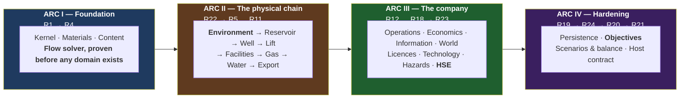

# OGSim — Master Tracker

**The single source of truth for what is designed, what is built, and what is
next.** Updated at the close of every phase.

**Status legend:** ⬜ not started · 🟦 in progress · ✅ complete · ❌ blocked

> **Two axes, and for a long time only one of them was tracked.** A phase mark
> says its models are **built and tested against their SDD**. It says nothing
> about whether the running engine **uses** them — and for eight subsystems the
> answer is currently no. Facilities, gas, water and transport are complete and
> bypassed; the belief store is complete and unused. **[R20d](#phase-r20d)** is
> where that second axis lives. A subsystem is not in the game until it has a
> mark there.

---

## Current state

| | |
|---|---|
| **Phase** | R0–R19, R23, R24 ✅ · **R21a–d ✅ — the engine is played** · R20c, R12b, R20d, R21 🟨 · R20, R22, R25 ⬜. The composite programme is one document: [phases/R20d_INTEGRATION.md](phases/R20d_INTEGRATION.md) |
| **Design docs** | 24 design + 1 research + **26 phase docs**, 17 catalogue sheets + tech tree, 18 SDDs (000–017). Coherence log: **163 findings**, 61–163 from the code passes. **51 open SDD items** now registered here rather than only in the documents that raised them. |
| **Code status** | 15 engine assemblies, 0 warnings, 0 errors, **851 tests**. The kernel, the contract layer, eleven domain modules and Layer 4 composition are implemented; scenario, activity-mass, VOI, lending and souring contracts are declared in their SDDs and compiled. The composed engine **advances a tick and plays**: a player drills, waits, finds oil or doesn't, produces, declines, and wins or goes broke. Every implemented member traces to a pinned SDD section (F-1). |
| **Repository** | `The-Tech-Idea/Beep.OilGasSim`, branch `master`. Work lands directly on `master`, one task per commit. |
| **The playable loop** | **arrive → commit capital under uncertainty → wait four months → find oil or don't → produce through the chain → decline → reinvest → win or go broke.** Six of the fourteen tick stages are real (3, 5, 6, 8, 12, 13). One command, one product, one goal, one failure condition. |
| **Balance note** | With a $8M well earning far more per month than it costs, **cash is not the binding constraint on early expansion — the rig is.** Reaching a cash refusal takes ~140 months of idling. That is a real observation about the shipped numbers and belongs to R20.4, not a defect. |
| **Next** | **Water's surface half, then transport (R20d.4–5).** Produced water is accounted at the compartment and the separator's water leg goes nowhere — it needs a disposal or injection point, and an injector closes the loop that makes water drive a decision rather than weather. Then transport, and more arcade implementations of §3.2's slots (S005-3).  Behind that: The scouting pass is done and recorded (finding 162): a well produces one material because nothing ever said what else comes up the hole, gas needs an air-density constant `PhysicalConstants` does not have, and water has no source because nothing computes a water cut. **Three SDD amendments before any code** — which is this phase's own lesson, applied in advance rather than discovered mid-wire.  Behind that: R20d.1 is done — **there is now one system for moving material.** Stage 4 plans, stage 5 solves the network, stage 6 commits, stage 7 meters, stage 8 prices what crossed; `WellsState.ProduceOver`, the second path, is deleted rather than bypassed. Adding equipment is adding an element to that network. What is bypassed still: the gas legs and water leg of the separator go nowhere (one material), there is no flowline, no tank, no treating, and the sales spec is empty because nothing can be off-spec yet. Each is an element and a material, not a new mechanism. |

**Three things are true at once and all three should stay visible.** The engine
is architecturally complete to its own laws — every manifest promise checked,
the truth boundary an assembly boundary, determinism mechanically enforced. The
gameplay loop is real end to end, with no stubbed step. And the *content* is a
single hand-built field with a single hand-built well: what exists is a spine,
not a game with things in it.

> **Phase numbers are stable identifiers, not execution order.** They are assigned
> in the order phases are designed; §"Execution order" below is authoritative for
> sequence. R22 (Environment) executes at the start of Arc II, R23 (HSE) after
> R18, and R24 (Objectives) before R20 — because that is where their dependencies
> place them.

---

## R0 — Design ✅ (closed by owner instruction, 2026-08-06)

| # | Document | Status |
|---|---|---|
| R0.1 | [design/00_VISION.md](design/00_VISION.md) — what the game is | ✅ drafted |
| R0.2 | [design/01_CONCEPT_MATRIX.md](design/01_CONCEPT_MATRIX.md) — every concept, mapped | ✅ drafted |
| R0.3 | [design/02_DOMAIN_MODEL.md](design/02_DOMAIN_MODEL.md) — entities and relationships | ✅ drafted |
| R0.4 | [design/03_ARCHITECTURE.md](design/03_ARCHITECTURE.md) — layers, contracts, composition, tick | ✅ drafted |
| R0.5 | [design/04_MATERIAL_AND_FLOW.md](design/04_MATERIAL_AND_FLOW.md) — the one flow engine | ✅ drafted |
| R0.6 | [design/05_SIMULATION_MODELS.md](design/05_SIMULATION_MODELS.md) — the equation catalogue | ✅ drafted |
| R0.7 | [design/06_WORLD_AND_EXPLORATION.md](design/06_WORLD_AND_EXPLORATION.md) — map, discovery, information | ✅ drafted |
| R0.8 | [design/07_TECHNOLOGY.md](design/07_TECHNOLOGY.md) — the technology graph | ✅ drafted |
| R0.9 | [design/08_ECONOMICS.md](design/08_ECONOMICS.md) — money, fiscal regimes, reserves | ✅ drafted |
| R0.10 | [design/09_DIAGNOSTICS.md](design/09_DIAGNOSTICS.md) — log, audit, fault policy | ✅ drafted |
| R0.11 | [design/10_CONTENT_AND_UNITS.md](design/10_CONTENT_AND_UNITS.md) — data format, units | ✅ drafted |
| R0.12 | [design/11_PERSISTENCE.md](design/11_PERSISTENCE.md) — save, load, determinism | ✅ drafted |
| R0.13 | [design/12_VERIFICATION.md](design/12_VERIFICATION.md) — how each phase proves itself | ✅ drafted |
| R0.14 | [research/PPDM_ALIGNMENT.md](research/PPDM_ALIGNMENT.md) — standards research | ✅ drafted |
| R0.15 | [design/13_ENVIRONMENT.md](design/13_ENVIRONMENT.md) — the operating environment and its effects | ✅ drafted |
| R0.16 | [design/14_HSE.md](design/14_HSE.md) — health, safety, environment as a discipline | ✅ drafted |
| R0.17 | [design/15_TIME_AND_EXECUTION.md](design/15_TIME_AND_EXECUTION.md) — **turn-based engine, real-time-with-pause game** | ✅ drafted |
| R0.18 | [design/16_EVENT_MATRIX.md](design/16_EVENT_MATRIX.md) — every event, trigger, payload, severity | ✅ drafted |
| R0.19 | [design/17_CROSS_IMPACT_MATRIX.md](design/17_CROSS_IMPACT_MATRIX.md) — how everything affects everything; the feedback loops | ✅ drafted |
| R0.20 | [design/18_GAME_MODES.md](design/18_GAME_MODES.md) — objectives, missions, challenges, scenarios, campaign | ✅ drafted |
| R0.21 | [design/19_GLOSSARY.md](design/19_GLOSSARY.md) — naming discipline | ✅ drafted |
| R0.22 | [design/20_PLAYER_DECISIONS.md](design/20_PLAYER_DECISIONS.md) — the decision catalogue and its design test | ✅ drafted |
| R0.23 | [design/21_INTEGRATION.md](design/21_INTEGRATION.md) — **time × events × cross-impact**; propagation delays, loop periods, loop-entry alerts | ✅ drafted |
| R0.24 | [design/22_DESIGN_COHERENCE.md](design/22_DESIGN_COHERENCE.md) — **change-impact map, rule registry, identifier scheme, coherence log** | ✅ drafted |
| R0.25 | Per-phase design documents R1–R25 ([phases/](phases/)) | ✅ drafted |
| R0.26 | Second pass — tick pipeline corrected to 14 stages; docs 00–12 integrated with 13–21 | ✅ done |
| R0.27 | Third pass — identifier scheme unified (18 findings logged); content gaps in 05–11, 19, 20 closed | ✅ done |
| R0.28 | Fourth pass — coherence checks executed; L5 ownership violation fixed; cross-cutting couplings added to 14 phase docs; read-model contract specified (findings 19–27) | ✅ done |
| R0.29 | Fifth pass — Affects/Affected-by coupling headers on all 23 design docs; stale counts, diagram/table disagreement and glossary duplicates fixed (findings 28–31) | ✅ done |
| R0.30 | Sixth pass — **six simulation-logic defects fixed** (findings 32–37): conservation equation completed, solver non-convergence made survivable via the shut-in ladder, stage-4 lag semantics declared, pressure surveys added, integration error bounded, inventory provenance/blending specified | ✅ done |
| R0.31 | Seventh pass — **reality-level system** (finding 38): three accessibility axes, the Advisor as player-side autopilot, presets, profile-stamped scores; PD-D1/D2/D4, I-D5 and D5 resolved into it; phase R25 added | ✅ done |
| R0.32 | **SDD layer** ([sdd/](sdd/)): rolling-wave policy, [SDD-000 engineering standards](sdd/SDD-000_ENGINEERING_STANDARDS.md) (platform, determinism rules D-1..D-8, testing, CI), [SDD-001 kernel contracts](sdd/SDD-001_KERNEL_CONTRACTS.md) (signatures for R1) | 🟦 drafted |
| R0.33 | Eighth pass — **the surface world** (findings 39–40): world generation made discoverable (G16/G17, ownership map); the surface expanded from one pipeline line into the eight-step sub-pipeline of 06 §5.1a — terrain, hydrology, settlements, networks, third-party infrastructure, derived profiles, computed remoteness, slow settlement growth | ✅ done |
| R0.33b | [SDD-002](sdd/SDD-002_STREAMS_AND_FLOW.md) — streams, elements, **the solver algorithm pinned** (damping λ, pro-rata throttling, every tolerance, the ladder) | ✅ drafted |
| R0.33d | [SDD-003](sdd/SDD-003_SUBSURFACE_AND_WELLS.md) — subsurface & wells: **SI forms of every formula**, bisection specs, lift hooks, coning gate | ✅ drafted |
| R0.33e | SDD-000 gains implementation-fidelity rules F-1..F-4 (no unspecified member, no unpinned constant or formula, SDD-first on conflict); SDD-001 gains spatial primitives | ✅ done |
| R0.33s | **Fourth SDD review pass** (finding 60): the gas-lift recycle loop closed with a one-tick lag (the pass's one architectural find); command inventory derived from the decision catalogue; carried interest, operation-level masses, the inspectable-save acceptance, audit-replay data rooms, belief re-keying | ✅ done |
| R0.33r | **Third SDD review pass** (finding 59): the referenced-but-undefined class — `ContentId`, `DisposedMass`, **the double→Money half-even boundary that makes INV2's exactness real**, type-curve-only reserves, the AdvisorView layering fix, scripted entries as commands, and five smaller pins | ✅ done |
| R0.33q | **Second SDD review pass** (finding 58): ten gaps incl. three contradictions — the `IEngine` duplicate, the trig-free `NextNormal` pin, and **the 30/360 calendar decision** unifying the segment grid, weather days, berth calendars and day-rates on one arithmetic; conservation check completed with `Sourced`/`Disposed`; the `Aggregate` predicate node | ✅ done |
| R0.33p | **SDD review pass** (finding 57): nine gaps fixed — day-grid alignment of all stochastic positions, choke decoupling in the solver, power/flare/VRU transforms pinned, SlotKind drift, and the three genuinely uncovered areas closed by [SDD-016](sdd/SDD-016_ENVIRONMENT_RUNTIME.md) (weather as daily AR(1) on the /30 grid), [SDD-017](sdd/SDD-017_HOST_SURFACE.md) (the full host surface + path registry) and SDD-012 §4b (the bow-tie as arithmetic) | ✅ done |
| R0.33o | **The slot system** (finding 56): tech→equipment/material/treatment→effect closed for every unlock kind — `fits` on all unlockables, slot-scoped effects for consumables, C15 catalogue sheet (muds, inhibitors, polymer, CO₂, biocide) | ✅ done |
| R0.33n | Uniformity closed over buildings (finding 55): facility types = templates in JSON, never code; the Support unit family (camps, warehouses, bases, airstrips) — non-stream buildings through the same content/construction/condition machinery | ✅ done |
| R0.33m | **Non-negotiable 11** (finding 54): definition-driven, plugin-first stated as one global rule; the moddability contract table (10 §1b) — content edits for everything, plugins for new behaviour, engine edits for neither | ✅ done |
| R0.33l | SDD-010..015 (world-gen, rivals, hazards, persistence formats, objectives, advisor) — **the SDD set is complete: every build phase has its software design document**; `Rn.0` becomes a review task | ✅ drafted |
| R0.33k | [SDD-008](sdd/SDD-008_INFORMATION_AND_BELIEFS.md) beliefs + [SDD-009](sdd/SDD-009_ECONOMICS_ENGINE.md) economics — the two heaviest formula surfaces pinned: one conjugate update rule, Beta POS, WLS/BIC inference, deterministic VOI; integer double-entry, **the PSC algorithm with mandatory hand-computed fixtures**, UoP depreciation, the reserves/RRR algorithm | ✅ drafted |
| R0.33j | [SDD-006](sdd/SDD-006_FACILITIES_AND_TRANSPORT_ELEMENTS.md) facility/transport transforms + [SDD-007](sdd/SDD-007_OPERATIONS_ENGINE.md) operations engine — Arc II's surface chain and R12 now at signature level; spec-gate proxies, tank backpressure and outcome-draw timing pinned | ✅ drafted |
| R0.33i | [SDD-004](sdd/SDD-004_CONTENT_PIPELINE.md) content pipeline + [SDD-005](sdd/SDD-005_CAPABILITIES_AND_EFFECTS.md) capabilities & effects — the gating/tier/detectability systems of passes 10–11 now at signature level, incl. **the pinned envelope-combination rule** (a design refinement 13 §2.1 had left open); SDD-003 gains the accumulation truth attributes | ✅ drafted |
| R0.33h | **The catalogue layer** (finding 53): 14 per-station equipment sheets + the TECH_TREE gate registry (~50 nodes with era/prereqs/routes/opens) — the authoring spec content JSONs are written from | ✅ drafted |
| R0.33g | Eleventh pass — **geology's tech dimension + full dependency revision** (findings 51–52): detectability D0–D3 and access classes as truth attributes; the re-opening loop; the activity-gating matrix across all operations; `AllCapabilities` as the pre-R17 composition; era-layering guaranteed in world-gen | ✅ done |
| R0.33f | Tenth pass — **the equipment-tier system** (finding 50): technology gates catalogue entries (`requiresTech`); tiers in eleven places, each with its own money, install time and datasheet-borne physics; service route rents gated tiers; SDD-003 pins tier-curve consumption | ✅ done |
| R0.33c | Ninth pass — **full re-read of the simulation core** (02, 04, 05, 07, 08, 11 read line-by-line; findings 41–49): gas-condensate model, coning/standoff physics, the asset market, insurance, two missing hazards, injector abandonment, and an intra-document identifier collision | ✅ done |
| R0.34 | **Gate closed 2026-08-06** — owner instruction: "lets start with code". Open decisions proceed on their recommendations; SDD set 000–017 stands | ✅ closed |
| **R1-C** | **Contract layer built**: `OGSim.slnx` (net10.0, nullable, warnings-as-errors), `OGSim.Kernel` (13 files — quantities, volume types, Money, identity, 30/360 time, RNG streams, log/audit/fault, events, commands, modules/segments/state, streams, effects, spatial) + `OGSim.Contracts` (8 files — flow, subsurface, wells, facilities, capabilities/gating, operations, information, the full `IEngine`/`ReadModel` surface). **Builds clean: 0 warnings, 0 errors; 9/9 smoke tests green.** First rule-F-4 event handled by the book (finding 61: `Stream`→`MaterialStream`). No implementations — signatures, data records and pinned one-liners only | ✅ |
| **R1-C2** | **Second contract pass** (findings 62–66): solver gains `FlowTopology` (elements had no wiring!), `IEffectState` + gating fourth arg, `TickContext.Segments` nullable-until-stage-4, EconomicsContracts + IntegrityContracts + `IPipeline` + `ICommandValidator/Applier`, `Observation`/`IBeliefStore`. SDD-001/002/005 back-annotated. **[23_FUNCTION_MATRIX](design/23_FUNCTION_MATRIX.md)** created: full contract→function→SDD→phase→consumer→pin matrix + dependency/pipeline mermaid graphs. 10/10 smoke tests (incl. an implementability fake for `IFlowElement`) | ✅ |
| **R1-C3** | **Third contract pass** (findings 67–72): commit family `ICommitTarget`+3 (the only mutation path finally has types), `IEngine.WriteSave` + `IEngineFactory`/`EngineSetup` (the host could not save or start!), ContentContracts.cs (non-negotiable 11's front door: catalogues, sources, load failures, `GatedDefinition`, `Era`) + `IModuleRegistry`, `IMigrationStep`, six missing R21 §2.4b read-model projections (compartments, IPR/VLP curves, spec margins, nominations, VOI, FinanceView), `Bg` typed as `FormationVolumeFactor`. SDD-002/003/004/017 back-annotated | ✅ |
| **R1-C4** | **Fourth contract pass** (findings 73–75): `SolveReport` gains its converged state (`ElementSolution`, `CompletionState`) — it was diagnostics-only, leaving the §9 commit step and S0 seeding with no input; exact `Money * long`; `IEventBus.Publish` stamps and returns `EventId`. Kernel files re-audited (Diagnostics/Events/Money line-by-line; issuance patterns now consistent) | ✅ |
| **R1-C5** | **Fifth contract pass** (finding 76, owner-prompted): the last two deferred slots declared — `WorldContracts.cs` (`IWorldGenerator`, `IWorldSink` + typed geology/surface/region handoff records, `IWeatherModel`), SDD-010 §4 / SDD-016 §1 pinned first. ~~Every 03 §3.2 replaceable slot is now a compiled type~~ — **corrected by pass 9 (finding 82): three were not** (`IHydraulicModel`, `ISeparationModel`, `IObservationModel`). R15.0/R16.0 demoted from "declare the contract" to "review granularity" | ✅ |
| **R1-C6** | **Sixth contract pass** (findings 77–78): systematic SDD-interface-vs-code diff (all pinned interfaces declared ✓) + line-by-line audit of the last unreviewed kernel files (Identity/Time/Random/Volumes/Spatial/Commands). Caught pass 3 correcting itself: `Bg` re-typed to a new `GasFormationVolumeFactor` (gas bridges to `StandardGasVolume`, never stock-tank); `NextInt` doc sync | ✅ |
| **R1-C7** | **Owner-driven pass** (findings 79–80): `WorldParameters` — the new-world knobs (size, land fraction, richness, maturity, climate severity, rivals, start era), template-scoped, range-checked at `CreateNew`; terrain-class content kind + [C16](catalog/C16_TERRAIN_CLASSES.md) authoring sheet (plains/hills/mountain/desert/rock-plateau/swamp; sea = bathymetry). SDD-004/010 amended; 15/15 tests | ✅ |
| **R1-C11** | **All 18 SDDs revised to signature parity** — each read section-by-section against its contract files, not name-diffed. **300 of 300 public engine types are now declared in an SDD** (was 88). Found and fixed: `ConstraintWriter`, `EnvelopeContext`, `CompartmentId`, `PerforationId`, `OperationId`, `RelinquishmentSchedule`, `CommitmentItem` — seven phantom types signatures depended on; `FinanceView` missing from `ReadModel` beneath a note claiming the section count matched; `MoveEnvelope` unable to express the rule its own §4.1 pins; `Gating` as a static class (L1/L2); `Duration` where whole days were meant, twice. [SDD-000](sdd/SDD-000_ENGINEERING_STANDARDS.md) §8 gains **F-5** (an amendment edits its block, never sits beneath it — 5 instances) and **F-6** (identity is `EntityId<T>`; no per-entity id types — 3 instances) | ✅ |
| **R1-C10** | **Tenth contract pass — full SDD-vs-code audit, both directions.** Of 300 public types, 62 were declared in no SDD at all (F-1 says implementations are not exempt) and 32 SDD-declared types had no code. Closed now: the **three §3.2 slots** declared (`ISeparationModel` + `SeparationEfficiency`, `IHydraulicModel` + `PipeGeometry`, `IObservationModel`), **[SDD-002](sdd/SDD-002_STREAMS_AND_FLOW.md) §2b’s whole surface** built (5 distributions, `IPropertyKind`, `IProperty`, `IMaterial`, `IMaterialCatalog`, `Dimension`), and **[SDD-001](sdd/SDD-001_KERNEL_CONTRACTS.md) §12b** naming R1’s 13 concrete types — F-1 had been honoured for the interfaces and quietly broken for the classes behind them. Gap 62 → 51; the rest are per-phase and close at each `Rn.0`. One design error caught while writing: the first `ISeparationModel` draft duplicated `IFluidPropertyModel.SplitAt` — phase *existence* is thermodynamics, phase *recovery* is equipment | ✅ |
| **R1-C9** | **Ninth contract pass (finding 82), run as R2.0** — a sweep of every `I<Name>` the 25 phase documents promise against code and SDDs: 62 undeclared. **Three [03](design/03_ARCHITECTURE.md) §3.2 slots were genuinely missing** and are now pinned (`IHydraulicModel`/`ISeparationModel` in [SDD-006](sdd/SDD-006_FACILITIES_AND_TRANSPORT_ELEMENTS.md) §0, `IObservationModel` in [SDD-008](sdd/SDD-008_INFORMATION_AND_BELIEFS.md) §3); R2’s property/material surface written as [SDD-002](sdd/SDD-002_STREAMS_AND_FLOW.md) §2b with the **P90-low/P10-high** convention pinned; ~20 equipment names recorded as **never to be declared** ([02](design/02_DOMAIN_MODEL.md) §4.1 forbids a facility-type hierarchy — they are content templates behind `IFlowElement`). Phase docs corrected at each `Rn.0`, not swept | ✅ |
| **R1-C8** | **Eighth contract pass** (finding 81): the spatial read surface — `IEngine.World`/`WorldView` (static world beside the per-tick ReadModel; public knowledge only), `Site` coordinates on well/facility views, licence polygons, believed prospect outlines with POS. Found by walking the host's screens against the declared surface; SDD-017 §1c + R21 §2.4b amended | ✅ |

---

## The build plan

Four arcs. **Nothing starts until R0.34 closes.**

**Why the flow solver comes before any domain (R4 before R5):** the solver is the
riskiest single component and the one everything else depends on. Proving it
against synthetic flow elements — before a reservoir or a well exists — means its
correctness is established independently of any domain modelling. If the solver
design is wrong, that is discovered in Arc I and not in Arc III.

---

## Arc I — Foundation

### Phase R1 — Kernel 🟦  *(all 18 tasks done; gate open on deferred verification)*
> 📄 [phases/R1_KERNEL.md](phases/R1_KERNEL.md)

| # | Task | Status |
|---|---|---|
| R1.0 | **SDD review** ([SDD_INDEX](sdd/SDD_INDEX.md) §1) — SDD-001 and the R1 phase doc read against the committed contract layer. Five drifts corrected under rule F-4 *before* any code: the missing `weather` RNG stream, R1-V19's "across leap years" against a 30/360 calendar, §9's `Segment(double…)`/`AvailabilitySet` block, the undeclared `Area` dimension, and `ILog`'s phantom `EventName`/`LogFields` | ✅ |
| R1.1 | Dimensions, units, `IQuantity`; conversion; nonlinear scales — **plus `DetMath`** (§1.3), the `Area` dimension, the volumetric rate family, the §1.4 spatial algorithms and the §11 fault carriers. 37 kernel tests | ✅ |
| R1.2 | `IEntityId<T>`, `IEntityRegistry`; resolution faults — **F-4: the interface had no `Register`**, so `Resolve` could never return and the registry was unimplementable as declared. Ids begin at 1; registration is write-once | ✅ |
| R1.3 | `ISimulationClock` — read-only interface, `Advance()` on the concrete type only; 30/360 `AddMonths`/`MonthsUntil`; `GameDate` month validated | ✅ |
| R1.4 | `IRandomSource` with independent per-subsystem streams — PCG64 XSL-RR, eight streams seeded by **name** not ordinal, closed-form `Seek`, Marsaglia polar `NextNormal`, rejection-sampled `NextInt`. R1-V5 proven byte-identical | ✅ |
| R1.5 | `ILog` — structured, levelled, nested correlation scopes; `ILogSink`/`LogRecord` declared (F-1: design 09 §3 named a sink that no type existed for) | ✅ |
| R1.6 | `IAuditTrail` — append-only, queryable, bounded. Retention is a **cause-graph closure**, not a category filter: a prunable entry that still explains live state survives (09 §4.4) | ✅ |
| R1.7 | `IFaultPolicy` — classification, strict and resilient implementations, both complete configurations per 09 §5.3 | ✅ |
| R1.8 | `IEventBus` — outbound only. `Seal()` on the concrete bus, not the interface, so only the pipeline can close a tick (EM2) | ✅ |
| R1.9 | `ICommand`, `ICommandBus` — validate → audit → apply → publish. **F-4: `Apply` now returns its events and receives the submission `AuditId`** — `Accepted.Immediate` had no source and an applier could not satisfy INV12 | ✅ |
| R1.10 | `IModule` + **`ModuleComposer`** — all five R1 §2.9 checks, every problem reported. **F-4: `IModuleRegistry` named two different things** (03 §3.1 validator vs the content plugin binder); `StageParticipation` gained `Order` because check 5 had no data to check | ✅ |
| R1.11 | `IStateOwner` registration only — exclusive ownership (L5) + fixed key-order visiting. **There is no `IStateSerializer`**: SDD-001 §10 declares none and the serializer proper is SDD-013/R19; the name was not invented here | ✅ |
| R1.12 | Architecture test suite — **18 checks live**, reflection + Roslyn (closes open item S000-2: both, chosen per rule). 11 deferred with their trigger phase, listed in [R1 §5b](phases/R1_KERNEL.md) rather than written as tests asserting nothing | ✅ |
| R1.13 | **`AdvanceTick()` — the turn-based engine surface**; no wall-clock anywhere. **F-4: `TickResult` moved to the kernel** (the pipeline cannot reference Contracts) and gained **`TickAbandoned`** — `FaultResolution` had three outcomes where `TickResult` had two | ✅ |
| R1.14 | **Sub-tick segmentation** — whole-day /30ths positions (INV9 as integer arithmetic), 4-segment budget, merges ranked by the pinned estimator and **every merge audited** | ✅ |
| R1.15 | Calendar — month, quarter, year, season boundaries; real labels over 30/360 | ✅ |
| R1.16 | Event taxonomy — categories, severity, stage, loop role, segment-boundary flag, cause chain, **no-subscriber rule**. INV12/IR6 and IR4 enforced at publish; the no-subscriber rule is an absence, architecture-tested at R1.12 | ✅ |
| R1.17 | Tick pipeline — the 14 stages of [03](design/03_ARCHITECTURE.md) §6, order declared in one place and walked; fault resolutions obeyed (continue / abandon whole / halt) | ✅ |
| R1.18 | Deterministic event ordering — `(stage, day, subject, event id)`; **F-4: SDD-001 §6 still said `double SubTickPosition`** against the committed /30ths-grid `int Day` | ✅ |

### Phase R2 — Materials, properties, streams ⬜
> 📄 [phases/R2_MATERIALS.md](phases/R2_MATERIALS.md)

| # | Task | Status |
|---|---|---|
| R2.1 | `IPropertyKind` catalogue; dimension binding; valid ranges. **F-4: R2 §3 specified a build that cannot compile** (contracts in Contracts, implementations in Kernel) — the material layer is kernel currency, per SDD-002 §1 | ✅ |
| R2.2 | `IProperty` — value, provenance, uncertainty, as-of; validated against its kind at construction, **tails included** (a centre in range with a P90 outside it is refused) | ✅ |
| R2.3 | Distribution types; log-normal product propagation — five sealed kinds, **P90-low/P10-high** on the contract; product of log-normals analytic (R2-V5) | ✅ |
| R2.4 | `IMaterial`, `IMaterialCatalog` — ordinals assigned from the id sort and nowhere else, so two runs of the same content index `Composition` identically | ✅ |
| R2.5 | `MaterialStream` — composition, P, T, provenance; **no cached phase split** (elements ask the fluid model at (composition, P, T)); `Split` preserves conditions and provenance | ✅ |
| R2.6 | Stream algebra — `Composition` Plus/Scaled/Split, `Allocation.Blend`; split-then-mix round-trips **to the bit** (R2-V3), randomised sequences conserve mass (R2-V4) | ✅ |
| R2.7 | Black-oil property model (`IFluidPropertyModel`) — Standing, Vazquez-Beggs, Beggs-Robinson, Lee-Gonzalez-Eakin, Dranchuk-Abou-Kassem, all forms now pinned in [SDD-003 §4.1](sdd/SDD-003_SUBSURFACE_AND_WELLS.md). **Field units inside one declared boundary** — §2 amended: empirical correlations have no SI form, their constants are fitted coefficients. Pinned by invariants, continuity and round-trip; **published worked examples deferred to R5 (S003-4)** | ✅ |
| R2.8 | Volume-condition types: rb / stb / scf, non-interchangeable — delivered at R1.1 with the rate family; gas bridges to `StandardGasVolume`, never stock-tank | ✅ |

### Phase R3 — Content pipeline ⬜
> 📄 [phases/R3_CONTENT.md](phases/R3_CONTENT.md)

| # | Task | Status |
|---|---|---|
| R3.1 | Content format, schema, `"3200 psi"` unit syntax — closed vocabulary, affine temperature scales, **volume condition carried by the token** (`rb` and `stb` are not interchangeable), decimal comma refused rather than guessed, nearest-token hint on a typo. **R3.0: two layering/placement corrections** — the content surface moved to `OGSim.Kernel` (its bases were unreachable from the records deriving from them) and the unit table out of `PhysicalConstants` | ✅ |
| R3.2 | Six-stage validation — stages 1–3 per-file and unconditional, 4–6 cross-file and gated on a complete index (**a parse failure would otherwise cascade into spurious dangling references**) | ✅ |
| R3.3 | Load report — every failure in the batch, each naming source, file, JSON path and stage; catalogues on success or failures otherwise, **never both** | ✅ |
| R3.4 | `ICatalog<T>` and typed indices — catalogues keyed by the definition’s runtime type, id-sorted so ordinals are save-stable | ✅ |
| R3.5 | Model plugin binding by name — `PluginRegistry` keyed by **(name, contract)**, so a price model named where a drive belongs fails at load rather than on the tick that first used it. Stage 6 asks the KIND which plugins its datasheet names (`PluginsOf`), so the loader never learns a field name | ✅ |
| R3.6 | Mod loading through the identical path; a later source replaces an entry **whole**, and two sources at one declared order is a failure naming both | ✅ |
| R3.7 | Shipped catalogues — `content/` exists: 5 property kinds, 9 materials (the PPDM/PRODML product list of research §5), 3 rock types. **`property-kind` is a bootstrap kind** loaded in its own pass, because stage 3 binds units against the dimension it declares and stage 4 comes later. Fluid systems deferred to R5 with the reservoir that consumes them | ✅ |

### Phase R4 — Flow solver core 🟨
> 📄 [phases/R4_FLOW_SOLVER.md](phases/R4_FLOW_SOLVER.md)
> `src/OGSim.Flow` — references Contracts and Kernel only.

| # | Task | Status |
|---|---|---|
| R4.0 | SDD review — SDD-002 §5, §7, §8 amended: `TransformInput.SolvedRate` (finding 96), deferrals moved from S3 to §8's attribution pass (finding 97), S4's boundary pressure pinned, S3's unrelievable-constraint fault | ✅ |
| R4.1 | `IFlowElement` — ports, constraints, transform. **Availability is not on the element**: an unavailable element is absent from the segment's network (04 §4) | ✅ |
| R4.2 | Network construction and validation; tree topology. Kahn's algorithm with the ready set in ascending id, so the order is not merely *a* topological order but always the same one | ✅ |
| R4.3 | Forward propagation and constraint evaluation, in topological order | ✅ |
| R4.4 | Throttle and back-propagation to convergence. **S2 receives `SolvedRate`** — without it S3's cap adjusted a number the forward pass never read, and a bound constraint could survive all 200 iterations | ✅ |
| R4.5 | **Bottleneck attribution** — binding element + deferred volume, computed once on the converged state against the completions' uncapped targets, so the figure does not depend on how many iterations convergence took | ✅ |
| R4.6 | Mass conservation invariant, checked after **every** transform — what makes an INV1 breakdown attributable to one element rather than to the network | ✅ |
| R4.7 | Non-convergence engages the audited shut-in ladder and the tick **completes** (04 §4.0b); ladder exhaustion is the invariant fault | ✅ |
| R4.8 | Synthetic flow elements — source, sink, restrictor, splitter, manifold, completion. A completion is one object in both roles, because the solver solves a rate for it and then asks the same element to turn that rate into a stream | ✅ |
| R4.9 | FV suite ([04](design/04_MATERIAL_AND_FLOW.md) §9) — **partial, see below** | 🟨 |

**R4.9 honestly: 6 of 13 covered, 7 need a domain or a tick loop R4 does not have.**
Test names carry their FV number so coverage is readable from the test list.

| FV | Covered | Where / why not |
|---|---|---|
| FV1 Conservation | ✅ | Hand-built chains + **200 randomised networks × 3 seeds**, generated valid-by-construction. The design asks for 1,000 *ticks*; the per-solve half is proven here and the loop half belongs with the loop, which R20c composes and which fills with work when modules own entity state |
| FV2 Depletion shape | ⬜ | Needs a reservoir (R5) — an Arps curve cannot be checked against synthetic elements |
| FV3 Operating point | 🟨 | Convergence onto the IPR and the DEAD outcome are pinned, recomputed independently from the report. The **parameter sweep against IPR ∩ VLP** needs a real VLP (R6) |
| FV4 Bottleneck attribution | ✅ | The element is named and the deferred volume matches the analytic answer; a second test pins that the volume is damping-independent |
| FV5 Backpressure propagation | ✅ | A larger downstream drop measurably reduces withdrawal; a pressure-decoupled completion is unmoved by the same swing |
| FV6 Spec gating | ⬜ | Needs a spec gate and a flare (R6). The network build already refuses a spec gate with no Reject port |
| FV7 Material agnosticism | 🟨 | The solver contains no material-identity branch and the architecture tests check it; the synthetic-material equivalence half needs R5's materials |
| FV8 Determinism | 🟨 | Repeat solves agree to the bit. **Cross-platform state hashing is not covered** — no state hash exists until R7, and CI has no Linux leg yet (R1-V6) |
| FV9 Convergence | ✅ | Budget exhaustion engages the ladder, audited with its cause, and the solve completes rather than faulting |
| FV10 Allocation | ✅ | A commingle allocates back in mass proportion, shares summing to exactly 1 |
| FV11 Segmentation | ⬜ | Needs the segment loop (R7); R4 solves one segment given to it |
| FV12 Segmentation ≠ averaging | ⬜ | As FV11 |
| FV13 Segment commit atomicity | ⬜ | Needs `ICommitTarget` and the stage-6 commit (R7) |

---

## Arc II — The physical chain

### Phase R22 — Environment and Setting ⬜  *(executes first in Arc II)*
> 📄 [phases/R22_ENVIRONMENT.md](phases/R22_ENVIRONMENT.md)

| # | Task | Status |
|---|---|---|
| R22.1 | `IEnvironmentProfile` — terrain, water depth, climate, access, ground, sensitivity, utilities | ⬜ |
| R22.2 | Effect application — restrict option / move envelope / change parameter, **shared with technology** | ⬜ |
| R22.3 | `IWeatherModel` — seasonal baseline, stochastic variation, persistence, extremes | ⬜ |
| R22.4 | Within-tick weather profile — days lost, composing with R1.14 segmentation | ⬜ |
| R22.5 | `IForecast` — accuracy declining with horizon | ⬜ |
| R22.6 | Access windows — seasonal availability, opening and closing events | ⬜ |
| R22.7 | Ambient conditions into flow assurance and equipment derating | ⬜ |
| R22.8 | EN1–EN12 verification suite ([13](design/13_ENVIRONMENT.md) §8) | ⬜ |

### Phase R5 — Subsurface 🟨
> 📄 [phases/R5_SUBSURFACE.md](phases/R5_SUBSURFACE.md)
> `src/OGSim.Subsurface` — **every type internal**, enforced by
> `Truth_SubsurfaceExposesNoPublicType`.

| # | Task | Status |
|---|---|---|
| R5.0 | SDD review — nine findings, six of them defects in SDD-003 (see below) | ✅ |
| R5.1 | `IReservoirCompartment` and its truth types — `InPlace` (kg, deliberately not `Composition`'s kg/s), `ContactSet`, `RockTruth`, `CompartmentLink`, `InitialConditions`, `CumulativeProduction` | ✅ |
| R5.2 | PVT is `IFluidPropertyModel`, built at R2.7; `Bw` added here (finding 101) | ✅ |
| R5.3 | Tank material balance — Havlena-Odeh grouping, **cumulative from initial conditions**, bisection | ✅ |
| R5.4 | `IDriveMechanism` — six implementations, distinguished by which of §3.1's terms each **admits**, and each refusing a compartment that contradicts it | ✅ |
| R5.5 | `IAquiferModel` — Fetkovich influx, bounded by remaining expansion, weakening as it delivers | ✅ |
| R5.6 | Compartment connectivity and transmissibility | ⬜ — `CompartmentLink` declared; the multi-compartment solve is not written |
| R5.7 | `p/Z` for gas — its own balance, since the oil form is identically zero at `N = 0` (finding 105) | ✅ |
| R5.8 | ~~`IReservoir`, `IField` aggregates~~ | ⬜ — deferred (finding 103): groupings with no behaviour in R5, and L3 forbids declaring a member that has none |
| R5.9 | Model tests — MX3 ✅, MB2 ✅, MB1 partial | 🟨 |

**R5.0's findings.** Six are defects in SDD-003, three are stale phase-doc text.

| # | Finding |
|---|---|
| 98 | Two sections both numbered §4.1, making every `SDD-003 §4.1` citation ambiguous under F-3 |
| 99 | **§3.1 balanced cumulative expansion against one tick's withdrawal.** Read as written, pressure would have fallen by roughly the ratio of field life to one month — which is to say hardly at all. Now cumulative from initial conditions, which is also self-correcting |
| 100 | §3.1's expansion forms cited "the black-oil forms of 05 §3.1", and 05 §3.1 states the balance **in words** with no algebra. The citation pointed at nothing; the forms are now stated in the SDD |
| 101 | `IFluidPropertyModel` had no `Bw`, so the withdrawal term could not be evaluated for any compartment producing water |
| 104 | Design 02 §2.2 promises six different pressure-vs-withdrawal relationships; the SDD specified one balance for all six. Resolved by §4.2b — a drive is defined by **which terms it admits**, which is the standard classification and needs no invented physics |
| 105 | §3.1's form is expressed per stock-tank m³ of oil, so a gas reservoir (`N = 0`) had no root and was unimplementable. §3.1b added |
| 106 | The validity limit was stated against "a fraction of expansion capacity", which has **no well-defined value**: `Bg → ∞` at the bracket floor makes any compartment's capacity effectively infinite and the limit could never fire. Now on the pressure step |
| 102 | R5 §2.2 said the compartment **is** an `IFlowElement`. Design 23 pins `ICompletion : IFlowElement, never the reverse`; and an element publishes its outlet pressure into every downstream stream, so a compartment element would broadcast reservoir pressure in the phase meant to establish the boundary against exactly that |
| 103 | Five deliverables named in R5 §3 are declared in no SDD (`IFluidSystem`, `IMaterialBalanceModel`, `IStratigraphicUnit`, `IReservoir`, `IField`), and `IAquifer` is declared as `IAquiferModel` |

**What R5 proves, and what it cannot.** Recovery factor emerges — MB2's 5–30% band
is hit for producing GOR from 3× to 12× `Rsi`, and retaining the liberated gas
instead gives 72%, an order of magnitude from one mechanism. But **the band is a
property of the GOR history**, which R5 does not determine: how much liberated gas
is produced is set by relative permeability and the well. So R5-V3/R5-V4 as
written — "recovery lands in band MB1/MB2" — are only half provable here, and the
band test driven by a simulated production history belongs with R6.

### Phase R6 — Wells 🟨
> 📄 [phases/R6_WELLS.md](phases/R6_WELLS.md)
> `src/OGSim.Wells` — references Contracts and Kernel only; never `OGSim.Subsurface`.

| # | Task | Status |
|---|---|---|
| R6.0 | SDD review — three findings; `ICompletionTarget` removed, `IWellComponent` specified, `IChoke` kept out (see below) | ✅ |
| R6.1 | `IWell` — identity, status machine, classification | ⬜ — contract declared at R1; the status machine is a **command** table (R6 §2.5) and commands arrive with R12 |
| R6.2 | `IWellbore`, `Trajectory` — geometry, sidetracks | ⬜ — contracts declared; no implementation needed until world-gen builds one (R15) |
| R6.3 | `ICompletion` — the network's source element | ✅ |
| R6.4 | `Perforation` — reservoir link, isolation, skin | ✅ — skin is **per perforation**, and isolating a zone genuinely removes its contribution |
| R6.5 | `IInflowModel` — SI Darcy and the Vogel composite, per perforation | ✅ — gas back-pressure deferred with the gas well that needs it |
| R6.6 | `IOutflowModel` — hydrostatic + Darcy-Weisbach friction, Colebrook by exactly 20 Newton steps | ✅ |
| R6.7 | **Operating point** — IPR ∩ VLP by bisection; the well that dies reports `Dead`, never `Flowing(0)` | ✅ |
| R6.8 | `IWellComponent` — specified (finding 108) and declared | 🟨 — the instance type exists; the catalogue and condition/degradation belong to R18 |
| R6.9 | Choke — critical and sub-critical flow | ✅ — a `ChokeSetting` read from a content tier, **not** an `IChoke` |
| R6.10 | Multi-perforation commingling and allocation | 🟨 — several perforations sum correctly and an isolated one contributes nothing; per-perf kh apportionment of the compartment's own withdrawal needs R5.6's multi-compartment solve |
| R6.11 | Model tests MX1, MX2, FV3 | ✅ — plus R6-V2/V3/V4/V6/V7/V8/V9/V14 |

**R6.0's findings.**

| # | Finding |
|---|---|
| 107 | **`ICompletionTarget` and `ICompletion` were one concept under two names.** R4 declared the former in `OGSim.Flow` because its synthetic tests could not supply a wellbore — a testing convenience that bought an N1 violation and a seam R6 would have bridged with an adapter, making "one engine" true everywhere except where the wells attach. Removed; `IsPressureDecoupled` moved to `ICompletion`, where §6.3 already decides it. **The solver's separate completion list went too**: since `ICompletion : IFlowElement` every completion is already in the network, and taking a second list let the two disagree — exactly the defect FV7 exposed at R4 |
| 108 | `IWellComponent` is specified by design 02 §3.2 and 01 B6, is an R6 task, and was declared in no SDD. Specified in SDD-003 §5.1: an instance carrying only condition and install date, against a catalogue tier carrying everything else |
| 109 | R6 §3 named `IWellPath` (declared as `Trajectory`), `IPerforation` (declared as `Perforation`, deliberately id-less) and `IChoke` (which finding 82(c) says must **never** be declared) |

**R6-V14 emerges, and finding a fixture bug proved something about the mechanism.**
A strong well on a shared line suppresses a weak one, with no rule anywhere
saying so. It does **not** emerge against a fixed-ΔP element: the coupling is
entirely rate-mediated — more throughput, more drop across the shared line,
higher pressure at both wellheads — so with R4's constant-drop restrictor both
wells solved to exactly the rates they had alone, to the last digit. Nothing was
wrong with the solver; there was no channel for the interaction. The fixture is
now `ΔP = k·ṁ²`, and R8 supplies the real hydraulics.

**The "one engine" claim holds.** R4's solver was written and verified against
elements with no domain meaning, before any well existed. Accommodating a real
completion required exactly one change to it — finding 107, which **removed** a
parameter.

### Phase R7 — Artificial lift 🟨
> 📄 [phases/R7_LIFT.md](phases/R7_LIFT.md)
> `src/OGSim.Wells` extension.

| # | Task | Status |
|---|---|---|
| R7.0 | SDD review — finding 110: `ILiftMethod` could not express one of §6.2's three hooks | ✅ |
| R7.1 | `ILiftMethod : IWellComponent`, `LiftEffect`, `LiftEnvelope`, `EnvelopeAssessment` — out of envelope **degrades and raises hazard**, never refuses | ✅ |
| R7.2 | Gas lift — volume-weighted density reduction; the optimum is emergent | ✅ |
| R7.3 | ESP — piecewise-linear catalogue curve scaled by ρ_mix/ρ_ref, power draw = hydraulic/η | ✅ |
| R7.4 | Rod pump — displacement cap | ✅ |
| R7.5 | PCP — the same relation, distinguished by its envelope, per §6.2 | ✅ |
| R7.6 | Lift selection advisory | ⬜ — deferred to R15's advisor, which owns recommendation surfaces; `Assess` gives it everything it needs |

**R7's verification.** R7-V1 ✅ · R7-V2 ✅ · R7-V3 ✅ · R7-V4 ✅ · R7-V5 ✅ ·
R7-V6 ✅ · R7-V7 🟨 (the ESP's power draw is computed and asserted; the facility
balance that *consumes* it is R8.8) · R7-V8 ⬜ (deferred to R13 by the phase doc).

**R7-V4's optimum is emergent, and that is the check.** Gas-lift injection has an
interior optimum: too little does not lighten the column, too much adds volume
that must be pushed up the same tubing, and friction goes as v². The test asserts
the optimum is *neither* at zero *nor* at the end of the sweep — either extreme
would mean one of the two competing terms was missing from the model.

**Two defects found by R7-V2, both structural.**

| Finding | |
|---|---|
| 111 | **The operating-point bracket floor was a second copy of a fact the outflow model owns** (law L5). `Completion` passed `hydrostaticFloorPa` alongside the model; the moment a pump was fitted the copy still described the *unlifted* column, so the floor sat above reservoir pressure and every lifted well reported `Dead` without a search ever running. The floor is now asked of the model — `RequiredBottomhole(0, wellhead)` — which already accounts for whatever is installed |
| 112 | **Gas lift returned no effect at zero rate**, on the reasoning that there was no liquid to lighten. But the gas goes down the tubing whether or not the well produces, so at zero rate the column is *pure injected gas* — the lightest it ever gets. Combined with finding 111 this made revival impossible: the bracket floor is evaluated at zero rate, so a method whose benefit vanished there could never enter the search in which it would have saved the well |

`L2_NoOptionalContractParameter` also caught a defaulted `ILiftMethod? lift = null`
on the outflow model. The rule is right and the default was wrong: "natural flow"
and "someone forgot to pass the pump" are not a distinction a default can make.

### Phase R8 — Facilities and separation 🟨
> 📄 [phases/R8_FACILITIES.md](phases/R8_FACILITIES.md)
> `src/OGSim.Facilities`.

| # | Task | Status |
|---|---|---|
| R8.0 | SDD review — finding 113 (`InPlace` promoted to the kernel) and the deliverables correction below | ✅ |
| R8.1 | `IFacility` — recursive container, site, cost centre | ⬜ — contract declared at R1; it owns no behaviour until R13 makes it a cost centre |
| R8.2 | Units as `IFlowElement` | ✅ — separator, tank and custody point; **no `IFacilityUnit` type**, per finding 82(c) |
| R8.3 | `ISeparationModel` — fixed-efficiency split, carry-over/under, **dual capacity** | ✅ |
| R8.4 | Multi-stage separation | ⬜ — **not expressible without components; gated at R9** (see below) |
| R8.5 | Oil treating — treater, desalter, stabiliser | ⬜ — these are content tiers behind the same separator/spec machinery; deferred with R9's component split, which is what a treater changes |
| R8.6 | Tank — inventory, ullage, **backpressure when full** | ✅ |
| R8.7 | The spec gate | ✅ — every breach named with its margin; all-or-nothing rejection |
| R8.8 | `IPowerSource` and the power balance | ✅ — declared duty at stage 4, shed by priority then by size |
| R8.9 | Manifold, commingling, provenance-preserving mixing | ✅ — proven at R4 (FV10) and reused; `Allocation.Blend` is the kernel's |
| R8.10 | Flowlines | ⬜ — `IPipeline` declared; the hydraulics are SDD-006 §6 and share SDD-003 §6.2's Colebrook, which R6 already ships |

**R8's verification.** R8-V1 ✅ · R8-V2 ✅ · R8-V3 ✅ · R8-V5 ✅ · R8-V6 ✅ ·
R8-V7 ✅ (including R7-V7's ESP-fleet coupling, now real) · R8-V10 ✅ ·
R8-V4 ⬜ · R8-V8 ⬜ (treating, with R8.5) · R8-V9 ⬜ (templates, with R8.1).

**R8-V4 is not expressible yet, and the reason is a finding.** Staged separation
recovers more stock-tank liquid because the gas removed at high pressure is
*leaner* — mostly methane — so the liquid keeps its intermediates, where one
large drop to low pressure vaporises them. That is a statement about **component
composition**, and SDD-006 §4 is explicit that components exist in exactly one
place: the NGL plant's per-component recovery fractions (FD2). With a scalar
oil/gas/water composition every arrangement of stages retains the same mass by
construction. A first draft asserted otherwise and got the sign wrong, which is
how the gap was found. Gated at R9.

**Finding 113: `InPlace` belonged in the kernel.** R5 declared it `internal` to
`OGSim.Subsurface`; the tank's inventory is the identical concept — kilograms by
material ordinal — and could not reach it. Two copies would be exactly the
duplication CLAUDE.md's rule prevents ("a type two modules need is either a
kernel type or a design smell"). Promoted to `MaterialInventory`, with the one
kg/s → kg crossing (`From(rate, duration)`) in one place. `InPlace` survives as
a `using` alias so SDD-003 §3's domain name stays at the call sites.

Writing the tank found the error that type exists to prevent: it held a
`Composition`, which is kg/**s**, so committing a receipt tried to scale a rate
by 2 592 000 and the kernel refused. Storing a rate as an inventory is precisely
what SDD-003 §3 split the two types to stop.

**Deliverables correction (finding 114).** R8 §3 names `ISeparator`, `ITreater`,
`IStabiliser`, `IDesalter`, `ITank` and `IFlowNode` — six of the ~20 equipment
interfaces [22](design/22_DESIGN_COHERENCE.md) finding 82(c) records as never to
be declared, since 02 §4.1 admits no facility-type hierarchy and non-negotiable
11 makes each a content template behind `IFlowElement`. `ISpecification` is
declared as the record `Specification`. The concrete classes here are
implementations selected by `ContentId`, which is the intended shape.

### Phase R9 — Gas processing 🟨
> 📄 [phases/R9_GAS.md](phases/R9_GAS.md)
> `src/OGSim.Facilities` extension.

| # | Task | Status |
|---|---|---|
| R9.0 | SDD review — three findings; **compression was specified nowhere** | ✅ |
| R9.1 | Staged polytropic compression — equal stage ratio, interstage cooling, heat derating | ✅ |
| R9.2 | Dehydration | ✅ |
| R9.3 | Sweetening; sulphur by-product | ✅ |
| R9.4 | NGL extraction and the component split | ✅ — FD2's boundary, now a declared type |
| R9.5 | Flare — **and the oil cap when flaring is limited** | ✅ |
| R9.6 | Gas re-injection path | ⬜ — needs R10's injector completion; the drive already declares `AcceptedInjectants` |
| R9.7 | Sales gas specification gate | ✅ — R8.7's gate, with gas limits |
| R9.8 | Model tests MX6, SC3 | ✅ MX6 · SC3 with R9.6 |

**R9's verification.** R9-V1 ✅ · R9-V2 ✅ · R9-V3 ✅ · R9-V4 ✅ · R9-V5 ✅ ·
R9-V6 ✅ · R9-V7 ✅ · **R9-V8 ✅** · R9-V11 ✅ · R9-V9/R9-V10 ⬜ with R9.6.

**R9-V8 holds — the phase's headline.** With flaring capped and no other gas
outlet, oil falls monotonically as the cap tightens, and the deferred volume
names the flare. Nothing in the engine implements this: the flare is an element
that reports a capacity, S3 throttles the completions feeding a violated
constraint, and the throttled rate is the well's oil as much as its gas. The
behaviour is the composition of two rules written phases apart, neither of which
mentions the other. An environmental rule is a physical production constraint
rather than a fine.

**R9.0's findings.**

| # | Finding |
|---|---|
| 115 | **Compression was specified in no SDD at all.** R9.1 names it, R9-V1 pins it against "the polytropic formula", MX6 tests it — and no document stated the formula, the staging rule, the discharge temperature or the ratio limit. The whole task was unimplementable under F-1. Written as SDD-006 §3b |
| 116 | **The component split had no declared type.** FD2 makes the NGL plant the one place components exist, SDD-006 §4 names the split, nothing declared what one IS. R8-V4 and R8.5 were both gated on it, so the gap blocked three tasks across two phases |
| 117 | R9 §3 names `ICompressor`, `IDehydrator`, `IAcidGasRemoval`, `INglExtraction` and `IFlare` — five more of finding 82(c)'s never-declare list |
| 118 | **INV1 is on TOTAL mass, not per material.** SDD-002 §5 said "per material", true of every element that existed when it was written. The NGL plant is the first that CONVERTS — propane in gas becomes liquid propane — so per-material closure is false for it and always will be. SDD-006 §4 already said "mass closure" and the solver has always checked totals; only that one line disagreed |

Writing R9-V8 also found a fixture recording state inside `Transform`. §8's
attribution pass re-runs every transform at the completions' **uncapped** targets,
so an impure element ends up holding the uncapped answer — and the first version
of the test reported no throttling at any cap. Transform is required to be pure
(SDD-002 §5); the converged values live in the report.

### Phase R10 — Water handling 🟨
> 📄 [phases/R10_WATER.md](phases/R10_WATER.md)

| # | Task | Status |
|---|---|---|
| R10.0 | SDD review — two findings; **neither the S-curve nor injectivity had a form** | ✅ |
| R10.1 | Water treatment units | ⬜ — R8's `RemovalUnit` covers skim/hydrocyclone/filter as content tiers; the catalogue is content, not code |
| R10.2 | Injection and disposal wells; injectivity | ✅ — with decline and remediation |
| R10.3 | Pressure support coupling back to the compartment | ✅ — `CumulativeInjected` was in the balance from R5; R10 supplies what fills it |
| R10.4 | Waterflood as an `IDriveMechanism` | ✅ — an addition, not an edit |
| R10.5 | Water cut S-curve; SC4 | ✅ |

**R10's verification.** SC4/R10-V1 ✅ · R10-V3 ✅ · R10-V4 ✅ · R10-V5 ✅ ·
R10-V6 ✅ · R10-V2/V7 ⬜ (both need a completion whose perforations carry their
own saturation — R6.10's per-perf work) · R10-V8 ⬜ (economic limit, R13) ·
R10-V9 ⬜ (whole-chain water balance, with the tick loop) · R10-V10 ⬜ (R13).

**The S-curve is not a shape that is drawn.** CAL3 asks for "a recognisable
S-curve after breakthrough" and no document said what curve. It is what
fractional flow does when relative permeabilities are power laws — the standard
Corey treatment — and the test asserts the steepest rise is *interior*, which a
straight line would fail. A fitted sigmoid would have drawn the same picture and
taught nobody anything, because it would not respond to viscosity: a viscous oil
waters out early through the mobility ratio in the denominator, and that falls
out rather than being asserted beside it.

**R10.0's findings.**

| # | Finding |
|---|---|
| 119 | CAL3's S-curve had no algebraic form in any document. R10.5, R10-V1 and SC4 all pin against it. Written as SDD-003 §3.1c (Corey + fractional flow) |
| 120 | `ConstraintKind.Injectivity` was declared in SDD-002 §5 and nothing said how to compute one. R10.2 and R10-V4 both need it. Written as SDD-003 §3.1d, including the plugging law that makes disposal an ongoing problem rather than a one-time build |

Two bugs of my own, both caught rather than shipped. `WaterfloodDrive` first
declared its injectants with `new`, which hides the base property — every caller
holds an `IDriveMechanism`, so the interface would have returned the base's empty
list and the flood would have accepted nothing. The test now goes through the
interface deliberately. Then `L2_NoOptionalContractParameter` caught the
constructor default that replaced it; required is better anyway, since "this
drive takes no injectant" is a statement each mechanism should make rather than
omit.

### Phase R11 — Transport and export 🟨
> 📄 [phases/R11_TRANSPORT.md](phases/R11_TRANSPORT.md)

| # | Task | Status |
|---|---|---|
| R11.0 | SDD review — finding 121 (`IBerth`/`ICargo` undeclared) and 122 (Colebrook duplicated) | ✅ |
| R11.1 | `IPipeline`; `IHydraulicModel` — Darcy-Weisbach and the pressure-squared gas form | ✅ |
| R11.2 | Pump and compressor stations | 🟨 — R9's compressor serves a station unchanged; the liquid pump is the same shape and arrives with R11.8's tariffs |
| R11.3 | Linefill and inventory in transit | ✅ |
| R11.4 | Flow-assurance risk flags | 🟨 — erosional velocity reports as a constraint feeding hazard severity; hydrate/wax margins need R18's hazard model to consume them |
| R11.5 | Terminal, tank farm | ✅ — R8's tank, in a farm; no new type (finding 82(c)) |
| R11.6 | `IBerth`, `ICargo` — scheduling, laytime, demurrage | ⬜ — **blocked**: `ICargo` is an `IOperation` and R12 declares `IOperation` |
| R11.7 | `ICustodyTransferPoint` — metering, spec gate, revenue event | 🟨 — the gate is R8.7; the metering-uncertainty draw needs R14's `measurement` RNG stream in a tick |
| R11.8 | Third-party transport contracts and tariffs | ⬜ — R13's economics |
| R11.9 | Model tests MX4, MX5; SC8 | 🟨 — MX4 ✅ MX5 ✅; SC8 needs the tick loop |

**R11's verification.** MX4/R11-V1 ✅ · MX5/R11-V2 ✅ · R11-V3 ✅ · R11-V4 ✅ ·
R11-V5 ✅ · R11-V7 ✅ · R11-V12 partial ✅ · R11-V6/V8/V9/V10/V11/V13 ⬜ with the
tasks above. **R11-V13 (whole-chain conservation) needs the tick loop** and is
the moment "one engine" is fully verified — it belongs with R7's loop, not here.

**G1 holds: capacity is never configured.** A pipeline declares geometry and a
rating and nothing else; throughput is asked of the hydraulics for the fluid
actually flowing. The gas line's collapse (R11-V3) and the viscosity sensitivity
(R11-V4) are both *impossible to express* against a stored `maxRate`, and a test
asserts the type has no such field.

**R11.0's findings.**

| # | Finding |
|---|---|
| 121 | `IBerth` and `ICargo` are declared in no SDD. SDD-006 §7 describes berth occupancy and cargo laytime in text only, and `ICargo` is specified as an `IOperation` — a contract R12 introduces. R11.6 is genuinely blocked rather than merely unwritten |
| 122 | **Colebrook-White was duplicated in spirit and about to be in fact.** SDD-006 §6 says "the SAME 20-Newton-steps-from-0.02 procedure pinned in SDD-003 §6.2 — one implementation, shared", and it lived privately inside the well's VLP where the pipeline could not reach it. Moved to the kernel as `Friction`: what is pinned is the ITERATION — fixed steps from a fixed seed — which is determinism rather than domain physics. Two copies would have been two chances to get one equation wrong, showing up as a tubing string and a pipeline disagreeing about the same fluid |

---

## Arc III — The company

### Phase R12 — Operations and scheduling 🟨
> 📄 [phases/R12_OPERATIONS.md](phases/R12_OPERATIONS.md)
> `src/OGSim.Operations`. **SDD-007 needed no amendment** — the first phase since
> R4 whose SDD specified everything its tasks required.

| # | Task | Status |
|---|---|---|
| R12.0 | SDD review — no findings | ✅ |
| R12.1 | `IOperation` — duration, cost profile, resources, prerequisites, outcome | ✅ |
| R12.2 | Scheduler; resource contention | ✅ |
| R12.3 | `IRig` — availability and reservation | 🟨 — the calendar and contention are built; day-rate contracting is R13's |
| R12.4 | Drilling operations; depth progress; hazards | 🟨 — drilling **is** an operation template; depth progress and the disaster-day hazard need R18 to consume `DisasterDay` |
| R12.5 | Completion and workover operations | 🟨 — same shape, same engine; each is a content template with its own outcome table |
| R12.6 | Construction operations | 🟨 — as R12.5 |
| R12.7 | `IPersonnel` — skill effect on duration and risk | ⬜ — `ResourceNeeds.Crew` declares the disciplines; the skill model is undeclared (would need an SDD-007 amendment) |
| R12.8 | Abandonment operations | ⬜ — needs `IObligationRegistry` (SDD-007 §7) and R13's accrual |

#### R12b — The activity catalogue, and how it reaches every subsystem 🟨
> 📄 [phases/R20d_INTEGRATION.md](phases/R20d_INTEGRATION.md) §2 step 1.

**Nothing the player does to the world happens except as an activity.** Drilling,
logging, a well test, a seismic shoot, a workover, a stimulation, an install, a
turnaround, an abandonment — all of them take time, consume a rig or a crew,
accrue cost while they run, and end in an outcome drawn once at the start. That
is one engine, and R12 is it. There is no second scheduler and no activity that
quietly bypasses this one.

That last sentence was untrue when it was written. See finding 142.

| # | Activity | Template exists | Reaches |
|---|---|---|---|
| R12b.1 | **Drill** — spud to TD, depth progress, disaster day | ✅ — on the scheduler; `DisasterDay` is carried and waits on R18 to consume it | Wells (a wellbore), Subsurface (what it penetrates), Information (what the bit learns), Company (capex) |
| R12b.2 | **Complete** — perforate, case, install tubing and lift | ⬜ | Wells (a completion becomes a flow element), Capabilities (tier gating), Company |
| R12b.3 | **Log / core** — the measurement run | ✅ — `WirelineLogActivity`, `CoringActivity`; both read porosity and permeability, the core an order sharper for six times the price | **Information** (an `Observation` with the source's own σ), Wells (the hole must exist), Company |
| R12b.4 | **Well test / build-up** — flow it and watch the pressure | ✅ — `WellTestActivity`; the only source that sees pressure, and it beats a core on kh. The withdrawal while it runs is still owed (R12b.18) | **Information** (the sharpest σ on compartment pressure and kh), Subsurface (a real withdrawal while it runs), Company |
| R12b.5 | **Seismic survey** — 2-D, 3-D, attributes, PSDM, 4-D | ✅ 3-D — `SeismicSurveyActivity`: no rig, no wellbore, and the only source that sees the size of an accumulation. Detect-class gating is R12b.19 | **Information** (detect class gates what it can see at all), World (an area, not a point), Capabilities (the tier is tech-gated), Company |
| R12b.6 | **Workover** — restore, deepen, recomplete, change lift | ❌ finding 153 — integrity owns no state and runs no stage, so nothing has degraded for a workover to restore. Unblocked by R20d.11 | Wells, Integrity (condition reset), Facilities (deferred production while down) |
| R12b.7 | **Stimulate** — acidise, frac, multi-stage | ⬜ | Wells (skin, contact length), Capabilities (fracturing is E3 and tech-gated) |
| R12b.8 | **Install / construct** — separator, compressor, pipeline, tank | 🟨 **the separator refits** — finding 153's blocker is gone now the chain is wired. A player sees the vessel refusing, buys the next rung of C07's ladder, waits three months and the field flows again. Compressor, pipeline and tank follow their own elements | Facilities, Transport, Flow (a new element joins the network), Company (capex) |
| R12b.9 | **Turnaround / maintenance** — planned shutdown | ⬜ | Integrity (condition restored), Facilities (availability at stage 4), HSE |
| R12b.10 | **Abandon** — plug, decommission, restore | ❌ finding 153 — no abandonment obligation exists to discharge and the standing charge does not count wells, so it would only remove production. Unblocked by R20d.9 | Wells, Company (discharges the obligation), HSE (legacy dimension) |
| R12b.11 | **Shoot the whole basin** — the exploration campaign, many activities as one commitment | ⬜ | World, Information, Company (licence work commitments) |

**Why this is the integration lever and not one more subsystem.** Look down the
"Reaches" column: it is nearly the whole engine. An activity is the verb that
every noun already built is waiting for — R20d lists eight complete subsystems
the loop does not call, and **most of them are reached by an activity or not at
all.** Wiring the activity engine is therefore how the chain, the beliefs and the
technology tree come into the game, rather than a twelfth thing to do afterwards.

**Two were load-bearing for the exploration game, and they are in.** R12b.4 and
R12b.5 were the only way a player could learn anything they did not start
knowing — R14 built the belief store, the observation model and the conjugate
update, and nothing produced an `Observation` because nothing *did* a survey.
Four measurements now do: survey, log, core, build-up, each seeing different
kinds at different sigmas, so **which one to buy is a real decision** rather than
a price list. The return path is in as well (R20d.7): stage 13 projects every
belief the company paid for, so what was learned reaches a host instead of
sitting in a store nothing could read.

**The next three rows are blocked rather than pending, and the order was wrong.**
R12b.6, .8 and .10 — workover, install, abandon — each reach a subsystem the
loop does not yet call: nothing degrades for a workover to restore, the chain
bypasses a facility an install would add, and no obligation exists for an
abandonment to discharge (finding 153). They are catalogue work only once the
subsystem behind them is wired, which puts them with R20d steps 4 and 6.

**Every activity is a content template, not a type.** `OperationSpec` already
carries template id, target, base duration, cost profile, resource needs,
requirements and an outcome table — so adding "acid squeeze" is a JSON entry,
never a class. The eleven rows above are catalogue work plus the per-subsystem
effect each one applies on completion; they are not eleven engines.

**The effect is the half that has a dependency**, and finding 153 is what that
costs: a template is cheap and the subsystem it acts on is not, so a row is
ready when its subsystem is, not when someone has time to write it.

| # | Task | Status |
|---|---|---|
| R12b.12 | Activity templates as a content kind, with the outcome table load-checked to sum to 1.0 | ⬜ |
| R12b.13 | Completion effects — what each activity does to the subsystem it reaches | ⬜ |
| R12b.14 | Activities as commands, through the one gating validator (design 07 §2c) | ⬜ |
| R12b.15 | **Collapse drilling onto the operations engine** — finding 142 | ✅ — rig contention, cost over time and graded outcomes are back; the bespoke timer is gone |
| R12b.16 | **One activity, one class** — finding 149. `IActivity`/`Activity<TCommand>`; terms, refusals and meaning on one object, its own file each | ✅ — the effects dictionary is gone and an activity with no meaning is now unconstructable rather than faulted at completion |
| R12b.17 | A per-template parameter block, so `Aim` stops carrying a drilling depth for activities that have none | ⬜ — SDD-007 §5's open item; **not** to be invented at a call site (F-4) |
| R12b.18 | A well test's own production — SDD-007 §5b's `OperationMass`, flared outside the routed network | ⬜ — the member exists and no activity reports one; today a build-up costs the month's oil in nothing but flavour text |
| R12b.19 | Detect-class gating on a survey (SDD-005 §5) — a below-tier survey spawns NO lead rather than a vague one | ⬜ — `SigmaFor` answers `null` per (source, kind) but nothing yet consults the trap's own subtlety |

**R12's verification.** R12-V1 ✅ · R12-V2 ✅ · R12-V3 ✅ · R12-V4 ✅ · R12-V5 ✅ ·
R12-V6 ✅ · R12-V7 ✅ · R12-V8 ✅ · R12-V11 ✅ · R12-V9 ⬜ (R12.7) ·
R12-V10 ⬜ (R12.8).

**Three things this phase gets right that matter later.**

*Cost accrues over the operation.* A six-month well spends money for six months,
so an over-committed company runs out of money **mid-well** rather than
discovering the bill on completion. R12-V2 asserts the halfway figure directly.

*Contention is a rejection with an actionable reason.* Not "unavailable" — "rig 7
is committed; next free on day 150", and a test submits at exactly that day to
prove the quoted date is real. Reservations cover the **worst-case** duration, so
a delayed operation never finds its rig double-booked; a test submits at day 100,
past the base duration but inside the worst case, and is correctly refused.

*The dice are checkable.* Every outcome is audited with its stream, its draw and
the threshold it crossed, and R12-V7 verifies the recorded draw actually falls
under the recorded threshold. R12-V5 runs 20 000 trials and requires all six
grades — including Disaster at 1%, which is the one a sloppy cumulative
comparison drops off the end.

### Phase R13 — Economics 🟨
> 📄 [phases/R13_ECONOMICS.md](phases/R13_ECONOMICS.md)
> `src/OGSim.Company`. SDD-009 needed no amendment either.

| # | Task | Status |
|---|---|---|
| R13.0 | SDD review — no findings | ✅ |
| R13.1 | `CostLedger` — double-entry, **INV2 with no tolerance** | ✅ |
| R13.2 | `IPriceModel` plugins | ⬜ — contract declared; the OU-in-log-space model needs the `Price` RNG stream in a tick |
| R13.3 | `ISalesContract` — spot, term, take-or-pay, hedge | ⬜ |
| R13.4 | `IFiscalRegime` — royalty/tax, PSC, service | ✅ — sliding scale is a content table over the same PSC machinery |
| R13.5 | `ITreasury` — cash, debt, equity, RBL | 🟨 — the ledger holds cash, debt and equity as accounts; borrowing-base mechanics need R13.7's reserves |
| R13.6 | P&L and balance sheet | 🟨 — the accounts and the trial balance are here; the statements are a projection R19's read model owns |
| R13.7 | `IReservesBooking` — 1P/2P/3P; RRR | ⬜ — needs R14's belief percentiles |
| R13.8 | Economic limit; abandonment provision | ⬜ — needs `IObligationRegistry` (R12.8) |
| R13.9 | `IWorkingInterest`; farm-outs | ⬜ |
| R13.10 | Insolvency and restructuring | ⬜ |
| R13.11 | SC6 | ⬜ — needs R13.2's price model |

**R13's verification.** R13-V1 ✅ · R13-V2 ✅ · R13-V4 ✅ · R13-V5 ✅ ·
R13-V3/V6..V13 ⬜ with the tasks above.

**INV2 caught a real bug on its first run.** The opening entry debited *both*
cash and equity, and the trial balance came out by exactly twice the opening
cash. Equity is a credit balance; credit-balance accounts carry negative
balances in a signed convention, which is ordinary double-entry rather than an
error. An invariant with a tolerance term would have swallowed a hundred-million
discrepancy as easily as a rounding one.

**The exactness is real, not a slogan.** The double→Money boundary is pinned:
every crossing rounds half-even exactly once, at the movement entering the
ledger. Inside, the arithmetic is pure integer. A thousand postings of `i/3`
cents balance to the cent, and `Money`'s checked arithmetic overflows rather
than wrapping — so an impossible balance throws instead of drifting.

**R13-V5's carryforward is the part implementations get wrong.** An
under-recovered PSC period carries its unrecovered cost forward **in full, with
no interest, forever**. A regime that wrote it off would quietly hand the
contractor's money to the state, and no test of a single profitable period would
notice. Tested over five consecutive under-recovered periods.

Every fiscal figure asserted is **hand-computed in the test from the declared
rates**, per SDD-009 §3.2's mandate — a fixture that called the code twice would
verify only that the arithmetic is repeatable.

### Phase R14 — Information and uncertainty 🟨
> 📄 [phases/R14_INFORMATION.md](phases/R14_INFORMATION.md)
> `src/OGSim.Information`. SDD-008 needed no amendment — three phases running.

| # | Task | Status |
|---|---|---|
| R14.0 | SDD review — no findings | ✅ |
| R14.1 | Truth stays behind the wall | ✅ — `ObservationSampler.Sample` **is** the wall: a bare double goes in, an `Observation` comes out, and `Apply` is the only writer |
| R14.2 | `Belief` — prior, posterior, the one conjugate update | ✅ |
| R14.3 | `IObservationModel` and the sampler | ✅ |
| R14.4 | Seismic surveys; detect-class tiers | 🟨 — the gate is `SigmaFor` returning **null**, which the sampler honours; the survey catalogue is content |
| R14.5 | Logs, cores, tests, build-ups | 🟨 — each is a source id with its own σ per kind; the catalogue is content, and the `measurement` stream is already wired |
| R14.6 | Production-history inference; the `p/Z` deduction | ⬜ — R5.7's line is built and R14's store can hold the deduction; joining them needs the tick loop's history |
| R14.7 | POS — the five-element Beta-Bernoulli | ✅ |
| R14.8 | P10/P50/P90 | ✅ |
| R14.9 | Value-of-information | ⬜ — needs R13.7's reserves to value the change |
| R14.10 | Play-level belief correlation | ✅ — a **shared Beta** is the correlation |

**The wall is an absence, and that is the enforcement.** `IBeliefStore` has
`Apply` and `Get` and nothing else: no `Set`, no seed-from-truth, no bulk import.
World generation delivers initial beliefs through the same door every in-game
measurement uses (R15-V10), so there is no belief-copy path for truth to leak
down. A method that does not exist cannot be called by mistake, reached by
reflection in a hurry, or added "just for the loader".

**`Get` returns null rather than a wide prior**, deliberately: "we have never
looked" and "we looked and learned little" are different states, and only the
first should leave a map region unrendered.

**Two details that carry a lot of the design.** Provenance records the *best*
contributor, not the latest — a cheap seismic pass after an expensive core does
not make the belief seismic-grade, and the player-facing "how do we know this?"
would be a lie if it did. And INV8's σ floor stops repeated observation
collapsing a reservoir property to certainty, with `Measured` exempt because a
custody meter's reading *is* the quantity.

**R14.10 is one line, and that is the point.** A shared factor Beta *is* the play
correlation: a dry hole failing on source rock moves every prospect sharing that
factor, because they were never independent. Correlating outcomes instead would
have needed a covariance nobody could state.

### Phase R15 — World generation 🟨
> 📄 [phases/R15_WORLD.md](phases/R15_WORLD.md)
> `src/OGSim.World`. SDD-010 needed no amendment — four phases running.

**Built:** the eleven-step pipeline with **per-step substreams** (R15.1), traps
and fill-spill charge (R15.4–5), log-normal accumulation sizing with derived
`AccessRequirements` (R15.7), a heightfield whose bathymetry *is* the field below
zero (R15.7a), jurisdictions (R15.8), **initial beliefs through the observation
door** (R15.9), and PV7 (R15.10).

**Deferred, and each for a stated reason:** R15.2/R15.3 (stratigraphy, burial and
thermal history) are table lookups on content that does not exist yet; R15.6's
era-layering quota resampling needs the class-quota bands from content;
R15.7b–d (settlements, transport, land status) need the terrain classes and cost
tables the same content supplies. The pipeline's *shape* is in place and each is
a step body rather than new machinery.

**PV7 is a property of the construction, not of discipline.** The whole world is
a function of one number, and each step draws from its own substream derived from
`SplitMix64(worldSeed ^ FNV1a(stepName))` — so editing step 7 cannot shift step
9's draws. A test verifies exactly that: a hundred draws from the charge stream
leave the surface stream's first value unchanged. Names rather than numbers, so
inserting a step renumbers nothing. The hash is FNV-1a because
`string.GetHashCode` is randomised per process and would make a world
unreproducible between two runs of *the same binary*.

**R15-V10 holds — the leak test, and R14's wall proven end to end.** Regional
beliefs arrive as `Observation`s through the same conjugate update every in-game
survey uses, with σ so wide that P10/P90 span more than an order of magnitude.
And an above-tier accumulation gets **no observation at all** — not a vague one,
since a vague reading still says "something is here", and the point of a subtlety
class is that a subtle trap is invisible until the survey tier catches up.

| # | Finding |
|---|---|
| 123 | **`Polygon`'s record equality compared its vertices by REFERENCE.** A record's generated equality does not recurse into an `ImmutableArray` member, so two polygons with identical vertices compared unequal — and two with *different* vertices would have compared equal had they shared an array. Found by PV7 reporting two regenerations of one seed as different worlds: the invariant was right and the comparison was wrong. `Allocation` already carried the override for the same reason; the geometry types did not. The same trap sits on any contract record holding a collection, which is why the PV7 test now compares compartments element by element and says so |

### Phase R16 — Company, licences, regulation 🟨
> 📄 [phases/R16_COMPANY.md](phases/R16_COMPANY.md)
> SDD-011 needed no amendment — five phases running.

| # | Task | Status |
|---|---|---|
| R16.0 | SDD review — no findings. **`ILicence` moved** out of `InformationContracts.cs`, the standing task SDD-011 §1 assigned to this phase | ✅ |
| R16.1 | `ICompany` | ✅ — an identity marker; the company's *state* is the ledger (R13) and the licences below |
| R16.2 | `Licence` — term, work commitment, relinquishment clock | ✅ |
| R16.3 | Licence rounds and bidding | ✅ |
| R16.4 | Rivals; their results as public data | ✅ |
| R16.5 | `IRegulator` — inspections, penalties | ⬜ — SDD-011 §5 says findings *read R23's barrier state*, which R23 owns |
| R16.6 | Jurisdiction rule set | 🟨 — `LicenceTerms` carries the fiscal and HSE regime ids; the rules they name are R23's |
| R16.7 | Flaring caps and their production consequence | ✅ — **delivered at R9** (R9-V8): the cap is an element capacity and S3 does the rest |

**The fairness claim, made concrete.** SDD-011 §2's rule is that *a rival is a
policy over beliefs, never a reader of truth* — and the test builds two rivals
with identical personalities and deliberately different beliefs about one block,
then shows the optimist bids more. Truth does not enter that test at all. A
rival with no belief does not bid, and **cannot**, because there is no truth for
it to reach: the architecture test keeping truth `internal` to
`OGSim.Information` protects the player by construction, with no rival-specific
data path to audit.

**Rival technology is deterministic diffusion**, not dice: a node arrives at
*era start + their tech lag*. The player races real clocks and can learn a
rival's pace — which is a strategy. Dice would make a rival's capability
unknowable rather than merely unknown.

**R16-V5 needed no new mechanism, which is the point.** A rival's result
publishes as an ordinary `Observation` with extra σ — you read their press
release, not their logs — and updates the player's beliefs through the identical
conjugate path. Sigmas combine **in quadrature**, because precision is what adds;
adding them directly would make two disclosures of one well worse than one.

**The bond forfeits whole, not pro-rata.** That is what a bond is: it secures the
promise, not a fraction of it, and a pro-rata forfeit would make a token well a
cheap way to keep most of the money.

### Phase R17 — Technology 🟨
> 📄 [phases/R17_TECHNOLOGY.md](phases/R17_TECHNOLOGY.md)
> `src/OGSim.Capabilities`. SDD-005 needed no amendment — six phases running.

| # | Task | Status |
|---|---|---|
| R17.0 | SDD review — no findings | ✅ |
| R17.1 | `TechnologyNode` as content; the four effect kinds | ✅ |
| R17.2 | Model-swap, envelope-extension and option-unlock effects | ✅ |
| R17.3 | Acquisition routes | 🟨 — the grant and its refusals are built; the *cost* of each route is R13's |
| R17.4 | Ongoing technology costs | ⬜ — R13's ledger |
| R17.5 | The shipped technology graph | ⬜ — content, not code |
| R17.6 | Era gating and diffusion | ✅ |
| R17.7 | Catalogue gating; install validation; rentals | ✅ |

**`AllCapabilities` was never scaffolding, and now that is provable.** Every
phase from R1 to R16 ran its gating under it — SDD-005 §2 calls it a *shipped
mode*, the sandbox all-tech modifier of design 18 §5. Its test asserts exactly
what it promises, so those sixteen phases were running a real configuration
rather than a stub with a nice name.

**Two design rules the tests pin, both easy to get backwards.**

*Extensions take the best, not the sum.* Two technologies that each raise a rig
to 5 000 m do not reach 10 000 — an extension is a claim about a ceiling, and the
highest claim is the ceiling. Restrictions take the tightest, for the mirror
reason.

*Restrictions win.* `Min(Max(base, extensions…), restrictions…)`: technology
extends what is **possible**, the environment caps what is **permitted**, and a
rig that can technically drill to 6 000 m in conditions it cannot work in still
cannot work.

**One validator, all misses.** A gate failure reports every reason at once — two
technologies, a detect tier and an envelope come back as four named items, not as
"requirements not met" and not one at a time. In a game where acquiring a
technology takes years, making a player resubmit to discover the next reason
would be an expensive lesson in interface design.

**Diffusion is a date, not an event.** A node auto-grants at *era start + its
lag*, deterministically. A player who never spends a penny on research still
advances — slowly, and always behind — which is what makes "everything eventually
becomes standard practice" a pressure rather than a promise.

### Phase R18 — Degradation, hazards, maintenance 🟨
> 📄 [phases/R18_HAZARDS.md](phases/R18_HAZARDS.md)
> `src/OGSim.Integrity`. SDD-012 needed no amendment — seven phases running.

| # | Task | Status |
|---|---|---|
| R18.0 | SDD review — no findings | ✅ |
| R18.1 | `IDegradationModel` — severity-weighted decay | ✅ |
| R18.2 | `IHazardModel` — condition-driven failure rate, and the stage-4 draw | ✅ |
| R18.3 | Incident types and consequences | ⬜ — the bow-tie is R23's; R18 produces the failure and its day |
| R18.4 | Maintenance strategies | ✅ — all three, each producing an ordinary operation |
| R18.5 | Availability feeding stage 4 | 🟨 — the pass returns failures and the ages; wiring them into the segment's network is R7's tick loop |
| R18.6 | SC7 (compressor cascade) | ⬜ — needs the tick loop; the two halves exist (R9's compressor capacity, this failure) |

**The engine draws, not the model.** `IHazardModel` maps condition to a
probability and stops. The `hazard` stream is consumed here, in **ascending
component id**, so adding a component cannot re-roll an existing one's fate —
and a test runs the same set in two orders to prove it. A dictionary walk would
have made a campaign's whole failure history depend on hash order (D-5).

A healthy fleet consumes **exactly one draw per component per tick**: the failure
day is drawn only on failure, so the stream position stays predictable. A test
checks that against a reference stream advanced by hand.

**The hazard law has no threshold, and the test enforces it.** `λ = λ_base ·
exp(k·(1−c))`, so every 0.05 of condition costs a similar *ratio* — the test
asserts every step lies in a narrow band, which a threshold or a piecewise curve
would fail. A player sitting just above a line is not rewarded for it, and the
cost of deferral grows smoothly rather than arriving all at once.

The probability is `1 − exp(−λΔt)`, so it saturates toward 1 rather than
exceeding it — a linear `λΔt` would have produced probabilities above 1 for a
badly degraded component over a long tick.

**Condition-based maintenance without monitoring never triggers, and does not
fall back to scheduled.** A fallback would make the monitoring purchase free and
hand the player condition-based behaviour without the instrument that makes it
possible.

Severity terms **add to one** rather than scaling it, so equipment in mild
service still ages — a multiplicative form with a zero term would have said it
did not.

### Phase R23 — Health, Safety and Environment 🟨  *(executes after R18)*
> 📄 [phases/R23_HSE.md](phases/R23_HSE.md) · spec is **SDD-012 §4b**
> `src/OGSim.Integrity`. No amendment — eight phases running.

| # | Task | Status |
|---|---|---|
| R23.0 | SDD review — no findings | ✅ |
| R23.1 | `Barrier` — **strength derived from equipment condition**, weakest-link | ✅ |
| R23.2 | Bow-tie evaluation | ✅ |
| R23.3 | Incident tiers and consequences | 🟨 — the top event and its surviving mitigations are produced; the consequence table and response operations are content plus R12 |
| R23.4 | **Near-miss generation** | ✅ |
| R23.5 | Personal and process safety tracked separately | 🟨 — HS3's leading-indicator behaviour is tested; the two counters are a read-model projection (R19) |
| R23.7 | Emissions ledger | 🟨 — R9's flare already splits combusted from **vented**, which is the distinction that matters; pricing is R13's |
| R23.11 | ESG standing → cost of capital | ✅ standing; the lender spread is R13.5's |
| R23.6 · R23.8 · R23.9 · R23.10 | Fatigue, spills, seismicity, social licence | ⬜ — each needs R22's environment profiles or R12's crew state |
| R23.12 | HS1–HS14 | 🟨 — HS1/HS2/HS3/HS4/HS12 built |

**Barrier condition IS equipment condition.** No parallel safety stat: strength
is `min(worst element's condition, crew competency, procedure compliance)`.
Weakest-link because that is the safety doctrine — averaging would let a
well-maintained valve hide an untrained crew, which is exactly the failure the
doctrine exists to prevent. A separate safety number would be a second
representation of one fact (L5) and would drift from the plant.

**HS3's design intent is now a test, not a hope.** A player *can* let
process-safety barriers degrade — and the near-miss rate more than triples when
barrier strength falls from 0.98 to 0.75, long before losses of containment
become common. The leading indicator says so loudly to anyone who looks.

**The near miss is complete, not short-circuited.** Every preventive barrier is
sampled even after one has failed. That costs a draw and buys the report:
knowing *which* barriers failed is the whole value of the mechanic, and stopping
at the first failure would throw it away to save arithmetic nobody is short of.

**Mitigating barriers are sampled only on a top event** — the emergency shutdown
is not tested on a day nothing happened. Drawing anyway would consume stream
values on every suppressed threat and make the sequence depend on how many quiet
days preceded a bad one; a test pins the stream position to prove it does not.

**The ESG loop has two exits, per CI4**: clean up the intensities, or let the
incident record decay on its half-life. Without the decay one bad year would
price a company's debt forever — a loop with one exit is a trap, and a loop with
none is a punishment.

---

## Arc IV — Hardening

### Phase R19 — Persistence and determinism 🟨
> 📄 [phases/R19_PERSISTENCE.md](phases/R19_PERSISTENCE.md)
> `src/OGSim.Persistence`. SDD-013 needed no amendment — nine phases running.

| # | Task | Status |
|---|---|---|
| R19.0 | SDD review — no findings; **finding 124** came out of implementation | ✅ |
| R19.1 | Canonical JSON, header, module blocks, per-module digests | ✅ |
| R19.2 | Restore ordering | 🟨 — module-name order is pinned and digested; dependency-declared restore needs `IModuleRegistry` wired |
| R19.3 | Migration chain | ✅ — a gap is a **startup** fault; fixtures are content |
| R19.4 | Audit persistence and summarisation | ⬜ — the trail and its retention exist (R1); the sidecar split is container work |
| R19.5 | PV1–PV8 | 🟨 — PV1 ✅ PV5 ✅ PV6 ✅; PV2/PV3/PV4/PV7/PV8 need the tick loop or R15 (PV7 is done in R15) |
| R19.6 | Cross-platform CI | ⬜ — needs a Linux leg (R1-V6, still open) |

**Finding 124: the canonical form could not distinguish a double from an
integer.** `1.0` rendered as `"1"`, which the reader took for an integer — and
integers are ids and **Money cents**, which must stay exact above 2^53 and so
cannot be read as doubles. A save round-trip would have silently retyped every
integral physical quantity. Doubles now always carry a `.0`, which keeps
`Write(Read(s)) == s` true — the property every digest rests on.

**Writer and reader live in one class**, so there is no second serialisation
path to drift (L5 applied to bytes). Two paths would eventually disagree about a
double's shortest form or a key's sort order, and the disagreement would surface
as a digest mismatch nobody could locate.

**Keys sort ORDINAL, not by culture.** A culture-sensitive sort orders
differently under a Turkish locale, which would make a save machine-specific and
every cross-platform digest comparison meaningless.

**NaN and Infinity are unrepresentable.** They were faults upstream — every model
treats a non-finite value as a `ModelFault` — and a save that could carry one
would let a broken tick be reloaded as a valid game.

**Per-module digests localise divergence.** A test changes one block and asserts
that only that module's digest moves: the difference between a bug report and an
investigation. Refusals name the module, the mod *and its version*, and report
**every** reason at once.

**A migration gap is a startup fault, not a load-time surprise.** A chain missing
v2→v3 cannot migrate a v2 save, and discovering that when a player opens one is
the worst possible moment.

### Phase R24 — Objectives, Challenges and Missions 🟨  *(executes before R20)*
> 📄 [phases/R24_OBJECTIVES.md](phases/R24_OBJECTIVES.md)
> `src/OGSim.Objectives`. SDD-014's own pass-10 note listed the four undeclared
> types; **declaring them was R24.0's work**, not a new finding.

| # | Task | Status |
|---|---|---|
| R24.0 | SDD review — the AST's four undeclared types now exist in `OGSim.Contracts` | ✅ |
| R24.1 | `Objective` — predicate, deadline, weight, visibility | ✅ |
| R24.2 | Predicate vocabulary reading **only the read model** | ✅ |
| R24.3 | Combinators — all-of, any-of, count-of-N, sustained-for, sequence, never | ✅ |
| R24.4 | Evaluation over sealed state — **observe, never influence** | ✅ |
| R24.5 | Deadlines, expiry, progress events | 🟨 — `Deadline` is carried and `Never` is the failure condition; emitting `objective.*` needs the tick loop |
| R24.6 | The eight scoring dimensions | ⬜ — each reads a read-model projection (R21) |
| R24.7 | `IScenario` / `ICampaign` | ⬜ |
| R24.8 | Modifier application | ⬜ — reuses R17's effect path |
| R24.9 | GM1–GM13 | 🟨 — GM1 and GM4 built |

**GM4 is mechanised, not promised.** Every path is validated against a
read-model schema registry at load, so an objective **cannot** reference data the
player is unable to see. A test renames a projection and shows the old path fails
validation immediately — loudly at load, rather than evaluating to something
arbitrary two hours into a campaign. And a path the registry accepted but the
snapshot lacks is an `InvariantFault`, because defaulting to zero would make an
objective silently *true*.

**R24-V15 is structural.** The assembly holds no command bus and references only
Kernel and Contracts — an objective that could act would make a scenario a second
player, and the outcome would stop being the player's doing.

**Three semantics worth stating, each easy to get lazily wrong.**

*`sustained-for` **resets**, it does not pause.* "Sustained for twelve months"
means twelve in a row; a pausing counter would let a player satisfy a stability
objective with a decade of intermittent compliance.

*A sequence's index never goes backwards.* Letting an earlier step un-satisfy
would make "drill, then complete, then produce" satisfiable by producing first.

*`Never`, once broken, stays broken* — which makes it a promise about the whole
scenario rather than a momentary check.

**`Max` over an empty collection is refused, not zero.** "The highest water cut
across no wells" has no answer, and zero would make a fleet objective trivially
true before the first well is drilled. `Sum` and `All` do have identities and use
them.

### Phase R20c — Composition 🟨
> Design [03](design/03_ARCHITECTURE.md) §3.1, §8; SDD-001 §9.

Design 03 §8 assigns `OGSim.Composition` a project and a layer, and the phase
list never gave it one — so eleven tracker rows across R4, R10, R11, R14, R18,
R19 and R24 deferred verification to "the tick loop" that no phase owned. R20
cannot start without it: a scenario is a composed engine.

| # | Task | Status |
|---|---|---|
| R20c.0 | SDD review — SDD-001 §9 against a real module set | ✅ — two defects, findings 125 and 126 |
| R20c.1 | `OGSim.Composition`, Layer 4, referencing every module | ✅ |
| R20c.2 | The fourteen `IModule` manifests — Provides, Requires, OwnsState | ✅ — fourteen then; the field module (R21a) makes fifteen |
| R20c.3 | `EngineBuilder` — validate, resolve, build a real `TickPipeline` | ✅ |
| R20c.4 | Composition refusal suite — all seven failure modes, every problem named | ✅ |
| R20c.5 | Layer 4 declared in the architecture corpus, with its one exemption | ✅ |
| R20c.6 | Module state ownership — `IStateOwner` per `OwnsState` key | ✅ — subsurface, wells, company and drilling all own and save their state |
| R20c.7 | Stage bodies — the per-tick work each module contributes | ✅ — five stages real: 3, 5, 6, 8, 12, 13 |
| R20c.8 | Custody transfers recorded, so the ledger can be composed | ✅ — finding 138 |
| R20c.9 | Content kinds for entities — equipment, wells, facilities, reservoirs | 🟨 — `tech` done: the 65-node registry ships as content, with the fixture check. Equipment, wells, facilities and reservoirs remain |
| R20c.10 | `IFlowElementRegistry` — who assembles the topology | ✅ — finding 130 |
| R20c.11 | Per-compartment `Bo` and allocation in the production loop | ⬜ — the loop uses one field-average FVF, stated at the call site |

**Fifteen modules compose and the tick does work.** Composition validates a
module set as a *set*: every Requires met, nothing provided twice, no state key
owned twice, no cycle, no two modules in one stage slot, every claimed stage
slot filled, every declared fact owned, every declared command handled — one
rule, stated once (finding 140).

Six of the fourteen stages are real:

| Stage | Who | What |
|---|---|---|
| 3 Operations | field | rigs that finished hand over a well or a dry hole |
| 5 SolveFlow | field | each well solves against its compartment's current pressure |
| 6 MaterialBalance | subsurface | what was taken is charged to what it was taken from |
| 8 Economics | field | the oil is sold through a custody transfer; the field is paid for |
| 12 Objectives | field | the run is judged — won, lost, still playing |
| 13 Close | field | the read model is published |

The eight remaining are unclaimed, and `NoStagesYet` still says why at each
manifest that has none: a stage body with nothing to act on is law L3's
declaration-with-no-behaviour, and the composer refuses one.

**The subsurface is alive.** `IReservoirCompartment` had been declared at R5.1
and **never implemented** (finding 136) — the material balance was proven against
inputs a test assembled, and nothing held a reservoir between two ticks.
`ReservoirCompartment` is that thing: the first entity in the engine that
persists across a tick and changes because of what happened. `SubsurfaceState`
owns them, saves them and re-solves them; `MaterialBalanceStage` fills stage 6.
The composed engine now runs a real stage, and producing oil costs pressure.

Three decisions worth keeping:

*Pressure is re-solved from initial conditions every tick, never stepped from
last tick's value.* SDD-003 §3.1 measures every expansion term from Pi, so a
rounding error in one month cannot compound into the next — and a save that
restores cumulative production restores the pressure exactly rather than
approximately.

*Pressure is not saved at all.* It is derived (SDD-013 §4), so the restore
re-solves it; a hand-edited file cannot assert a pressure the material balance
would never have produced. What the block carries is initial conditions and
cumulative production — the history, not its consequence.

*Commit happens only after the solve succeeds.* A drive that refuses a step —
a pressure drop the model cannot honestly represent — leaves the compartment
exactly as it was, so an abandoned tick has not quietly moved the reservoir.

**The truth wall held, and said so.** `SubsurfaceState` was written public,
because composition has to register it. The architecture test failed on the
first run: `OGSim.Subsurface` exposes no public type, and that is the guarantee
R14 inherits rather than retrofits. It is internal now, reached through the
`InternalsVisibleTo` door that already existed — a state owner is registered as
an `IStateOwner` and contributed as an `ITickStage`, both public interfaces, so
nothing about being composable required being public.

**R20c.6 closed the state half, and then found nothing could use it.** The
mechanism is complete: `Own(IStateOwner)`, both refusals (a declared key with no
owner; an owner for a key never declared), `Composed.State` carrying the
registry in key order, and `StateBlock` — the first `IStateWriter`/`IStateReader`
in the engine — bridging an owner to canonical JSON with no `TryRead` and no
defaults, so a save that quietly lost a field fails instead of loading. Two real
owners are built and round-tripped: `CompanyState` replays the ledger through
`Post` (so a save that breaks a posting rule is refused, not loaded, and INV2
holds afterwards for the reason it held before) and `CapabilityState` replays
acquisitions through the graph in acquisition order (so a save cannot grant a
technology whose prerequisite is absent).

**`CompanyState` is composed now; `CapabilityState` still is not.** The ledger
was blocked on being able to answer "was this posting a custody transfer?" —
`CostLedger` refuses a revenue credit whose cause is not one, and nothing could
record one, so the ledger could not be composed at all. `AuditCategory` gained
`CustodyTransfer` (finding 138) and the predicate now asks the trail, so a
posting cannot *claim* to be a sale: it can only cite an entry that was one.
That closed R20c.8.

`CapabilityState` remains uncomposed for the reason it always was: it needs a
technology graph, and the shipped composition provides `AllCapabilities` — the
sandbox all-tech mode, which holds no acquisitions to save. A campaign composes
`TechnologyState` and owns its state; that arrives with the scenario runner
(R21e) and the graph content it selects.

Four facts are owned and saved today: `subsurface.compartments`,
`wells.completions`, `company.ledger` and `field.drilling`.

**R20c.9's first kind is `tech`, and it paid for itself immediately.** The
65-node registry now ships as content under `content/technologies/`, read by
`TechnologyContentKind`, with SDD-004 §8's fixture test reading the registry
*and* the content and asserting they agree in both directions — every shipped id
is a registry node, every registry node has a file, eras match, every
prerequisite resolves, and no node requires one from a later era. Writing it
found finding 128 the same day: diffusion had been granting every node on a
timer, including the ones TECH_TREE gives no D route. A markdown table cannot
contradict the code; content can, and did.

Two balance numbers are stated here rather than buried: a node whose only route
is **D** is baseline kit and diffuses at lag 0 (rotary drilling is standard in
1950, not in 1960); a node with **D alongside a paid route** diffuses at 120
ticks, ten years into its era — "very long" in design 07 §3's table, made a
number. Both are content and both are R20.4's to revisit.

One coherence defect in the registry itself: **high-strength linepipe carried
the era `E1→E3`** where every other node carries one era and `AvailableFrom` is
one era. The range was describing its *grade tiers* (X52/X65/X70), which are
equipment on the C11 sheet, not the node. Corrected to E1 with the tier span
moved to the Opens column.

**The wall that stood behind R20c.7 has moved, not vanished.** It was: content
declares three kinds — property kinds, materials, rock types — so nothing could
create a well, a separator, a tank or a compartment, so no stage had anything to
act on.

Stages 3, 5, 6, 8, 12 and 13 now run, because composition builds the entities
they need **in code**: `Defaults.CompletionFor` assembles a completion,
`FieldControl.AddCompartment` a compartment. That was the right way to get the
loop honest — every number in it is a real solve — and it is **not** the right
place for it to stay. A well whose tubing, choke and lift are compiled into
`OGSim.Composition` cannot be rebalanced by a content edit, which is
non-negotiable 11.

So R20c.9 is unchanged in size and is now the largest single thing between this
engine and a game with variety in it: `plans/catalog/`'s sixteen sheets becoming
loadable content, and `Defaults.CompletionFor` becoming a loader. A second gap
sat behind it and is **closed** (finding 130, R20c.10).

SDD-002 §6 said the flow topology is "a per-segment view built from all
elements" and never said by whom, from what: `IFlowSolver.Solve` takes a
`FlowTopology` and nothing produced one, so stage 5 could not be written and the
solver was reachable only by a test that hand-built its input.
`IFlowElementRegistry` is that missing piece. Modules register the elements they
create and the tie-ins they make; `ViewFor(available)` returns one segment's
topology — the available elements and the connections among them, with every
connection touching an absent element dropped alongside it, because design 04 §4
says an unavailable element is *absent* from the network rather than present at
zero rate. It is a view: the registry is untouched, so the four segments of a
tick each see one unchanging field and an abandoned tick has nothing to undo.
The flow module provides it, since it is the solver's input; Wells and
Facilities will require it on the day they hold elements to register, and do not
declare that requirement before they resolve it.

**Two SDD defects, both found by building the first real module set** — which is
the argument for building one. Neither was visible while modules were
hypothetical:

| # | Finding |
|---|---|
| 163 | **Three contracts carried a reality-profile id and nothing could turn it into behaviour.** `RealityProfile` is a `ContentId` on `EngineSetup` (SDD-017 §1b), on `Scenario` (SDD-014 §5) and on `ObjectiveView`, and SDD-014 cites *"modifiers (SDD-005, 18 §5b)"* — and SDD-005 said nothing about them. Findings 129/141/154's shape for the fifth time: a field named in signatures, cross-referenced to a section that does not cover it, consumed by nobody. What makes this one worth stating separately is that **every mechanism it needed already existed** — `ModelSlot`, `SetModelSelection` and a `PluginRegistry` keyed by (name, contract), all built for technology to swap models mid-game. Design 18 §5b.1 had even said which mechanism ("per-model plugin selection"). The gap was one record and the composition step that reads it, and the reason it stayed open is that nothing had ever asked to be played at a different fidelity |
| 162 | **Nothing says what comes up the hole.** R20d.3/.4 — the gas and water legs — needs a well to produce more than oil, and the scouting pass for it found the produced stream's COMPOSITION specified nowhere. SDD-003 §6.1 pins the oil conversion exactly (`q_sc = q_rc / Bo(Pr̄)`, `mass = q_sc · ρ_sc`) and says nothing about how solution gas or water reach the stream; `Completion` carries a single `_materialOrdinal`, which is that silence expressed as a field — a completion that can only ever produce one substance. Three prerequisites fall out, and each is the shape this project keeps finding. **(a)** The produced stream's composition needs a form in SDD-003 §6: solution gas is `q_sc,oil · Rs(Pr)` and `IFluidPropertyModel.Rs` already exists, so this is a signature and a citation rather than new physics. **(b)** Gas specific gravity is relative to AIR (`γg, air = 1` on `BlackOilInputs`) and `PhysicalConstants` declares only `WaterDensityKgPerM3` — there is no air density at standard conditions and no molar mass to derive one from, so `ρ_g,sc = γg · ρ_air,sc` cannot be written without a literal, which F-2 forbids. Standard conditions themselves ARE declared (SDD-003 §450: 101 325 Pa, 288.706 K), so only the constant is missing. **(c)** Water has no source at all: `FractionalFlow` implements SDD-003 §3.1c's Corey S-curve, is tested against CAL3, is `internal` to `OGSim.Subsurface` — and `SubsurfaceState` neither advances water saturation over time nor exposes a water cut, so nothing computes one. Adding it also touches the truth door, whose own comment says nothing may be added to it without returning to SDD-008 §3 first. **Recorded before writing code rather than discovered while writing it**, which is the correction this phase has been teaching all session: R20d.1 found its four gaps one at a time, mid-wire, and had to be reverted once because of it |
| 161 | **The material catalogue was never bound to the fluid model.** `BlackOilModel.SplitAt` asks the catalogue what phase a material is at standard conditions, and the binding is a deliberate two-phase construction — the fluid system and the catalogue both load from content and neither can be built first, so `BindMaterials` is called after. **Nothing called it outside a test.** The engine composed and ran for four phases with the second half of that construction never performed, because nothing had ever called `SplitAt`: the separator was the first element to need a phase split and the loop did not call the separator. It then faulted at exactly the right moment naming the field, which is the deferred construction's own doc comment working as designed — "it faults loudly rather than defaulting (law L2)". The lesson is not about the binding; it is that **a deferred initialisation is only as safe as the first call that needs it**, and that call can be four phases away |
| 160 | **A completion converts at a Bo the engine does not agree with.** `Defaults.CompletionFor` states `FormationVolumeFactor(1.2)` in the completion's fluid block while the same composition provides a `BlackOilModel` that computes Bo from pressure; at the shipped compartment's 30 MPa the two differ by about 9%. One physical fact with two owners (law L5), and it has been there since R20c — invisible until the chain made the difference show up as barrels, because the completion's conversion and the engine's were never asked the same question in the same tick. **Content shape rather than chain behaviour**: a completion design is a catalogue entry and its fluid block should be read from the fluid system, so closing it is R20c.9's loader rather than a number edited here. Named as `Defaults.CompletionBo` in the meantime, so the two places are at least visible to each other |
| 159 | **The chain had no manifold, and a second well could not be connected without one.** `FlowNetwork` enforces FD4 — one edge per port, both ends — because "two streams into one inlet would be an undeclared commingle: mixing is an ELEMENT's job (a manifold), never an emergent property of the wiring, or provenance would blend with nothing recording it". Correct, and it means a field's second well has nowhere to go: it cannot share the separator inlet the first one took. A manifold is **thoroughly designed and declared nowhere** — design 01 §C5 names the concept and gives its contract as `IFlowNode`, design 04 §5 stage 3 is "Wellhead → manifold (gathering)" with commingled provenance as its whole subject, catalogue sheet C06 lists the tiers and prices, R6-V14's "a new high-pressure well kills weak wells" is a statement about manifold pressure — and **no SDD declares an element and `IFlowNode` exists in no assembly.** Findings 129, 141 and 154's shape for the fourth time: a mechanism argued in the design docs, costed in the catalogue, named in a verification, and never given a signature. Declared in SDD-006 §1b and written: it sums, blends provenance mass-weighted, drops nothing, and has a slot count that is a real limit. **Declared as an ordinary `IFlowElement`, not as `IFlowNode`** — that name predates `IFlowElement`, and a second element interface would be the facility-type hierarchy design 02 §4.1 forbids; the solver knows one kind of thing |
| 158 | **S4 assumed every element drops pressure.** `P_upstream = P_downstream + ΔP` describes a FRICTION element, and the solver infers ΔP the only way a pure transform allows — from what the stream lost crossing it. Exact for a pipe. For a vessel held at a set point, which finding 157 had just made a separator, the inferred drop is "whatever arrived minus my set point": a number that GROWS with the pressure upstream, so a separator fed from a completion at reservoir pressure would demand an inlet of `101 325 + (P_res − P_sep)` and shut the well it exists to receive from. The physics the arithmetic could not state is that **a controller decouples upstream from downstream** — the entire purpose of the device, and a concept this design already had one instance of in the critical-choke completion S4 flags pressure-decoupled. `IPressureController` says it. **As a FLOOR, not a fixed value**, and that is the load-bearing half: a controller holds pressure *up* — it is a restriction, not a pump — so a demand above the set point passes through. Pinning it outright would make every facility a wall, a filling tank could never back up through the separator ahead of it, and R8-V5 — the one verification the whole backpressure chain exists for — would become unpassable. The two are separate findings because they failed for opposite reasons: 157 was a field nobody declared, 158 an equation that was right for everything anyone had tested it on |
| 157 | **A separator held no pressure, and could not.** Wiring the chain stopped on its first element. SDD-006 §1 opened with "*P_sep from network*" and three lines later described a multi-stage train as "*N chained separator elements at declared stage pressures*" — and §8's **closed** datasheet registry ("a field not listed here does not exist") settled the contradiction by accident, listing no pressure field, so there was nowhere to declare one. `Separator` therefore stamped its INLET pressure on every outlet leg, and three things follow. The vessel's pressure drop as the solver measures it (`inlet − outlet[0].P`) is exactly zero, so S4 propagates the terminal sink boundary all the way to the wellhead and **every well flows against atmosphere** the moment the loop calls the solver. The flash is taken at the inlet pressure, which for a completion's outlet is *reservoir* pressure, so the "ideal split" is computed two thousand metres down where the answer is one phase — **a separator separates nothing**. And R8-V4's recovery gain cannot *emerge* from a train whose stages are all at one pressure. Resolved in favour of *declared*: a vessel is held at a set pressure by its back-pressure controller and imposes it upstream, which is both the physical statement and the only reading under which multi-stage means anything. **Why it survived R8 with ten passing verifications:** FV5 — backpressure reaches the reservoir — is proven against `Restrictor`, a synthetic test element in `SyntheticElements.cs` carrying a hard-coded 5-bar drop. The solver's propagation is correct and tested; no *shipped* element had ever exercised it. That is finding 150's shape exactly (`ObservationSampler`: built, tested, provided by nobody), and it says something the fixture-per-module test style cannot catch on its own — **a mechanism proven against a fixture stays unproven for the production element until something composes the two**, which is the whole argument for R20d's second axis |
| 156 | **The shipped scenario's goal read a target that had not been initialised yet.** The first-field scenario asks for cash at or above `TargetCash.Cents`, and `TargetCash` was declared BELOW the scenario that reads it — so a static initialiser running in declaration order built the objective against `default(Money)`, and the game shipped asking for "cash at least zero". Met in month one, every time: not a game that was easy, a game that could not be lost. It is the third time this file has been bitten by the same rule — `Defaults` already carries a note about it on the activity terms, put there when the outcome tables were read before they existed — and it is worth recording as a finding rather than a slip because of what the two instances have in common: both were a `static` reading another `static` in a file whose whole purpose is to hold the values everything else is built from. The compiler said nothing either time. What caught it was a test asserting the game starts undecided |
| 155 | **The content fault class had one carrier and it was about saves.** `FaultClass.Content` covers both "this save is damaged" and "this authored file asks for something that was never built", and SDD-001 §11 declared only `SaveDataFault` — "a missing or unreadable value on load". So the first caller that needed to refuse a mission had the choice of raising a save fault for a file that is not a save, or inventing a class. A mission author told their save is corrupt has been sent to look in the wrong place entirely, which is the failure mode the whole typed-refusal design exists to avoid. `ContentFault` added: same class, so the fault policy branches identically, different carrier, so the sentence a human reads is about the thing that is actually wrong |
| 154 | **The two types that closed finding 141 were never specified.** Finding 141's own note lists eight shapes as written and declares six: `ScenarioProgress` and `IScenarioRunner` — the report and the interface, which is to say the two a runner must implement — went into `OGSim.Contracts` and into no document, **inside the change that was fixing prose-only specification**. `ObjectiveSnapshot` did the same at R24. That is F-1 broken in the act of closing an F-1 defect, and it is worth stating plainly because it says the rule needs a mechanism rather than more care: S000-4 (automating F-1 as a member diff) is the open item, and this is the second finding to name it. Two further defects fell out of declaring them. **`Evaluate` took SDD-017's fifteen-view `ReadModel`**, which no composition can build until eleven subsystems are wired — so the debt R21d created could never be paid — and which is wrong on the merits anyway: SDD-014 §1–2 say an objective sees the read model through paths validated against the registry, so a runner handed the record would flatten fifteen nested views itself, duplicating the registry SDD-017 §3 generates from those same records, and a plugin that flattened differently would evaluate content against paths it was never validated against. And **`ObjectiveState` named two different concepts** — the enum a campaign branches on, and R24's class of `SustainedFor`/`InSequence`/`Never` counters. Both public, and invisible until now only because the tests live in the namespace that shadows one of them; the moment a runner held an objective's counters and reported its state, it was a compile error. The counters are `PredicateState` |
| 153 | **The next three activities each have nothing to change.** The plan's stated order after the four measurements was "the templates that CHANGE something — workover, install, abandon", and reading the modules they reach says none of the three can be built honestly yet. A **workover** restores condition, and `IntegrityModule` provides two models while owning no state and running no stage: no component degrades, so the restoration would restore nothing. An **install** joins a facility to the network, and the loop still runs well→sale directly (R20d.1–5): the separator would be bought, paid for, and bypassed. An **abandon** discharges an obligation, and `CompanyState` carries no abandonment liability, so it would remove a producing well and save the company nothing — the field's standing charge is flat and does not know how many wells it stands over. All three would be law L3 with a completion effect that runs and means nothing, which is a worse failure than an unbuilt template because it *looks* built. **R12b's remaining catalogue is gated on the subsystems it reaches, not on catalogue work** — the wiring order in R20d §2 step 1 has to interleave with steps 4 and 6 rather than precede them. Not a defect in what was built; a defect in the order, and the argument for R20d's second axis proving itself again: eight subsystems being complete and bypassed is exactly why the verbs that reach them cannot land first |
| 152 | **The read model was promised a belief panel nothing could enumerate.** SDD-008 §8 has specified since R14 that beliefs project as `(P10, P50, P90, BestSource, AsOf)` **per kind**, and §3's `IBeliefStore` offered `Apply` and `Get(subject, kind)` — a store you can only ask about a pair you already hold. So the projection had to be handed its (subject, kind) pairs from somewhere, and the only place they exist is inside the store. It is finding 147's shape from the other end: there the consumer was specified and the producer was not, here the producer was specified and the *door* was not, and both stayed invisible for the same reason — nothing had yet tried to build the thing the document promised. `Held` closes it, and the no-leak argument is what makes it safe to add: a pair enters the list only through `Apply`, so it lists exactly what `Get` would already answer one call at a time, and an unobserved subject has no entry to find. Enumerability decides whether the known can be walked, not what is knowable. Fixing it turned up a smaller one underneath — `BeliefStore` held its key set twice, in a `Dictionary` and a parallel insertion-order `List`, which is law L5 waiting to happen: `Age` mutated one and a projection would have read the other |
| 151 | **A rig was booked and never given back.** `OperationScheduler.Release` was written for R12-V8's cancel-frees-the-rig and called by nothing else, so SDD-007 §5's "release resources" at completion was prose with no code behind it. The calendar therefore held every reservation an operation ever made, and a company's one rig stayed committed for months after it had finished — the second activity of a game was refused as "rig 1 is committed; next free on day 246". It survived this long because nothing had ever tried to run a second activity *after* a first finished: the gameplay tests submit their six wells at once and assert the refusals, which is the same calendar working correctly. It took a well test ordered after a well to expose it. `ActivityState.Finish` now takes the activity off the register and releases the operation together, because they are one event and a caller given two calls will one day make one of them |
| 150 | **`ObservationSampler` was built, tested and provided by nobody.** R14.3 wrote the whole of SDD-008 §3 — the stream choice (surveys draw `exploration`, logs and tests `measurement`), the σ sanity check, the 09 §4.2 fairness record — as a public class in `OGSim.Information`, and no module ever called `Provide` on it. So when the first activity needed to measure something, the effect sampled truth by hand in a lambda in `Modules.cs`: no audit record, a relative σ applied as if absolute, and no log-space handling. It was not *wrong* in a way a test would catch; it was a second implementation of the wall, three lines long, sitting beside the real one. The `provides` list is the whole story — a type nothing provides cannot be required, and a type nothing requires is invisible to the composer that exists to catch exactly this. Now provided; and `beliefs.Apply` with an `Observation` that did not come out of `Sample` is a review-refusable defect until R14.12 can assert it |
| 149 | **An activity was three files, and nothing held one together.** The first two templates came out as an `ActivityTerms` entry in the content block, a bespoke `ICommandValidator` beside the command, and an effect lambda in a `ContentId → delegate` dictionary in the module — so "what is a well test" had no answer shorter than reading three files, and `Drilling.cs` ended up containing a pressure survey. The parallel dictionary was the real defect: a template composed with no effect registered threw an `InvariantFault` **at completion**, which is to say after the player had paid for it and waited four months. One class per activity (`Activity<TCommand>`), and the failure mode goes away rather than being detected — an activity carries its own meaning, so one without a meaning cannot be constructed. The generic parameter earns its keep in `Register`: it is the only place that knows the command type, which is what lets the module wire five command pairs by walking a list instead of switching on concrete types. Two further defects fell out of it — the observation model keyed on source alone (so a build-up could measure the size of an accumulation better than seismic, making a survey pointless), and INV8's σ floor was one flat number for every kind (so a core could not beat a log, erasing the only thing a core is bought for) |
| 148 | **A validator could not ask whether an operation would be accepted without booking a rig to find out.** Collapsing drilling onto `OperationScheduler` (R12b.15) hit it immediately: SDD-007 §2's `Submit` fused validation with reservation, which was invisible while operations were only ever submitted directly — nothing had yet needed the question answered *purely*. But R1 §2.5 splits every command into a pure validator and an applier that cannot fail, so a validator forced through `Submit` would have reserved the calendar as a side effect of saying "no", and two rejected orders would have booked a rig twice. `Refusals(...)` extracted as a pure query; `Submit` now calls it and reserves only on success. The applier throws `InvariantFault` if the scheduler refuses what validation passed — that is a composition defect, not a player error, and an applier that returned a rejection there would be the failure R1 §2.5 forbids |
| 147 | **The read model declared outputs for mechanics with no contract to produce them.** `CompanyView.BorrowingBase` and `.BorrowingRate` have been on the read model since the contract passes and `IReserveBasedLending` did not exist; `ExplorationView.PendingValueOfInformation` likewise, with no `IInformationValueModel`. The consumer was specified and the producer was not — which is the same defect as finding 145 seen from the other end, and more visible from here: a read model is a promise to a host, and this one promised two numbers nothing could compute. Contracts written for both, plus `ISouringModel` (SDD-012 §5) and `IOperation.MassThisTick` (SDD-007 §5b), each from an algorithm its SDD already pinned |
| 146 | **N3 read `Information` as the weasel word `Info`.** The rule matched banned words as substrings, so `IInformationValueModel` failed — and "value of information" is the industry's own term, the title of SDD-008 §7 and already the name of a read-model field. That put N3 in direct conflict with N4 ("industry terms beat invented ones"), and N4 has to win: renaming the concept to dodge a letter sequence would produce exactly the invented name N4 forbids. Now matched as whole PascalCase words. The relaxation is itself tested — nine names N3 exists to catch (`IWellInfo`, `IPumpData`, `IFlowService`, `IRigManager`…) must still fail — and that test caught a bad example in its own first draft: `IServiceRentalLedger` does carry "Service" as a standalone word and should still be refused |
| 145 | **Six specified mechanics had no task anywhere.** Reading every SDD section against this tracker — not the open-item tables, the *content* — found souring (SDD-012 §5), operations that move mass (SDD-007 §5b), value of information (SDD-008 §7), reserve-based lending (SDD-009 §5), the asset market (SDD-011 §4) and hedges/insurance (SDD-009 §7) fully specified with pinned algorithms and named in no phase row. Four of them appear **zero times** in this document. They are not deferrals and not open items: somebody wrote the algorithm and nobody wrote the task, which is a quieter failure than a gap because the design reads complete. `PendingValueOfInformation` is already a field on the read-model contract with nothing producing it — the contract layer knew about a mechanic the plan did not |
| 144 | **`SDD-006 §3b` named two different sections, and code cited both.** Compression was added by the R9.0 amendment as a second `## 3b` alongside the existing `3b. Power sources, flare and vapour recovery`. `IPowerSource` cites §3b for merit-ordered supply; `GasProcessing.cs` cited it twelve times for polytropic compression — including in seven `ModelFault` messages, which reach a player. A citation resolving to two sections fails F-3 for whichever half of the callers lands on the wrong one, and the failure is silent: both citations look correct and one is not. Renumbered to §3c and the compression citations repointed |
| 143 | **The SDDs' open items were a register kept in eighteen places and nowhere.** Fifty-three decisions were deliberately deferred with named triggers — which is the right way to defer a decision — and this tracker, whose first line calls it "the single source of truth for what is designed, what is built, and what is next", carried two of them. So "what is still undecided?" had no answer short of reading all eighteen SDDs, and one item (S011-3, `ILicence` in the wrong file) had been **closed in code at R16 and left open in its SDD** for eight phases. Consolidated into a register above, grouped by what actually distinguishes them: four closed, four blocking a phase, six deciding whether the physics can be trusted, thirteen deferred with a start-here answer already chosen, and twenty-three waiting on profiling data. Three of the four blocking ones are the same defect as findings 129 and 141 — a type named in a signature and declared nowhere — which is what makes it a pattern rather than three accidents |
| 142 | **Drilling was built as its own timer beside the one scheduled-activity engine.** R21b gave drilling a duration, a cost, a resource commitment and an outcome drawn once at the start — and did it with a bespoke `DrillingState` holding `WellUnderConstruction`, when `OGSim.Operations` had shipped exactly that engine at R12: `OperationSpec` with base duration, `CostProfile`, `ResourceNeeds`, `OutcomeTable`, and `OperationScheduler` with rig contention and worst-case reservation. R12.4 even says in as many words that "drilling **is** an operation template". The duplication is the shape glossary rule N1 forbids, and it is worse than a naming collision: the bespoke path has no rig contention, so two wells can be drilled at once with one rig; no cost accrual, so a six-month well is paid for on day one rather than over six months — which is precisely the "runs out of money mid-well" dynamic R12-V2 exists to assert; and no `DisasterDay`, so drilling cannot go wrong in any way except being dry. It happened because the loop was being built end to end at speed and `OperationScheduler` was one of the eight subsystems the loop did not yet call — the fastest way to a working tick was to write past it. That is exactly how a second engine gets built. R12b.15 collapses it |
| 141 | **Scenarios and campaigns were described in prose and declared nowhere.** SDD-014 §5 specified them as a text block — "scenario content: world source, starting state, objectives[], failure conditions, scoring weights, modifiers, scripted entries" — so R24.7's `IScenario` / `ICampaign` had nothing to implement, and when the first playable goal was needed it went in as an ad-hoc `ScenarioGoal` record inside composition. A scenario that cannot be authored, loaded or varied without editing the engine is exactly what design 03 §3.3 forbids: a mode is content, never code. Declared in SDD-014 §5 and written as `Scenario`, `Campaign`, `WorldSource`, `ScriptedEntry`, `ScoreWeight`, `ObjectiveState`, `ScenarioProgress` and `IScenarioRunner`. Two shapes are load-bearing and were nearly got wrong: **failure conditions are their own list**, because a `Never` that ends the run and a goal the player works toward are different things and merging them makes every consumer test which it is holding; and **the deadline sits on the scenario**, because a run whose objectives were all open-ended would never resolve and "did they manage it in time" is the question a challenge asks. Proven by building all ten of design 18 §3.3's challenge patterns from the same nine members — a pattern needing a tenth would have meant the vocabulary was wrong rather than the pattern unusual |
| 140 | **One rule was implemented four times, and one of the four was still half-done.** Findings 125, 127 and 139 each fixed a manifest list nobody checked — stages, state, commands — and each did it with its own near-identical pair of loops: a declared-it check inside the delivery method, and an assertion sweep afterwards. Writing the third made the shape obvious; checking the fourth made it worse. **`Provides` was still validated in one direction only** — every declared contract had to be delivered, but a module could deliver a contract it never declared, so a consumer's `Require` could be satisfied by something no manifest mentions and the dependency graph the composer orders modules by would have a missing edge. Four bespoke implementations of one rule is exactly how a fifth list goes unchecked. Replaced by `ManifestPromise<TKey>`, which states the rule once — **a module may deliver only what it declared, only once, and must deliver everything it declared** — with the first two throwing at the line that made the mistake and the third accumulating into the refusal. `Provide`, `Contribute`, `Own` and `HandleCommand` are now four calls to one method, the four assertion sweeps are one, and a sixth promise on the manifest joins the check by being added to a list rather than by someone remembering |
| 139 | **`ModuleManifest.Commands` was the third declaration nothing honoured.** It has been on the manifest since R1 and every module passed `[]`; when the first real command arrived I registered it in `EngineBuilder` instead — and then had to invent `IResolvedContracts.Has<T>` so a module set without a field could skip registration. That was the tell. An optional lookup is a defaulted dependency wearing a different coat (law L2), and it put the engine's entire **input surface** outside the set the composer validates: a module could declare a command nothing handled, and a host would discover it by submitting one and being told nothing was listening. `IModuleComposition` gains `HandleCommand`, with the same two refusals as stages and state — a command declared and left unhandled, and a handler for a command never declared — plus a third the others do not need: two handlers for one command, which would otherwise be applied by whichever registered first. `Has<T>` is gone. Registration is deferred as a `CommandRegistration` because a `CommandBus` needs an audit trail and an event bus and so cannot exist until composition is over; what the composer validates is that the pairs exist and match, and binding them is the one step left. Findings 125, 127 and this are one defect in three places: every list on the manifest was a claim, and only Provides had anything checking it |
| 138 | **`AuditCategory` had no member for a custody transfer, so the ledger could not be composed.** `CostLedger` refuses a revenue credit whose cause is not a custody transfer (SDD-009 §1) — the rule that gives revenue exactly one origin — and nothing in the engine could record one. `Financial` would not do: every cost posting is financial, and "was this particular entry a sale?" has to be answerable from the entry itself or the rule is unenforceable. `CustodyTransfer` added; the ledger's predicate now asks the trail, so a posting cannot *claim* to be a sale — it can only cite an entry that was one. Closed R20c.8 |
| 137 | **A completion could never decline.** `CompletionFluid.ReservoirPressure` is documented as "from the compartment, through a contract", and the field holding it was `readonly` — a snapshot taken at construction. The well would have produced for forty years at initial reservoir pressure, and the depletion built the day before would have been invisible to it. Decline is not a detail of this game; it *is* the game. `SetReservoirConditions` pushes the compartment's current conditions in before stage 5 solves — pushed, not pulled, because `Transform` is pure (SDD-002 §5) and `OGSim.Wells` cannot see a compartment; the composition that owns both sides passes the number, which is the same door the record always documented |
| 136 | **`IReservoirCompartment` was declared and never implemented.** R5.1 wrote the interface, the value types around it and the whole material balance, and no class ever satisfied it — the balance was proven against `MaterialBalanceInput`s that tests assembled by hand, so nothing in the engine held a reservoir from one tick to the next. Law L3 at the type level: a declaration with no behaviour behind it, sitting in the middle of the module whose entire purpose it is. It was invisible for fifteen phases because every subsurface test supplied its own inputs, which is exactly what a test of a pure function should do — the gap was never in the arithmetic, it was that nobody owned the numbers between calls. `ReservoirCompartment` implements it, `SubsurfaceState` owns and persists them, and `MaterialBalanceStage` runs them at stage 6 |
| 135 | **`BuildResult` and `EngineStartResult` were the same concept twice.** Closing finding 133 added `EngineCompositionRefused` to the contract layer while `OGSim.Composition` already had `BuildRefused(IReadOnlyList<CompositionProblem>)` saying exactly the same thing — a duplication introduced by the fix for the gap it was fixing. Rule N1 again. `BuildRefused` now wraps the contract record rather than restating it, so a host printing why the engine would not start never translates between two shapes at the moment it least wants to. `Built` stays composition's own: it carries an `Engine`, which is a Layer 4 type the contract layer cannot name |
| 134 | **`IMigrationStep` is declared twice.** `OGSim.Contracts` declares one taking `System.Text.Json.Nodes.JsonNode`; `OGSim.Persistence` declares another taking the engine's own `JsonValue`. The second is the one `MigrationChain` uses and every migration test implements; the first has no implementations and no callers. Two declarations of one concept is what glossary rule N1 forbids — and the live one is right on the merits, not merely by being used: SDD-013 §3 requires writer and reader to live in ONE class, and migrating through `JsonNode` would be the second serialisation path that rule exists to prevent, with the block parsed by one library and rewritten by another. **Left in place, marked superseded**: removing a contract type is the owner's call, and `OGSim.Contracts` cannot host the live one because `JsonValue` belongs to the module above it |
| 133 | **A composition refusal had no way to reach the host.** SDD-017 §1b said content, composition and save refusals "share one shape" and declared only `EngineRefused(IReadOnlyList<LoadFailure>)`. A `LoadFailure` carries source, file, JSON path and load stage; a `CompositionProblem` carries a module and a kind and has none of those. A factory whose module set failed to compose could report it only by inventing a filename for a defect that is not in a file, which throws away the one thing an all-or-nothing refusal is for — naming precisely what is wrong. `EngineCompositionRefused` added alongside; nothing removed |
| 132 | **Four of design 03 §3.2's eleven plugin slots could not name themselves.** `IInflowModel`, `IOutflowModel`, `IDriveMechanism`, `IFiscalRegime`, `IPriceModel`, `IHazardModel`, `IDegradationModel` and `IWorldGenerator` all carry `ContentId Id`; `IFluidPropertyModel`, `IAquiferModel`, `ISeparationModel`, `IHydraulicModel` and `IObservationModel` did not. Content binds a plugin by name and `PluginRegistry` is keyed by (name, contract), so an implementation that cannot report its own id cannot be named in a fault message or an audit entry — and a technology that swaps a slot through `SetModelSelection(ModelSlot, ContentId)` cannot be shown to have taken effect, because the only way to ask is to ask the implementation. Added to all five, in their SDDs first |
| 131b | **Finding 131, finished and made unrepeatable.** The first pass fixed nine records — the ones whose equality was visibly load-bearing. An architecture test then counted the rest: **62 records across the whole engine**, including `ReadModel` (what a host diffs tick to tick), `TransformResult` (what S5 compares to decide a network has converged), `JsonObject` and `JsonArray` (what "did this save round-trip?" is asked with) and `SaveHeader`. All 62 now compare structurally. `Structural` gained order-insensitive dictionary support — a map's enumeration order is not part of its value — and an `IReadOnlyCollection` overload for `Segment.Available`. The rule is now `StructuralEqualityRule`, which fails the build for the 63rd: fixing instances was never enough, because the next record someone writes brings the bug back silently and the test that catches it is three phases away. The rule counts state only — a computed pass-through has no backing field and is not part of a record's equality, so demanding an override for one would be demanding it for a member the comparison never reads |
| 131 | **The collection-equality trap was fixed only where a test tripped over it.** Finding 123 corrected `Polygon` and recorded that "the same trap sits on any contract record holding a collection" — and eleven more still carried it, including `Heightfield`, `River`, `GeneratedTerrain` and `GeneratedAccumulation`, which is why PV7 had to compare compartments element by element instead of comparing two worlds. A record's generated equality compares an `ImmutableArray` or `IReadOnlyList` member by reference, so identical values compare unequal and different values compare equal when they share an array; both directions are wrong and neither is visible at the call site. The kernel now ships `Structural` as the one implementation, `Polygon`'s hand-written override is folded into it, and the rule is stated in SDD-001 §9: a contract record that carries a collection overrides equality through `Structural`. C# gives every record `==` whether or not it is meaningful, so the choice was never whether to define equality — only whether to leave it wrong |
| 130 | **Nothing assembled the flow topology.** SDD-002 §6 said it is "built per segment from (all elements) ∩ (segment availability set)" and never said by whom, from what. `IFlowSolver.Solve` takes a `FlowTopology`; nothing produced one. Elements come from four modules — Wells makes completions, Facilities separators and tanks, Transport pipelines — and no contract let a stage see across them, so **stage 5 could not be written at all** and the solver was reachable only by a test that hand-built its input. `IFlowElementRegistry` closes it: modules register elements and tie-ins, `ViewFor(available)` returns the segment's topology with connections to absent elements dropped alongside them (design 04 §4 — absent, not present at zero rate). A view rather than a mutation, so four segments see one field and an abandoned tick has nothing to undo. L5 is unstrained: the registry holds immutable edges, and "the state behind an edge" — the flowline's length, diameter, condition — stays with the module that owns the pipeline |
| 129 | **The `tech` content kind was never declared.** SDD-005 §2 says `TechnologyId` wraps "a `tech` content id" and no SDD states what a `tech` entry contains, so `TechnologyState` could only ever be built from a `TechnologyNode` that tests hand-assembled — the shipped tree existed as a markdown table and nothing else. Declared in SDD-005 §2 mapping one-to-one onto TECH_TREE's columns, implemented as `TechnologyContentKind` in `OGSim.Capabilities` (a kind belongs with the module that consumes it, per R3.7), and the 65 nodes now ship under `content/technologies/`. SDD-004 §8's fixture test reads BOTH the registry and the content and asserts they agree in both directions — the plans-side coherence check finally has its code-side twin |
| 128 | **Diffusion granted nodes that have no diffusion route.** `ApplyDiffusion` granted everything whose era had started and whose lag had elapsed, but TECH_TREE lists **D** for only some nodes — Horizontal is `R L S`, hydraulic fracturing is `R L S`. Every such node was being handed over free on a timer, erasing the difference between "eventually standard practice" and "go and get this", which is the entire reason design 07 §3 has four routes. Invisible for as long as the graph was only ever built by test fixtures, because no fixture carried a route list to contradict — the defect arrived the moment real content did, which is the argument for shipping the registry as content rather than as a table |
| 127 | **`OwnsState` was a claim nothing had to honour.** A module declared which facts it owned and the composer checked the claims were unique — and no member on `IModule` handed over an `IStateOwner`, so `StateRegistry` was populated by nobody and a save would have walked an empty owner list. The same gap as 125, on the state side, and it closes the same way: `Own(IStateOwner)`, a key outside the module's own `OwnsState` refused, a declared key with no owner refused, and `Composed` carrying the populated registry. An engine whose save is silently empty is worse than one that will not save, because the loss surfaces only on load |
| 126 | **Resolution ran in caller-list order, not dependency order.** `Compose` validated the set and then called `module.Compose(c)` over the modules *as given*, so a module whose provider sat later in the list threw from `Require` — the composer proved the graph acyclic and then discarded the construction order that proof establishes. Found the moment `flow` was listed before `diagnostics`. Requires exists precisely so a module need not know who builds it first; making the answer depend on argument order put that knowledge back in every caller, where each scenario, test and host would have had to keep it consistent by hand. Now a DFS post-order over the same providers map, and a test composes the shipped set reversed and gets the identical engine |
| 125 | **A module declared its stages and had no way to supply them.** `ModuleManifest.Stages` names the `(StageId, Order)` slots a module claims and check 5 forbids two modules claiming one — and then `TickPipeline` took `IReadOnlyList<ITickStage>` from *nowhere*, with no member on `IModule` producing one. Composition validated a stage plan that nothing could fill: law L3 at the architecture level, a declaration with no behaviour behind it. `IModuleComposition` gains `Contribute(int order, ITickStage work)` and `Composed` carries the collected stages, so the pipeline is built from exactly what was validated. Two refusals fall out — a slot declared and never filled, and a contribution to a slot never declared. Letting the pipeline take an independently-assembled stage list instead would have made the manifest decorative: the composer would police an order the tick was free to ignore |
| 124 | **Doubles round-tripped as integers.** The canonical writer emitted `1.0` as `"1"`, so a whole-valued double came back as a `JsonInteger` and a byte-compare of save → load → save failed on every block that happened to hold a round number — which is most of them, at tick zero. Doubles now always carry a fractional part, and the reader accepts an integer where a double is expected precisely because the WRITER is the one place allowed to decide the form (SDD-013 §3: one class, no second serialisation path). Recorded at R19.0 as "came out of implementation" and never given a row until this sweep |

## Specified in an SDD, tracked nowhere

**Reading every SDD section against this tracker found mechanics that are fully
specified — pinned algorithms, named constants, stated failure modes — and have
no row anywhere** (finding 145). They are not deferrals and not open items;
somebody wrote the algorithm and nobody wrote the task.

| Mechanic | Where | What it is | Contract |
|---|---|---|---|
| **Souring** | SDD-012 §5 | `H2S(t) = sourCurve(cumulative injected water / pore volume)` per waterflooded compartment. Rising H2S enters the sales spec, the corrosion severity term and the metallurgy envelope — "the DHS3 decision arriving on schedule, years late". **The long-arc consequence of waterflooding**, and the reason sour-service metallurgy is on the tech tree | ✅ `ISouringModel` |
| **Operations that move mass** | SDD-007 §5b | A well test produces and flares real barrels outside the routed network. Any operation may report per-tick `Sourced`/`Disposed`, posting into the tick's conservation terms with the operation as the audited element. If a routed test separator exists the network path wins — no double count, checked | ✅ `IOperation.MassThisTick` · wiring is R12b |
| **Value of information** | SDD-008 §7 | `VOI = E[max EV(a\|posterior)] − max EV(a\|prior)` over 128 Halton-drawn scenarios. Deterministic, and consumes **no RNG stream** — advisory arithmetic, not world randomness, so replay is untouched. Deliberately wrong when the player's beliefs are wrong | ✅ `IInformationValueModel` · wiring is R20d.7 |
| **Reserve-based lending** | SDD-009 §5 | `borrowingBase = advanceRate · PV(1P after-fiscal cash flows)`; rate carries an ESG spread; quarterly redetermination; covenant breach opens a **cure window before forced amortisation** — the bank never calls instantly, and the window is the player's warning | ✅ `IReserveBasedLending` · wiring is R20d.9 |
| **The asset market** | SDD-011 §4 | Farm-in, farm-out and package sales against rival valuations | ⬜ — R16 owns it |
| **Contracts, hedges, insurance** | SDD-009 §7 | The instruments that make a price crash survivable — or not | ⬜ — R13 owns it |

All four ✅ shapes are declared in their SDDs (F-1) as R20d review amendments —
the algorithms were always pinned; the amendment adds the types the code now
carries.

**Three of these six are load-bearing for the long game.** Souring is what makes
a waterflood a decision with a tail rather than a free recovery boost. Reserve-based
lending is the mechanism by which a company can over-commit and be
disciplined for it. Value of information is the number that makes "buy seismic
or drill now?" answerable rather than a guess — and its output field already
exists in the read-model contract (`PendingValueOfInformation`) with nothing
producing it.

---

## Open items — the SDDs' own unresolved decisions

**Fifty-three were raised across the eighteen SDDs and two of them were in this
tracker.** Each is a decision its author deliberately deferred with a named
trigger, which is the right way to defer a decision — and then the register
lived in eighteen separate files, so "what is still undecided?" had no answer
short of reading all of them. Four are now closed; the rest are listed here with
the phase that closes them (finding 143).

**Closed by work already done**

| # | Was | Closed by |
|---|---|---|
| S000-2 | Analyzer: Roslyn vs reflection | R1.12 — **both**, chosen per rule: reflection where the rule is about shape, Roslyn where it is about what was written |
| S001-3 | `EntityRef` shape | Decided — one struct with a kind tag; an interface would box in every event and audit entry |
| S001-5 | Spatial primitives | Specified in SDD-001 §1.4 |
| S011-3 | `ILicence` in the wrong file | R16 — moved to `CompanyContracts.cs`, where its tests are |

**Blocking a phase that has not started**

| # | Item | Blocks |
|---|---|---|
| S015-3 | **`DecisionDomain`'s membership is unstated** — §5 names two of "all eight" and never lists them | R25 |
| S015-4 | **`CommandTemplate` and `ReasoningTemplate` have no declared shape** — signatures that cannot be implemented because a type they name does not exist | R25 |
| S004-2 | Localisation file format for `$loc:` ids — **already being emitted**: every `RejectionReason` the engine produces carries one and nothing defines what resolves it | R21 |
| S017-2 | Localisation of rejection/reasoning rendering at the host boundary | R21, after S004-2 |
| S014-3 | **An objective cannot see events at stage 12** — SDD-014 §3 evaluates over "the sealed event list" and the pipeline seals at the close, after stage 12, so `OnEvent` reads an empty list. A runner refuses a scenario containing one rather than shipping a predicate that silently never fires | R21f — no mission can use an event until it is decided |

**Model honesty — the ones that decide whether numbers can be trusted**

| # | Item | Trigger |
|---|---|---|
| S003-4 | §4.1's five correlations are pinned by invariants, continuity and round-trip — **not against published worked examples** | R20 calibration |
| S003-5 | §6.2's friction term pins no viscosity, so the Reynolds number has **no declared source** | R6 review |
| S014-2 | Whether the Recovery proxy (2P-at-sanction) needs a truth-side check to stay honest | R20 calibration |
| S003-1 | Two-pass ρ_mix vs full pressure-traverse for deep gassy wells | R6 model tests |
| S003-2 | Coning constants need calibration against CAL3's S-curve | R10 |
| S003-3 | Drainage-area split when completions share a compartment | R6.10 — recommend kh-weighted |
| S014-4 | Fractional objective progress — a per-predicate distance metric. `ScenarioProgress.Progress` is 0.0/1.0 until one exists, so a host can show met-or-not and nothing between | R21f mission UI |

**Deferred with a named trigger — start-here answers already chosen**

| # | Item | Start with |
|---|---|---|
| S001-4 | Stage read isolation: interface-per-stage vs runtime assert | runtime assert (I-V5) |
| S002-1 | Player-policy throttling layered on pro-rata | pro-rata only |
| S002-2 | λ adaptation on gas-lift-heavy networks | fixed λ = 0.5 |
| S005-2 | `MaxDetectClass` per-basin vs global | global |
| S006-2 | Tank storage-temperature model | fixed per climate |
| S007-1 | Release rigs early on an on-time completion | worst-case reservation |
| S008-2 | Whether staleness drift pauses while shut-in | drift only while producing |
| S008-3 | Normal quantiles exceeding bounds on `[0,1]` kinds | clamped display |
| S009-1 | Ring-fencing per licence vs consolidated | per licence — stricter and simpler |
| S009-2 | Discount rate for reserves PV | fixed, SEC-style |
| S010-1 | Heightfield grid resolution | 250 m cells |
| S011-1 | Rival belief coarseness | play-level + per-bid sampling |
| S017-1 | IPR/VLP curve sampling density | 32 points, content |

**Profiling and tooling — answer with data, not opinion**

S000-1 (`DetMath` function list and accuracy) · S000-3 (host TFM pin) ·
S000-4 (automating F-1 as a member-diff) · S001-1 (`LogFields` shape) ·
S001-2 (audit storage) · S002-3 (`Composition` pooling) · S004-1 (schema
generation) · S004-3 (content hot-reload) · S005-1 (rival capability
footprint) · S006-1 (slug catcher sizing) · S006-3 (LNG train ⚑) ·
S007-2 (multi-resource operations) · S008-1 (Beta visualisation) ·
S010-2 (settlement growth handoff) · S011-2 (rivals as partners) ·
S012-1 (collateral damage on failure) · S012-2 (draw batching) ·
S013-1 (audit sidecar rotation) · S013-2 (save-diff tool) ·
S014-1 (event filter expressiveness) · S015-1 (selector vocabulary audit) ·
S015-2 (explaining inaction) · S016-1 (spatial weather correlation).

> **The pattern worth noticing.** Three of the four "blocking" items are the
> same defect this project keeps finding: a type named in a signature and
> declared nowhere (findings 129, 141, and S015-3/4). It is the failure mode of
> writing specifications in prose, and the reason F-1 exists. R25 will hit it on
> its first day unless SDD-015 is amended first.

---

### Phase R20d — Integration: wiring what is built into the loop 🟨
> 📄 [phases/R20d_INTEGRATION.md](phases/R20d_INTEGRATION.md) — the composite
> programme (R20c leftovers · R12b · R21e/f · this table), with the work in
> execution order.

**A phase mark and an integration mark are different axes, and this tracker only
ever had one of them.** A phase is ✅ or 🟨 when its models are built and tested
against their SDD. That says nothing about whether the running engine uses them —
and for eight subsystems the answer is currently *no*. Facilities, gas
processing, water handling and transport are complete, tested, and **bypassed**:
oil goes straight from reservoir to sale. The belief store and observation model
are complete and **unused**: the player is told where the oil is. Nothing was
wrong with those phases; the second axis simply had nowhere to be recorded, so
it was recorded nowhere.

This section is that axis. It is not new work discovered — it is work that was
always implied by "the engine is headless and composed" and never given rows.

| # | Subsystem | Built | In the loop |
|---|---|---|---|
| R20d.1 | Flow solver — real network, not a direct well→sale path | ✅ R4 | ✅ **wired, and the second path is deleted.** Stage 4 plans the segments, stage 5 solves the network per segment, stage 6 commits duration-weighted withdrawals at each compartment's own Bo, stage 7 meters and stage 8 prices what crossed. Every barrel goes completion → header → separator → custody. `WellsState.ProduceOver` is gone (G3: deleted, not bypassed) |
| R20d.2 | Facilities — separation, treating, tanks, specs | ✅ R8 | 🟨 **the separator binds and is buyable past.** Its liquid leg caps a two-well field, the read model names it as the bottleneck with the mass it refused, and R12b.8 fits the next rung. Treating, tanks and a real spec are not |
| R20d.3 | Gas — compression, dehydration, sweetening, NGL, flare | ✅ R9 | 🟨 **gas is produced, separated and flared.** A well makes solution gas at `Rs(Pr)`, the vessel sends it down its own leg and a `Flare` accounts for it — combusted and unburnt. It earns nothing, because only the liquid leg reaches the meter. Compression, dehydration, sweetening and NGL are not |
| R20d.4 | Water — production, treatment, injection, disposal | ✅ R10 | 🟨 **a field waters out.** The aquifer feeds the compartment, the saturation rises, `FractionalFlow`'s S-curve gives the water cut and the produced stream splits by it. Treatment, injection and disposal are not: the separator's water leg is still unconnected, so produced water is accounted at the compartment and has nowhere on the surface to go |
| R20d.5 | Transport — pipelines, berths, cargoes, custody transfer points | ✅ R11 | 🟨 **custody is a metered point** — a `CustodyTransferPoint` in the network, recorded at stage 7, and the only mass stage 8 may price. Pipelines, berths and cargoes are not |
| R20d.6 | **Operations — the one scheduled-activity engine** | ✅ R12 | 🟨 **drilling is on it** (R12b.15): one rig, one well at a time; cost accrues monthly; outcomes graded. The other ten templates are R12b.1–11. See [R12b](#r12b) — most of the ⬜ rows in this table are reached by an activity or not at all |
| R20d.7 | Information — observations, beliefs, POS | ✅ R14 | 🟨 **both directions work; POS does not.** Four activities measure — survey, log, core, build-up — each through `ObservationSampler` (finding 150), each seeing different kinds at different σ; and stage 13 now projects what they taught as `BeliefEntryView` (P10/P50/P90 + provenance + as-of), so a host can render it. A player learns and can see what they learned. POS is untouched, and it has no subject until a world generator makes prospects (R20d.8) |
| R20d.8 | World generation — basins, plays, traps, terrain | ✅ R15 | ⬜ compartments are hand-built by `FieldControl` |
| R20d.9 | Company — licences, commitments, rivals, regulator | ✅ R16 | ⬜ |
| R20d.10 | Technology — acquisition routes, gating, effects | ✅ R17 | ⬜ content ships; nothing can be bought |
| R20d.11 | Integrity &amp; HSE — condition, hazards, barriers, ESG | ✅ R18/R23 | ⬜ |
| R20d.12 | Persistence — save/load the composed engine end to end | ✅ R19 | 🟨 four state owners round-trip; no whole-engine save path |
| R20d.13 | Environment — weather, seasons, access windows | ⬜ R22 | ⬜ |

**Reading this table.** Every ⬜ in the right column is a subsystem whose code is
finished and whose absence a player would notice. That is a better position than
the reverse, and it is also the reason the engine currently has one product, one
decision and one failure mode: the parts are all there and only one path through
them is connected.

**R20d.6 comes first, because it is how most of the others arrive.** An activity
is the verb every one of these nouns is waiting for: a survey is how information
enters, an install is how a facility joins the network, a workover is how
integrity is restored, an abandonment is how an obligation discharges. Wiring
the activity engine ([R12b](#r12b)) is not one of thirteen items — it is the
mechanism by which most of the other twelve become reachable.

**It is not, however, the whole of R12b first.** The verb and the noun have to
land together: a workover with nothing degraded to restore, or an install of a
unit the loop routes around, would complete and mean nothing (finding 153). So
the templates that only MEASURE — survey, log, core, build-up — went in ahead of
their subsystems, because information had a store already waiting for them; the
templates that CHANGE something go in beside the row they reach. The engine came
first, the catalogue arrives by the row.

After that the order is by what changes the game rather than what was built
first: R20d.7 (information) is the difference between being told where the oil
is and having to find it; R20d.1–5 (the chain) change the simulation most;
R20d.10 (technology) is what makes the forty-year arc mean something. R20d.13 is
a phase that has not started at all.

---

### Phase R20 — Scenarios and balance ⬜
> 📄 [phases/R20_SCENARIOS.md](phases/R20_SCENARIOS.md)

| # | Task | Status |
|---|---|---|
| R20.1 | SC1 — the full-lifecycle acceptance test | ⬜ |
| R20.2 | SC2, SC5, SC9, SC10 | ⬜ |
| R20.3 | Calibration CAL1–CAL10 | ⬜ |
| R20.4 | Balance content pass | ⬜ |
| R20.5 | The twelve missions ([18](design/18_GAME_MODES.md) §3.2) as content | ⬜ |
| R20.6 | The ten challenge patterns ([18](design/18_GAME_MODES.md) §3.3) as content | ⬜ |
| R20.7 | Four-era campaign chapters ([18](design/18_GAME_MODES.md) §3.5) | ⬜ |
| R20.8 | CI-V1–CI-V13 — the cross-impact and feedback-loop suite ([17](design/17_CROSS_IMPACT_MATRIX.md) §7) | ⬜ |
| R20.9 | PD1–PD7 — the decision-catalogue suite ([20](design/20_PLAYER_DECISIONS.md) §8) | ⬜ |
| R20.10 | I-V1–I-V16 — the **integration** suite ([21](design/21_INTEGRATION.md) §8) | ⬜ |
| R20.11 | SC11–SC13 — hostile environment, HSE neglect, slow-loop visibility | ⬜ |
| R20.12 | Coherence checks ([22](design/22_DESIGN_COHERENCE.md) §6.1) scripted in CI | ⬜ |

### Phase R21 — Host contract 🟨
> 📄 [phases/R21_HOST.md](phases/R21_HOST.md)

| # | Task | Status |
|---|---|---|
| R21.1 | Immutable read model published at tick close | 🟨 — `FieldReadModel` is published at stage 13: the month's facts, the beliefs and the scenario's verdict, where SDD-017 §2 specifies fifteen views. One projection owns it (`FieldProjection`), taken at stage 12 so the objectives judge the month they are in |
| R21.2 | Command submission surface | 🟨 — the bus is composed and `DrillWellCommand` runs through it; **1 of the 61-decision catalogue** ([20](design/20_PLAYER_DECISIONS.md)), and PD1's fixture that derives the required set from that catalogue has never been run |
| R21.3 | Audit query surface — the player-facing "why?" | ⬜ — the trail records causes; nothing queries it for a player |
| R21.4 | Belief and uncertainty projection for map rendering | 🟨 — beliefs project as P10/P50/P90 with provenance and as-of (R21-V7); the map's spatial half waits on R20d.8 |
| R21.5 | Reference headless client proving the contract is sufficient | ⬜ |
| R21.6 | The 16 required read-model projections ([R21](phases/R21_HOST.md) §2.4b) | 🟨 — `FieldReadModel` carries 9 fields drawn from 5 of the 16; **beliefs project in full** (R21-V7: P10/P50/P90, provenance, as-of), the other 11 have no source until R20d wires their subsystems in |

**A playable slice exists, and it is a slice.** Three sub-phases got the engine
from *runs* to *is played*:

| # | What | Status |
|---|---|---|
| R21a | Agency, visibility, consequence — a command, a read model, insolvency | ✅ |
| R21b | Drilling as a decision — four months, 0.6 success, a dry hole paid in full | ✅ |
| R21c | The game can be won — a goal, a deadline, a verdict at stage 12 | ✅ |
| R21d | Scenario/campaign **contracts** — finding 141 | ✅ |
| R21e | `IScenarioRunner` implementation, replacing composition's `ScenarioGoal` | ✅ — the goal is an `Objective` over a read-model path; `ScenarioGoal` and `Outcome` are gone. A scenario naming a projection the loop cannot fill is refused when the engine composes |
| R21f | Scenario and challenge **content** — the 12 missions, the 10 patterns | ⬜ |

The loop a player now lives: **arrive → commit capital under uncertainty → wait
four months → find oil or don't → produce → decline → reinvest → win or go
broke.** Every step is real. The reservoir falls because of what was taken, the
well earns less as it does, a dry hole costs full price, and the outcome is
drawn once at commitment so a reload cannot re-roll it.

**What it is not.** Drilling is the only decision that CHANGES anything — no
workover, no lift, no facility investment. Gas, water and transport are built
and bypassed: oil goes straight from reservoir to sale.

**Two of the three gaps this list opened with are closed.** The player is no
longer told where the oil is — four activities measure, and what they teach
reaches the read model as a distribution with provenance (R20d.7). And
`ScenarioGoal` is gone: the win condition is an `Objective` over a read-model
path inside a `Scenario`, which is what design 03 §3.3 means by a mode being
content (R21e). What is left of the original three is the chain.

---

### Phase R25 — Advisor and Reality Profiles ⬜  *(executes after R21)*
> 📄 [phases/R25_ADVISOR.md](phases/R25_ADVISOR.md)

| # | Task | Status |
|---|---|---|
| R25.1 | `IRealityProfile` content — fidelity × Advisor levels × forgiveness × alert profile | 🟨 **the fidelity axis works.** `RealityProfile` selects per-slot plugins at composition; `arcade` and `simulation` both compose, play, and compute measurably differently, over the same chain and the same decisions. Assists, forgiveness and alerts are the other three axes and are R25 proper |
| R25.2 | `OGSim.Advisor` — reads only the R21 surface, acts only through the command bus | ⬜ |
| R25.3 | Per-domain assist levels — Manual / Advise / Confirm / Auto, changeable mid-game | ⬜ |
| R25.4 | Recommendation reasoning — every proposal carries its "why" in domain terms | ⬜ |
| R25.5 | The judgement cap — exploration and sanction decisions never exceed *Advise* | ⬜ |
| R25.6 | Forgiveness levers wired to model/content selection | ⬜ |
| R25.7 | Presets Story / Tycoon / Engineer / Simulation / Custom | ⬜ |
| R25.8 | Score stamping and mid-game preset changes logged | ⬜ |
| R25.9 | GM14–GM17 verification | ⬜ |

## Execution order

**Authoritative sequence.** Phase numbers are stable identifiers; this is the
order they are built in.

| # | Phase | Arc | Why here |
|---|---|---|---|
| 1 | R1 Kernel | I | Everything depends on it. The laws, the clock, the tick, events |
| 2 | R2 Materials | I | The three abstractions the flow engine is built from |
| 3 | R3 Content | I | Early, so every later phase is content-driven from its first commit |
| 4 | R4 Flow solver | I | **Proven against synthetic elements before any domain exists** |
| 5 | **R22 Environment** | II | Facilities, transport, operations and world-gen all read a setting |
| 6 | R5 Subsurface | II | Where the material comes from |
| 7 | R6 Wells | II | The connection; the operating point |
| 8 | R7 Lift | II | The answer to R6's dead well |
| 9 | R8 Facilities | II | Separation, treating, tanks, specs |
| 10 | R9 Gas | II | The longest chain; the flaring cap |
| 11 | R10 Water | II | The late-game villain and its counterweight |
| 12 | R11 Transport | II | **Completes the chain: reservoir → berth** |
| 13 | R12 Operations | III | Everything now takes time, money and a resource |
| 14 | R13 Economics | III | Closes custody → cash → the next well |
| 15 | R14 Information | III | Truth and belief separate; the exploration game begins |
| 16 | R15 World | III | The world to explore |
| 17 | R16 Company | III | Licences, rivals, regulation |
| 18 | R17 Technology | III | Capability as a procurement decision |
| 19 | R18 Hazards | III | Condition, failure, maintenance strategy |
| 20 | **R23 HSE** | III | Needs R18's condition model and R16's regulator |
| 21 | R19 Persistence | IV | Every module has been registering state since R1 |
| 22 | **R24 Objectives** | IV | R20's scenarios are built *on* this |
| 22b | **R20c Composition** | IV | Design 03 §8 gave it a layer and the phase list never gave it a phase; a scenario is a composed engine, so R20 cannot start without one |
| 22c | **R21a–d Playable slice** | IV | Executed out of order, deliberately: the loop was built end to end to find out whether the parts fit, and it found six defects (136–141) that no amount of reading would have. A phase list is not a reason to defer the question "does this work" |
| 23 | R20 Scenarios | IV | **SC1 — the acceptance test for the whole engine** |
| 24 | R21 Host contract | IV | Formalise the boundary; prove it with a reference client |
| 25 | **R25 Advisor & reality profiles** | IV | Consumes the R21 surface; the reference client generalises into the Advisor |

**What remains, in order** — the sequencing above is the historical plan; for
the work still open it is superseded by
[phases/R20d_INTEGRATION.md](phases/R20d_INTEGRATION.md) §2: **R12b's
measurements ✅ → beliefs (R20d.7) ✅ → R21e scenario runner ✅ → the chain
(R20d.1–5, with R12b.8) → R22 + environment wiring → technology & company
(R20d.10/.9, with R12b.10) → equipment content (R20c.9) → R20 → R21 → R25.**
Phase numbers stay stable; only the order is restated — and R12b's remaining
templates are now distributed across it rather than sitting at the front
(finding 153). R20d.8 and R20d.11 are still unplaced, which is how that finding
came to light.

## Summary

| Arc | Phases (execution order) | Focus | Gate |
|---|---|---|---|
| **0** | R0 | Design | Owner approval |
| **I** | R1 → R2 → R3 → R4 | Kernel, materials, content, **solver proven standalone** | Every FV check that does not require a domain or a tick loop passes with synthetic elements — FV1, FV4, FV5, FV9, FV10 in full, FV3/FV7/FV8 in the part R4 owns. The rest are gated at the phase that supplies what they need (see R4.9) |
| **II** | R22 → R5 → R6 → R7 → R8 → R9 → R10 → R11 | Environment, then the physical chain reservoir to berth | SC3, SC4, SC8 pass; R11-V13 whole-chain conservation |
| **III** | R12 → R13 → R14 → R15 → R16 → R17 → R18 → R23 | The company: operations, money, information, world, tech, risk | SC6, SC7 pass; HS3 holds |
| **IV** | R19 → R24 → R20 → R21 → R25 | Persistence, objectives, balance, host contract, **Advisor & reality profiles** | **SC1 passes; GM15 Advisor purity holds** |

---

## §5 — Open decisions awaiting the owner

Consolidated from every design document. Each names a recommendation; where a
document had to assume, it assumed the recommendation and said so.

| Ref | Decision | Recommendation |
|---|---|---|
| [D1](design/00_VISION.md) | Time step | Monthly |
| [D2](design/00_VISION.md) | World scope | Several fictional basins |
| [D3](design/00_VISION.md) | Offshore | Onshore first; offshore as an expansion |
| [D4](design/00_VISION.md) | Competitors | AI rivals bidding and drilling |
| [D5](design/00_VISION.md) | Fidelity dial | Per-model, selectable |
| [M1](design/02_DOMAIN_MODEL.md) | Compartment discovery | Inferred from data, not given |
| [M2](design/02_DOMAIN_MODEL.md) | Property representation | Full distributions |
| [M3](design/02_DOMAIN_MODEL.md) | Well component granularity | ~8 kinds, extensible by content |
| [M4](design/02_DOMAIN_MODEL.md) | Commingling | Available from the start |
| [M5](design/02_DOMAIN_MODEL.md) | Working interests | From the start |
| [A1](design/03_ARCHITECTURE.md) | Command application | Queued with effective date |
| [A2](design/03_ARCHITECTURE.md) | Read model | Full snapshot per tick |
| [AD3](design/03_ARCHITECTURE.md) | Solver failure | ✅ Resolved: the physical shut-in ladder ([04](design/04_MATERIAL_AND_FLOW.md) §4.0b) — abandonment made the game un-continuable |
| [A4](design/03_ARCHITECTURE.md) | Module granularity | The eleven listed |
| [A5](design/03_ARCHITECTURE.md) | Parallelism | Fully sequential |
| [F1](design/04_MATERIAL_AND_FLOW.md) | Solver method | Forward-propagate and throttle |
| [F2](design/04_MATERIAL_AND_FLOW.md) | Phase behaviour | Black oil, component split at NGL only |
| [F3](design/04_MATERIAL_AND_FLOW.md) | Intra-tick resolution | One steady-state solve |
| [F4](design/04_MATERIAL_AND_FLOW.md) | Network topology | Tree-only first |
| [F5](design/04_MATERIAL_AND_FLOW.md) | Metering | Small realistic error |
| [S1–S5](design/05_SIMULATION_MODELS.md) | Correlations, uncertainty, layers, temperature, sand | See document |
| [W1–W6](design/06_WORLD_AND_EXPLORATION.md) | Map, basins, interpretation, rivals, geography, POS display | See document |
| [T1–T4](design/07_TECHNOLOGY.md) | Eras, rival tech, research direction, obsolescence | See document |
| [E1–E5](design/08_ECONOMICS.md) | Accounting depth, insolvency, currency, inflation, reserves booking | See document |
| [G1–G5](design/09_DIAGNOSTICS.md) | Audit persistence, invariants, sinks, granularity, release policy | See document |
| [C1–C5](design/10_CONTENT_AND_UNITS.md) | Format, unit syntax, schema, location, localisation | See document |
| [P1–P4](design/11_PERSISTENCE.md) | Save format, truth persistence, autosave, ironman | See document |
| [EV1–EV5](design/13_ENVIRONMENT.md) | Weather granularity, offshore scope, climate drift, environment reveals, induced seismicity | See document |
| [HS-D1–HS-D5](design/14_HSE.md) | Fatalities, barrier granularity, carbon pricing, social licence, HSE fidelity | See document |
| [TM-D1–TM-D5](design/15_TIME_AND_EXECUTION.md) | Tick length, segment budget, turn-based option, auto-pause defaults, real dates | See document |
| [EM-D1–EM-D4](design/16_EVENT_MATRIX.md) | Event volume, history, custom alerts, grouping | See document |
| [CI-D1–CI-D3](design/17_CROSS_IMPACT_MATRIX.md) | Loop visibility, coupling strengths, lag lengths | See document |
| [GM-D1–GM-D6](design/18_GAME_MODES.md) | Campaign structure, leaderboards, objective visibility, mission count, narrative, editor | See document |
| [PD-D1–PD-D4](design/20_PLAYER_DECISIONS.md) | Automation, decision support, undo, difficulty via decision count | See document |

**Superseded:** open decision **D1** (time step) is now answered in
[15_TIME_AND_EXECUTION](design/15_TIME_AND_EXECUTION.md) — the engine is
turn-based, the game is real-time-with-pause, the tick is monthly. **D3**
(offshore) is superseded by **EV2** — onshore plus shallow offshore at v1.

**Highest-impact decisions**, if the owner wants to answer only a few:

| Ref | Question | Recommendation |
|---|---|---|
| **TM-D1** | Tick length | Monthly |
| **EV2** | Offshore scope at v1 | Onshore + shallow offshore |
| **F1** | Solver method | Forward-propagate and throttle |
| **E1** | Accounting depth | Full accrual, with a balance sheet |
| **C2** | Unit syntax in content | Inline — `"3200 psi"` |
| **HS-D1** | Fatalities modelled | Yes, soberly, never scored |
| **GM-D1** | Campaign structure | Linked era chapters, persistent company |

Everything else can proceed on its recommendation.

---

## Conventions

- **Phases are append-only.** Numbers are stable references; new work is added at
  the bottom rather than renumbering.
- **Commits:** `Phase R<n>.<m>: <what>` and a follow-up `Phase R<n>.<m> docs:`
  ticking the tracker row.
- **Every phase's first task is its SDD** (`Rn.0`, per
  [sdd/SDD_INDEX.md](sdd/SDD_INDEX.md)): signatures and algorithms reviewed on
  paper before implementation. Foundation SDDs (000–002) precede R1 entirely.
- **A phase is complete only when all seven gates in
  [12_VERIFICATION](design/12_VERIFICATION.md) §6 hold.**
- **No phase introduces a stub, a fallback, a default dependency or a swallowed
  exception.** If a phase appears to need one, that is a design gap — reopen the
  design document, do not work around it.
