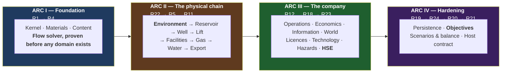

# OGSim — Master Tracker

**The single source of truth for what is designed, what is built, and what is
next.** Updated at the close of every phase.

**Status legend:** ⬜ not started · 🟦 in progress · ✅ complete · ❌ blocked

> **Two axes, and for a long time only one of them was tracked.** A phase mark
> says its models are **built and tested against their SDD**. It says nothing
> about whether the running engine **uses** them — and for eight subsystems the
> answer is currently no. Facilities, gas, water and transport are complete and
> bypassed; the belief store is complete and unused. **[R20d](#phase-r20d)** is
> where that second axis lives. A subsystem is not in the game until it has a
> mark there.

---

## Current state

| | |
|---|---|
| **Phase** | **Derived from the task rows, not from the section letters — both were wrong in both directions.** **Complete (every task ✅)**: R0–R3, R21a–e. **Partial**: R4–R19, R20c, R20d, R21, R22, R23, R24 — sixteen model phases plus four integration ones, each with tasks still open. **Not started**: R20 alone (0 of 12). R25 is 🟨 rather than ⬜ — its fidelity axis works — which the guard found after this row was first written and the summary had said otherwise twice. **R21a–d ✅ — the engine is played.** The composite programme is one document: [phases/R20d_INTEGRATION.md](phases/R20d_INTEGRATION.md).</br></br>**R22, R23 and R24 were marked ✅ here while their own sections said ⬜, 🟨 and 🟨** — this row and the sections disagreed, in the one file whose job is to be reliable about what is built. The sections are right and this row was wrong: R22 has five of eight tasks, R23 has five of twelve, R24 is partial. Corrected rather than reconciled, because the sections carry per-task evidence and this row carries a letter (finding 231). |
| **Design docs** | 24 design + 1 research + **26 phase docs**, 17 catalogue sheets + tech tree, 18 SDDs (000–017). Coherence log: **245 findings**, 61–245 from the code passes. **49 open SDD items of 63 raised** — all 63 registered below, verified against the SDDs rather than counted by hand. |
| **Code status** | 16 engine assemblies + 1 client outside the engine, 0 warnings, 0 errors, **1187 tests across 17 suites** — 1140 of them outside the `Speed=Slow` filter (measured by running it; the fast-gate total is not a hand-count), 47 long runs inside it. **Both the fast gate (all 1140) and the full slow suite (all 47) are confirmed genuinely green by complete runs for this task** — a second consecutive clean 47/47. **This is the broadest-reaching change of the four in this run**: SDD-007 §4.1's finding-265 amendment gives every scheduled operation a crew-duration multiplier, not just a new isolated mechanism, so it moved two 40-year fixed-seed measurements that had been reading comfortably before — `R20d24V3_a_flood_cannot_put_back_more_than_the_field_took_out`'s VRR-2-vs-VRR-1 tolerance (measured 1.099×, then 1.458× once repairs run 15% longer for an untrained crew — widened to a 1.6× bound, still far short of the 2× the test exists to rule out) and `R20d21V1_a_watered_out_field_sells_wet_oil_until_it_is_treated`'s dry-vs-wet earnings margin, which the shipped seed now loses on account of the same repair-delay effect — reproduced outside the test before being pinned to seed 2, where the claim holds with a clear margin, rather than tried-until-passing. Both fixes are content/fixture changes; the crew multiplier itself is untouched. Two revert-checks stand behind the crew mechanism directly: `An_untrained_crew_lengthens_the_effective_duration`/`A_trained_crew_shortens_the_effective_duration` were confirmed to FAIL when `OperationScheduler.Draw`'s multiplication was deliberately changed to a division. The sixteen new tests (finding 265, below) are the newest of the 1140: nine in a new `CrewTests.cs` prove `CrewState`'s validation, one-way `Train()`, and save round-trip; three in `OperationTests.cs` prove the duration and worst-case-reservation terms read the injected crew factor; four in `ChainTests.cs` prove `TrainCrewCommand` is reachable, costs real cash, cannot be bought twice, survives a reload, and that a trained field installs the same equipment no later than an untrained one on two seeds. The eight tests before them (finding 264) are unchanged: two prove `VolumetricGasDrive` refuses an oil-bearing compartment and one declaring no gas in place, one proves it matches `GasMaterialBalance.Solve` called independently, one proves water influx bends the line above the volumetric-only case, one runs a hand-declared field through six real ticks and checks its pressure against the same independent computation at every step, one proves p/Z is linear to floating-point tolerance on points read off that real compartment, and one proves the compartment survives a save. The three tests before those (finding 263) are unchanged: two in `BowTieTests.cs` prove a top event refuses when no mitigating barrier is declared and that a resolution carries its own mitigating-barrier count, and a three-case theory in `ChainTests.cs` proves `ThreatStage.ConsequencePoints` hits the mitigated bound, the unmitigated bound and the exact midpoint. The three tests before those (finding 262) are unchanged: two in `LendingTests.cs` prove `ReserveValue` is independent of the advance rate and always at least the borrowing base, and one in `NewGameTests.cs` proves `CompanyValue` exactly against a played field with cash, debt, reserves and an accrued abandonment provision all non-zero at once. The nine `MaterialCatalogueTests` cases before those (finding 261) are unchanged. R9.2's own row below added one unit-level test and reverted the rest — a finding, not a test count change. R18.6's own SC7 acceptance test (`R18V4_a_compressor_failure_shuts_in_the_field_it_feeds_with_correct_attribution`) is among the 47: R18 §2.3 claims a compressor failure "requires no special code" to limit oil production, and this checks that claim against a real run for the first time, now that R9.1 gives the compressor something to be composed into. R11.2's own join was verified against the full slow suite the same way R9.1's was: as a new registered flow element from tick 0, the pump station draws from the AssetIntegrity hazard stream and the scheduler's outcome stream, and two more fixed-seed tests broke this way (finding 184's shape again — `R12b6_a_worn_well_can_be_serviced_like_any_other_equipment` and `R21V2_a_client_using_only_the_surface_can_play_and_win`'s seed 11), each confirmed genuine by the same clean-master comparison and fixed by pinning the affected fixture to a verified-working seed rather than altering the pump station. R9.1's own join, before it, found four such regressions (`R10V4_an_acid_job_clears_what_the_water_left_behind`, `R23V16_a_company_that_stops_flaring_recovers_its_standing`, `R20d8V1_a_bigger_reservoir_is_a_bigger_business`, `R21V2`'s seed 22) and one unrelated pre-existing failure (finding 258, R13.3's take-or-pay numeric tuning), all fixed in their own tasks. (Was 1116/1070 before R12b.7's stimulation join, 1123/1077 before R21.6's access-window join, 1125/1079 before R16.2's licence-expiry join, 1130/1084 before R12b.2's rod-pump-only install, 1134/1088 before R12b.2 widened to all four lift methods in the same task, 1137/1091 before R20d.9.2's persistence join, 1138/1092 before R12b.6's stale ❌ was found and corrected, 1139/1093 before R21.6's operating-point join, 1140/1094 before R21.6's world-view join, 1141/1095 before R9.1's compressor join, 1144/1098 before R13.3's take-or-pay verification, 1144/1098 before R11.2's pump-station join (a fix, not a count change), 1145/1099 before R18.6's SC7 acceptance test, 1146/1099 before R9.2's dehydration investigation added one unit-level test and reverted the rest, 1147/1100 before the material catalogue widened from three to nine (finding 261), 1156/1109 before the company-value projection (finding 262), 1159/1112 before the top-event consequence scaled with mitigation held (finding 263), 1164/1117 before the RESERVOIR half of the p/Z deduction was dispatched (finding 264, the last point the slow suite ran clean at 47/47 before this task); see the file header's own warning that these are hand-counts and drift silently, which is why this line is re-measured rather than incremented by memory each time.) The kernel, the contract layer, **thirteen** domain modules and Layer 4 composition are implemented (this row said eleven; the count is of `src/` projects less kernel, contracts, composition and the client); scenario, activity-mass, VOI, lending and souring contracts are declared in their SDDs and compiled. The composed engine **advances a tick and plays**: a player drills, waits, finds oil or doesn't, produces, declines, and wins or goes broke. Every implemented member traces to a pinned SDD section (F-1). |
| **Repository** | `The-Tech-Idea/Beep.OilGasSim`, branch `master`. Work lands directly on `master`, one task per commit. |
| **The client** | **The engine is played by a Godot client that runs it in process** — `src/OGSim.Game/Oilfield Days`, outside the solution, tracked in [its own tracker](../src/OGSim.Game/plans/20_GAME_TRACKER.md) and summarised in §"The client — Oilfield Days" below. It has raised three findings against the engine (GC-1 to GC-3), all from playing rather than testing, and it has **measured the shipped scenario at $134.4M of $600M — `Expired`**. Its own gameplay is being rebuilt: it shipped a driving game where the design asked for a base builder. |
| **The playable loop** | **arrive → commit capital under uncertainty → wait four months → find oil or don't → produce through the chain → decline → reinvest → win or go broke.** Six of the fourteen tick stages are real (3, 5, 6, 8, 12, 13). One command, one product, one goal, one failure condition. |
| **Balance note** | **Measured twice, fixed twice.** The arc: plateau at the export limit to month 288, then water takes over — oil 61,165 → 27,371 m³/month while water climbs 10,171 → 47,529 t, and cash flow decays $8.46M → $0.52M. The field ends by drowning. Both measurements found things reasoning had missed: the aquifer was sized to defeat itself (a Fetkovich aquifer's pressure falls with what it delivers), the goal was met in month six, and the win test was measuring one well because the rig serialises. The goal is $600M in a decade — six wells reach it only with the vessel upgraded ($918M), not otherwise ($449M). |
| **Next** | **The company is as real as the field, and every limit has a price.** A run buries structures on a horizon, migrates charge up-dip and leaves most traps dry; regional data reads a structure's SIZE and never its contents; POS decomposes into five factors, three shared with the play; seismic sharpens what it can see; a hole resolves presence from truth; a dry hole re-prices the play and a discovery carries its beliefs onto the field. Then: a chain laid to where that field actually is, a market that moves and reverts, work priced by the cycle, 1P/2P/3P reserves a crash writes down, plant wearing out by the barrel, a plugging bill accrued as it is earned and released when it is paid, credit secured on the ground with a covenant that warns before it bites, and a flaring record that prices itself into the cost of debt. Six limits — separator, export, header, gas plant, disposal well, tank — each with something a company can spend to move it. Two headless clients play it through `ReadModel` + `Commands` alone.</br></br>**Findings 164–177 are three lessons, not fourteen.** *(1) A mechanism built to specification and joined to nothing* — the world generator composed and never called, POS with no subject, `IBeliefStore` without a re-key, design 04's gathering line, `IPriceModel` and two RNG streams for a market that never moved, `Injector.Commit` called only by its own test. *(2) A cost with no response is a tax rather than a decision* (172, 177) — flaring priced with no gas plant to buy, plugging with no acid job, a refusal naming a header nothing could install. *(3) A passing unit suite is evidence about a component and never about a system* (168, 174, 175, 176) — and worse, a test can hold a defect in place as its own setup: the play correlation re-synced by hand, the covenant test comparing earnings a company in breach still has, ESG bands wrong by two orders of magnitude under unit tests that fed synthetic values, and `Outlet == slots` written down as an expectation.</br></br>**What is next, and what each is waiting on.** TREATING was built whole and reverted (finding 178): all four parts work and the shipped field's water cut never puts BS&W near the limit, so the spec cannot fire. The trace is measured and finding 179 is RETRACTED — the field waters out fine when it is developed; a single well recovers 13% in forty years and never pulls the pressure down. **Treating is done** (R20d.21): the `WaterIntoLiquid` term, load-scaled carry-over, BS&W measured at the meter, a half-per-cent sales limit and a treater ladder — with c solved from a measured cut rather than guessed — though the cut it was solved from was not this chain's, and the gate could not fire until finding 183 measured BS&W at the treater's own inlet and set c = 0.07. A field now sells on spec for two thirds of its life and cannot sell at all in the last third without a treater. **Equipment now wears out and can break** (R20d.22): every registered element carries a condition, stage 4 ages it and rolls, a failure is ABSENCE from the network, the availability set is downstream-closed so a break shuts in what fed it instead of losing its oil, and an overhaul answers it — $7.46bn maintained against $0.56bn neglected. **But there is only ONE maintenance strategy** (finding 185, correcting R20d.22's own claim): measured on four seeds the series falls monotonically with the repair threshold, run-to-failure wins three outright and ties the fourth, and the interior optimum reported at the time was a single seed inside its own noise. What survives is the trap — repairing at 0.9 costs 40–49% of the company on every seed. The cause is content: a repair costs $0.8M and one tick whether the equipment is broken or merely worn, so preventive work pays the whole price of the failure it avoids, in advance and with certainty. **SDD-012 §3 offers three strategies and this composition prices them identically**, which is the next thing to fix in that arc. SOURING was built whole and reverted (finding 182): it works, and the field injects 0.0033 pore volumes in forty years because it only reinjects produced water, so the curve would have to be bent a hundredfold to fire. **It is waiting on a WATERFLOOD** — voluntary injection for pressure support, which this game lacks and which is the classic secondary-recovery decision. **The waterflood is built** (R20d.24), and it is the first mechanic in this engine whose right answer depends on which reservoir a player is standing on. A `WaterIntake` sources bought water, the injector takes it on a second declared inlet, and a voidage replacement ratio is the lever — a set point, not a project. On a field with no drive of its own: **RF 2.1% and insolvent unflooded, RF 22.1% and $1.73bn flooded**, a tenfold recovery out of the material balance rather than a table. On a field the aquifer already supports, the same order is a straight **loss of $71M** — the water is arriving free and buying more only brings the breakthrough forward. **Three ceilings, none of them invented**: conservation (imported water crosses the network or stage 6 creates mass), the injector's own injectivity headroom, and the ROCK — §3.1's bisection searches to discovery pressure and FAULTS above it, so a flood may never put back more than the field took out. That last one is why VRR 2 buys exactly what VRR 1 does, and it nets the aquifer off for free, so no influx term appears anywhere. **And the reservoir sours** (R20d.25, third attempt, first one that fires): the driver is IMPORTED water and not injected water, because reinjected produced water is anoxic, reduced and stripped of the sulphate the bacteria eat — it is the fluid that sours a reservoir least, which is why finding 182's mechanic could not fire and would have been wrong even if the volume had been there. Measured on one seed and one element set: a field with a disposal well and no flood stays **exactly sweet for forty years**, while a flooded one climbs monotonically to **0.77** and pays **226 overhauls against 186, $1,234M against $1,465M** — so souring is now the larger half of a flood's price and it arrives two decades after the decision that bought it. On a field that needed the flood it is still overwhelmingly worth it (−$50M and insolvent against $1,446M). Scope is §5's first destination only, §1's corrosion; the sales spec and the metallurgy envelope both need H2S as a MATERIAL and are their own task. **And maintenance is a decision in both directions** (R20d.26.2): planned work and emergency work are two operations at two prices — `service-equipment` on equipment that still runs, `repair-equipment` at 3× on equipment that has failed, both one tick — and that alone inverts the shape finding 185 measured. Against a CONTROL taken on this engine rather than remembered from the older one, cash at forty years across triggers 0.0–0.9 goes from monotone (1486/1481/1443/1344/959, waiting wins) to interior-peaked on every seed (1025/1028/1090/1103/782), a 0.4 trigger beating run-to-failure by 5.6–9.8% on all four while 0.9 still costs a quarter of the company. **The duration half stays reverted** (finding 187) and the fifth year is why: cost-only leaves the outage budget untouched — 76–84 months down of 480 under both prices — and year five still clears zero everywhere, but on the thinnest seed by **$2.1M against $7.3M**, which is what any further asymmetry would be spent against. **The envelope that said this would not work counted only the invoice** and missed that a company short of cash repairs later: the waiting field ends $461M behind having paid $270M of extra bills. **And it exposed a client that plugged fields for being under repair** (finding 190) — latent since equipment could fail, already costing the small field three wells at the old price, and found because the big field's revenue collapsed 46% while the small field's stayed byte-identical. **Then the strategy that pays was made something a player has to buy** (R20d.26.4): SDD-012 §3 has always said condition-based work needs a monitoring tier, and the gate lived in a record called by its own unit test while the chain view handed every condition out for free (finding 191). Wear is now INFORMATION — an element with no kit fitted publishes a null condition and refuses a scheduled service, both halves together, because hiding the number while allowing the work would let a player find the worn elements by reading which services came back "nothing to overhaul". A failure stays visible to everyone, so run-to-failure remains complete and free to play and C14's kit finally has a customer. Then cargoes and berths (SDD-006 §7); §2.5's contour trace; the surface fabric still in empty lists; steps 1–2 and gas reservoirs a company can produce.</br></br>**The content pipeline is no longer bypassed** (R20c.9.2). R3 built it, `content/` shipped four catalogues, and tests validated the files — while the running engine composed its chain from C# constants, so the pipeline was complete and joined to nothing in the same way the belief store once was. The six surface ladders now load from `content/facilities/`, a bad sheet refuses the engine, and a rebalance is a JSON edit. Materials were next in that arc and are half done (finding 261): `Defaults.Materials` now declares all nine in `content/materials/`, hardcoded rather than read through the `MaterialContentKind` that already ships and validates them — content-loading the catalogue would make `MaterialCount` a per-build value a static `Defaults` class cannot safely hold, which is a materially larger refactor than widening a list and stays its own further task. The six materials the chain does not yet move — carbon dioxide, condensate, hydrogen sulphide, nitrogen, sales gas, sulphur — exist in the catalogue and are produced by nothing, honestly zero rather than absent.</br></br>**And the company now has a value, not only a balance** (finding 262): SDD-014 §4 pinned "value = cash + PV(1P) − debt − provisions" for Capital efficiency and R11.6's own row named the same figure as the read-model projection standing between it and rebuilding the berth mechanic — and until now neither had one to read. `ReserveBasedLending` already walked a discounted-cash-flow curve for the borrowing base and threw away the figure before the advance-rate haircut; `BorrowingTerms.ReserveValue` keeps it, from the same walk rather than a second one, and `FieldReadModel.CompanyValue` sums it with cash, debt and the abandonment provision every tick. It closes exactly the one prerequisite each row named — not R24.6's Capital-efficiency dimension, which still needs a change-over-span and cumulative distributions/capex, and not R11.6's berth/cargo mechanic, which stays unbuilt and would also need a scenario's win condition re-pointed at `company.value` in place of `company.cash` before deferred revenue would stop reading as a loss.</br></br>**R18's incidents — "the other two thirds of an ESG record" — are no longer waiting.** R23's bow-tie is joined: a threat materialises at a rate driven by the worst barrier condition, barriers are sampled in declared order, and a top event costs standing that decays. And the standing it costs can now MOVE, which is what made the join worth having — the record was a lifetime average, so a gas plant bought nothing and an incident was subtracted from a number already clamped at zero. **And what it costs now depends on what a player's mitigation stopped** (finding 263): `BowTie.Resolve` computed `mitigatingHeld` since R23.2 and `ThreatStage` threw it away, so a company whose mitigating barriers had rotted paid the same bill as one that kept them — a cost with no response, found the same way findings 172 and 177 were. A top event's points are now a straight line between the shipped flat cost (every mitigating barrier held) and three times it (none did, the same asymmetry already priced between planned and emergency maintenance), with only two points on that line reachable until the shipped content ships more than one mitigating barrier — design 14 §8's five NAMED tiers stay their own content task. **What R23 still owes** is the consequence TABLE, the two safety counters as a projection, and the four tasks waiting on R22's environment profiles or R12's crew. **What R22 owes** is the environment profile itself and ambient conditions into flow assurance — the weather that exists is real, joined and saved, access windows gate mobilisation, the solve runs at the season's ambient, effects now apply through the same path as technology (R22.2), and it is five and a half of eight.</br></br>**And "gas reservoirs a company can produce" is half true now** (finding 264): the RESERVOIR half of R14.6's p/Z deduction is joined — `GasMaterialBalance` (R5.7) sat tested by its own fixture for four phases with no dry-gas compartment anywhere in this composition to be its subject, dispatched by nothing because §3.1's oil form has no root at N = 0. A new `VolumetricGasDrive` (standalone, not the oil `DriveMechanism` base) dispatches it for real, `SubsurfaceState.CreateGas`/`FieldControl.AddGasCompartment` hand-declare a dry-gas compartment the way every oil fixture already hand-declares one, and a produced field's pressure matches the p/Z line through real ticks, linear to floating-point tolerance, and survives a save. **The WELL half stays open, named rather than guessed at**: §6.1 already pins `q_sc = C·(Pr²−Pwf²)ⁿ` for gas-well inflow, but §6.1b's produced-stream conversion is written entirely in terms of a completion's total LIQUID rate, and a gas well has no liquid rate at its core — nothing in this document says how its stream reaches the network, which is a design gap and this amendment's own stated boundary, not an oversight.</br></br>**And a lean crew finally costs what design 07 §2.8 always said it would** (finding 265): `ThreatStage` fed the bow-tie's barrier strength a flat, unexplained `Defaults.CrewCompetency = 0.9` since R23.1, and `OperationScheduler.Draw`'s duration term read no crew input at all — R12-V9's "higher skill reduces duration and risk by the declared amount" had never existed on either side. `CrewState` — company-wide, not per-discipline — starts untrained (0.75 competency, 1.15× duration) and a one-time `TrainCrewCommand` raises both at once (0.95 competency, 0.95× duration), the same crew the bow-tie and the scheduler both now read. **This is also the first of the four findings in this run to move the shipped seed's own numbers**: two 40-year fixed-seed measurements read differently once every scheduled repair takes 15% longer for an untrained crew, fixed the same way findings 184/261's predecessors always have — the tolerance widened where the claim ("nowhere near double") still holds at the new measured value, and the fixture pinned to a different verified seed where it does not. Not built: `IPersonnel`, per-discipline grading, or a hiring mechanic beyond the one lever — a materially larger future task. |

**Three things are true at once and all three should stay visible.** The engine
is architecturally complete to its own laws — every manifest promise checked,
the truth boundary an assembly boundary, determinism mechanically enforced. The
gameplay loop is real end to end, with no stubbed step. And the *content* is a
single hand-built field with a single hand-built well: what exists is a spine,
not a game with things in it.

> **Phase numbers are stable identifiers, not execution order.** They are assigned
> in the order phases are designed; §"Execution order" below is authoritative for
> sequence. R22 (Environment) executes at the start of Arc II, R23 (HSE) after
> R18, and R24 (Objectives) before R20 — because that is where their dependencies
> place them.

---

## R0 — Design ✅ (closed by owner instruction, 2026-08-06)

| # | Document | Status |
|---|---|---|
| R0.1 | [design/00_VISION.md](design/00_VISION.md) — what the game is | ✅ drafted |
| R0.2 | [design/01_CONCEPT_MATRIX.md](design/01_CONCEPT_MATRIX.md) — every concept, mapped | ✅ drafted |
| R0.3 | [design/02_DOMAIN_MODEL.md](design/02_DOMAIN_MODEL.md) — entities and relationships | ✅ drafted |
| R0.4 | [design/03_ARCHITECTURE.md](design/03_ARCHITECTURE.md) — layers, contracts, composition, tick | ✅ drafted |
| R0.5 | [design/04_MATERIAL_AND_FLOW.md](design/04_MATERIAL_AND_FLOW.md) — the one flow engine | ✅ drafted |
| R0.6 | [design/05_SIMULATION_MODELS.md](design/05_SIMULATION_MODELS.md) — the equation catalogue | ✅ drafted |
| R0.7 | [design/06_WORLD_AND_EXPLORATION.md](design/06_WORLD_AND_EXPLORATION.md) — map, discovery, information | ✅ drafted |
| R0.8 | [design/07_TECHNOLOGY.md](design/07_TECHNOLOGY.md) — the technology graph | ✅ drafted |
| R0.9 | [design/08_ECONOMICS.md](design/08_ECONOMICS.md) — money, fiscal regimes, reserves | ✅ drafted |
| R0.10 | [design/09_DIAGNOSTICS.md](design/09_DIAGNOSTICS.md) — log, audit, fault policy | ✅ drafted |
| R0.11 | [design/10_CONTENT_AND_UNITS.md](design/10_CONTENT_AND_UNITS.md) — data format, units | ✅ drafted |
| R0.12 | [design/11_PERSISTENCE.md](design/11_PERSISTENCE.md) — save, load, determinism | ✅ drafted |
| R0.13 | [design/12_VERIFICATION.md](design/12_VERIFICATION.md) — how each phase proves itself | ✅ drafted |
| R0.14 | [research/PPDM_ALIGNMENT.md](research/PPDM_ALIGNMENT.md) — standards research | ✅ drafted |
| R0.15 | [design/13_ENVIRONMENT.md](design/13_ENVIRONMENT.md) — the operating environment and its effects | ✅ drafted |
| R0.16 | [design/14_HSE.md](design/14_HSE.md) — health, safety, environment as a discipline | ✅ drafted |
| R0.17 | [design/15_TIME_AND_EXECUTION.md](design/15_TIME_AND_EXECUTION.md) — **turn-based engine, real-time-with-pause game** | ✅ drafted |
| R0.18 | [design/16_EVENT_MATRIX.md](design/16_EVENT_MATRIX.md) — every event, trigger, payload, severity | ✅ drafted |
| R0.19 | [design/17_CROSS_IMPACT_MATRIX.md](design/17_CROSS_IMPACT_MATRIX.md) — how everything affects everything; the feedback loops | ✅ drafted |
| R0.20 | [design/18_GAME_MODES.md](design/18_GAME_MODES.md) — objectives, missions, challenges, scenarios, campaign | ✅ drafted |
| R0.21 | [design/19_GLOSSARY.md](design/19_GLOSSARY.md) — naming discipline | ✅ drafted |
| R0.22 | [design/20_PLAYER_DECISIONS.md](design/20_PLAYER_DECISIONS.md) — the decision catalogue and its design test | ✅ drafted |
| R0.23 | [design/21_INTEGRATION.md](design/21_INTEGRATION.md) — **time × events × cross-impact**; propagation delays, loop periods, loop-entry alerts | ✅ drafted |
| R0.24 | [design/22_DESIGN_COHERENCE.md](design/22_DESIGN_COHERENCE.md) — **change-impact map, rule registry, identifier scheme, coherence log** | ✅ drafted |
| R0.25 | Per-phase design documents R1–R25 ([phases/](phases/)) | ✅ drafted |
| R0.26 | Second pass — tick pipeline corrected to 14 stages; docs 00–12 integrated with 13–21 | ✅ done |
| R0.27 | Third pass — identifier scheme unified (18 findings logged); content gaps in 05–11, 19, 20 closed | ✅ done |
| R0.28 | Fourth pass — coherence checks executed; L5 ownership violation fixed; cross-cutting couplings added to 14 phase docs; read-model contract specified (findings 19–27) | ✅ done |
| R0.29 | Fifth pass — Affects/Affected-by coupling headers on all 23 design docs; stale counts, diagram/table disagreement and glossary duplicates fixed (findings 28–31) | ✅ done |
| R0.30 | Sixth pass — **six simulation-logic defects fixed** (findings 32–37): conservation equation completed, solver non-convergence made survivable via the shut-in ladder, stage-4 lag semantics declared, pressure surveys added, integration error bounded, inventory provenance/blending specified | ✅ done |
| R0.31 | Seventh pass — **reality-level system** (finding 38): three accessibility axes, the Advisor as player-side autopilot, presets, profile-stamped scores; PD-D1/D2/D4, I-D5 and D5 resolved into it; phase R25 added | ✅ done |
| R0.32 | **SDD layer** ([sdd/](sdd/)): rolling-wave policy, [SDD-000 engineering standards](sdd/SDD-000_ENGINEERING_STANDARDS.md) (platform, determinism rules D-1..D-8, testing, CI), [SDD-001 kernel contracts](sdd/SDD-001_KERNEL_CONTRACTS.md) (signatures for R1) | 🟦 drafted |
| R0.33 | Eighth pass — **the surface world** (findings 39–40): world generation made discoverable (G16/G17, ownership map); the surface expanded from one pipeline line into the eight-step sub-pipeline of 06 §5.1a — terrain, hydrology, settlements, networks, third-party infrastructure, derived profiles, computed remoteness, slow settlement growth | ✅ done |
| R0.33b | [SDD-002](sdd/SDD-002_STREAMS_AND_FLOW.md) — streams, elements, **the solver algorithm pinned** (damping λ, pro-rata throttling, every tolerance, the ladder) | ✅ drafted |
| R0.33d | [SDD-003](sdd/SDD-003_SUBSURFACE_AND_WELLS.md) — subsurface & wells: **SI forms of every formula**, bisection specs, lift hooks, coning gate | ✅ drafted |
| R0.33e | SDD-000 gains implementation-fidelity rules F-1..F-4 (no unspecified member, no unpinned constant or formula, SDD-first on conflict); SDD-001 gains spatial primitives | ✅ done |
| R0.33s | **Fourth SDD review pass** (finding 60): the gas-lift recycle loop closed with a one-tick lag (the pass's one architectural find); command inventory derived from the decision catalogue; carried interest, operation-level masses, the inspectable-save acceptance, audit-replay data rooms, belief re-keying | ✅ done |
| R0.33r | **Third SDD review pass** (finding 59): the referenced-but-undefined class — `ContentId`, `DisposedMass`, **the double→Money half-even boundary that makes INV2's exactness real**, type-curve-only reserves, the AdvisorView layering fix, scripted entries as commands, and five smaller pins | ✅ done |
| R0.33q | **Second SDD review pass** (finding 58): ten gaps incl. three contradictions — the `IEngine` duplicate, the trig-free `NextNormal` pin, and **the 30/360 calendar decision** unifying the segment grid, weather days, berth calendars and day-rates on one arithmetic; conservation check completed with `Sourced`/`Disposed`; the `Aggregate` predicate node | ✅ done |
| R0.33p | **SDD review pass** (finding 57): nine gaps fixed — day-grid alignment of all stochastic positions, choke decoupling in the solver, power/flare/VRU transforms pinned, SlotKind drift, and the three genuinely uncovered areas closed by [SDD-016](sdd/SDD-016_ENVIRONMENT_RUNTIME.md) (weather as daily AR(1) on the /30 grid), [SDD-017](sdd/SDD-017_HOST_SURFACE.md) (the full host surface + path registry) and SDD-012 §4b (the bow-tie as arithmetic) | ✅ done |
| R0.33o | **The slot system** (finding 56): tech→equipment/material/treatment→effect closed for every unlock kind — `fits` on all unlockables, slot-scoped effects for consumables, C15 catalogue sheet (muds, inhibitors, polymer, CO₂, biocide) | ✅ done |
| R0.33n | Uniformity closed over buildings (finding 55): facility types = templates in JSON, never code; the Support unit family (camps, warehouses, bases, airstrips) — non-stream buildings through the same content/construction/condition machinery | ✅ done |
| R0.33m | **Non-negotiable 11** (finding 54): definition-driven, plugin-first stated as one global rule; the moddability contract table (10 §1b) — content edits for everything, plugins for new behaviour, engine edits for neither | ✅ done |
| R0.33l | SDD-010..015 (world-gen, rivals, hazards, persistence formats, objectives, advisor) — **the SDD set is complete: every build phase has its software design document**; `Rn.0` becomes a review task | ✅ drafted |
| R0.33k | [SDD-008](sdd/SDD-008_INFORMATION_AND_BELIEFS.md) beliefs + [SDD-009](sdd/SDD-009_ECONOMICS_ENGINE.md) economics — the two heaviest formula surfaces pinned: one conjugate update rule, Beta POS, WLS/BIC inference, deterministic VOI; integer double-entry, **the PSC algorithm with mandatory hand-computed fixtures**, UoP depreciation, the reserves/RRR algorithm | ✅ drafted |
| R0.33j | [SDD-006](sdd/SDD-006_FACILITIES_AND_TRANSPORT_ELEMENTS.md) facility/transport transforms + [SDD-007](sdd/SDD-007_OPERATIONS_ENGINE.md) operations engine — Arc II's surface chain and R12 now at signature level; spec-gate proxies, tank backpressure and outcome-draw timing pinned | ✅ drafted |
| R0.33i | [SDD-004](sdd/SDD-004_CONTENT_PIPELINE.md) content pipeline + [SDD-005](sdd/SDD-005_CAPABILITIES_AND_EFFECTS.md) capabilities & effects — the gating/tier/detectability systems of passes 10–11 now at signature level, incl. **the pinned envelope-combination rule** (a design refinement 13 §2.1 had left open); SDD-003 gains the accumulation truth attributes | ✅ drafted |
| R0.33h | **The catalogue layer** (finding 53): 14 per-station equipment sheets + the TECH_TREE gate registry (~50 nodes with era/prereqs/routes/opens) — the authoring spec content JSONs are written from | ✅ drafted |
| R0.33g | Eleventh pass — **geology's tech dimension + full dependency revision** (findings 51–52): detectability D0–D3 and access classes as truth attributes; the re-opening loop; the activity-gating matrix across all operations; `AllCapabilities` as the pre-R17 composition; era-layering guaranteed in world-gen | ✅ done |
| R0.33f | Tenth pass — **the equipment-tier system** (finding 50): technology gates catalogue entries (`requiresTech`); tiers in eleven places, each with its own money, install time and datasheet-borne physics; service route rents gated tiers; SDD-003 pins tier-curve consumption | ✅ done |
| R0.33c | Ninth pass — **full re-read of the simulation core** (02, 04, 05, 07, 08, 11 read line-by-line; findings 41–49): gas-condensate model, coning/standoff physics, the asset market, insurance, two missing hazards, injector abandonment, and an intra-document identifier collision | ✅ done |
| R0.34 | **Gate closed 2026-08-06** — owner instruction: "lets start with code". Open decisions proceed on their recommendations; SDD set 000–017 stands | ✅ closed |
| **R1-C** | **Contract layer built**: `OGSim.slnx` (net10.0, nullable, warnings-as-errors), `OGSim.Kernel` (13 files — quantities, volume types, Money, identity, 30/360 time, RNG streams, log/audit/fault, events, commands, modules/segments/state, streams, effects, spatial) + `OGSim.Contracts` (8 files — flow, subsurface, wells, facilities, capabilities/gating, operations, information, the full `IEngine`/`ReadModel` surface). **Builds clean: 0 warnings, 0 errors; 9/9 smoke tests green.** First rule-F-4 event handled by the book (finding 61: `Stream`→`MaterialStream`). No implementations — signatures, data records and pinned one-liners only | ✅ |
| **R1-C2** | **Second contract pass** (findings 62–66): solver gains `FlowTopology` (elements had no wiring!), `IEffectState` + gating fourth arg, `TickContext.Segments` nullable-until-stage-4, EconomicsContracts + IntegrityContracts + `IPipeline` + `ICommandValidator/Applier`, `Observation`/`IBeliefStore`. SDD-001/002/005 back-annotated. **[23_FUNCTION_MATRIX](design/23_FUNCTION_MATRIX.md)** created: full contract→function→SDD→phase→consumer→pin matrix + dependency/pipeline mermaid graphs. 10/10 smoke tests (incl. an implementability fake for `IFlowElement`) | ✅ |
| **R1-C3** | **Third contract pass** (findings 67–72): commit family `ICommitTarget`+3 (the only mutation path finally has types), `IEngine.WriteSave` + `IEngineFactory`/`EngineSetup` (the host could not save or start!), ContentContracts.cs (non-negotiable 11's front door: catalogues, sources, load failures, `GatedDefinition`, `Era`) + `IModuleRegistry`, `IMigrationStep`, six missing R21 §2.4b read-model projections (compartments, IPR/VLP curves, spec margins, nominations, VOI, FinanceView), `Bg` typed as `FormationVolumeFactor`. SDD-002/003/004/017 back-annotated | ✅ |
| **R1-C4** | **Fourth contract pass** (findings 73–75): `SolveReport` gains its converged state (`ElementSolution`, `CompletionState`) — it was diagnostics-only, leaving the §9 commit step and S0 seeding with no input; exact `Money * long`; `IEventBus.Publish` stamps and returns `EventId`. Kernel files re-audited (Diagnostics/Events/Money line-by-line; issuance patterns now consistent) | ✅ |
| **R1-C5** | **Fifth contract pass** (finding 76, owner-prompted): the last two deferred slots declared — `WorldContracts.cs` (`IWorldGenerator`, `IWorldSink` + typed geology/surface/region handoff records, `IWeatherModel`), SDD-010 §4 / SDD-016 §1 pinned first. ~~Every 03 §3.2 replaceable slot is now a compiled type~~ — **corrected by pass 9 (finding 82): three were not** (`IHydraulicModel`, `ISeparationModel`, `IObservationModel`). R15.0/R16.0 demoted from "declare the contract" to "review granularity" | ✅ |
| **R1-C6** | **Sixth contract pass** (findings 77–78): systematic SDD-interface-vs-code diff (all pinned interfaces declared ✓) + line-by-line audit of the last unreviewed kernel files (Identity/Time/Random/Volumes/Spatial/Commands). Caught pass 3 correcting itself: `Bg` re-typed to a new `GasFormationVolumeFactor` (gas bridges to `StandardGasVolume`, never stock-tank); `NextInt` doc sync | ✅ |
| **R1-C7** | **Owner-driven pass** (findings 79–80): `WorldParameters` — the new-world knobs (size, land fraction, richness, maturity, climate severity, rivals, start era), template-scoped, range-checked at `CreateNew`; terrain-class content kind + [C16](catalog/C16_TERRAIN_CLASSES.md) authoring sheet (plains/hills/mountain/desert/rock-plateau/swamp; sea = bathymetry). SDD-004/010 amended; 15/15 tests | ✅ |
| **R1-C11** | **All 18 SDDs revised to signature parity** — each read section-by-section against its contract files, not name-diffed. **300 of 300 public engine types are now declared in an SDD** (was 88). Found and fixed: `ConstraintWriter`, `EnvelopeContext`, `CompartmentId`, `PerforationId`, `OperationId`, `RelinquishmentSchedule`, `CommitmentItem` — seven phantom types signatures depended on; `FinanceView` missing from `ReadModel` beneath a note claiming the section count matched; `MoveEnvelope` unable to express the rule its own §4.1 pins; `Gating` as a static class (L1/L2); `Duration` where whole days were meant, twice. [SDD-000](sdd/SDD-000_ENGINEERING_STANDARDS.md) §8 gains **F-5** (an amendment edits its block, never sits beneath it — 5 instances) and **F-6** (identity is `EntityId<T>`; no per-entity id types — 3 instances) | ✅ |
| **R1-C10** | **Tenth contract pass — full SDD-vs-code audit, both directions.** Of 300 public types, 62 were declared in no SDD at all (F-1 says implementations are not exempt) and 32 SDD-declared types had no code. Closed now: the **three §3.2 slots** declared (`ISeparationModel` + `SeparationEfficiency`, `IHydraulicModel` + `PipeGeometry`, `IObservationModel`), **[SDD-002](sdd/SDD-002_STREAMS_AND_FLOW.md) §2b’s whole surface** built (5 distributions, `IPropertyKind`, `IProperty`, `IMaterial`, `IMaterialCatalog`, `Dimension`), and **[SDD-001](sdd/SDD-001_KERNEL_CONTRACTS.md) §12b** naming R1’s 13 concrete types — F-1 had been honoured for the interfaces and quietly broken for the classes behind them. Gap 62 → 51; the rest are per-phase and close at each `Rn.0`. One design error caught while writing: the first `ISeparationModel` draft duplicated `IFluidPropertyModel.SplitAt` — phase *existence* is thermodynamics, phase *recovery* is equipment | ✅ |
| **R1-C9** | **Ninth contract pass (finding 82), run as R2.0** — a sweep of every `I<Name>` the 25 phase documents promise against code and SDDs: 62 undeclared. **Three [03](design/03_ARCHITECTURE.md) §3.2 slots were genuinely missing** and are now pinned (`IHydraulicModel`/`ISeparationModel` in [SDD-006](sdd/SDD-006_FACILITIES_AND_TRANSPORT_ELEMENTS.md) §0, `IObservationModel` in [SDD-008](sdd/SDD-008_INFORMATION_AND_BELIEFS.md) §3); R2’s property/material surface written as [SDD-002](sdd/SDD-002_STREAMS_AND_FLOW.md) §2b with the **P90-low/P10-high** convention pinned; ~20 equipment names recorded as **never to be declared** ([02](design/02_DOMAIN_MODEL.md) §4.1 forbids a facility-type hierarchy — they are content templates behind `IFlowElement`). Phase docs corrected at each `Rn.0`, not swept | ✅ |
| **R1-C8** | **Eighth contract pass** (finding 81): the spatial read surface — `IEngine.World`/`WorldView` (static world beside the per-tick ReadModel; public knowledge only), `Site` coordinates on well/facility views, licence polygons, believed prospect outlines with POS. Found by walking the host's screens against the declared surface; SDD-017 §1c + R21 §2.4b amended | ✅ |

---

## What is left

**Derived from the task rows, and guarded.** Every number below was read out of
the tables in this file rather than remembered, and
`Record_EveryPhaseHeadingAgreesWithItsTaskRows` fails the build if a phase
heading stops agreeing with the rows beneath it. That rule exists because this
summary has now been wrong in both directions three times — R22/R23/R24 marked
complete over sections that said otherwise, R2/R3 marked not-started over
fifteen finished tasks, and R25 marked not-started with a task already part
done, which the guard found on its first run after two hand corrections had
missed it (finding 231). **The counts here will go stale; the guard will say
so.**

**Complete — every task done:** R0, R1, R2, R3, and R21a–e.

**Nothing started at all: R20 alone.** It is also the largest single block and
the one that turns a spine into a game — SC1's full-lifecycle acceptance test,
calibration CAL1–CAL10, the balance content pass, the twelve missions and ten
challenge patterns as content, the four-era campaign, and four whole
verification suites (CI-V1–13, PD1–PD7, I-V1–16, SC11–13).

**Three modules from [03](design/03_ARCHITECTURE.md) §8 do not exist:**
`Transport`, `Hse`, `Advisor`. HSE *behaviour* now runs — the bow-tie is joined,
the standing moves — but it lives in `OGSim.Integrity` and composition's
`HseModule`; the project design 03 names is not there.

| Phase | done | part | to do |
|---|---:|---:|---:|
| **R20** Scenarios and balance | 0 | 0 | 12 |
| **R25** Advisor and Reality Profiles | 0 | 1 | 8 |
| **R13** Economics | 8 | 3 | 1 |
| **R22** Environment and Setting | 5 | 1 | 2 |
| **R8** Facilities and separation | 8 | 0 | 3 |
| **R11** Transport and export | 5 | 3 | 2 |
| **R12** Operations and scheduling | 4 | 4 | 1 |
| **R24** Objectives, Challenges and Missions | 6 | 2 | 2 |
| **R6** Wells | 8 | 4 | 0 |
| **R14** Information and uncertainty | 7 | 2 | 2 |
| **R19** Persistence and determinism | 3 | 2 | 2 |
| **R5** Subsurface | 7 | 1 | 2 |
| **R17** Technology | 6 | 1 | 1 |
| **R18** Degradation, hazards, maintenance | 6 | 0 | 1 |
| **R21** Host contract | 1 | 5 | 0 |
| **R23** Health, Safety and Environment | 5 | 4 | 0 |
| **R16** Company, licences, regulation | 6 | 1 | 1 |
| **R20c** Composition | 10 | 1 | 1 |
| **R20d** Integration: wiring what is built into the loop | 11 | 1 | 1 |
| **R7** Artificial lift | 6 | 0 | 1 |
| **R9** Gas processing | 8 | 0 | 1 |
| **R10** Water handling | 5 | 0 | 1 |
| **R4** Flow solver core | 9 | 1 | 0 |

**R21 and R23 have nothing not-started** — every remaining task in both is
already part done. R21.3 needs a projection over the audit queries that now
answer; R21.6 needs SDD-017 §2's named VIEWS rather than twenty-six fields on
one record.

**48 open SDD items of 62**, registered and checked in both directions by
`Record_EveryOpenItemIsRegistered` and its closure counterpart.

---

## The build plan

Four arcs. **Nothing starts until R0.34 closes.**



**Why the flow solver comes before any domain (R4 before R5):** the solver is the
riskiest single component and the one everything else depends on. Proving it
against synthetic flow elements — before a reservoir or a well exists — means its
correctness is established independently of any domain modelling. If the solver
design is wrong, that is discovered in Arc I and not in Arc III.

---

## Arc I — Foundation

### Phase R1 — Kernel 🟦  *(all 18 tasks done; gate open on deferred verification)*
> 📄 [phases/R1_KERNEL.md](phases/R1_KERNEL.md)

| # | Task | Status |
|---|---|---|
| R1.0 | **SDD review** ([SDD_INDEX](sdd/SDD_INDEX.md) §1) — SDD-001 and the R1 phase doc read against the committed contract layer. Five drifts corrected under rule F-4 *before* any code: the missing `weather` RNG stream, R1-V19's "across leap years" against a 30/360 calendar, §9's `Segment(double…)`/`AvailabilitySet` block, the undeclared `Area` dimension, and `ILog`'s phantom `EventName`/`LogFields` | ✅ |
| R1.1 | Dimensions, units, `IQuantity`; conversion; nonlinear scales — **plus `DetMath`** (§1.3), the `Area` dimension, the volumetric rate family, the §1.4 spatial algorithms and the §11 fault carriers. 37 kernel tests | ✅ |
| R1.2 | `IEntityId<T>`, `IEntityRegistry`; resolution faults — **F-4: the interface had no `Register`**, so `Resolve` could never return and the registry was unimplementable as declared. Ids begin at 1; registration is write-once | ✅ |
| R1.3 | `ISimulationClock` — read-only interface, `Advance()` on the concrete type only; 30/360 `AddMonths`/`MonthsUntil`; `GameDate` month validated | ✅ — **finding 248 (found working R24.5)**: this build's compiler mis-synthesises `Tick`'s record `PrintMembers` because `Next` is an instance property of the struct's own type — `ToString()` called `PrintMembers()` called `ToString()` on `Next`, which has its own `Next`, forever. A genuine stack overflow, not a slow test: nothing in the engine ever called `Tick.ToString()` (every site formats `Value` directly), which is exactly how it went unnoticed until a FAILING test assertion tried to render one for its own message and took the whole host down instead of reporting the failure. Fixed with a hand-written override; `Finding248_ToString_terminates...` proves it holds |
| R1.4 | `IRandomSource` with independent per-subsystem streams — PCG64 XSL-RR, eight streams seeded by **name** not ordinal, closed-form `Seek`, Marsaglia polar `NextNormal`, rejection-sampled `NextInt`. R1-V5 proven byte-identical | ✅ |
| R1.5 | `ILog` — structured, levelled, nested correlation scopes; `ILogSink`/`LogRecord` declared (F-1: design 09 §3 named a sink that no type existed for) | ✅ |
| R1.6 | `IAuditTrail` — append-only, queryable, bounded. Retention is a **cause-graph closure**, not a category filter: a prunable entry that still explains live state survives (09 §4.4) | ✅ |
| R1.7 | `IFaultPolicy` — classification, strict and resilient implementations, both complete configurations per 09 §5.3 | ✅ |
| R1.8 | `IEventBus` — outbound only. `Seal()` on the concrete bus, not the interface, so only the pipeline can close a tick (EM2) | ✅ |
| R1.9 | `ICommand`, `ICommandBus` — validate → audit → apply → publish. **F-4: `Apply` now returns its events and receives the submission `AuditId`** — `Accepted.Immediate` had no source and an applier could not satisfy INV12 | ✅ |
| R1.10 | `IModule` + **`ModuleComposer`** — all five R1 §2.9 checks, every problem reported. **F-4: `IModuleRegistry` named two different things** (03 §3.1 validator vs the content plugin binder); `StageParticipation` gained `Order` because check 5 had no data to check | ✅ |
| R1.11 | `IStateOwner` registration only — exclusive ownership (L5) + fixed key-order visiting. **There is no `IStateSerializer`**: SDD-001 §10 declares none and the serializer proper is SDD-013/R19; the name was not invented here | ✅ |
| R1.12 | Architecture test suite — **18 checks live**, reflection + Roslyn (closes open item S000-2: both, chosen per rule). 11 deferred with their trigger phase, listed in [R1 §5b](phases/R1_KERNEL.md) rather than written as tests asserting nothing | ✅ |
| R1.13 | **`AdvanceTick()` — the turn-based engine surface**; no wall-clock anywhere. **F-4: `TickResult` moved to the kernel** (the pipeline cannot reference Contracts) and gained **`TickAbandoned`** — `FaultResolution` had three outcomes where `TickResult` had two | ✅ |
| R1.14 | **Sub-tick segmentation** — whole-day /30ths positions (INV9 as integer arithmetic), 4-segment budget, merges ranked by the pinned estimator and **every merge audited** | ✅ |
| R1.15 | Calendar — month, quarter, year, season boundaries; real labels over 30/360 | ✅ |
| R1.16 | Event taxonomy — categories, severity, stage, loop role, segment-boundary flag, cause chain, **no-subscriber rule**. INV12/IR6 and IR4 enforced at publish; the no-subscriber rule is an absence, architecture-tested at R1.12 | ✅ |
| R1.17 | Tick pipeline — the 14 stages of [03](design/03_ARCHITECTURE.md) §6, order declared in one place and walked; fault resolutions obeyed (continue / abandon whole / halt) | ✅ |
| R1.18 | Deterministic event ordering — `(stage, day, subject, event id)`; **F-4: SDD-001 §6 still said `double SubTickPosition`** against the committed /30ths-grid `int Day` | ✅ |

### Phase R2 — Materials, properties, streams ✅
> 📄 [phases/R2_MATERIALS.md](phases/R2_MATERIALS.md)

| # | Task | Status |
|---|---|---|
| R2.1 | `IPropertyKind` catalogue; dimension binding; valid ranges. **F-4: R2 §3 specified a build that cannot compile** (contracts in Contracts, implementations in Kernel) — the material layer is kernel currency, per SDD-002 §1 | ✅ |
| R2.2 | `IProperty` — value, provenance, uncertainty, as-of; validated against its kind at construction, **tails included** (a centre in range with a P90 outside it is refused) | ✅ |
| R2.3 | Distribution types; log-normal product propagation — five sealed kinds, **P90-low/P10-high** on the contract; product of log-normals analytic (R2-V5) | ✅ |
| R2.4 | `IMaterial`, `IMaterialCatalog` — ordinals assigned from the id sort and nowhere else, so two runs of the same content index `Composition` identically | ✅ |
| R2.5 | `MaterialStream` — composition, P, T, provenance; **no cached phase split** (elements ask the fluid model at (composition, P, T)); `Split` preserves conditions and provenance | ✅ |
| R2.6 | Stream algebra — `Composition` Plus/Scaled/Split, `Allocation.Blend`; split-then-mix round-trips **to the bit** (R2-V3), randomised sequences conserve mass (R2-V4) | ✅ |
| R2.7 | Black-oil property model (`IFluidPropertyModel`) — Standing, Vazquez-Beggs, Beggs-Robinson, Lee-Gonzalez-Eakin, Dranchuk-Abou-Kassem, all forms now pinned in [SDD-003 §4.1](sdd/SDD-003_SUBSURFACE_AND_WELLS.md). **Field units inside one declared boundary** — §2 amended: empirical correlations have no SI form, their constants are fitted coefficients. Pinned by invariants, continuity and round-trip; **published worked examples deferred to R5 (S003-4)** | ✅ |
| R2.8 | Volume-condition types: rb / stb / scf, non-interchangeable — delivered at R1.1 with the rate family; gas bridges to `StandardGasVolume`, never stock-tank | ✅ |

### Phase R3 — Content pipeline ✅
> 📄 [phases/R3_CONTENT.md](phases/R3_CONTENT.md)

| # | Task | Status |
|---|---|---|
| R3.1 | Content format, schema, `"3200 psi"` unit syntax — closed vocabulary, affine temperature scales, **volume condition carried by the token** (`rb` and `stb` are not interchangeable), decimal comma refused rather than guessed, nearest-token hint on a typo. **R3.0: two layering/placement corrections** — the content surface moved to `OGSim.Kernel` (its bases were unreachable from the records deriving from them) and the unit table out of `PhysicalConstants` | ✅ |
| R3.2 | Six-stage validation — stages 1–3 per-file and unconditional, 4–6 cross-file and gated on a complete index (**a parse failure would otherwise cascade into spurious dangling references**) | ✅ |
| R3.3 | Load report — every failure in the batch, each naming source, file, JSON path and stage; catalogues on success or failures otherwise, **never both** | ✅ |
| R3.4 | `ICatalog<T>` and typed indices — catalogues keyed by the definition’s runtime type, id-sorted so ordinals are save-stable | ✅ |
| R3.5 | Model plugin binding by name — `PluginRegistry` keyed by **(name, contract)**, so a price model named where a drive belongs fails at load rather than on the tick that first used it. Stage 6 asks the KIND which plugins its datasheet names (`PluginsOf`), so the loader never learns a field name | ✅ |
| R3.6 | Mod loading through the identical path; a later source replaces an entry **whole**, and two sources at one declared order is a failure naming both | ✅ |
| R3.7 | Shipped catalogues — `content/` exists: 5 property kinds, 9 materials (the PPDM/PRODML product list of research §5), 3 rock types. **`property-kind` is a bootstrap kind** loaded in its own pass, because stage 3 binds units against the dimension it declares and stage 4 comes later. Fluid systems deferred to R5 with the reservoir that consumes them | ✅ |

### Phase R4 — Flow solver core 🟨
> 📄 [phases/R4_FLOW_SOLVER.md](phases/R4_FLOW_SOLVER.md)
> `src/OGSim.Flow` — references Contracts and Kernel only.

| # | Task | Status |
|---|---|---|
| R4.0 | SDD review — SDD-002 §5, §7, §8 amended: `TransformInput.SolvedRate` (finding 96), deferrals moved from S3 to §8's attribution pass (finding 97), S4's boundary pressure pinned, S3's unrelievable-constraint fault | ✅ |
| R4.1 | `IFlowElement` — ports, constraints, transform. **Availability is not on the element**: an unavailable element is absent from the segment's network (04 §4) | ✅ |
| R4.2 | Network construction and validation; tree topology. Kahn's algorithm with the ready set in ascending id, so the order is not merely *a* topological order but always the same one | ✅ |
| R4.3 | Forward propagation and constraint evaluation, in topological order | ✅ |
| R4.4 | Throttle and back-propagation to convergence. **S2 receives `SolvedRate`** — without it S3's cap adjusted a number the forward pass never read, and a bound constraint could survive all 200 iterations | ✅ |
| R4.5 | **Bottleneck attribution** — binding element + deferred volume, computed once on the converged state against the completions' uncapped targets, so the figure does not depend on how many iterations convergence took | ✅ |
| R4.6 | Mass conservation invariant, checked after **every** transform — what makes an INV1 breakdown attributable to one element rather than to the network | ✅ |
| R4.7 | Non-convergence engages the audited shut-in ladder and the tick **completes** (04 §4.0b); ladder exhaustion is the invariant fault | ✅ |
| R4.8 | Synthetic flow elements — source, sink, restrictor, splitter, manifold, completion. A completion is one object in both roles, because the solver solves a rate for it and then asks the same element to turn that rate into a stream | ✅ |
| R4.9 | FV suite ([04](design/04_MATERIAL_AND_FLOW.md) §9) — **partial, see below** | 🟨 |

**R4.9 honestly: 6 of 13 covered, 7 need a domain or a tick loop R4 does not have.**
Test names carry their FV number so coverage is readable from the test list.

| FV | Covered | Where / why not |
|---|---|---|
| FV1 Conservation | ✅ | Hand-built chains + **200 randomised networks × 3 seeds**, generated valid-by-construction. The design asks for 1,000 *ticks*; the per-solve half is proven here and the loop half belongs with the loop, which R20c composes and which fills with work when modules own entity state |
| FV2 Depletion shape | ⬜ | Needs a reservoir (R5) — an Arps curve cannot be checked against synthetic elements |
| FV3 Operating point | 🟨 | Convergence onto the IPR and the DEAD outcome are pinned, recomputed independently from the report. The **parameter sweep against IPR ∩ VLP** needs a real VLP (R6) |
| FV4 Bottleneck attribution | ✅ | The element is named and the deferred volume matches the analytic answer; a second test pins that the volume is damping-independent |
| FV5 Backpressure propagation | ✅ | A larger downstream drop measurably reduces withdrawal; a pressure-decoupled completion is unmoved by the same swing |
| FV6 Spec gating | ⬜ | Needs a spec gate and a flare (R6). The network build already refuses a spec gate with no Reject port |
| FV7 Material agnosticism | 🟨 | The solver contains no material-identity branch and the architecture tests check it; the synthetic-material equivalence half needs R5's materials |
| FV8 Determinism | 🟨 | Repeat solves agree to the bit. **Cross-platform state hashing is not covered** — no state hash exists until R7, and CI has no Linux leg yet (R1-V6) |
| FV9 Convergence | ✅ | Budget exhaustion engages the ladder, audited with its cause, and the solve completes rather than faulting |
| FV10 Allocation | ✅ | A commingle allocates back in mass proportion, shares summing to exactly 1 |
| FV11 Segmentation | ⬜ | Needs the segment loop (R7); R4 solves one segment given to it |
| FV12 Segmentation ≠ averaging | ⬜ | As FV11 |
| FV13 Segment commit atomicity | ⬜ | Needs `ICommitTarget` and the stage-6 commit (R7) |

---

## Arc II — The physical chain

### Phase R22 — Environment and Setting 🟨  *(executes first in Arc II)*
> 📄 [phases/R22_ENVIRONMENT.md](phases/R22_ENVIRONMENT.md)
>
> `src/OGSim.Environment` exists and is JOINED: the weather it generates costs
> operations real days through `ActivityStage`, and `WeatherView` is on the read
> model, and an access window gates what has to be mobilised. Five of the
> eight tasks below are done.
>
> **The commit numbers do not match this table and cannot be made to.** Work
> landed as `R22.12`, `R22.15`, `R22.16`, `R22.17` — numbers past this table's
> eight, assigned in the order tasks were executed rather than from the plan.
> Git history is immutable, so the divergence is recorded here rather than
> hidden: read this table for WHAT is built and the log for WHEN (finding 231).

| # | Task | Status |
|---|---|---|
| R22.1 | `IEnvironmentProfile` — terrain, water depth, climate, access, ground, sensitivity, utilities | ⬜ |
| R22.2 | Effect application — restrict option / move envelope / change parameter, **shared with technology** | ✅ — `ClimateProfile` gained an `Effects` list (SDD-005 §4.2 amendment); `WeatherStage.Execute` calls `effects.Apply(climate.Effects)` every tick against the SAME `EffectState` instance `DiffusionStage` writes technology's effects into, so `CapabilitiesModule` now provides the concrete `EffectState` (not just `IEffectState`) for `EnvironmentModule` to require. No shipped climate carries an effect yet — proved with a synthetic climate against `EnvelopeKind.ArcticOperability`, one test showing an extension lands directly on a zero base and a second showing the climate's own restriction still binds when a simulated technology extension is applied through the identical `Apply` call (R22-V18) |
| R22.3 | `IWeatherModel` — seasonal baseline, stochastic variation, persistence, extremes | ✅ — `Ar1Weather`, an AR(1) process `x' = ρx + √(1−ρ²)ε` holding unit variance at every persistence, with ρ = 1 refused because a process that never forgets its start is not weather. Seasonality is a twelve-month `ClimateProfile`; a profile missing a month is refused. `WeatherState` owns `environment.weather` and saves only the carry, so a restored region continues the weather it was having (R22-V14/V16) |
| R22.4 | Within-tick weather profile — days lost, composing with R1.14 segmentation | ✅ — `DaysAbove(region, limit)` counts the days of a month past an operation's own `WeatherLimit`, and `ActivityStage` puts the operation in `Standby` for each: a January genuinely costs an operation more than a July. This is why `Earnings_decline_as_the_reservoir_depletes` compares a YEAR against the next year rather than adjacent months — two neighbouring months differ by which months they are as well as by depletion, and the pair can invert without decline having stopped (finding 214) |
| R22.5 | `IForecast` — accuracy declining with horizon | ✅ — `Look(region, horizonDays)` returns the analytic mean and sigma of the AR(1) at that horizon, which widens to the process's own variance as the horizon grows. **It consumes no draws** (R22-V15): a forecast that sampled would change the weather by being asked for, and a player checking twice would get two different futures |
| R22.6 | Access windows — seasonal availability, opening and closing events | ✅ — SDD-016 §3 called windows calendar facts *from the climate profile* and §5b's declared `ClimateProfile` had no member for them, so the fact had nowhere to live. Twelve booleans now, validated beside the other seasonal curves, and **no draw**: deriving a window from `severity > L` would let a lucky calm February open an ice road in a thaw. **It gates STARTING and not progressing**, which is the opposite of how severity couples — `DaysAbove` costs standby days to work already under way — and merging them would strand every long job at the same moment each year. So a window is a **deadline rather than a tax**, and `MonthsUntilAccessCloses` answers the question a player has. Sixteen templates each state whether their work must be brought in: a rig, a survey vessel, a lay barge and five craned modules do; a repair with the spares aboard, a planned service, a build-up on a shut-in well and chemicals from platform stock do not. Refused and never deferred (EN3). `EnvironmentModule` takes its climate now instead of reading `Defaults.Climate` — a default dependency wearing a constant's clothes (L2), and what made this untestable through a composed engine. **No shipped climate closes, with a test saying so**: `temperate-offshore` is reached by boat every month and the sea state is what stops work there, so the refusal is proved against an arctic profile and a scenario with a real window is R20's content. **EN4 is not claimed** — a delayed operation waiting a full year while the licence clock runs is a second mechanic |
| R22.7 | Ambient conditions into flow assurance and equipment derating | 🟨 — **the supply side is joined; the consumers are not built.** `SegmentContext.Ambient` and `WeatherSeverity` are real solver inputs, and the loop handed them a fixed 15 °C and a literal `0.0` every month of every game while `WeatherState` computed the seasonal values and only the read model read them. Both now come from the weather per segment, as the mean over that segment's days — a segment boundary exists for availability reasons, not weather ones, so the first day's value would let an outage decide what the month solved at. **What it did not buy at the time, corrected here rather than left stale**: this row's own "`Compressor`... is built and not composed" was true when written and is not now — R9.1 composed it as the seventh rung-based socket and R20d.13's own row already records EN5 closed; this row is corrected beside it rather than left contradicting it. The berth that closes on severity is R11.6's own remaining blocker (the company-value prerequisite, not this row's), so EN7 alone stays unreachable. Fixed anyway because the first element that DOES read ambient would otherwise derate against 15 °C for forty years and look plausible doing it (finding 233). **A second owner went with it**: the projection asked `TemperatureOn(the month's last day)` while the solve used a per-segment mean, so a host saw a temperature the field never ran at — one fact, two plausible answers, which is why nothing ever failed for it. The loop publishes what it solved at and the read model reports that, which is also what makes it testable: a year spans 9 K, and against the constant it spans 0.00 |
| R22.8 | EN1–EN12 verification suite ([13](design/13_ENVIRONMENT.md) §8) | ⬜ |

### Phase R5 — Subsurface 🟨
> 📄 [phases/R5_SUBSURFACE.md](phases/R5_SUBSURFACE.md)
> `src/OGSim.Subsurface` — **every type internal**, enforced by
> `Truth_SubsurfaceExposesNoPublicType`.

| # | Task | Status |
|---|---|---|
| R5.0 | SDD review — nine findings, six of them defects in SDD-003 (see below) | ✅ |
| R5.1 | `IReservoirCompartment` and its truth types — `InPlace` (kg, deliberately not `Composition`'s kg/s), `ContactSet`, `RockTruth`, `CompartmentLink`, `InitialConditions`, `CumulativeProduction` | ✅ |
| R5.2 | PVT is `IFluidPropertyModel`, built at R2.7; `Bw` added here (finding 101) | ✅ |
| R5.3 | Tank material balance — Havlena-Odeh grouping, **cumulative from initial conditions**, bisection | ✅ |
| R5.4 | `IDriveMechanism` — six implementations, distinguished by which of §3.1's terms each **admits**, and each refusing a compartment that contradicts it | ✅ |
| R5.5 | `IAquiferModel` — Fetkovich influx, bounded by remaining expansion, weakening as it delivers | ✅ |
| R5.6 | Compartment connectivity and transmissibility | ⬜ — `CompartmentLink` declared; the multi-compartment solve is not written |
| R5.7 | `p/Z` for gas — its own balance, since the oil form is identically zero at `N = 0` (finding 105) | ✅ |
| R5.8 | ~~`IReservoir`, `IField` aggregates~~ | ⬜ — deferred (finding 103): groupings with no behaviour in R5, and L3 forbids declaring a member that has none |
| R5.9 | Model tests — MX3 ✅, MB2 ✅, MB1 partial | 🟨 |

**R5.0's findings.** Six are defects in SDD-003, three are stale phase-doc text.

| # | Finding |
|---|---|
| 98 | Two sections both numbered §4.1, making every `SDD-003 §4.1` citation ambiguous under F-3 |
| 99 | **§3.1 balanced cumulative expansion against one tick's withdrawal.** Read as written, pressure would have fallen by roughly the ratio of field life to one month — which is to say hardly at all. Now cumulative from initial conditions, which is also self-correcting |
| 100 | §3.1's expansion forms cited "the black-oil forms of 05 §3.1", and 05 §3.1 states the balance **in words** with no algebra. The citation pointed at nothing; the forms are now stated in the SDD |
| 101 | `IFluidPropertyModel` had no `Bw`, so the withdrawal term could not be evaluated for any compartment producing water |
| 104 | Design 02 §2.2 promises six different pressure-vs-withdrawal relationships; the SDD specified one balance for all six. Resolved by §4.2b — a drive is defined by **which terms it admits**, which is the standard classification and needs no invented physics |
| 105 | §3.1's form is expressed per stock-tank m³ of oil, so a gas reservoir (`N = 0`) had no root and was unimplementable. §3.1b added |
| 106 | The validity limit was stated against "a fraction of expansion capacity", which has **no well-defined value**: `Bg → ∞` at the bracket floor makes any compartment's capacity effectively infinite and the limit could never fire. Now on the pressure step |
| 102 | R5 §2.2 said the compartment **is** an `IFlowElement`. Design 23 pins `ICompletion : IFlowElement, never the reverse`; and an element publishes its outlet pressure into every downstream stream, so a compartment element would broadcast reservoir pressure in the phase meant to establish the boundary against exactly that |
| 103 | Five deliverables named in R5 §3 are declared in no SDD (`IFluidSystem`, `IMaterialBalanceModel`, `IStratigraphicUnit`, `IReservoir`, `IField`), and `IAquifer` is declared as `IAquiferModel` |

**What R5 proves, and what it cannot.** Recovery factor emerges — MB2's 5–30% band
is hit for producing GOR from 3× to 12× `Rsi`, and retaining the liberated gas
instead gives 72%, an order of magnitude from one mechanism. But **the band is a
property of the GOR history**, which R5 does not determine: how much liberated gas
is produced is set by relative permeability and the well. So R5-V3/R5-V4 as
written — "recovery lands in band MB1/MB2" — are only half provable here, and the
band test driven by a simulated production history belongs with R6.

### Phase R6 — Wells 🟨
> 📄 [phases/R6_WELLS.md](phases/R6_WELLS.md)
> `src/OGSim.Wells` — references Contracts and Kernel only; never `OGSim.Subsurface`.

| # | Task | Status |
|---|---|---|
| R6.0 | SDD review — three findings; `ICompletionTarget` removed, `IWellComponent` specified, `IChoke` kept out (see below) | ✅ |
| R6.1 | `IWell` — identity, status machine, classification | 🟨 — **implemented against the REACHABLE subset, not the full twelve-state diagram** (R20d.9, SDD-003 §5's amendment). Checked rather than assumed: `DrillWellActivity.Complete` opens no completion on a dry hole, so `Drilling` and `DryHole` are activity facts and never persistent well entities in this composition — nine of design 02 §3.4's twelve states have no command that reaches them (no propose/permit step, no sidetrack, no injector-drilling command). The reachable three — `Producing` / `ShutIn` / `Abandoned` — are computed by the ONE switch `ProductionLoop.Wells()`'s read-model projection already had, extracted so neither copy can drift (law L5). Every well is `Classification.Development`, honestly: the shipped catalogue gates nothing else. **`Surface` is `(0, 0)` for every well**, stated as a limit rather than a default — world generation has no `(x, y)` at all |
| R6.2 | `IWellbore`, `Trajectory` — geometry, sidetracks | 🟨 — **implemented (R20d.9)**: one wellbore per well, since no command in this composition produces a second. `Path` is a two-station VERTICAL trajectory — the only geometry `DrillWellCommand` takes is a single `Length`, so a deviated or horizontal well is not a case this command surface produces. `ContactLengthIn` reads the completion's OWN perforation `TopMd`/`BottomMd` rather than re-deriving an interval from `Path` — a compartment carries no depth interval of its own to check a geometry-only answer against, so the perforation stays the one owner (law L5). Sidetracks remain out of reach: no command produces one |
| R6.3 | `ICompletion` — the network's source element | ✅ |
| R6.4 | `Perforation` — reservoir link, isolation, skin | ✅ — skin is **per perforation**, and isolating a zone genuinely removes its contribution |
| R6.5 | `IInflowModel` — SI Darcy and the Vogel composite, per perforation | ✅ — gas back-pressure deferred with the gas well that needs it |
| R6.6 | `IOutflowModel` — hydrostatic + Darcy-Weisbach friction, Colebrook by exactly 20 Newton steps | ✅ |
| R6.7 | **Operating point** — IPR ∩ VLP by bisection; the well that dies reports `Dead`, never `Flowing(0)` | ✅ |
| R6.8 | `IWellComponent` — specified (finding 108) and declared | 🟨 — the instance type exists; the catalogue and condition/degradation belong to R18 |
| R6.9 | Choke — critical and sub-critical flow | ✅ — a `ChokeSetting` read from a content tier, **not** an `IChoke` |
| R6.10 | Multi-perforation commingling and allocation | 🟨 — several perforations sum correctly and an isolated one contributes nothing; per-perf kh apportionment of the compartment's own withdrawal needs R5.6's multi-compartment solve — **unchanged by R20d.9**: `Wellbore.ContactLengthIn` reads an EXISTING perforation interval rather than performing kh apportionment, so it does not touch this row's blocker. R5.6's multi-compartment solve is still the wait |
| R6.11 | Model tests MX1, MX2, FV3 | ✅ — plus R6-V2/V3/V4/V6/V7/V8/V9/V14 |

**R6.0's findings.**

| # | Finding |
|---|---|
| 107 | **`ICompletionTarget` and `ICompletion` were one concept under two names.** R4 declared the former in `OGSim.Flow` because its synthetic tests could not supply a wellbore — a testing convenience that bought an N1 violation and a seam R6 would have bridged with an adapter, making "one engine" true everywhere except where the wells attach. Removed; `IsPressureDecoupled` moved to `ICompletion`, where §6.3 already decides it. **The solver's separate completion list went too**: since `ICompletion : IFlowElement` every completion is already in the network, and taking a second list let the two disagree — exactly the defect FV7 exposed at R4 |
| 108 | `IWellComponent` is specified by design 02 §3.2 and 01 B6, is an R6 task, and was declared in no SDD. Specified in SDD-003 §5.1: an instance carrying only condition and install date, against a catalogue tier carrying everything else |
| 109 | R6 §3 named `IWellPath` (declared as `Trajectory`), `IPerforation` (declared as `Perforation`, deliberately id-less) and `IChoke` (which finding 82(c) says must **never** be declared) |

**R6-V14 emerges, and finding a fixture bug proved something about the mechanism.**
A strong well on a shared line suppresses a weak one, with no rule anywhere
saying so. It does **not** emerge against a fixed-ΔP element: the coupling is
entirely rate-mediated — more throughput, more drop across the shared line,
higher pressure at both wellheads — so with R4's constant-drop restrictor both
wells solved to exactly the rates they had alone, to the last digit. Nothing was
wrong with the solver; there was no channel for the interaction. The fixture is
now `ΔP = k·ṁ²`, and R8 supplies the real hydraulics.

**The "one engine" claim holds.** R4's solver was written and verified against
elements with no domain meaning, before any well existed. Accommodating a real
completion required exactly one change to it — finding 107, which **removed** a
parameter.

### Phase R7 — Artificial lift 🟨
> 📄 [phases/R7_LIFT.md](phases/R7_LIFT.md)
> `src/OGSim.Wells` extension.

| # | Task | Status |
|---|---|---|
| R7.0 | SDD review — finding 110: `ILiftMethod` could not express one of §6.2's three hooks | ✅ |
| R7.1 | `ILiftMethod : IWellComponent`, `LiftEffect`, `LiftEnvelope`, `EnvelopeAssessment` — out of envelope **degrades and raises hazard**, never refuses | ✅ |
| R7.2 | Gas lift — volume-weighted density reduction; the optimum is emergent | ✅ |
| R7.3 | ESP — piecewise-linear catalogue curve scaled by ρ_mix/ρ_ref, power draw = hydraulic/η | ✅ |
| R7.4 | Rod pump — displacement cap | ✅ |
| R7.5 | PCP — the same relation, distinguished by its envelope, per §6.2 | ✅ |
| R7.6 | Lift selection advisory | ⬜ — deferred to R25's advisor (this row said R15, which is World generation — R25 is Advisor and Reality Profiles, and the number drifted at some renumbering this file never caught), which owns recommendation surfaces; `Assess` gives it everything it needs |

**R7's verification.** R7-V1 ✅ · R7-V2 ✅ · R7-V3 ✅ · R7-V4 ✅ · R7-V5 ✅ ·
R7-V6 ✅ · R7-V7 🟨 (the ESP's power draw is computed and asserted; the facility
balance that *consumes* it is R8.8) · R7-V8 ⬜ (deferred to R13 by the phase doc).

**R7-V4's optimum is emergent, and that is the check.** Gas-lift injection has an
interior optimum: too little does not lighten the column, too much adds volume
that must be pushed up the same tubing, and friction goes as v². The test asserts
the optimum is *neither* at zero *nor* at the end of the sweep — either extreme
would mean one of the two competing terms was missing from the model.

**Two defects found by R7-V2, both structural.**

| Finding | |
|---|---|
| 111 | **The operating-point bracket floor was a second copy of a fact the outflow model owns** (law L5). `Completion` passed `hydrostaticFloorPa` alongside the model; the moment a pump was fitted the copy still described the *unlifted* column, so the floor sat above reservoir pressure and every lifted well reported `Dead` without a search ever running. The floor is now asked of the model — `RequiredBottomhole(0, wellhead)` — which already accounts for whatever is installed |
| 112 | **Gas lift returned no effect at zero rate**, on the reasoning that there was no liquid to lighten. But the gas goes down the tubing whether or not the well produces, so at zero rate the column is *pure injected gas* — the lightest it ever gets. Combined with finding 111 this made revival impossible: the bracket floor is evaluated at zero rate, so a method whose benefit vanished there could never enter the search in which it would have saved the well |

`L2_NoOptionalContractParameter` also caught a defaulted `ILiftMethod? lift = null`
on the outflow model. The rule is right and the default was wrong: "natural flow"
and "someone forgot to pass the pump" are not a distinction a default can make.

### Phase R8 — Facilities and separation 🟨
> 📄 [phases/R8_FACILITIES.md](phases/R8_FACILITIES.md)
> `src/OGSim.Facilities`.

| # | Task | Status |
|---|---|---|
| R8.0 | SDD review — finding 113 (`InPlace` promoted to the kernel) and the deliverables correction below | ✅ |
| R8.1 | `IFacility` — recursive container, site, cost centre | ⬜ — contract declared at R1; it owns no behaviour until R13 makes it a cost centre |
| R8.2 | Units as `IFlowElement` | ✅ — separator, tank and custody point; **no `IFacilityUnit` type**, per finding 82(c) |
| R8.3 | `ISeparationModel` — fixed-efficiency split, carry-over/under, **dual capacity** | ✅ |
| R8.4 | Multi-stage separation | ⬜ — **not expressible without components; gated at R9** (see below) |
| R8.5 | Oil treating — treater, desalter, stabiliser | 🟨 — stale ⬜ (found going through the plan). **The treater is real and composed, not deferred.** `Treater : IFlowElement` (`OGSim.Facilities/Treater.cs`, R20d.21) sits on the oil leg between the separator's `LiquidOutlet` and custody (`Modules.cs` lines 268–270, 362–371), ships at tier 0 removing nothing, and a player buys the next rung through a real install activity (`InstallTreaterTerms`, `RungGate.Buyable`) exactly like every other socket (SDD-006 §0c). Removed water is properly accounted through `Disposed.Discharged`, not left to vanish (contrast finding 252 below). **Desalter and stabiliser remain genuinely absent** — no type, no content, no SDD text beyond being named in this row |
| R8.6 | Tank — inventory, ullage, **backpressure when full** | ✅ |
| R8.7 | The spec gate | ✅ — every breach named with its margin; all-or-nothing rejection |
| R8.8 | `IPowerSource` and the power balance | 🟨 — stale ✅ (found going through the plan; the mechanism the row describes is real and unit-tested — `PowerBalance.Balance` sheds by priority then by size, proven by `PowerBalanceTests` — but it is composed nowhere: `grep`ing `OGSim.Composition` for `PowerBalance`, `PowerDemand` or `IPowerSource` returns nothing, and `SegmentationStage` — stage `Availability`, where §3b puts this balance — has no power logic at all). **Bigger than a join**: no type in `src/` implements `IPowerSource` and no `content/power/` (or equivalent) exists — SDD-006 §3b specifies a genset/turbine/grid-tie facility with a merit-order fuel-sink algorithm (`content/` datasheet `{maxPower, η_driver, fuelType, meritRank}`), and none of it has been authored, so there is currently no power SOURCE for a balance to run against, not merely an unwired one. Every `IFlowElement` already reports a `PowerDraw` (most report zero), and since R12b.2 an ESP genuinely draws real, nonzero power (`LiftEffect.PowerDraw = hydraulic / η`) that nothing consumes or constrains — a field could run any number of ESPs today with no power cost or ceiling. Comparable in scope to R9's gas-processing chain, not a quick fix |
| R8.9 | Manifold, commingling, provenance-preserving mixing | ✅ — proven at R4 (FV10) and reused; `Allocation.Blend` is the kernel's |
| R8.10 | Flowlines | ✅ — stale ⬜ (found going through the plan). `Pipeline : IPipeline` (`OGSim.Facilities/Pipeline.cs`) ships both `LiquidHydraulicModel` and `GasHydraulicModel` on real Colebrook friction, composed in `Modules.cs` and used as the well-to-header gathering-line tieback (`ProductionLoop`'s `GatheringLine`) since R20d.8.8 |

**R8's verification.** R8-V1 ✅ · R8-V2 ✅ · R8-V3 ✅ · R8-V5 ✅ · R8-V6 ✅ ·
R8-V7 🟨 — stale ✅ (found going through the plan; see R8.8 above). "Including R7-V7's ESP-fleet coupling, now real" is not true of the composed engine: `PowerBalance` is unit-tested and never called from `OGSim.Composition`, and no `IPowerSource` exists to fleet ESPs against. R7-V7's own row already had this right — "the facility balance that consumes it is R8.8" — and this row should have agreed with it rather than the other way round · R8-V10 ✅ ·
R8-V4 ⬜ · R8-V8 ⬜ (the mechanism is real now, R8.5 — `Treater` genuinely reduces water cut and the removed water is accounted through `Disposed.Discharged`; what is unproven is whether the shipped tier ladder (0/90/98 pct) actually brings BS&W under `Defaults.SalesSpec`'s 0.5% at realistic late-life water cuts, and the removed water is a separate discharge rather than literally joining the separator's water stream, so the row's wording is not yet satisfied even where the intent is) · R8-V9 ⬜ (templates, with R8.1).

**R8-V4 is not expressible yet, and the reason is a finding.** Staged separation
recovers more stock-tank liquid because the gas removed at high pressure is
*leaner* — mostly methane — so the liquid keeps its intermediates, where one
large drop to low pressure vaporises them. That is a statement about **component
composition**, and SDD-006 §4 is explicit that components exist in exactly one
place: the NGL plant's per-component recovery fractions (FD2). With a scalar
oil/gas/water composition every arrangement of stages retains the same mass by
construction. A first draft asserted otherwise and got the sign wrong, which is
how the gap was found. Gated at R9.

**Finding 113: `InPlace` belonged in the kernel.** R5 declared it `internal` to
`OGSim.Subsurface`; the tank's inventory is the identical concept — kilograms by
material ordinal — and could not reach it. Two copies would be exactly the
duplication CLAUDE.md's rule prevents ("a type two modules need is either a
kernel type or a design smell"). Promoted to `MaterialInventory`, with the one
kg/s → kg crossing (`From(rate, duration)`) in one place. `InPlace` survives as
a `using` alias so SDD-003 §3's domain name stays at the call sites.

Writing the tank found the error that type exists to prevent: it held a
`Composition`, which is kg/**s**, so committing a receipt tried to scale a rate
by 2 592 000 and the kernel refused. Storing a rate as an inventory is precisely
what SDD-003 §3 split the two types to stop.

**Deliverables correction (finding 114).** R8 §3 names `ISeparator`, `ITreater`,
`IStabiliser`, `IDesalter`, `ITank` and `IFlowNode` — six of the ~20 equipment
interfaces [22](design/22_DESIGN_COHERENCE.md) finding 82(c) records as never to
be declared, since 02 §4.1 admits no facility-type hierarchy and non-negotiable
11 makes each a content template behind `IFlowElement`. `ISpecification` is
declared as the record `Specification`. The concrete classes here are
implementations selected by `ContentId`, which is the intended shape.

### Phase R9 — Gas processing 🟨
> 📄 [phases/R9_GAS.md](phases/R9_GAS.md)
> `src/OGSim.Facilities` extension.

| # | Task | Status |
|---|---|---|
| R9.0 | SDD review — three findings; **compression was specified nowhere** | ✅ |
| R9.1 | Staged polytropic compression — equal stage ratio, interstage cooling, heat derating | ✅ **modelled AND composed** (SDD-006 §3c's R9.1 amendment, finding 257, found going through the plan). The model passed MX6/R9-V1/R9-V2 since finding 115 closed and reached no field: the same "real mechanism, joined to nothing" shape this tracker keeps finding. Now the seventh rung-based socket — `InstallCompressorCommand` fits a bigger train ahead of `GasCapture` (`separator → compressor → gas plant → flare`), additive rather than replacing the working sales point, with `CompressorTier.Discharge` carrying the sizing decision the way `SeparatorTier.OperatingPressure` already does. `FacilitiesState` persists it the same way as the other six. Dehydration, sweetening and NGL (`RemovalUnit`, `NglExtractionPlant`) remain equally real and equally unwired — named as a separate task rather than guessed at in the same one. **Verified against the full slow suite, not only the fast gate**: the compressor is a registered flow element from tick 0, so — finding 184's shape, three more times — it draws from the AssetIntegrity hazard stream and the scheduler's outcome stream like every other element, shifting equipment-failure and activity-outcome timing on fixed-seed fixtures elsewhere in the suite. Four slow tests broke this way (`R10V4_an_acid_job_clears_what_the_water_left_behind` — the company's own `Insolvent` latch tripped on the shared default seed; `R23V16_a_company_that_stops_flaring_recovers_its_standing` — the gas-plant install itself drew a failed outcome grade; `R20d8V1_a_bigger_reservoir_is_a_bigger_business` — the size comparison, already a near-coin-flip across seeds by inspection; `R21V2_a_client_using_only_the_surface_can_play_and_win` — one seed in its five-seed set stopped developing the field at all). Each was confirmed genuine by the same technique: stash the join out (content included), rebuild, show the test passes on clean master, restore. None was fixed by touching `Compressor` — each fixture was pinned to a different seed, checked to still exercise what the test is actually about, matching how finding 227 already resolved this exact class of fragility earlier in this file |
| R9.2 | Dehydration | ✅ **the model; composing it was attempted and found currently impossible, not merely undone** (SDD-006 §4's finding 260, found going through the plan). `RemovalUnit` gained the same `Tier`/`Fit()` shape the compressor and pump station already carry — kept, since it is a genuine, self-contained improvement independent of composition. Joining a real dehydrator instance into the network (mirroring R9.1's and R11.2's own shape: after the compressor, ahead of the plant, a new vent-not-burn sink for the reject leg) was built, composed, and tested against a producing field — and read exactly zero throughput on the vent sink every time, confirmed by hand trace. **The cause is one layer below composition**: the black-oil fluid model (`BlackOilModel.SplitAt`, SDD-005 §2's own deliberate "no compositional flash") assigns water a fixed `Aqueous` phase with zero gas fraction, and the fixed-efficiency separator's own carry-over terms never move aqueous mass into the gas leg either — so a dehydrator targeting water reads `present = 0` on every tick of every field this composition can build, regardless of tier. Reverted rather than shipped as a purchasable no-op (F-1: no member without behaviour). **Sweetening (R9.3) does not share this exact blocker** — H₂S/CO₂ are declared `Gas` phase in the shipped catalogue — **but shared a different one, now half-closed (SDD-004 §6's finding 261)**: `Defaults.Materials` wired up three of the catalogue's nine materials, and acid gas was not among them. All nine are wired up now, ordinals derived rather than hand-typed, proven against the full fast gate and a producing field. **The other half is still open and is its own task**: nothing produces carbon dioxide, condensate, hydrogen sulphide, nitrogen, sales gas or sulphur — a completion's own stream is still built from oil, gas and water alone, so sweetening would compose against six honestly-zero ordinals until something (R18's `SourFraction` is the closest existing concept) puts real mass on them |
| R9.3 | Sweetening; sulphur by-product | ✅ |
| R9.4 | NGL extraction and the component split | ✅ — FD2's boundary, now a declared type |
| R9.5 | Flare — **and the oil cap when flaring is limited** | ✅ |
| R9.6 | Gas re-injection path | ⬜ — needs R10's injector completion; the drive already declares `AcceptedInjectants` |
| R9.7 | Sales gas specification gate | ✅ — R8.7's gate, with gas limits |
| R9.8 | Model tests MX6, SC3 | ✅ MX6 · SC3 with R9.6 |

**R9's verification.** R9-V1 ✅ · R9-V2 ✅ · R9-V3 ✅ · R9-V4 ✅ · R9-V5 ✅ ·
R9-V6 ✅ · R9-V7 ✅ · **R9-V8 ✅** · R9-V11 ✅ · R9-V9/R9-V10 ⬜ with R9.6.

**R9-V8 holds — the phase's headline.** With flaring capped and no other gas
outlet, oil falls monotonically as the cap tightens, and the deferred volume
names the flare. Nothing in the engine implements this: the flare is an element
that reports a capacity, S3 throttles the completions feeding a violated
constraint, and the throttled rate is the well's oil as much as its gas. The
behaviour is the composition of two rules written phases apart, neither of which
mentions the other. An environmental rule is a physical production constraint
rather than a fine.

**R9.0's findings.**

| # | Finding |
|---|---|
| 115 | **Compression was specified in no SDD at all.** R9.1 names it, R9-V1 pins it against "the polytropic formula", MX6 tests it — and no document stated the formula, the staging rule, the discharge temperature or the ratio limit. The whole task was unimplementable under F-1. Written as SDD-006 §3b |
| 116 | **The component split had no declared type.** FD2 makes the NGL plant the one place components exist, SDD-006 §4 names the split, nothing declared what one IS. R8-V4 and R8.5 were both gated on it, so the gap blocked three tasks across two phases |
| 117 | R9 §3 names `ICompressor`, `IDehydrator`, `IAcidGasRemoval`, `INglExtraction` and `IFlare` — five more of finding 82(c)'s never-declare list |
| 118 | **INV1 is on TOTAL mass, not per material.** SDD-002 §5 said "per material", true of every element that existed when it was written. The NGL plant is the first that CONVERTS — propane in gas becomes liquid propane — so per-material closure is false for it and always will be. SDD-006 §4 already said "mass closure" and the solver has always checked totals; only that one line disagreed |

Writing R9-V8 also found a fixture recording state inside `Transform`. §8's
attribution pass re-runs every transform at the completions' **uncapped** targets,
so an impure element ends up holding the uncapped answer — and the first version
of the test reported no throttling at any cap. Transform is required to be pure
(SDD-002 §5); the converged values live in the report.

### Phase R10 — Water handling 🟨
> 📄 [phases/R10_WATER.md](phases/R10_WATER.md)

| # | Task | Status |
|---|---|---|
| R10.0 | SDD review — two findings; **neither the S-curve nor injectivity had a form** | ✅ |
| R10.1 | Water treatment units | ⬜ — R8's `RemovalUnit` covers skim/hydrocyclone/filter as content tiers; the catalogue is content, not code |
| R10.2 | Injection and disposal wells; injectivity | ✅ — with decline and remediation |
| R10.3 | Pressure support coupling back to the compartment | ✅ — `CumulativeInjected` was in the balance from R5; R10 supplies what fills it |
| R10.4 | Waterflood as an `IDriveMechanism` | ✅ — an addition, not an edit |
| R10.5 | Water cut S-curve; SC4 | ✅ |

**R10's verification.** SC4/R10-V1 ✅ · R10-V3 ✅ · R10-V4 ✅ · R10-V5 ✅ ·
R10-V6 ✅ · R10-V2/V7 ⬜ (both need a completion whose perforations carry their
own saturation — R6.10's per-perf work) · R10-V8 ⬜ (economic limit, R13) ·
R10-V9 ⬜ (whole-chain water balance, with the tick loop) · R10-V10 ⬜ (R13).

**The S-curve is not a shape that is drawn.** CAL3 asks for "a recognisable
S-curve after breakthrough" and no document said what curve. It is what
fractional flow does when relative permeabilities are power laws — the standard
Corey treatment — and the test asserts the steepest rise is *interior*, which a
straight line would fail. A fitted sigmoid would have drawn the same picture and
taught nobody anything, because it would not respond to viscosity: a viscous oil
waters out early through the mobility ratio in the denominator, and that falls
out rather than being asserted beside it.

**R10.0's findings.**

| # | Finding |
|---|---|
| 119 | CAL3's S-curve had no algebraic form in any document. R10.5, R10-V1 and SC4 all pin against it. Written as SDD-003 §3.1c (Corey + fractional flow) |
| 120 | `ConstraintKind.Injectivity` was declared in SDD-002 §5 and nothing said how to compute one. R10.2 and R10-V4 both need it. Written as SDD-003 §3.1d, including the plugging law that makes disposal an ongoing problem rather than a one-time build |

Two bugs of my own, both caught rather than shipped. `WaterfloodDrive` first
declared its injectants with `new`, which hides the base property — every caller
holds an `IDriveMechanism`, so the interface would have returned the base's empty
list and the flood would have accepted nothing. The test now goes through the
interface deliberately. Then `L2_NoOptionalContractParameter` caught the
constructor default that replaced it; required is better anyway, since "this
drive takes no injectant" is a statement each mechanism should make rather than
omit.

### Phase R11 — Transport and export 🟨
> 📄 [phases/R11_TRANSPORT.md](phases/R11_TRANSPORT.md)

| # | Task | Status |
|---|---|---|
| R11.0 | SDD review — finding 121 (`IBerth`/`ICargo` undeclared) and 122 (Colebrook duplicated) | ✅ |
| R11.1 | `IPipeline`; `IHydraulicModel` — Darcy-Weisbach and the pressure-squared gas form | ✅ |
| R11.2 | Pump and compressor stations | ✅ **both halves now composed** (SDD-006 §3d's R11.2 amendment, finding 259, found going through the plan). `LiquidPumpStation : IFlowElement` (finding 246): incompressible, single-stage, `w = ΔP/ρ̄`, no derate curve because nothing calibrates one for a liquid pump's motor the way §2.6 does for a compressor's. R9.1 closed the compressor's own join first (finding 257); this reuses the exact same eight-socket mechanism for the pump station — the eighth rung-based socket, `InstallLiquidPumpStationCommand` fitting a bigger train ahead of the treater (`separator → pump station → treater`), the oil leg's own version of what the compressor does for gas, with `PumpTier.Discharge` carrying the sizing decision the same way. `FacilitiesState` persists it the same way as the other seven. **Verified against the full slow suite twice, matching R9.1's own discipline**: as a new registered flow element from tick 0, the pump station draws from the AssetIntegrity hazard stream and the scheduler's outcome stream like every other element, and two more fixed-seed tests broke this way — `R12b6_a_worn_well_can_be_serviced_like_any_other_equipment` (the well crossed from "worn" to "already failed" before the test could order a service, so it was pinned to a seed where it stays merely worn) and `R21V2_a_client_using_only_the_surface_can_play_and_win` (a second seed in its five-seed set, on top of the one R9.1 already replaced, stopped developing the field — the same finding-227 shape a second time, fixed the same way: swap the seed, keep the set's mix of winners and losers). Both confirmed genuine by stashing the join out and showing each test passes on clean master. The full slow suite came back 46/46 green after both fixes |
| R11.3 | Linefill and inventory in transit | ✅ |
| R11.4 | Flow-assurance risk flags | 🟨 — erosional velocity reports as a constraint feeding hazard severity; hydrate/wax margins need R18's hazard model to consume them |
| R11.5 | Terminal, tank farm | ✅ — R8's tank, in a farm; no new type (finding 82(c)) |
| R11.6 | `IBerth`, `ICargo` — scheduling, laytime, demurrage | ⬜ — **stale blocker corrected**: `IOperation` has been declared (`OGSim.Contracts`) since R12 landed; that is no longer what blocks this. The real blocker is SDD-006 §7a.2, and it is not stale: R20d.5.1 built a full berth/cargo/laytime/demurrage end to end and REVERTED it, because any parcel-sized lifting defers revenue and the shipped scenario's win condition is a bare cash target — "any mechanic that defers revenue will read as a failure to the opening scenario" until company VALUE (not just cash) is a read-model projection. **That projection now exists** (SDD-017 §2's finding-262 amendment): `FieldReadModel.CompanyValue` is `cash + PV(1P) − debt − provisions`, real every tick. **The prerequisite this row named is closed; the two things that would still need doing are not** — nobody has re-built the berth/cargo mechanic R20d.5.1 reverted, and nothing has re-pointed a scenario's win condition at `company.value` in place of `company.cash` (`ReadModelPath` resolution is a hand-registered table, `EngineBuilder.cs`'s `ReadModelPaths`, and has no `"company.value"` entry yet — the field existing does not put it on that table for free). **Step 1 of §7a's four-step order is done** (finding 251): `Berth`/`ExportTerminal.Berth` now carries the export rate as a derived value, closing the duplicate-rate (L5) hazard before anything depends on it, with zero behaviour change. Steps 2-4 (occupancy, laytime/demurrage, `LogisticsView`) are unblocked in principle now but still unbuilt |
| R11.7 | `ICustodyTransferPoint` — metering, spec gate, revenue event | 🟨 — the gate is R8.7; the metering-uncertainty draw needs R14's `measurement` RNG stream in a tick |
| R11.8 | Third-party transport contracts and tariffs | ⬜ — R13's economics |
| R11.9 | Model tests MX4, MX5; SC8 | 🟨 — MX4 ✅ MX5 ✅; SC8 (design 12 §"a tanker is late") **stale reason, correct status**: the tick loop has existed for a long time, so that was never the blocker. SC8 needs berth/cargo/storm-closure scheduling, which is R11.6's blocker (SDD-006 §7a.2, built once and reverted) |

**R11's verification.** MX4/R11-V1 ✅ · MX5/R11-V2 ✅ · R11-V3 ✅ · R11-V4 ✅ ·
R11-V5 ✅ · R11-V7 ✅ · R11-V12 partial ✅ · R11-V6/V8/V9/V10/V11/V13 ⬜ with the
tasks above. **R11-V13 (whole-chain conservation) needs the tick loop** and is
the moment "one engine" is fully verified — it belongs with R7's loop, not here.

**G1 holds: capacity is never configured.** A pipeline declares geometry and a
rating and nothing else; throughput is asked of the hydraulics for the fluid
actually flowing. The gas line's collapse (R11-V3) and the viscosity sensitivity
(R11-V4) are both *impossible to express* against a stored `maxRate`, and a test
asserts the type has no such field.

**R11.0's findings.**

| # | Finding |
|---|---|
| 121 | `IBerth` and `ICargo` are declared in no SDD. SDD-006 §7 describes berth occupancy and cargo laytime in text only, and `ICargo` is specified as an `IOperation` — a contract R12 introduces. R11.6 is genuinely blocked rather than merely unwritten |
| 122 | **Colebrook-White was duplicated in spirit and about to be in fact.** SDD-006 §6 says "the SAME 20-Newton-steps-from-0.02 procedure pinned in SDD-003 §6.2 — one implementation, shared", and it lived privately inside the well's VLP where the pipeline could not reach it. Moved to the kernel as `Friction`: what is pinned is the ITERATION — fixed steps from a fixed seed — which is determinism rather than domain physics. Two copies would have been two chances to get one equation wrong, showing up as a tubing string and a pipeline disagreeing about the same fluid |

---

## Arc III — The company

### Phase R12 — Operations and scheduling 🟨
> 📄 [phases/R12_OPERATIONS.md](phases/R12_OPERATIONS.md)
> `src/OGSim.Operations`. **SDD-007 needed no amendment** — the first phase since
> R4 whose SDD specified everything its tasks required.

| # | Task | Status |
|---|---|---|
| R12.0 | SDD review — no findings | ✅ |
| R12.1 | `IOperation` — duration, cost profile, resources, prerequisites, outcome | ✅ |
| R12.2 | Scheduler; resource contention | ✅ |
| R12.3 | `IRig` — availability and reservation | 🟨 — the calendar and contention are built; day-rate contracting is R13's |
| R12.4 | Drilling operations; depth progress; hazards | 🟨 — drilling **is** an operation template; depth progress and the disaster-day hazard need R18 to consume `DisasterDay` |
| R12.5 | Completion and workover operations | 🟨 — same shape, same engine; each is a content template with its own outcome table |
| R12.6 | Construction operations | 🟨 — as R12.5 |
| R12.7 | `IPersonnel` — skill effect on duration and risk | 🟨 **the skill effect is real, scoped to a company-wide competency level** (SDD-007 §4.1's finding-265 amendment): `CrewState` replaces the flat, unexplained `Defaults.CrewCompetency = 0.9` `ThreatStage` had fed the bow-tie's barrier strength since R23.1 with a real lever — untrained (0.75) until a one-time `TrainCrewCommand` raises it (0.95), the same crew `OperationScheduler.Draw`'s duration term and its worst-case reservation both read, layered onto the outcome table's own grade rather than replacing it. Proven end to end: a trained field installs the same equipment no later than an untrained one on two seeds. **Not `IPersonnel`, and not per-discipline** — `ResourceNeeds.Crew` still names disciplines and counts that nothing grades separately; one scalar is what R12-V9's singular "the declared amount" and SDD-007 §4.1's "declared in content" actually ask for, and a full personnel/hiring system stays a materially larger future task. `ProcedureCompliance` is untouched — SDD-012 §4b's own text names its real source as R16.5's regulator findings backlog, not this row's crew |
| R12.8 | Abandonment operations | ✅ — stale ⬜ (found going through the plan). Both stated blockers are resolved and have been since R12b.10: `IObligationRegistry` is implemented in `OGSim.Operations/Obligations.cs`, registered unconditionally when a well opens and discharged only by a completed abandonment; R13's accrual (`ArpsReserves.EconomicLimit`/R20d.14's plugging-bill accrual, R13.8) is what it discharges against. `AbandonWellActivity` (`OGSim.Composition`) is this task's actual `IOperation` instance — a field whose wells are all plugged stops costing anything |

<a id="r12b"></a>
#### R12b — The activity catalogue, and how it reaches every subsystem 🟨
> 📄 [phases/R20d_INTEGRATION.md](phases/R20d_INTEGRATION.md) §2 step 1.

**Nothing the player does to the world happens except as an activity.** Drilling,
logging, a well test, a seismic shoot, a workover, a stimulation, an install, a
turnaround, an abandonment — all of them take time, consume a rig or a crew,
accrue cost while they run, and end in an outcome drawn once at the start. That
is one engine, and R12 is it. There is no second scheduler and no activity that
quietly bypasses this one.

That last sentence was untrue when it was written. See finding 142.

| # | Activity | Template exists | Reaches |
|---|---|---|---|
| R12b.1 | **Drill** — spud to TD, depth progress, disaster day | ✅ — on the scheduler; `DisasterDay` is carried and waits on R18 to consume it | Wells (a wellbore), Subsurface (what it penetrates), Information (what the bit learns), Company (capex) |
| R12b.2 | **Complete** — perforate, case, install tubing and lift | 🟨 **the lift half is real, and now completely so — all four methods, not one** (SDD-003 §6.2's R12b.2 amendment, finding 255). Four lift methods have worked since R7 and none ever reached a well — `Completion` opened on `lift: null` always and nothing touched it after. Shipped a rod pump first, then widened to all four in the same task: `InstallRodPumpActivity`, `InstallPcpActivity`, `InstallEspActivity`, `InstallGasLiftActivity`, one command each, sharing refusal logic and tubing-geometry reconstruction through a `LiftGate` static helper (the same shape `RungGate.Buyable` already gives five equipment installs). PCP shares the rod pump's exact model (§6.2 gives both the same relation) so both content-type as one `DisplacementPumpDefinition`/`DisplacementPumpTier`; ESP adds a head curve and efficiency; gas lift adds an injection rate and gas density — all un-gated, all content (`content/wells/{rod-pump,pcp,esp,gas-lift}-a.json`). `Completion.InstallLift` swaps `Lift` and the outflow model's `_outflow` together so the two cannot disagree about which lift is installed (law L5). **A real defect caught building the composition test, not by inspection**: the first draft gave all four activities one shared `ActivityTerms.Template` id, and `ActivityState` keys its catalogue by that id in a dictionary — the last one registered would have silently replaced the other three. Four distinct templates now. Proven physically (`R12b2V1`–`V4`, `OGSim.Wells.Tests`: a strong well is capped at a displacement pump's rate — R7-V6's ceiling-not-floor claim, through the mutation — and a dead well is revived by an ESP's pressure boost and separately by gas lift's density reduction, two different effects through the same mutation) and end to end (`R12b2V5`–`V7`: all four install and produce the right concrete type on separate wells; a second pump of ANY method — not only the same one — is refused; refused on a well that does not exist). **Gas lift's injection gas is a fixed content rate with no supply-side modelling**, stated as a limit: wiring it to the field's own gas needs R9's processing chain, itself still built-and-not-composed (R11.2). **Perforate/case/install tubing are NOT a separate command from Drill and remain so**: `DrillWellCommand`/`CompletionFor` already perforates, cases and tubes a well as part of drilling (R6.1's "implemented against the reachable subset"), so there is no second "Complete" step missing for those three — only the lift half was genuinely absent. **A well's lift is now also joined to the SAVE (R20d.9.2, finding 256)**: a fresh reload calls the same `Drill` a new well uses, which always opens `Lift: null`, and nothing reapplied an install — a save made after buying a pump survived the reload and then silently lost it. `WellsState`'s own block now carries which tier and when; `SaveGame.Restore` reinstalls the concrete method through a new `LiftGate.Reconstruct`, matched against `LiftTiers` (now provided) rather than a second kind tag. Revert-checked: `R256_stimulation_and_lift_survive_a_reload` (`ChainTests.cs`) fails without the fix (skin and lift both revert) and passes with it | Wells (a completion becomes a flow element) ✅. Capabilities (tier gating) — not built, all four shipped tiers are un-gated by design, matching R12b.7. Company — Development capex, ✅ |
| R12b.3 | **Log / core** — the measurement run | ✅ — `WirelineLogActivity`, `CoringActivity`; both read porosity and permeability, the core an order sharper for six times the price | **Information** (an `Observation` with the source's own σ), Wells (the hole must exist), Company |
| R12b.4 | **Well test / build-up** — flow it and watch the pressure | ✅ — `WellTestActivity`; the only source that sees pressure, and it beats a core on kh. The withdrawal while it runs is still owed (R12b.18) | **Information** (the sharpest σ on compartment pressure and kh), Subsurface (a real withdrawal while it runs), Company |
| R12b.5 | **Seismic survey** — 2-D, 3-D, attributes, PSDM, 4-D | ✅ 3-D — `SeismicSurveyActivity`: no rig, no wellbore, and the only source that sees the size of an accumulation. Detect-class gating is R12b.19 | **Information** (detect class gates what it can see at all), World (an area, not a point), Capabilities (the tier is tech-gated), Company |
| R12b.6 | **Workover** — restore, deepen, recomplete, change lift | 🟨 **stale ❌ (found going through the plan): "restore" is real and needed no new code.** This row's own reason — "integrity owns no state and runs no stage, so nothing has degraded for a workover to restore" — stopped being true at R20d.11 and was never revisited, the same shape R12b.9 was found in. `IntegrityStage`'s own header already says it: "a completion is a flow element too, so nothing narrows" — a well is an ORDINARY registered `IFlowElement` to `AssetIntegrity`, so it ages under the exact same decay `SegmentationStage` runs for every element, and `InstallMonitoringCommand`/`ServiceEquipmentCommand`/`RepairEquipmentCommand` reach it through nothing more than an `EntityRef(EntityKind.FlowElement, wellId)` — no well-specific command exists or is needed, because §3's "ordinary SDD-007 operations" was never equipment-only. Proven rather than inferred: `R12b6_a_worn_well_can_be_serviced_like_any_other_equipment` (`ChainTests.cs`) instruments a well, runs four years of deterministic decay (no hazard-stream failure needed — the base decay rate does not depend on severity), and shows `ServiceEquipmentCommand` moving its condition back up, on a well alone. **"Deepen", "recomplete" and "change lift" are NOT built** and are genuinely separate mechanics — `LiftGate.Buyable` (R12b.2) explicitly refuses installing a second lift method on a well that already carries one, naming the replacement ladder as out of scope, and neither a deeper wellbore nor a re-perforated interval has a command anywhere in this composition | Wells, Integrity (condition reset) ✅. Facilities (deferred production while down) — the restore half only; deepen/recomplete/lift-swap unbuilt |
| R12b.7 | **Stimulate** — acidise, frac, multi-stage | 🟨 **the acid job is real** (SDD-003 §6's R12b.7 amendment, finding 253). `Completion.Stimulate(skinReduction)` rebuilds a well's perforations with skin reduced — a genuine improvement below the drilled baseline (every completion opens at zero skin, so there is no drilling damage to restore, unlike the injector's `Remediate()`), capitalised via `LeavesAnAsset => true`. `StimulateWellCommand`/`StimulateWellActivity` is composed and wired, un-gated, priced at `Defaults.StimulateWellTerms`. Proven physically (`R12b7V1`–`V3`: a stimulated well flows more at the same wellhead pressure, skin moves by exactly the amount ordered, a clean well goes negative) and end to end (`R12b7V6`: two engines, same seed, the stimulated one outproduces the untouched one — revert-checked, confirmed identical production without the fix). **Frac and multi-stage are not**: both are E3-gated per this row's own text, and no technology in the shipped tree maps to a facility or an activity yet (R20d.10's own open item) — building the mapping was named as out of scope rather than invented to make this row look fully closed. **A stimulated well now also survives a reload (R20d.9.2, finding 256)**: `Completion` tracks the cumulative reduction every job has ordered (`SkinReduction`), and `WellsState.Restore` replays it through `Stimulate` itself, once, against the rebuilt well's own clean baseline — before this a save made after acidising a well reverted it to zero skin on load, silently | Wells (skin, contact length) ✅. Capabilities (fracturing is E3 and tech-gated) — not built |
| R12b.8 | **Install / construct** — separator, compressor, pipeline, tank | 🟨 **the separator refits** — finding 153's blocker is gone now the chain is wired. A player sees the vessel refusing, buys the next rung of C07's ladder, waits three months and the field flows again. Compressor, pipeline and tank follow their own elements | Facilities, Transport, Flow (a new element joins the network), Company (capex) |
| R12b.9 | **Turnaround / maintenance** — planned shutdown | 🟨 — stale ⬜ (found going through the plan). `ServiceEquipmentActivity`/`ServiceEquipmentCommand` (`OGSim.Composition/ServiceEquipment.cs`, R20d.26.2) is composed and reachable — "planned overhaul of working equipment: condition back to new," priced at `MovementCategory.Operating` and mutually exclusive with the emergency repair, which is the R12b.6/R20d.11 asymmetry that makes SDD-012 §3's three maintenance strategies three (interior-trigger beats waiting on every seed, over-maintaining costs a quarter of the company — R20d.26.2 findings 185/187/189). **Not literally a shutdown**: the header states "a crew scheduled while the plant still runs" — the DURATION-based downtime asymmetry was built, measured and reverted (finding 187: a month of outage cost ~$12M at plateau against a worst-seed fifth-year margin of $17M), so the shipped asymmetry is money only, not availability. Whether that gap between "planned shutdown" and "no downtime while planned" needs closing is unresolved, not this row's old claim of nothing existing | Integrity (condition restored), Facilities (availability at stage 4), HSE |
| R12b.10 | **Abandon** — plug, decommission, restore | ✅ **the field can be closed.** `ObligationRegistry` implements SDD-007 §6 — registered unconditionally when a well opens, discharged only by a completed abandonment. A plugged well stays in the network permanently shut; a field whose wells are all plugged stops costing anything, which an undeveloped or merely shut-in one does not | Wells, Company (discharges the obligation), HSE (legacy dimension) |
| R12b.11 | **Shoot the whole basin** — the exploration campaign, many activities as one commitment | ⬜ | World, Information, Company (licence work commitments) |

**Why this is the integration lever and not one more subsystem.** Look down the
"Reaches" column: it is nearly the whole engine. An activity is the verb that
every noun already built is waiting for — R20d lists eight complete subsystems
the loop does not call, and **most of them are reached by an activity or not at
all.** Wiring the activity engine is therefore how the chain, the beliefs and the
technology tree come into the game, rather than a twelfth thing to do afterwards.

**Two were load-bearing for the exploration game, and they are in.** R12b.4 and
R12b.5 were the only way a player could learn anything they did not start
knowing — R14 built the belief store, the observation model and the conjugate
update, and nothing produced an `Observation` because nothing *did* a survey.
Four measurements now do: survey, log, core, build-up, each seeing different
kinds at different sigmas, so **which one to buy is a real decision** rather than
a price list. The return path is in as well (R20d.7): stage 13 projects every
belief the company paid for, so what was learned reaches a host instead of
sitting in a store nothing could read.

**The next three rows were blocked rather than pending, and all three are now
unblocked.** R12b.6, .8 and .10 — workover, install, abandon — each reached a
subsystem the loop did not yet call when this was written (finding 153): no
obligation existed for an abandonment to discharge, the chain bypassed a
facility an install would add, and nothing degraded for a workover to restore.
R20d.22/.11 wired condition into the loop, R20d.1 wired the chain, and the
obligation registry landed with R12b.1 — so .10 is ✅, .8 and .6's "restore"
are 🟨 real, and only .6's other three verbs (deepen, recomplete, change lift)
remain genuinely unbuilt.

**Every activity is a content template, not a type.** `OperationSpec` already
carries template id, target, base duration, cost profile, resource needs,
requirements and an outcome table — so adding "acid squeeze" is a JSON entry,
never a class. The eleven rows above are catalogue work plus the per-subsystem
effect each one applies on completion; they are not eleven engines.

**The effect is the half that has a dependency**, and finding 153 is what that
costs: a template is cheap and the subsystem it acts on is not, so a row is
ready when its subsystem is, not when someone has time to write it.

| # | Task | Status |
|---|---|---|
| R12b.12 | Activity templates as a content kind, with the outcome table load-checked to sum to 1.0 | ⬜ |
| R12b.13 | Completion effects — what each activity does to the subsystem it reaches | ⬜ |
| R12b.14 | Activities as commands, through the one gating validator (design 07 §2c) | ⬜ |
| R12b.15 | **Collapse drilling onto the operations engine** — finding 142 | ✅ — rig contention, cost over time and graded outcomes are back; the bespoke timer is gone |
| R12b.16 | **One activity, one class** — finding 149. `IActivity`/`Activity<TCommand>`; terms, refusals and meaning on one object, its own file each | ✅ — the effects dictionary is gone and an activity with no meaning is now unconstructable rather than faulted at completion |
| R12b.17 | A per-template parameter block, so `Aim` stops carrying a drilling depth for activities that have none | ⬜ — SDD-007 §5's open item; **not** to be invented at a call site (F-4) |
| R12b.18 | A well test's own production — SDD-007 §5b's `OperationMass`, flared outside the routed network | ✅ R12b-V18, closing finding 245 — **"a well test" named two contradictory activities and only one is built.** §5b's own opening line described a FLOWING test (barrels produced and flared outside the network); `WellTestActivity`'s file header described a SHUT-IN build-up (no flow at all). Only the shut-in one is shipped — `Complete` delivers pressure and permeability and nothing else — so `OperationMass.None(width)` was already the correct, non-placeholder answer for it, and §5b's prose is corrected rather than the code, per F-4. The flowing test §5b actually described (a DST, or frac-fluid recovery) remains real, different, and unbuilt. **The shut-in half was ALSO pure prose** — "the well is shut in for the build-up, so the test costs the month's oil" — until this task: nothing touched a choke. Every well on the target compartment now closes the instant the test is booked and STAYS closed after it completes (player reopens via `SetWellChokeCommand`, the same door every other shut-in already uses) — deliberately not auto-reopened, because `Complete` fires from stage 3 (Operations) and SolveFlow is stage 5 of the SAME tick, so a one-tick test that reopened there would never have been absent from a single segment the solve actually ran. Proved against the field's real production total, not the choke setting alone — `WellStatusView.ProducedThisTick` is documented as always zero (no per-well split of the solve exists), which the first draft of this join's own test read past |
| R12b.19 | Detect-class gating on a survey (SDD-005 §5) — a below-tier survey spawns NO lead rather than a vague one | ✅ R12b-V19 — `WorldState` carries each prospect's truth `Subtlety` the same way it already carries `CapacityOf`; `RegionalObservationModel.SigmaFor` now consults it against design 06 §2.3's ceiling (2-D seismic D0, 3-D seismic D1 — the only two of the table's four rows this composition ships a source for) and returns null below it, exactly as `WorldGenerator.DeliverRegionalData` already did for the free regional read every game gets. The gate fires only when the subject IS a prospect — a well test, log, core or discovery well always ask about an already-found compartment, where subtlety has nothing left to say. No `information-source` content kind exists to load the ceiling from (SDD-005 §5's own prescribed design); the table is hand-authored beside the model, the same relationship `Defaults.Climate` has to a `ClimateContentKind` that does not exist either |

**R12's verification.** R12-V1 ✅ · R12-V2 ✅ · R12-V3 ✅ · R12-V4 ✅ · R12-V5 ✅ ·
R12-V6 ✅ · R12-V7 ✅ · R12-V8 ✅ · R12-V11 ✅ · R12-V9 ⬜ (R12.7) ·
R12-V10 ⬜ (R12.8).

**Three things this phase gets right that matter later.**

*Cost accrues over the operation.* A six-month well spends money for six months,
so an over-committed company runs out of money **mid-well** rather than
discovering the bill on completion. R12-V2 asserts the halfway figure directly.

*Contention is a rejection with an actionable reason.* Not "unavailable" — "rig 7
is committed; next free on day 150", and a test submits at exactly that day to
prove the quoted date is real. Reservations cover the **worst-case** duration, so
a delayed operation never finds its rig double-booked; a test submits at day 100,
past the base duration but inside the worst case, and is correctly refused.

*The dice are checkable.* Every outcome is audited with its stream, its draw and
the threshold it crossed, and R12-V7 verifies the recorded draw actually falls
under the recorded threshold. R12-V5 runs 20 000 trials and requires all six
grades — including Disaster at 1%, which is the one a sloppy cumulative
comparison drops off the end.

### Phase R13 — Economics 🟨
> 📄 [phases/R13_ECONOMICS.md](phases/R13_ECONOMICS.md)
> `src/OGSim.Company`. SDD-009 needed no amendment either.

| # | Task | Status |
|---|---|---|
| R13.0 | SDD review — no findings | ✅ |
| R13.1 | `CostLedger` — double-entry, **INV2 with no tolerance** | ✅ |
| R13.2 | `IPriceModel` plugins | ✅ — stale ⬜ (found doing R13). `MeanRevertingPrice : IPriceModel` (`OGSim.Company/PriceModels.cs`) is composed into `ProductionLoop` and drives `MarketState.OilPrice` every tick — the market that moves and reverts referenced throughout this tracker's own "Next" narrative |
| R13.3 | `ISalesContract` — spot, term, take-or-pay, hedge | ✅ — **the owed verification is done, and it found exactly one casualty (finding 258), now fixed** (SDD-009 §7's R13.3 amendment, finding 250). `TakeOrPayContract` (`OGSim.Company`) is composed into `FieldModule`, posts `Account.Penalty`/`MovementCategory.Contractual` the same way the licence bond does, and its terms come from `content/contracts/oil-take-or-pay.json` through a new `TakeOrPayContentKind` (`OGSim.Kernel`) — nothing hardcoded in a `Defaults`-style static. `ISalesContract` itself is corrected to a concrete type (no polymorphic consumer exists), matching findings 117/246's precedent for compression and pumping. Spot and term need no new mechanism — every sale already prices off the composed `IPriceModel`. Hedge and insurance are out of scope for this task. **`An_unmet_commitment_forfeits_the_bond_and_blocks_further_drilling` (finding 258) is fixed**: it hand-computed the forfeit-tick cash delta from the licence bond and the fixed operating cost alone, predating take-or-pay's unconditional composition into every field; an undrilled fixture delivers nothing, so every 12-month window it crosses is a full shortfall against the shipped 10,000 m³ commitment, and the test's deadline tick (60) happens to land exactly on a window boundary. Fixed by reading the shipped terms through `Fixture.TakeOrPay()` and deriving the expected penalty from the same formula `TakeOrPayContract.AssessAt` posts (`Money.RoundHalfEven(rate × shortfall)`) rather than a second hardcoded number — one owner of the formula, the test only supplies which window count applies. **The wider verification the content values needed is what the full slow suite now stands for**: R9.1's own regression hunt (this same session) ran the whole 46-test slow suite against a real, producing single-well fixture (`R10V4`) and two REAL 240-month `ReferenceClient` runs (`R20d8V1`, `R21V2`) without take-or-pay ever misfiring against a field that is actually delivering — the mechanic bites an idle company hard and a producing one not at all, which is what a committed-offtake penalty is for. The fast gate is fully green post-fix; the slow suite crashed the test host twice more attempting a complete post-fix run (R22.3's own pre-existing, undated flakiness — "a point that moves between runs," zero failures in the 33 and 34 of 46 that completed each time), so the fixed test was additionally confirmed passing in isolation rather than only inside a run that could not finish |
| R13.4 | `IFiscalRegime` — royalty/tax, PSC, service | ✅ — sliding scale is a content table over the same PSC machinery |
| R13.5 | `ITreasury` — cash, debt, equity, RBL | 🟨 — the ledger holds cash, debt and equity as accounts; borrowing-base mechanics need R13.7's reserves |
| R13.6 | P&L and balance sheet | 🟨 — the accounts and the trial balance are here; the statements are a projection R19's read model owns |
| R13.7 | `IReservesBooking` — 1P/2P/3P; RRR | ✅ **both halves, and this row's own "genuine gap" is stale** (found going through the plan; finding 208 closed RRR at R20d.12.34 and this row was never revisited). `ReservesBook` (R20d.14, `OGSim.Composition`) computes Proved/Probable/Possible from held P90/P50/P10 beliefs via `ArpsReserves.From`, composed and consumed by `Bank` (reserve-based lending), the read model and the abandonment provision accrual. **RRR** — additions over production on a trailing twelve months, Proved class — is `ReserveHistory`'s own twelve-month ring (`company.reserve-history`), published as `FieldReadModel.ReserveReplacementRatio`, `null` rather than a false zero under twelve months of history or nothing booked, saved and restored, and already read by a real consumer (`OGSim.Game`'s `SidePanels`) — tested in `NewGameTests.cs` and `SaveGameTests.cs` |
| R13.8 | Economic limit; abandonment provision | ✅ — stale ⬜ (found doing R13). `ArpsReserves.EconomicLimit` is computed inside `ReservesBook.Ultimate()` and is the denominator R20d.14's provision accrues against; the plugging bill accrues per barrel against it every tick (`R20d14V1`) |
| R13.9 | `IWorkingInterest`; farm-outs | ⬜ |
| R13.10 | Insolvency and restructuring | 🟨 — stale ⬜ (found doing R13). `Insolvent` is a real, computed loss condition on the read model and `Scenario` (R24's territory). **Restructuring — the recovery mechanic — is genuinely unbuilt**; only the detection half exists |
| R13.11 | SC6 | ✅ — stale ⬜ (found going through the plan). "Needs R13.2's price model" — R13.2 was itself found stale-⬜-but-done this session (`MeanRevertingPrice` composed). SC6 is proven end to end: `Bank.cs` reads `_reserves.Remaining(_produced()).Proved` for borrowing capacity, and `NewGameTests.R20d13V2_a_falling_market_writes_the_borrowing_base_down` is commented "SC6, END TO END: a market that falls writes reserves down, and the borrowing base falls with them" |

**R13's verification.** R13-V1 ✅ · R13-V2 ✅ · R13-V4 ✅ · R13-V5 ✅ ·
R13-V3/V6..V13 ⬜ with the tasks above.

**INV2 caught a real bug on its first run.** The opening entry debited *both*
cash and equity, and the trial balance came out by exactly twice the opening
cash. Equity is a credit balance; credit-balance accounts carry negative
balances in a signed convention, which is ordinary double-entry rather than an
error. An invariant with a tolerance term would have swallowed a hundred-million
discrepancy as easily as a rounding one.

**The exactness is real, not a slogan.** The double→Money boundary is pinned:
every crossing rounds half-even exactly once, at the movement entering the
ledger. Inside, the arithmetic is pure integer. A thousand postings of `i/3`
cents balance to the cent, and `Money`'s checked arithmetic overflows rather
than wrapping — so an impossible balance throws instead of drifting.

**R13-V5's carryforward is the part implementations get wrong.** An
under-recovered PSC period carries its unrecovered cost forward **in full, with
no interest, forever**. A regime that wrote it off would quietly hand the
contractor's money to the state, and no test of a single profitable period would
notice. Tested over five consecutive under-recovered periods.

Every fiscal figure asserted is **hand-computed in the test from the declared
rates**, per SDD-009 §3.2's mandate — a fixture that called the code twice would
verify only that the arithmetic is repeatable.

### Phase R14 — Information and uncertainty 🟨
> 📄 [phases/R14_INFORMATION.md](phases/R14_INFORMATION.md)
> `src/OGSim.Information`. SDD-008 needed no amendment — three phases running.

| # | Task | Status |
|---|---|---|
| R14.0 | SDD review — no findings | ✅ |
| R14.1 | Truth stays behind the wall | ✅ — `ObservationSampler.Sample` **is** the wall: a bare double goes in, an `Observation` comes out, and `Apply` is the only writer |
| R14.2 | `Belief` — prior, posterior, the one conjugate update | ✅ |
| R14.3 | `IObservationModel` and the sampler | ✅ |
| R14.4 | Seismic surveys; detect-class tiers | 🟨 — the gate is `SigmaFor` returning **null**, which the sampler honours; the survey catalogue is content |
| R14.5 | Logs, cores, tests, build-ups | 🟨 — each is a source id with its own σ per kind; the catalogue is content, and the `measurement` stream is already wired |
| R14.6 | Production-history inference; the `p/Z` deduction | 🟨 **the RESERVOIR half is joined** (SDD-003 §3.1b's finding-264 amendment). `GasMaterialBalance` (R5.7) is dispatched now, not merely tested by its own fixture: a new `VolumetricGasDrive : IDriveMechanism` (standalone, not a `DriveMechanism` subclass — the base class's `SolveEndPressure` calls the OIL form unconditionally) unpacks `MaterialBalanceInput`'s two new fields (`GasInPlace`, `ReservoirTemperature` — both previously hardcoded to zero at every construction site) into `GasMaterialBalance.Solve`, refuses a compartment declaring both oil and gas, and refuses one declaring no gas at all, mirroring §4.2b's existing oil-side coherence checks. `SubsurfaceState.CreateGas` / `FieldControl.AddGasCompartment` hand-declare a dry-gas compartment the same way every oil fixture in this codebase already hand-declares one — world generation decides no hydrocarbon phase anywhere in this composition, and deciding that is a real petroleum-systems question this amendment does not answer. Proven against real ticks, not the isolated formula: a hand-declared field produced through `SubsurfaceState.CommitTick` matches `GasMaterialBalance.Solve` computed independently at every step, the p/Z line is linear to floating-point tolerance on points read off a real compartment, and it survives a save (`SubsurfaceState.SchemaVersion` 3→4). **The WELL half is not closed and is not this amendment's to close**: §6.1 already pins `q_sc = C·(Pr²−Pwf²)ⁿ` for gas-well inflow, but §6.1b's produced-stream conversion is written entirely in terms of a completion's TOTAL LIQUID rate, split by water cut with solution gas lifted out by `Rs` — a gas well has no liquid rate at its core, and nothing in this document says how its stream reaches the network. That is a design gap, not an implementation one, and stays R14.6's own remaining half rather than being guessed at here |
| R14.7 | POS — the five-element Beta-Bernoulli | ✅ |
| R14.8 | P10/P50/P90 | ✅ |
| R14.9 | Value-of-information | ⬜ — needs R13.7's reserves to value the change |
| R14.10 | Play-level belief correlation | ✅ — a **shared Beta** is the correlation |

**The wall is an absence, and that is the enforcement.** `IBeliefStore` has
`Apply` and `Get` and nothing else: no `Set`, no seed-from-truth, no bulk import.
World generation delivers initial beliefs through the same door every in-game
measurement uses (R15-V10), so there is no belief-copy path for truth to leak
down. A method that does not exist cannot be called by mistake, reached by
reflection in a hurry, or added "just for the loader".

**`Get` returns null rather than a wide prior**, deliberately: "we have never
looked" and "we looked and learned little" are different states, and only the
first should leave a map region unrendered.

**Two details that carry a lot of the design.** Provenance records the *best*
contributor, not the latest — a cheap seismic pass after an expensive core does
not make the belief seismic-grade, and the player-facing "how do we know this?"
would be a lie if it did. And INV8's σ floor stops repeated observation
collapsing a reservoir property to certainty, with `Measured` exempt because a
custody meter's reading *is* the quantity.

**R14.10 is one line, and that is the point.** A shared factor Beta *is* the play
correlation: a dry hole failing on source rock moves every prospect sharing that
factor, because they were never independent. Correlating outcomes instead would
have needed a covariance nobody could state.

### Phase R15 — World generation 🟨
> 📄 [phases/R15_WORLD.md](phases/R15_WORLD.md)
> `src/OGSim.World`. SDD-010 needed no amendment — four phases running.

**Built:** the eleven-step pipeline with **per-step substreams** (R15.1), traps
and fill-spill charge (R15.4–5), log-normal accumulation sizing with derived
`AccessRequirements` (R15.7), a heightfield whose bathymetry *is* the field below
zero (R15.7a), jurisdictions (R15.8), **initial beliefs through the observation
door** (R15.9), and PV7 (R15.10).

**Deferred, and each for a stated reason:** R15.2/R15.3 (stratigraphy, burial and
thermal history) are table lookups on content that does not exist yet; R15.6's
era-layering quota resampling needs the class-quota bands from content;
R15.7b–d (settlements, transport, land status) need the terrain classes and cost
tables the same content supplies. The pipeline's *shape* is in place and each is
a step body rather than new machinery.

**PV7 is a property of the construction, not of discipline.** The whole world is
a function of one number, and each step draws from its own substream derived from
`SplitMix64(worldSeed ^ FNV1a(stepName))` — so editing step 7 cannot shift step
9's draws. A test verifies exactly that: a hundred draws from the charge stream
leave the surface stream's first value unchanged. Names rather than numbers, so
inserting a step renumbers nothing. The hash is FNV-1a because
`string.GetHashCode` is randomised per process and would make a world
unreproducible between two runs of *the same binary*.

**R15-V10 holds — the leak test, and R14's wall proven end to end.** Regional
beliefs arrive as `Observation`s through the same conjugate update every in-game
survey uses, with σ so wide that P10/P90 span more than an order of magnitude.
And an above-tier accumulation gets **no observation at all** — not a vague one,
since a vague reading still says "something is here", and the point of a subtlety
class is that a subtle trap is invisible until the survey tier catches up.

| # | Finding |
|---|---|
| 123 | **`Polygon`'s record equality compared its vertices by REFERENCE.** A record's generated equality does not recurse into an `ImmutableArray` member, so two polygons with identical vertices compared unequal — and two with *different* vertices would have compared equal had they shared an array. Found by PV7 reporting two regenerations of one seed as different worlds: the invariant was right and the comparison was wrong. `Allocation` already carried the override for the same reason; the geometry types did not. The same trap sits on any contract record holding a collection, which is why the PV7 test now compares compartments element by element and says so |

### Phase R16 — Company, licences, regulation 🟨
> 📄 [phases/R16_COMPANY.md](phases/R16_COMPANY.md)
> SDD-011 needed no amendment — five phases running.

| # | Task | Status |
|---|---|---|
| R16.0 | SDD review — no findings. **`ILicence` moved** out of `InformationContracts.cs`, the standing task SDD-011 §1 assigned to this phase | ✅ |
| R16.1 | `ICompany` | ✅ — an identity marker; the company's *state* is the ledger (R13) and the licences below |
| R16.2 | `Licence` — term, work commitment, relinquishment clock | ✅ — **and JOINED (R20d.9)**: the class was complete and constructed nowhere until now. One composed `Licence` — `Defaults.LicenceTerms`, on the same footing as `Defaults.Climate`: a single hand-authored instance ahead of R20's jurisdiction content, proportional to what exists (the bond a multiple of one well's cost) rather than invented. `RecordDelivery` fires from `DrillWellActivity.Complete` on a well that STANDS; `AssessAt` runs at `StageId.Company`, a slot no module had ever filled. `Relinquishment` is deliberately empty: this field is `DeclareKnownField`d from the first tick, so there is no unexplored acreage to hand back. **The TERM half was joined only just now (SDD-011 §1's R16 amendment, finding 254, found going through the plan)**: `Licence.Expiry`/`HasExpiredBy` were real and unit-tested since R20d.9 and read by nothing — `Defaults.LicenceTerms.TermMonths` is 480, exactly this composition's own forty-year test horizon, so the clock was sized to matter and never started. **Fixed rather than merely flagged**: `Licence.ExpireIfDue(Tick)` is the second, independent transition into `IsLive == false` (checked in `LicenceStage` only once `AssessAt` confirms the commitment is still met that tick — a broken promise outranks a clock running out, the same precedence `Scenario.Overall` already uses), and a new `LicenceLossReason` (`CommitmentUnmet`/`Expired`) lets `DrillWellActivity`'s refusal say which actually happened rather than always claiming a forfeited bond. No bond forfeits on expiry — nothing was broken. Proven at the unit level (6 tests, including same-tick precedence and a revert-check) and end to end (a licence drilled and producing through a real `DrillWellCommand`, commitment met by tick 12, still expires at tick 480 — 3 s, no slow-suite risk). **Residual, stated rather than hidden**: the slow suite's 480-tick fixtures were not re-run against this change (the documented host-crash risk makes a single run unreliable evidence either way); the fast gate shows zero regressions and the only new refusal path is a narrower case of one that already existed (licence not live), so the risk is judged low, not eliminated |
| R16.3 | Licence rounds and bidding | ✅ |
| R16.4 | Rivals; their results as public data | ✅ |
| R16.5 | `IRegulator` — inspections, penalties | ⬜ — SDD-011 §5 says findings *read R23's barrier state*, which R23 owns |
| R16.6 | Jurisdiction rule set | 🟨 — `LicenceTerms` carries the fiscal and HSE regime ids; the rules they name are R23's |
| R16.7 | Flaring caps and their production consequence | ✅ — **delivered at R9** (R9-V8): the cap is an element capacity and S3 does the rest |

**The fairness claim, made concrete.** SDD-011 §2's rule is that *a rival is a
policy over beliefs, never a reader of truth* — and the test builds two rivals
with identical personalities and deliberately different beliefs about one block,
then shows the optimist bids more. Truth does not enter that test at all. A
rival with no belief does not bid, and **cannot**, because there is no truth for
it to reach: the architecture test keeping truth `internal` to
`OGSim.Information` protects the player by construction, with no rival-specific
data path to audit.

**Rival technology is deterministic diffusion**, not dice: a node arrives at
*era start + their tech lag*. The player races real clocks and can learn a
rival's pace — which is a strategy. Dice would make a rival's capability
unknowable rather than merely unknown.

**R16-V5 needed no new mechanism, which is the point.** A rival's result
publishes as an ordinary `Observation` with extra σ — you read their press
release, not their logs — and updates the player's beliefs through the identical
conjugate path. Sigmas combine **in quadrature**, because precision is what adds;
adding them directly would make two disclosures of one well worse than one.

**The bond forfeits whole, not pro-rata.** That is what a bond is: it secures the
promise, not a fraction of it, and a pro-rata forfeit would make a token well a
cheap way to keep most of the money.

### Phase R17 — Technology 🟨
> 📄 [phases/R17_TECHNOLOGY.md](phases/R17_TECHNOLOGY.md)
> `src/OGSim.Capabilities`. SDD-005 needed no amendment — six phases running.

| # | Task | Status |
|---|---|---|
| R17.0 | SDD review — no findings | ✅ |
| R17.1 | `TechnologyNode` as content; the four effect kinds | ✅ |
| R17.2 | Model-swap, envelope-extension and option-unlock effects | ✅ |
| R17.3 | Acquisition routes | 🟨 — the grant and its refusals are built; the *cost* of each route is R13's |
| R17.4 | Ongoing technology costs | ⬜ — R13's ledger |
| R17.5 | The shipped technology graph | ✅ — stale ⬜ (found going through the plan). Sixty-five nodes ship in `content/technologies/`, read through `TechnologyContentKind` (registered in `EngineBuilder.FacilityContent`'s loader list) and composed into `CapabilitiesModule` as the technology graph (`EngineBuilder.Registry`) — not files sitting unread |
| R17.6 | Era gating and diffusion | ✅ |
| R17.7 | Catalogue gating; install validation; rentals | ✅ |

**`AllCapabilities` was never scaffolding, and now that is provable.** Every
phase from R1 to R16 ran its gating under it — SDD-005 §2 calls it a *shipped
mode*, the sandbox all-tech modifier of design 18 §5. Its test asserts exactly
what it promises, so those sixteen phases were running a real configuration
rather than a stub with a nice name.

**Two design rules the tests pin, both easy to get backwards.**

*Extensions take the best, not the sum.* Two technologies that each raise a rig
to 5 000 m do not reach 10 000 — an extension is a claim about a ceiling, and the
highest claim is the ceiling. Restrictions take the tightest, for the mirror
reason.

*Restrictions win.* `Min(Max(base, extensions…), restrictions…)`: technology
extends what is **possible**, the environment caps what is **permitted**, and a
rig that can technically drill to 6 000 m in conditions it cannot work in still
cannot work.

**One validator, all misses.** A gate failure reports every reason at once — two
technologies, a detect tier and an envelope come back as four named items, not as
"requirements not met" and not one at a time. In a game where acquiring a
technology takes years, making a player resubmit to discover the next reason
would be an expensive lesson in interface design.

**Diffusion is a date, not an event.** A node auto-grants at *era start + its
lag*, deterministically. A player who never spends a penny on research still
advances — slowly, and always behind — which is what makes "everything eventually
becomes standard practice" a pressure rather than a promise.

### Phase R18 — Degradation, hazards, maintenance 🟨
> 📄 [phases/R18_HAZARDS.md](phases/R18_HAZARDS.md)
> `src/OGSim.Integrity`. SDD-012 needed no amendment — seven phases running.

| # | Task | Status |
|---|---|---|
| R18.0 | SDD review — no findings | ✅ |
| R18.1 | `IDegradationModel` — severity-weighted decay | ✅ |
| R18.2 | `IHazardModel` — condition-driven failure rate, and the stage-4 draw | ✅ |
| R18.3 | Incident types and consequences | 🟨 **the severity half is joined** (SDD-012 §4b's finding-263 amendment, closing finding 249): `ThreatStage` no longer throws `mitigatingHeld` away — a top event's cost is now a straight line between a mitigated bound (25.0, the shipped flat cost, unchanged) and an unmitigated one (75.0, the same 3× asymmetry already priced between planned and emergency maintenance) driven by the fraction of mitigating barriers that held, with `BowTie.Resolve` refusing a threat with none declared to blunt it (mirroring the existing no-preventive-barriers refusal). **Still coarse rather than wrong**: `Defaults.Barriers` ships exactly one mitigating barrier, so only two points on that line are reachable today; design 14 §8's five NAMED tiers stay unbuilt content, not a code gap. **"Response is an `IOperation`"** (emergency response, investigation, remediation, regulatory engagement) still has no code at all — a real sub-feature, not this task's scope |
| R18.4 | Maintenance strategies | ✅ — all three, each producing an ordinary operation |
| R18.5 | Availability feeding stage 4 | ✅ — stale 🟨 (found going through the plan). `SegmentationStage` (`StageId.Availability`, `ProductionLoop.cs`) has called `AssetIntegrity.Advance`, built the standing set and run it through `IFlowElementRegistry.Close` since the network solve existed — the row's own "wiring them into the segment's network is [pending]" described a state R18.6's own test now disproves by exercising it end to end |
| R18.6 | SC7 (compressor cascade) | ✅ — stale ⬜ (found going through the plan, proven by `R18V4_a_compressor_failure_shuts_in_the_field_it_feeds_with_correct_attribution`, `ChainTests.cs`). R18 §2.3's own claim — "a compressor failure limiting gas handling and therefore oil production requires no special code; it falls out of the network solve" — is now checked against a real run rather than only asserted in prose: `FlowElementRegistry.Close`'s route law removes the upstream end of a connection when its downstream end is absent, so a failed compressor (R9.1, now a registered flow element from tick 0) takes the separator that feeds it too — not merely the gas leg, the WHOLE field, which is a stronger claim than "gas handling limited" reads on its own. No failure is forced; the compressor is left to fail naturally off the hazard stream, matching R12b6's own precedent, and the test is pinned to a seed (1) where the well is still genuinely producing when it does, so the drop is attributable to the compressor and nothing else. The audit trail's `ConstraintBinding` entry for the separator names `compressor` as `shut-in-by`, checked against a deliberately wrong value first to confirm the assertion can fail |

**The engine draws, not the model.** `IHazardModel` maps condition to a
probability and stops. The `hazard` stream is consumed here, in **ascending
component id**, so adding a component cannot re-roll an existing one's fate —
and a test runs the same set in two orders to prove it. A dictionary walk would
have made a campaign's whole failure history depend on hash order (D-5).

A healthy fleet consumes **exactly one draw per component per tick**: the failure
day is drawn only on failure, so the stream position stays predictable. A test
checks that against a reference stream advanced by hand.

**The hazard law has no threshold, and the test enforces it.** `λ = λ_base ·
exp(k·(1−c))`, so every 0.05 of condition costs a similar *ratio* — the test
asserts every step lies in a narrow band, which a threshold or a piecewise curve
would fail. A player sitting just above a line is not rewarded for it, and the
cost of deferral grows smoothly rather than arriving all at once.

The probability is `1 − exp(−λΔt)`, so it saturates toward 1 rather than
exceeding it — a linear `λΔt` would have produced probabilities above 1 for a
badly degraded component over a long tick.

**Condition-based maintenance without monitoring never triggers, and does not
fall back to scheduled.** A fallback would make the monitoring purchase free and
hand the player condition-based behaviour without the instrument that makes it
possible.

Severity terms **add to one** rather than scaling it, so equipment in mild
service still ages — a multiplicative form with a zero term would have said it
did not.

### Phase R23 — Health, Safety and Environment 🟨  *(executes after R18)*
> 📄 [phases/R23_HSE.md](phases/R23_HSE.md) · spec is **SDD-012 §4b**
> `src/OGSim.Integrity`. SDD-012 §4b carries an **R23.1 amendment**: the ESG
> intensity window is finite.
>
> **THE BOW-TIE IS NOW JOINED.** For eight phases the models below were built,
> tested and reachable from nothing: a threat that never materialised, barriers
> nobody sampled, and an incident record no field could earn (finding 222).
> `HseModule` now draws once per tick from the `hazard` stream at a rate driven
> by the worst barrier condition, resolves the bow-tie, and a top event costs
> standing. A maintained field is not merely safer — it is not asked to roll.
>
> **The commit numbers collide with this table and the table is what counts.**
> `R23.1` and `R23.2` below are Barrier and Bow-tie evaluation, done phases ago;
> two commits also carry those numbers for the intensity-window work, having been
> assigned from the SDD amendment rather than from here. Same divergence as R22's
> (finding 231).

| # | Task | Status |
|---|---|---|
| R23.0 | SDD review — no findings | ✅ |
| R23.1 | `Barrier` — **strength derived from equipment condition**, weakest-link | ✅ |
| R23.2 | Bow-tie evaluation | ✅ |
| R23.3 | Incident tiers and consequences | 🟨 — the top event and its surviving mitigations are produced **and now reach a company**: a top event calls `RecordIncident`, whose points decay on the same clock the intensity window does. **And the points it calls with now depend on what the mitigation stopped** (finding 263, R18.3's own row): a flat cost regardless of `mitigatingHeld` was itself an unrecorded gap until this task found it going through the plan. The consequence TABLE (design 14 §8's five named tiers) and response operations are still content plus R12 |
| R23.4 | **Near-miss generation** | ✅ |
| R23.5 | Personal and process safety tracked separately | 🟨 — HS3's leading-indicator behaviour is tested; the two counters are a read-model projection (R19). **Understated: there is no personal/process distinction to project yet** (finding 243, found scoping this row): `HseView.ProcessSafetyIndicator`/`PersonalSafetyIndicator` are declared on the SDD-017 surface, but `BowTie.RecordIncident` takes a bare `double points` with no category, and the bow-tie/barrier chain it feeds is loss-of-containment throughout ([design 14](design/14_HSE.md) §3's PROCESS column) — there is no personal-safety source (slips, falls, vehicle accidents) anywhere in the engine to be the other counter. "A projection" undersells it: the split has to be decided and a personal-safety incident source built before there is a second number to project |
| R23.7 | Emissions ledger | 🟨 — R9's flare already splits combusted from **vented**, which is the distinction that matters; pricing is R13's |
| R23.11 | ESG standing → cost of capital | ✅ standing, ✅ **and the standing can now MOVE**, which it could not when this row was first ticked. The intensity term was computed from LIFETIME cumulative flaring over LIFETIME cumulative production — an average that cannot fall, so design rule CI4's first exit (*reduce the intensities*) did not exist, the lender's spread table had one reachable row, and a gas plant bought nothing. SDD-012 §4b amended first (F-4), then the code: numerator and denominator age on the same half-life the incident term already used. A field flares for a decade and reports 0.0000, buys the gas plant, and reports **0.79** after a clean decade; with the ageing removed it reports 0.0000 for ever, which is what the engine did before (findings 223, 228) |
| R23.6 · R23.8 · R23.9 · R23.10 | Fatigue, spills, seismicity, social licence | ⬜ — each needs R22's environment profiles or R12's crew state |
| R23.12 | HS1–HS14 | 🟨 — HS1/HS2/HS3/HS4/HS12 built. **R23-V16 (loop exits) is now demonstrated rather than claimed**: `HS12_the_loop_has_two_exits` held that row and proved only that `Standing` is MONOTONIC in its argument — it handed the method a clean intensity list, which says nothing about whether any history a company can have produces one. True, fast, and green for the entire period in which the exit was unreachable. The reachability half is `R23V16_a_company_that_stops_flaring_recovers_its_standing`, which plays a field into the ruined state and buys its way out; the unit test is kept beside it with what it does and does not prove written on it (finding 228) |

**Barrier condition IS equipment condition.** No parallel safety stat: strength
is `min(worst element's condition, crew competency, procedure compliance)`.
Weakest-link because that is the safety doctrine — averaging would let a
well-maintained valve hide an untrained crew, which is exactly the failure the
doctrine exists to prevent. A separate safety number would be a second
representation of one fact (L5) and would drift from the plant.

**HS3's design intent is now a test, not a hope.** A player *can* let
process-safety barriers degrade — and the near-miss rate more than triples when
barrier strength falls from 0.98 to 0.75, long before losses of containment
become common. The leading indicator says so loudly to anyone who looks.

**The near miss is complete, not short-circuited.** Every preventive barrier is
sampled even after one has failed. That costs a draw and buys the report:
knowing *which* barriers failed is the whole value of the mechanic, and stopping
at the first failure would throw it away to save arithmetic nobody is short of.

**Mitigating barriers are sampled only on a top event** — the emergency shutdown
is not tested on a day nothing happened. Drawing anyway would consume stream
values on every suppressed threat and make the sequence depend on how many quiet
days preceded a bad one; a test pins the stream position to prove it does not.

**The ESG loop has two exits, per CI4**: clean up the intensities, or let the
incident record decay on its half-life. Without the decay one bad year would
price a company's debt forever — a loop with one exit is a trap, and a loop with
none is a punishment.

---

## Arc IV — Hardening

### Phase R19 — Persistence and determinism 🟨
> 📄 [phases/R19_PERSISTENCE.md](phases/R19_PERSISTENCE.md)
> `src/OGSim.Persistence`. SDD-013 needed no amendment — nine phases running.

| # | Task | Status |
|---|---|---|
| R19.0 | SDD review — no findings; **finding 124** came out of implementation | ✅ |
| R19.1 | Canonical JSON, header, module blocks, per-module digests | ✅ |
| R19.2 | Restore ordering | ✅ — **shipped at R20d.12.15 and this row never noticed.** `StateRegistry.RestoreOrder` is design 11 §2.1's topological sort over `IStateOwner.RestoreAfter` (SDD-013 §2b, S013-5): a Kahn's-algorithm walk of the key-ordered owner list, key order as the tie-break so the sort is total and deterministic, a cycle or a dependency on an unowned key refused by name rather than thrown the first time a save loads. `SaveGame.Load` reads `engine.State.RestoreOrder` directly. **`IModuleRegistry` was never the mechanism** — that interface is plugin binding (`CanBind`/`Bind<T>`, content naming a fluid model or drive mechanism), unrelated to state restore order; the row was describing a design that was superseded before this one shipped. Tested: `PV4b_an_owner_is_restored_after_what_it_declares`, `PV4c_a_cyclic_restore_order_is_refused_naming_the_cycle`, `PV4c_a_dependency_on_an_unowned_key_is_refused` |
| R19.3 | Migration chain | ✅ — a gap is a **startup** fault; fixtures are content |
| R19.4 | Audit persistence and summarisation | 🟨 — **the persistence half is DONE and this row still read it as pending.** `SaveGame` writes `audit/trail.jsonl` (excluded from the digest, per SDD-013's own container layout) and restores it into the concrete `AuditTrail` at load, landed at R20d.12.23 and never ticked here. **Summarisation is not a second artefact and SDD-013's own R20d.12.22 amendment already says so**: shipping a full trail beside a summary would mean either keeping forty years of history in memory (the unbounded growth finding 207 fixed) or writing the same content twice under two names, so there is one file and the retained trail IS the summary. **What is genuinely open is S013-1** — a size cap for very long games — **and `Prune`'s own `IsDurable` switch is why it is real rather than theoretical**: every category except `ConstraintBinding`, `InvariantCheck` and `Merge` is kept FOREVER, and `Financial` alone posts every tick of every game (finding 230 measured 240 in twenty years from operating cost postings alone). A campaign long enough — which is what R20's balance pass is for — grows the sidecar without bound. **Not started here**: "oldest-summarised" names a policy — what a rolled-up entry replaces a run of durable ones with, and on which axis (entry count, byte size, wall-clock span) — that SDD-013 has not decided, and inventing one now would be choosing a number to make a row look closed |
| R19.5 | PV1–PV8 | 🟨 — PV1 ✅ PV5 ✅ PV6 ✅; PV2 ✅ (`PV2_a_saved_game_reloaded_continues_identically`, `PV2B`); PV4 ✅ (`PV4b`/`PV4c`, R19.2); PV7 ✅ (done in R15). **PV8 was stale, found going through the plan**: it does not need the tick loop — `SaveFile.Digest` is pure canonicalisation and hashing over hand-built blocks, and `PersistenceTests.PV1_and_PV8_a_change_localises_to_one_module_digest_and_moves_the_state_digest` already proved it, filed under PV1's name alone until now. **PV3 is the one genuinely open item, and its blocker was never the tick loop either** — cross-platform determinism needs a second OS to compare digests against, the same Linux leg R19.6 names and R1-V6 has waited on since R1 |
| R19.6 | Cross-platform CI | ⬜ — needs a Linux leg (R1-V6, still open) |

**Finding 124: the canonical form could not distinguish a double from an
integer.** `1.0` rendered as `"1"`, which the reader took for an integer — and
integers are ids and **Money cents**, which must stay exact above 2^53 and so
cannot be read as doubles. A save round-trip would have silently retyped every
integral physical quantity. Doubles now always carry a `.0`, which keeps
`Write(Read(s)) == s` true — the property every digest rests on.

**Writer and reader live in one class**, so there is no second serialisation
path to drift (L5 applied to bytes). Two paths would eventually disagree about a
double's shortest form or a key's sort order, and the disagreement would surface
as a digest mismatch nobody could locate.

**Keys sort ORDINAL, not by culture.** A culture-sensitive sort orders
differently under a Turkish locale, which would make a save machine-specific and
every cross-platform digest comparison meaningless.

**NaN and Infinity are unrepresentable.** They were faults upstream — every model
treats a non-finite value as a `ModelFault` — and a save that could carry one
would let a broken tick be reloaded as a valid game.

**Per-module digests localise divergence.** A test changes one block and asserts
that only that module's digest moves: the difference between a bug report and an
investigation. Refusals name the module, the mod *and its version*, and report
**every** reason at once.

**A migration gap is a startup fault, not a load-time surprise.** A chain missing
v2→v3 cannot migrate a v2 save, and discovering that when a player opens one is
the worst possible moment.

### Phase R24 — Objectives, Challenges and Missions 🟨  *(executes before R20)*
> 📄 [phases/R24_OBJECTIVES.md](phases/R24_OBJECTIVES.md)
> `src/OGSim.Objectives`. SDD-014's own pass-10 note listed the four undeclared
> types; **declaring them was R24.0's work**, not a new finding.

| # | Task | Status |
|---|---|---|
| R24.0 | SDD review — the AST's four undeclared types now exist in `OGSim.Contracts` | ✅ |
| R24.1 | `Objective` — predicate, deadline, weight, visibility | ✅ |
| R24.2 | Predicate vocabulary reading **only the read model** | ✅ |
| R24.3 | Combinators — all-of, any-of, count-of-N, sustained-for, sequence, never | ✅ |
| R24.4 | Evaluation over sealed state — **observe, never influence** | ✅ |
| R24.5 | Deadlines, expiry, progress events | ✅ — `ScenarioRunner.Overall`/`Settle` (`Scenario.cs`) fully evaluates deadline expiry and `Never`-failure precedence every tick, composed against a real scenario (`Defaults.FirstField`). `objective.*` events now land on the trail (SDD-014 §3's R24.5 amendment, finding 247): `ObjectiveStage` records one per objective the tick it settles — `objective.met`/`objective.failed`/`objective.expired` — ahead of and distinct from the scenario's own combined-verdict entry, since a latched `Overall` can go on to hide an objective that settles differently afterward. **R24-V19's own numbers moved and this row did not (found going through the plan)**: at the time this was written, "stay-solvent" failed from insolvency seven months after the deadline expired `Overall` to `Expired` at tick 120 — SDD-009 §7's R13.3 amendment (finding 250) later moved insolvency to before the deadline (month 82, then month 111 once R20d.9.1 moved the licence's own commitment deadline), so today both events fire on the SAME tick and `Overall` latches to `Failed` rather than `Expired`. The claim R24-V19 actually proves is unchanged by either move: the per-objective event names WHICH objective broke and the combined verdict cannot, whichever tick that turns out to be. Not on `ScenarioRunner` itself — R24-V15's own test forbids the runner an `IAuditTrail` field, so the cache of "already reported" lives on the one consumer that already holds the trail |
| R24.6 | The eight scoring dimensions | ⬜ — each reads a read-model projection (R21). **Capital efficiency's own `value` term now exists** (SDD-014 §4's finding-262 amendment): `FieldReadModel.CompanyValue` is `cash + PV(1P) − debt − provisions`, real every tick. The dimension itself is still unbuilt — the formula is `(Δ company value + distributions) / Σ capex` over the scenario span, and nothing here tracks a change over a span or cumulative distributions/capex; `ScenarioProgress.Scores` still returns `[]` |
| R24.7 | `IScenario` / `ICampaign` | 🟨 — stale ⬜ (found going through the plan). Those exact names don't exist, but the capability does: `ScenarioRunner` (`Scenario.cs`, landed under "R21e", the same "real work under a different task number" shape R13 had) evaluates objectives and failures against read-model snapshots every tick and refuses an unrunnable scenario at composition. **The real remaining gap**: a scenario is still hand-authored in `Defaults.FirstField`, not loadable from content |
| R24.8 | Modifier application | ⬜ — reuses R17's effect path |
| R24.9 | GM1–GM13 | 🟨 — GM1 and GM4 built |

**GM4 is mechanised, not promised.** Every path is validated against a
read-model schema registry at load, so an objective **cannot** reference data the
player is unable to see. A test renames a projection and shows the old path fails
validation immediately — loudly at load, rather than evaluating to something
arbitrary two hours into a campaign. And a path the registry accepted but the
snapshot lacks is an `InvariantFault`, because defaulting to zero would make an
objective silently *true*.

**R24-V15 is structural.** The assembly holds no command bus and references only
Kernel and Contracts — an objective that could act would make a scenario a second
player, and the outcome would stop being the player's doing.

**Three semantics worth stating, each easy to get lazily wrong.**

*`sustained-for` **resets**, it does not pause.* "Sustained for twelve months"
means twelve in a row; a pausing counter would let a player satisfy a stability
objective with a decade of intermittent compliance.

*A sequence's index never goes backwards.* Letting an earlier step un-satisfy
would make "drill, then complete, then produce" satisfiable by producing first.

*`Never`, once broken, stays broken* — which makes it a promise about the whole
scenario rather than a momentary check.

**`Max` over an empty collection is refused, not zero.** "The highest water cut
across no wells" has no answer, and zero would make a fleet objective trivially
true before the first well is drilled. `Sum` and `All` do have identities and use
them.

### Phase R20c — Composition 🟨
> Design [03](design/03_ARCHITECTURE.md) §3.1, §8; SDD-001 §9.

Design 03 §8 assigns `OGSim.Composition` a project and a layer, and the phase
list never gave it one — so eleven tracker rows across R4, R10, R11, R14, R18,
R19 and R24 deferred verification to "the tick loop" that no phase owned. R20
cannot start without it: a scenario is a composed engine.

| # | Task | Status |
|---|---|---|
| R20c.0 | SDD review — SDD-001 §9 against a real module set | ✅ — two defects, findings 125 and 126 |
| R20c.1 | `OGSim.Composition`, Layer 4, referencing every module | ✅ |
| R20c.2 | The fourteen `IModule` manifests — Provides, Requires, OwnsState | ✅ — fourteen then; the field module (R21a) makes fifteen |
| R20c.3 | `EngineBuilder` — validate, resolve, build a real `TickPipeline` | ✅ |
| R20c.4 | Composition refusal suite — all seven failure modes, every problem named | ✅ |
| R20c.5 | Layer 4 declared in the architecture corpus, with its one exemption | ✅ |
| R20c.6 | Module state ownership — `IStateOwner` per `OwnsState` key | ✅ — subsurface, wells, company and drilling all own and save their state |
| R20c.7 | Stage bodies — the per-tick work each module contributes | ✅ — five stages real: 3, 5, 6, 8, 12, 13 |
| R20c.8 | Custody transfers recorded, so the ledger can be composed | ✅ — finding 138 |
| R20c.9 | Content kinds for entities — equipment, wells, facilities, reservoirs | 🟨 — `tech` and **`facilities` done (R20c.9.0–.2)**; wells and reservoirs remain. SDD-004 §6's R20c.9 amendment resolves `facility-unit` into six kinds, because one kind cannot carry six datasheets and stay closed, and each declares a `rung` because `ICatalog.All` is id-sorted and a ladder is a progression — `gas-plant-e1` sorts before `gas-plant-none`, so an upgrade path read off catalogue order would let a player install a plant by buying nothing. A second amendment removed `GatedDefinition` from under them: its `Fits : SlotKind` has no facility member, and adding one would make a `separator` declare that it fits the separator slot — its own kind restated (L5). **For a facility unit the kind IS the slot.** Fifteen sheets, and **the engine reads them**: `EngineSettings` carries the sources, `Build` loads before `ShippedModules` since a module's `Compose` fits equipment from a ladder, and `FacilityLadders` is provided as a contract so the state owner restoring a tier by name holds the same object the modules fit from. Six `Defaults.*Ladder` properties and three base tiers deleted — the base tiers had become duplicates of content rung 0, and four tests read them, so a rebalance would have left those tests green against a vessel the engine no longer had. **Proved by `A_content_edit_changes_the_engine_with_no_code_edit`**: a number moves in a JSON file, the composed engine differs, no engine assembly touched — which is design 03's eleventh non-negotiable becoming true of the only equipment the game ships. Content that will not load refuses the engine and names the file, the JSON path and the stage |
| R20c.10 | `IFlowElementRegistry` — who assembles the topology | ✅ — finding 130 |
| R20c.11 | Per-compartment `Bo` and allocation in the production loop | 🟨 — **the `Bo` half is DONE and this row's stated reason was false.** It read *"the loop uses one field-average FVF, stated at the call site"*; the loop reads `_subsurface.TruePressureOf(compartment)` per compartment and calls `_fluid.Bo(pressure)` with it, and has since **R20d.1** — a different task, which did the work and never ticked this row. Anyone picking this up would have gone looking for a field-average FVF that is not there (finding 232). **What genuinely remains is the ALLOCATION half, and it is bigger than this row implies.** A completion's withdrawal is credited entirely to `WellsState._drains[completion]`, ONE compartment, while `CompletionFluid.Provenance` is an `Allocation` naming *which compartments the mass is credited to* — two owners of one fact (L5). Today they agree, because every completion is opened against a single compartment and `Drill` makes one perforation, so the gap is latent rather than wrong. Closing it means honouring SDD-003 §6.1, which specifies inflow PER PERFORATION *"apportioned by each perf's own kh share and skin (FV10), so a completion-level signature could not express the case it is built for"* — and the code half-honours it: `OperatingPointSolver` does sum over perforations, each with its own kh and skin, but passes ONE `reservoirPressure` to all of them. So the work is three joined pieces — a per-perforation reservoir pressure through the solve, a `Flowing` that reports the per-perforation split rather than one rate, and a material balance that credits each compartment its share — plus the save, since `CompletionFluid` carries the pressure it was refreshed with. FV10 is currently proven at the MANIFOLD (R8.9) and not at the well |

**Fifteen modules compose and the tick does work.** Composition validates a
module set as a *set*: every Requires met, nothing provided twice, no state key
owned twice, no cycle, no two modules in one stage slot, every claimed stage
slot filled, every declared fact owned, every declared command handled — one
rule, stated once (finding 140).

Six of the fourteen stages are real:

| Stage | Who | What |
|---|---|---|
| 3 Operations | field | rigs that finished hand over a well or a dry hole |
| 5 SolveFlow | field | each well solves against its compartment's current pressure |
| 6 MaterialBalance | subsurface | what was taken is charged to what it was taken from |
| 8 Economics | field | the oil is sold through a custody transfer; the field is paid for |
| 12 Objectives | field | the run is judged — won, lost, still playing |
| 13 Close | field | the read model is published |

The eight remaining are unclaimed, and `NoStagesYet` still says why at each
manifest that has none: a stage body with nothing to act on is law L3's
declaration-with-no-behaviour, and the composer refuses one.

**The subsurface is alive.** `IReservoirCompartment` had been declared at R5.1
and **never implemented** (finding 136) — the material balance was proven against
inputs a test assembled, and nothing held a reservoir between two ticks.
`ReservoirCompartment` is that thing: the first entity in the engine that
persists across a tick and changes because of what happened. `SubsurfaceState`
owns them, saves them and re-solves them; `MaterialBalanceStage` fills stage 6.
The composed engine now runs a real stage, and producing oil costs pressure.

Three decisions worth keeping:

*Pressure is re-solved from initial conditions every tick, never stepped from
last tick's value.* SDD-003 §3.1 measures every expansion term from Pi, so a
rounding error in one month cannot compound into the next — and a save that
restores cumulative production restores the pressure exactly rather than
approximately.

*Pressure is not saved at all.* It is derived (SDD-013 §4), so the restore
re-solves it; a hand-edited file cannot assert a pressure the material balance
would never have produced. What the block carries is initial conditions and
cumulative production — the history, not its consequence.

*Commit happens only after the solve succeeds.* A drive that refuses a step —
a pressure drop the model cannot honestly represent — leaves the compartment
exactly as it was, so an abandoned tick has not quietly moved the reservoir.

**The truth wall held, and said so.** `SubsurfaceState` was written public,
because composition has to register it. The architecture test failed on the
first run: `OGSim.Subsurface` exposes no public type, and that is the guarantee
R14 inherits rather than retrofits. It is internal now, reached through the
`InternalsVisibleTo` door that already existed — a state owner is registered as
an `IStateOwner` and contributed as an `ITickStage`, both public interfaces, so
nothing about being composable required being public.

**R20c.6 closed the state half, and then found nothing could use it.** The
mechanism is complete: `Own(IStateOwner)`, both refusals (a declared key with no
owner; an owner for a key never declared), `Composed.State` carrying the
registry in key order, and `StateBlock` — the first `IStateWriter`/`IStateReader`
in the engine — bridging an owner to canonical JSON with no `TryRead` and no
defaults, so a save that quietly lost a field fails instead of loading. Two real
owners are built and round-tripped: `CompanyState` replays the ledger through
`Post` (so a save that breaks a posting rule is refused, not loaded, and INV2
holds afterwards for the reason it held before) and `CapabilityState` replays
acquisitions through the graph in acquisition order (so a save cannot grant a
technology whose prerequisite is absent).

**`CompanyState` is composed now; `CapabilityState` still is not.** The ledger
was blocked on being able to answer "was this posting a custody transfer?" —
`CostLedger` refuses a revenue credit whose cause is not one, and nothing could
record one, so the ledger could not be composed at all. `AuditCategory` gained
`CustodyTransfer` (finding 138) and the predicate now asks the trail, so a
posting cannot *claim* to be a sale: it can only cite an entry that was one.
That closed R20c.8.

`CapabilityState` remains uncomposed for the reason it always was: it needs a
technology graph, and the shipped composition provides `AllCapabilities` — the
sandbox all-tech mode, which holds no acquisitions to save. A campaign composes
`TechnologyState` and owns its state; that arrives with the scenario runner
(R21e) and the graph content it selects.

Four facts are owned and saved today: `subsurface.compartments`,
`wells.completions`, `company.ledger` and `field.drilling`.

**R20c.9's first kind is `tech`, and it paid for itself immediately.** The
65-node registry now ships as content under `content/technologies/`, read by
`TechnologyContentKind`, with SDD-004 §8's fixture test reading the registry
*and* the content and asserting they agree in both directions — every shipped id
is a registry node, every registry node has a file, eras match, every
prerequisite resolves, and no node requires one from a later era. Writing it
found finding 128 the same day: diffusion had been granting every node on a
timer, including the ones TECH_TREE gives no D route. A markdown table cannot
contradict the code; content can, and did.

Two balance numbers are stated here rather than buried: a node whose only route
is **D** is baseline kit and diffuses at lag 0 (rotary drilling is standard in
1950, not in 1960); a node with **D alongside a paid route** diffuses at 120
ticks, ten years into its era — "very long" in design 07 §3's table, made a
number. Both are content and both are R20.4's to revisit.

One coherence defect in the registry itself: **high-strength linepipe carried
the era `E1→E3`** where every other node carries one era and `AvailableFrom` is
one era. The range was describing its *grade tiers* (X52/X65/X70), which are
equipment on the C11 sheet, not the node. Corrected to E1 with the tier span
moved to the Opens column.

**The wall that stood behind R20c.7 has moved, not vanished.** It was: content
declares three kinds — property kinds, materials, rock types — so nothing could
create a well, a separator, a tank or a compartment, so no stage had anything to
act on.

Stages 3, 5, 6, 8, 12 and 13 now run, because composition builds the entities
they need **in code**: `Defaults.CompletionFor` assembles a completion,
`FieldControl.AddCompartment` a compartment. That was the right way to get the
loop honest — every number in it is a real solve — and it is **not** the right
place for it to stay. A well whose tubing, choke and lift are compiled into
`OGSim.Composition` cannot be rebalanced by a content edit, which is
non-negotiable 11.

So R20c.9 is unchanged in size and is now the largest single thing between this
engine and a game with variety in it: `plans/catalog/`'s sixteen sheets becoming
loadable content, and `Defaults.CompletionFor` becoming a loader. A second gap
sat behind it and is **closed** (finding 130, R20c.10).

SDD-002 §6 said the flow topology is "a per-segment view built from all
elements" and never said by whom, from what: `IFlowSolver.Solve` takes a
`FlowTopology` and nothing produced one, so stage 5 could not be written and the
solver was reachable only by a test that hand-built its input.
`IFlowElementRegistry` is that missing piece. Modules register the elements they
create and the tie-ins they make; `ViewFor(available)` returns one segment's
topology — the available elements and the connections among them, with every
connection touching an absent element dropped alongside it, because design 04 §4
says an unavailable element is *absent* from the network rather than present at
zero rate. It is a view: the registry is untouched, so the four segments of a
tick each see one unchanging field and an abandoned tick has nothing to undo.
The flow module provides it, since it is the solver's input; Wells and
Facilities will require it on the day they hold elements to register, and do not
declare that requirement before they resolve it.

**Two SDD defects, both found by building the first real module set** — which is
the argument for building one. Neither was visible while modules were
hypothetical:

| # | Finding |
|---|---|
| 258 | **The licence bond-forfeiture test failed on a clean build, unrelated to R9.1 or any change in that session — confirmed by running it against master with the compressor join stashed out. Fixed under R13.3.** `An_unmet_commitment_forfeits_the_bond_and_blocks_further_drilling` (`CompositionTests.cs`) hand-computed the cash at the forfeit tick as `cashBeforeForfeit − Bond − FixedOperatingCostPerTick`; the composed engine landed $500,000 lower than that (`Expected: 1,800,000,000` cents, `Actual: 1,750,000,000`). The fixture is `Undrilled()` — the well is never drilled, so the field delivers nothing from tick 0 — and R13.3's `TakeOrPayContract` (finding 250) has been composed unconditionally into every field since that task landed, charging a shortfall penalty every window a company under-delivers its committed volume; the test's own deadline tick (60) lands exactly on a 12-month window boundary. This was that task's own owed verification catching its first casualty: a test written before take-or-pay existed, never re-run against it because the slow suite is not part of the routine gate. **Fixed by reading the shipped take-or-pay terms into the test (`Fixture.TakeOrPay()`) and deriving both assertions' expected penalty from the production formula** rather than a second hardcoded number — one owner of the formula, the test supplies only which window count applies at each point in the run (one window at the forfeit tick, five more across the following sixty months). Found while running the full slow suite to verify R9.1 caused no regressions elsewhere (it did not; this was the one pre-existing failure that run surfaced) and closed as part of R13.3's own row rather than the compressor join it had nothing to do with |
| 240 | **The task that JOINED technology diffusion placed it at the wrong stage, and the SDD it was amending already said which stage was right.** SDD-005 §4.2 states, in a section untouched by that task's own amendment: "technology effects... applied when acquisition completes (a stage-11 state change), taking effect next tick — technology never creates a segment boundary." `DiffusionStage` was contributed at `StageId.Environment` instead, reasoned by analogy with weather ("the world does this to the company") rather than checked against §4.2 two sections below. **The consequence is real even though nothing currently observes it**: at stage 2 a node diffusing this month reaches stage 4's segmentation the SAME month it diffused; at stage 11, after the solve has already run against last month's holdings, it is genuinely a next-tick fact. `EffectiveEnvelope` has no mid-tick reader yet, so no test could have caught the difference — which is the finding's own point: an untested timing decision does not fail quietly because it is unobserved, it fails quietly because it is UNOBSERVABLE, and the first consumer to read the value mid-tick would have inherited the error with nothing to say so. Found by reading §4.2 closely for an unrelated task (R22.2) and cross-checking it against what R20d.10 had actually shipped, which is the check the original amendment skipped. Corrected: `StageId.Company`, order 1, after `LicenceStage`'s order 0 |
| 238 | **`Licence.AssessAt` re-detects the SAME unmet commitment on every call after its deadline passes, and nothing before R20d.9 ever called it twice.** R16's own unit tests each call it once; joining it to a per-tick stage exposed that an unmet item is never marked resolved — a company that missed its one commitment forfeited the SAME $12M bond every month for the rest of the game, sixty repeats confirmed by a revert-check that removed the guard and measured the drain at exactly `60 × Bond`. **Not a defect in `Licence`** — the class does exactly what its own tests specify, and neither the class nor its tests claim idempotency across repeated calls after a loss. Fixed at the CALL SITE: `LicenceStage` now asks `licence.IsLive` before calling `AssessAt` at all, which matches SDD-011 §1's own words — "unmet ⇒ bond forfeit + licence loss" is a one-time transition, not a recurring tax |
| 239 | **R19.2 read `🟨` — "dependency-declared restore needs `IModuleRegistry` wired" — for a mechanism shipped at R20d.12.15, four hundred-plus commits earlier.** `StateRegistry.RestoreOrder` is design 11 §2.1's topological sort over `IStateOwner.RestoreAfter`: Kahn's-algorithm walk of the key-ordered owner list, key order the tie-break, a cycle or a dependency on an unowned key refused by name. `SaveGame.Load` reads it directly, and three tests (`PV4b`/`PV4c`) prove exactly the properties the row claimed were missing. **The row's own named blocker had never been the mechanism**: `IModuleRegistry` is plugin binding — content naming a fluid model or drive mechanism — unrelated to state restore order, and the row was describing an earlier design that R20d.12.15 superseded outright rather than extended. Same shape as findings 231, 232 and 236: a task closes another row's promise in passing and the row is never revisited — found this time by checking a dependency this session had just read closely (CLAUDE.md's own S013-5 section already documents `RestoreOrder` as working) against what the tracker still claimed |
| 237 | **A licence commitment due at month 24 gave a company whose FIRST well came back dry no way to ever develop the field again.** `DrillWellActivity.OwnRefusals` refuses all further drilling once a licence is lost (R20d.9's own design), and the shipped drilling outcome table gives a real, weighted 38–40% chance of a mechanical failure on any single attempt — so roughly two in five companies would strand permanently on their very first roll, through no error and no bad play, just an unlucky one. Found by an EXISTING test (`R21V13_the_standing_indicators_are_in_every_snapshot`) that drills up to eight times across sixteen years hoping for one discovery — exactly the realistic recovery a 24-month deadline made impossible. Widened to 60 months: margin for several real attempts (each `DrillWellTerms.DurationTicks` long) before the commitment binds, while staying meaningfully inside the 480-month term |
| 236 | **R19.4 read `⬜` for a task whose persistence half had shipped four commits earlier.** `SaveGame` has written `audit/trail.jsonl` and restored it into the concrete `AuditTrail` since R20d.12.23 — the same commit CLAUDE.md's own S013-4 section already documents as working — and this row still described the sidecar split as pending work rather than the thing it names. **Recorded rather than only fixed**, because it is the same shape as findings 231 and 232: a task closes part of another row's promise in passing and the row is never revisited. It surfaced during a search for the next tractable join, when four other candidates in a row — a licence that references an `IWell` no implementation exists for, gas re-injection into an `Injector` hardcoded to the water ordinal, per-perforation allocation waiting on a multi-compartment solve that is not written, and `WorldView`'s settlement/harbour/jurisdiction surface — each turned out to need a genuinely unbuilt subsystem rather than a join, which is worth recording as a boundary: **the vein of complete-mechanism-joined-to-nothing this session has been mining is not inexhaustible**, and what remains skews toward either new subsystems or the balance and content decisions CLAUDE.md assigns to R20 |
| 235 | **`CapabilityState` was constructed nowhere — not in the engine, not in a test — so the whole technology arc was composed OUT rather than merely inert.** R20d.10's row said *content ships; nothing can be bought*, which reads like a missing command. The truth was one level down: `CapabilitiesModule` provided `AllCapabilities`, whose `Has` returns true for everything and whose `MaxDetectClass` is D3, so no gate could refuse, nothing could be acquired, and the state key `capabilities.technology` was owned by nobody. Sixty-five nodes shipped as content that only a fixture test ever read. **Finding 191's *the era never advances* was a symptom of this and not the disease** — the era could not advance because the object holding it was not in the engine, and it could not have been written even if it were, since no document said when an era starts (SDD-005 priced diffusion at *era start + lag* and defined neither). **Three things had to be true at once** for any of it to be observable: a calendar to derive the era from, a caller for `ApplyDiffusion`, and the registry loaded into a graph. Each alone is a mechanism wired to nothing, which is why this sat for eight phases as three separate-looking gaps. **And the fix removed state rather than adding it**: the era is a function of the date, so the stored copy was L5's mirrored derived value — and the note defending it (*a restored early era would refuse a legitimate save*) described a divergence only the stored copy could produce |
| 234 | **R20c.9.1 added fifteen more inert `availableFromEra` declarations, and three of them are lies the engine contradicts.** Every facility sheet declares an era because SDD-004 §6's gate says it must; `FacilityLadders.From` maps every rung to a tier regardless, and nothing anywhere consults the field. `gas-plant-e2`, `export-line-e3` and `heater-treater-desalter` say **E2** and a 1965 company can buy all three on its first tick. **This is finding 191's row (R20d.10) gaining a fourth dependent rather than a new defect** — `CapabilityState.Era` has a private setter written only by its constructor and its `Restore`, so a campaign from 1965 to 2005 stays in E1 throughout and every `availableFromEra` in the catalogue is inert. What is new is that the content pipeline work ADDED to the inert set while closing a different gap, which is worth recording because it is how a dormant field becomes load-bearing without anyone deciding it should. **Not fixed here, and the reason is specific**: enforcement needs the era to advance, advancing needs era→year boundaries that TD1 settled in principle (*a campaign spanning 1950→2030*) and no document states in years, and turning the gate on would then make an E2 rung unreachable until that boundary — which moves what the slow suite's fields can buy and when. That is R20d.10's task with its own full-suite verdict, not an add-on to a content move. **The sheets keep their honest eras** rather than being flattened to E1 to match an engine that is not enforcing them: a desalter genuinely is later equipment, and editing content to agree with an unimplemented gate would destroy the information the gate will need | **CLOSED (R20d.10b), and it needed R20d.10 first** — enforcing a gate against an era that never advanced would have made those three rungs unreachable for ever, which is why the fix waited rather than being flattened to E1. `FacilityLadders` now carries the eras beside the ladders (not ON the tiers: a `SeparatorTier` is what the flow model needs to solve a vessel, and a purchasing fact does not belong where the solver reads), and every install refuses a rung whose era has not begun, naming the era and the year. A 1965 company is told `gas-plant-e2` is E2 equipment buildable from 1970. The forty-year runs pass unchanged, since a field buys its E2 plant after 1970 anyway
| 233 | **The solver was handed a fixed 15 °C and a severity of literally zero, every month of every game, while the weather that computes both sat one module away.** `SegmentContext(DurationDays, Ambient, WeatherSeverity)` is the flow contract's ambient input — `Compressor.CapacityAt` derates on it through design 13 §3.3's `k_derate` — and `ProductionLoop` passed `Defaults.SurfaceAmbient` and `WeatherSeverity: 0.0` at its one construction site. **`WeatherSeverity` is read by NOTHING at all**: declared on the contract, written once as a constant, consumed nowhere, because its intended consumer is R11's berth closing on severity (EN7). Ambient's is R9's compressor, which is built and composed nowhere. **So this is accepted-then-ignored at the supply end rather than the consumer end**, and it is the more dangerous half: a missing consumer is a visible gap, while a plausible constant flowing into a real input is a defect that arrives pre-installed and reads as working. The first compressor to be composed would have derated against 15 °C for forty years. **Fixed by supplying the real per-segment values**, and the fix turned up a second owner: the read model computed the month's ambient as `TemperatureOn(last day)` while the solve used a per-segment mean, so a host was shown a temperature the field never ran at — two answers, both plausible, which is exactly why forty years of tests never noticed. One owner now: the loop publishes what it solved at |
| 232 | **A task row's stated DIAGNOSIS was false, which is worse than a stale status.** `R20c.11` read ⬜ with the reason *"the loop uses one field-average FVF, stated at the call site"*. The loop has read each compartment's own pressure and called `Bo` with it since R20d.1 — a different task, which did half of R20c.11's work in passing and never came back to the row. **A wrong status costs a re-check; a wrong reason sends the next reader after a defect that does not exist**, and this one is specific enough to be believed: it names a symptom, a mechanism and a place to look. Found by opening the file to fix it and finding the fix already there, cited to this very row number in a comment. **The remaining half was also understated.** "Allocation in the production loop" reads like a line to change in `ProductionLoop`; it is a per-perforation reservoir pressure through `OperatingPointSolver`, a `Flowing` that reports the split instead of one rate, a material balance that credits each compartment its share, and the save, because `CompletionFluid` carries the pressure it was refreshed with. **The lesson is the one finding 212 already drew and this is its other face**: consolidation has two halves, and a task that closes part of another phase's row has to go and tick it. No guard can catch this one — `RecordRules` compares a row's status against the SDD register, and nothing can compare a row's PROSE against the code it describes |
| 231 | **This file disagreed with itself about three whole phases, and the commit log disagrees with it about task numbers.** The *Current state* row read `R0–R19, R22, R23, R24 ✅` while those three sections' own headers read ⬜, 🟨 and 🟨 — R22 has three of eight tasks, R23 five of twelve, R24 partial. **The sections were right**, because they carry per-task evidence and the summary row carries a letter, and a letter cannot be checked against anything. Same cause as the four count drifts already logged (findings 199, 211 and the command/read-model pair): a claim written in prose that nothing re-derives, in the one file whose stated job is to be reliable about what is built. **Separately, the commit numbers do not match the task tables and cannot be made to.** Work landed as `R22.12`/`R22.15`–`R22.17` against a table with eight rows, and two commits carry `R23.1`/`R23.2` — numbers this file has held for *Barrier* and *Bow-tie evaluation* since those tasks closed phases ago. Git history is immutable, so the divergence is recorded in both sections rather than papered over: **the tables say WHAT is built and the log says WHEN**. Also corrected here: 1027 → 1035 tests across 17 suites, eleven → thirteen domain modules, and `FieldReadModel`'s 24 → 26 fields. Every one of those was measured for this update rather than adjusted by the delta, which is the only way any of them has ever been right. **AND THE FIRST CORRECTION WAS ITSELF INCOMPLETE, in the same way and within the hour**: the summary row was fixed for the three phases that had just been worked on and left reading `R0–R19 ✅`, which is wrong for R4 through R19 — all sixteen are partial. The section letters were wrong in the OTHER direction too: R2 and R3 read ⬜ with every one of their fifteen tasks ✅. **So neither the summary letter nor the section letter is evidence; only the task rows are**, and the summary row now says so and is derived from them — complete R0–R3 and R21a–e, partial R4–R19 plus R20c/R20d/R21/R22/R23/R24, not started R20 (0 of 12) and R25 (0 of 9). Fixing a hand-maintained summary by hand reproduces the defect; the only durable answer is to derive it. **So it is derived and guarded now**: `Record_EveryPhaseHeadingAgreesWithItsTaskRows` computes each phase's position from its own task rows and fails the build when the heading disagrees — and it found a THIRD disagreement on its first run, after two hand corrections had missed it: R25 marked ⬜ with `R25.1`'s fidelity axis already part built. That is three passes over the same file by hand, each confident, each leaving one wrong. A companion rule pins the number of sections the guard can actually parse (25, with R15's task-less section named), because a rule that quietly stopped reading a reformatted table would present as coverage — finding 212's lesson applied to its own successor. **What no guard here can check is the WORDING of a task row**: a row saying 🟨 with a description of work that is finished is agreement between two things that are both wrong, and only reading the code settles it |
| 230 | **The most frequent financial event in the game recorded an empty dictionary, and a count of entries called it answered.** Design 09 §7's *where did my money go this quarter?* is backed by financial audit entries; the field's monthly operating cost writes one every tick of every game. `OperatingCost` computed a standing charge, a lifting cost per tonne handled and an injection-water bill, added them inside the method, returned the sum — and the audit entry beside the posting was constructed with `new Dictionary<string, AuditValue>(...)` and nothing put in it. **Two hundred and forty entries in a twenty-year run, none of which said anything**, and finding 211 had listed this feature as answerable on the strength of the entries existing. **The itemisation is what a player acts on**: the standing charge is what abandonment ends, the lifting cost is what shutting a well in stops, and the water bill is what a flood costs to run — three different decisions behind one number. Fixed by returning the components and recording them, and R21-V6 now asserts on the FIELDS each of §7's seven audit-backed features needs rather than on entry counts, which is the difference between the two versions of this check: counting would have passed against the empty dictionary for as long as it existed. **Seven and not eleven is correct, and finding 211 read it as a stale count**: four of §7's rows name something other than an audit entry as their backing — the integrity model, the read model's standing indicators, the segment plan — so the audit trail's share of that table is exactly seven |
| 229 | **Nine `Require<T>()` calls across four modules resolved contracts their manifests never declared, and nothing could tell.** `IModuleRegistry` validates the whole set and refuses to start naming every unmet requirement — a guarantee only as strong as the declarations, and `Every_declared_requirement_is_declared_by_some_provider` checks the other direction: that declared requires have providers. A requirement that is never declared is invisible to it. Those modules composed because the list happened to be in a workable order, which is exactly the defect finding 126 fixed by ordering FROM the graph — an undeclared edge is simply absent from that graph. `FieldModule` carried TWO comments explaining this lesson, written when the weather state and then the ESG assessment hit it, while four more of its own requirements went undeclared underneath them. **A convention that is only written down regrows.** Guarded now by a source rule that scans each module for a `Require` its manifest does not carry, with `provides` counting as satisfying — a module resolving its own provision takes no dependency and requiring it would be a self-loop. The rule caught a real case on its first run, and then caught a declaration this same task had put on the wrong module |
| 228 | **The ESG standing promised two exits and shipped with one, and a green test named `the_loop_has_two_exits` is why nobody noticed.** SDD-012 §4b's intensity term was computed from LIFETIME cumulative flaring over LIFETIME cumulative production. A lifetime average cannot fall: by year ten a perfect month moves it by a hundredth of what a bad month moved it on the way up, and a gas plant bought in year ten moves it not at all. `EsgStanding`'s own documentation states design rule CI4's two exits — *reduce the intensities, or let the incident record decay* — and only the second existed. **Finding 223's three symptoms are this one defect**: the lender's spread table had one reachable row, the gas plant rewarded nothing, and `incidentPoints` was subtracted from a number already clamped at zero, which is what made R23's bow-tie look unjoinable. **The test that should have caught it proved the wrong half.** `HS12_the_loop_has_two_exits` demonstrated exit one by handing `Standing` a clean intensity list — establishing that the function is monotonic in its argument, and never that any history a company can have produces such an argument. True, fast, and vacuous, in the exact way this codebase keeps producing: a check the fixture never makes the game DO. **Fixed as a specification change first (F-4)**: the amendment keeps the original reasoning — still per unit produced, so size is not priced, and a single month still barely moves a record whose half-life is three years — and changes only the memory, ageing numerator and denominator together on the same clock the incident term already used. `EsgAssessment.Of` now takes no arguments at all, because the parameter was a second place the answer could come from. A field that flares for a decade reports 0.0000, buys the gas plant, and reports 0.79 after a clean decade; with the ageing removed it reports exactly 0.0000 forever |
| 227 | **`R21-V2` asserted a coin flip, and two suites were pinned to one hazard sequence's luck.** The threat join takes no element out and costs the field nothing — it draws one uniform per tick from the `hazard` stream, which `AssetIntegrity` also draws from, so every later failure lands on a different component in a different month. That shift alone turned a comfortable win into a loss: `Met` at month 81 with $372M became `Expired` at month 120 with $82M. It looked like the join had broken the game. It had not: **with the threat stage OFF and only the world seed varied, the same client on five seeds wins three and expires two**, one of them ending broke. The shipped seed was simply a winner, and `R21V2_a_client_using_only_the_surface_can_play_and_win` had been asserting that rather than anything about the surface. Failure COUNTS confirm the join is neutral — 24 failures in 120 months against 13 in 81, the same rate — so what moved was which months lost production, and this field's payout is sensitive enough to that for the outcome to turn on it. **Fixed by splitting the claim into the two halves it always was**: surface sufficiency is asserted on every seed (the client finds the wells and develops the field, whatever the field does), the win is asserted over the set, and the win RATE is deliberately not asserted — two to three in five is a content balance question, and pinning "most" would make a content edit fail a test about the read model, which is the same mistake at n = 5 that this test was making at n = 1. `A_reloaded_company_still_knows_what_it_replaced` was the same defect: its non-vacuity guard demanded a POSITIVE reserve replacement ratio, and the same fixture measured +0.76 and −0.23 with no engine change. The value it must exclude is ZERO — a negative ratio is a company that produced and revised down, which the save's ring carried exactly as faithfully |
| 226 | **A test fixture, not the save, made a reloaded game diverge — and the byte-identical container said so for a day before it was believed.** `PV2` calls `Fixture.Repair` on both engines, and `Repair` reads the read model, which a loaded engine does not have until it ticks. So the original ordered a repair on the first pass and the reloaded could not: an asymmetry the fixture introduced, in the one test whose whole job is to prove the two engines are the same. **The lesson is about the METHOD, not the loop.** Save→load→re-save produced identical blocks including `audit/trail.jsonl`, which under CLAUDE.md's own rule means state is captured CORRECTLY and says nothing about a fact no owner captures — so the search went looking for the missing field for six measurements. It should have gone the other way first: when the container is provably faithful, **suspect the experiment before the subject**. The cost of not doing so was a working mechanic held out of the tree for two tasks (finding 224). The general form: a comparison fixture must be symmetric across the boundary it is comparing, and "both sides get the same call" is not symmetry when the call reads state one side does not have yet |
| 225 | **Every repair, service and well test was booked as EXPLORATION spend, because one boolean was answering two questions.** `ActivityState` posted an activity's cost with `capital ? Development : Exploration`, where `capital` is `LeavesAnAsset` — so anything that left no asset became exploration. A repair, a planned service, an injector remediation, a build-up survey, a wireline log and a monitoring kit all appeared on a player's cash report as **money spent looking for oil**. **Capex-versus-opex and exploration-versus-operating are two different questions**, and the account was right while the cause was wrong: the same flag correctly sent a repair to `Opex` and incorrectly sent it to `Exploration`. **This lands squarely on the projection added to fix finding 190** — `CashByCause` exists so a host can tell a month of investment from a month of decline, and it was mislabelling the largest recurring cost in a mature field as exploration. **Fixed by declaring it**: `IActivity.Spend` is abstract with no default, so all seventeen activity classes state their own line — drilling and the five install rungs to `Development`, repair, service and remediation to `Operating`, seismic, coring, logging and well tests to `Exploration`, plugging to `Abandonment`. L2's no-defaults rule is what makes that safe: a new activity cannot inherit a wrong answer, it must choose one. **Found while chasing something else** — a reload divergence reported under Exploration that turned out to be a repair wearing the wrong label, which is why the number looked impossible for the fixture's history |
| 224 | **The threat join was BUILT AND REVERTED: it makes a reloaded game diverge on exploration cash, and the cause is unexplained.** Finding 222's last two joins were written — `BowTie.Materialises` drawing once from the `hazard` stream at a rate driven by condition, a stage-4 participant resolving the bow-tie against barriers defined over the chain, and a top event calling `RecordIncident` — and the mechanic WORKS: a field that repairs nothing for twenty years earns incident points and a maintained one earns fewer, proved able to fail by disconnecting the `RecordIncident` call, which turns the test's message into *the bow-tie is joined to nothing and safety is not a decision*. **PV2 then failed.** A reloaded game differs from the one it was saved from on `Cash` and `CashByCause` — and specifically on index 2, **Exploration**, by about $2.15M in a single tick. **What is ruled out**: the ESG state itself round-trips — `EsgStanding` owns `integrity.esg`, `R19V9` confirms it reaches the container, and PV2 reports `EsgStanding` and (once added to the comparison) `IncidentPoints` as MATCHING. So the incident record saves and restores correctly and something downstream of the new hazard draws does not. **The most likely mechanism, untested**: `ThreatStage` consumes draws from the `hazard` stream that `AssetIntegrity` also draws from, and any difference in how many are consumed shifts every later draw — but that should be identical across a reload whose stream positions are restored, which is exactly why it needs measuring rather than assuming. **Reverted rather than shipped**, because a reload divergence is the one defect class this engine has spent a whole phase eliminating, and finding 223 says the join buys nothing visible until the ESG bands are fixed anyway. The work is small to redo once the divergence is understood  **ISOLATED FURTHER (R22.16), and the join is exonerated of the divergence it appeared to cause.** The draw was traced: at the first compared tick both engines see an IDENTICAL worst condition (0.534334) and draw an IDENTICAL uniform against an identical rate (0.354572205 at 0.069850), so the stage behaves the same on both sides of a reload and the `hazard` position restores correctly. Disabling only `RecordIncident` left the divergence in place, so it is not the ESG state either. And with the threat stage stubbed out while the categorisation fix of finding 225 stayed in, **PV2 passes** — so the fault is neither the categorisation nor the stage's own behaviour. **What is left is the only thing that can be**: the extra draws change the PRE-SAVE history, and some state at the save boundary does not survive it. That is a real save gap of finding 215's family, exposed by a timing change rather than caused by one, and it is the third time this session that adding draws has surfaced one. **The join is held out of the tree, not abandoned**: it is about eighty lines, it demonstrably works — a neglected field earns incident points and a maintained one earns fewer — and finding 223 says it buys nothing a player can see until the ESG bands are fixed. The next step is to find what differs at the save boundary, with the trace technique that worked here | **CLOSED (R22.17): there was no save gap, and the join SHIPS.** The differing posting was traced to the cent — `t64:repair-equipment:215528005:Failed` — and it appears ONCE, from the original engine only. `PV2`'s loop called `Fixture.Repair` on both engines at the top of the body, and `Repair` reads the READ MODEL to find what has failed: a loaded engine has no read model until it ticks, a fact PV2's own comment states three lines above the call. So on the first pass the original ordered a repair and the reloaded could not, and every later month inherited the difference. **The fixture created the divergence the save was blamed for.** It stayed invisible for as long as nothing happened to need repairing on that exact tick; the threat draw's stream shift moved a failure onto it and turned a $2.16M cash difference into evidence of a save defect that did not exist. **This is what "all blocks identical" was telling us and was not believed**: the digest method's blind spot is a fact no owner captures, so a byte-identical container next to a diverging game was read as a missing field rather than as what it was — a correct save and an unequal experiment. Repairing at the END of the loop body fixes it, since both engines have a projection by then (finding 226)
| 223 | **The ESG standing is SATURATED: every producing field in this composition is already Ruined by flaring, so the scale has no gradient and an incident could never show.** Measured while building finding 222's remaining joins. `Defaults.Record` bands flaring at clean 5 and worst 40 kg per cubic metre produced; the shipped field with no gas plant flares far past that — a maintained twenty-year run reports **standing 0.0000 with 372 million kg flared** — so `EsgRecord.Standing` returns Ruined from early life onward and stays there. **Three consequences, and the third is why this is a finding rather than a note.** The lender charges the worst spread to every company always, so SDD-009 §5's rate table has one reachable row. A player who buys a gas plant to clean up sees NO improvement in standing, so the mechanic that is supposed to reward the purchase rewards nothing. And §4b's incident term — `100 − Σ intensities − incidentPoints` — is subtracted from a number already clamped at zero, so an incident that genuinely happened moves nothing a player or a lender can see. **That last one is what makes the bow-tie unjoinable as things stand**: wiring incidents to a standing that cannot fall is wiring them to nothing. **The fix is content, not code**, and it is a balance decision rather than an implementation: either the bands move to where a real field sits, or the flaring term is expressed per unit of GAS handled rather than oil produced, which is what makes a gas plant visible in the number. Recorded rather than chosen, because band edges are exactly the kind of number this session has learned not to pick to make an outcome look right | **CLOSED (R23.1/R23.2), and it was neither band edges nor the choice of denominator.** The scale was not mis-calibrated; it could not MOVE. `EsgRecord.Standing` was fed `CumulativeFlared` over `CumulativeProduced` — a LIFETIME average, which by year ten cannot be shifted by anything a player buys. So all three consequences recorded here are one arithmetic defect wearing three faces, and the fix is the memory rather than the numbers (finding 228)
| 222 | **R23's bow-tie is BUILT, TESTED AND CALLED BY NOTHING — and there are TWO ESG standings, of which the engine uses the weaker one.** Reported as unbuilt in every summary including mine, `OGSim.Integrity/BowTie.cs` is 293 lines carrying exactly what SDD-012 §4b specifies: `Barrier.StrengthGiven` as the weakest-link min, `BowTie.Resolve` drawing per preventive barrier from the `hazard` stream, `ThreatOutcome` separating a TOP EVENT from a NEAR MISS naming the failed barriers from a suppressed threat, and `EsgStanding` with incident points that DECAY on a half-life. `BowTieTests` exercises all of it. **`BowTie.Resolve` is called by no production code at all** — the tenth declared-and-unjoined mechanism this project has found, and the largest: a whole phase's core arithmetic, complete and inert, while the phase is described as not started. **The ESG half is worse, because it is a DUPLICATE rather than a gap** (law L5, rule 3). `Integrity.EsgStanding` implements §4b's formula — `100 − Σ w_k·bandScore_k(intensity_k) − incidentPoints`, with the decay that makes a clean decade rehabilitate — and nothing reads it. `Company.EsgRecord.Standing(flared, produced)` implements FLARING INTENSITY ONLY, and it is what the projection publishes and what `Bank.Settle` prices the borrowing spread against. **So the engine's ESG number is the one that cannot see an incident, and the one that can is the one nobody calls.** Two owners of one fact, and the drift is already visible: the specified formula and the shipped one disagree about what ESG means. **What this changes about the plan**: R23 is not a module to write from nothing. The arithmetic exists and wants three joins — a threat source at stage 4, incidents reaching a standing, and ONE standing rather than two — which is a wiring task of the shape R20d has done nine times, not a phase build. Recorded before any of it is attempted, because the estimate everyone has been carrying is wrong by the size of the work  **THE THIRD JOIN IS DONE (R22.15): there is now ONE standing, and stage 9 has a participant.** `EsgStanding` owns `integrity.esg` — the incident record decays, so it is a quantity recomputed from its own past and therefore state, on exactly the argument findings 210 and 208 made — and the HSE module, which was a shell declaring two requirements it never resolved, now composes it, ages it at stage 9 and provides the single `EsgAssessment` both the projection and `Bank.Settle` read. **Behaviour is deliberately identical today**: with no incidents the flaring term is all there is, so the number the bank prices against is the one it priced against before. The join is a refactor now and becomes a mechanic the day a threat source reaches `BowTie.Resolve`. **The reduced gate caught three things and one was a real defect**: I folded the weight in twice, making `penalty = 100 × 100(1−r)`, which clamps every company to zero — and `R20d16V2_a_field_that_burns_its_gas_borrows_more_dearly` failed with *0.000 against 0.000*, which is precisely the test earning its place. The other two were the guards working: a new stage must be declared in the shipped-order assertion, and `EsgAssessment` was required in code without being declared in the manifest, so the composer had no edge to order on — the same missing-edge mistake `WeatherState` made at R22.1, repeated by me within the day |
| 221 | **Half the Colebrook iteration was recomputing an answer that could not change, and removing it is BIT-IDENTICAL.** SDD-003 §6.2 pinned EXACTLY 20 Newton steps and the line beside it already said *converged long before 20* — nobody had measured how long. Swept across the domain, Re from just above the laminar limit to 1e8 against seven roughnesses out to 0.05, about 175 cases: the iteration reaches a FIXED POINT IN DOUBLES by step **five** at worst, compared with EXACT equality rather than a tolerance. Past that every further step returns the same bits. **So steps six to twenty were pure cost** — and it is the cost that matters here, because a live dump found the composition suite inside this function and `DetMath.Ln`: it runs per well, per solver iteration, per segment, per tick, and each step is a software logarithm. **Pinned at ten**, double the measured worst, so the property the count exists for is untouched: still fixed, still deterministic, simply the right fixed number. **The verification is the interesting part.** A change that moved results would fail a pinned test LOUDLY, and finding 217 only produces aborts — never false failures — so a green run is trustworthy even on a machine that cannot finish a gate. Reduced gate 993 unchanged, and the four solver-heaviest long tests — the flood ceiling, the water cut, PV2's reload, and the forty-year run — all pass. Bit-identical, as predicted. **Measured before changed, which is the difference between this and R22.7**, where two constants were hoisted out of the same loop on the correct argument that recomputing a constant is waste, and no speedup could honestly be claimed because nothing had been measured |
| 220 | **A guard for the documented TEST COUNT was investigated and REJECTED, and the rejection is the useful part.** Findings 212 and 213 built rules that catch structural drift — a missing register row, disagreeing headline counts, an undeclared verification id — but nothing catches a PROSE claim going false, which is how three statements in this tracker contradicted the code within an hour of being written (R22.12). The test count looked like the mechanisable subset: count `[Fact]` and `[InlineData]` across the suites and compare with the number the documents quote. **It does not reconcile.** 989 facts plus 39 inline cases is 1028 against an actual 1027, excluding `bin`/`obj`, counting occurrences rather than lines, with no skipped facts and no `MemberData` anywhere. One case is unaccounted for and the reason was not found. **A rule that is wrong by one is worse than no rule**: it fails on a correct tree, and a guard that cries wolf is suppressed or deleted, which is how a suite loses the checks that DO work. This project has the same lesson from the other side in finding 209 — a check that cannot pass yet cannot be committed. **What would make it viable** is deriving the count from the runner rather than from source — a `--list-tests` parse, which is exact by construction because it asks the thing that actually enumerates them — and that is worth doing when the count matters enough to spend a subprocess on |
| 219 | **The friction factor had NO direct test, and sixteen of its twenty Newton steps do nothing.** `Friction.Factor` is determinism-critical — SDD-003 §6.2 pins a fixed step count from a fixed seed precisely so the answer cannot vary — and it was covered only INDIRECTLY, through wells and pipelines. Nothing said what it computes; only that the things above it had not changed. Found by reading a live dump: the composition suite sits inside this method and `DetMath.Ln`, which is where a forty-year run spends its time. **Four tests now pin it** (R22.10): the root against an INDEPENDENT method — fixed-point substitution rather than Newton, because two methods agreeing is evidence about the root while the same method twice is evidence that it was copied — the exact 64/Re law below the laminar limit, and the refusals for a zero, negative or NaN Reynolds number. **Proved able to fail**: moving Colebrook's 3.7 to 3.8 fails the pin and prints both values. **And the measurement worth having: the iteration settles at STEP 4 of 20** across the range, so sixteen steps and their thirty-two software logarithms are recomputing a converged answer, every well, every solver iteration, every segment, every tick. **This does NOT change the count and the test says so.** The step count is pinned for determinism; reducing it moves results in the last bits, which is an SDD change and a re-pinning of every MX test that depends on a pressure drop. What the row records is the EVIDENCE such a change would need, measured rather than assumed — and a companion to R22.7, which removed two constants from the same loop and could honestly claim no speedup because nothing was measured. This is what measuring looks like  **THE AUDIT THIS PROMPTED CAME BACK CLEAN, and is recorded so nobody runs it twice.** A fixed iteration count is determinism-critical by the same argument that made this gap matter, so every one in the engine was checked: `MaterialBalance` and `GasMaterialBalance` at 80 bisections, `Pipeline` at 80, `OperatingPoint` at 64 — all four have direct test files in their own module suites. `Friction.Factor` was the single exception, and the reason is visible once stated: it lives in `DetMath.cs`, a KERNEL file, while the physics that uses it lives in Wells and Facilities — so each module tested through it and the kernel suite, which tests everything else in that file, did not know it was there |
| 218 | **Weather's lost days kill the test host, and finding 217's "the machine" was me being fooled by a SECOND fault sitting on top of the first.** Charging each template's weather-lost days as standby aborts three of the longest tests — `R20d21V1`, `R20d22V3`, `R20d22V4` — reproducibly, in ISOLATION, on a clean build, with no managed exception and no dump. **Proved in both directions, with a control that actually rebuilds**: at `097c8b3` (the weather module present and NOT charging days) all three pass; on master with the join they all abort; with the join reverted they pass again. **The isolation that found it was running one class per process**, then one test per process — twelve of fifteen slow `ChainTests` pass alone and three do not, which is a localised, reproducible failure rather than the diffuse machine fault 217 describes. **What 217 got right and wrong.** Right: the host is killed without faulting — no dump is written even with `DOTNET_DbgEnableMiniDump=1`, and nothing prints. Wrong: it concluded the engine was exonerated because the committed baseline aborted too — and the baseline DID abort, because concurrent builds had corrupted its binaries at the time. **Two independent faults were active in the same window and each was used as evidence against the other.** That is the sharpest instrument lesson of the session: a control is only a control if exactly one thing differs, and `git stash` differs in the source while leaving the BINARIES identical — only `git checkout` plus a full rebuild actually varied the thing under test. **The mechanism is still unidentified and the suspicion is stated rather than asserted**: an operation that makes NO progress in a month is a state this engine has never been in — every operation before this advanced every tick — and a silent death with no dump and no exception is the signature of a process killed from outside or a hang the runner times out. The three tests that die are the longest and the most repair-heavy, which is where a job that never finishes would first matter. **The coupling was reverted here and RESTORED at R22.12**, once an interleaved sixteen-run comparison put the abort rate at 2 of 8 with it in and 3 of 8 with it out — no effect to attribute, and a working mechanic taken out on noise. Weather now costs days per template and the module is unchanged from R22.1  **A LIVE DUMP TAKEN WITH THE COUPLING ON IS THE SHARPEST CLUE SO FAR, and it is the OPPOSITE of the one taken without it** (R22.8). Forty-five seconds into `R20d22V3` — a test that finishes in about ninety seconds when the coupling is out — `clrstack -all` over 32 threads finds **NO OGSim FRAME ANYWHERE**. The xUnit runner sits in `WaitHandle.WaitOne`, the host's main thread waits on the task, and no thread is executing engine code. The test had produced no output and the host died afterwards. **Contrast the dump taken WITHOUT the coupling**, where a thread was plainly working — `FlowSolver.RunToConvergence → SolveOperatingPoint → Friction.Factor` — which is what a slow-but-progressing run looks like. **So this is not the engine grinding**: with weather charging days the worker running the test is GONE or blocked outside managed code by forty-five seconds, and the runner then waits until something kills it. **That narrows the suspects considerably**: a thread that vanishes without an unhandled exception, without a dump and without a managed stack is not an infinite loop in the tick and is not slowness — the tick was the assumption this row opened with and it is now the least likely explanation. What it does resemble is the SAME silent external death finding 217 describes, arriving faster and more reliably when the coupling makes operations stand still. **Whether 217 and 218 are one fault or two is now the open question**, and it was not askable before these two dumps existed  **THE ATTRIBUTION IN THIS ROW IS WITHDRAWN, and the reason is a measurement I should have taken first.** With the coupling ALREADY REVERTED, `R20d21V1` aborts on one run and passes on the next — the fault is INTERMITTENT. Every comparison this row rests on was a SINGLE RUN per side: three tests aborting with the join in, three passing with it out, three passing at `097c8b3`. Against an intermittent failure that is not evidence at all, and calling it *proved in both directions* was wrong. **What is actually known**: finding 217's silent external death is real and can abort a test on its own, so the coupling may be innocent and the revert may have been unnecessary. **What would settle it is repetition** — each of the three tests run ten times with the join in and ten times with it out, comparing RATES rather than outcomes — and that is only worth doing once 217 is fixed, because a background fault at an unknown rate contaminates both arms. **The dumps still stand as observations** and they are the useful residue: with the coupling in, no thread was in engine code at forty-five seconds; without it, a thread was plainly working. Those are two facts about two moments, not a controlled comparison. **This is the fifth wrong attribution in this session and they all share one shape**: a difference was observed once, a mechanism was reasoned backwards from it, and the reasoning was persuasive enough that the obvious control — run it again — went unrun  **SETTLED BY A PROPER EXPERIMENT: THE COUPLING IS INNOCENT** (R22.12). Sixteen runs of `R20d21V1`, INTERLEAVED pair by pair so the drifting rate hits both arms equally, against two sets of binaries BUILT IN ADVANCE so no rebuild happened during measurement: **coupling on aborted 2 of 8, coupling off aborted 3 of 8**. The arm without the change aborted MORE. There is no effect to attribute, and R22.6's revert was unnecessary. **This is the first controlled answer on this question all session**, and it took three design fixes that each came from a mistake already made: build both arms first (because concurrent builds corrupt binaries), interleave them (because the rate drifts between sessions), and compare rates over eight runs rather than outcomes over one (because at p≈0.3 a single run is a coin flip). **The residue that still stands** is the pair of dumps: with the coupling in, no thread was in engine code at forty-five seconds; without it, one was working. Two snapshots of two moments, and this experiment says they were not measuring the coupling either. **What this does not touch is finding 217**, which is the actual fault and remains unexplained — every abort in both arms is the same silent external kill |
| 217 | **The composition suite's test host is being KILLED FROM OUTSIDE, and the evidence for that is what four instruments could not see.** Since roughly 17:20 today the unfiltered gate aborts partway with `Test host process crashed`, at a point that moves between runs. **It is not the engine**: the committed baseline aborts identically with all working changes stashed and a clean rebuild, which is the control finding 216 records getting wrong the first time. **It is not resource exhaustion**: the host sits FLAT at ~400 handles and ~100 MB for its whole life and then stops — sampled every twelve seconds — and the machine has 28 GB of RAM and 166 GB of disk free. **It is not parallelism**: `RunConfiguration.MaxCpuCount=1` aborts at the same kind of point. **And it is not a managed failure at all.** With `DOTNET_DbgEnableMiniDump=1` set, NO DUMP IS WRITTEN; the full unfiltered output contains no `Stack overflow.`, no unhandled-exception trace, nothing. A managed exception prints. A stack overflow prints. A runtime abort dumps. None happened — which is the signature of a process terminated externally rather than one that faulted. **The correlation, stated as a correlation because it is not proven**: Windows Defender updated its security intelligence at 17:20:56 and changed configuration at 17:20:57. Every gate before that was green (the last, at 16:59, passed 1022 with exit 0); every gate after has aborted. Defender logged NO detection or action events in the window, so the mechanism is unconfirmed and this row does not assert it. **What it means for the repository**: the gate cannot currently judge a commit on this machine, for any tree. R22.4 is committed with that gap written into its own message. **What to try, in order**: reboot; then a Defender exclusion for the repository and the .NET toolchain — which is a change to the machine's security posture and therefore the owner's call, not the implementer's. **The lesson is the instrument again**: every tool used before the dump could only see MANAGED failures, so each returned empty and each empty answer was read as evidence for whatever theory was current. The dump that wrote nothing is the first measurement that said something true — because its silence was the finding  **A LIVE DUMP NARROWS IT FURTHER AND KILLS TWO MORE THEORIES** (R22.7). `dotnet-dump collect` on a running host, then `clrstack -all`: the process is HEALTHY AND WORKING — 185 MB, one test thread deep in `FlowSolver.RunToConvergence → SolveOperatingPoint → RequiredBottomhole → Friction.Factor`, another in `DetMath.Ln`. **Not a deadlock**: nothing waits on a lock; the threads are computing. **Not out of memory**: 185 MB in a 64-bit host. **And not a spin**: `Friction.Factor` runs a FIXED Newton count, so it terminates — the solver is expensive rather than unbounded, which is what a software `Ln` called twice per Newton step per well per solver iteration per segment per tick costs over 480 ticks. **I read the host as 32-bit and it is not** — the stack shows `/_/src/testhost.x86/Program.cs`, which is Microsoft's shared source path, while the process is `testhost.exe` and `Is64BitProcess` is true. Recorded because it was stated before it was checked, which is the error this row is otherwise about. **What survives**: the host is alive and productive when sampled, dies later without a managed exception and without writing a dump even with `DOTNET_DbgEnableMiniDump=1`, at a point that moves. That is still the signature of a process killed from OUTSIDE, and the Defender correlation at 17:20:56 remains the only candidate — untested, because an exclusion changes the machine's security posture and is the owner's call  **MEASURED AT LAST, AND THE NUMBER IS THE WHOLE STORY: one long test aborts FIVE TIMES IN TEN** (R22.9). `R20d21V1`, run ten times in a row on the committed tree with nothing else changing: five passed, five aborted. **That single number retires every attribution made today.** A 190-test suite in which each long test carries a coin-flip risk essentially cannot complete, which is exactly what nine consecutive gates showed. And a comparison of one run against one run — which is what all five of this session's wrong diagnoses rested on — is a coin flip read as signal. The pattern that looked decisive (three tests aborting with a change in, the same three passing with it out) has a one-in-eight chance of appearing from noise alone for the second half, and the first half was SELECTED for having aborted, so it carries no information at all. **What follows for anyone resuming**: no experiment involving the slow suite is interpretable on this machine until the fault is gone. Ten runs per arm is the minimum to see anything at p=0.5, which is 25 minutes per arm for one test, and there are three. Fix the machine first. **What it does NOT say**: nothing here identifies the mechanism. The host is healthy when sampled, dies silently, writes no dump with dump collection enabled, and does so at a rate of about a half per long test. The Defender correlation at 17:20:56 remains the only candidate and is still untested  **TIMED, AND THE RATE IS NOT STABLE EITHER** (R22.11). Six further runs of `R20d21V1`: one aborted **at 50 seconds** while the five that passed took **78–91 seconds**, so the process dies MID-RUN rather than at a timeout — there is no fixed deadline being hit, it is killed about sixty per cent of the way through. **And the rate moves between sampling sessions**: five of ten earlier, one of six now, six of sixteen combined. That matters more than it looks, because it means the *ten runs per arm* prescribed above is itself optimistic — a rate that drifts cannot be compared across arms measured at different times, only within a session that interleaves them. **Two hypotheses die on the earlier data**: the ten-run base-rate measurement did NO rebuilds between runs, so this is not a scanner reacting to freshly written binaries; and the reduced gate's 989 tests complete reliably, so it is not simple age of process either — what aborts is long-running work specifically. **What fits what is left**: something external with time-varying activity that kills a process partway through sustained CPU work. That is still consistent with real-time antivirus and with nothing else identified, and it is still untested |
| 216 | **I attributed a test-host crash to my own feature four times, and it was my BUILD DISCIPLINE every time.** Charging weather's lost days to operations appeared to crash the host: the run aborted partway through the forty-year suite, at a point that MOVED between runs, with the tests that never ran spread across three unrelated classes. Every suite still printed `Passed!` and only the exit code dissented — a gate that aborts after 151 of 189 looks green line by line, which is the hazard worth keeping from this. **Four wrong causes, each confidently argued.** (1) *Orphaned processes* — eleven test hosts holding 1.7 GB, and after killing them there was 31.5 GB free, so it was never exhaustion. (2) *A pre-existing engine flake* — the committed tree crashed identically with my work stashed, which is real evidence pointing the wrong way: **stashing source does not rebuild**, so both trees ran the same corrupted binaries and the control varied the thing I suspected while holding fixed the thing that was broken. (3) *The coupling itself* — a clean rebuild with the join in crashed at 16 and without it passed 189, which looked decisive and was not. (4) *Anything in the engine at all.* **The actual cause was mine and mundane**: I ran `dotnet build` while background test runs still held assemblies open — MSBuild said so in as many words, `the file is locked by: testhost (11460)` — and a build that copies some DLLs while a host pins others leaves a MIXED assembly set, which kills the process on load. That explains the moving crash point, the spread across classes, and why a clean wipe always cured it. **Run properly isolated — hosts confirmed dead, bin and obj wiped, one build, one test invocation, nothing else touching the tree — the full slow suite completes with the coupling in.** 33 of 34, and the one failure is an ordinary assertion. **The instrument was hiding it the whole time**: every earlier run went through a `grep` or `tail` that discarded stderr, so the one line naming the real failure was filtered away in each of them. That is the fourth instrument error in this session after the register greps, the `S013-1` prefix match and the operations dump that printed every field except the one that differed — and it is the same shape each time: **a measurement that cannot see its own subject will confirm whatever you already believe** |
| 215 | **Two save defects that only a longer job could expose: a reloaded operation was RE-PRICED at today's rates, and the identity sequence came back short.** Both were found by wiring weather to operations (finding 214) and both are kept, because neither is about weather. **The contract.** `SpecFor` quotes an operation at the market's CURRENT cost index — right when work is scheduled, since a company contracts at the rate it was quoted and a boom arriving mid-well is the contractor's problem. The restore rebuilt the spec through the same method, so a running job came back priced at whatever the market had moved to since, and accrued a different cost per day than the one it signed for. The four cost components are now saved and restored as quoted. **The sequence.** `Scheduler.Reinstate` pushes the next-id counter past every RUNNING operation it restores, which is sufficient only while nothing has finished: an operation that completed before the save leaves no id to restore, so the counter comes back LOWER than the game it was saved from and the next job takes an id its twin had already spent. Two engines then agree about every value and disagree about identity — which is precisely what PV2 reported, and the dump that found it showed both sides identical on state, progress, duration and accrual, so the difference was in the one field not being printed. **`NextOperationId` is saved and resumed, never rewound.** **What made these visible is the same thing every time**: the fixture had to DO something long enough. Operations had always finished inside a tick or two, so no save ever caught one mid-flight with a stale quote, and no id gap ever opened. The mechanic that exposed them was reverted; the fixes stay |
| 214 | ✅ **CLOSED (R22.12): weather costs days, per template.** What follows is the history of getting there, kept because the detour is the lesson. **It began:** weather is built and does not yet cost a day, because ONE limit for every template is not what SDD-016 §3 says and the difference is worth 40% of a decade. R22.1 ships the generator whole — the AR(1) advance behind `IWeatherModel`, a climate profile's twelve monthly curves, thirty days per region per tick in region-then-day order, severity and ambient temperature as two curves over ONE x, and the analytic forecast — with the carry saved as `environment.weather` and ten tests that check PROPERTIES rather than recorded runs: the measured lag-1 correlation is ρ to within 0.01, the stationary variance is 1, the forecast ratio between horizons is ρ, and a second region does not move the first one's draws. **`StreamId.Weather` had existed since R1 and was drawn by nothing** — the ninth declared-and-unjoined mechanism, and the first whose consumer was a STAGE that had been in the declared tick order from the beginning with no participant. **The coupling to operations was built, measured and reverted.** It is one line — `DaysAbove(region, limit)` is the standby count `Operation.Advance` has priced since R12b and had never been handed a non-zero value — but the limit belongs to the TEMPLATE, and `ActivityTerms` carries no weather class. Wired to a single engine-wide constant it stops a seismic survey for the same sea that stops a rig, which §3 specifies against in as many words. **Measured rather than guessed: the shipped decade went from $918M to $548.5M against a $600M goal**, so the scenario failed — and the drop is 40% where the day loss is about 13%, because delays COMPOUND in a fixed ten years: every well and the vessel arrive later and produce for fewer months. **The number is not the argument.** Softening the climate until the test passed was available and is exactly the move this session has spent itself arguing against; the content is defensible (a winter month loses roughly a third of its days offshore, a July almost none) and what is wrong is that it is applied to every template alike. **R22.2 LANDED BOTH HALVES.** `ActivityTerms` carries a required `WeatherLimit` with no default — sixteen templates each given one from what the work tolerates, from a subsea lift at 4.5 to planned maintenance under cover at 8.0 — and stage 3 now charges standby days against the template's own limit. **And the per-template fix moved the answer by almost nothing: $548.5M flat became $553.9M**, because drilling dominates a decade's schedule and its limit did not change. The right structure was worth 1%, which is worth writing down: it was correct on the merits (a survey and a subsea lift do not stand down in the same sea) and it was never going to rescue the scenario. **So the goal was re-struck, and the reasoning is the only part that matters.** Measured with weather: developed-and-debottlenecked earns **$553.9M**, drill-only earns **$271.1M**. The old $600M sat at 65% of the developed run and 134% of the bottlenecked one; with weather it sat ABOVE both and had stopped discriminating — a scenario that cannot be won rather than one that is hard. Re-struck at **$360M**, the same geometry, so the property the target exists for survives: answering the constraint wins, ignoring it loses. **Not chosen to make the test pass** — chosen to preserve the ordering, which the comparison test beside it asserts directly. **R22.2 AND R22.3 LANDED IT.** `ActivityTerms` carries a required `WeatherLimit` with no default and sixteen templates each have one, from a subsea lift at 4.5 to sheltered maintenance at 8.0; stage 3 charges days above the template's own limit as STANDBY. **The per-template split moved the answer by 1%** — $548.5M flat against $553.9M per-template — because drilling dominates a decade's schedule and its limit did not change. The right structure was worth almost nothing here and was still right on the merits: a survey and a subsea lift do not stand down in the same sea. **Three forty-year fixtures broke and each was fixed rather than loosened**, except one which was restated: the water cut now samples the last month that actually PRODUCED (the old form skipped its own sample on a shut-in month, so whether it measured anything depended on the twentieth anniversary being a working one); earnings compare a YEAR against the next year, because weather is seasonal and adjacent months differ by which months they are; and `R20d24V3`'s ceiling bound went 1.05 → 1.25 because VRR 1 no longer saturates the ceiling every month once the injector stands down, so catch-up room is expected — measured at 1.099, and the claim restated as *doubling the target must not come close to doubling the water*. **The goal was re-struck at $360M** on the same geometry it held before: with weather, developed-and-debottlenecked earns $553.9M and drill-only $271.1M, and the old $600M sat above BOTH, so it had stopped discriminating and simply always failed. 65% of the developed run and 134% of the bottlenecked one, exactly where $600M sat before — chosen to preserve the ordering the target exists for, not to make a test pass. **The module also ships a real consumer**: `WeatherView` publishes today's severity, the ambient temperature and the week's forecast, so a player deciding whether to start a month-long job in November sees the same number the engine will use |
| 213 | ✅ **CLOSED (R20d.12.35).** All 32 are resolved and `Record_EveryVerificationIdInATestNameIsDeclared` fails when it recurs. **The blocker was softer than this row first claimed**: 22 were said to need a design decision about what R20d and R12b verify, and they did not — the 29 tests already ASSERT what they verify, so R20d §5.1 records it and nothing new was scoped. `R24V4` was a rename, not a declaration: its two tests are R24-V18's stage placement, which cites `I-V4`, so a phase prefix had been welded onto an INVARIANT id. **Two more surfaced that the first version of the guard had passed**, and the reason is finding 212's lesson landing a third time: a declaration is written two ways — a table row `\| R6-V14 \| … \|` and bold prose `**R14-V15** — …` — and a substring search over the concatenated documents accepted both, plus any passing cross-reference. One row's sentence *"the refusal in R20d-V1 is a decision"* was enough to declare V1. Tightened to read ROWS, which then correctly rejected `R14-V15`/`R14-V16` as prose-only; they now have rows in R14's own table, where V1–V14 already live, with the SDD prose kept as the argument. **A declaration is a row; prose is the reasoning** — one format, which is the whole of 212. **Proved able to fail** by deleting a row while leaving its prose mention in place, so the strictness is demonstrated rather than asserted. Original text follows | |
| | **Thirty-two tests carry a verification id that no design document declares, and the convention exists precisely so that cannot happen.** The rule is that verification-suite ids appear verbatim in test names *so the mapping can be trusted*; finding 209 caught three tests labelled `R21V6` that verified V11 and called a wrong id worse than none, because it reports a verification as covered when nothing covers it. **This is the same defect one step further out: not the wrong id, but no id at all.** Eleven distinct ids across 32 tests match nothing in `plans/` in either spelling — `R20dV1` (14 tests), `R20dV3/V4/V5`, `R12bV2/V8/V10` (8), `R24V4` (2) and `S013V4/V6/V9` (3). **The cause is not carelessness in three cases and is in the fourth.** R20d and R12b **never declared verification tables** — `R20d_INTEGRATION.md` names only V7, V9, V13 and V14, all of them other phases' — so a test needing an id had none to cite and invented one, which is the phase doc's gap showing up in the test suite. `R24V4` is a mash of `I-V4`: R24-V18 cites *"(I-V4, I-V5)"* for stage placement, both tests are about not touching the snapshot, and the phase prefix got attached to an INVARIANT id, producing a label that reads as R24-V4 — an id R24 does not have, since it declares V14–V18. **And `S013V4/V6/V9` are mine, from this session**: I named tests after the OPEN ITEM ids S013-4, S013-6 and S013-9, which look exactly like verification ids and are not — SDD-013 states its verifications as `PV4b`/`PV4c`, so `S013V4` cites an open item in the one namespace reserved for verifications. **The fix is NOT a rename**, which is why this is a finding rather than a task: for twenty-two of the thirty-two there is no correct id to rename to until R20d and R12b declare what they verify, and that is a design decision about scope rather than a transcription. **Mine were renameable today and are renamed** — `A_reloaded_game_keeps_its_own_calendar`, `A_reloaded_game_remembers_why` and `A_restored_compartment_holds_the_same_water_as_the_one_it_copied`, matching the eighty tests already carrying bare descriptive names, with each open item still cited in the doc comment where a citation belongs rather than in the one namespace reserved for verifications. **Twenty-nine remain, all of them blocked on a phase doc.** **No guard is added with this row, deliberately** — a rule asserting "every id in a test name is declared" would fail on 32 existing tests, so it lands with the fix, not before. That is the same order finding 209 recorded for R21-V11: a check that cannot pass yet cannot be committed, and the interim record is load-bearing until it can |
| 212 | **The open-items register disagreed with itself three ways, and the reconciliation found two items that were closed in fact and open on paper — one of them "the largest gap left".** The header said **51 open**; the section prose said *"Fifty-three were raised … Four are now closed"*, so **49**; the tables under it held **29 rows**. No two agreed and none was derivable. **Derived truth: 61 raised, 13 closed, 48 open** — and the derivation is now written INTO the register as the command that produces it, because a number a reader can re-run is a different kind of object from a number they must trust. **The register held 52 of 61.** The nine absent were almost all S013: this session opened S013-10/11 and closed S013-4/5/7/8/9 in SDD-013 and never touched the consolidated page. **That is the actual defect, and it is finding 143's mechanism missing its second half** — consolidating eighteen registers into one page answers "what is undecided?" only while the page is maintained, and closing an item is two edits with nothing enforcing the second. Six closures and two openings in one phase, zero propagated. **The two closed-in-fact items are the interesting find.** S001-2 (audit storage) was decided in practice at R1.6 and stayed open on paper for several phases. **S013-10 is worse: "a facilities state block — the largest gap left" was BUILT** — `FacilitiesState` owns `facilities.units`, the terminal owns `field.export`, five tiers plus intake rate, tank provenance and inventories — and its trigger cell still read `R20d.12`, so the register advertised the largest remaining persistence gap as outstanding while the code had shipped it. **An open item that is silently already done is the exact mirror of finding 208's declared-and-unjoined surface**: both are a statement nothing re-checks, and both read as informative right up until someone acts on them. **Twice in this one check I nearly filed the opposite of the truth**, and both times the cause was identical — grepping only table rows. First: findings 1–211 look to have 75 gaps, but a finding is recorded in whichever of **three** forms fits — a per-phase table row (98), a task row (110: *"R7.0 | SDD review — finding 110"*), or an SDD amendment (80: *"Pass-7 amendment (finding 80)"*) — and the numbering is in fact clean, no duplicates, 192–211 contiguous. Second: the register looked to be missing 32 items, but 23 of them live in a **prose list** rather than a table, and the real gap was 9. **So the rule that came out of this is narrower than "verify counts": a register kept in more than one FORMAT cannot be audited by matching one format**, and every wrong number in this session's sweep came from an instrument that saw part of its subject. **GUARDED** — `RecordRules.cs` adds four rules to the architecture suite: every item an SDD raises is registered, closure agrees in both directions, the headline counts match what the SDDs raise, and every row is well formed. **All four were proved able to fail before being kept**, each against the defect it is for: re-merging the S013-5/6 line, dropping an item from the register, removing a closed item from the closed table, and writing 47 where the SDDs say 48. **Two bugs in the guard surfaced doing it, and one is the finding in miniature** — `closedTable.Contains("S013-1")` matched inside `S013-10`, so the completeness rule PASSED while reading a register that was missing an item, which is a check that reads as coverage and confirms nothing, inside the check written to catch exactly that. The other read the header's first two numbers ("24 design + 1 research") instead of the two beside the anchor phrase. **What the guard cannot do is written into its header rather than left to be rediscovered**: a merged row makes an item invisible to BOTH lists, and comparing two lists can never find what is absent from both — which is why the shape rule exists and why it is the one to keep. **A second lost newline was found in the same file** while restoring from the probes: SDD-013 §2's definition of `stateDigest` had been swallowed into the end of the S013-6 amendment's blockquote, with its continuation left dangling outside. A scan of the whole design set for that signature came back clean |
| 211 | **R21-V6 says "all seven features in 09 §7" and that table has ELEVEN rows** — the fourth count in this repository found disagreeing with its own source, after the command surface (7 vs 20), the read model (9 vs 21) and the projection requirement (15 vs 16 vs 17). Same cause each time: a number written in prose that nothing re-derives. **The useful half is what the check turns up.** Of the eleven player-facing features design 09 §7 promises, SEVEN are answerable from the trail as it stands — *why is this well shut in* and the *production loss report* (constraint-binding entries, which nothing wrote until R20d.27 today), *where did my money go* (financial entries), *what did I learn from this well* (belief updates), *field history timeline* (state transitions), *was that fair* (stochastic outcomes carrying stream, draw and threshold — `IntegrityPass` and `ObservationSampler` both record them), and *what did I do wrong* (rejection entries, whose text R21-V5 now guards). **Four are not**: barrier and integrity status waits on HSE, *am I inside a downward loop* waits on RRR (finding 208), *weather and downtime* waits on Environment, and *where did this crisis start* is the interesting one — the trail supports a `CauseChainLeaf` query and the chain is mostly `null`, so the mechanism exists and the data does not (finding 202). **Measured rather than asserted: 5 of 26 `Record` sites pass a cause**, and the split is not arbitrary. Every one of the five is COMMAND causality — `Borrow`, `Repay`, `SetChoke`, `SetVoidageReplacement` and the survey draw all chain back to the `submission` id — so *what did I do and what followed from it* already walks. What is absent is PHYSICAL causality: a failure causing a shut-in causing a deferral, which is the chain a player asks about when nothing they did explains the month. That is exactly finding 202's route-law half, and naming the split this way says which half of the feature ships today. **Three of the seven became answerable TODAY** — two from the constraint-binding record and one because a restored trail can be walked back across a reload (S013-4) — which is worth stating because none of that work was framed as a player feature at the time  **THREE OF THE FOUR GAPS HAVE SINCE CLOSED, and they are recorded here CHECKED rather than assumed** (R22.5). *Where did this crisis start* is answerable: R22.4's route law records why each element was shut in and chains each entry to the one behind it, and a passing test walks that chain through `CauseChainLeaf` — this row's "the mechanism exists and the data does not" is no longer true for the production path. *Weather and downtime* is answerable from the trail as well: `ActivityStage` records every operation's `state` each tick and a lost weather day is exactly what puts one in `Standby`, so the record of downtime is per operation per month without anything further being written. **The third is answerable only to a HOST, and the distinction is the point**: `ReserveReplacementRatio` is published on the projection and appears in NO audit entry, so *am I inside a downward loop* can be shown on a screen and cannot be asked of month 214 — which is the same split this row's parent finding drew between the read model and the trail, arriving now on the other side. **Only barrier and integrity status still waits on a subsystem** (HSE, unbuilt), so V6 cannot be written whole; what changed is that the blocker is one gap rather than four | **R21-V6 IS NOW WRITTEN, and the seventh feature turned out to be the broken one** (R21.6). This row listed *where did my money go* among the seven already answerable, on the evidence that financial entries exist. They do — two hundred and forty of them in a twenty-year run, one every month, each carrying an EMPTY dictionary, because `OperatingCost` summed its three components inside the method and audited the total as nothing. So the count-based check that produced this row's "seven answerable" was measuring the presence of entries rather than of answers, which is the same shape of mistake the row was written to complain about (finding 230). The test asks all seven of a field that produced, jammed, learned, broke and refused a command, and asserts on the FIELDS each feature needs; it fails against the empty entry. The four remaining rows of §7's eleven are unchanged by this and are not what V6 asks for
| 210 | ✅ **CLOSED (R20d.12.33).** `Bank` owns `company.facility`, holding the covenant state and its clock, and `A_company_in_breach_is_still_in_breach_after_a_reload` earns a real breach before asking. **Proved able to fail**: with `Restore` reading the block and discarding it, both sides still report `Curing` and the CLOCKS differ — 5 ticks against 6 — so a reload was silently granting an extra month of cure window. **Asserting the state alone would have passed against the broken code**, which is the whole reason both halves are compared. **Three things the fixture had to do before it could ask anything.** A bank secures on reserves and reserves come from BELIEFS, so the shared fixture — which drills through `FieldControl` directly — supported no borrowing at all: the oil-in-place belief `ReservesBook` reads is delivered by the drill COMMAND's discovery branch, and a field drilled the short way never books a barrel. **Then most holes are lost**: three went down before one landed, so the discovery is retried under a bound rather than assumed. Only then is there a $408.75M base to draw, and only then can depletion pull it back under the debt. `Terms` is deliberately NOT saved — `Settle` recomputes it from restored state before reading it, so storing it would shadow its own inputs, which is finding 206's trap exactly. Original text follows | |
| | **A reloaded company forgets it is in breach — covenant status is cross-tick state that no block carries, and PV2's check of it is VACUOUS.** `Bank.Covenant` is initialised to `(Clear, 0)` and advanced by `_lender.Assess(Terms, Drawn, Covenant)` — it takes its own previous value, so it is state by construction: a breach starts a clock and the months elapsed are what the clock counts. No `Capture` writes it and no `Restore` reads it, so a reload returns a company that is Clear with zero months however deep in breach it was. **A player could cure a covenant breach by saving and loading**, which is the same class as the abandonment obligation `SaveGame` is careful NOT to hand back (SDD-013 §2b) — except nothing here noticed. **And PV2 already compares `Covenant` and passes**, which is the part worth dwelling on: the fixture never submits a `BorrowCommand`, so `Drawn` is zero, the covenant is Clear on both sides forever, and a check that reads as coverage confirms nothing. That is `Beliefs` before R20d.12.10 exactly — a field compared month after month for two years while both sides were empty (finding 198) — and it is the fifth time this session that a fixture which never DID the thing hid a real defect. **The fix is two facts in `company.ledger`'s block or wherever the bank's state lands, plus a fixture that BORROWS** — and the fixture is the half that matters, because saving the state without breaching would leave the check exactly as vacuous as it is now. **How to breach, read off `Lending.Assess` so nobody re-derives it**: a breach is simply `debt > terms.BorrowingBase`, the base is redetermined every settle from PROVED reserves, and proved reserves fall as the field produces. So a fixture borrows at the cap early and then produces until the base crosses under the debt — no command can force a breach directly, because the validator will not lend past the base. `Clear` then becomes `Curing` with `CureWindowTicks` on the clock, and the clock runs whether or not anything is done about it, so holding the run past that window converts it to `Amortising` and gives the test three distinct states to compare rather than one. **Expect a measure-and-adjust loop**: how far a field must deplete before the base crosses the debt is not calculable from the content, and each attempt costs a run |
| 209 | **R21 declares thirteen verifications and four exist — and the missing one that matters is R21-V11, which is why three specified projections could sit unpublished for phases.** `R21_HOST.md` §4 lists V1–V13; only V2, V3 and V7 were implemented before today, and **V1 and V5 land at R20d.12.30–31** — the first verification the phase declares was the last written. It passes: a snapshot taken and then left while the engine runs a further year still describes the month it was taken in, list counts and values alike. Tested by ADVANCING rather than by reflecting over the type, because what matters is not whether a field is declared read-only but whether the values behind it move, and only the engine running moves them. **V5** is a source rule over all thirty-nine `RejectionReason` sites: a `$loc` key present, no `Exception`/`NullReference`/`nameof(` leaking into text a host shows verbatim, and long enough to be a reason rather than a refusal. It judges LITERALS only — a detail built from a variable is a refusal authored elsewhere and re-wrapped, and flagging the wrapper for the wrapped text's sins would have been answered with an allowlist exemption that reads as coverage. The blind spot is written into the rule instead: a refusal composed at runtime is unchecked, and only a test that submits the command would catch it. **V10** runs the whole loop twice from one seed and compares what a HOST would have seen — the session record decision for decision, and the final projection field for field. Every determinism rule in SDD-000 §3 exists so this holds, and all of them are asserted from INSIDE; a host sees only commands and a projection, so a client branching on something unstable would still replay differently. The `Operator` is the instrument because it DECIDES — drills, debottlenecks, services, shuts in — so an unstable projection changes its choices rather than only its report. **And V4 was already covered under other names**: `Truth_SubsurfaceExposesNoPublicType` and `Layering_TheReadModelNamesNoDomainModule` are the architecture tests V4 asks for. They are NOT renamed to carry the id — they are architecture laws that V4 happens to require, and relabelling them would misfile a law as a phase verification — but the mapping is recorded here, which is the point of the record. **Seven of thirteen accounted for (R22.5 adds V13): V1, V2, V3, V4, V5, V7, V10, V13 written or covered; V11 cannot pass until this phase completes; V6, V8, V9, V12 and V13 wait on the audit-query surface, a benchmark harness, event coverage and RRR.** **V11 is "read-model completeness: every row of section 2.4b is present and populated"** — the single test that would have failed continuously while tank levels, cost-and-revenue-by-cause and operation progress went unpublished, and it was never written. Finding 208's RRR is the same story one level down: declared, required by R21-V13, and V13 does not exist either. **CORRECTED before this row stood: V11 was not merely forgotten, and the distinction matters.** As specified it asserts EVERY row is present and populated, and most cannot be — weather, access windows, the world surface, value-of-information and the safety indicators have no subsystem yet. So V11 cannot pass until R21.6 completes, and a test that cannot pass cannot be committed. **What was genuinely neglected is the INTERIM RECORD**: with no gate, the only thing tracking which rows were served was R21.6's tracker row, and it was wrong — it claimed nine fields drawn from five of sixteen when there were twenty-one fields and seventeen rows. So the one artefact standing in for the missing test was itself unchecked, which is how three specified projections stayed unpublished while the row implied the work was mostly undone anyway. **The lesson is not "write V11"** — it is that when a gate cannot exist yet, whatever replaces it is load-bearing and has to be maintained like one. That is the same lesson the engine side taught with `Age` and `Prune` — behaviour with no caller, which no law catches — except here the absent caller is a TEST. **And I mislabelled three tests before noticing** (R20d.12.27): the projections added at R20d.12.24–26 were named `R21V6_*`, and R21-V6 is *audit queries*. The convention is that verification IDs appear verbatim in test names precisely so the mapping can be trusted, so a wrong ID is worse than none — it reports a verification as covered when nothing covers it. Renamed to `R21V11_*`, which is what they actually verify |
| 208 | ✅ **CLOSED (R20d.12.34).** `ReserveHistory` owns `company.reserve-history` — two rings of twelve on `company.market`'s shape — the economics stage records proved reserves and cumulative production at each month's close, and `FieldReadModel.ReserveReplacementRatio` publishes the trailing-twelve-month ratio. **Proved able to fail**: with the ring restored empty, the original reports 0.5198 and the reload reports `null`. **An F-4 STOP came first**: SDD-009 §4 specified 2P and this finding had recorded Proved, neither having read the other — settled in the SDD on Proved, because `Lending.Redetermine`'s own parameter is named `provedReserves`, so a 2P ratio would score a company on a measure its lender ignores. **And the fixture caught a real false comfort.** With proved at zero throughout — which the shared fixture produces, since drilling through `FieldControl` books no oil-in-place belief — additions equal production identically and the ratio comes out at exactly **1.0**: the healthiest reading there is, reported for a company with NO RESERVES AT ALL, which is the precise position IR2 exists to warn about. Guarded: nothing booked at either end returns `null`, and the test now makes a real discovery first, because asserting on the zero-reserves company was the same vacuum as comparing an empty belief store (finding 198). **The measured value is 0.76** — this company replaced roughly three quarters of what it produced. **`null` means NOT MEASURED and never zero**, in three cases: under twelve months of history, nothing produced, nothing booked. Reporting 0.0 would state a replacement failure that did not happen. Original text follows | |
| | **The reserve replacement ratio is declared, named as a standing indicator, required by a verification — and computed by nothing.** `CompanyView.ReserveReplacementRatio` carries the comment *"the liquidation spiral's standing indicator (IR2)"*, and R21-V13 requires that *"ESG standing and RRR are present in every snapshot, not only on request"*. A search of `src/` and `tests/` finds the field declaration and nothing else: no computation, no projection, no test. **Sixth instance of declared-and-unjoined surface** after `Age`, `ConstraintBinding`, `BerthOccupancy`, `InPlace` and `Prune` — and the first where a NAMED VERIFICATION also does not exist, so the rule that would have caught it is itself missing. **Reserves by class are already there** — `ReservesEstimate` carries P90/P50/P10 and `FieldReadModel.Reserves` publishes them — so row 9 of R21 §2.4b is half served and the missing half is the ratio. **It is NOT a projection away, which is why it is a finding rather than a task**: RRR is additions over production for a PERIOD, so it needs the reserves booked at the start of that period, which is cross-tick state nothing keeps. `MarketState`'s twelve-month price ring is the precedent for the shape, and it would need saving like every other cross-tick fact this session found. **Both design calls are DECIDED, and the codebase answered them rather than taste** (R20d.12.29). **Class: PROVED.** `Bank.Settle` calls `Redetermine(_reserves.Remaining(_produced()).Proved, …)`, and `Lending.Redetermine`'s own parameter is named `provedReserves` — so the borrowing base already moves on 1P, and an RRR on any other class would score a company on a measure its own lender ignores. It is also the industry convention, which is why the lender was written that way. **Period: a trailing TWELVE MONTHS.** IR2 calls RRR a *standing* indicator, and a since-inception ratio is not an indicator of anything — it converges and stops moving, so a company sliding into the liquidation spiral would watch it drift down by thousandths. Twelve months is also the redetermination rhythm the bank already runs on. **So what is left is implementation, not argument**: `RRR = (proved_now − proved_twelve_months_ago + produced_over_those_twelve) / produced_over_those_twelve`, which needs a twelve-month ring of proved reserves and cumulative production. `MarketState`'s price ring is the precedent for the shape AND for the save — it is cross-tick state, so it is state a block carries, which this session has established twenty-two times over |
| 207 | **The audit retention policy has never run. `AuditTrail.Prune()` is called by nothing in `src/`** — only by its own unit tests, exactly like `BeliefStore.Age` before R20d.28. So design 09 §4.4's whole apparatus is implemented, CONFIGURED and inert: `AuditRetention` is constructed with a detail window at composition and handed to the trail, the summarisation rule is written, and the cause-closure that keeps a prunable entry alive when a durable one depends on it is implemented and tested — and a forty-year game accumulates every entry it ever wrote. **Fifth instance today of behaviour with no caller** (`Age`, `ConstraintBinding`, `BerthOccupancy`, `InPlace`, this), and the one with the clearest runtime cost: unbounded growth in a game designed to run 480 ticks. **It also corrects a consequence I had just specified**: SDD-013 §1b says the audit sidecar is written from the RETAINED trail rather than the raw one, so a save does not become a second retention policy. There is no retained trail — nothing prunes — so S013-4 has a prerequisite that neither row knew about, and an implementer who trusted §1b would have written a sidecar from a trail nobody had bounded. **FIXED** (R20d.12.21): `TickPipeline` prunes after sealing the tick. It takes the CONCRETE `AuditTrail` to do it, on the same terms as the clock beside it — `Prune` is not on `IAuditTrail` any more than `Advance` is on `ISimulationClock`, so a module holding the interface cannot prune the trail by mistake and the one thing owning tick boundaries can. Both call sites already passed a concrete trail, so nothing else moved. **Every tick rather than on a cadence, and the reasoning inverts the obvious**: the closure is O(entries), so pruning OFTEN is what keeps its own cost down — a cadence lets entries accumulate between runs and makes each run dearer than all the runs it replaced. **After the seal**, so an abandoned or halted tick returns before reaching it and the diagnostic explaining why a tick was discarded is never pruned in the same breath as being written. Pinned by `R1V7_the_pipeline_prunes_the_trail_at_the_tick_boundary` with a one-tick window, asserting both halves: per-tick detail goes and a financial event stays however old. **Where the caller goes**: `Prune` is a tick-boundary act, not a query-time one — the window is measured in ticks and the closure has to be computed against what is durable NOW — so it belongs at stage 0 or 13 beside the clock advance, and it is one call rather than a feature. What needs deciding is only whether it runs every tick or on a cadence, since the closure is O(entries) and the point of retention is that entries are many |
| 206 | **S013-9 CLOSED — connate water saturation had TWO OWNERS, and the save collapsed them into one.** `SubsurfaceState` derives `Initial.ConnateWaterSaturation` as `1.0 - generated.OilSaturation` (line 190) while the rock's relative-permeability curve carries its own `swc` from content. For a field generated at 0.7 oil saturation against a curve declaring 0.30, those are the same number in decimal and **not the same double** — 0.30000000000000004 against 0.3. `Capture` writes ONE `swc` key from the compartment and `Restore` reads it into BOTH (lines 545 and 557), so a reloaded compartment has the two agreeing where the original had them differing. **This is why every state block compared equal while the game played differently**: the save did not LOSE a value, it UNIFIED two values that were never equal, and no digest can show that because the block is a faithful record of one of them. **The amplification is `krw`**: it normalises by `(Sw − swc)/(1 − swc − sor)` and a producing reservoir sits just above connate, so a last-bit change in the denominator's ORIGIN is a large relative change in a near-zero water cut — 3,644 kg of produced water against 233,955 in a composed engine, and PV2's admitted `Chain` exception. **Pinned by `S013V9_a_restored_compartment_holds_the_same_water_as_the_one_it_copied`**, which asserts the two differ, BOUNDS how much, and asserts the solved pressure still matches to the last bit — because pressure depends on the cumulative volumes, which do round-trip, and keeping the claim narrow is what makes it actionable. **FIXED** (R20d.12.18, decided at SDD-003 §3.1 first): the ROCK CURVE owns it — irreducible water is capillary and `krw`/`kro` cannot be evaluated without it, while a compartment can simply read it. `Create` takes connate from the curve and `1.0 - OilSaturation` is deleted, with a content fault refusing a generated saturation and a declared curve that disagree beyond 1e-9, naming both numbers. **The guard immediately rejected every generated world, and was right to**: `WorldSink` handed ONE fixed curve declaring 0.30 to every compartment in every basin while step 7 draws a different oil saturation for each, so a trap generated at 0.613 got rock insisting its water could not fall below 0.30. Generation was stating a rock property it had never generated. The sink now builds each compartment's curve with the saturation the generator drew — a generated basin generates its rock as surely as its structures — and the rest of the curve stays content until generated geology emits a full rock sheet. **PV2's `Chain` exception is WITHDRAWN**: a reloaded game now continues identically on every read-model field, month after month for two years, with nothing admitted. The admission is removed rather than left standing, because an exception that outlives its cause is a licence for the next divergence to hide behind. **What this cost, and what it bought**: six families of hypothesis eliminated by measurement before a twenty-line subsurface unit test found both this and finding 205 in a single run — and every technique built along the way (the digest diff, the stream-position check, the double-reload self-consistency test) was structurally incapable of seeing it, because each compares what the container holds and the container was a faithful record of one of two values |
| 205 | **A field that has depleted more than a quarter of its initial pressure cannot be loaded at all.** `ReservoirCompartment.RestoreTo` re-solves the whole production history in one call and its own comment says *"a restore is not a tick: the whole history arrives at once, so the step is measured from initial conditions and no per-tick limit applies to it"*. The first half was implemented — it passes `StartPressure: Initial.Pressure` and `WithdrawnThisTick: 0` — **and the second half was not**: `SolveEndPressure` ran SDD-003 §3.1's honesty check unconditionally, so a restore measured the ENTIRE depletion as though it were one month and refused anything past the fraction. Reproduced at 30 MPa → 16.47 MPa, a fraction of 0.451 against a limit of 0.25, thrown from inside `RestoreTo`. **Nothing caught it because every save fixture uses a reservoir large enough that sixty months do not deplete it a quarter** — PV2's is 100×10⁶ m³ of pore volume — so the defect is invisible until a field is small or old, which is to say until a game is played properly. **The rule is right and only its application was wrong**, so this is a code fix rather than a specification change: the limit exists because one-step monthly integration is not honest at that step size, and a restore is not integrating a step but evaluating the balance at a point the engine already reached by honest steps. Fixed with `IDriveMechanism.SolveFromInitial` — **a separate member rather than a flag**, because a boolean would put "skip the guard" one wrong argument away from the per-tick path, and that guard is the only thing between a monthly solve and a number whose error nobody can bound. `AssertCoherent` still runs. **Found while hunting S013-9 and unrelated to it**, which is the argument for writing the small reproduction rather than reasoning at the composed level: the unit test could not even reach its assertion |
| 204 | ✅ **CLOSED (R22.13): REMOVED, with what would bring it back written into SDD-003 §3.** The decision was delegated and it is recorded as a decision rather than a tidy-up. `InPlace` was specified as mass PER MATERIAL — a compositional inventory — and this engine's material balance is volumetric black oil: it tracks N, G and W as volumes and derives the rest, and no phase in the plan introduces per-material tracking of the rock. So the member was fed `InPlace.Empty(materialCount: 0)` by every path since the first, read by nothing, and had never carried a value in any engine this repository has built. **Leaving it was the one option not available**: L3 forbids a member with no behaviour and names a constant standing in for work exactly, so a comment beside a getter still returning a fabricated empty inventory would have been a note rather than an implementation, and making it fault is the `NotImplementedException` the same law forbids. Populate or remove, and populating is a FEATURE — the inventory would have to be filled at construction AND maintained by the balance every tick, because a value correct only at t=0 would be believed. **The intent is preserved rather than deleted**, which is rule 6's actual concern: SDD-003 §3 now records that compositional tracking is what a gas-cap re-solution, a condensate bank or an H2S-as-material sales spec would need, and that the member returns the day the balance tracks materials rather than volumes. **`InPlace` the TYPE stays** — it is the kernel's `MaterialInventory` under a local alias and facilities and flow use it for streams that genuinely are per-material; only the compartment's unread property went, along with two now-dead aliases and a comment explaining an alias that no longer aliased anything. Verified: reduced gate 993, the subsurface round-trip 11 green, PV2 green. Original text follows | |
| | **`ReservoirCompartment.InPlace` is written twice and read by nothing, and the restore fills it with a placeholder that would be wrong the moment anything read it.** It is set from `initial.Mass` at construction and from the `inPlace` argument in `RestoreTo`, and a search of `src/` and `tests/` finds no reader — the material balance takes `OriginalOilInPlace` from `Initial` and never consults this inventory. **CORRECTED — there is no asymmetry, and the first version of this row implied one.** It said the RESTORE fills the member with a placeholder, which reads as a reconstruction difference. Both paths pass exactly the same thing: `Mass: InPlace.Empty(materialCount: 0)` at `SubsurfaceState` line 215 (create) and line 582 (restore), an inventory with ZERO materials where the engine runs with `Defaults.MaterialCount`. Checked before acting on it, which is the only reason the correction exists. **The accurate statement is worse and simpler**: `InPlace` is SPECIFIED on `IReservoirCompartment` in SDD-003 §3, implemented as a property, fed an empty inventory by every constructor path, and read by nothing. It has never carried data in any engine this repository has built. That is harmless only because nothing reads it, and it is exactly the shape that stops being harmless without warning: the first code to ask a restored compartment what mass it holds gets a zero-length array rather than a wrong number, so it will fail as an index-out-of-range in a solver rather than as a bad answer anyone could trace back here. **Fourth instance today of surface joined to nothing** (after `Age`, `ConstraintBinding` and `BerthOccupancy`) and the oldest of them: the others were declared and awaiting a caller, this one is declared, constructed and inert. **The decision is not mine to take unilaterally, because it is specified.** A mass-per-material inventory is what COMPOSITIONAL tracking needs, and this engine's material balance is volumetric black-oil — so either the design still intends compositional in-place and the member is waiting for it, in which case the empty inventory is the thing to fix and `materialCount: 0` is a bug in both paths; or it does not, and SDD-003 §3's `IReservoirCompartment` should lose the member. **What must not happen is what happens now**: a specified member that every path fills with nothing and nothing ever reads, which reads to any future implementer as though in-place mass were tracked. **AND THE USUAL THIRD OPTION IS CLOSED, which is what makes this urgent rather than tidy** (R20d.12.35). The standing rule for an unread declaration is *investigate, then wire it up, mark it in place, or ask* — and "mark it in place" is not available here, because the marking would have to be a comment beside a getter that keeps returning a fabricated answer. Making the getter FAULT instead was the obvious alternative and **L3 forbids it**: no member exists without behaviour, no `NotImplementedException`, no constant standing in for work. The member already breaks that law — `InPlace.Empty(materialCount: 0)` is precisely a constant standing in for work — so every route except the two real ones is itself a violation. **The only L3-compliant ends are to POPULATE it or to REMOVE it**, and populating is not a fix but a feature: the inventory would have to be filled from oil, gas and water in place at construction AND maintained by material balance thereafter, since a value correct only at t=0 is worse than an empty one. `SubsurfaceState` is where the filling would happen, and it has no densities or material ordinals — those live in composition — so even the first half crosses a layer. Removal stays Fahad's call |
| 203 | **A constraint kind the engine can never produce, and a projection with no source — found by REVIEWING a phase before starting it** (R20d.5.0, SDD-006 §7a). `ConstraintKind.BerthOccupancy` is declared in `FlowContracts.cs` and produced by nothing, not even a test; `LogisticsView.Berths` and `LogisticsView.Nominations` are declared in SDD-017 §2's projection and filled by nothing. Both describe the half of §7 that does not exist — berths, cargoes, laytime and demurrage — while the half that does (custody meter, spec gate, tank, export) is in the loop. **Export is a RATE where §7 specifies a SCHEDULE**, which is the actual gap in R20d.5. **The same shape as findings 200 and 202** — surface declared, nothing joined to it — and the third place it has now turned up. It costs nothing today and becomes wrong the day something assumes those fields are populated: a read model can render a bottleneck the engine has no way to reach. **And the review found an L5 hazard to settle before any code**: `ExportTerminal.Tier` is documented as "the one fact about export capacity there is", and a berth with its own loading rate would be a second one. §7 lists Terminal and Berth as separate nouns and gives the rate to the BERTH, so the honest reading is that the terminal stops carrying a rate — which makes `ExpandExportCommand` a berth upgrade and a content change, not only a code change. **The point of the phase convention is this**: the review is cheap, it happens before anything is built, and it turned up a design decision that would otherwise have been made silently by whoever wrote the first berth class |
| 202 | ✅ **CLOSED (R22.4).** The route law now reports what it REMOVED as well as what survived, and each shut-in element cites the entry for the element that shut it — so design 09 §4.3's "why?" walks from a throttled well back to the thing that actually failed. **The closure already knew.** Every removal happens at one connection (`c.From` goes because `c.To` is absent), and that causal edge was being discarded rather than being unavailable — `Close` returns it as `RouteExclusion(Element, Because)` in REMOVAL ORDER, which is the order the outage spread, and `Routed` delegates so there is one fixed point rather than two (L5). **`Because` is the IMMEDIATE reason, deliberately not the root**: an element removed in the third pass names the one removed in the second, and flattening that to "the tank went" would throw away the path a player is asking about. **Elements absent on entry are NOT exclusions** — they are the roots, audited by whatever took them out, so the two records meet rather than overlap. **Proved able to fail**: with the cause written back as `null`, the test reports *622 elements were shut in and not one cited what shut it*, which is exactly the state this closes. **The chain is asked through `CauseChainLeaf`**, the surface a host would use, rather than by looking an id up beside the mechanism being checked. **What is still open is the stochastic half** and it is unchanged: auditing every integrity draw is a record per element per month for forty years, and whether the retention window can carry that is a measurement nobody has taken. Original text follows | |
| | **A whole month of a producing field leaves TWO audit entries, so the fairness record cannot answer the question it exists for.** Found by reaching for the trail as an instrument: two engines that had to differ somewhere in a tick were queried for that tick, and the trail offered `CustodyTransfer` and one more — the OUTCOME, with nothing between the reservoir and the sale. **Design 09 §4.2's claim is that "a player who suspects the engine is cheating can read what was observed and check the posterior against the formula"**, and `ObservationSampler` and `BeliefStore` honour it precisely — every draw and every update is recorded with its sigma. **The production path records none of it IN THE TRAIL**: no `ConstraintBinding` when a vessel holds a well back, no `StochasticOutcome` when equipment is drawn against, no `ForcedShutIn`, no `StateTransition` when a segment plan splits a month — though all three categories exist and are declared for exactly this. **The gap is narrower than it first looks and should be stated as it is**: `ChainElement.Refuse` accumulates deferred mass per constraint kind and `ChainElementView.Deferred` publishes it, so a player CAN see which element held production back this month and by how much. What the read model cannot do is what the trail is for — it is a snapshot of the current tick, so it answers "what is binding now" and never "what happened in month 214", and it carries no `Cause` chain, so a deferral cannot be traced to the failure that caused it. Design 09 §4.2's guarantee is about the trail specifically, and for production the trail is empty. **Not a retention artefact**: the window is twelve ticks and the tick queried was the current one, so this is full detail. **Two consequences worth separating.** For a player it is the missing half of the fairness guarantee. For this codebase it is a lost debugging instrument — a trail dense enough to diff would have localised S013-9 in one comparison, the way the per-module digests localise a save defect, and the reason that comparison came up empty is coverage rather than agreement. **THE CONSTRAINT HALF IS DONE** (R20d.27), and it landed in a third place rather than either of the two below. Not the publish loop (a projection) and not the Close stage (where this row first sent it), but the loop that applies `report.Deferrals` — the solve path, where the element, the kind and the mass are known, running once per segment because the solve did, which is exactly what "per-tick per-element detail" names. **No SDD amendment was owed**, and that was checked rather than assumed: SDD-001 §5 and 09 §4.4 already specify the category and the closure over it, so the spec was right and only the code had not implemented it — the same position as finding 199 and the opposite of what F-4's reflex suggests. `R20d27V1` asks the trail the question `R8V5` asks the read model and requires the same answer, separately, because a projection cannot be asked about month 214. **The stochastic half turns out to be DONE ALREADY, and this row said otherwise until it was checked.** `AssetIntegrity` holds no `IAuditTrail` and records nothing, which reads like a gap — but it delegates to `IntegrityPass`, which audits every failure with exactly what 09 §4.2 asks for: the component, its tier, the condition, the rate per year, the threshold that produced, the draw compared against it and the failure day. A player who suspects the dice can check that the number which came up falls under the threshold. The earlier query that found no such entry found none because **nothing failed that tick**, which is not the same as nothing being recorded — and the cost of the difference was one grep. **THE ID HALF IS DECIDED** (R20d.12.20, SDD-013 §1b): `AuditId` is SAVE-DURABLE — the trail restores with its ids and the counter resumes above the highest, so a `Cause` written before a save still resolves after one. That was the half this row called the harder one, and it turned out to be a decision rather than a feature: S013-4 and this finding were blocked on the same unasked question — is a reloaded trail an archive or is it state — and §1's exclusion of the trail from the digest had been read as answering it, when it only says the trail is diagnostic rather than simulation state. **What is genuinely left is the CAUSE CHAIN, and it is bigger than plumbing**: a deferral is recorded with `cause: null` and `FlowSolver`'s `ForcedShutIn` with the same, so 09 §4.3's "why?" cannot walk from a throttled well back to the failure behind it. Two things block it. `FailureOutcome` does not carry the `AuditId` its own record was written under, so there is no id to chain TO. And the causal link is not local — an element defers because something DOWNSTREAM of it failed and the route law shut the path, so the chain runs through `network.Routed(standing)`, which today returns what is reachable and not what stopped being reachable or why. **That is a feature in the route law before it is an audit change**, and it should be scoped as one rather than bolted onto the deferral site. **Where the constraint half was originally scoped, kept because the reasoning still applies to the rest**: the deferrals are already assembled in `ProductionLoop`'s publish loop, which has `_audit` in scope and walks the elements once — but that loop builds the READ MODEL, and recording from inside a projection would put a side effect in what is meant to be a pure rebuild-from-state (design 03's "the read model is rebuilt each tick"), and would double-record the moment anything asks for the chain twice. It belongs in the Close stage, or at the point the solve finishes, where it happens once because the tick happened once. **The stochastic half is a separate question and probably the harder one**: `integrity.Advance` draws per element per tick, so auditing every draw is a record per element per month for forty years, and the retention window (design 09 §4.4) is what has to answer for that rather than the call site |
| 201 | **A reloaded game can be byte-identical in every block and still play differently — the proof, and where the rest of the divergence lives.** Closing SDD-010 §4c (R20d.12.12) made a generated world reloadable, and the test built to check it produced a result worth more than the feature: saving the RELOADED engine at the same tick and diffing per-module digests shows **every block matching**, and the two engines still part on the very next tick. `water-disposal` throughput is 233,955 against 3,644 — the reloaded field makes almost no water — so more of the same fluid is oil, and revenue, royalty and tax all follow it. **This is the S013-9 remainder, arriving sooner rather than a new defect**: PV2 already admits `Chain` as its one exception and names `throughput` on `water-disposal` as the symptom, and a hand-built fixture takes years to break through where a generated compartment carries a real water cut from the first month. **What the digest diff establishes is the part that was previously guesswork**: the divergent state is in NO state owner, so no amount of auditing `Capture`/`Restore` will find it, and the search belongs in live objects the rebuild constructs — which is a different investigation from every save defect found in R20d.12. **The technique generalises and should be reached for first next time**: the container already digests each block separately, so "which subsystem failed to restore" is one comparison rather than an afternoon, and the answer "none of them" is itself the finding. **But it has a blind spot that has to be stated with it**: a matching digest proves the CAPTURED fields agree and says nothing about objects the loader RECONSTRUCTS. `wells.completions` carries id, drains, depth and choke, so a completion rebuilt by `Drill` from `Defaults.Inflow` plus the rock could differ in any other respect and every digest would still match. That is the prime remaining suspect and the place to look next. **And the RNG positions match too** — added to the same check, because they live on the header rather than in a block and the digest comparison is blind to them, which is precisely the "restored every block and left one stream at zero" failure PV2's own note warns about. So the reload is identical in every fact the container holds, by both of the container's own measures, and still plays differently. **Two more suspects fell**: a reopened completion comes back with the same `IsPressureDecoupled` and the same shut-in state as the one it replaces (measured, both `False`), so the solver's decoupling latch is not carrying across. **What the eliminations have really established is that the digest is the wrong instrument from here on**, and for a sharper reason than the reconstructed-object one: a field NO block captures produces identical digests trivially, on both sides, because neither side writes it. The method can only ever find state that is captured wrongly, never state that is not captured at all — which is the category this defect is now known to be in. **The one-tick-lag hypothesis was the obvious next one and reading the consumer WEAKENS it** — recorded because it is the pointer a reader would otherwise chase first. Design 03 §6.1's declared lag does mean stage 4 reads the previous tick's values, but `SegmentationStage` is short and every input it takes is restored: `integrity.Advance(registered, loop.WaterCut, loop.SourFraction, …)` reads a cut derived from `Delivered`, and `Delivered` is saved precisely for this reason — an earlier S013-9 pass found and fixed it, measuring "a cut of 7.77e-6 against 0". `HasFailed` is restored, and the element list matches in count and order, which the chain rows confirm by arriving 1:1 with the same display ids. So the lag input this stage actually uses is carried, and the remaining difference is somewhere the lag argument does not reach. **THE SAVE IS PROVABLY LOSSY AND THE RELOAD IS PROVABLY STABLE — the experiment that separates those two, and it should have been the first one run.** Save the original, load B, save B, load C, tick all three: **B and C agree to the last bit** (14454.893707366127 m³ each) and A differs (14278.60283021393). So a reloaded engine, saved and reloaded again, reproduces itself exactly. That eliminates non-determinism, iteration order and floating-point precision in one measurement — none of which can be true of a pair that agrees bit-for-bit — and establishes the remaining claim positively rather than by exclusion: **the original carries state the container does not, and the rebuild does not recreate it.** Every earlier round of elimination was chasing whether the reload was UNSTABLE; it is not, and one comparison would have said so. **AND THE UNSAVED-FIELD HYPOTHESIS IS NOW EXHAUSTED, module by module.** Every mutable instance field in `OGSim.Facilities` (`Manifold._tier`, `Pipeline._linefill`, `Separation._tier`, `Tank`'s tier/held/provenance, `WaterIntake._commanded` — all saved; `GasCapture`, `Treater`, `SpecificationGate`, `GasProcessing`, `PowerBalance` hold none), in `OGSim.Wells` (`Completion`'s fluid, choke and decoupling latch — refreshed or restored or measured equal; `Injector`'s plugging saved and its two pressures set ONCE at composition from constants, so identical in both engines), and in `OGSim.Subsurface` (`Aquifer._cumulativeInfluxM3` saved, the two `_nextId` counters reconstructed by reopening). **So the missing state is not a field somebody forgot to write.** That reframes the search: the blocks are byte-identical, so whatever differs must be something the RESTORE RECONSTRUCTS DIFFERENTLY from what the original built — a compartment made by `Create` and then advanced by twelve `CommitWithdrawal` calls, against one made by `RestoreTo` in a single step. Finding 204 is one such reconstruction difference found while sweeping; it is not this one, because nothing reads it. **What that leaves is narrow and awkward**: the missing state is live, in no block, affects the very first tick, and is not reconstructed by reopening the wells — and the obvious candidate does not survive inspection, because a rebuilt `Completion` is built from `Defaults.Inflow` plus permeability, net thickness and drainage area read from the restored subsurface, all of which are static rock and all of which round-trip. `ProductionLoop`'s eight mutable fields (S013-11) and every chain element (finding 197) have both been swept clean, `_handled` is cleared at the top of `SolveFlow`, and the flow assembly holds no mutable state at all. **The CONSTRAINT family is ruled out, measured with surface that already existed**: on the first tick after the reload NEITHER engine reports a bottleneck and NO element on either chain defers a single kilogram. So nothing is capacity-limited on either side — both fields are producing unconstrained, and the wells simply solve to different rates from reservoir inputs that are identical. That matters because it eliminates the whole family the symptom most resembled: a vessel, a line, a tank or a disposal well accepting less after a reload. It is not a limit being hit differently; it is the same unconstrained solve giving a different answer. **And the sandface inputs are provably identical**: `SolveFlow` refreshes every completion from `_subsurface.TruePressureOf` and `_subsurface.TrueWaterCutOf`, both read out of a block that round-trips byte for byte. So the difference enters at or inside the solve, not before it. **Confirming whatever it is means comparing intermediate values INSIDE the first tick** — the operating point, the bottomhole pressure, the sandface cut — not more block or header comparisons, which are now exhausted. **The audit trail was tried for exactly that and cannot do it**: the whole tick yields two entries and the first is the custody transfer, which is the outcome the divergence is measured by rather than anything on the way to it (finding 202). So the next attempt needs either the production path to record what it does, or a probe placed in the test against `SolveOperatingPoint`'s inputs — and the first of those is worth doing for its own sake and would answer this as a side effect. **Four candidates were ruled out rather than left open**: the flow solver holds no state across ticks (no mutable fields in `OGSim.Flow` at all, so no warm start); `_reservoirRoom` is recomputed at the top of `CommandTheIntake` before it is read; doubles round-trip exactly, because `CanonicalJson` writes `"R"` — shortest round-trip — so a restored value is bit-identical and the precision theory is dead; and every state block matches. **The physics explains why so small a cause shows so large an effect, which is worth knowing before hunting**: water cut is `krw/(krw+…)` with `krw ∝ ((Sw−Swc)/(1−Swc−Sor))^nw`, so just above connate a fractional difference in water saturation moves the water CUT by orders of magnitude. The observed 63× in water against 0.5% in total fluid is the signature of a tiny difference near the breakthrough knee, not of a grossly wrong number — so the thing to look for is small, and a search expecting an obviously missing field will walk past it. **A second, unpinned defect fell out of the same work**: `OpenWell` lays a gathering line of `_world.DistanceToHeaderOf(drains) ?? MinimumGatheringRun`, and `world.decisions` sorts after `wells.completions`, so the rebuild measured against a header that had not been restored and every reopened tieback fell to the floor. **CORRECTED — the failure described here does not happen, and the claim was made twice before it was checked** (R20d.12.16). `OpenWell` also calls `_world.HeaderAt(...)`, ten lines above the `DistanceToHeaderOf` line this was based on, and `HeaderAt` is write-once. The rebuild reopens wells in the order the save lists them, so the FIRST reopened well re-places the header at the field that placed it originally and every tieback comes out the same length whichever order the two blocks restore in. **Verified by building the test, removing the declared dependency, and watching it pass** — which is what should have happened before the claim was written down, not after. The reading that produced it stopped at the line that confirmed the hypothesis. **And the narrower reason offered in its place was wrong too — third time on the same point, so it is spelled out here.** That reason was: the well which sited the header may have been abandoned and gone from the save, leaving the rebuild to re-derive a header somewhere else. `ProductionLoop.Abandon` does not remove the completion — *"the completion stays in the network, permanently shut... it keeps the header slot it occupied, exactly as it does on a real site"* — so an abandoned well is still in the save, still reopened first, and the header still lands where it did. **What the dependency actually rests on**: `OpenWell` reads four things from the world (`DistanceToMarketOf`, `ProspectFor`, `PositionOf`, `DistanceToHeaderOf`), so the rebuild genuinely depends on that block — but it does not FAIL without it today, because `HeaderAt` is write-once and a generated basin's prospects are redrawn before any block is restored. So the declaration is TRUE and not currently load-bearing, and it is kept for an L5 reason rather than a defensive one: two mechanisms compute the header, the save which owns it and the rebuild which re-derives it, and they agree by a coincidence of ordering rather than by construction. It becomes load-bearing the day a scenario declares a field as a decision inside a basin that has harbours. **Three wrong justifications for one correct line of code is the lesson worth keeping**: the line survived every correction because it was right; what kept being wrong was the story about why, and each story sounded better than the last. **And the second half of the old claim was wrong too**: a tieback's length is perfectly observable — `IPipeline.PipeLength` is on the contract and `IFlowElementRegistry.Registered` is public — so what was missing was the fixture, not the surface. `R20d12V1_a_reloaded_field_keeps_the_gathering_lines_it_laid` now pins that gathering lines survive a reload at all, with two fields so the check is not trivially satisfied by the floor. Filed to S013-5, where the dependency would be declared once instead of maintained by hand in `SaveGame.Restore` |
| 200 | **`BeliefStore.Age` — SDD-008 §2's staleness drift — is called by nothing.** A grep of `src/` for `.Age(` returns the definition and no caller, so the mechanism that makes a pressure belief go stale while a rock's porosity does not has never run in a game. It is the shape this repository keeps producing and has now caught four times: `ProspectRisk` built and consumed by nobody for four phases, `ObservationSampler` composed by nobody until R14.3's fix at finding 149, the flow solver bypassed by a second production path (finding 142), and this. It is not an L3 breach — the member has real behaviour and a real unit test — which is exactly why nothing flags it: **the law catches a member with no behaviour and has nothing to say about behaviour with no caller**, and only a sweep or a `MASTER_TRACKER` row will. Closing it needs more than a call: a drift rate PER KIND is content that does not exist (§2 names pressure and contacts as dynamic and porosity as not), and the natural home is stage 11 (Information), once per tick, over the elapsed year fraction. **S008-2 is the open question it runs into** — whether drift should pause while a compartment is shut in — and it should be decided before the caller lands rather than after, because a player who re-logs a shut-in well to learn what its core already told them will read the answer as a bug either way. **CLOSED** (R20d.28, specified at SDD-008 §2d first): beliefs now go stale in a running game for the first time. **S008-2 decided — drift is charged to PRODUCTION, not to the calendar**, and the reasoning is physical rather than a balance preference: a pressure belief goes stale because the pressure MOVED and withdrawal is what moves it. The alternative has a specific bad consequence — charging drift to the clock makes WAITING a source of uncertainty, so re-measuring on a timer becomes the optimal play instead of re-measuring when something changed. **`Age` became per-SUBJECT and moved onto `IBeliefStore`**: per-kind could not express "this compartment produced and that one did not", and leaving it on the concrete store would have forced the stage to name an implementation, which law L1 forbids. The per-kind form was REPLACED rather than overloaded, because keeping it would have left exactly the uncalled member this finding is about. **Three of the spec's own assumptions were wrong and were corrected before or during implementation** — the signature, which module contributes the stage (the field module holds the withdrawals; the information module would have had to depend on the production loop), and the charge granularity (a withdrawal carries volumes, not the duration they came out over, so the charge is per tick rather than pro-rata). **And V16 caught a real defect in the first implementation**: being in the withdrawals list means a compartment was SOLVED, not that anything came out of it, so shutting every well left it there with a withdrawal of zero and the shut-in field aged at the full rate — the exact calendar-charged drift §2d.2 had just decided against. The test that was specified to be non-vacuous is the one that found it |
| 199 | **Every belief in the game claims to have been learned in January 1965.** `InformationModule` constructs the store with `() => new GameDate(1965, 1)` — a literal, not a clock — so `Belief.AsOf` is stamped with the epoch on every observation the engine has ever recorded. It is player-visible: `AsOf` is one of the five fields `BeliefEntryView` projects (SDD-008 §8) and `Materials.cs` says outright that "AsOf drives staleness", so a survey shot in month 200 and the regional guess a company started with are indistinguishable on the one field that separates them. **This is a wiring gap and not a design gap**: `SimulationClock` is composed and provided by `DiagnosticsModule` alongside the audit trail and the RNG, precisely so a module can declare it rather than reach for an ambient one, and `ISimulationClock` is read-only so requiring it cannot let the information module advance time. The constant was presumably a placeholder from before the clock was provided, and nothing since has been able to tell — because **no test asserts an as-of date, and a constant is perfectly self-consistent**: every belief agrees with every other, the projection is populated, and the round trip is exact. Found while making the save carry `as-of` (R20d.12.10), which is what turns a wrong number into a durably wrong one. **FIXED** (R20d.12.11): the module requires `SimulationClock` and holds it as `ISimulationClock` — read-only, so reading the date cannot let the information module advance it — and the store is handed `() => clock.Date`. **No SDD amendment was needed and that is worth noting**, because the reflex here is F-4's "if implementation shows an SDD is wrong, stop": §2.1's update rule already ends `AsOf = now`, so the spec was right and only the code diverged. **The test that should have caught it was one field short**: `A_survey_is_how_a_company_learns_the_size_of_an_accumulation` asserts a freshly learned belief's provenance and its space and not its date. The new test orders the survey after two years have passed, because a check made in month one passes against the epoch too — and it was confirmed to fail against the old constant (expected 1967-03, got 1965-01) rather than assumed to |
| 198 | **A reloaded company forgets everything it ever paid to learn: the belief store is in no save.** Nothing in `OGSim.Information` implements `IStateOwner` — twelve state keys exist across the engine and not one of them is beliefs. So `IBeliefStore` and `ProspectRisks` carry the whole of what a player KNOWS — every survey, well test, log and core bought and waited for, the P10/P50/P90 those built, the provenance and as-of on each, and the POS re-pricing a dry hole spread across a play — and a reload returns a company that has spent the money and retained none of it. **In an information game this is arguably the worst single thing a save can lose**, because it is the only state a player buys directly: R20d.7 measured a discovery de-risking a whole play, and none of that survives. **And PV2 does not see it, for the reason every other blind spot here had the same shape**: the fixture drills, floods, shuts in, buys equipment — and never LEARNS. Its `Beliefs` list compares equal because both sides are empty, so a projection that is genuinely compared month after month reports nothing. **The fix has a prerequisite worth stating**: the belief store lives behind the truth boundary (`internal` to `OGSim.Information`), so its owner belongs in that module rather than in composition — unlike every owner added in R20d.12, which sat in Layer 4 because ladders and chains are composition's. The first fixture written for it must SURVEY. **Both halves now round-trip** (R20d.12.10, specified at SDD-008 §4b before either was built): `information.beliefs` carries every held belief with its mu, sigma, space, best provenance and as-of, in the learning order `Held` guarantees — so a save round-trips the list element for element rather than merely as a set — and `information.prospect-risk` carries the plays and the prospects, the shared Betas once on the play and the two owned factors on each prospect. **The world's §4c boundary deliberately does NOT apply here, and the reason is the update rule**: SDD-010 §4c can split the world into what the seed placed and what the game placed because placements append, and a belief is updated IN PLACE — a survey over a generated prospect rewrites the entry generation created, at the index generation created it. There is no suffix that separates learned from generated because the learning happens inside the generated region, so the save carries the whole set and a restore replaces the whole set. **The wall is not opened to do it**: `BeliefStore` implements `IStateOwner` EXPLICITLY, so `Restore` is reachable only through a reference typed as `IStateOwner` — which a state registry holds and nothing else in the engine does — and every consumer still sees an `IBeliefStore` with `Apply` as its only writer. The import's source is a prior belief set that got there through `Apply` and no other door, and it is written verbatim rather than replayed, because replaying would re-floor sigma, re-combine against whatever stood there and re-stamp the as-of with the LOAD date. **And the fixture now surveys** — the same lesson a fourth time: `Beliefs` had been in PV2's month-by-month comparison from its first version and agreed for two years because both sides were EMPTY, which is a check that is true and vacuous. PV2 now asserts the belief list is non-empty before comparing it, and PV2-B compares `Held` rather than the projection, because the read model publishes P10/P50/P90 and deliberately not mu and sigma (§8) — two stores could project identically while carrying different parameters, and it is the parameters the next observation combines against. **The POS half asserts the binding survived, not just the numbers**: eight wells' worth of evidence against the seal is put into a RESTORED prospect and must move it, which a restore that had rebuilt the share as a snapshot would fail while passing every value check above |
| 197 | **Facilities own no state block, so a reload undoes every upgrade a company ever bought.** Swept the category rather than chasing another symptom, and it is the largest save defect found yet in player-visible terms. **Six fitted tiers are unsaved** — `Manifold`, `Separator`, `Tank`, `GasCapture`, `Treater` and `ExportTerminal` all carry a `_tier` a `Fit` call replaces, and every one of them is a LADDER a player climbs with money: the separator that answers a bottleneck, the export line that costs more than any well, the gas plant that answers the flaring penalty, the treater that lets a watering-out field sell at all. A reloaded company has the equipment it started with and the cash it spent. **Four more numbers go with them**: a `Tank`'s contents, provenance and promised mass — a full tank reloads empty, which is inventory a company owned — a `Pipeline`'s linefill, and a `WaterIntake`'s commanded rate. **PV2 does not catch any of it**, and that is the sharpest part: its fixture drills and floods but never INSTALLS, so a test that compares two engines month after month for two years passes while a player's entire capital programme evaporates. The mechanism was in place — R20d.12's walk reaches every owner and the digest covers every block — and facilities simply never registered one, which is finding 188's shape surviving inside the fix for finding 188. **Five of the six now round-trip** (`facilities.units`, specified at SDD-006 §8b before it was built): manifold, separator, tank, gas plant and treater, each restored by CONTENT ID through its ladder so a reordered ladder cannot silently refit a different vessel, and an unknown id is a refusal naming the rung. **And PV2 now BUYS something** — the fixture installs a separator rung, because the whole reason two years of month-by-month comparison saw none of this is that it only ever drilled and flooded. **All six now round-trip**: the export terminal took its own block, `field.export`, because the FIELD module composes it rather than the chain carrying it — a second owner rather than a second copy, since one fact has one owner and the alternative would leave two modules believing they hold the same element. And the fixture buys the line as well as the vessel, because buying only the separator would have left the export tier exactly as unsaved as all six were, and just as invisible. **And two of the four carried numbers followed**: the pipeline's LINEFILL — a line restored empty delivers its first month's oil out of nowhere — and the intake's SET POINT, both written ordinal by ordinal with the count beside them, since the catalogue assigns ordinals and a save assuming a fixed material set would re-key every mass the day one is added. Neither needed a member invented for persistence; both types already had a getter and a setter. **And the TANK closes it**: held inventory and provenance through one `Tank.RestoreTo`, because a barrel is credited to the compartment it came from and a blend that had forgotten whose oil it was would allocate the next sale to the wrong reservoir. The PROMISED mass is deliberately not saved — `ForgetPromises` runs at the top of every tick before anything reserves against it, so it is scratch within a month rather than state across one, checked rather than assumed. **Everything finding 197 listed is now carried, and the last two elements were EXAMINED rather than assumed clean**: `Flare` holds nothing mutable — its capacity and efficiency are readonly and what it has burned accumulates in the loop's `CumulativeFlared`, which is saved — and `CustodyTransferPoint`'s `LastBreaches` is assigned on every `Transform` before it is read, so it reports the month just solved rather than carrying into the next. **The sweep is closed rather than merely finished**: every element on the chain has been looked at, and the two that carry nothing say so, so the next reader does not check again |
| 196 | **The save was not one gap but six, and each was invisible for the same reason: five subsystems keep live state that no container carried.** Writing the loader and running the continuation test turned finding 188 from a statement about a missing member into an inventory. **(1) The reservoir's DRIVE** was never saved, so a water-drive field reloaded as solution-gas (192). **(2) The ledger** re-asked every saved revenue credit to justify itself against an empty trail (193). **(3) The AQUIFER** was filled by `Create` and by nothing else, so a restored compartment had no water behind it at all and the first tick faulted — and `FetkovichAquifer` carries the cumulative influx its own pressure decline is a function of, so even rebuilt it would have come back at full strength however long the field had drained it. **(4) The MARKET** was in no save: the price stream's POSITION was restored while the price itself was not, so a reloaded game resumed the right dice from the wrong place and sold identical barrels for different money — $2.7M in the first month, the largest single error found. **(5) The VOIDAGE set point**, a standing decision a player may have taken twenty years earlier, lived on the production loop and was forgotten by a reload. **(6) The well DEPTH and CHOKE** — a reload re-opened wells a player had shut in, and could not rebuild a completion at all without the depth. All six are fixed. **What is now true**: a field rebuilds from a container and produces **identically to the cubic metre** in the month after the save, which needs every one of those to be right. **What is not**: the money is apart by ~$224k of opex a month with tax following, and by the second month production itself parts by **eight millionths** — so PV2, which design 11 §4 calls the test that matters most, is not met and the test says so rather than asserting less over longer. **The residual is diagnosed, not guessed**: movement by movement the two ledgers post identical revenue and royalty and differ in exactly one entry, and the reloaded engine's opex equals the UN-FLOODED baseline to the cent. It is the flood's water purchase. The set point itself restores correctly (target 1 on both), but the reloaded engine reports **injection headroom 0 against 35,558 m³**. A save with no flood in it round-trips its ledger exactly, which is why nothing smaller than the flood fixture exposed this.</br></br>**A SECOND DEFECT WAS FOUND CHASING IT, AND FIXING THAT ONE DID NOT CLOSE THE GAP — so the cause of the flood residual is still unidentified, and this paragraph says so rather than claiming the tidy answer.** **The attractive explanation was built, measured and REVERTED**, which is recorded because a plausible root cause nobody tested is exactly how finding 179 happened. The theory was that pressure is re-derived on restore by a different function than the one the simulation walks — `RestoreTo` solving unbounded from initial conditions while the engine reaches the same pressure through sixty-odd clamped solves, parting wherever `MaxTickPressureDropFraction` bound, which a flood pushing back toward the discovery ceiling is precisely where. **Storing the pressure did not move the cash by a cent**, and `ReservoirCompartment`'s own header says why it never could: *"Pressure is RE-SOLVED from initial conditions every tick, never stepped from last tick's value... so a save that restores cumulative production restores the pressure exactly rather than approximately."* Every tick already starts from Pi, so there is no path to depend on — and `The_save_carries_no_pressure` had pinned that all along, with a rationale the change would have broken: a save that can assert a pressure lets a hand-edited file claim one the material balance never produced. **Two old lessons** — the comment at the top of the file answered the question before the experiment did, and the failing test was not an obstacle but the specification. The rest of this entry is the evidence that stands: `RestoreTo` recomputes pressure from the cumulatives, and its own comment says why: *"the step limit is a statement about ONE tick, and a restore is not a tick: the whole history arrives at once, so the step is measured from initial conditions and no per-tick limit applies to it"* — `StartPressure: Initial.Pressure`, unbounded. The live engine reaches that same pressure through sixty-odd SUCCESSIVE solves, each clamped by `MaxTickPressureDropFraction` and each starting from the last. **The two agree only if the clamp never bound**, and a flood pushing pressure back toward the discovery ceiling is exactly where it does. It looked like it would explain both residuals at once — the headroom, since `ReservoirRoom()` measures the room left to discovery pressure, and the eight-millionths drift, since the two fields would be solving from pressures differing in the last digits. **it is not what is happening**, per the header quoted above. **Instrumented instead of theorised, and it narrowed** (S013-8): probed over three ticks, a reloaded field imports **0 in the first month and 43,904 m³ in the second**, against the original's steady 35,495 → 35,527 → 35,558. It skips exactly one month and then OVER-imports. So the rebuild wires the intake and the injector correctly and the fault is a stale first-tick input to `CommandTheIntake`, whose target is `VRR·voidageLastTick − producedWaterLastTick` — the set point demonstrably restores, so it is one of the other two. **And printing the block eliminated both**: `field.flood` is in the container carrying `voidage-last-tick 43909.35`, `produced-water-last-tick 4.40` and `voidage-replacement 1.0`, so the flood's own bookkeeping survives a round trip intact. **The zero is the other factor** — `ReservoirRoom()` multiplies by the room the reservoir has left to its ceiling, and that room is 0 in the reloaded engine's first month and 62,419 m³ in its second. So it is compartment state, and it is not the pressure, which was built and reverted. **And it was closed by READING `ReservoirRoom()` instead of theorising about it a fourth time**: it walks `_floodShares` — a FOURTH cross-tick list on the production loop, which compartments the flood's water is split between — and an empty one leaves the cap at infinity and returns exactly zero. Saved with the other three. **A reloaded game now continues identically for two years: production to the cubic metre and cash to the cent, every month, with every account balance agreeing.** **The arithmetic of this residual is the lesson**: three theories were proposed, two were eliminated by a printout in minutes, one was built and reverted at length, and the answer was thirty lines below the symptom the whole time. **Then the same method found two more** (S013-9): asked WHICH field still differed rather than assuming, and it was `Flared` — `CumulativeFlared` and `CumulativeProduced` are running totals no block carried, so a reload gave a forty-year company the flaring record of a new one (200,013 tonnes against 3,287) and the bank a different book to lend against. Both saved. **What is left is `Chain`, and asking one level down narrowed it again**: the network is identical — same rows, same order, same identities, nothing failed differently, each asserted — and what parts is two of a row's six parts, `condition` on the wells and `throughput` on `water-disposal`. **Both on the water side**, which is what every barrel of oil and every cent already agreeing would predict. **A candidate, found by reading and explicitly NOT yet measured**: stage 4 ages equipment on the previous tick's service — design 03 §6.1's declared lag, and the right way round, since metal corrodes in the duty it has had — and `WaterCut` is derived from `Delivered`, last tick's rates, which no block carries. A reloaded engine would age its plant for one month as though the field were dry. **The declared lag makes last tick's delivered composition CROSS-TICK state however derived it looks from inside one tick**, which is a genuine disagreement between SDD-013 §4's derived column and design 03 §6.1 and is the thing to settle rather than patch. **Confirmed before being acted on**, which is the order the pressure detour taught: the original carries a cut of **7.77e-6** into the first tick after a save and the reloaded engine carries **0.000000000**, so the two age their plant on different service for exactly one month. **And the fix is the disagreement rather than a key**: saving `WaterCut` would store a ratio the loop already derives and give one fact two owners (L5). What is genuinely cross-tick is `Delivered` — last tick's rates, which the lag makes an input to the next month — so a block carries that and the cut stays derived from it. §4's derived column gains the qualifier it lacked: **a quantity derived from THIS tick is never saved; one a declared lag makes an input to the NEXT tick is state, and is saved at its source rather than at its ratio.** **Built, and it closed the first month**: with last tick's rates carried, the reloaded field no longer ages its plant as though it were dry and the whole read model — every field, every chain row — agrees at month one. It parts again in a LATER month, so the test now admits `Chain` and nothing else and pins month one exactly. **The remainder is a second cause, not the same one.** **The sweep the rule implies has now been run on the loop** (S013-11), and it has one hit. Eight mutable fields: five are scratch and provably so — `_stored`, `_importedThisTick`, `_reservoirRoom`, `_disposedThisTick`, `_sale` are each cleared or reassigned at the top of the tick that reads them — and the rest are saved. **`_tankProvenance` looked like the hit and is not one, and the correction is the point.** It does keep a stale value across a barren month — but it is READ in the same tick that fills it, by `_tank.Receive(_stored, _tankProvenance, tick)`, and `_stored` is zeroed at the top of every tick. A stale provenance is only ever handed over with zero mass. It is the INPUT to a receipt rather than a mirror of the tank's state, so there is no second owner and nothing to save. **The sweep's result is eight fields, no hit, and no loose end**: `Tank.Receive` was checked rather than assumed and returns at `arrivingKg <= 0.0`, before the blend, so a stale provenance can never reach the tank. `ProductionLoop` is fully accounted for. **Two claims made and withdrawn on this arc now** (the pressure theory and this), both caught by reading the next thirty lines rather than by a test, which is an argument for reading the consumer before writing down what a field means. **A guess was made and immediately caught**: the first attempt asserted throughput agreed, and the test said `water-disposal` did not — which is the whole argument for asserting a claim rather than writing it into a comment. The divergence messages now name the field and then the row and part, so the next session starts from a location rather than an investigation. **A tenth unsaved fact was found on the strength of that narrowing and did not close it**: the disposal well's PLUGGING is its cumulative injection — §6c's impairment scales with what has been put away — and nothing saved it, so a restored injector came back with a clean formation however many years it had been used. Fixed, and the chain still parts, so at least one more remains. **Facilities own no state block at all**, and that is the shape to suspect: tank contents, fitted tiers and every other element holding a number between ticks sit exactly where the injector sat **The lesson is the one this project keeps paying for, in its most expensive form yet**: nine owners each had a passing round-trip test, and the composition of them had none, so six defects sat in the one mechanism whose whole job is to be exact |
| 195 | **PARTLY CLOSED — the HEADER is saved now** (`world.decisions`, SDD-010 §4c). Where a company built its manifold is not a function of the seed: it is where the first field it chose to develop happens to be, and every later well's gathering line is as long as its field is from it. Unsaved, a reloaded campaign re-sited it at whichever field it next tied in. It is the one part of this object that is unambiguously a DECISION, so it needed no seam and went in on its own. **And the PLACEMENTS followed, on the boundary §4c specified**: generation is sealed at the one instant both statements are true — after the generator has run, before the first tick — so everything before that index is a function of the seed and is REGENERATED on load, and everything at or beyond it is a decision the game made and is REPLAYED from the save, in order, so `Place` numbers each prospect from the count standing exactly as the well rebuild relies on `NextWellId` doing. A save whose generated count does not match what this engine regenerated is refused rather than restored onto a basin it was not played on. A hand-placed scenario needs no special case: nothing generated, boundary zero, every prospect a decision. **What this finding still names is the terrain itself** — surface, harbours, climate, jurisdictions — which is regenerated rather than stored and has never been asserted equal across a reload; PV7 covers regeneration from a seed and not regeneration-then-restore. `WorldState` holds where the structures are, which prospect became which field, and where the header went up — and it is not an `IStateOwner`, so none of it reaches a container. A hand-placed field is unaffected, which is why the round trip works at all: everything the rebuild reads from the world is absent in the original run too, and the gathering line falls to its floor either way. A GENERATED world is a different matter — the same wells would be reopened onto runs of different lengths, so the field's hydraulics would come back wrong while looking entirely plausible. **PSD2 already decided this**: design 11 §6 recommends storing the generated truth rather than regenerating from the seed, "because the world can be modified in play". Nothing stores it. **CLOSED** (R20d.12.12): a generated world regenerates from the seed and the parameters, then has its decisions restored on top, and `R20d8V5_a_generated_world_reloads_as_the_world_it_was` asserts prospect for prospect that the positions, the distances to market and which structures charge reached all come back — plus that every state block is byte-identical across the reload. **The parameters live in `world.decisions` and not on the header**, which is where SDD-010 §4c proposed them: the objection to the block was that a load needs them before any owner is restored, and `StateBlock.ReaderFor` already exists for exactly that — it is how `Rebuild` reads the wells block without restoring it. So the container format does not move, the parameters are digested with the boundary they are checked against, and what a world was generated from stays a fact about the world (L5). Recorded by `SealGeneration(parameters)`, at the one instant `CreateNew` is holding both. **And this row's own warning turned out to be exactly right** — "the same wells would be reopened onto runs of different lengths" — for a reason it did not name: not the missing block but the ORDER, since `world.decisions` sorts after `wells.completions` and the rebuild measured against a header that had not arrived. See finding 201 for why that correction is still unpinned |
| 194 | **A save can be written and cannot be read back, because nothing rebuilds the field — and the save format has recorded that fact all along without anyone acting on it.** `WellsState.Restore` says in its own documentation that "the completions themselves are rebuilt from content first and handed to `Open`; this checks the save agrees with what was rebuilt". **Nothing rebuilds them.** A loaded engine composes an empty field, so the first thing a restore meets is *"the save holds 3 open completions and the rebuilt field has 0"*. And the premise is wrong in a way the sentence hides: **which wells a company drilled is not CONTENT** — it is the entire history of the game, and the save already carries it as ids and drain targets, then treats it on the way in as a checksum against a rebuild that does not happen. **The shape of the gap is smaller than it first looks**, and that is worth writing down: the surface chain's elements are SOCKETS composed at startup and refitted in place (SDD-006 §0c), so separator, manifold, tank and treater tiers come back as ordinary owned state. What grows over a game is wells, their gathering lines and injectors — so the missing piece is a rebuild step that re-creates those from the save before the owners restore, and a decision about where it lives. **`Load` is therefore not written**: one that threw on every real save would be a member that cannot do its job (L3), and one that quietly produced a field with no wells would be worse. The WRITE half ships and is tested — nine owners captured, digested and validated as a set, which is the first time they have ever been exercised together |
| 193 | **The ledger's revenue rule made every save with revenue in it unrestorable, and the test that should have caught it was pinning the behaviour instead.** `CostLedger.Post` refuses a revenue credit whose cause is not a custody transfer — correct, and the invariant that gives revenue exactly one origin. `CompanyState.Restore` replayed a saved ledger through that same `Post`, so every historical movement was re-asked to justify itself against a predicate that reads the AUDIT TRAIL — and **a freshly composed engine's trail is empty**, so the first restored revenue credit failed on a cause it had never heard of. **It could not have been fixed by saving the trail**: detail is retained on a WINDOW (design 09 §4.4), so a movement from tick 5 in a game saved at tick 60 cites a cause the running engine has already summarised away. The check is unrepeatable by construction, and re-validating history against a windowed record is unsound whether or not a save is involved. **The test that pinned it passed by handing one predicate at capture and a stricter one at restore** — a pair the real engine cannot produce, which is finding 168's shape exactly: a test holding a defect in place as its own setup. Fixed as SDD-009 §1 first: origination is checked at POSTING, a replay path does the same arithmetic without it, and what guards a restored ledger is what is actually repeatable — the container's per-module digest against an edited block, and INV2 against numbers that do not balance |
| 192 | **A reloaded reservoir came back with different physics: the drive mechanism was never saved.** `SubsurfaceState.Restore` rebuilt every compartment with `_defaultDrive` — the drive the MODULE was composed with — while `Create` takes a drive per compartment because world generation picks one, and "does this field water out?" is a property of the field. So a water-drive reservoir reloaded as solution-gas. **The only reason it was not silent is that SDD-003 §4.2b's coherence check refuses a compartment carrying an influx term its drive does not admit**, which is exactly the fault it was written for: it fired with *"drive solution-gas-drive does not admit aquifer influx, but the compartment has taken 554,146 reservoir m³ of it"*. A compartment with zero influx — an unflooded field on a dead aquifer — would have loaded happily and behaved differently for the rest of the campaign. The drive's id is now captured beside the contacts and resolved back through `DriveNamed`, the same door that created it |
| 191 | **The era never advances, so every era gate in the content set is frozen at the start era — and the monitoring gate SDD-012 §3 has always specified is implemented by a record nothing calls.** Two halves of one omission, found together because the first blocks the fix for the second. `CapabilityState.Era` is written at construction and by `Restore` and **by nothing else**; `TechnologyState.Acquire` and `ApplyDiffusion` are called **only from their own tests**. The tracker already said technology was unwired ("content ships; nothing can be bought"), but not this sharper fact: even the parts that need no purchasing — availability by date, diffusion of what everyone else already uses — are stopped dead, so a forty-year campaign beginning in 1965 ends in 2005 still in E1. Every `availableFromEra` in every catalogue sheet is therefore decoration. **And `MaintenancePolicy.IsDue`** — which implements §3's "condition-based requires a monitoring tier" correctly, and whose own comment explains that a fallback "would make the monitoring purchase free" — **is called from its own unit test and nowhere else**, while R20d.26.2 shipped condition-based servicing with no gate at all. So the strategy that wins is free, C14's kit ("enables condition-based maintenance") is content nobody needs, and the law is stated in two places and enforced in neither. The fix is scoped by the first half: the kit gates the strategy now, because gating on a technology or an era that cannot be reached would be a cost with no response for the third time (findings 172, 177) |
| 190 | **The reference client plugged fields for being under repair, and the read model is why it could not know better.** `CloseWhatIsFinished` closes a field after three consecutive months of negative cash flow — and the only signal the surface offers is the cash BALANCE, so the "flow" it computes is every movement there was: production, but also the repair bill and the export line. **A month with the separator broken is therefore indistinguishable from a month with the oil gone** — the field earns nothing and is paying a crew — and three of them plug it. It was latent from the day equipment could fail (R20d.22) and R20d.26.2's 3× emergency price turned it into four abandoned wells on the largest field in the suite: `R20d8V1` inverted, the 500 Mm³ field's revenue collapsing 46% to $1,102M while the 50 Mm³ field's was **byte-identical** to its baseline and only its opex moved. That contrast is what found it — the small field showed the pure price effect (+$60M of bills, ~37 repairs at $1.6M) and the big one showed something else entirely. **The baseline was already paying it**: at the single price the SMALL field abandoned three wells for the same reason, so the mechanism had been quietly costing the suite money since R20d.22 and no test asked. Both fields now keep every well, and `R20d8V1`'s margin fell from 1.95× to **1.19×** in the process — which is honest but thin, and by finding 184's own rule a single-seed whole-run comparison at 1.2× is no longer evidence. **The narrow fix is in the client** — an outage month is skipped, because a field behind a broken vessel is not a field that has run out — and it had to be skipped rather than FORGIVEN: resetting the tally on an outage let a dying field stay open for ever on the strength of its own unreliability, which `R21V2_a_client_left_running_closes_the_field_when_it_is_finished` caught immediately by ending a forty-year run with wells still open. A field in terminal decline breaks often, so the two rules are not close to the same rule. **The real fix is in the read model**, which publishes a balance and no operating cash flow, so NO host can separate a month of investment from a month of decline. That is R21.6's business and it is exactly what the reference client exists to discover — "if it needs anything the surface does not offer, the surface is incomplete, and that is discovered here rather than by a UI team six months later" |
| 189 | **The back-of-envelope that said cost-only maintenance could not work was wrong, and it was wrong by counting only the invoice.** Finding 187 reasoned that avoiding ~85 failures at $1.6M of extra bill each is ~$136M against a preventive programme costing ~$384M, so the cost lever should be too weak to produce an optimum. Measured, it produces one on **every seed**: the shape goes from monotone-decreasing to interior-peaked and a 0.4 trigger beats run-to-failure by 5.6–9.8%. **The missing term is that a company short of cash repairs LATER.** On the shipped seed the run-to-failure field ends $461M behind the same field at the same trigger under the single price, having paid only $270M of extra invoices — the other $190M is production it did not make while it could not afford the crew, a second-order cost that exists because repairs compete for the same money as everything else. **What made the difference measurable was a control run on THIS engine**: finding 185's numbers were taken before the waterflood and the souring shipped, and comparing against them would have been finding 179's mistake again — reasoning from a remembered number instead of reproducing it. The control reproduced 185 exactly, so the inversion is the treatment and not the four phases in between. **The general form**: an envelope over a simulation prices the transaction and misses the state it moves the company into, which is the whole reason the simulation exists |
| 188 | **The engine's declared public surface is implemented by nothing, and there is no path that saves a game.** `IEngine` (SDD-017 §1, `EngineSurface.cs`) declares `AdvanceTick`, `ReadModel`, `Commands`, `Events(tick)`, `Audit`, `World`, `WriteSave` — and **no type in the repository implements it**. What a host holds is composition's `Engine` record, which covers most of the same ground under different names and is what every test and both reference clients use. Three members have no counterpart at all, and one of them matters: **`WriteSave` is implemented nowhere**, so nothing in `src/` writes a save container or reads one back. `StateBlock.Capture`/`Restore` are called ONLY from tests, one owner at a time. **So every `IStateOwner` in this engine is verified by its own unit test and by nothing else** — compartments, wells, company, capabilities, activities, obligations, integrity conditions, and R20d.25's imported-water history, which souring depends on surviving a reload. That is lesson 3 at the most load-bearing place there is: a passing unit suite is evidence about a component and never about a system. It is also lesson 1 — a mechanism built to specification and joined to nothing — and `IEngine.WriteSave` was added by finding 68 for exactly the reason it is now failing to serve: *"without this member the host could not save through any declared type"*. **R19 already records the container work as partial** (R19.2 🟨, R19.4 ⬜, R19.5 🟨); what was not recorded is that the surface it hangs off does not exist, so a save is not partially wired but entirely absent. **CLAUDE.md asserted the opposite** — that `IEngine` "is the entire public surface" — and has been corrected, because that sentence would send every future session looking for a save path there is no trace of |
| 187 | **The maintenance asymmetry was built, measured, and reverted at the calibration — the mechanic is right and the number is not found yet.** R20d.26 split SDD-012 §3's one operation into two: `service-equipment` on equipment that still works, `repair-equipment` on equipment that has failed, with mutually exclusive validators. At 3× cost and 3 months against the planned job's 1, **it produced exactly what finding 185 said was missing** — cash at forty years, three seeds, five triggers: 740/974/1085/**1153**/780 · 1618/1545/**1830**/1807/1418 · 2176/2341/**2976**/2858/2422. Interior peak on every seed, margins 12–36%, and breakdowns falling monotonically (169 → 67) so the mechanism is legible rather than merely present. **It was not tuned into existence**: the asymmetry was set from what industrial work costs and measured once. **What it also did was make the shipped field lose money in its fifth year**, because a chain of a dozen elements each taking a quarter of a year out of the whole field is more downtime than a development can carry. Dropping to 2 months made the year-five loss WORSE, not better (−$1.7M → −$8.4M), which is the signature of a single-seed measurement reshuffling rather than of the knob doing anything — so the next step was a tuning loop, and SDD-012 §3's own amendment says not to enter one. **Reverted, with the spec and the measurement standing.** **And the baseline it was waiting on is now measured**, on the shipped engine with nothing changed — annual cash for a six-well field, four seeds: year 5 is **+$17M / +$55M / +$135M / +$56M**, so it clears zero on all of them and by a tenth of a good year on the shipped seed; the same field is **shut in for 78–84 months of 480 (17%)** under run-to-failure at one tick per repair; and the fortieth year is **negative on every seed** (−$43M to −$52M), which is the ending working. So R20d.26 did not make a healthy field sick — it added one month of outage to a year that was already clearing by $17M. **That is the number to calibrate against**: whatever the emergency duration becomes, the fifth year has to survive it on the worst seed, and 17% downtime is the budget it starts from.</br></br>**And the two numbers together say the duration lever is the one that works and the one this field cannot afford.** A month of outage costs about $12M of revenue at plateau; the worst seed's fifth year clears by $17M; the field takes roughly one failure a year in that period. So ONE extra month per failure spends most of the margin and two spends all of it — which is exactly what was measured, and it is arithmetic rather than bad luck. **Three candidate ways out, and they should be tried in this order.** *(1) COST-ONLY asymmetry* — emergency dearer but still one tick — is untested and is the cheap experiment: it leaves the fifth year alone by construction, and the question is only whether it is strong enough to produce an optimum. Back-of-envelope says probably not: avoiding ~85 failures over forty years at $1.6M of saved bill each is ~$136M against a preventive programme that costs $384M at a 0.9 trigger, so the saving has to come from downtime and downtime is what cost-only does not touch. *(2) MAKE THE FAILURE, NOT THE FIX, EXPENSIVE* — a failed element could take a month to diagnose before a repair can even be scheduled, which is the same physical asymmetry aimed at the part of the timeline preventive work actually removes. *(3) THE EARLY-LIFE MARGIN ITSELF*, which is the uncomfortable one: a six-well field clearing $17M in its fifth year may simply be too thin a base for any operational mechanic to sit on, and that is a balance question about the whole composition rather than about maintenance. Three fixture assumptions also have to move with it and are worth keeping: `Fixture.Repair` must stop playing run-to-failure once that is the worst strategy; the reference client's drilling gate must stop using `ActivitiesRunning == 0` as a proxy for a free rig; and `R20d4V3` must measure a year rather than the single month that happens to be an anniversary — **the last of those is done**: it now compares the first decade against the last, roughly +$350M against a last decade negative on every seed, which is the same claim with a margin that means something |
| 186 | **A soured reservoir healed itself every time a separator broke.** The field's sourness was derived — correctly, by law L5 — rather than stored, but it was derived from the wrong list: the compartments that PRODUCED last tick. Every month the chain was down that list is empty, so the reading fell to zero, and at forty years the shipped probe reported `sour 0.000` on a field that had taken 0.18 pore volumes of sea water. **Sourness is a property of the ROCK**: it survives a shut-in, an abandonment and a save, and it is now asked of every compartment the subsurface holds rather than of the ones that happened to flow. **What caught it was printing the trace rather than the endpoint** — the year-40 column was zero while years 10, 20 and 30 climbed, and a test that had only compared "sweet field" against "soured field" at the end would have compared zero against zero and passed. `R20d25V1` now asserts the reading never falls, month by month, for the whole run: monotonicity is what §5 pins, and it is the property a stale or mis-sourced reading breaks first |
| 185 | **There is no interior optimum in maintenance — preventive work is dominated, and the tracker claimed otherwise on one seed.** R20d.22 reported "run-to-failure $1,776M, repair below 0.4 $1,842M, below 0.7 $1,771M, below 0.9 $1,374M — both ends worse than the middle, so a player can get it wrong in either direction". Re-run on four seeds under finding 184's rule, cash at forty years: **1465/1424/1301/886 · 2220/2151/1998/1490 · 3511/3546/3494/2961 · 1550/1549/1313/791**. Run-to-failure wins three of four outright and ties the fourth within 1%; the series is **monotonically decreasing in the repair threshold on every seed**. The 0.4-beats-0.0 result that the interior optimum rested on was a single seed inside its own noise. **Only the assertion R20d22V4 actually makes survives** — repairing at 0.9 costs 40–49% of the company, on every seed, which is a genuine and robustly measured trap. **The diagnosis is content, not code**: a repair costs $0.8M and one tick whether the equipment is broken or merely worn, so a preventive overhaul pays the entire price of the failure it is avoiding, in advance and with certainty, and buys back only the fraction of a $12M month that the outage would have cost. Real planned maintenance is cheaper and far quicker than emergency work — that asymmetry is the whole reason the strategy is a strategy, and SDD-012 §3 offers three of them while this composition prices them identically. **Until that lands, the honest statement is that this engine has one maintenance strategy and a way to lose money by ignoring it** |
| 184 | **The test that held finding 183 in place compared two forty-year runs on one seed.** `R20d21V1` asserted "a field that dried its oil earned more than one that sold it wet" and passed on seed 20260806 by 1.2%. Run on five seeds it **loses four times**: −66M, −5M, −9M, +59M, −66M. Since R20d.22 equipment fails on a draw from the hazard stream, and adding ANY element to the field shifts that stream, two forty-year runs differ by more than the thing under test — so a single-seed comparison of two whole field lives is not a measurement, it is a coin. **It was exposed by an unrelated change**: registering the flood's water intake enrolled one more component in the hazard pass, the sequence moved, and the assertion flipped. **The rule this yields**: an end-to-end comparison is evidence only when its margin is a MULTIPLE or the two runs share their whole draw sequence. `R20d24V1` states its margin as 3× and `R20d24V2` compares two runs whose element sets are identical, for exactly this reason |
| 183 | **The treater was composed, connected, priced and unreachable — finding 178's defect, reshipped as its own fix.** R20d.21 answered 178 by solving the carry-over `c` from a measured cut instead of a plausible sentence, and landed on `c = 0.03` from a water-oil ratio of 0.203. **That ratio is not what this chain delivers.** Metered at the treater's own inlet over forty years on six wells: W/O reaches **0.127**, so BS&W peaks at **0.379% against a 0.5% sales limit** and the custody gate rejected **0 of 460 flowing months**. The treater's only measurable effect was to REMOVE revenue — about $70M consistently across eight runs — because water carried into the oil leg is metered as mass and sold at the oil price, and drying the crude sells less of it. A mechanism built to specification and joined to nothing, for the second time on the same mechanism. **Fixed as content, which is what content is for**: `c = 0.07`, taken from the metering rather than solved backwards from a figure of unknown provenance. BS&W now crosses the limit in year 34 and reaches 0.88% by year forty, so a field sells on spec for two thirds of its life and cannot sell at all in the last third without a treater. 0.07 is also the more honest number on its own terms — crude off a three-phase separator carries 5–15% water before dehydration, and 0.03 sat below that band. **What made it findable was asking the mechanism a question rather than the test**: not "does treating earn more?" but "how many months did the gate reject?" |
| 182 | **Souring was built end to end and reverted before it shipped: this composition has no waterflood, so it cannot sour.** All of it worked — H2S as a material (a GAS, so the phase-split separator routes it to the gas leg with no special case), SDD-012 §5's saturating curve `ppm(r) = ultimate·r/(half + r)`, the gas plant's tier carrying what it can sweeten with an amine rung to answer it, and `SourFraction` normalised into §1's corrosion sum. 157 composition tests passed and the material widened from three to four without a single break, which is what SDD-004 §6's "ordinals are assigned by the catalogue, never here" is worth: adding `hydrogen-sulphide` moved gas and water up one and nothing noticed. **Then it was measured.** Over forty years on five wells the field injects **327,320 m³ into a 100 Mm³ pore volume — 0.0033 pore volumes**, against the 0.1–1 PV a real flood puts through. Cross-checked against the meter rather than assumed: 27.6 Mkg of oil against 3.47 Mkg of water a month at year forty, so the disposal figure is the water the field actually makes. **The input is real and three orders of magnitude too small**, because this engine only reinjects PRODUCED water — and produced water is already anoxic and reduced, which is the fluid that sours a reservoir least. Seawater flooding is what sours fields. **Reverted rather than calibrated.** Making it fire needed the half-ratio cut a hundredfold, and a constant bent until a feature fires is finding 175's defect with the derivation written afterwards. **What souring is actually waiting on is a WATERFLOOD** — voluntary injection for pressure support, which this game does not have and should: it is the classic secondary-recovery decision, it multiplies injection by about a hundred, and it makes souring the consequence of a choice a player made twenty years earlier rather than a tax on producing at all. Souring is then a two-day job on top of it. **The difference from finding 178 is only speed**: same call, made from a measurement taken before the commit instead of after |
| 181 | **Two bugs that had waited for a tick to have more than one segment.** Stage 4 had built one segment per tick since it was written, so the plan's whole reason for existing — a non-linear solve does not average, and half a month at rate is not a month at half rate — had never been exercised. The moment integrity split a month at a failure day, both broke at once. `_stored` kept the LAST segment's rate and stage 6 multiplied it by the whole month, so a field that ran for two days and then shut in banked two days' rate for thirty. And the tank reported `Ullage / segmentSeconds` as its acceptable rate for EVERY segment, offering the same empty space twice, so a pair could commit more than the tank holds — caught by stage 6's own conservation invariant, which halted the engine rather than storing the impossible. **The invariant did its job and the code under it had never been run.** Both are now what they always should have been: the stored rate is duration-weighted and accumulated, and the tank is told what each segment took so the next one sees the room that is actually left. Neither was found by reading; both fell out of running a shape the engine had always been able to produce and never had |
| 180 | **The integrity module was composed and reachable from no tick.** `SeverityWeightedDegradation` and `ExponentialHazardModel` shipped in R18 with tests that still pass; `IntegrityModule` declared `ownsState: nothing` and `stages: none` and provided them to nobody, so equipment in a running game never aged and never failed — the largest instance of the pattern findings 164–177 name fourteen times, an entire module joined to nothing. **The naive join would have been much worse than the omission.** `ViewFor` drops the connections touching an absent element and stops, so removing a mid-chain element leaves whatever fed it flowing into a pipe that ends nowhere — and the solver accepts it: probed, a 50 kg/s source whose sink was withdrawn still sources its 50 kg/s and delivers it to no one. Subtracting a failed separator would have drained the reservoir into the void, because stage 6 publishes the withdrawal whether or not a barrel reached custody. So the availability set is **downstream-closed** (SDD-002 §5, amended before the code): an element is available only if everything it feeds is. That reads like a safety property and is really the game — every element becomes a single point of failure for what is behind it, and redundancy becomes something a player buys. **Repair shipped in the same commit as the failure**, per findings 172 and 177: measured over forty years on five wells, a maintained field nets $7.46bn against $0.56bn neglected — thirteen times, because the neglected field does not earn less, it stops. And the chain view now lists every registered element rather than only what solved: built from the solve alone, the broken row VANISHED from the one view a player watches the chain through, so production stopped and nothing on the surface said why |
| 179 | **RETRACTED — the field never stopped watering out; I compared two different fields.** Reported as a silent regression: water over oil by mass reaching only 0.019 after forty years where R20.4 had measured this composition drowning. Three measurements eliminated the aquifer (it delivers half a pore volume), the accumulation (`CommitWithdrawal` folds influx into `Cumulative.WaterInflux`) and the Corey curve. The fourth found the actual answer, and it was not a defect: **the fixture I traced produces 20,000 m³ a month and recovers 9.4 Mm³ of 70 Mm³ in place — 13% in forty years.** A field that barely depletes stays near its opening pressure, so the aquifer has nothing to push into and the cut stays near connate. The same field on the stronger-rock fixture gives 36,000 m³ a month and a **20%** cut, and the productivity ratio matches the fixture difference exactly: (2e-13 × 30 m) ÷ (1e-13 × 20 m) = 3.0 against 61,165 ÷ 19,955 = 3.1. R20.4's drowning arc was a DEVELOPED field; I traced a single well and called the difference a regression.</br></br>**What is true and worth keeping.** Watering out is a consequence of OFFTAKE — how hard a field is produced decides how much water it makes — which is correct physics and a real strategic tension: produce fast and drown, produce slowly and never recover the oil. And the arc had no test at all, which is why a wrong claim about it could stand for four commits; R20d.4V2 now drills a field out before measuring, because a test that drilled once was measuring a field nobody had developed. **The lesson is the one this session keeps paying for**: I reasoned from a remembered number (R20.4's arc) instead of reproducing it, and four measurements went into a regression that never existed |
| 178 | **Treating was built end to end, measured, and reverted — the carry-over never reaches the spec.** Finding 173's amendment declared `WaterIntoLiquid`, so all four parts were built together as required: the model term, load-scaling in the separator (a vessel at twice its design rate gives water half as long to fall out), `MeasureStream` computing BS&W from the catalogue's water and oil ordinals instead of a hard zero, a 0.5% sales limit, and a heater-treater ladder to answer it. Everything compiled and 152 composition tests passed. **Then it was measured, and it does nothing**: over 420 months a field with a treater earned $316.914B against $316.918B without one — the treated field marginally WORSE, because wet oil that passes the meter sells its water as oil — and the treater pulled 0.0003 kg/s. At a rated 0.005 carry-over, BS&W only breaches 0.005 once water passes ~50% of the liquid BY MASS, and the shipped field never gets there. So the spec cannot fire and the treater has nothing to do: machinery joined to nothing, which is the finding this session has closed twelve times. **Reverted rather than shipped**, because a passing suite around a feature that changes nothing is worse than its absence — it reads as done. What the next attempt needs first is a measured water-cut trace for the shipped field, and then either a rated carry-over calibrated against it or a limit that matches what the field actually makes: finding 175's lesson, which is that a constant with a derivation in prose and no measurement behind it is F-2's spirit broken even when its letter is kept |
| 177 | **Three limits named an answer the engine did not have.** Asked systematically after finding 172 — *what does this mechanism take away, and what can a company spend to get it back?* — and three came back empty. The drilling refusal has said "a bigger header has to be installed first" since R12b with nothing able to install one. R20d.18 made injector plugging real and left `Injector.Remediate` called only by its own test, so a field waterflooding for twenty years was throttled by a well it could not unplug. And stage 6's comment has offered "more storage, more export and less production" since R20d.1 while storage was the one nothing could buy. Each is finding 172's shape: a cost with no response is a tax rather than a decision. **Two of the three needed a fix underneath first** — the manifold's outlet port was numbered one past the last slot, so growing the header moved the outlet out from under the flowline in a write-once registry, and the facilities test asserting `Outlet == slots` was that fragility written down as an expectation (finding 168's shape). Every limit the engine imposes now has something a company can spend to move it |
| 176 | **The abandonment provision was never released, so the cost was expensed twice.** A well accrued towards its own plugging for as long as it produced (R20d.14); it was plugged, the obligation discharged, and the liability held against it stayed on the balance sheet for ever — `Account.AbandonmentProvision` was credited by the accrual and debited by nothing. The bill therefore hit the accounts once as it was earned and again as it was spent, and a company reported a loss it had already reported. Measured: a well plugged after five years left $3M held against nothing. Released now at completion and BEFORE the discharge, because the registry is what knows what was owed against that asset, and capped at what was actually held — a company that stops early has accrued less than the bill and pays the difference in cash, which is the honest shape of stopping sooner than planned. **Third defect in three commits found by running a sequence rather than a part** (174, 175, 176): accrual, obligation, abandonment and discharge each had a passing test and the join between the last two had never been made |
| 175 | **The ESG bands were guessed, so the flaring penalty could not tell anyone apart.** R20d.16 priced flaring into the cost of debt against band edges of 0.10 and 0.30 kg of gas per m³ of oil, taken from an estimate written in the same commit's doc comment. The real figure is about **30** — a solution ratio of 100 sm³/sm³ at gas density is near 90, and a field flaring everything measures 30 over five years. Every company sat past the worst edge and scored zero, so a clean operator and a filthy one borrowed at exactly the same rate and the whole mechanism priced nothing. **Every unit test still passed**: `EsgTests` feeds synthetic intensities and asserts the shape of the curve, which is correct and says nothing about whether the shipped field lands anywhere on it. Found by running two companies — one with a gas plant, one without — against the same field and asserting their RATES differed, which is finding 174's shape from the other side: the parts were right and the calibration between them had never been checked. A constant with a derivation in prose and no measurement behind it is F-2's spirit broken even when the letter is kept |
| 174 | **The reference client lived in permanent covenant breach and its own test could not see it.** R20d.15's borrowing client drew the FULL headroom against its base. A borrowing base falls as reserves deplete — reserves are what is LEFT — so a company drawn to the last cent is in breach the month after every drawdown, and this one never left the cure window. The test that shipped alongside it compared two companies' EARNINGS and passed, because a company in breach still earns: **comparing outcomes is not the same as checking the state they were reached from.** Found by writing the first integration test over market → reserves → borrowing base → covenant, a chain every part of which had its own passing unit test and which had never been run as a sequence. The client now draws two thirds; the limit is not a target |
| 173 | **Wet oil is inexpressible, so treating has nothing to treat.** Reported first as a content decision — set a carry-over on the separator and BS&W follows — and that was wrong. `SeparationEfficiency`'s three terms move liquid and gas across the gas/liquid boundary or knock water OUT of the liquid leg; there is no term for water carried INTO the oil. The fluid model puts produced water in the aqueous phase and the separator can only remove more of it, so oil leaving a vessel is dry **by construction** — at any efficiency, any load, any tier. `Defaults.SalesSpec` is empty because nothing could ever breach it and the custody point's reject leg has never fired. A treater installed against this would have nothing to do, which is the session's recurring finding caught BEFORE building rather than after. The missing term is `WaterIntoLiquid`, and it should rise with LOAD rather than sit at a rated constant, because the mechanic worth having is "push the vessel past its design rate and the oil goes off-spec" — a change to SDD-006 §2 and `ISeparationModel`. **Souring is the unblocked path**: SDD-012 §5's H2S curve reads cumulative injected water over pore volume, which R20d.18 made real, and H2S enters as a MATERIAL — content this composition already parameterises — so a spec that fails on sourness needs no model change |
| 172 | **The flaring penalty has no avoidance path, and R20d.16 created it.** Standing now prices flaring into the cost of debt, which is design 08 §5's slowest loop working as intended — except that this composition ships ONE gas destination. The separator's gas leg goes to the flare and nowhere else, so a company cannot stop flaring by spending money, only by producing less oil. **That is a tax rather than a decision**, and it is the exact failure the record's own floor comment argues against: a cost that cannot be responded to is a tax on having failed once. What the response needs is a DESTINATION for captured gas, and neither exists yet — SDD-006 §3b specifies vapour recovery's `recoveryFraction` and says the remainder follows the flare path, but captured gas has to be sold, burned for power or reinjected, and this engine has no gas custody path, no power demand and no injector on the gas side. Recorded rather than softened by tuning the bands: the penalty is correctly sized and the answer to it is missing, which are different problems. **Closed at R20d.17**: the gas leg runs separator → gas plant → flare, the plant ships at capacity zero and is bought a rung at a time, what it takes is sold and what it cannot take overflows to the flare. Getting it wrong first taught something worth keeping — reporting the plant's capacity as a solver CONSTRAINT stopped the field dead, because a plant at zero became the whole chain's zero; a gas plant decides what is SOLD, not what is produced |
| 171 | **The market never moved, and two RNG streams existed for it.** `IPriceModel` was declared in the contract layer, its process pinned in SDD-009 §6 (OU in log space with jumps), and implemented by nobody — so `Defaults.Economics.OilPricePerTonne` was the price of oil for all time, and the kernel's `price` and `market` streams were two of eight names with no draws behind them. The consequence is larger than a missing feature: **every economic decision in the game was deterministic.** Whether a marginal field is worth developing, whether to abandon now or run another year, whether to build a bigger export line — each had one right answer computable in advance, which is another way of saying none of them was a decision. Closed at R20d.11. Two defects in the implementation were caught by its own tests: the jump drew its size only when the roll fired, so the draw count depended on the jump rate and a content edit to it would have rewritten every seed's price history; and a gameplay test asserting a bottlenecked player runs out of time began passing for the wrong reason, since a good market can carry a jammed field to the target — restated as a comparison of two policies against one market |
| 170 | **A well's productivity has nothing to do with the rock it is in.** `Defaults.CompletionFor` builds every completion with one fixed `InflowConditions` — permeability, net thickness and drainage area — so a well on a two-million-cubic-metre structure has exactly the productivity of a well on a five-hundred-million one. Those three are COMPARTMENT truth, and the completion carries an unrelated copy of them: law L5, and it has been true since R20c. It stayed invisible because every field in every test was the same size. **Fill-spill made it visible** — marginal accumulations exist for the first time (R20d.8.7's partly-filled last trap on a migration path), and the exploring client hit one: the field is produced hard enough to drop its pressure 41% in a month and the material balance refuses to integrate a step it cannot bound (SDD-003 §3.1, design 05 §3.1). **The refusal is correct** — what is wrong is that the well was allowed to pull that hard. The fix widens the truth door (net thickness and drainage area alongside `TruePermeabilityOf`), which SDD-008 §3's own comment says is its own reviewed change, and it is the last place where 'everything is set by reservoir size' is still not true |
| 169 | **Whether a well finds oil is a coin flip that never consults the rock.** Two halves that only add up when read together. World generation emits ONLY CHARGED traps — an uncharged closure is discarded inside the generator and never reaches `IWorldSink` — so every prospect a player can see holds oil. Meanwhile `DrillingOutcomes` decides success on a 0.38 `Failure` row whose own comment calls a disaster "the worst kind of dry hole". So a well is dry because a table said so while truth says there is oil beneath it, and a well is wet because the same table said so and not because anything is there. **POS is therefore decorative in both directions**: it cannot be right, because presence is never in question, and it cannot be wrong, because presence is never consulted. R20d.7.2 wires the half that IS truthful — a discovery de-risks the play, and it really did find oil — and deliberately records NOTHING on a dry hole, because attributing the failure to source or seal would write a diagnosis nobody derived from truth, which SDD-008 §4 requires ("truth-derived") and F-3 forbids inventing. The fix is for dry structures to reach the engine as prospects a player can drill and lose on: R15-V7's empty traps exist inside the generator and die there, which is the same finding-shape as the other twelve — a mechanism built correctly and joined to nothing — except that here the missing join is between two things that both work |
| 168 | **The play correlation copied the number it was supposed to share.** `ProspectRisk.ShareFrom`'s own doc comment says factors shared between prospects *are the same Beta*, and SDD-008 §4 says the play-correlation mechanism IS the shared Beta. It assigned a copy. A copy means the play's belief moves and every prospect keeps the number it already had until somebody calls `ShareFrom` again — nothing enforced that and no caller did it, so "the play died" would have been an event with no consequences. **R14-V10 passed anyway**, because the test re-synced by hand between the play's update and the assertion: it was demonstrating the correlation by performing it. That is the sharpest version of a lesson this project keeps meeting — a unit test written against a component can encode the component's defect as its own setup, and then the defect is not merely unnoticed, it is *documented as intended*. The fix binds instead of copying, records evidence on a shared factor ON THE PLAY (a well proves something about source rock, not about the structure that happened to drill it), and refuses a prospect belonging to two plays, whose risk would otherwise depend on which call came last |
| 167 | **Distance is now generated and nothing can charge for it.** R20d.8.4 put accumulations on the map with real positions and footprints, and harbours with depths read from the bathymetry — so the distance from a discovery to its route to market is a real number. It reaches nobody. The surface chain is composed ONCE by `FacilitiesModule` before any world exists, so its flowline is a 2 km content constant: a remote field costs exactly what one beside the harbour costs, and geography is scenery. The deeper form of the same fact is that **one chain cannot serve a multi-prospect world** — a company developing two accumulations forty kilometres apart has two gathering systems, and this composition can express one. The fix is an ORDERING, and it is the third time this session has arrived at the same one (findings 164, 165): a chain is laid when a field is developed, from that field's position, so it cannot be composed before the world is generated or before the player has chosen. `CreateNew` would generate before composing — which SDD-010 §4 already permits, since the generator needs only an `IRandomStream` and never a module store — and `SurfaceChain` would become a per-field object rather than a module singleton. Recorded in SDD-006 §7c so the flowline's constant length reads as a known gap and not a decision |
| 166 | **The world generator was composed for four phases and never called.** `BasinWorldGenerator` draws traps, charges some and leaves others empty, sizes accumulations log-normally and derives depth, pressure, temperature and access requirements from where each one sits — everything the design asks of SDD-010 steps 5–7 — and `WorldModule` has provided it since R15. **Nothing ever ran it.** `IWorldSink` had exactly one implementation in the repository and it was a test double; `WorldView` was declared on the engine surface (SDD-017) and nothing produced one. So a game did not begin by finding out what was under it: compartments were hand-built by whoever composed the engine, every run got the same field whatever seed it was given, and the exploration half of the design — subtlety classes, regional data, probability of success — had nothing to be about. This is the SAME SHAPE as findings 149–153, 161, 163 and 165, and it is the eleventh: **a mechanism built to specification, composed, and joined to nothing**. What makes this one the most expensive is that the missing piece was not the mechanism but the CALL — `CreateNew` is thirty lines, and without it a hundred lines of correct generation and a 343-line test suite proved a world the game never saw. The general lesson this project keeps re-learning: **a passing unit suite is evidence about a component, never about a system**, and nothing in a component's own tests can notice that no caller exists |
| 165 | **The field's last ceiling was a constant, so the reservoir could not reach the player.** Stage 6's own comment names three answers to a full tank — *"more storage, more export and less production"* — and export was the one with no verb behind it. It was also the BINDING one: the shipped plateau measures 20.06 kg/s against an offtake stated as exactly 20, so every field produced at the rate of the shipped line whatever was underneath it. Measured, that made accumulation size irrelevant — a 50e6 m³ field earned $602M over twenty years and a 500e6 m³ field $601M, the smaller one fractionally ahead, because both spent all 240 months against one number and stopped at the same absolute target (which even a 5e6 m³ field clears, holding ~$1.5B of oil against a $600M goal). Export is now a socket with a tier fitted (SDD-006 §7b) climbed by an activity: $523M against $601M, and only the big field wins. **The temptation this closes is the more interesting half** — the obvious fix was to SIZE THE PLANT FROM THE ACCUMULATION, computing the right capacity from what the generator buried. That would delete the decision and hand the player the answer to the question the entire information layer exists to make them guess. The reservoir sets what CAN be produced; the player sizes what lifts it, on beliefs, and is wrong at their own expense |
| 164 | **One aquifer for the whole world, and it was a fault rather than a balance problem.** SDD-003 §3.3's own words are *"an aquifer is a water compartment"* and *"J_aq: content per aquifer"*, and composition provided a single `IAquiferModel` every compartment drew on. With one compartment that is invisible; with two it is one body of water spent twice; and against a compartment of a different size it does not merely play badly — an aquifer sized for the shipped field repressurises a small one ABOVE its discovery pressure, which the material balance refuses outright, so the field threw on its first tick. Content now states a STRENGTH (a multiple of pore volume) and a RESPONSE TIME, held separate because how much water there is and how fast it arrives are different fields to develop; `W_ei = strength · PV`, `J_aq = strength · PV / (P_i · τ)` (SDD-003 §3.3a). Strength 0 attaches no aquifer, which is how "no water leg" is said — distinct from an aquifer that cannot deliver, a thing the model rejects. The general lesson is the one the user stated: **an absolute quantity cannot mean the same thing against two different fields**, and every absolute in `Defaults` is the same defect waiting for a second field |
| 163 | **Three contracts carried a reality-profile id and nothing could turn it into behaviour.** `RealityProfile` is a `ContentId` on `EngineSetup` (SDD-017 §1b), on `Scenario` (SDD-014 §5) and on `ObjectiveView`, and SDD-014 cites *"modifiers (SDD-005, 18 §5b)"* — and SDD-005 said nothing about them. Findings 129/141/154's shape for the fifth time: a field named in signatures, cross-referenced to a section that does not cover it, consumed by nobody. What makes this one worth stating separately is that **every mechanism it needed already existed** — `ModelSlot`, `SetModelSelection` and a `PluginRegistry` keyed by (name, contract), all built for technology to swap models mid-game. Design 18 §5b.1 had even said which mechanism ("per-model plugin selection"). The gap was one record and the composition step that reads it, and the reason it stayed open is that nothing had ever asked to be played at a different fidelity |
| 162 | **Nothing says what comes up the hole.** R20d.3/.4 — the gas and water legs — needs a well to produce more than oil, and the scouting pass for it found the produced stream's COMPOSITION specified nowhere. SDD-003 §6.1 pins the oil conversion exactly (`q_sc = q_rc / Bo(Pr̄)`, `mass = q_sc · ρ_sc`) and says nothing about how solution gas or water reach the stream; `Completion` carries a single `_materialOrdinal`, which is that silence expressed as a field — a completion that can only ever produce one substance. Three prerequisites fall out, and each is the shape this project keeps finding. **(a)** The produced stream's composition needs a form in SDD-003 §6: solution gas is `q_sc,oil · Rs(Pr)` and `IFluidPropertyModel.Rs` already exists, so this is a signature and a citation rather than new physics. **(b)** Gas specific gravity is relative to AIR (`γg, air = 1` on `BlackOilInputs`) and `PhysicalConstants` declares only `WaterDensityKgPerM3` — there is no air density at standard conditions and no molar mass to derive one from, so `ρ_g,sc = γg · ρ_air,sc` cannot be written without a literal, which F-2 forbids. Standard conditions themselves ARE declared (SDD-003 §450: 101 325 Pa, 288.706 K), so only the constant is missing. **(c)** Water has no source at all: `FractionalFlow` implements SDD-003 §3.1c's Corey S-curve, is tested against CAL3, is `internal` to `OGSim.Subsurface` — and `SubsurfaceState` neither advances water saturation over time nor exposes a water cut, so nothing computes one. Adding it also touches the truth door, whose own comment says nothing may be added to it without returning to SDD-008 §3 first. **Recorded before writing code rather than discovered while writing it**, which is the correction this phase has been teaching all session: R20d.1 found its four gaps one at a time, mid-wire, and had to be reverted once because of it |
| 161 | **The material catalogue was never bound to the fluid model.** `BlackOilModel.SplitAt` asks the catalogue what phase a material is at standard conditions, and the binding is a deliberate two-phase construction — the fluid system and the catalogue both load from content and neither can be built first, so `BindMaterials` is called after. **Nothing called it outside a test.** The engine composed and ran for four phases with the second half of that construction never performed, because nothing had ever called `SplitAt`: the separator was the first element to need a phase split and the loop did not call the separator. It then faulted at exactly the right moment naming the field, which is the deferred construction's own doc comment working as designed — "it faults loudly rather than defaulting (law L2)". The lesson is not about the binding; it is that **a deferred initialisation is only as safe as the first call that needs it**, and that call can be four phases away |
| 160 | **A completion converts at a Bo the engine does not agree with.** `Defaults.CompletionFor` states `FormationVolumeFactor(1.2)` in the completion's fluid block while the same composition provides a `BlackOilModel` that computes Bo from pressure; at the shipped compartment's 30 MPa the two differ by about 9%. One physical fact with two owners (law L5), and it has been there since R20c — invisible until the chain made the difference show up as barrels, because the completion's conversion and the engine's were never asked the same question in the same tick. **Content shape rather than chain behaviour**: a completion design is a catalogue entry and its fluid block should be read from the fluid system, so closing it is R20c.9's loader rather than a number edited here. Named as `Defaults.CompletionBo` in the meantime, so the two places are at least visible to each other |
| 159 | **The chain had no manifold, and a second well could not be connected without one.** `FlowNetwork` enforces FD4 — one edge per port, both ends — because "two streams into one inlet would be an undeclared commingle: mixing is an ELEMENT's job (a manifold), never an emergent property of the wiring, or provenance would blend with nothing recording it". Correct, and it means a field's second well has nowhere to go: it cannot share the separator inlet the first one took. A manifold is **thoroughly designed and declared nowhere** — design 01 §C5 names the concept and gives its contract as `IFlowNode`, design 04 §5 stage 3 is "Wellhead → manifold (gathering)" with commingled provenance as its whole subject, catalogue sheet C06 lists the tiers and prices, R6-V14's "a new high-pressure well kills weak wells" is a statement about manifold pressure — and **no SDD declares an element and `IFlowNode` exists in no assembly.** Findings 129, 141 and 154's shape for the fourth time: a mechanism argued in the design docs, costed in the catalogue, named in a verification, and never given a signature. Declared in SDD-006 §1b and written: it sums, blends provenance mass-weighted, drops nothing, and has a slot count that is a real limit. **Declared as an ordinary `IFlowElement`, not as `IFlowNode`** — that name predates `IFlowElement`, and a second element interface would be the facility-type hierarchy design 02 §4.1 forbids; the solver knows one kind of thing |
| 158 | **S4 assumed every element drops pressure.** `P_upstream = P_downstream + ΔP` describes a FRICTION element, and the solver infers ΔP the only way a pure transform allows — from what the stream lost crossing it. Exact for a pipe. For a vessel held at a set point, which finding 157 had just made a separator, the inferred drop is "whatever arrived minus my set point": a number that GROWS with the pressure upstream, so a separator fed from a completion at reservoir pressure would demand an inlet of `101 325 + (P_res − P_sep)` and shut the well it exists to receive from. The physics the arithmetic could not state is that **a controller decouples upstream from downstream** — the entire purpose of the device, and a concept this design already had one instance of in the critical-choke completion S4 flags pressure-decoupled. `IPressureController` says it. **As a FLOOR, not a fixed value**, and that is the load-bearing half: a controller holds pressure *up* — it is a restriction, not a pump — so a demand above the set point passes through. Pinning it outright would make every facility a wall, a filling tank could never back up through the separator ahead of it, and R8-V5 — the one verification the whole backpressure chain exists for — would become unpassable. The two are separate findings because they failed for opposite reasons: 157 was a field nobody declared, 158 an equation that was right for everything anyone had tested it on |
| 157 | **A separator held no pressure, and could not.** Wiring the chain stopped on its first element. SDD-006 §1 opened with "*P_sep from network*" and three lines later described a multi-stage train as "*N chained separator elements at declared stage pressures*" — and §8's **closed** datasheet registry ("a field not listed here does not exist") settled the contradiction by accident, listing no pressure field, so there was nowhere to declare one. `Separator` therefore stamped its INLET pressure on every outlet leg, and three things follow. The vessel's pressure drop as the solver measures it (`inlet − outlet[0].P`) is exactly zero, so S4 propagates the terminal sink boundary all the way to the wellhead and **every well flows against atmosphere** the moment the loop calls the solver. The flash is taken at the inlet pressure, which for a completion's outlet is *reservoir* pressure, so the "ideal split" is computed two thousand metres down where the answer is one phase — **a separator separates nothing**. And R8-V4's recovery gain cannot *emerge* from a train whose stages are all at one pressure. Resolved in favour of *declared*: a vessel is held at a set pressure by its back-pressure controller and imposes it upstream, which is both the physical statement and the only reading under which multi-stage means anything. **Why it survived R8 with ten passing verifications:** FV5 — backpressure reaches the reservoir — is proven against `Restrictor`, a synthetic test element in `SyntheticElements.cs` carrying a hard-coded 5-bar drop. The solver's propagation is correct and tested; no *shipped* element had ever exercised it. That is finding 150's shape exactly (`ObservationSampler`: built, tested, provided by nobody), and it says something the fixture-per-module test style cannot catch on its own — **a mechanism proven against a fixture stays unproven for the production element until something composes the two**, which is the whole argument for R20d's second axis |
| 156 | **The shipped scenario's goal read a target that had not been initialised yet.** The first-field scenario asks for cash at or above `TargetCash.Cents`, and `TargetCash` was declared BELOW the scenario that reads it — so a static initialiser running in declaration order built the objective against `default(Money)`, and the game shipped asking for "cash at least zero". Met in month one, every time: not a game that was easy, a game that could not be lost. It is the third time this file has been bitten by the same rule — `Defaults` already carries a note about it on the activity terms, put there when the outcome tables were read before they existed — and it is worth recording as a finding rather than a slip because of what the two instances have in common: both were a `static` reading another `static` in a file whose whole purpose is to hold the values everything else is built from. The compiler said nothing either time. What caught it was a test asserting the game starts undecided |
| 155 | **The content fault class had one carrier and it was about saves.** `FaultClass.Content` covers both "this save is damaged" and "this authored file asks for something that was never built", and SDD-001 §11 declared only `SaveDataFault` — "a missing or unreadable value on load". So the first caller that needed to refuse a mission had the choice of raising a save fault for a file that is not a save, or inventing a class. A mission author told their save is corrupt has been sent to look in the wrong place entirely, which is the failure mode the whole typed-refusal design exists to avoid. `ContentFault` added: same class, so the fault policy branches identically, different carrier, so the sentence a human reads is about the thing that is actually wrong |
| 154 | **The two types that closed finding 141 were never specified.** Finding 141's own note lists eight shapes as written and declares six: `ScenarioProgress` and `IScenarioRunner` — the report and the interface, which is to say the two a runner must implement — went into `OGSim.Contracts` and into no document, **inside the change that was fixing prose-only specification**. `ObjectiveSnapshot` did the same at R24. That is F-1 broken in the act of closing an F-1 defect, and it is worth stating plainly because it says the rule needs a mechanism rather than more care: S000-4 (automating F-1 as a member diff) is the open item, and this is the second finding to name it. Two further defects fell out of declaring them. **`Evaluate` took SDD-017's fifteen-view `ReadModel`**, which no composition can build until eleven subsystems are wired — so the debt R21d created could never be paid — and which is wrong on the merits anyway: SDD-014 §1–2 say an objective sees the read model through paths validated against the registry, so a runner handed the record would flatten fifteen nested views itself, duplicating the registry SDD-017 §3 generates from those same records, and a plugin that flattened differently would evaluate content against paths it was never validated against. And **`ObjectiveState` named two different concepts** — the enum a campaign branches on, and R24's class of `SustainedFor`/`InSequence`/`Never` counters. Both public, and invisible until now only because the tests live in the namespace that shadows one of them; the moment a runner held an objective's counters and reported its state, it was a compile error. The counters are `PredicateState` |
| 153 | **The next three activities each have nothing to change.** The plan's stated order after the four measurements was "the templates that CHANGE something — workover, install, abandon", and reading the modules they reach says none of the three can be built honestly yet. A **workover** restores condition, and `IntegrityModule` provides two models while owning no state and running no stage: no component degrades, so the restoration would restore nothing. An **install** joins a facility to the network, and the loop still runs well→sale directly (R20d.1–5): the separator would be bought, paid for, and bypassed. An **abandon** discharges an obligation, and `CompanyState` carries no abandonment liability, so it would remove a producing well and save the company nothing — the field's standing charge is flat and does not know how many wells it stands over. All three would be law L3 with a completion effect that runs and means nothing, which is a worse failure than an unbuilt template because it *looks* built. **R12b's remaining catalogue is gated on the subsystems it reaches, not on catalogue work** — the wiring order in R20d §2 step 1 has to interleave with steps 4 and 6 rather than precede them. Not a defect in what was built; a defect in the order, and the argument for R20d's second axis proving itself again: eight subsystems being complete and bypassed is exactly why the verbs that reach them cannot land first |
| 152 | **The read model was promised a belief panel nothing could enumerate.** SDD-008 §8 has specified since R14 that beliefs project as `(P10, P50, P90, BestSource, AsOf)` **per kind**, and §3's `IBeliefStore` offered `Apply` and `Get(subject, kind)` — a store you can only ask about a pair you already hold. So the projection had to be handed its (subject, kind) pairs from somewhere, and the only place they exist is inside the store. It is finding 147's shape from the other end: there the consumer was specified and the producer was not, here the producer was specified and the *door* was not, and both stayed invisible for the same reason — nothing had yet tried to build the thing the document promised. `Held` closes it, and the no-leak argument is what makes it safe to add: a pair enters the list only through `Apply`, so it lists exactly what `Get` would already answer one call at a time, and an unobserved subject has no entry to find. Enumerability decides whether the known can be walked, not what is knowable. Fixing it turned up a smaller one underneath — `BeliefStore` held its key set twice, in a `Dictionary` and a parallel insertion-order `List`, which is law L5 waiting to happen: `Age` mutated one and a projection would have read the other |
| 151 | **A rig was booked and never given back.** `OperationScheduler.Release` was written for R12-V8's cancel-frees-the-rig and called by nothing else, so SDD-007 §5's "release resources" at completion was prose with no code behind it. The calendar therefore held every reservation an operation ever made, and a company's one rig stayed committed for months after it had finished — the second activity of a game was refused as "rig 1 is committed; next free on day 246". It survived this long because nothing had ever tried to run a second activity *after* a first finished: the gameplay tests submit their six wells at once and assert the refusals, which is the same calendar working correctly. It took a well test ordered after a well to expose it. `ActivityState.Finish` now takes the activity off the register and releases the operation together, because they are one event and a caller given two calls will one day make one of them |
| 150 | **`ObservationSampler` was built, tested and provided by nobody.** R14.3 wrote the whole of SDD-008 §3 — the stream choice (surveys draw `exploration`, logs and tests `measurement`), the σ sanity check, the 09 §4.2 fairness record — as a public class in `OGSim.Information`, and no module ever called `Provide` on it. So when the first activity needed to measure something, the effect sampled truth by hand in a lambda in `Modules.cs`: no audit record, a relative σ applied as if absolute, and no log-space handling. It was not *wrong* in a way a test would catch; it was a second implementation of the wall, three lines long, sitting beside the real one. The `provides` list is the whole story — a type nothing provides cannot be required, and a type nothing requires is invisible to the composer that exists to catch exactly this. Now provided; and `beliefs.Apply` with an `Observation` that did not come out of `Sample` is a review-refusable defect until R14.12 can assert it |
| 149 | **An activity was three files, and nothing held one together.** The first two templates came out as an `ActivityTerms` entry in the content block, a bespoke `ICommandValidator` beside the command, and an effect lambda in a `ContentId → delegate` dictionary in the module — so "what is a well test" had no answer shorter than reading three files, and `Drilling.cs` ended up containing a pressure survey. The parallel dictionary was the real defect: a template composed with no effect registered threw an `InvariantFault` **at completion**, which is to say after the player had paid for it and waited four months. One class per activity (`Activity<TCommand>`), and the failure mode goes away rather than being detected — an activity carries its own meaning, so one without a meaning cannot be constructed. The generic parameter earns its keep in `Register`: it is the only place that knows the command type, which is what lets the module wire five command pairs by walking a list instead of switching on concrete types. Two further defects fell out of it — the observation model keyed on source alone (so a build-up could measure the size of an accumulation better than seismic, making a survey pointless), and INV8's σ floor was one flat number for every kind (so a core could not beat a log, erasing the only thing a core is bought for) |
| 148 | **A validator could not ask whether an operation would be accepted without booking a rig to find out.** Collapsing drilling onto `OperationScheduler` (R12b.15) hit it immediately: SDD-007 §2's `Submit` fused validation with reservation, which was invisible while operations were only ever submitted directly — nothing had yet needed the question answered *purely*. But R1 §2.5 splits every command into a pure validator and an applier that cannot fail, so a validator forced through `Submit` would have reserved the calendar as a side effect of saying "no", and two rejected orders would have booked a rig twice. `Refusals(...)` extracted as a pure query; `Submit` now calls it and reserves only on success. The applier throws `InvariantFault` if the scheduler refuses what validation passed — that is a composition defect, not a player error, and an applier that returned a rejection there would be the failure R1 §2.5 forbids |
| 147 | **The read model declared outputs for mechanics with no contract to produce them.** `CompanyView.BorrowingBase` and `.BorrowingRate` have been on the read model since the contract passes and `IReserveBasedLending` did not exist; `ExplorationView.PendingValueOfInformation` likewise, with no `IInformationValueModel`. The consumer was specified and the producer was not — which is the same defect as finding 145 seen from the other end, and more visible from here: a read model is a promise to a host, and this one promised two numbers nothing could compute. Contracts written for both, plus `ISouringModel` (SDD-012 §5) and `IOperation.MassThisTick` (SDD-007 §5b), each from an algorithm its SDD already pinned |
| 146 | **N3 read `Information` as the weasel word `Info`.** The rule matched banned words as substrings, so `IInformationValueModel` failed — and "value of information" is the industry's own term, the title of SDD-008 §7 and already the name of a read-model field. That put N3 in direct conflict with N4 ("industry terms beat invented ones"), and N4 has to win: renaming the concept to dodge a letter sequence would produce exactly the invented name N4 forbids. Now matched as whole PascalCase words. The relaxation is itself tested — nine names N3 exists to catch (`IWellInfo`, `IPumpData`, `IFlowService`, `IRigManager`…) must still fail — and that test caught a bad example in its own first draft: `IServiceRentalLedger` does carry "Service" as a standalone word and should still be refused |
| 145 | **Six specified mechanics had no task anywhere.** Reading every SDD section against this tracker — not the open-item tables, the *content* — found souring (SDD-012 §5), operations that move mass (SDD-007 §5b), value of information (SDD-008 §7), reserve-based lending (SDD-009 §5), the asset market (SDD-011 §4) and hedges/insurance (SDD-009 §7) fully specified with pinned algorithms and named in no phase row. Four of them appear **zero times** in this document. They are not deferrals and not open items: somebody wrote the algorithm and nobody wrote the task, which is a quieter failure than a gap because the design reads complete. `PendingValueOfInformation` is already a field on the read-model contract with nothing producing it — the contract layer knew about a mechanic the plan did not |
| 144 | **`SDD-006 §3b` named two different sections, and code cited both.** Compression was added by the R9.0 amendment as a second `## 3b` alongside the existing `3b. Power sources, flare and vapour recovery`. `IPowerSource` cites §3b for merit-ordered supply; `GasProcessing.cs` cited it twelve times for polytropic compression — including in seven `ModelFault` messages, which reach a player. A citation resolving to two sections fails F-3 for whichever half of the callers lands on the wrong one, and the failure is silent: both citations look correct and one is not. Renumbered to §3c and the compression citations repointed |
| 143 | **The SDDs' open items were a register kept in eighteen places and nowhere.** Fifty-three decisions were deliberately deferred with named triggers — which is the right way to defer a decision — and this tracker, whose first line calls it "the single source of truth for what is designed, what is built, and what is next", carried two of them. So "what is still undecided?" had no answer short of reading all eighteen SDDs, and one item (S011-3, `ILicence` in the wrong file) had been **closed in code at R16 and left open in its SDD** for eight phases. Consolidated into a register above, grouped by what actually distinguishes them: four closed, four blocking a phase, six deciding whether the physics can be trusted, thirteen deferred with a start-here answer already chosen, and twenty-three waiting on profiling data. Three of the four blocking ones are the same defect as findings 129 and 141 — a type named in a signature and declared nowhere — which is what makes it a pattern rather than three accidents |
| 142 | **Drilling was built as its own timer beside the one scheduled-activity engine.** R21b gave drilling a duration, a cost, a resource commitment and an outcome drawn once at the start — and did it with a bespoke `DrillingState` holding `WellUnderConstruction`, when `OGSim.Operations` had shipped exactly that engine at R12: `OperationSpec` with base duration, `CostProfile`, `ResourceNeeds`, `OutcomeTable`, and `OperationScheduler` with rig contention and worst-case reservation. R12.4 even says in as many words that "drilling **is** an operation template". The duplication is the shape glossary rule N1 forbids, and it is worse than a naming collision: the bespoke path has no rig contention, so two wells can be drilled at once with one rig; no cost accrual, so a six-month well is paid for on day one rather than over six months — which is precisely the "runs out of money mid-well" dynamic R12-V2 exists to assert; and no `DisasterDay`, so drilling cannot go wrong in any way except being dry. It happened because the loop was being built end to end at speed and `OperationScheduler` was one of the eight subsystems the loop did not yet call — the fastest way to a working tick was to write past it. That is exactly how a second engine gets built. R12b.15 collapses it |
| 141 | **Scenarios and campaigns were described in prose and declared nowhere.** SDD-014 §5 specified them as a text block — "scenario content: world source, starting state, objectives[], failure conditions, scoring weights, modifiers, scripted entries" — so R24.7's `IScenario` / `ICampaign` had nothing to implement, and when the first playable goal was needed it went in as an ad-hoc `ScenarioGoal` record inside composition. A scenario that cannot be authored, loaded or varied without editing the engine is exactly what design 03 §3.3 forbids: a mode is content, never code. Declared in SDD-014 §5 and written as `Scenario`, `Campaign`, `WorldSource`, `ScriptedEntry`, `ScoreWeight`, `ObjectiveState`, `ScenarioProgress` and `IScenarioRunner`. Two shapes are load-bearing and were nearly got wrong: **failure conditions are their own list**, because a `Never` that ends the run and a goal the player works toward are different things and merging them makes every consumer test which it is holding; and **the deadline sits on the scenario**, because a run whose objectives were all open-ended would never resolve and "did they manage it in time" is the question a challenge asks. Proven by building all ten of design 18 §3.3's challenge patterns from the same nine members — a pattern needing a tenth would have meant the vocabulary was wrong rather than the pattern unusual |
| 140 | **One rule was implemented four times, and one of the four was still half-done.** Findings 125, 127 and 139 each fixed a manifest list nobody checked — stages, state, commands — and each did it with its own near-identical pair of loops: a declared-it check inside the delivery method, and an assertion sweep afterwards. Writing the third made the shape obvious; checking the fourth made it worse. **`Provides` was still validated in one direction only** — every declared contract had to be delivered, but a module could deliver a contract it never declared, so a consumer's `Require` could be satisfied by something no manifest mentions and the dependency graph the composer orders modules by would have a missing edge. Four bespoke implementations of one rule is exactly how a fifth list goes unchecked. Replaced by `ManifestPromise<TKey>`, which states the rule once — **a module may deliver only what it declared, only once, and must deliver everything it declared** — with the first two throwing at the line that made the mistake and the third accumulating into the refusal. `Provide`, `Contribute`, `Own` and `HandleCommand` are now four calls to one method, the four assertion sweeps are one, and a sixth promise on the manifest joins the check by being added to a list rather than by someone remembering |
| 139 | **`ModuleManifest.Commands` was the third declaration nothing honoured.** It has been on the manifest since R1 and every module passed `[]`; when the first real command arrived I registered it in `EngineBuilder` instead — and then had to invent `IResolvedContracts.Has<T>` so a module set without a field could skip registration. That was the tell. An optional lookup is a defaulted dependency wearing a different coat (law L2), and it put the engine's entire **input surface** outside the set the composer validates: a module could declare a command nothing handled, and a host would discover it by submitting one and being told nothing was listening. `IModuleComposition` gains `HandleCommand`, with the same two refusals as stages and state — a command declared and left unhandled, and a handler for a command never declared — plus a third the others do not need: two handlers for one command, which would otherwise be applied by whichever registered first. `Has<T>` is gone. Registration is deferred as a `CommandRegistration` because a `CommandBus` needs an audit trail and an event bus and so cannot exist until composition is over; what the composer validates is that the pairs exist and match, and binding them is the one step left. Findings 125, 127 and this are one defect in three places: every list on the manifest was a claim, and only Provides had anything checking it |
| 138 | **`AuditCategory` had no member for a custody transfer, so the ledger could not be composed.** `CostLedger` refuses a revenue credit whose cause is not a custody transfer (SDD-009 §1) — the rule that gives revenue exactly one origin — and nothing in the engine could record one. `Financial` would not do: every cost posting is financial, and "was this particular entry a sale?" has to be answerable from the entry itself or the rule is unenforceable. `CustodyTransfer` added; the ledger's predicate now asks the trail, so a posting cannot *claim* to be a sale — it can only cite an entry that was one. Closed R20c.8 |
| 137 | **A completion could never decline.** `CompletionFluid.ReservoirPressure` is documented as "from the compartment, through a contract", and the field holding it was `readonly` — a snapshot taken at construction. The well would have produced for forty years at initial reservoir pressure, and the depletion built the day before would have been invisible to it. Decline is not a detail of this game; it *is* the game. `SetReservoirConditions` pushes the compartment's current conditions in before stage 5 solves — pushed, not pulled, because `Transform` is pure (SDD-002 §5) and `OGSim.Wells` cannot see a compartment; the composition that owns both sides passes the number, which is the same door the record always documented |
| 136 | **`IReservoirCompartment` was declared and never implemented.** R5.1 wrote the interface, the value types around it and the whole material balance, and no class ever satisfied it — the balance was proven against `MaterialBalanceInput`s that tests assembled by hand, so nothing in the engine held a reservoir from one tick to the next. Law L3 at the type level: a declaration with no behaviour behind it, sitting in the middle of the module whose entire purpose it is. It was invisible for fifteen phases because every subsurface test supplied its own inputs, which is exactly what a test of a pure function should do — the gap was never in the arithmetic, it was that nobody owned the numbers between calls. `ReservoirCompartment` implements it, `SubsurfaceState` owns and persists them, and `MaterialBalanceStage` runs them at stage 6 |
| 135 | **`BuildResult` and `EngineStartResult` were the same concept twice.** Closing finding 133 added `EngineCompositionRefused` to the contract layer while `OGSim.Composition` already had `BuildRefused(IReadOnlyList<CompositionProblem>)` saying exactly the same thing — a duplication introduced by the fix for the gap it was fixing. Rule N1 again. `BuildRefused` now wraps the contract record rather than restating it, so a host printing why the engine would not start never translates between two shapes at the moment it least wants to. `Built` stays composition's own: it carries an `Engine`, which is a Layer 4 type the contract layer cannot name |
| 134 | **`IMigrationStep` is declared twice.** `OGSim.Contracts` declares one taking `System.Text.Json.Nodes.JsonNode`; `OGSim.Persistence` declares another taking the engine's own `JsonValue`. The second is the one `MigrationChain` uses and every migration test implements; the first has no implementations and no callers. Two declarations of one concept is what glossary rule N1 forbids — and the live one is right on the merits, not merely by being used: SDD-013 §3 requires writer and reader to live in ONE class, and migrating through `JsonNode` would be the second serialisation path that rule exists to prevent, with the block parsed by one library and rewritten by another. **Left in place, marked superseded**: removing a contract type is the owner's call, and `OGSim.Contracts` cannot host the live one because `JsonValue` belongs to the module above it |
| 133 | **A composition refusal had no way to reach the host.** SDD-017 §1b said content, composition and save refusals "share one shape" and declared only `EngineRefused(IReadOnlyList<LoadFailure>)`. A `LoadFailure` carries source, file, JSON path and load stage; a `CompositionProblem` carries a module and a kind and has none of those. A factory whose module set failed to compose could report it only by inventing a filename for a defect that is not in a file, which throws away the one thing an all-or-nothing refusal is for — naming precisely what is wrong. `EngineCompositionRefused` added alongside; nothing removed |
| 132 | **Four of design 03 §3.2's eleven plugin slots could not name themselves.** `IInflowModel`, `IOutflowModel`, `IDriveMechanism`, `IFiscalRegime`, `IPriceModel`, `IHazardModel`, `IDegradationModel` and `IWorldGenerator` all carry `ContentId Id`; `IFluidPropertyModel`, `IAquiferModel`, `ISeparationModel`, `IHydraulicModel` and `IObservationModel` did not. Content binds a plugin by name and `PluginRegistry` is keyed by (name, contract), so an implementation that cannot report its own id cannot be named in a fault message or an audit entry — and a technology that swaps a slot through `SetModelSelection(ModelSlot, ContentId)` cannot be shown to have taken effect, because the only way to ask is to ask the implementation. Added to all five, in their SDDs first |
| 131b | **Finding 131, finished and made unrepeatable.** The first pass fixed nine records — the ones whose equality was visibly load-bearing. An architecture test then counted the rest: **62 records across the whole engine**, including `ReadModel` (what a host diffs tick to tick), `TransformResult` (what S5 compares to decide a network has converged), `JsonObject` and `JsonArray` (what "did this save round-trip?" is asked with) and `SaveHeader`. All 62 now compare structurally. `Structural` gained order-insensitive dictionary support — a map's enumeration order is not part of its value — and an `IReadOnlyCollection` overload for `Segment.Available`. The rule is now `StructuralEqualityRule`, which fails the build for the 63rd: fixing instances was never enough, because the next record someone writes brings the bug back silently and the test that catches it is three phases away. The rule counts state only — a computed pass-through has no backing field and is not part of a record's equality, so demanding an override for one would be demanding it for a member the comparison never reads |
| 131 | **The collection-equality trap was fixed only where a test tripped over it.** Finding 123 corrected `Polygon` and recorded that "the same trap sits on any contract record holding a collection" — and eleven more still carried it, including `Heightfield`, `River`, `GeneratedTerrain` and `GeneratedAccumulation`, which is why PV7 had to compare compartments element by element instead of comparing two worlds. A record's generated equality compares an `ImmutableArray` or `IReadOnlyList` member by reference, so identical values compare unequal and different values compare equal when they share an array; both directions are wrong and neither is visible at the call site. The kernel now ships `Structural` as the one implementation, `Polygon`'s hand-written override is folded into it, and the rule is stated in SDD-001 §9: a contract record that carries a collection overrides equality through `Structural`. C# gives every record `==` whether or not it is meaningful, so the choice was never whether to define equality — only whether to leave it wrong |
| 130 | **Nothing assembled the flow topology.** SDD-002 §6 said it is "built per segment from (all elements) ∩ (segment availability set)" and never said by whom, from what. `IFlowSolver.Solve` takes a `FlowTopology`; nothing produced one. Elements come from four modules — Wells makes completions, Facilities separators and tanks, Transport pipelines — and no contract let a stage see across them, so **stage 5 could not be written at all** and the solver was reachable only by a test that hand-built its input. `IFlowElementRegistry` closes it: modules register elements and tie-ins, `ViewFor(available)` returns the segment's topology with connections to absent elements dropped alongside them (design 04 §4 — absent, not present at zero rate). A view rather than a mutation, so four segments see one field and an abandoned tick has nothing to undo. L5 is unstrained: the registry holds immutable edges, and "the state behind an edge" — the flowline's length, diameter, condition — stays with the module that owns the pipeline |
| 129 | **The `tech` content kind was never declared.** SDD-005 §2 says `TechnologyId` wraps "a `tech` content id" and no SDD states what a `tech` entry contains, so `TechnologyState` could only ever be built from a `TechnologyNode` that tests hand-assembled — the shipped tree existed as a markdown table and nothing else. Declared in SDD-005 §2 mapping one-to-one onto TECH_TREE's columns, implemented as `TechnologyContentKind` in `OGSim.Capabilities` (a kind belongs with the module that consumes it, per R3.7), and the 65 nodes now ship under `content/technologies/`. SDD-004 §8's fixture test reads BOTH the registry and the content and asserts they agree in both directions — the plans-side coherence check finally has its code-side twin |
| 128 | **Diffusion granted nodes that have no diffusion route.** `ApplyDiffusion` granted everything whose era had started and whose lag had elapsed, but TECH_TREE lists **D** for only some nodes — Horizontal is `R L S`, hydraulic fracturing is `R L S`. Every such node was being handed over free on a timer, erasing the difference between "eventually standard practice" and "go and get this", which is the entire reason design 07 §3 has four routes. Invisible for as long as the graph was only ever built by test fixtures, because no fixture carried a route list to contradict — the defect arrived the moment real content did, which is the argument for shipping the registry as content rather than as a table |
| 127 | **`OwnsState` was a claim nothing had to honour.** A module declared which facts it owned and the composer checked the claims were unique — and no member on `IModule` handed over an `IStateOwner`, so `StateRegistry` was populated by nobody and a save would have walked an empty owner list. The same gap as 125, on the state side, and it closes the same way: `Own(IStateOwner)`, a key outside the module's own `OwnsState` refused, a declared key with no owner refused, and `Composed` carrying the populated registry. An engine whose save is silently empty is worse than one that will not save, because the loss surfaces only on load |
| 126 | **Resolution ran in caller-list order, not dependency order.** `Compose` validated the set and then called `module.Compose(c)` over the modules *as given*, so a module whose provider sat later in the list threw from `Require` — the composer proved the graph acyclic and then discarded the construction order that proof establishes. Found the moment `flow` was listed before `diagnostics`. Requires exists precisely so a module need not know who builds it first; making the answer depend on argument order put that knowledge back in every caller, where each scenario, test and host would have had to keep it consistent by hand. Now a DFS post-order over the same providers map, and a test composes the shipped set reversed and gets the identical engine |
| 125 | **A module declared its stages and had no way to supply them.** `ModuleManifest.Stages` names the `(StageId, Order)` slots a module claims and check 5 forbids two modules claiming one — and then `TickPipeline` took `IReadOnlyList<ITickStage>` from *nowhere*, with no member on `IModule` producing one. Composition validated a stage plan that nothing could fill: law L3 at the architecture level, a declaration with no behaviour behind it. `IModuleComposition` gains `Contribute(int order, ITickStage work)` and `Composed` carries the collected stages, so the pipeline is built from exactly what was validated. Two refusals fall out — a slot declared and never filled, and a contribution to a slot never declared. Letting the pipeline take an independently-assembled stage list instead would have made the manifest decorative: the composer would police an order the tick was free to ignore |
| 124 | **Doubles round-tripped as integers.** The canonical writer emitted `1.0` as `"1"`, so a whole-valued double came back as a `JsonInteger` and a byte-compare of save → load → save failed on every block that happened to hold a round number — which is most of them, at tick zero. Doubles now always carry a fractional part, and the reader accepts an integer where a double is expected precisely because the WRITER is the one place allowed to decide the form (SDD-013 §3: one class, no second serialisation path). Recorded at R19.0 as "came out of implementation" and never given a row until this sweep |

## Specified in an SDD, tracked nowhere

**Reading every SDD section against this tracker found mechanics that are fully
specified — pinned algorithms, named constants, stated failure modes — and have
no row anywhere** (finding 145). They are not deferrals and not open items;
somebody wrote the algorithm and nobody wrote the task.

| Mechanic | Where | What it is | Contract |
|---|---|---|---|
| **Souring** | SDD-012 §5 | `H2S(t) = sourCurve(cumulative injected water / pore volume)` per waterflooded compartment. Rising H2S enters the sales spec, the corrosion severity term and the metallurgy envelope — "the DHS3 decision arriving on schedule, years late". **The long-arc consequence of waterflooding**, and the reason sour-service metallurgy is on the tech tree | ✅ `ISouringModel` |
| **Operations that move mass** | SDD-007 §5b | A well test produces and flares real barrels outside the routed network. Any operation may report per-tick `Sourced`/`Disposed`, posting into the tick's conservation terms with the operation as the audited element. If a routed test separator exists the network path wins — no double count, checked | ✅ `IOperation.MassThisTick` · wiring is R12b |
| **Value of information** | SDD-008 §7 | `VOI = E[max EV(a\|posterior)] − max EV(a\|prior)` over 128 Halton-drawn scenarios. Deterministic, and consumes **no RNG stream** — advisory arithmetic, not world randomness, so replay is untouched. Deliberately wrong when the player's beliefs are wrong | ✅ `IInformationValueModel` · wiring is R20d.7 |
| **Reserve-based lending** | SDD-009 §5 | `borrowingBase = advanceRate · PV(1P after-fiscal cash flows)`; rate carries an ESG spread; quarterly redetermination; covenant breach opens a **cure window before forced amortisation** — the bank never calls instantly, and the window is the player's warning | ✅ `IReserveBasedLending` · wiring is R20d.9 |
| **The asset market** | SDD-011 §4 | Farm-in, farm-out and package sales against rival valuations | ⬜ — R16 owns it |
| **Contracts, hedges, insurance** | SDD-009 §7 | The instruments that make a price crash survivable — or not | ⬜ — R13 owns it |

All four ✅ shapes are declared in their SDDs (F-1) as R20d review amendments —
the algorithms were always pinned; the amendment adds the types the code now
carries.

**Three of these six are load-bearing for the long game.** Souring is what makes
a waterflood a decision with a tail rather than a free recovery boost. Reserve-based
lending is the mechanism by which a company can over-commit and be
disciplined for it. Value of information is the number that makes "buy seismic
or drill now?" answerable rather than a guess — and its output field already
exists in the read-model contract (`PendingValueOfInformation`) with nothing
producing it.

---

## Open items — the SDDs' own unresolved decisions

**Sixty-two are raised across the eighteen SDDs: fourteen closed, forty-eight
open.** Each is a decision its author deliberately deferred with a named trigger,
which is the right way to defer a decision — and then the register lived in
eighteen separate files, so "what is still undecided?" had no answer short of
reading all of them (finding 143).

> **These numbers are DERIVED, and here is the command, because the last set was
> not** (finding 212). An item is a row `| Sxxx-N | … | status |` in an SDD's
> *Open items* section, and **the status cell is the one place status lives**:
> `✅` means closed, anything else means open.
>
> ```bash
> grep -hE "^\| S[0-9]{3}-[0-9]+" plans/sdd/*.md | \
>   awk -F'|' '{s=$4; gsub(/^ +| +$/,"",s); if (s=="✅") c++; else o++}
>              END {print c" closed, "o" open, "(c+o)" raised"}'
> ```
>
> Re-run it rather than trusting the sentence above. **Status used to be written
> three ways** — a struck-through body, the word `closed`, or `✅` — and one item
> declared it in prose only, so no single reading of the table was correct. They
> are now normalised onto the status cell, which is what makes the command above
> possible at all.
>
> **The consolidation this register performs has no maintenance step**, which is
> the defect finding 212 records: closing an item in an SDD does not update this
> page, and R20d.12 closed **eight** S013 items and propagated none of them. A
> guard now fails when that happens again — but note what the guard cannot do,
> because S013-6 is the proof: its row had lost the newline joining it to
> S013-5, so while that line was malformed **the item did not exist to any
> reader, human or machine**, and no completeness check can miss what it cannot
> see. The column-count assertion in the same test exists for that reason.

**Closed by work already done**

| # | Was | Closed by |
|---|---|---|
| S000-2 | Analyzer: Roslyn vs reflection | R1.12 — **both**, chosen per rule: reflection where the rule is about shape, Roslyn where it is about what was written |
| S001-3 | `EntityRef` shape | Decided — one struct with a kind tag; an interface would box in every event and audit entry |
| S001-5 | Spatial primitives | Specified in SDD-001 §1.4 |
| S011-3 | `ILicence` in the wrong file | R16 — moved to `CompanyContracts.cs`, where its tests are |
| S001-2 | Audit storage: append-only file vs in-memory until save | R20d.12.23 — **in-memory until save**. R1.6 built it that way and the question stayed open for several phases while being answered in practice |
| S008-2 | Whether staleness drift pauses while shut-in | R20d.12.10 — **drift continues**. A shut-in well tells you nothing about the reservoir, so the belief ages exactly as it would if nobody were watching |
| S013-4 | The audit sidecar | R20d.12.23 — `audit/trail.jsonl`, ids verbatim, excluded from the digest so a `Cause` written before a save resolves after one |
| S013-5 | The rebuild + a declared restore order | R20d.12.15 — `IStateOwner.RestoreAfter`, topologically sorted with key order as tie-break; a cycle or an unowned key refuses at composition |
| S013-7 | Reservoir pressure is path-dependent and must be stored | **Withdrawn** — built, measured, reverted. Every tick re-solves from Pi, so there is no path to store, and storing it would break the guarantee `The_save_carries_no_pressure` exists for |
| S013-8 | The flood residual | Closed at R20d.12 — narrowed by measurement to a skipped month and an over-import, then fixed with the rest of the flood state |
| S013-9 | Two unsaved cumulative totals | Closed at R20d.12 — and the search found finding 206 underneath: connate saturation had **two owners**, so the save unified two values that were never equal, which no digest can detect |
| S013-11 | The lagged-input sweep on `ProductionLoop` | Closed at R20d.12 — eight mutable fields audited, five proved scratch, the rest saved |
| S013-6 | The epoch is not in the save header | R20d.12.19 — the header carries `epoch{year, month}` and `Load` takes it from the save beside the world seed. **Invisible to every count until this sweep**: its row had lost the newline joining it to S013-5, so both read as one row |
| S013-10 | A facilities state block — "the largest gap left" | R20d.12 — `FacilitiesState` owns `facilities.units` (five tiers, intake rate, tank provenance, inventories) and the terminal owns `field.export`. **Found closed-in-fact and open-on-paper by this sweep**, along with S001-2 |

**Blocking a phase that has not started**

| # | Item | Blocks |
|---|---|---|
| S015-3 | **`DecisionDomain`'s membership is unstated** — §5 names two of "all eight" and never lists them | R25 |
| S015-4 | **`CommandTemplate` and `ReasoningTemplate` have no declared shape** — signatures that cannot be implemented because a type they name does not exist | R25 |
| S004-2 | Localisation file format for `$loc:` ids — **already being emitted**: every `RejectionReason` the engine produces carries one and nothing defines what resolves it | R21 |
| S017-2 | Localisation of rejection/reasoning rendering at the host boundary | R21, after S004-2 |
| S014-3 | **An objective cannot see events at stage 12** — SDD-014 §3 evaluates over "the sealed event list" and the pipeline seals at the close, after stage 12, so `OnEvent` reads an empty list. A runner refuses a scenario containing one rather than shipping a predicate that silently never fires | R21f — no mission can use an event until it is decided |

**Model honesty — the ones that decide whether numbers can be trusted**

| # | Item | Trigger |
|---|---|---|
| S003-4 | §4.1's five correlations are pinned by invariants, continuity and round-trip — **not against published worked examples** | R20 calibration |
| S003-5 | §6.2's friction term pins no viscosity, so the Reynolds number has **no declared source** | R6 review |
| S014-2 | Whether the Recovery proxy (2P-at-sanction) needs a truth-side check to stay honest | R20 calibration |
| S003-1 | Two-pass ρ_mix vs full pressure-traverse for deep gassy wells | R6 model tests |
| S003-2 | Coning constants need calibration against CAL3's S-curve | R10 |
| S003-3 | Drainage-area split when completions share a compartment | R6.10 — recommend kh-weighted |
| S014-4 | Fractional objective progress — a per-predicate distance metric. `ScenarioProgress.Progress` is 0.0/1.0 until one exists, so a host can show met-or-not and nothing between | R21f mission UI |

**Deferred with a named trigger — start-here answers already chosen**

| # | Item | Start with |
|---|---|---|
| S001-4 | Stage read isolation: interface-per-stage vs runtime assert | runtime assert (I-V5) |
| S002-1 | Player-policy throttling layered on pro-rata | pro-rata only |
| S002-2 | λ adaptation on gas-lift-heavy networks | fixed λ = 0.5 |
| S005-2 | `MaxDetectClass` per-basin vs global | global |
| S006-2 | Tank storage-temperature model | fixed per climate |
| S007-1 | Release rigs early on an on-time completion | worst-case reservation |
| S008-3 | Normal quantiles exceeding bounds on `[0,1]` kinds | clamped display |
| S009-1 | Ring-fencing per licence vs consolidated | per licence — stricter and simpler |
| S009-2 | Discount rate for reserves PV | fixed, SEC-style |
| S010-1 | Heightfield grid resolution | 250 m cells |
| S010-3 | `desert`/`swamp` terrain classes unreachable until climate is per-cell (finding 242) | Climate-region generation |
| S011-1 | Rival belief coarseness | play-level + per-bid sampling |
| S017-1 | IPR/VLP curve sampling density | 32 points, content |
| S005-3 | Which of §3.2's eleven slots ship a second, arcade implementation | fluid properties first — the correlations a player never sees. A slot with one implementation is not a defect; it is a slot whose fidelity does not yet vary |

**Profiling and tooling — answer with data, not opinion**

S000-1 (`DetMath` function list and accuracy) · S000-3 (host TFM pin) ·
S000-4 (automating F-1 as a member-diff) · S001-1 (`LogFields` shape) ·
S002-3 (`Composition` pooling) · S004-1 (schema
generation) · S004-3 (content hot-reload) · S005-1 (rival capability
footprint) · S006-1 (slug catcher sizing) · S006-3 (LNG train ⚑) ·
S007-2 (multi-resource operations) · S008-1 (Beta visualisation) ·
S010-2 (settlement growth handoff) · S011-2 (rivals as partners) ·
S012-1 (collateral damage on failure) · S012-2 (draw batching) ·
S013-1 (audit sidecar rotation) · S013-2 (save-diff tool) ·
S013-3 (`engineVersion`/`contentVersion` stamped by a release process rather
than declared as constants) ·
S014-1 (event filter expressiveness) · S015-1 (selector vocabulary audit) ·
S015-2 (explaining inaction) · S016-1 (spatial weather correlation).

> **The pattern worth noticing.** Three of the four "blocking" items are the
> same defect this project keeps finding: a type named in a signature and
> declared nowhere (findings 129, 141, and S015-3/4). It is the failure mode of
> writing specifications in prose, and the reason F-1 exists. R25 will hit it on
> its first day unless SDD-015 is amended first.

---

<a id="phase-r20d"></a>
### Phase R20d — Integration: wiring what is built into the loop 🟨
> 📄 [phases/R20d_INTEGRATION.md](phases/R20d_INTEGRATION.md) — the composite
> programme (R20c leftovers · R12b · R21e/f · this table), with the work in
> execution order.

**A phase mark and an integration mark are different axes, and this tracker only
ever had one of them.** A phase is ✅ or 🟨 when its models are built and tested
against their SDD. That says nothing about whether the running engine uses them —
and for eight subsystems the answer is currently *no*. Facilities, gas
processing, water handling and transport are complete, tested, and **bypassed**:
oil goes straight from reservoir to sale. The belief store and observation model
are complete and **unused**: the player is told where the oil is. Nothing was
wrong with those phases; the second axis simply had nowhere to be recorded, so
it was recorded nowhere.

This section is that axis. It is not new work discovered — it is work that was
always implied by "the engine is headless and composed" and never given rows.

| # | Subsystem | Built | In the loop |
|---|---|---|---|
| R20d.1 | Flow solver — real network, not a direct well→sale path | ✅ R4 | ✅ **wired, and the second path is deleted.** Stage 4 plans the segments, stage 5 solves the network per segment, stage 6 commits duration-weighted withdrawals at each compartment's own Bo, stage 7 meters and stage 8 prices what crossed. Every barrel goes completion → header → separator → custody. `WellsState.ProduceOver` is gone (G3: deleted, not bypassed) |
| R20d.2 | Facilities — separation, treating, tanks, specs | ✅ R8 | ✅ **separation, treating, storage and the spec gate are all in the loop, INCLUDING what happens when the gate refuses — stale, found and then closed going through the plan.** This row said *"Treating and a real spec are not"*; both are. The vessel caps a two-well field and R12b.8 fits the next rung; the tank then meets the export limit (R8-V5); the oil leg runs through `Treater` before custody (R8.5); and `CustodyTransferPoint` gates on `Defaults.SalesSpec`'s live 0.5% BS&W limit, measured off the real water/liquid mass ratio (`Defaults.MeasureStream`), not a structurally-zero placeholder (finding 173). **Finding 252, found auditing this row and fixed the same task (SDD-006 §7d, R20d.29)**: the custody spec gate's `RejectOutlet` was declared (satisfying `FlowNetwork.Build`'s "a spec gate must declare a Reject outlet" check) but connected to nothing — unlike every other leg this composition deliberately gives a sink, and reachable well before R20d.4's late-life numbers, since `SeparationEfficiency.WaterIntoLiquid` ships at 7%. **Now wired**: `OffSpecSink` (`OGSim.Facilities`), the same terminal shape as `Flare`, takes the Reject leg and accounts it through `DisposedMass.Discharged` — the category `Treater` already uses for "left the network, was never sold, is accounted for" — so a rejection no longer vanishes, and revenue is unchanged either way (rejected mass was never part of `Delivered` before this element existed and is not after). `ProductionLoop.RecordCustody` now also posts an `AuditCategory.Rejection` entry naming every breach and its margin when one occurs, closing `SpecificationGate.cs`'s own promise of "a rejection with a reason." Proven at the element level (`OffSpecSinkTests`, `R20d29V1`–`V4`: the sink's own transform, and custody's Reject output chained by hand into it, matching exactly the ports `Modules.cs` wires) and at the composed-network level (`R20dV1`/`R25V1`'s chain-order assertions now include `off-spec-sink`; `R20d29V5` proves it is present and reads dry on a young field, mirroring `R20dV4`'s proof for the water leg). **Not proven here, and said so rather than assumed**: a fast, deterministic proof that `RecordRejection` actually fires mid-game needs a real BS&W breach, which this engine's water physics only produce over a scale of time this task did not attempt to force (`ProductionLoop` is not resolvable from a test to drive it directly) — the code path is a straight, low-risk extension of `RecordCustody`'s already-proven every-tick call, but a dedicated end-to-end tick-stage test is owed, not claimed |
| R20d.3 | Gas — compression, dehydration, sweetening, NGL, flare | ✅ R9 | 🟨 **gas is produced, separated, flared — and sold, which this row understated (stale, found going through the plan; the work landed at R20d.17, later than this row, and was never ticked back here).** A well makes solution gas at `Rs(Pr)`, the vessel sends it down its own leg and a `Flare` accounts for what is not captured — combusted and unburnt. **It is not true that gas earns nothing**: `InstallGasPlantCommand` fits a real `GasCapture` tier (ships at capacity zero, so an untouched field still flares everything, matching finding 172's "the gas leg has a choice"), and `ProductionLoop.PostEconomics` prices `_chainGasPlant.Captured` as sales gas, posted to `Account.Revenue` with its own `AuditCategory.CustodyTransfer` cause — proven by the passing `R20d17V1_captured_gas_is_sold` (`ChainTests.cs`), which measures a field that bought a gas plant earning more than one that flares. Compression, dehydration, sweetening and NGL are genuinely not: no `Compressor`, `Dehydrator`, `IAcidGasRemoval` or `NglExtractionPlant` is composed (R11.2's row), so what ships is capture-or-flare at the separator's own outlet pressure, not a processed sales-gas stream |
| R20d.4 | Water — production, treatment, injection, disposal | ✅ R10 | 🟨 **the field drowns.** The aquifer pushes, saturation rises, the S-curve gives the water cut, the WELL splits its liquid by it, and the water leg runs to a disposal well whose `Injectivity` can throttle the field. Over forty years water goes 10,171 t → 47,529 t a month while oil halves — the ending is drowning, not running dry. **Injection as pressure support is not** (SDD-002 §9's double-count first); treatment is not |
| R20d.5 | Transport — pipelines, berths, cargoes, custody transfer points | 🟨 **the chain reaches market.** A flowline gathers (its drop makes commingling cost something — R6-V14, tested end to end), custody meters, a tank stores and a contracted offtake exports. R8-V5 passes through shipped elements: fill the tank and the wells shut in. Berths, cargoes and demurrage (SDD-006 §7) are not — export is a rate, not a schedule |
| R20d.6 | **Operations — the one scheduled-activity engine** | ✅ R12 | 🟨 **drilling is on it** (R12b.15): one rig, one well at a time; cost accrues monthly; outcomes graded. The other ten templates are R12b.1–11. See [R12b](#r12b) — most of the ⬜ rows in this table are reached by an activity or not at all |
| R20d.7 | Information — observations, beliefs, POS | ✅ R14 | 🟨 **both directions work; POS does not.** Four activities measure — survey, log, core, build-up — each through `ObservationSampler` (finding 150), each seeing different kinds at different σ; and stage 13 now projects what they taught as `BeliefEntryView` (P10/P50/P90 + provenance + as-of), so a host can render it. A player learns and can see what they learned. **POS now works** (R20d.7.1/.2). It had no subject until R20d.8 generated prospects, so `ProspectRisk` sat built, tested and unused for four phases. Five factors, three shared with the play: a dry hole on source rock re-prices every sibling prospect and leaves other plays alone. The trap factor is weighted by detect class, so a four-way dome is a better bet than a stratigraphic pinch-out. `ProspectView` carries the product, the five factors and the play — because "one in six" tells a player what to expect and not what to do, and without the play they cannot see which bets rise and fall together. A discovery now de-risks the play through a real well. Two findings came out of it: 168 (the play correlation copied rather than shared, and its test re-synced by hand) and 169 (the generator emitted only charged traps and drilling decided dry/wet on an outcome roll). **169 is closed by R20d.7.4**: prospect and compartment are separate identities — a dry structure cannot be a compartment, because the material balance refuses Swc = 1 — drilling targets a prospect, truth decides what it finds, and a dry hole disproves Source and so re-prices the whole play. Regional data moved from oil-in-place to structure CAPACITY, because a belief existing only for charged traps would have been the leak. **The loop then closed** (R20d.7.5/.6): seismic targets a prospect and moves the factors it can actually see — trap hard, reservoir soft, source/seal/timing untouched — with the w_hard/w_soft weights SDD-008 §4 always specified; and a discovery RE-KEYS the beliefs a company paid for onto the field they were always about, which needed `IBeliefStore.ReKey` — specified since R14, implemented by nobody |
| R20d.8 | World generation — basins, plays, traps, terrain | ✅ R15 | 🟨 **a game now begins by finding out what is under it.** `EngineBuilder.CreateNew` composes and then generates; `WorldSink` is SDD-010 §4's door, and it closed finding 166 — the generator had been composed and never called. A new game gets prospects it did not author, sized log-normally, with depth, pressure, temperature and access derived from where each trap sits; a well's drainage area is its closure's; starting beliefs arrive through the observation door (R15-V10) so the first survey is worth buying. Findings 164/165 closed the two places size could not reach the player. **What is still missing is the surface half**: terrain is value noise with no settlements, no roads, no harbours and no third-party fabric, **R20d.8.4 closed half of it**: accumulations now sit on distinct cells with footprints that grow with what they hold, water depth is read from the ground above the trap (so the offshore access gate is reachable at last), and the coast produces harbours with real depths and ranked settlements. **Distance now costs something**: a pipeline is a socket whose ROUTE is fitted (SDD-006 §7c.1), and the first well tied in lays the flowline to that prospect's distance from the nearest harbour — so a discovery at the edge of the basin costs more pressure to produce through than one beside the water. **Finding 167 is closed** (R20d.8.8): design 04 stage 3's wellhead-to-manifold gathering line did not exist — the element named `flowline` sits AFTER the manifold — so every well tied straight into the header at zero distance. Each well now has its own run, as long as its field is from the header, which goes up at the first field developed and never moves. One host serving several fields is the ordinary architecture; each tieback being as long as it is, is what makes it a decision. **Steps 4, 5 and 6 are now real** (R20d.8.6/.7): a structural horizon of regional dip plus layered value noise, and traps are its closed highs grown contour by contour to their spill point. Capacity is the rock between crest and spill; depth is where the crest is, so pressure, temperature and access class all follow from the structure. Charge migrates up-dip and fills traps in spill-depth order until it runs out, so which structures hold oil depends on where they sit relative to the kitchen — a dry hole now says something about its neighbours. The long-tailed size distribution (R15-V3) EMERGES from the structure rather than being drawn — the biggest accumulation across twenty basins holds more than ten times the median. Around sixty-five closures a basin at 64×64. Remaining: steps 1–3 (tectonics, stratigraphy, burial) are not implemented, the closure polygon is a square of the right area because §2.5's contour trace is outstanding, and roads, third-party fabric and sensitivity zones are still empty lists. **Terrain CLASS is a binary stub, not [C16](catalog/C16_TERRAIN_CLASSES.md)'s six** (finding 242, found scoping R22.1): `GenerateSurface` writes `classes[i] = elevation[i] < 0.0 ? 0 : 1` and ships `Classes: [sea, land]` — every cell is one of two content ids that name no `terrain-class` sheet, because no `TerrainClassContentKind` exists and `content/` has no `terrain-class` files despite [design 22](design/22_DESIGN_COHERENCE.md)'s finding-80 amendment saying the kind "joined the kind table". C16's own text ("sea is not a class") is violated by the one caller that exists. **And no `ClimateRegion` is ever generated** — `WorldGenerator` never calls `IWorldSink.AddClimateRegion`, so the composed engine runs exactly one hand-authored `Defaults.Climate` (`EnvironmentModule`/`WeatherState([climate])`) everywhere regardless of where a prospect sits, which is design 06 §5.1a step 9.3 not started rather than partial. `WorldState.View` already assembles `Terrain`/`Settlements`/`Transport`/`Harbours`/`LandStatus`/climate/jurisdictions into a `WorldView` (SDD-017's read-model shape, built and tested — `NewGameTests`'s map test) but nothing besides that test and `DistanceToMarket`'s use of `Harbours` reads it. **This is why R22.1's `IEnvironmentProfile` is a bigger task than its one-line tracker row suggests**: real terrain classification (height/slope/climate → C16's six bands) and climate-region generation are both prerequisites design 06 §9.8 requires ("the profile is a VIEW... derived from 9.1–9.7, not authored") and neither exists yet. **Terrain classification is real now** (R20d.8.9, R20d-V12): height and slope, read per land cell off the same heightfield harbours already use, resolve into one of the four terrain classes reachable without a per-cell climate signal — `plains`/`hills`/`mountain`/`rock-plateau`, matched by walking `content/terrain-classes/`'s own declared bands rather than a second hand-duplicated table (law L5). Bands are PERCENTILE of this world's own land cells, not fixed metres, so every generated basin has some flat ground and some steep ground regardless of `LandFraction`. No RNG draw added — slope is a pure function of the already-generated elevation — so every existing seeded test's harbours and settlements are byte-identical. **Sea is genuinely not a class** now (`ClassByCell` carries `-1`), closing the half of finding 242 C16's own rule had been violating. `desert` and `swamp` ship as validated content and stay unreachable (S010-3 stays open) — climate-region generation, the other half of finding 242, is untouched by this task. **And climate is real now too** (R20d.8.10, R20d-V13, closing finding 242 in full): `Generate` declares the basin's one region — SDD-016 §1 already says a region is "typically a basin", so this is not multi-region support, which stays a deferred multi-basin question (S016-1) — and `EngineBuilder.CreateNew`/`SaveGame`'s regeneration both seal `WeatherState` with `Defaults.Climate` scaled by `ClimateSeverity`, composed from the unscaled default so a hand-built scenario that never generates still has weather. **A second, distinct defect fell out of the same address** (finding 244): `WorldParameters.ClimateSeverity` had been validated and saved since R15 and read by nothing — any severity produced identical weather. Missing the `SaveGame` half would have reproduced finding 192's exact shape (a reload silently reverting to the wrong dice), so it is proved by reloading a scaled game and continuing both forks one more tick rather than by reading the saved state back — `TemperatureOn` reads only the thirty already-drawn daily values, which are never themselves persisted, so comparing immediately after a load would pass whether or not the fix worked at all. **One existing test's four-seed sample flipped** once severity stopped being silently pinned near 1.0 (`R20d12V1`) — widened to twenty, which recovers the claim comfortably, confirming the sample had been thin rather than the claim having stopped being true |
| R20d.9 | Company — licences, commitments, rivals, regulator | ✅ R16 | 🟨 **abandonment obligations are in the loop** — registered at well creation, discharged by a completed plugging, and what a company owes the future is a number it carries. The provision ACCRUAL (SDD-009 §2, per barrel against EUR_2P) waits on reserves. **Licences are, now** (R20d.9): one composed licence, an unmet commitment forfeits the bond ONCE — a repeated-forfeit bug the join's own test suite caught and fixed, since `Licence.AssessAt` re-detects the same unmet item on every call after its deadline and nothing before this called it more than once per test — and blocks further drilling without stopping anything already producing. `IWell`/`IWellbore` are implemented against the reachable subset alongside it (R6.1/R6.2). Commitments, rivals and the regulator are not |
| R20d.10 | Technology — acquisition routes, gating, effects | ✅ R17 | 🟨 **the arc is joined: the era advances and technology arrives.** This row said *content ships; nothing can be bought — and the era never advances*, and understated it: `CapabilityState` was constructed NOWHERE, so the shipped composition ran `AllCapabilities` — the sandbox all-tech mode — and the sixty-five nodes had nothing to be acquired INTO (finding 235). **Three joins, none of which works alone.** The era is DERIVED from the date, against TECH_TREE's own boundaries (E1 1950s–60s · E2 70s–80s · E3 90s–2000s · E4 2010s+) transcribed rather than chosen; it was a stored field written only by its constructor and `Restore`, which is why forty years stayed in E1 — nothing ever wrote it and nothing could. `ApplyDiffusion` runs at stage 2, so the third of four acquisition routes stops existing for its unit tests alone. And the registry loads through the content door R20c.9.2 opened. A campaign now reaches E3 by 1990 and holds nodes it did not start with, **granted only where Routes marks D** (R20d-V10). **What is still owed**: nothing can be RESEARCHED, LICENSED or RENTED — the other three routes have no command — no `Effect` a node carries is applied, and no shipped template or tier declares a requirement, so the gate is connected and has nothing to refuse. **And the era gate now BITES** (R20d.10b): `availableFromEra` refuses a purchase whose era has not begun, naming the era and the year, so the four things this row was blocking are unblocked in fact — three facility rungs and C14's monitoring kit (finding 234 closed). **And equipment gates on TECHNOLOGY too** (R20d.10c): `requiresTech` was on every facility sheet since R20c.9.1 and read by nothing, the same shape `availableFromEra` had. Five install activities share one `RungGate.Buyable`, and the technology half runs through the ONE gating validator SDD-005 §2 names — the same road activity gating travels, since a requirement is something a company can go and get. **Still owed and named rather than assumed done**: nothing can be RESEARCHED, LICENSED or RENTED — the other three acquisition routes have no command — no `Effect` a node carries is applied, and no SHIPPED facility sheet declares a `requiresTech` yet, because which node opens which rung is a mapping TECH_TREE only gestures at (*"the tiers span E1–E3"*) and authoring it is R20's content pass. The gate is proved correct against an edited sheet rather than a real one, deliberately — inventing the mapping here would be choosing balance numbers to make a mechanism look joined. **And diffusion runs at the RIGHT stage now** (R20d.10d, finding 240): SDD-005 §4.2 always said acquisition is "a stage-11 state change... technology never creates a segment boundary," and this task's own R20d.10 amendment placed `DiffusionStage` at stage 2 instead, by analogy with weather, without checking §4.2. Moved to `StageId.Company` order 1 — currently unobservable (nothing reads `EffectiveEnvelope` mid-tick yet), which is exactly why it went uncaught rather than evidence it did not matter. **And what diffusion grants now REACHES a model** (R20d.10e): `TechnologyState.ActiveEffects()` — every effect of every held node — existed since R20c.9 and nothing ever called it. `DiffusionStage` now applies it every tick through the one path `EffectState.Apply` already shares with environment (R17-V16), after checking rather than assuming the combinators are idempotent under a repeat (Max/Min/HashSet.Add/dictionary assignment all are, and nothing in this design revokes a technology, so recomputing every tick and applying incrementally on acquisition reach the same state — SDD-005's R20d.10e amendment). Proved against the actual `DiffusionStage`/`CapabilitiesModule` classes with a synthetic node (R20d-V11, `DiffusionStageTests`), not the shipped registry: `TechnologyContentKind.Read` hardcodes `Effects` to `[]` for every loaded node (finding 241) — no SDD ever specified a JSON grammar for the four-record `Effect` vocabulary, and no shipped node needs one yet (SDD-005's own R20c.9 correction: an effect belongs on a node only where it changes "a number nobody bought", true of at most Arctic operations among the sixty-five, and that node's other half — an environment-side restriction and a real `EnvelopeCheck` consumer — does not exist either). Left hardcoded and named rather than built ahead of a consumer, which would be the same defect moved one layer down |
| R20d.11 | Integrity &amp; HSE — condition, hazards, barriers, ESG | ✅ R18/R23 | 🟨 **condition is in the loop and maintenance is a strategy.** Stage 4 ages every registered element and rolls for failure; a failure is ABSENCE from the network and the availability set is downstream-closed, so a break shuts in what fed it (finding 180). Two operations answer it — a scheduled service on worn equipment, an emergency repair at 3× on failed equipment — and that asymmetry is what makes SDD-012 §3's three strategies three: an interior trigger beats waiting on every seed, over-maintaining still costs a quarter of the company (R20d.26.2, findings 185/187/189). Souring feeds §1's corrosion sum (R20d.25). **And the strategy is gated on the instrument** (R20d.26.4): condition is published only where a C14 monitoring kit is fitted and a scheduled service is refused everywhere else, so wear is information a company buys rather than a fact the engine hands over — while a failure stays visible to everyone, which is what keeps run-to-failure playable for free. **Hazards beyond equipment, barriers, the bow-tie and the ESG record are not** — R18's incidents are the other two thirds |
| R20d.12 | Persistence — save/load the composed engine end to end | ✅ R19 | ✅ **A GAME SAVES AND RELOADS, and continues identically on every read-model field with no exception admitted.** Fourteen state owners, a validated per-module-digested container, a load that composes a new engine and REGENERATES the basin from its seed (SDD-010 §4c) before restoring through a DECLARED dependency order that catches its own mis-orderings at composition (S013-5). It carries everything a company paid to learn — beliefs and POS (198) — its own calendar (S013-6), and it loads a field depleted past a quarter of its initial pressure, which it could not before (205). **PV2's `Chain` exception is withdrawn** (206). **What remains is scoped and none of it blocks a game**: the audit sidecar (S013-4, and whether a reloaded trail is an archive or is restored is the question it opens), a save-diff dev utility (S013-2) and version stamping from a release process (S013-3). **The history below is kept deliberately** — twenty-two unsaved facts across eleven subsystems, every one found by making a fixture DO the thing, and the last one found not by auditing state at all but by a twenty-line unit test after six families of hypothesis had been eliminated by measurement | 🟨 nine state owners round-trip in their own unit tests and **nothing assembles them** (finding 188). Reviewed at R20d.12.0: every part exists — `StateBlock`, `CanonicalJson`, `SaveFile.Digest`/`Validate`, `MigrationChain`, `StateRegistry.Owners` in state-key order, `IRandomStream.Position`/`Seek`, `SimulationClock.RestoreTo` — and the walk that uses them does not, which is the one piece no unit test can stand in for. **The two halves of 188 separate**: `IEngine` is blocked on R21.6 because its `ReadModel` is the fifteen-projection one and eleven of those have no source, while `WriteSave` is blocked on nothing, so the save path is built against composition's `Engine` and the interface waits for the read model it names.</br></br>**The WRITE half ships** (R20d.12): `SaveGame` walks every owner in state-key order, captures each into a canonical block, digests them per module and writes SDD-013 §1's container — nine owners exercised together for the first time, with the tick and the eight stream positions on the header. **Reading it back is blocked on a rebuild step that does not exist** (finding 194): nothing re-creates a loaded engine's wells, so `Load` is deliberately not written rather than written to throw. **Writing it found two real defects in two owners** — a reservoir that reloaded with a different drive (192) and a ledger no save with revenue in it could restore (193) — both fixed with their SDDs amended first, and neither findable by any single owner's own round-trip test.</br></br>**The read half is scoped and specified** (S013-5): design 11 §2.1 already requires what is missing, and the engine has neither part. **A restore order that is not the capture order** — owners are walked in state-key order so that composing modules differently cannot change a byte, which is right for capture and wrong for restore, where §2.1 asks for declared dependencies topologically sorted. **And a loader that rebuilds the field** — `WellsState.Capture` records which completions are open and says their configuration "is CONTENT, restored by the loader", and that loader is the piece that does not exist. The rebuild wants `FieldControl.OpenWell`'s existing path with the SAVED id rather than a second one beside it, and the ordering it needs falls out of what that path reads: world and subsurface before the wells are reopened, obligations after. **Neither ships alone** — a topological restore order with no caller would be one more mechanism joined to nothing |
| R20d.13 | Environment — weather, seasons, access windows | 🟨 R22 | 🟨 **the weather is in the loop, three ways.** Days lost: `ActivityStage` reads `DaysAbove` against each template's own `WeatherLimit`, so a January costs an operation days a July does not — which is why `Earnings_decline_as_the_reservoir_depletes` compares a year against the next year rather than adjacent months (finding 214). Access: an operation whose work must be MOBILISED is refused while the window is shut (R22.6, EN3) — refused and not deferred, because the decision a window creates is a deadline. Ambient: the solve runs at the season's temperature and severity rather than a fixed 15 °C and a literal zero (R22.7, finding 233), and the read model reports what the field actually ran at rather than recomputing it a second way. **What is NOT in the loop**: the environment PROFILE itself (R22.1 — terrain, water depth, access, sensitivity, utilities are still one hard-coded climate), effect application (R22.2), and one of the two consumers that would make ambient and severity visible. **`Compressor`'s heat derating is EN5, closed** (R9.1, finding 257, found going through the plan): the compressor is composed and reads `SegmentContext.Ambient` at every solve, so a desert field's gas-handling capacity now genuinely falls in its hottest months and, through the flaring cap, so does its oil rate — the seasonal-summer-dip claim this row's own text used to name as unreachable. The berth that closes on severity (R11) remains unbuilt, so EN7 stays the one consumer left |

**Reading this table.** Every ⬜ in the right column is a subsystem whose code is
finished and whose absence a player would notice. That is a better position than
the reverse, and it is also the reason the engine currently has one product, one
decision and one failure mode: the parts are all there and only one path through
them is connected.

**R20d.6 comes first, because it is how most of the others arrive.** An activity
is the verb every one of these nouns is waiting for: a survey is how information
enters, an install is how a facility joins the network, a workover is how
integrity is restored, an abandonment is how an obligation discharges. Wiring
the activity engine ([R12b](#r12b)) is not one of thirteen items — it is the
mechanism by which most of the other twelve become reachable.

**It is not, however, the whole of R12b first.** The verb and the noun have to
land together: a workover with nothing degraded to restore, or an install of a
unit the loop routes around, would complete and mean nothing (finding 153). So
the templates that only MEASURE — survey, log, core, build-up — went in ahead of
their subsystems, because information had a store already waiting for them; the
templates that CHANGE something go in beside the row they reach. The engine came
first, the catalogue arrives by the row.

After that the order is by what changes the game rather than what was built
first: R20d.7 (information) is the difference between being told where the oil
is and having to find it; R20d.1–5 (the chain) change the simulation most;
R20d.10 (technology) is what makes the forty-year arc mean something. R20d.13 is
a phase that has not started at all.

---

### Phase R20 — Scenarios and balance ⬜
> 📄 [phases/R20_SCENARIOS.md](phases/R20_SCENARIOS.md)

| # | Task | Status |
|---|---|---|
| R20.1 | SC1 — the full-lifecycle acceptance test | ⬜ |
| R20.2 | SC2, SC5, SC9, SC10 | ⬜ |
| R20.3 | Calibration CAL1–CAL10 | ⬜ |
| R20.4 | Balance content pass | ⬜ |
| R20.5 | The twelve missions ([18](design/18_GAME_MODES.md) §3.2) as content | ⬜ |
| R20.6 | The ten challenge patterns ([18](design/18_GAME_MODES.md) §3.3) as content | ⬜ |
| R20.7 | Four-era campaign chapters ([18](design/18_GAME_MODES.md) §3.5) | ⬜ |
| R20.8 | CI-V1–CI-V13 — the cross-impact and feedback-loop suite ([17](design/17_CROSS_IMPACT_MATRIX.md) §7) | ⬜ |
| R20.9 | PD1–PD7 — the decision-catalogue suite ([20](design/20_PLAYER_DECISIONS.md) §8) | ⬜ |
| R20.10 | I-V1–I-V16 — the **integration** suite ([21](design/21_INTEGRATION.md) §8) | ⬜ |
| R20.11 | SC11–SC13 — hostile environment, HSE neglect, slow-loop visibility | ⬜ |
| R20.12 | Coherence checks ([22](design/22_DESIGN_COHERENCE.md) §6.1) scripted in CI | ⬜ |

### Phase R21 — Host contract 🟨
> 📄 [phases/R21_HOST.md](phases/R21_HOST.md)

| # | Task | Status |
|---|---|---|
| R21.1 | Immutable read model published at tick close | 🟨 — `FieldReadModel` is published at stage 13: the month's facts, the beliefs and the scenario's verdict, where SDD-017 §2 specifies fifteen views. One projection owns it (`FieldProjection`), taken at stage 12 so the objectives judge the month they are in |
| R21.2 | Command submission surface | 🟨 — **TWENTY** of the 61-decision catalogue ([20](design/20_PLAYER_DECISIONS.md)) run through the bus, counted from the manifests rather than remembered: this row said *seven* and had been stale for several phases, which matters because this file is the one thing that is supposed to be reliable about what is built. All twenty are DECLARED on a module and therefore handled — composition refuses a declared command with no handler (finding 139), so the count is a fact and not a claim. **Measure** — survey, well test, wireline log, core. **Drill and dispose of** — drill, abandon, remediate an injector. **Build** — manifold, separator, tank, gas plant, treater, export expansion, monitoring kit. **Operate** — open or shut a well, set voidage replacement, service equipment, repair equipment. **Finance** — borrow, repay. What is genuinely missing is the far end of the catalogue: nothing schedules a lifting, acquires technology, bids for a licence, or hires a rig on contract. **PD1's fixture deriving the required set from the catalogue has still never been run**, and until it is, this count stays a hand-count that will go stale again |
| R21.3 | Audit query surface — the player-facing "why?" | 🟨 — **R21-V6 passes: all seven audit-backed features of [09](design/09_DIAGNOSTICS.md) §7 are answerable**, asked of one field that produced, jammed, learned, broke and refused a command, because a feature is answerable only if a game that DID the thing can be asked about it. Seven and not eleven: four of §7's rows name something other than an audit entry as their backing — the integrity model, the read model's standing indicators, the segment plan — so seven is the trail's share of that table and the verification row was never a stale count. **The seventh was broken and had been listed as answerable** (finding 230): *where did my money go this quarter?* was backed by a `Financial` entry recorded every month of every game carrying an EMPTY dictionary, because `OperatingCost` summed its three components inside the method and audited the total as nothing — 240 entries in a twenty-year run, none of them saying anything. It now carries the standing charge, the lifting cost and the injection-water bill, which are three different decisions behind one number. The test asserts on the FIELDS each feature needs rather than on entry counts, which is exactly what let the empty entry survive. **What is still ⬜ is the other half of this row**: a player-facing PROJECTION. The queries answer; nothing surfaces them, so a host must ask `Audit.Query` itself |
| R21.4 | Belief and uncertainty projection for map rendering | 🟨 — beliefs project as P10/P50/P90 with provenance and as-of (R21-V7); the map's spatial half waits on R20d.8 |
| R21.5 | Reference headless client proving the contract is sufficient | ✅ — TWO clients on `ReadModel` + `Commands` alone, asserted to reference no domain module. `Operator` develops a field it is handed; `Explorer` reads a basin, decides what is worth a survey and what is worth a hole, and reads the answer as a wellbore it did not own last month. Between them they found `WellStatusView` missing (the surface said how MANY wells, never WHICH) and became the measuring instrument for findings 164, 165 and 170 |
| R21.6 | The **17** required read-model projections ([R21](phases/R21_HOST.md) §2.4b — counted from the table, which has seventeen rows; this row said sixteen) | 🟨 — `FieldReadModel` carries **26 fields**, counted from the record rather than remembered (24 when this was last written; `Weather` and `Operations` have landed since): this row said *9 drawn from 5 of the 16*, against a denominator that was itself wrong, and, like R21.2's command count, had been stale for several phases. Tick, date, cash, wells, activities running, produced this tick, insolvent, scenario progress, beliefs, the chain, the wellbores, the prospects, oil price, cost index, reserves, borrowing, covenant, debt, flared, ESG standing and the flood. **beliefs project in full** (R21-V7: P10/P50/P90, provenance, as-of), and §2.4b's row 5 gains its TANK half at R20d.12.24 — held and ullage, required since the table was written and published by nothing. Berths and cargo nominations are the rest of that row and wait on R20d.5.1. **Row 15 lands at R20d.12.26** — `OperationView`, specified in SDD-017 §2 since that document was written and filled by nothing: which operations are running, how far along, and what each has accrued, where the surface published a COUNT. **Row 16 lands at R20d.12.25** — cost and revenue by cause for the period, which is finding 190 closed: a month of investment and a month of decline no longer look the same from the surface. **THE COVERAGE RECORD, row by row** (R20d.12.28) — because finding 209 establishes that with R21-V11 unable to pass until this phase completes, whatever stands in for it is load-bearing and has to be maintained like a gate. Checked against `FieldReadModel`'s twenty-six fields, not remembered:</br></br>**Served (7), was 6** — beliefs as distributions with provenance and as-of (R21-V7) · operation progress, expected completion and accrued cost (`Operations`, R20d.12.26) · cost and revenue by cause for the period (`CashByCause`, R20d.12.25) · **ESG standing AND its cost-of-capital effect** — `BorrowingTerms.EsgSpread` carries it separately, with the comment *"a company that cannot see why its debt got more expensive cannot act on it"*, and `Borrowing` publishes it · **objective progress** — `ScenarioProgress` carries per-objective state and the overall verdict, real every tick · **access windows with time remaining — moved here from Absent, found and closed in the same task**: `WeatherState.MonthsUntilAccessCloses` was built and documented at R22.6 and had no reader anywhere in `OGSim.Composition` (the same "real mechanism, joined to nothing" shape as findings 149, 200, 207, 252), until `WeatherView` gained the field and `FieldProjection.Publish` populated it · **reserves by class AND RRR — moved here from Partial, found going through the plan**: this row's own text still read "no RRR" against finding 208, which closed it at R20d.12.34 — `FieldReadModel.ReserveReplacementRatio` is the twelve-month Proved ratio, `null` rather than a false reading under a year of history, saved, restored and already read by `OGSim.Game`'s `SidePanels`; R13.7's row carried the same staleness and is corrected beside this one.</br>**Partial (7), was 8** — production actual and deferred by element, no POTENTIAL (`Chain`) · reservoir pressure as a BELIEF, no water-cut or GOR trends · well status — **operating point now served, found going through the plan (R21.6 amendment)**: `SolveReport.CompletionStates` has carried the converged rate and wellhead backpressure since R4, and `FieldControl.Wells()` now reconstructs each well's `OperatingPoint` from it (`null` for a well that solved no segment this tick, never a fabricated `Dead`) plus its installed lift tier if any; still no site (waits on R20d.8) or sampled IPR/VLP curves (a genuinely separate sampling feature, named rather than built) · facility throughput, no capacities, utilisation or spec margins · tank levels and ullage, no berth schedule or nominations (`Storage`, R20d.12.24) · prospect positions — **the world surface half is now served, found going through the plan (R21.6 amendment)**: `WorldState.View` has built a complete `WorldView` (terrain, settlements, transport, harbours, climate regions, jurisdictions) since world generation shipped and had exactly one reader anywhere in the repository, its own unit test resolving `WorldState` straight out of the DI container — neither real client may do that, so `FieldReadModel` now carries it too (`null` before generation has run). Whether a prospect's own coordinate anchors correctly against that terrain grid for a renderer is not verified by this join and stays this bullet's remaining open question · **the eight score dimensions — moved here from Served, found auditing this row**: `ScenarioProgress.Scores` is hardcoded to `[]` in `Scenario.cs` (`ObjectiveStage.Execute`), with its own honest comment — *"SDD-014 §4's eight formulas read ledger and registry values this loop does not yet publish... nothing here invents a number"* — so `ScoreDimension` having exactly eight members proved the SHAPE is right and nothing about the VALUES, which R24.6 already says correctly (⬜) while this row said the opposite of the same fact.</br>**One row this record first logged as UNCERTAIN turned out to be SERVED and the other did not, and both would have been guessed wrong the other way**: the ESG spread reads like something `Lending` keeps to itself and is on the published terms; row 17's "eight dimensions" reads like a number already pinned by an enum and is in fact unpopulated — an enum with the right cardinality is evidence about the STRUCTURE a projection could carry, never about whether anything fills it, which is the same distinction finding 209 draws for R21-V11 itself. Recording the uncertainty and then spending two greps on it moved one row correctly and caught this one having moved the wrong way.</br>**Absent (3), was 4** — barrier status and overdue tests · personal and process safety indicators, separately · value-of-information for pending purchases. **Weather has since landed and moves to Partial**: `WeatherView` publishes severity, ambient temperature and the forecast (mean and sigma at a horizon), so the state and the forecast are served; *days lost by cause* is not on the view and is answerable only from the trail, where `ActivityStage` records every operation's `state` each tick and a lost weather day is what puts one in `Standby`. **Access windows moved to Served** (above) rather than waiting on a subsystem — the mechanism already existed. The remaining three wait on a subsystem (`Integrity` projection, `Hse`, `Advisor`) rather than on a projection.</br></br>**The 17 projections are still the measure and it is still not met**: what R20d has been wiring since arrives as FIELDS on one record rather than as SDD-017 §2's named views, so the count going up is not the same as the shape being right — `LogisticsView` in particular is declared with berths and nominations and filled by nothing (finding 203). Counting fields flatters the position; counting VIEWS is what R21.6 is about. **One of them was load-bearing rather than merely missing, and is now closed** (finding 190, R20d.12.25): the surface publishes a cash BALANCE and no operating cash flow, so no host can tell a month of investment from a month of decline — the reference client plugged fields for being under repair and could not have known better |

**A playable slice exists, and it is a slice.** Three sub-phases got the engine
from *runs* to *is played*:

| # | What | Status |
|---|---|---|
| R21a | Agency, visibility, consequence — a command, a read model, insolvency | ✅ |
| R21b | Drilling as a decision — four months, 0.6 success, a dry hole paid in full | ✅ |
| R21c | The game can be won — a goal, a deadline, a verdict at stage 12 | ✅ |
| R21d | Scenario/campaign **contracts** — finding 141 | ✅ |
| R21e | `IScenarioRunner` implementation, replacing composition's `ScenarioGoal` | ✅ — the goal is an `Objective` over a read-model path; `ScenarioGoal` and `Outcome` are gone. A scenario naming a projection the loop cannot fill is refused when the engine composes |
| R21f | Scenario and challenge **content** — the 12 missions, the 10 patterns | ⬜ |

The loop a player now lives: **arrive → commit capital under uncertainty → wait
four months → find oil or don't → produce → decline → reinvest → win or go
broke.** Every step is real. The reservoir falls because of what was taken, the
well earns less as it does, a dry hole costs full price, and the outcome is
drawn once at commitment so a reload cannot re-roll it.

**What it is not.** Drilling is the only decision that CHANGES anything — no
workover, no lift, no facility investment. Gas, water and transport are built
and bypassed: oil goes straight from reservoir to sale.

**Two of the three gaps this list opened with are closed.** The player is no
longer told where the oil is — four activities measure, and what they teach
reaches the read model as a distribution with provenance (R20d.7). And
`ScenarioGoal` is gone: the win condition is an `Objective` over a read-model
path inside a `Scenario`, which is what design 03 §3.3 means by a mode being
content (R21e). What is left of the original three is the chain.

---

### Phase R25 — Advisor and Reality Profiles 🟨  *(executes after R21)*
> 📄 [phases/R25_ADVISOR.md](phases/R25_ADVISOR.md)

| # | Task | Status |
|---|---|---|
| R25.1 | `IRealityProfile` content — fidelity × Advisor levels × forgiveness × alert profile | 🟨 **the fidelity axis works.** `RealityProfile` selects per-slot plugins at composition; `arcade` and `simulation` both compose, play, and compute measurably differently, over the same chain and the same decisions. Assists, forgiveness and alerts are the other three axes and are R25 proper |
| R25.2 | `OGSim.Advisor` — reads only the R21 surface, acts only through the command bus | ⬜ |
| R25.3 | Per-domain assist levels — Manual / Advise / Confirm / Auto, changeable mid-game | ⬜ |
| R25.4 | Recommendation reasoning — every proposal carries its "why" in domain terms | ⬜ |
| R25.5 | The judgement cap — exploration and sanction decisions never exceed *Advise* | ⬜ |
| R25.6 | Forgiveness levers wired to model/content selection | ⬜ |
| R25.7 | Presets Story / Tycoon / Engineer / Simulation / Custom | ⬜ |
| R25.8 | Score stamping and mid-game preset changes logged | ⬜ |
| R25.9 | GM14–GM17 verification | ⬜ |

## The client — Oilfield Days

**The engine is played by something now, and that something has its own tracker:**
[src/OGSim.Game/plans/20_GAME_TRACKER.md](../src/OGSim.Game/plans/20_GAME_TRACKER.md).
This section is the engine-side summary and, more importantly, the place the
client's findings against the engine are visible to the people who own it.

`src/OGSim.Game/Oilfield Days/oilfield-days` is a Godot 4.7.1-mono project that
references `OGSim.Composition` directly and **runs the real engine in process** —
which settles the open question in the host plan about whether a bridge process
was needed. It is outside `OGSim.slnx` and builds through Godot.

| | |
|---|---|
| **What runs** | Eleven screens. All eighteen commands reachable. Save and load work. Content is host-supplied through `IContentSource`, and a sheet that will not load refuses the engine by name. |
| **What is measured** | A ten-year auto-played run finishes at **$134.4M of $600M — `Expired`**: 18 holes, 6 wells, near-insolvency in year five, **16 repairs against 2 units built**. One policy on one seed; not proof the target is unreachable, but the first time it has been measured rather than reasoned about. |
| **What is being planned** | **The game the client was asked for, which the engine's starting state does not currently allow.** A player is handed a complete ten-element surface chain and a map of every structure at tick zero, so the only verbs are *upgrade* and *drill*. [22_SETTLERS_SHAPED_GAME.md](../src/OGSim.Game/plans/22_SETTLERS_SHAPED_GAME.md) plans the alternative: the map dark until surveyed, the plant built rather than given. **Verified while planning it:** `IFlowElementRegistry` already exposes `Add` and `Connect`, `ViewFor` builds topology from whatever is registered, and availability is downstream-closed — so a half-built chain already shuts in correctly. The flow engine was designed for a player-built network; what prevents one is `Modules.cs` composing a fixed `SurfaceChain` record at startup. Two engine gaps bound it: **G-02** (no coordinates, so no routed pipelines) and **G-13** (no crew entity). |
| **What is being rebuilt** | The gameplay. The client shipped a game in which the player drives a truck; the design asked for a base builder. The revision is [15_GAMEPLAY_REDESIGN.md](../src/OGSim.Game/plans/15_GAMEPLAY_REDESIGN.md) in four stages, under a stated law: **travel paces input and never simulates**, and the test is that a run played with crews driving must be byte-identical to one submitted from a console. |

### Findings the client has raised against the engine

These come from playing it, which is why they were not found by the suites.

| # | Finding |
|---|---|
| **GC-1** | **`FieldReadModel.Prospects` does not filter what has been drilled.** The field's own comment says "every structure the world placed that the company has **not drilled**"; `Prospects()` filters on `risks.Knows(at)` and nothing else. Seed 3: a picker taking the highest POS drilled prospect #1 three times running, its published POS climbing 0.23 → 0.32 → 0.40 as the wells proved the structure, count static at seven. **The behaviour is arguably right** — a second and third well into a found structure is appraisal, and hiding it would make appraisal unexpressible — but the comment and the return value cannot both stand. The client does not paper over it: it remembers its own orders so a picker can prefer an undrilled structure. The difference in play is large: re-drilling one proven structure turned three holes into three wells and hid the risk; spreading across the basin turns four holes at POS 0.23/0.18/0.15/0.14 into **one** well. |
| **GC-2** | **A restored engine has no read model until a tick runs.** `FieldReadModel` is published by the Close stage, so `SaveGame.Load` returns an engine whose state is complete and whose projection is null. The client advances one month on load, and a loaded game therefore resumes on the month *after* the one it was saved on. The engine's own reload tests advance a tick for the same reason. **A projection callable at tick zero would close it**, and it is the one save/load behaviour the host cannot fix on its side of the line. |
| **GC-3** | **The shipped scenario is winnable, and it is decided in the first five years.** Eight seeds at 24 km, one policy: **1 Met** ($594.0M, 15 holes, 8 wells), **1 Expired** ($134.4M), **4 insolvent before month 55**, **2 unplayable** (GC-4). Every failure has the same shape — three dry holes and broke inside five years. The finding is not that $600M is too high; it is that **$50M buys about three holes and a dry one returns nothing**, so an unlucky opening has no recovery. |
| **GC-4 — FIXED (SDD-007 §2 amendment)** | **A world could generate that was unplayable from month one, and nothing said so.** On 2 of 12 seeds every activity is refused with `reject.no-target` for the whole run. The check in `Activities.Refusals` is `field.CompartmentCount == 0` — a FIELD condition — while `FieldReadModel.Prospects` was publishing **11 and 12 structures with probabilities attached** at the same moment. The read model advertises targets the command layer will not accept: a player selects a structure, orders a hole, and is told there is nothing there, every month for a decade. An auto-played run reports a tidy `Expired` at $1.7M and is indistinguishable from a balance result. **This is the second finding in this set to come from playing rather than testing, and neither could have come from a unit suite** — both are disagreements between two published surfaces that are individually correct. |

---

## Execution order

**Authoritative sequence.** Phase numbers are stable identifiers; this is the
order they are built in.

| # | Phase | Arc | Why here |
|---|---|---|---|
| 1 | R1 Kernel | I | Everything depends on it. The laws, the clock, the tick, events |
| 2 | R2 Materials | I | The three abstractions the flow engine is built from |
| 3 | R3 Content | I | Early, so every later phase is content-driven from its first commit |
| 4 | R4 Flow solver | I | **Proven against synthetic elements before any domain exists** |
| 5 | **R22 Environment** | II | Facilities, transport, operations and world-gen all read a setting |
| 6 | R5 Subsurface | II | Where the material comes from |
| 7 | R6 Wells | II | The connection; the operating point |
| 8 | R7 Lift | II | The answer to R6's dead well |
| 9 | R8 Facilities | II | Separation, treating, tanks, specs |
| 10 | R9 Gas | II | The longest chain; the flaring cap |
| 11 | R10 Water | II | The late-game villain and its counterweight |
| 12 | R11 Transport | II | **Completes the chain: reservoir → berth** |
| 13 | R12 Operations | III | Everything now takes time, money and a resource |
| 14 | R13 Economics | III | Closes custody → cash → the next well |
| 15 | R14 Information | III | Truth and belief separate; the exploration game begins |
| 16 | R15 World | III | The world to explore |
| 17 | R16 Company | III | Licences, rivals, regulation |
| 18 | R17 Technology | III | Capability as a procurement decision |
| 19 | R18 Hazards | III | Condition, failure, maintenance strategy |
| 20 | **R23 HSE** | III | Needs R18's condition model and R16's regulator |
| 21 | R19 Persistence | IV | Every module has been registering state since R1 |
| 22 | **R24 Objectives** | IV | R20's scenarios are built *on* this |
| 22b | **R20c Composition** | IV | Design 03 §8 gave it a layer and the phase list never gave it a phase; a scenario is a composed engine, so R20 cannot start without one |
| 22c | **R21a–d Playable slice** | IV | Executed out of order, deliberately: the loop was built end to end to find out whether the parts fit, and it found six defects (136–141) that no amount of reading would have. A phase list is not a reason to defer the question "does this work" |
| 23 | R20 Scenarios | IV | **SC1 — the acceptance test for the whole engine** |
| 24 | R21 Host contract | IV | Formalise the boundary; prove it with a reference client |
| 25 | **R25 Advisor & reality profiles** | IV | Consumes the R21 surface; the reference client generalises into the Advisor |

**What remains, in order** — the sequencing above is the historical plan; for
the work still open it is superseded by
[phases/R20d_INTEGRATION.md](phases/R20d_INTEGRATION.md) §2: **R12b's
measurements ✅ → beliefs (R20d.7) ✅ → R21e scenario runner ✅ → the chain
(R20d.1–5, with R12b.8) ✅ → R22 + environment wiring ✅ *(weather, forecast and
days lost; the profile and access windows are not)* → technology & company
(R20d.10/.9, with R12b.10) → equipment content (R20c.9) → R20 → R21 → R25.**
See [What is left](#what-is-left) for the per-phase position, which is derived
rather than restated.
Phase numbers stay stable; only the order is restated — and R12b's remaining
templates are now distributed across it rather than sitting at the front
(finding 153). R20d.8 and R20d.11 are still unplaced, which is how that finding
came to light.

## Summary

| Arc | Phases (execution order) | Focus | Gate |
|---|---|---|---|
| **0** | R0 | Design | Owner approval |
| **I** | R1 → R2 → R3 → R4 | Kernel, materials, content, **solver proven standalone** | Every FV check that does not require a domain or a tick loop passes with synthetic elements — FV1, FV4, FV5, FV9, FV10 in full, FV3/FV7/FV8 in the part R4 owns. The rest are gated at the phase that supplies what they need (see R4.9) |
| **II** | R22 → R5 → R6 → R7 → R8 → R9 → R10 → R11 | Environment, then the physical chain reservoir to berth | SC3, SC4, SC8 pass; R11-V13 whole-chain conservation |
| **III** | R12 → R13 → R14 → R15 → R16 → R17 → R18 → R23 | The company: operations, money, information, world, tech, risk | SC6, SC7 pass; HS3 holds |
| **IV** | R19 → R24 → R20 → R21 → R25 | Persistence, objectives, balance, host contract, **Advisor & reality profiles** | **SC1 passes; GM15 Advisor purity holds** |

---

## §5 — Open decisions awaiting the owner

Consolidated from every design document. Each names a recommendation; where a
document had to assume, it assumed the recommendation and said so.

| Ref | Decision | Recommendation |
|---|---|---|
| [D1](design/00_VISION.md) | Time step | Monthly |
| [D2](design/00_VISION.md) | World scope | Several fictional basins |
| [D3](design/00_VISION.md) | Offshore | Onshore first; offshore as an expansion |
| [D4](design/00_VISION.md) | Competitors | AI rivals bidding and drilling |
| [D5](design/00_VISION.md) | Fidelity dial | Per-model, selectable |
| [M1](design/02_DOMAIN_MODEL.md) | Compartment discovery | Inferred from data, not given |
| [M2](design/02_DOMAIN_MODEL.md) | Property representation | Full distributions |
| [M3](design/02_DOMAIN_MODEL.md) | Well component granularity | ~8 kinds, extensible by content |
| [M4](design/02_DOMAIN_MODEL.md) | Commingling | Available from the start |
| [M5](design/02_DOMAIN_MODEL.md) | Working interests | From the start |
| [A1](design/03_ARCHITECTURE.md) | Command application | Queued with effective date |
| [A2](design/03_ARCHITECTURE.md) | Read model | Full snapshot per tick |
| [AD3](design/03_ARCHITECTURE.md) | Solver failure | ✅ Resolved: the physical shut-in ladder ([04](design/04_MATERIAL_AND_FLOW.md) §4.0b) — abandonment made the game un-continuable |
| [A4](design/03_ARCHITECTURE.md) | Module granularity | The eleven listed |
| [A5](design/03_ARCHITECTURE.md) | Parallelism | Fully sequential |
| [F1](design/04_MATERIAL_AND_FLOW.md) | Solver method | Forward-propagate and throttle |
| [F2](design/04_MATERIAL_AND_FLOW.md) | Phase behaviour | Black oil, component split at NGL only |
| [F3](design/04_MATERIAL_AND_FLOW.md) | Intra-tick resolution | One steady-state solve |
| [F4](design/04_MATERIAL_AND_FLOW.md) | Network topology | Tree-only first |
| [F5](design/04_MATERIAL_AND_FLOW.md) | Metering | Small realistic error |
| [S1–S5](design/05_SIMULATION_MODELS.md) | Correlations, uncertainty, layers, temperature, sand | See document |
| [W1–W6](design/06_WORLD_AND_EXPLORATION.md) | Map, basins, interpretation, rivals, geography, POS display | See document |
| [T1–T4](design/07_TECHNOLOGY.md) | Eras, rival tech, research direction, obsolescence | See document |
| [E1–E5](design/08_ECONOMICS.md) | Accounting depth, insolvency, currency, inflation, reserves booking | See document |
| [G1–G5](design/09_DIAGNOSTICS.md) | Audit persistence, invariants, sinks, granularity, release policy | See document |
| [C1–C5](design/10_CONTENT_AND_UNITS.md) | Format, unit syntax, schema, location, localisation | See document |
| [P1–P4](design/11_PERSISTENCE.md) | Save format, truth persistence, autosave, ironman | See document |
| [EV1–EV5](design/13_ENVIRONMENT.md) | Weather granularity, offshore scope, climate drift, environment reveals, induced seismicity | See document |
| [HS-D1–HS-D5](design/14_HSE.md) | Fatalities, barrier granularity, carbon pricing, social licence, HSE fidelity | See document |
| [TM-D1–TM-D5](design/15_TIME_AND_EXECUTION.md) | Tick length, segment budget, turn-based option, auto-pause defaults, real dates | See document |
| [EM-D1–EM-D4](design/16_EVENT_MATRIX.md) | Event volume, history, custom alerts, grouping | See document |
| [CI-D1–CI-D3](design/17_CROSS_IMPACT_MATRIX.md) | Loop visibility, coupling strengths, lag lengths | See document |
| [GM-D1–GM-D6](design/18_GAME_MODES.md) | Campaign structure, leaderboards, objective visibility, mission count, narrative, editor | See document |
| [PD-D1–PD-D4](design/20_PLAYER_DECISIONS.md) | Automation, decision support, undo, difficulty via decision count | See document |

**Superseded:** open decision **D1** (time step) is now answered in
[15_TIME_AND_EXECUTION](design/15_TIME_AND_EXECUTION.md) — the engine is
turn-based, the game is real-time-with-pause, the tick is monthly. **D3**
(offshore) is superseded by **EV2** — onshore plus shallow offshore at v1.

**Highest-impact decisions**, if the owner wants to answer only a few:

| Ref | Question | Recommendation |
|---|---|---|
| **TM-D1** | Tick length | Monthly |
| **EV2** | Offshore scope at v1 | Onshore + shallow offshore |
| **F1** | Solver method | Forward-propagate and throttle |
| **E1** | Accounting depth | Full accrual, with a balance sheet |
| **C2** | Unit syntax in content | Inline — `"3200 psi"` |
| **HS-D1** | Fatalities modelled | Yes, soberly, never scored |
| **GM-D1** | Campaign structure | Linked era chapters, persistent company |

Everything else can proceed on its recommendation.

---

## Conventions

- **Phases are append-only.** Numbers are stable references; new work is added at
  the bottom rather than renumbering.
- **Commits:** `Phase R<n>.<m>: <what>` and a follow-up `Phase R<n>.<m> docs:`
  ticking the tracker row.
- **Every phase's first task is its SDD** (`Rn.0`, per
  [sdd/SDD_INDEX.md](sdd/SDD_INDEX.md)): signatures and algorithms reviewed on
  paper before implementation. Foundation SDDs (000–002) precede R1 entirely.
- **A phase is complete only when all seven gates in
  [12_VERIFICATION](design/12_VERIFICATION.md) §6 hold.**
- **No phase introduces a stub, a fallback, a default dependency or a swallowed
  exception.** If a phase appears to need one, that is a design gap — reopen the
  design document, do not work around it.
