# The Technology Tree — shipped node list

**The authoritative gate registry.** [07](../design/07_TECHNOLOGY.md) defines the
*mechanisms* (three effect kinds, four routes, tiers §4b, activity gating §2c);
this document lists the **shipped nodes** every catalogue sheet's `Tech gate`
column references. A gate named in a sheet but absent here is a coherence
failure ([22](../design/22_DESIGN_COHERENCE.md) §6.1 mechanical check).

Eras: E1 1950s–60s · E2 70s–80s · E3 90s–2000s · E4 2010s+. Routes: **R**&D ·
**L**icence · **S**ervice-rental · **D**iffusion ([07](../design/07_TECHNOLOGY.md) §3).
`Opens` uses the vocabularies of [06](../design/06_WORLD_AND_EXPLORATION.md) §2.3
(D-classes, access classes) and the sheets (tiers, activities).

---

## The tree

```mermaid
flowchart TB
    subgraph EXPL["EXPLORATION — opens D-classes"]
        X1["2-D seismic · E1"] --> X2["3-D seismic · E2"]
        X2 --> X3["Seismic attributes · E3"]
        X2 --> X4["Pre-stack depth migration · E3"]
        X3 --> X5["4-D monitoring · E4"]
        X1 --> X6["Basin modelling · E2"]
    end
    subgraph DRILL["DRILLING — opens access classes"]
        R1["Rotary drilling · E1"] --> R2["Directional · E2"] --> R3["Horizontal · E3"] --> R4["Multilateral · E4"]
        R1 --> R5["Deep drilling · E2"]
        R2 --> R6["Managed pressure drilling · E3"]
        R1 --> R7["Offshore operations · E2"] --> R8["Deepwater operations · E3 ⚑"]
        R8 --> R9["Subsea tieback · E3 ⚑"]
        R7 --> R10["Arctic operations · E2"]
        R3 --> R11["Hydraulic fracturing · E3"] --> R12["Multi-stage fracturing · E4"]
        R1 --> R13["Sand control · E2"]
        R2 --> R14["Smart completions · E3"]
    end
    subgraph PROD["PRODUCTION & INTEGRITY"]
        P1["Rod pump · E1"]
        P2["Gas lift · E1"] --> P3["ESP · E2"] --> P4["High-temp / gassy ESP · E3"] --> P5["PM-motor ESP · E4"]
        P1 --> P6["PCP · E2"]
        P7["Downhole gauges · E2"] --> P8["Telemetry / SCADA · E2"] --> P9["Condition monitoring · E3"] --> P10["Predictive maintenance · E4"]
        P7 --> P11["Fibre monitoring · E4"]
        P12["Waterflood · E2"] --> P13["Polymer / chemical EOR · E3"]
        P12 --> P14["Gas injection · E2"] --> P15["CO₂ flood · E3"]
        P16["Sour-service metallurgy · E2"]
        P17["Produced-water treating · E3"]
        P18["Inline inspection · E3"]
        P19["Leak detection (LDAR) · E4"]
    end
    subgraph SURF["SURFACE & EXPORT"]
        S1["2-phase separation · E1"] --> S2["3-phase separation · E1"] --> S3["Multi-stage separation · E2"]
        S4["Reciprocating compression · E1"] --> S5["Centrifugal compression · E2"]
        S5 --> S6["Electrification · E4"]
        S7["Glycol dehydration · E1"] --> S8["Molecular sieve · E3"]
        S9["Amine sweetening · E2"] --> S10["Sulphur recovery · E2"]
        S3 --> S11["NGL extraction · E2"] --> S12["Cryogenic recovery · E3"]
        S8 --> S13["LNG liquefaction · E3 ⚑"]
        S12 --> S13
        S14["Vapour recovery · E3"]
        S15["High-strength linepipe · E1→E3"]
        S16["Flow improvers · E3"]
        S17["Precision metering · E3"]
        S18["Marine loading · E2"]
        S19["Heavy lift · E3"]
        S20["Gas turbines · E2"]
        S21["Waste-heat recovery · E3"]
        S9 --> S22["Carbon capture · E4 ⚑"] --> S23["Sequestration · E4 ⚑"]
    end
    X4 -.->|"images through salt"| R8
    P8 -.-> S17
    S5 -.->|"lift gas supply"| P2
    S23 -.-> P15

    style X4 fill:#5f3a1f,color:#fff
    style R11 fill:#5f3a1f,color:#fff
    style S9 fill:#5f3a1f,color:#fff
```

⚑ = expansion-flagged (deepwater/subsea/LNG/CCS — designed, deferred per EV2/scope).

---

## Node registry

### Exploration

| Node | Era | Prereqs | Routes | Opens |
|---|---|---|---|---|
| 2-D seismic | E1 | — | R L S D | **D0**; 2-D crews ([C01](C01_EXPLORATION_AND_SURVEYS.md)) |
| 3-D seismic | E2 | 2-D | R L S D | **D1**; 3-D crews; node-array tier at E4 |
| Seismic attributes | E3 | 3-D | R L D | **D2** on existing 3-D data; attribute workstation |
| Pre-stack depth migration | E3 | 3-D | R L S | **D3**; PSDM re-processing (no field work) |
| 4-D monitoring | E4 | Attributes | R L S | Fluid-front observation (a production tool) |
| Basin modelling | E2 | 2-D | R L D | Timing POS factor sharpened |

### Drilling

| Node | Era | Prereqs | Routes | Opens |
|---|---|---|---|---|
| Rotary drilling | E1 | — | D (universal) | Baseline drilling; land rigs L1–L2 |
| Directional | E2 | Rotary | R L S D | Deviated trajectories; MWD kit |
| Horizontal | E3 | Directional | R L S | Horizontal wells (contact-length IPR); RSS tier |
| Multilateral | E4 | Horizontal | R L | Multi-branch wellbores |
| Deep drilling | E2 | Rotary | R L D | **Depth classes 2–3**; land rig L3 |
| Managed pressure drilling | E3 | Directional | R L S | **HPHT class**; MPD + HPHT packages |
| Offshore operations | E2 | Rotary | R L D | **Shallow-water class**; jack-ups; (EV2 v1 scope) |
| Deepwater operations ⚑ | E3 | Offshore | R L | **Deepwater class**; semi-subs, DP drillships |
| Subsea tieback ⚑ | E3 | Deepwater | R L S | Subsea wells to host facilities |
| Arctic operations | E2 | Offshore | R L | **Arctic window operability**; winterised classes |
| Hydraulic fracturing | E3 | Horizontal | R L **S** | **Tight class**; frac spreads (the canonical rental) |
| Multi-stage fracturing | E4 | Fracturing | R L S | Tight class at scale; multi-stage tier |
| Sand control | E2 | Rotary | R L S | High drawdown in soft rock (SD5 expansion) |
| Synthetic drilling fluids | E3 | Directional | R L S | SBM mud tier — shale stability, HPHT drilling ([C15](C15_CONSUMABLES_AND_TREATMENTS.md)) |
| Smart completions | E3 | Directional | R L | Remote zonal control (DPR4 without a workover) |

### Production & integrity

| Node | Era | Prereqs | Routes | Opens |
|---|---|---|---|---|
| Rod pump | E1 | — | D | Beam tiers |
| Gas lift | E1 | — | R L D | Valves/mandrels; needs compression ([C08](C08_GAS_PROCESSING.md)) |
| ESP | E2 | Gas lift | R L S | Tiers A–B |
| High-temp / gassy ESP | E3 | ESP | R L | **Tier C** (40 % gas, 175 °C) |
| PM-motor ESP | E4 | HT/gassy ESP | R L | **Tier D** (−25 % power) |
| PCP | E2 | Rod pump | R L | Viscous/sandy lift |
| Downhole gauges | E2 | — | R L S | Continuous Pwf; belief updates without shut-ins |
| Telemetry / SCADA | E2 | Gauges | R L | Remote chokes; alert latency; precision-metering prereq |
| Condition monitoring | E3 | SCADA | R L | **Condition-based maintenance selectable** (R18) |
| Predictive maintenance | E4 | Condition monitoring | R L | Hazard visibility horizon |
| Fibre monitoring | E4 | Gauges | R L S | Inflow profiles; leak detection on wells |
| Waterflood | E2 | — | R L D | Injection drive mechanism; injection plant |
| Polymer / chemical EOR | E3 | Waterflood | R L | Recovery uplift tier |
| Gas injection | E2 | Waterflood | R L | Gas re-injection drive |
| CO₂ flood | E3 | Gas injection | R L | CO₂ drive (+ sequestration synergy ⚑) |
| Sour-service metallurgy | E2 | — | R L D | 13Cr tier; duplex tier at E3; **operating sour at all** |
| Produced-water treating | E3 | — | R L | Hydrocyclone tier — deep discharge specs |
| Low-dosage hydrate inhibitors | E3 | — | R L | LDHI treatment — hydrate margin at 1/10th the dose ([C15](C15_CONSUMABLES_AND_TREATMENTS.md)) |
| Scale management | E2 | — | R L S | Inhibitor squeeze programmes ([C15](C15_CONSUMABLES_AND_TREATMENTS.md)) |
| Inline inspection | E3 | SCADA | R L S | Intelligent pigs — pipe-condition beliefs |
| Leak detection (LDAR) | E4 | SCADA | R L S | Measured methane intensity (HS7 mechanic) |

### Surface & export

| Node | Era | Prereqs | Routes | Opens |
|---|---|---|---|---|
| 2-phase separation | E1 | — | D | Baseline separators |
| 3-phase separation | E1 | 2-phase | D | Water leg |
| Multi-stage separation | E2 | 3-phase | R L | Stage trains — stock-tank recovery |
| Reciprocating compression | E1 | — | D | Recip frames |
| Centrifugal compression | E2 | Recip | R L | Big frames; **gas-lift supply**; staging |
| Electrification | E4 | Centrifugal | R L | Electric drive; fuel term → power; ESG channel |
| Gas turbines | E2 | — | R L | Field-scale power |
| Waste-heat recovery | E3 | Gas turbines | R L | Fuel term reduction |
| Glycol dehydration | E1 | — | D | TEG tiers |
| Molecular sieve | E3 | Glycol | R L | Deep dewpoint — **LNG prereq** |
| Amine sweetening | E2 | — | R L | **Sour sales**; acid-gas removal |
| Sulphur recovery | E2 | Amine | R L | Sulphur by-product |
| NGL extraction | E2 | Multi-stage sep | R L | JT skids — the spread bet |
| Cryogenic recovery | E3 | NGL | R L | Turboexpander tier — **LNG prereq** |
| LNG liquefaction ⚑ | E3 | Mol sieve + Cryo | R L | Marine gas exit; trains, jetty |
| Vapour recovery | E3 | — | R L | Tank losses → sales |
| High-strength linepipe | E1→E3 | — (grade tiers) | L D | X52 → X65 → X70 capacity ladder |
| Flow improvers | E3 | — | L S | DRA skids |
| Precision metering | E3 | SCADA | R L | Coriolis — custody variance |
| Marine loading | E2 | — | R L | SPM buoys — export without harbours |
| Heavy lift | E3 | Offshore ops | **S** L | Offshore decommissioning executable |
| Carbon capture ⚑ | E4 | Amine | R L | Capture units |
| Sequestration ⚑ | E4 | Capture + CO₂ flood | R L | CO₂ storage; the E4 licence-to-operate play |

---

## Reading the tree as eras

| Era | The game it makes |
|---|---|
| **E1** | Obvious structures, vertical wells, 2-phase kit, flare what you can't sell. Wildcatting on D0 |
| **E2** | 3-D opens D1; offshore and deep classes open; sweetening opens sour; waterflood fights decline — the build-out era |
| **E3** | Attributes/PSDM open D2/D3 — **the re-screening era**; fracturing opens Tight; ESP-C, NGL cryo, LNG; condition-based maintenance |
| **E4** | PM ESPs, electrification, LDAR, CCS — the efficiency-and-licence era, where the E1 wells come due for abandonment |

Every era both **opens geology** (through detectability/access) and **re-prices
the old game** (through tiers) — which is the design intent of
[06](../design/06_WORLD_AND_EXPLORATION.md) §2.3a made concrete, node by node.
