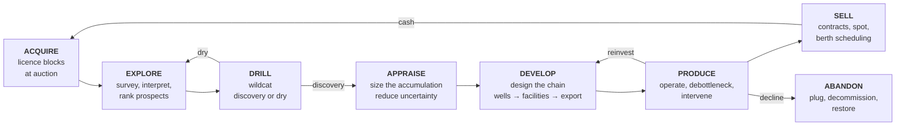
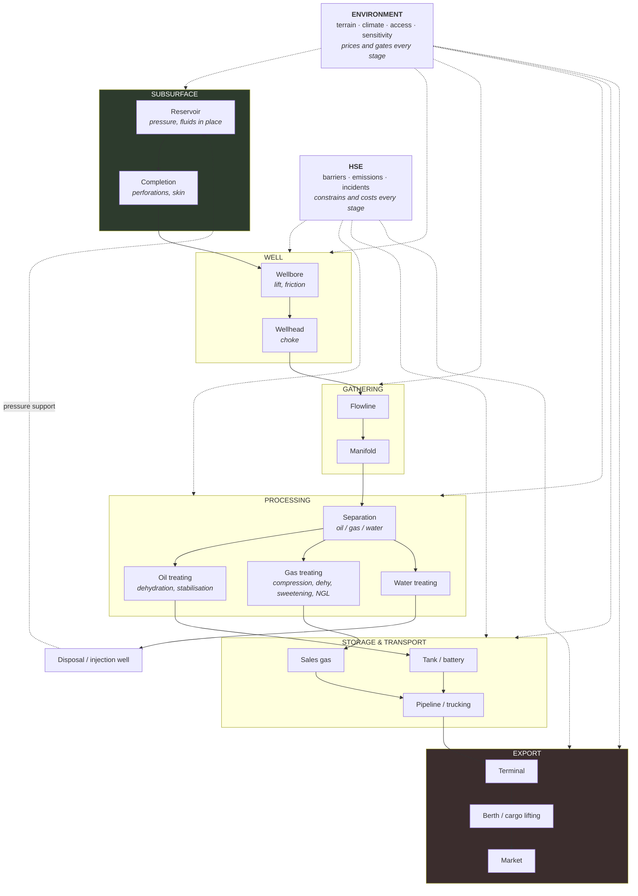

# 00 — Vision

**Status:** draft · **Date:** 2026-08-06

> **Affects:** 01, 18, 20 · **Affected by:** 18, 20
> *(strong couplings only — the full row is in [22](22_DESIGN_COHERENCE.md) §2)*

---

## 1. The one sentence

You run an oil & gas company. You start with a map you cannot see into, a
licence round you cannot afford to win outright, and a bank that wants its money
back. You end with molecules moving from a rock formation two miles down,
through steel you paid for, onto a tanker at a berth with your name on it.

## 2. The player fantasy

Three fantasies, in order of when the player meets them:

1. **The geologist's bet.** You are looking at a map. Somewhere under it is a
   structure holding hydrocarbons. Seismic costs money and only narrows the odds
   — it never removes them. You drill knowing you are probably wrong, and when
   you are right the feeling is *earned*, because the game let you be wrong four
   times first.

2. **The engineer's chain.** A discovery is worthless in the ground. Between the
   reservoir and the money is a chain of physical things that must each be sized
   correctly: perforations, tubing, a lift method, a flowline, a separator, a
   tank, a pipeline, a berth. Undersize any link and the whole chain throttles
   to it. Finding the bottleneck and paying to widen it is the core engineering
   loop.

3. **The operator's decay.** Nothing you build stays as good as the day you
   built it. Reservoir pressure falls. Water cut climbs. Equipment fouls and
   corrodes. Every field is a slow race between the decline curve and your
   ability to intervene. The company that stops investing dies of arithmetic.

## 3. What "close to reality, but fun" means here

This is the central design tension. The rule:

> **The *shape* of every curve is real. The *magnitude* is tuned. The *decision*
> is legible.**

| We simulate faithfully | We deliberately simplify |
|---|---|
| Reservoir pressure depletes as fluid is withdrawn (material balance) | One tank per reservoir compartment, not a 3-D grid |
| Inflow falls as drawdown falls (IPR curves, real Vogel/Darcy forms) | No transient/well-test behaviour; steady state each tick |
| Production declines hyperbolically (Arps) | Decline emerges from pressure, but is *checked* against Arps for sanity |
| Water cut and GOR rise through field life | Three-phase fractions, not a full PVT flash |
| Separators split by phase and have real capacity limits | Fixed split efficiency per unit, not thermodynamic equilibrium |
| Pipelines drop pressure and have hydraulic capacity | Steady-state single-phase correlation, not transient multiphase |
| Exploration is probabilistic and information is purchasable | Chance of success is an explicit, inspectable number |
| Gas needs compression, dehydration, sweetening before sale | Contaminant handling is a small fixed vector (H₂S, CO₂, H₂O) |
| Tanks fill, and a full tank shuts in the well upstream | No sloshing, no vapour-recovery detail |

**The fun test, applied to every model:** *Can the player see the number, form a
theory about how to change it, act, and see it move in the direction they
predicted?* If not, the model is too complex or too hidden, and it gets
simplified or surfaced. A simulation the player cannot form a theory about is
noise, no matter how accurate.

**The realism test, applied to every simplification:** *Would a petroleum
engineer recognise the behaviour and say "yes, that is roughly what happens"?*
If not, the simplification went too far.

## 4. The core loop

Each ring is a different game. Exploration is a probability game. Development is
a design/optimisation game. Production is a maintenance/logistics game. The
company sits on top as a cash-flow game that couples them: exploration is funded
by production, and production ends unless exploration replaces it. **Reserve
replacement ratio is the real score.**

## 5. Scope: exploration to export

The engine simulates the full chain and nothing beyond it.

**In scope:** everything in that diagram, plus the company wrapper (cash,
finance, licences, staff, technology, contracts, regulation, environment).

**Out of scope, permanently:** downstream refining into consumer fuels
(we sell crude, condensate, NGL and sales gas — refining is a *counterparty*, not
a thing the player builds); retail; trading desks; drilling as a
minute-by-minute activity (drilling is a scheduled operation with a duration and
a risk profile, not a mini-game).

## 6. Success criteria for the engine

The engine is finished when all of these are true:

| # | Outcome | How it is measured |
|---|---|---|
| 1 | A full company lifecycle runs headless — first licence to final abandonment | An end-to-end scenario test spanning ~40 years of game time completes with plausible numbers |
| 2 | The material balances everywhere | Every tick, mass in = mass out + Δinventory + Δin-place, to within floating-point tolerance, asserted globally |
| 3 | Physical behaviour is recognisable | Golden curves for pressure depletion, water-cut rise, GOR rise and Arps decline match reference shapes within tuned bands |
| 4 | Determinism holds | Same seed + same command sequence ⇒ byte-identical state hash, across OS and across runs |
| 5 | Every capability is swappable | Every subsystem can be replaced by an alternative implementation with no change to any other subsystem |
| 6 | Nothing is silently wrong | No `catch` discards; every anomaly reaches the audit log; the audit log is queryable in-game |
| 7 | The bottleneck is always findable | For any throttled chain, the engine can name the limiting element and the loss attributable to it |
| 8 | Content is data | New reservoirs, fluids, equipment, technologies, fiscal regimes, environments and scenarios ship as data files, not code |
| 9 | Setting matters | The same reservoir in six environments produces six materially different projects |
| 10 | No slow trap is invisible | Every coupling landing in over two years has a leading indicator published every tick ([21_INTEGRATION](21_INTEGRATION.md) rules IR1–IRR2) |
| 11 | Every crisis is explicable | Every critical event carries a cause chain back to the decision that started it (rule IR5) |

## 7. Non-goals

- **Not a physics showcase.** No transient multiphase solver, no compositional
  PVT, no finite-difference reservoir grid. If a model cannot be explained in
  two sentences to a player, it is the wrong model for this game.
- **Not a spreadsheet.** The player should be making judgement calls under
  uncertainty, not solving a linear program.
- **Not tied to a renderer.** The engine has no UI, no scene graph, no
  presentation vocabulary. It emits state and events; something else draws them.
- **Not a port.** No existing type, file, format or save from the previous
  engine is carried forward.

## 8. Design principles (binding on every later document)

1. **The material is the protagonist.** Every subsystem exists to move,
   transform, store, meter or sell a stream of matter. If a design cannot state
   what it does to the material, it is misplaced.
2. **One engine for the flow.** Reservoir → wellbore → surface → export is a
   single network solved by a single solver. Oil and gas are *not* separate code
   paths; they are different materials in the same pipes.
3. **Capacity is physical, not a number in a spreadsheet.** Every element has a
   real limiting mechanism (pressure, area, volume, power, berth time), and the
   binding constraint is discoverable.
4. **Uncertainty is the game.** Subsurface truth exists in the model and is
   hidden from the player. Information is a purchasable good with a price and an
   accuracy.
5. **Everything is a contract.** No concrete type is ever a dependency. See
   [03_ARCHITECTURE](03_ARCHITECTURE.md).
6. **Failure is loud.** See [09_DIAGNOSTICS](09_DIAGNOSTICS.md).
7. **Standards give us our nouns.** Where PPDM/Energistics have named a thing,
   we use their name and their granularity. See
   [research/PPDM_ALIGNMENT.md](../research/PPDM_ALIGNMENT.md).

## 9. Open decisions for the owner

These change the design materially and are listed here rather than assumed.

| # | Decision | Options | Recommendation | Status |
|---|---|---|---|---|
| D1 | Time step | (a) monthly, (b) weekly, (c) daily with monthly aggregation | **(a) monthly** | ✅ **Resolved** — see [15_TIME_AND_EXECUTION](15_TIME_AND_EXECUTION.md). The engine is turn-based at monthly ticks; the game is real-time-with-pause; sub-monthly activity is handled by within-tick segmentation |
| D2 | World scope | (a) one fictional basin, (b) several fictional basins, (c) real-world geography | **(b)** — variety without licensing or accuracy obligations | open |
| D3 | Offshore | (a) onshore only at first, (b) onshore + offshore from the start | — | ⚠️ **Superseded** by [EV2](13_ENVIRONMENT.md): **onshore + shallow offshore** at v1. Shallow offshore adds platforms, weather downtime and marine export — most of the variety — without subsea, vessels or floating production |
| D4 | Competitors | (a) none, (b) AI companies bidding in licence rounds, (c) full AI operators | **(b)** — auctions need rivals to be tense; full AI operators are a later phase | open |
| D5 | Fidelity dial | (a) fixed models, (b) per-model fidelity levels selectable at new-game | **(b)** | ✅ **Resolved and widened** — fidelity turned out to be one of *three* independent accessibility axes (fidelity × assists × forgiveness). The full reality-level system, with the Advisor and presets, is [18](18_GAME_MODES.md) §5b |

**Nothing downstream is blocked by these.** Where a document must assume, it
assumes the recommendation and says so. The consolidated list across all
documents is in [MASTER_TRACKER](../MASTER_TRACKER.md) §5.

---

## 10. The four cross-cutting systems

Added after the first design pass, because each turned out to touch every stage
rather than sitting beside them:

| System | Document | Why it is cross-cutting |
|---|---|---|
| **Environment** | [13_ENVIRONMENT](13_ENVIRONMENT.md) | The same reservoir is a different project onshore Texas, in the North Sea and on the arctic tundra. Terrain, climate, access and sensitivity change the cost and feasibility of **every** stage, and weather changes them month to month |
| **HSE** | [14_HSE](14_HSE.md) | Not a penalty on the simulation but a discipline within it: barriers that degrade with the plant, leading indicators that precede every serious incident, and two safety dimensions where the cheap one is not the one that kills you |
| **Time and events** | [15_TIME_AND_EXECUTION](15_TIME_AND_EXECUTION.md), [16_EVENT_MATRIX](16_EVENT_MATRIX.md) | The engine is turn-based; the game is real-time-with-pause; alerts decide what the player actually notices |
| **Coupling** | [17_CROSS_IMPACT_MATRIX](17_CROSS_IMPACT_MATRIX.md), [21_INTEGRATION](21_INTEGRATION.md) | Thirty named couplings and nine feedback loops. **Lag is the difficulty** — a coupling landing in three years must be announced by a leading indicator, or the player cannot act on it |

**And the audience answer:** this game is not only for engineers. The
reality-level system ([18](18_GAME_MODES.md) §5b) — per-model fidelity, a
per-domain **Advisor** that works like a flight sim's autopilot, and itemised
forgiveness levers, bundled into presets from *Story* to *Simulation* — lets the
same engine serve a player who wants to watch an oil company grow and a player
who wants to size tubing by hand. The Advisor acts through the same command bus
as the player, reads only what the player could know, and explains every
recommendation — so it is simultaneously the accessibility layer and the
tutorial that never ends.

And two framing documents that make the rest usable:
[18_GAME_MODES](18_GAME_MODES.md) — one objective system under sandbox, mission,
challenge, scenario and campaign — and [20_PLAYER_DECISIONS](20_PLAYER_DECISIONS.md),
which catalogues all 61 decisions and applies a four-part test to each, as the
check on whether this is actually a game.
