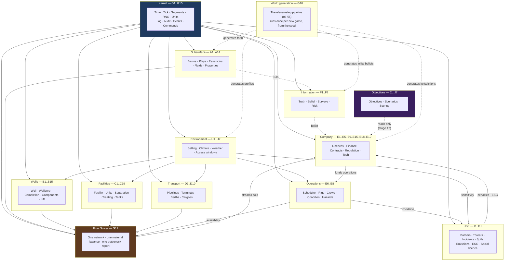

# 01 — Concept Matrix

**Status:** draft · **Date:** 2026-08-06

> **Affects:** 02, 03, 10, 11, 13, 14, 17, 19, phases · **Affected by:** 02, 03, 13, 14, 17, 19
> *(strong couplings only — the full row is in [22](22_DESIGN_COHERENCE.md) §2)*

The single index of the game. Every concept appears exactly once, with the
real-world thing it represents, the standard that names it, the engine contract
that expresses it, the model that animates it, and the thing the player does
with it.

**How to use this document:** if a concept is not in this matrix, it does not
exist in the engine. If it is here, exactly one contract owns it. Adding a
feature means adding a row here *first*.

Legend for **Model**: `state` = data only, no per-tick behaviour · `solved` =
resolved by the flow solver each tick · `stochastic` = has a random component
driven by the seeded RNG · `scheduled` = an operation with a duration.

---

## A. Subsurface

| # | Game concept | Real-world entity | Standard reference | Engine contract | Model | Player verb |
|---|---|---|---|---|---|---|
| A1 | Basin | Sedimentary basin | PPDM `AREA` (type: basin) | `IBasin : ISpatialArea` | state | *explore within* |
| A2 | Play | Petroleum play — a family of prospects sharing a geological model | PPDM `PLAY` | `IPlay` | state + `stochastic` (play-level success correlation) | *form a thesis about* |
| A3 | Prospect | A mapped, drillable target | PPDM `PROSPECT` | `IProspect` | `stochastic` (chance of success) | *rank, then drill* |
| A4 | Lead | An immature prospect needing more data | PPDM `PROSPECT` (status: lead) | `IProspect` (maturity: Lead) | as A3 | *survey to mature* |
| A5 | Field | A discovered accumulation, surface-delineated | PPDM `FIELD` | `IField` | aggregate of A6 | *develop* |
| A6 | Reservoir / Pool | The hydrocarbon-bearing rock volume in one formation | PPDM `POOL`, `RESERVOIR` | **`IReservoir`** | `solved` (material balance) | *deplete, support, flood* |
| A7 | Reservoir compartment | A pressure-isolated block within a reservoir | PPDM `RESERVOIR` subdivision | `IReservoirCompartment` | `solved` | *discover the hard way* |
| A8 | Formation / Stratigraphic unit | Named rock unit | PPDM `STRAT_UNIT`, `STRAT_NAME_SET` | `IStratigraphicUnit` | state | *correlate between wells* |
| A9 | Rock property | Porosity, permeability, net pay, saturation, compressibility | PPDM `RESERVOIR` attributes; Energistics RESQML | **`IProperty`** (typed, unit-bearing) | state, some `stochastic` at world-gen | *measure via logs and cores* |
| A10 | Fluid / Material | Oil, gas, condensate, NGL, water, CO₂, H₂S | PPDM `PRODUCT_TYPE`; Energistics PRODML | **`IMaterial`** | state + phase behaviour | *produce, treat, sell* |
| A11 | Fluid property | API gravity, GOR, viscosity, FVF, bubble point, Z-factor, heating value | PPDM `RESERVOIR_FLUID`; Energistics UoM | `IProperty` on `IMaterial` | derived (correlations) | *sample via well test* |
| A12 | Drive mechanism | Solution gas, gas cap, water drive, compaction, gravity drainage | Industry standard classification | `IDriveMechanism` (plugin) | `solved` | *identify, then exploit* |
| A13 | Trap & seal | Structural/stratigraphic closure and its cap rock | PPDM `PROSPECT` attributes | `ITrap` | state (integrity ⇒ risk) | *infer from seismic* |
| A14 | Aquifer | Water body providing pressure support | Reservoir engineering | `IAquifer` (a `IReservoirCompartment` variant) | `solved` (influx model) | *hope for, then manage* |
| A15 | Detectability & accessibility | Trap subtlety; depth/water/HPHT/tight/sour requirements | Industry practice (subsalt, tight, HPHT plays) | `TrapSubtlety`, `AccessRequirements` (truth attrs on the accumulation) | generated (06 §2.3) | *re-screen when your tech grows; unlock what you shelved* |

## B. Well

PPDM's granularity is adopted deliberately: **a well is not a hole**. A well is a
surface/regulatory entity; the hole is a wellbore; the producing configuration is
a completion. This separation is what makes sidetracks, re-completions and
multilateral wells expressible instead of special-cased.

| # | Game concept | Real-world entity | Standard reference | Engine contract | Model | Player verb |
|---|---|---|---|---|---|---|
| B1 | Well | The regulatory/surface entity: one surface location, one licence, one name | PPDM `WELL` | **`IWell`** | container | *propose, name, licence* |
| B2 | Wellbore | A physical hole; the original hole plus any sidetracks | PPDM `WELL_BORE` | `IWellbore` | `scheduled` while drilling | *drill, sidetrack, deepen* |
| B3 | Wellbore path | Deviation survey; vertical, deviated, horizontal | PPDM `WELL_DIR_SRVY`; WITSML trajectory | `IWellPath` | state (geometry ⇒ friction, contact length) | *plan the trajectory* |
| B4 | Completion | The configured producing interval on a wellbore | PPDM `WELL_COMPLETION` | `ICompletion` | `solved` (IPR) | *complete, re-complete* |
| B5 | Perforation | The connection between reservoir and wellbore | PPDM `WELL_PERF` | `IPerforation` | `solved` (contributes to inflow) | *perforate, isolate* |
| B6 | Well component | Casing, tubing, packer, screen, valve, tree, gauge | PPDM `WELL_EQUIPMENT`, `WELL_COMPONENT` | **`IWellComponent`** | state + condition | *install, pull, replace* |
| B7 | Artificial lift | Gas lift, ESP, rod pump, PCP, jet pump | PPDM `WELL_EQUIPMENT` (lift type) | `ILiftMethod : IWellComponent` | `solved` (modifies VLP) | *install when it stops flowing* |
| B8 | Choke | Surface flow restriction | PPDM `WELL_EQUIPMENT` | `IChoke : IWellComponent` | `solved` (sets operating point) | *open, pinch back* |
| B9 | Well status | Producing, shut-in, suspended, injecting, abandoned | PPDM `WELL_STATUS` | `IWell.Status` | state machine | *shut in, reactivate* |
| B10 | Well class | Exploration/wildcat, appraisal, development, injector, observation | PPDM `WELL` (class, profile) | `IWell.Classification` | state | *choose when proposing* |
| B11 | Well test | A measurement of rate, pressure, and fluid ratios | PPDM `WELL_TEST`; PRODML | `IWellTest` | `stochastic` (measurement error) | *buy information* |
| B12 | Well log | Wireline/LWD measurement of rock properties | PPDM `WELL_LOG`; WITSML/LAS | `IWellLog` | `stochastic` (reveals `IProperty` with error) | *run to reduce uncertainty* |
| B13 | Core | Physical rock sample; the highest-confidence property measurement | PPDM `CORE_ANALYSIS` | `ICoreAnalysis` | `stochastic` (lowest error) | *cut when it matters* |
| B14 | Skin | Near-wellbore damage or stimulation | Reservoir engineering (Hawkins) | `IProperty` on `ICompletion` | `solved` (inflow penalty/bonus) | *acidise, frac* |
| B15 | Intervention | Workover, stimulation, recompletion, plug & abandon | PPDM `WELL_ACTIVITY` | `IWellOperation : IOperation` | `scheduled` | *schedule and pay for* |

## C. Surface facilities

| # | Game concept | Real-world entity | Standard reference | Engine contract | Model | Player verb |
|---|---|---|---|---|---|---|
| C1 | Facility | Any surface installation | PPDM `FACILITY` | **`IFacility`** | container of C-units | *build, expand, retire* |
| C2 | Facility unit | One process unit inside a facility | PPDM `FACILITY` hierarchy | **`IFacilityUnit`** | `solved` | *size correctly* |
| C3 | Wellsite / pad | Surface location serving one or more wells | PPDM `FACILITY` (type: wellsite) | `IFacility` (WellSite) | container | *site, share costs across wells* |
| C4 | Flowline | Well → manifold line | PPDM `FACILITY` (type: flowline) | **`IPipeline`** (segment class: flowline) | `solved` (hydraulics) | *size the diameter* |
| C5 | Manifold / header | Commingling point | PPDM `FACILITY` | `IFlowNode` | `solved` (mixing) | *route, allocate* |
| C6 | Separator | 2- or 3-phase phase splitter | PPDM `FACILITY` (battery component) | `ISeparator : IFacilityUnit` | `solved` (split + capacity) | *size for peak liquid + gas* |
| C7 | Heater-treater | Breaks emulsion, removes BS&W | Industry | `ITreater : IFacilityUnit` | `solved` (spec compliance) | *add when water cut rises* |
| C8 | Stabiliser | Removes light ends to meet vapour-pressure spec | Industry | `IStabiliser : IFacilityUnit` | `solved` | *add for export spec* |
| C9 | Compressor | Raises gas pressure | PPDM `FACILITY` (compressor station) | `ICompressor : IFacilityUnit` | `solved` (head, power, stages) | *stage as pressure falls* |
| C10 | Dehydrator | Removes water from gas (TEG/mol sieve) | Industry | `IDehydrator : IFacilityUnit` | `solved` (spec compliance) | *add to meet pipeline spec* |
| C11 | Sweetening unit | Removes H₂S/CO₂ (amine) | Industry | `IAcidGasRemoval : IFacilityUnit` | `solved` | *required for sour gas* |
| C12 | NGL plant | Extracts ethane/propane/butane/condensate | Industry | `INglExtraction : IFacilityUnit` | `solved` (yield split) | *build when NGL prices justify* |
| C13 | Tank | Atmospheric or pressurised liquid storage | PPDM `FACILITY` (tank) | **`ITank`** | `solved` (inventory, ullage) | *size against offtake gaps* |
| C14 | Tank battery | Group of tanks + treating at a lease | PPDM `FACILITY` (battery) | `IFacility` (Battery) | container | *centralise* |
| C15 | Custody meter (LACT) | Metered, contractual change of ownership | PPDM `FACILITY`; API MPMS | **`ICustodyTransferPoint`** | `solved` (records the sale event) | *the point you get paid* |
| C16 | Flare / vent | Disposal of gas that cannot be sold | PPDM `FACILITY` | `IFlare : IFacilityUnit` | `solved` (emissions + penalty) | *avoid; regulators are watching* |
| C17 | Power supply | Grid, gensets, or turbines driving the site | Industry | `IPowerSource : IFacilityUnit` | `solved` (power balance) | *size, or everything stops* |
| C18 | Water treatment | Produced-water cleanup | Industry | `IWaterTreatment : IFacilityUnit` | `solved` | *mandatory before disposal* |
| C19 | Disposal / injection well | Water or gas re-injection | PPDM `WELL` (class: injector) | `IWell` (Injector) | `solved` (couples back to A6) | *dispose, or support pressure* |

## D. Transport & export

| # | Game concept | Real-world entity | Standard reference | Engine contract | Model | Player verb |
|---|---|---|---|---|---|---|
| D1 | Pipeline | A transport link with hydraulic capacity | PPDM `FACILITY` (pipeline); PODS | **`IPipeline`** | `solved` (pressure drop) | *lay, loop, uprate* |
| D2 | Pump station | Boosts liquid pressure | Industry | `IPumpStation : IFacilityUnit` | `solved` | *add on long lines* |
| D3 | Trucking route | Road haulage where no pipe exists | Industry | `ITruckingRoute : ITransportLink` | `solved` (batch, cost/bbl) | *the expensive stopgap* |
| D4 | Rail terminal | Rail loading | Industry | `IRailLink : ITransportLink` | `solved` | *mid-scale alternative* |
| D5 | Terminal | Storage + loading at the coast | PPDM `FACILITY` (terminal) | `IFacility` (Terminal) | container | *the gate to market* |
| D6 | Berth | A ship loading position with a queue | Marine ops | `IBerth` | `scheduled` (occupancy) | *schedule cargoes* |
| D7 | Cargo / lifting | One tanker load sold under a contract | Industry | `ICargo` | `scheduled` | *nominate, load, get paid* |
| D8 | LNG train | Gas liquefaction for marine export | Industry | `ILiquefactionTrain : IFacilityUnit` | `solved` | *the capital-heavy gas exit* |
| D9 | Sales gas pipeline | Gas exit into a grid, on spec | PPDM; contract | `ICustodyTransferPoint` | `solved` (spec gate) | *meet spec or be rejected* |
| D10 | Third-party access | Someone else's pipe, at a tariff | Contract | `ITransportContract` | state | *rent instead of build* |

## E. Operations & company

| # | Game concept | Real-world entity | Standard reference | Engine contract | Model | Player verb |
|---|---|---|---|---|---|---|
| E1 | Company | The player's operating entity | PPDM `BUSINESS_ASSOCIATE` | `ICompany` | state | *is you* |
| E2 | Partner / JV | Non-operated working interest | PPDM `BA_INTEREST` | `IWorkingInterest` | `solved` (cost & revenue share) | *farm out risk* |
| E3 | Licence / lease / block | The right to explore and produce in an area | PPDM `LAND_RIGHT`, `BA_LAND_RIGHT` | **`ILicence`** | state + expiry clock | *bid, hold, relinquish* |
| E4 | Work commitment | Obligations attached to a licence | Contract | `IWorkCommitment` | scheduled obligation | *satisfy or forfeit* |
| E5 | Fiscal regime | Royalty / tax / PSC terms | Industry | `IFiscalRegime` (plugin) | `solved` (revenue split) | *read before you bid* |
| E6 | Rig | Drilling unit, contracted by the day | PPDM `WELL_ACTIVITY` resource | `IRig : IOperatingAsset` | `scheduled` (day rate, availability) | *contract ahead of need* |
| E7 | Operation | Any scheduled multi-tick activity | PPDM `WELL_ACTIVITY` | **`IOperation`** | `scheduled` | *queue, fund, watch* |
| E8 | Crew / staff | People with disciplines and skill | Industry | `IPersonnel` | state (modifies durations & risk) | *hire, train, retain* |
| E9 | Contract (offtake) | An agreement to sell volume on terms | Industry | `ISalesContract` | `solved` (price + penalty) | *lock in or ride spot* |
| E10 | Market | Price formation for each product | Industry benchmarks | `IMarket`, `IPriceModel` (plugin) | `stochastic` | *time, hedge, endure* |
| E11 | Finance | Cash, debt, equity, cost of capital | Accounting | `ITreasury` | `solved` | *borrow, repay, survive* |
| E12 | Cost | CAPEX, OPEX, lifting cost, abandonment provision | Accounting | `ICostLedger` | `solved` | *watch it climb* |
| E13 | Reserves | 1P/2P/3P booked volumes | SPE-PRMS | `IReservesBooking` | derived | *the number the market judges* |
| E14 | Technology | Unlockable capability | — | `ITechnology` | state ⇒ modifies models | *research, deploy* |
| E15 | Regulation | Emissions limits, flaring rules, spill liability | Jurisdictional | `IRegulator` | `solved` (inspection, penalty) | *comply or pay* |
| *E16–E17* | *moved to the HSE section as I11–I12 — see the ownership note there. Row numbers are stable identifiers and are never reused* | | | | | |
| E18 | Decommissioning | Plug wells, remove facilities, restore site | Regulation | `IAbandonmentPlan` | `scheduled` | *the bill that always comes* |
| E19 | Working interest | Share of costs and revenues in a licence | PPDM `BA_INTEREST` | `IWorkingInterest` | `solved` | *farm out, or carry* |

## F. Information & uncertainty

The thing that makes exploration a game rather than a lottery.

| # | Game concept | Real-world entity | Standard reference | Engine contract | Model | Player verb |
|---|---|---|---|---|---|---|
| F1 | Ground truth | What is actually underground | — | `ITruthModel` (**never** exposed to the player layer) | generated once, per seed | — |
| F2 | Belief | What the player currently knows, with error bars | — | **`IBelief<TProperty>`** | Bayesian update | *the thing you actually decide on* |
| F3 | Seismic survey | 2-D / 3-D / 4-D acquisition | PPDM `SEIS_SET`, `SEIS_SURVEY` | `ISurvey : IInformationSource` | `scheduled` + `stochastic` | *buy resolution* |
| F4 | Interpretation | Turning data into a mapped structure | PPDM `SEIS_INTERP` | `IInterpretation` | reduces belief variance | *spend time to sharpen* |
| F5 | Chance of success | P(discovery) = source × reservoir × seal × trap × timing | Industry (petroleum system) | `IRiskFactorSet` | derived, inspectable | *the number you bet on* |
| F6 | Volumetric estimate | P10 / P50 / P90 in-place and recoverable | SPE-PRMS | `IVolumetricEstimate` | distribution | *the range you plan against* |
| F7 | Information source | Anything that reduces uncertainty at a price | — | **`IInformationSource`** | `stochastic` | *the exploration economy* |

## G. Cross-cutting engine services

| # | Concept | Engine contract | Notes |
|---|---|---|---|
| G1 | Time | `ISimulationClock` | Monotonic; the only source of "now". Nothing else keeps time. |
| G2 | Randomness | `IRandomSource` | Seeded, streamed per subsystem, never `Random.Shared`. Determinism depends on it. |
| G3 | Units | **`IQuantity`**, `IUnitSystem` | Every number carries a unit. See [10_CONTENT_AND_UNITS](10_CONTENT_AND_UNITS.md). |
| G4 | Logging | **`ILog`** | Structured, levelled, correlated by operation id. |
| G5 | Audit | **`IAuditTrail`** | Immutable record of every state-changing decision and every failure. See [09_DIAGNOSTICS](09_DIAGNOSTICS.md). |
| G6 | Errors | `IFaultPolicy` | How each fault class is handled. No `catch` outside this policy. |
| G7 | Events | `IEventBus` | Engine → observer notifications. Never used for intra-engine control flow. |
| G8 | Persistence | `IStateSerializer` | Per-module, versioned, round-trip verified. |
| G9 | Content | `ICatalog<T>`, `IContentLoader` | All definitions are data. |
| G10 | Plugins | `IModule`, `IModuleRegistry` | Composition. See [03_ARCHITECTURE](03_ARCHITECTURE.md). |
| G11 | Commands | `ICommand`, `ICommandBus` | Every player action is a validated, auditable, replayable command. |
| G12 | Solver | `IFlowSolver` | The one flow engine. See [04_MATERIAL_AND_FLOW](04_MATERIAL_AND_FLOW.md). |
| G13 | Tick pipeline | `ITickPipeline` | The 14 ordered stages of [03_ARCHITECTURE](03_ARCHITECTURE.md) §6. Stage membership is declared, not discovered. |
| G14 | Segmentation | `ISegmentPlan` | Within-tick intervals of constant availability. **Segmented, never averaged** — the solve is non-linear. Budget 4, merges audited. |
| G15 | Calendar | `IGameCalendar` | Month, quarter, year and season boundaries on real dates — needed by era gating, carbon trajectories and historical price replay. |
| G16 | World generator | **`IWorldGenerator`** | The eleven-step causal pipeline of [06](06_WORLD_AND_EXPLORATION.md) §5 — basins, plays, **reservoirs, accumulations (truth)**, surface, jurisdictions, initial beliefs. A plugin ([03](03_ARCHITECTURE.md) §3.2): procedural / handcrafted scenario / replay. Module `OGSim.World`, phase [R15](../phases/R15_WORLD.md). |
| G17 | Spatial primitives | `Coordinate`, `ISpatialArea`, `GeodesicDistance` | Kernel geometry: continuous coordinates (open decision W1), polygonal areas for blocks/prospects/footprints, distance for pipeline length, logistics and remoteness. Everything spatial computes through these — no module invents its own geometry. |

## H. Environment and setting

The physical world operations happen in. See [13_ENVIRONMENT](13_ENVIRONMENT.md).

| # | Game concept | Real-world entity | Standard reference | Engine contract | Model | Player verb |
|---|---|---|---|---|---|---|
| H1 | Setting | Terrain, water depth, ground conditions | PPDM `AREA` attributes | **`IEnvironmentProfile`** | state ⇒ restricts, moves envelopes, changes parameters | *price it into the bid* |
| H2 | Climate | Temperature range, seasonality, precipitation, wind, ice | Meteorological | `IClimateProfile` | state | *plan around* |
| H3 | Weather | The current conditions and days lost this tick | Meteorological | **`IWeatherModel`** | `stochastic` (seasonal + noise + extremes) | *endure, and schedule around* |
| H4 | Forecast | Predicted conditions, accuracy falling with horizon | Meteorological | `IForecast` | derived | *commit or wait* |
| H5 | Access mode | Road, rail, port, airstrip, helicopter, ice road | Logistics | `IAccessMode` | state + seasonal availability | *the reason remote costs more* |
| H6 | Access window | The season in which an operation is possible | Operations | `IAccessWindow` | `scheduled` | ***commit, or lose a year*** |
| H7 | Sensitivity | Protected areas, settlements, aquifers, fisheries | Regulatory / ESG | `ISensitivityDesignation` | state ⇒ multiplies consequence | *avoid, or insure against* |
| H8 | Terrain & hydrology | Elevation, terrain class, rivers, coastline, **bathymetry** | Geographic | `ITerrainModel` | state (generated, 06 §5.1a) | *route and site against* |
| H9 | Settlement | Towns and cities: population, labour, services | Geographic | `ISettlement` | state + **slow growth responding to regional employment** | *hire from, stay clear of, answer to* |
| H10 | Public infrastructure | Roads, rail, public ports, grid, **third-party pipelines & terminals with tariffs** | Geographic / commercial | `IPublicInfrastructure` | state ⇒ computed remoteness & rent-vs-build options | *use for a tariff, or build your own* |

## I. Health, safety and environment

The discipline, not the penalty. See [14_HSE](14_HSE.md).

| # | Game concept | Real-world entity | Standard reference | Engine contract | Model | Player verb |
|---|---|---|---|---|---|---|
| I1 | Barrier | A defence preventing or mitigating a hazard | Industry bow-tie / safety case | **`IBarrier`** | `solved` (strength = equipment condition + competency + procedure) | *buy, test, maintain* |
| I2 | Threat | A condition that could cause loss of containment | Bow-tie | `IThreat` | `stochastic` | *reduce at source* |
| I3 | Top event | Loss of containment | Bow-tie | `ITopEvent` | `stochastic` (product of barrier failures) | *the thing you are preventing* |
| I4 | Near miss | A threat that passed some barriers, not all | HSE | `INearMiss` | `stochastic` | ***investigate — it is a free warning*** |
| I5 | Process safety | Preventing major accidents | Industry | `IProcessSafetyIndicator` | derived | *expensive, and the one that matters* |
| I6 | Personal safety | Individual injuries | Industry | `IPersonalSafetyIndicator` | derived | *cheap, and easy to make look good* |
| I7 | Spill | Loss of containment to the environment | Regulatory | `ISpill` | `stochastic` ⇒ `scheduled` cleanup | *contain, clean, pay* |
| I8 | Social licence | Community acceptance, distinct from compliance | Industry / ESG | `ISocialLicence` | `solved` | *earn, or lose access* |
| I9 | ESG standing | Aggregate environmental and safety performance | Finance / ESG | `IEsgStanding` | derived ⇒ affects cost of capital | *the slowest loop in the game* |
| I10 | Induced seismicity | Felt earthquakes caused by fluid disposal | Regulatory | `ISeismicityRisk` | `stochastic` | *reduce volumes, or relocate* |
| I11 | Emissions ledger | CO₂, methane, flaring, SOx/NOx, VOC | Industry / ESG | `IEmissionsLedger` | `solved` | *reduce, or be capped* |
| I12 | Incident | Blowout, leak, fire, toxic release | HSE | `IIncident` | `stochastic` (bow-tie) | *prevent, then respond* |

> **Ownership note.** `IEmissionsLedger` and `IIncident` were listed under
> *Operations & company* in the first draft while
> [03_ARCHITECTURE](03_ARCHITECTURE.md) §8 assigned them to `OGSim.Hse`. Two
> documents naming different owners for one fact is exactly what law **L5**
> forbids, so they are moved here. `IRegulator` (E15) stays with the company:
> the regulator is a jurisdictional actor that *inspects*, while the ledger and
> the incident are HSE state.

## J. Play framing

| # | Game concept | Engine contract | Model | Notes |
|---|---|---|---|---|
| J1 | Objective | **`IObjective`** | evaluated at tick stage 12 | Observes; never influences. See [18_GAME_MODES](18_GAME_MODES.md) |
| J2 | Scenario | `IScenario` | content | Starting state + objectives + scoring + modifiers |
| J3 | Campaign | `ICampaign` | content | Ordered chapters with declared persistence and branching |
| J4 | Score | `IScoreDimension` | derived | Eight dimensions; cash is not one of them alone |
| J5 | Modifier | *(reuses model/content selection)* | — | Never a bare difficulty multiplier |
| J6 | Reality profile | `IRealityProfile` | content | Fidelity selections × Advisor levels × forgiveness levers × alert profile. See [18](18_GAME_MODES.md) §5b |
| J7 | Advisor | `IAdvisor` | player-side agent | **Outside the engine**: reads the R21 surface, acts through the command bus, per-domain Manual/Advise/Confirm/Auto. Never sees truth |

---

## Concept ownership map

Which module owns which rows. No concept is owned twice — that rule is what the
old engine violated repeatedly, and it is checked by an architecture test.

**Direction rule:** the Kernel depends on nothing. Domain modules depend only on
the Kernel and on other modules' *contracts*. The Flow Solver depends on the
domain contracts only. The Company module depends on domain contracts and the
solver's *output*, never its internals. **Objectives read and never write.**
There are no upward or sideways dependencies, and no cycles.

**Tick placement:** each module's work happens in the stages named in
[03_ARCHITECTURE](03_ARCHITECTURE.md) §6, and the full stage-to-event mapping —
which module raises which event, and what it can read when — is in
[21_INTEGRATION](21_INTEGRATION.md) §4.
