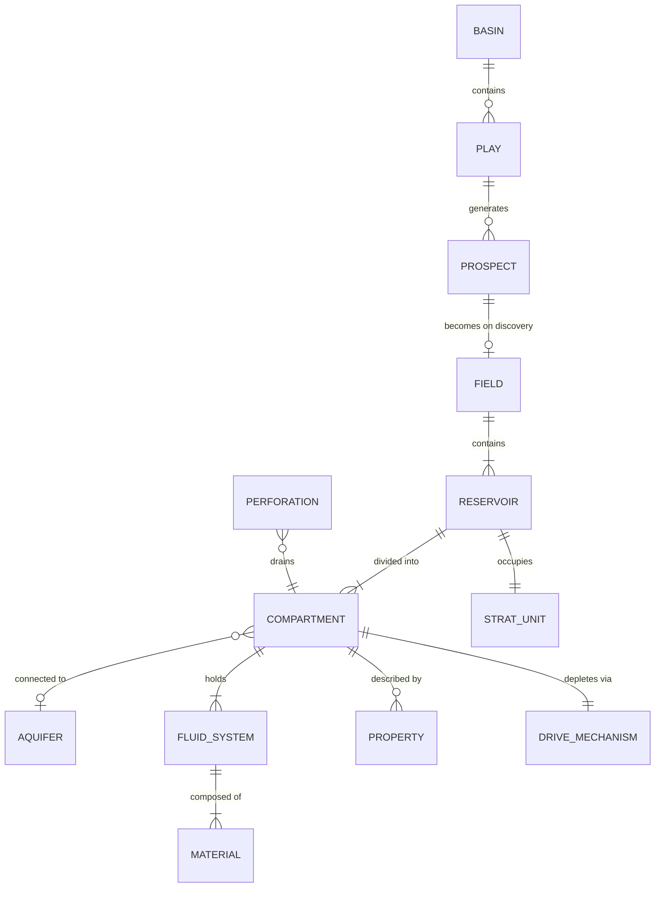
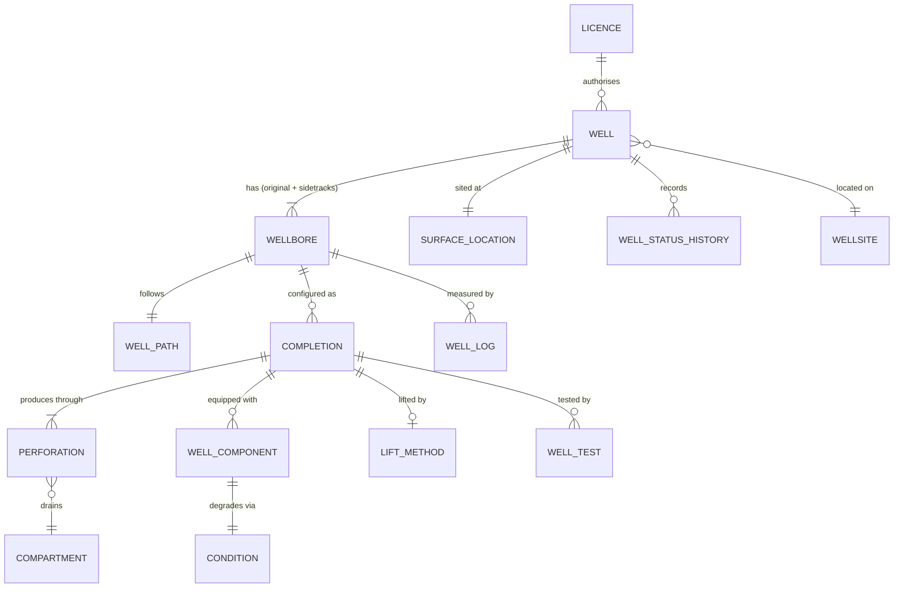
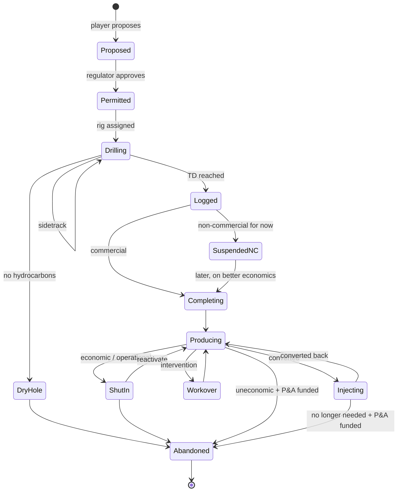
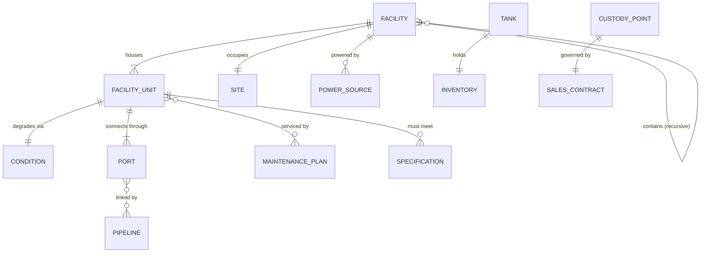
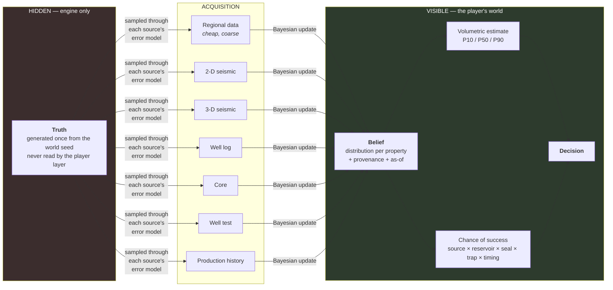
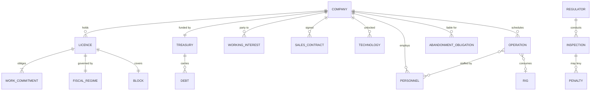
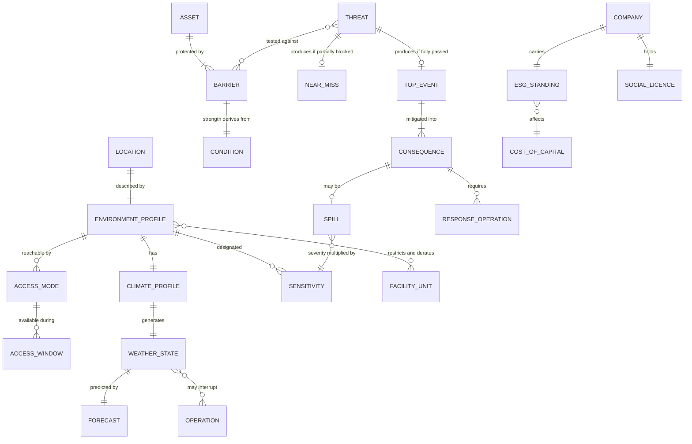

# 02 — Domain Model

**Status:** draft · **Date:** 2026-08-06

> **Affects:** 01, 03, 04, 05, 10, 11, 19, phases · **Affected by:** 01, 03, 04, 13, 14, 19
> *(strong couplings only — the full row is in [22](22_DESIGN_COHERENCE.md) §2)*

The entities, their relationships, their identity rules and their lifecycles.
Grounded in [research/PPDM_ALIGNMENT.md](../research/PPDM_ALIGNMENT.md); indexed
by [01_CONCEPT_MATRIX](01_CONCEPT_MATRIX.md).

> This document defines **shape and responsibility**, not signatures. Interface
> members are settled in the per-phase design documents once the shape is
> approved. Nothing here is code.

---

## 1. The five foundation abstractions

Everything else is built from these. They are the reason the engine can claim
"one engine for oil or gas".

### 1.1 `IQuantity` — a number that knows what it is

A magnitude bound to a unit, whose unit belongs to a dimension. Two quantities of
different dimensions cannot be added; two of the same dimension in different
units convert exactly. **No physical value in the engine is a bare number.**

*Rationale:* the entire chain from reservoir to berth is unit conversions —
reservoir barrels to stock-tank barrels, standard cubic feet to sales-gas energy,
psi to bar. Getting one wrong is silent and catastrophic. Making it inexpressible
is cheaper than testing for it.

### 1.2 `IProperty` — a fact about something, and how well we know it

| Facet | Meaning |
|---|---|
| **Kind** | What physical quantity this is (porosity, permeability, pressure…). Drawn from a registered property-kind catalogue. |
| **Value** | An `IQuantity`, or a distribution over one. |
| **Provenance** | How it is known: `Assumed`, `Analogue`, `Seismic`, `Log`, `Core`, `WellTest`, `ProductionHistory`, `Measured`. |
| **Uncertainty** | Spread. Provenance implies a default; measurement narrows it. |
| **AsOf** | When it was established. Properties can go stale. |

*Rationale:* this single abstraction carries the exploration game. It also means
"what do we know about this reservoir and how confident are we?" is answerable by
walking a property bag, not by hand-written per-field bookkeeping.

### 1.3 `IMaterial` — the protagonist

A registered substance with properties (density, viscosity, molecular weight,
heating value, phase behaviour parameters, contaminant fractions, price
reference). The engine **never** branches on material identity. It reads
properties.

*Rationale:* this is the concrete meaning of "one engine for oil or gas". A
separator does not ask "is this oil?" — it asks each material for its phase at
the separator's pressure and temperature. Adding helium recovery is content.

### 1.4 `IStream` — material in motion

The unit of exchange between every element of the flow network: a composition
(material → quantity per unit time), plus the thermodynamic state (pressure,
temperature) that determines how it behaves next.

*Rationale:* one type crosses every boundary from perforation to berth. There is
no separate "oil rate" and "gas rate" plumbing; there is a stream with a
composition. This is what makes the flow solver singular rather than three
parallel solvers.

### 1.5 `IFlowElement` — anything the stream passes through

Everything physical in the chain implements this: it accepts inbound streams,
declares its constraints, and produces outbound streams. Wells, pipes,
separators, tanks, compressors, terminals — all the same shape to the solver.

| Element must declare | Meaning |
|---|---|
| **Ports** | Named inlets and outlets, each with an accepted phase/material profile |
| **Constraints** | Its physical limits — capacity, pressure envelope, power draw, spec requirements |
| **Transform** | What it does to a stream passing through |
| **Availability** | Whether it is currently operable (condition, maintenance, power, incident) |

*Rationale:* the solver knows only `IFlowElement`. New equipment is a new
implementation and a content file; the solver is untouched.

---

## 2. Subsurface



### 2.1 `IReservoirCompartment` — the simulated unit

The hydraulically connected volume on which material balance is solved. It owns:

- **In-place volumes** per material (the truth; the player sees an estimate)
- **Current pressure** — the single state variable that drives everything
- **Rock properties** — porosity, permeability, net pay, area, compressibility
- **Fluid contacts** — gas-oil contact, oil-water contact, moving over time
- **Drive mechanism** — a plugin determining how pressure responds to withdrawal
- **Connectivity** — to other compartments and to aquifers, with a transmissibility

**Lifecycle:** generated at world-gen (truth) → undiscovered → discovered →
appraised → on production → depleted → abandoned.

**The core invariant:** cumulative production out of a compartment, converted to
reservoir conditions, plus remaining in place, plus any injected volume, equals
original in place. Asserted every tick. If it fails, the tick fails loudly.

### 2.2 `IDriveMechanism` — a plugin, deliberately

Solution gas drive, gas cap expansion, water drive, compaction drive, gravity
drainage, and combinations. Each is a different pressure-vs-withdrawal
relationship and a different recovery factor band. Making it a plugin means:

- The player's identification of the drive is meaningful gameplay
- Recovery factor is not a magic constant — it *emerges* from the mechanism
- Adding EOR (waterflood, gas injection, CO₂) is adding a mechanism, not editing
  a reservoir class

### 2.2b Detectability and accessibility — truth attributes on the accumulation

Generated at world-gen alongside volumes and fluids
([06](06_WORLD_AND_EXPLORATION.md) §2.3):

- **`TrapSubtlety`** (D0–D3): consumed *only* by observation models — a survey
  below the class's tier spawns no lead. Lives with the truth in
  `OGSim.Information`'s reach; the belief layer can represent "beyond current
  imaging" without knowing what is beyond it.
- **`AccessRequirements`**: depth class, water-depth class, HPHT flag,
  tight-rock flag, sour flag — consumed by **command validation** on the
  operations that would violate them (a rig without the depth tier cannot spud;
  a tight discovery without fracturing books as contingent-with-technology-
  trigger, not as reserves).

Both are dependencies *of the reservoir*, not of the player — which is what
makes technology an exploration lever and the era campaign work.

### 2.3 `IFluidSystem`

The fluid content of a compartment: which materials, in what proportion, and the
PVT behaviour that governs how they change with pressure — bubble point,
formation volume factors, solution GOR, gas Z-factor, viscosities. As pressure
falls below bubble point, gas comes out of solution; GOR rises; oil viscosity
rises; production falls faster than the player expects. **That sequence is a core
piece of drama and it must fall out of the model, not be scripted.**

---

## 3. Wells

The PPDM four-level hierarchy, adopted whole.



### 3.1 Responsibility split

| Level | Owns | Does **not** own |
|---|---|---|
| `IWell` | Identity, name, surface location, licence, operator, classification, status history, abandonment obligation | Anything about flow |
| `IWellbore` | Geometry (trajectory, depths), casing, the drilling record, integrity | Production configuration |
| `ICompletion` | The producing configuration: tubing, packer, lift method, choke; **the inflow and outflow calculation** | Rock properties |
| `IPerforation` | The connection to one compartment: interval, open/isolated, skin, contribution factor | Anything above the sandface |

**`ICompletion` is where the well physics lives.** It is the element that
computes inflow from the reservoir (IPR) and outflow up the tubing (VLP) and
finds the operating point where they cross. Everything else about a well is
identity, geometry or equipment.

### 3.2 `IWellComponent` — the equipment tree

Casing, tubing, packers, screens, safety valves, gas-lift mandrels, ESPs, rod
pumps, chokes, wellhead, christmas tree, downhole gauges.

Each component instance references a **catalogue tier** — a content entry
carrying its specification (size, rating, material, performance curves), its
capital cost and install duration, its degradation and failure profile, and its
`requiresTech` gate ([07](07_TECHNOLOGY.md) §4b). The instance adds only what is
per-asset: **condition**, service history, and installation date. Upgrading a
component is a workover that swaps which tier the instance references.

*Rationale for making these real objects rather than a "condition" float on the
well:* the player's intervention decisions need a target. "The ESP is at 40%
condition and ESPs in high-GOR service fail early" is a decision. "The well is at
40%" is a slider.

### 3.3 `ILiftMethod` — the pressure story

Every well starts flowing naturally, and every well stops. When reservoir
pressure can no longer push fluid to surface against the hydrostatic column and
friction, the well dies. Artificial lift is the answer, and each method has a
different cost, capability envelope and failure mode:

| Method | Adds | Best for | Weakness |
|---|---|---|---|
| Natural flow | — | High pressure, early life | Ends |
| Gas lift | Reduces column density by injecting gas | High GOR, deviated wells, sandy fluid | Needs a compressed gas supply |
| ESP (electric submersible pump) | Adds pressure directly, high rate | High rate, high water cut | Power-hungry; fails on gas and solids |
| Rod pump | Mechanical lift | Low rate, shallow, late life | Rate-limited; deviation-limited |
| PCP | Progressive cavity | Viscous oil, sand | Elastomer wear |

**This is one of the game's best decisions**, because it is a genuine
capex-vs-recovery trade with a wrong answer available in both directions.

### 3.4 Well lifecycle



Every transition is a **command**, is audited, costs money and takes time.
There is no path that skips the abandonment obligation.

---

## 4. Facilities



### 4.1 The recursion rule

`IFacility` is a **container and a cost centre**, never a process. It has a
location, an owner, a construction state, a power balance and a set of units.
All physics is in `IFacilityUnit`s, each of which is an `IFlowElement`.

There is no `Refinery` class, no `GasPlant` class. There is a facility whose
units happen to be a compressor, a dehydrator and an NGL extractor. **The player
builds a gas plant by choosing units, and the plant they get is exactly the units
they paid for.** This is the difference between a build system and a menu.

**And there is no facility-type hierarchy in code at all.** "Wellsite", "tank
battery", "gas plant", "terminal" are `facility-template` content entries —
named unit bundles ([R8](../phases/R8_FACILITIES.md) §2.2) — and after
construction the engine knows only the units. The PPDM-style type list in
[research/PPDM_ALIGNMENT](../research/PPDM_ALIGNMENT.md) §3 ships as templates,
not as an enum: adding "LNG plant" or "water hub" as a recognisable buildable
thing is a JSON file (non-negotiable 11).

### 4.2 The unit taxonomy

| Family | Units | What they do to the stream |
|---|---|---|
| **Separation** | 2-phase separator, 3-phase separator, free-water knockout, slug catcher | Split one stream into phase-based streams |
| **Oil treating** | Heater-treater, desalter, stabiliser | Remove water/salt/light ends until the oil meets sales spec |
| **Gas treating** | Compressor, dehydrator, amine sweetener, NGL extractor, sulphur recovery | Raise pressure, remove water/H₂S/CO₂, extract liquids until gas meets pipeline spec |
| **Water handling** | Skim tank, hydrocyclone, filter, injection pump | Clean produced water until it meets disposal/injection spec |
| **Storage** | Atmospheric tank, pressure vessel, sphere, cavern | Hold inventory; provide ullage; buffer against offtake gaps |
| **Measurement** | LACT unit, orifice meter, coriolis meter, sampler | Record custody transfer, with a measurement uncertainty |
| **Utilities** | Genset, gas turbine, grid tie, flare, vapour recovery | Supply power; dispose of what cannot be sold |
| **Support** | Accommodation camp, warehouse, workshop, operations base, helipad/airstrip | **Touch no stream.** Their datasheets act on *operations*: crew rotation cost, spares lead time, standby rates, mobilisation time — the remoteness levers of [13](13_ENVIRONMENT.md) §3.6, purchasable. Same `facility-unit` content kind, same construction operation, same condition and cost model — the proof that "everything the same way" includes buildings that never see a barrel |

### 4.3 `ISpecification` — the gate that creates the game

A specification is a set of limits a stream must satisfy at a point: BS&W ≤ x%,
Reid vapour pressure ≤ y, water dewpoint ≤ z, H₂S ≤ n ppm, heating value in a
band, temperature limits.

Specs appear at custody transfer points and at the inlets of units that cannot
tolerate certain streams. **A stream that fails a spec does not pass.** This is
the mechanism by which the processing chain becomes necessary rather than
decorative — the player builds a dehydrator because the pipeline rejects wet gas,
not because a tech tree said to.

---

## 5. Transport and export

```mermaid
erDiagram
    PIPELINE ||--|| PIPE_SPEC : "sized by"
    PIPELINE }o--|| FLOW_NODE : from
    PIPELINE }o--|| FLOW_NODE : to
    PIPELINE ||--o{ PUMP_STATION : "boosted by"
    PIPELINE ||--o{ COMPRESSOR_STATION : "boosted by"
    TERMINAL ||--|{ TANK : "stores in"
    TERMINAL ||--|{ BERTH : "loads at"
    BERTH ||--o{ CARGO : "schedules"
    CARGO ||--|| SALES_CONTRACT : "sold under"
    CARGO ||--|| CUSTODY_POINT : "metered at"
    TRANSPORT_CONTRACT }o--|| PIPELINE : "grants capacity on"
```

### 5.1 `IPipeline`

A link with: geometry (length, diameter, elevation profile, roughness), a
pressure rating, a hydraulic model, an inventory (linefill), and a condition
(corrosion, wax, hydrate risk). It is an `IFlowElement` like any other.

Capacity is **not a configured number** — it emerges from the hydraulics for the
fluid actually flowing. This means the same pipe has a different capacity for
light oil, heavy oil and gas, and the capacity falls as the fluid gets more
viscous or the inlet pressure declines. Debottlenecking means looping the line,
adding a pump, or reducing viscosity — three different real answers.

### 5.2 `IBerth` and `ICargo` — the export rhythm

Export is not continuous. Tankers arrive on a schedule, occupy a berth for a
loading window, and lift a parcel. Between liftings, production accumulates in
tanks. If tanks fill before the next tanker, **the field shuts in** — which
propagates all the way back to the reservoir and costs real production.

This gives the export stage a genuine logistics puzzle: tank capacity, lifting
frequency, parcel size and production rate must be balanced, and the mismatch is
visible and fixable.

---

## 6. Information and uncertainty

The layer that makes exploration a game.



### 6.1 The hard architectural rule

**The truth model is unreachable from the player-facing layer.** Not "hidden by
convention" — structurally unreachable, enforced by an architecture test. Only
`IInformationSource` implementations may read truth, and their only output is a
sampled observation with an error model.

*Rationale:* every game of this type eventually leaks the answer through a debug
path, a save file, or a convenience accessor, and once it leaks the exploration
game is over. Making it a layering rule that a test enforces is the only version
that survives.

### 6.2 Information sources are an economy

Each source has: a cost, a duration, a spatial footprint, a set of property kinds
it can observe, and a per-kind error model. 3-D seismic sees structure well and
porosity poorly. A log sees porosity well over one foot of rock. A core sees
everything superbly at one point. A well test sees the *dynamic* system — the
thing nothing static can tell you.

The player is buying variance reduction, and the interesting decision is always
**"is the next piece of information worth more than it costs?"** — which is
answerable, because expected value of information is computable from the belief
distribution. The game can even show it.

---

## 7. Company and operations



### 7.1 `IOperation` — the universal scheduled activity

Drilling, completing, working over, constructing, laying pipe, surveying,
decommissioning — all the same shape: a duration, a cost profile, resource
requirements (rig, crew, equipment), prerequisites, a risk profile, and an
outcome applied on completion.

*Rationale:* one abstraction means one scheduler, one cost accrual path, one
progress display, one audit shape, one failure model. It also means the player's
"what is my company doing right now?" view is a single query.

### 7.2 `IFiscalRegime` — a plugin

Royalty/tax regimes, production sharing contracts, service contracts. Each splits
gross revenue between the company, the state and partners on different rules,
with different sensitivity to price and cost. **A plugin, because the fiscal
regime is a legitimate difficulty and flavour axis** — the same field is a
different game under a 12.5% royalty than under a PSC with 60% cost recovery.

---

## 7b. Environment and HSE

Added in the second design pass. See [13_ENVIRONMENT](13_ENVIRONMENT.md) and
[14_HSE](14_HSE.md).



### 7b.1 Two structural rules

**`IBarrier` strength is derived, never stored.** It is a function of the
equipment's condition, the crew's competency and procedural compliance — all of
which already exist. A separately stored "safety level" would be a second
representation of one fact, which law L5 forbids, and it would drift from the
plant it claims to describe.

**`IEnvironmentProfile` effects use the same vocabulary as `ITechnology`** —
restrict an option, move an envelope, change a model parameter. So arctic
technology extends exactly the envelope the arctic environment restricted, with
no new mechanism, and the effect-application path is written once.

## 8. Identity, references and lifetimes

Rules that apply to every entity above.

| Rule | Statement | Why |
|---|---|---|
| **Identity** | Every entity has a stable, typed, globally-unique id assigned at creation and never reused | Reference-equality keying and name-based lookup are two of the failure modes we are eliminating |
| **References** | Entities reference each other by typed id, never by object reference | Makes serialisation total, makes cycles harmless, makes a dangling reference detectable |
| **Resolution** | Ids resolve through a registry; an unresolvable id is a **fault**, never a null | "Silently dropped because the target was missing" is not a behaviour we permit |
| **Mutation** | State changes only through commands, applied inside a tick, recorded in the audit trail | Makes replay, undo-analysis and "why did this change?" answerable |
| **Deletion** | Entities are never deleted; they reach a terminal lifecycle state | History is part of the game (an abandoned well still has a plug that can leak) |
| **Ownership** | Every entity has exactly one owning module | Prevents the duplicated-state class of bug entirely |

---

## 9. What is deliberately *not* modelled

Recorded so it is a decision rather than an omission.

| Not modelled | Instead | Reason |
|---|---|---|
| Individual seismic traces | A survey with a footprint, resolution and price | No gameplay in a trace |
| Transient well-test pressure response | A well test returns permeability and skin with error | The interpretation minigame is not the game we are making |
| Compositional PVT (equation of state) | Black-oil correlations plus a fixed component split for NGL | Two orders of magnitude cheaper, right shape |
| 3-D reservoir grid | Tank material balance per compartment | Same drama, comprehensible, fast |
| Transient multiphase pipeline flow | Steady-state correlation with a slugging risk flag | The transient detail is invisible at a monthly tick |
| Drilling mechanics minute-by-minute | Drilling is an `IOperation` with duration and hazard | Not the game |
| Individual employees | Personnel as pools with disciplines and skill levels | Manageable, still meaningful |
| Refining into consumer products | We sell crude/NGL/gas to a counterparty | Downstream is a different game |
| Numerical weather prediction | A seasonal baseline plus stochastic variation, with a forecast whose error grows with horizon | The player needs a plannable distribution, not meteorology |
| Individual personnel safety events | Two aggregate indicators — personal and process safety — plus incident tiers | The distinction that matters is process versus personal, not per-person detail |
| Full quantitative risk assessment | The bow-tie: threats, barrier strengths, top event, mitigating barriers | QRA is a profession; the bow-tie carries the decision |
| Atmospheric dispersion modelling | Emissions as accounted quantities against caps and prices | Dispersion changes no player decision |
| Ecological impact modelling | Sensitivity designations multiplying consequence severity | A designation is the decision-relevant part |
| Corporate M&A, share price | Reserves and cash flow are the score | Scope |

---

## 10. Open decisions

| # | Decision | Options | Recommendation |
|---|---|---|---|
| M1 | Compartment discovery | (a) compartments known once reservoir is discovered, (b) inferred only from pressure/production data | **(b)** — this is one of the best "the subsurface surprised me" moments available |
| M2 | Property representation | (a) scalar + variance, (b) full distribution objects | **(b)** — P10/P50/P90 is the industry's language and the game's; scalars cannot express skew, and hydrocarbon volumes are strongly skewed (log-normal) |
| M3 | Well component granularity | (a) ~8 component kinds, (b) ~20 | **(a) to start**, extensible by content — the taxonomy is data |
| M4 | Multi-compartment commingling | (a) allowed from the start, (b) unlocked by technology | **(a)** — allocation between commingled zones is interesting immediately |
| M5 | Partner/JV | (a) player operates 100%, (b) working interests from the start | **(b)** — farm-outs are the classic way a small company survives a big well, and the model cost is one multiplier on cost and revenue |
