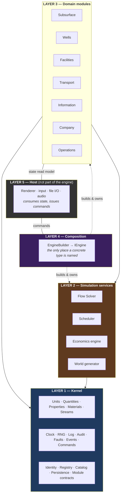
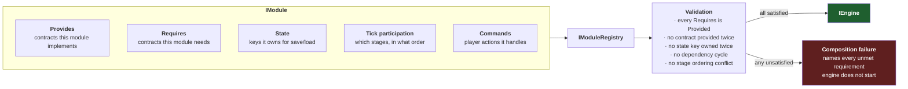
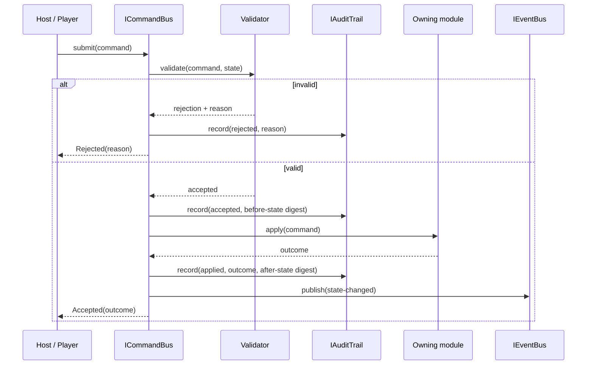

# 03 — System Architecture

**Status:** draft · **Date:** 2026-08-06

> **Affects:** 01, 02, 04, 09, 11, 12, 15, 16, 21, phases · **Affected by:** 01, 02, 04, 09, 13, 14, 15, 16, 21
> *(strong couplings only — the full row is in [22](22_DESIGN_COHERENCE.md) §2)*

How the engine is put together: layers, modules, contracts, composition, the
tick, and the rules that are enforced by tests rather than by discipline.

---

## 1. The five architectural laws

Every one of these exists because its absence is a known, expensive failure mode.
Each is enforced by an automated check, not by review.

| # | Law | Enforcement |
|---|---|---|
| **L1** | **No concrete type is ever a dependency.** Every collaborator is an interface, supplied at construction. | Architecture test: no public/internal constructor parameter is a concrete class from another module. |
| **L2** | **No dependency has a default.** No optional parameters, no `?? new X()`, no service locator, no singleton, no static mutable state. Omitting a dependency does not compile. | Architecture test: no static mutable fields; no optional constructor parameters of contract type; no `Instance` members. |
| **L3** | **No member exists without behaviour.** No empty bodies, no `NotImplementedException`, no method that returns a constant standing in for work. | Architecture test scanning for the shapes; code review gate. |
| **L4** | **No failure is discarded.** Every `catch` routes through `IFaultPolicy`. There is no `catch { }`, no `catch { return default; }`, no swallow-and-continue. | Architecture test: `catch` clauses outside the fault-policy module must call it. |
| **L5** | **One owner per fact.** No value is stored in two places. Derived values are computed, not mirrored. | Architecture test on state registration: two modules cannot register the same state key. |

**Why these are laws and not guidelines:** each corresponds to a defect class
that is *silent* — the compiler is happy, the tests pass, and the game is wrong.
A guideline that only holds when someone remembers is not a defence against a
silent failure.

---

## 2. Layers



**Dependency direction is strictly downward.** Layer 1 references nothing. A
domain module may reference the kernel and other modules' **contracts**, never
their implementations. There are no cycles, checked automatically.

**The host is outside the engine.** The engine has no rendering vocabulary — no
colours, sprites, sounds, scene nodes, or screen coordinates. It emits state and
events; a host draws them. A headless run is not a special mode; it is the
normal mode with no host attached.

---

## 3. Modules and plugins

### 3.1 What a module is

A module is a unit of composition that: declares the contracts it **provides**,
declares the contracts it **requires**, registers its state for persistence, and
declares where in the tick its work runs.



**Composition either fully succeeds or refuses to start, with a complete
explanation.** There is no partially-composed engine and no degraded mode. This
is L2 applied at the module level: a missing implementation is a startup error
naming exactly what is missing, never a silently absent behaviour.

### 3.2 Plug-and-play, concretely

"Plug and play" means each of these can be replaced without touching anything
else, because each sits behind a contract:

| Replaceable thing | Contract | Why you would replace it |
|---|---|---|
| Inflow model | `IInflowModel` | Darcy ↔ Vogel ↔ Fetkovich; or an arcade linear model |
| Vertical lift model | `IOutflowModel` | Simple hydrostatic ↔ correlation-based |
| Drive mechanism | `IDriveMechanism` | Per-reservoir; adding EOR is adding one |
| Pipeline hydraulics | `IHydraulicModel` | Darcy-Weisbach ↔ Panhandle ↔ simplified |
| Separation | `ISeparationModel` | Fixed-efficiency split ↔ flash calculation |
| Price formation | `IPriceModel` | Random walk ↔ mean-reverting ↔ scripted scenario ↔ historical replay |
| Fiscal regime | `IFiscalRegime` | Royalty/tax ↔ PSC ↔ service contract |
| World generation | `IWorldGenerator` | Procedural ↔ handcrafted scenario ↔ replay of a saved world |
| Information error | `IObservationModel` | Per source; tunes how much uncertainty survives |
| Fault handling | `IFaultPolicy` | Strict (dev: throw on everything) ↔ resilient (release: log, audit, continue safely) |
| Hazard/incident | `IHazardModel` | Off ↔ realistic ↔ punishing |

This list is also the **difficulty and fidelity dial** from
[00_VISION](00_VISION.md) §9 D5: "arcade mode" is a different set of registered
models, not a set of `if (difficulty == …)` branches.

### 3.3 Mods are modules

A mod is a module that arrives from a content folder rather than being compiled
in. It goes through the identical registration and validation path. There is no
separate mod-loading code path, and therefore no class of bug that exists only
for mods.

---

## 4. The kernel

The kernel is small, has no domain knowledge, and depends on nothing.

| Service | Contract | Responsibility | Key rule |
|---|---|---|---|
| Clock | `ISimulationClock` | The only source of "now" and of tick sequencing | Nothing else stores a turn number |
| Randomness | `IRandomSource` | Seeded streams, one per subsystem | Never `Random.Shared`; determinism depends on this |
| Units | `IUnitSystem`, `IQuantity` | Dimensions, units, exact conversion | Cross-dimension arithmetic is inexpressible |
| Properties | `IProperty`, `IPropertyKind` | Typed, provenanced, uncertain facts | Every physical fact is one |
| Materials | `IMaterial`, `IMaterialCatalog` | Registered substances and their properties | The engine never branches on identity |
| Streams | `IStream` | Material in motion with thermodynamic state | The one type crossing every flow boundary |
| Identity | `IEntityId<T>`, `IEntityRegistry` | Stable typed ids; resolution | Unresolvable id is a fault, not a null |
| Logging | `ILog` | Structured, levelled, correlated | See [09_DIAGNOSTICS](09_DIAGNOSTICS.md) |
| Audit | `IAuditTrail` | Immutable record of decisions and failures | Append-only; queryable in-game |
| Faults | `IFaultPolicy` | The single place exceptions are decided upon | The only legal `catch` |
| Events | `IEventBus` | Engine → observer notification | **Never** used for intra-engine control flow |
| Commands | `ICommand`, `ICommandBus` | Player intent: validate → authorise → apply → audit | Every mutation enters here |
| Persistence | `IStateSerializer`, `IStateOwner` | Per-module save/load | Round-trip is verified, not assumed |
| Content | `ICatalog<T>`, `IContentLoader` | Definitions as data | Load failures are reported, never skipped |
| Modules | `IModule`, `IModuleRegistry` | Composition and validation | §3.1 |

**Why events never carry control flow:** the previous generation of this kind of
engine consistently develops order-dependent behaviour hidden in event handlers,
where the outcome of a tick depends on subscription order. The tick is explicit
and ordered (§6); events are strictly outbound notifications that no engine code
subscribes to.

---

## 5. Commands: the only way anything changes



**Properties this buys:**

- **Every mutation is auditable.** "Why is my well shut in?" has an answer in the
  audit trail with a turn number and a cause.
- **Rejection is informative.** A command that cannot run says why, in domain
  terms ("no rig available until month 14"), rather than failing silently or
  half-applying.
- **Replay is possible.** Seed + command sequence reproduces a game exactly,
  which makes bug reports reproducible and makes the determinism test cheap.
- **Nothing mutates outside a tick.** Commands queue and apply at defined points;
  there is no mid-tick mutation from a UI thread.

---

## 6. The tick

One simulation step. **The order is load-bearing and is declared in one place**,
not distributed across modules that each "know" when they run.

```mermaid
flowchart TD
    T0["<b>0 · OPEN</b><br/>advance clock · open audit scope · snapshot digest"]
    T1["<b>1 · COMMANDS</b><br/>drain the queue · validate · apply"]
    T2["<b>2 · ENVIRONMENT</b><br/>resolve weather · seasons · access windows · forecast<br/><i>see 13_ENVIRONMENT</i>"]
    T3["<b>3 · OPERATIONS</b><br/>advance scheduled work · complete · apply outcomes<br/><i>wells come online here</i>"]
    T4["<b>4 · AVAILABILITY, HAZARDS & SEGMENTATION</b><br/>condition decay · hazard draws · failures · incidents<br/>maintenance · power balance · weather downtime<br/><b>→ builds the segment plan for this tick</b>"]
    T5["<b>5 · SOLVE FLOW</b> — <i>once per segment</i><br/>the one solver: reservoir → wellbore → surface → export<br/><i>see 04_MATERIAL_AND_FLOW</i>"]
    T6["<b>6 · MATERIAL BALANCE</b><br/>duration-weight the segments · commit<br/>deplete reservoirs · move inventory · assert conservation"]
    T7["<b>7 · CUSTODY & SALES</b><br/>spec gates · metering · revenue at custody points"]
    T8["<b>8 · ECONOMICS</b><br/>OPEX · CAPEX accrual · royalties · tax · debt · cash"]
    T9["<b>9 · HSE & REGULATION</b><br/>emissions · barriers · investigations · social licence<br/>inspections · penalties · orders<br/><i>see 14_HSE</i>"]
    T10["<b>10 · INFORMATION</b><br/>surveys complete · logs read · beliefs updated<br/><i>from THIS tick's production</i>"]
    T11["<b>11 · COMPANY</b><br/>reserves · RRR · licences · commitments · technology"]
    T12["<b>12 · OBJECTIVES</b><br/>evaluate against sealed state + sealed event set<br/><b>observes · never influences</b>"]
    T13["<b>13 · CLOSE</b><br/>verify invariants · seal audit scope · publish events<br/>build the read model"]

    T0-->T1-->T2-->T3-->T4-->T5-->T6-->T7-->T8-->T9-->T10-->T11-->T12-->T13
    T5 -.->|"next segment"| T5

    style T4 fill:#1f3a5f,color:#fff
    style T5 fill:#5f3a1f,color:#fff
    style T6 fill:#5f3a1f,color:#fff
    style T13 fill:#1f5f2f,color:#fff
```



### 6.1 Why this order

| Placement | Reason |
|---|---|
| Commands before everything | A player order issued this turn affects this turn |
| **Environment before availability** | Weather decides what can operate, so it must resolve first |
| Operations before availability | A well coming online this tick must be in this tick's network |
| **Availability and hazards before flow** | The solver must know what is broken *before* it solves. **Hazard draws happen here**, so a failure's production effect lands this tick |
| **Segmentation built at stage 4** | Every event that changes network topology or constraints is known by now; later stages cannot change it |
| Flow before material balance | Solve first, then commit — so a failed solve commits nothing |
| Custody after material balance | You cannot sell what has not physically arrived |
| Economics after custody | Revenue is known before costs are netted |
| **HSE after economics** | Penalties, investigations and standing are levied against a known position. **Their physical effects land next tick; only the paperwork is here** |
| Information after material balance | Beliefs update from *this* tick's production history |
| Company after information | Reserves derive from updated beliefs |
| **Objectives second to last** | They read a complete, sealed tick and have no stage in which to act |
| Invariant check at close | Every tick ends proven, or fails loudly |

**Stage 4 evaluates against the previous tick's service data — deliberately.**
Condition decay, hazard rates and the power balance all depend on service
severity: rates, water cut, duty. But this tick's rates are unknown until stage
5 solves. Stage 4 therefore uses the **previous tick's solved values** — a
one-tick lag that is deterministic, uniform and honest, rather than a circular
dependency hidden inside the tick. Power demand for the balance uses each unit's
**declared duty** (nameplate for scheduled equipment), not a solved rate, for
the same reason. At a monthly tick the lag is invisible in play; what matters is
that it is *defined*, because "which tick's water cut drives corrosion?" must
have exactly one answer everywhere.

**The physical/administrative split at stages 4 and 9 is deliberate.** A
compressor fire removes the compressor from *this* tick's network (stage 4);
its investigation, penalty and barrier consequences are computed at stage 9 and
affect *next* tick. The plant reacts immediately; the paperwork follows. Full
stage-to-event mapping is in [21_INTEGRATION](21_INTEGRATION.md) §4.

### 6.2 Segments

Stage 5 runs **once per segment**, not once per tick. A segment is a within-tick
interval over which availability and constraints are constant. Stage 4 produces
the segment plan; stage 6 duration-weights the results.

**Availability is segmented, never averaged.** A compressor available for 60% of
a month is not the same as a compressor at 60% capacity, because the network solve
is non-linear. Budget: four segments per tick, with merges audited. See
[15_TIME_AND_EXECUTION](15_TIME_AND_EXECUTION.md) §6 and
[21_INTEGRATION](21_INTEGRATION.md) §5.

### 6.3 Tick failure policy

Two distinct failures, two distinct responses:

- **Stage 5 fails to converge** → the **shut-in ladder**
  ([04](04_MATERIAL_AND_FLOW.md) §4.0b): the offending branch is physically shut
  in, audited, and the reduced network re-solved. The tick always completes,
  because a fully shut-in network converges trivially. This is an operational
  action, not a numerical fallback — the same physics on a smaller network.
- **Stage 6 violates conservation** → the tick is **abandoned whole and the
  engine halts** (invariant fault INV1): no partial state is committed and the
  fault is audited with a per-element breakdown. Mass imbalance means the state
  is corrupt; there is no "continue with whatever we got". A half-applied tick
  is precisely the kind of silent corruption these laws exist to prevent.

---

## 7. State, snapshots and the read model

The host never touches engine internals. It reads an immutable **read model** —
a projection published at tick close — and issues commands. Two consequences
worth stating:

1. **The host cannot corrupt the simulation**, because it holds no mutable
   reference into it.
2. **The read model is a stable contract**, so a UI change never requires an
   engine change, and vice versa.

Internally, each module registers the state keys it owns with the serializer.
Two modules cannot claim the same key (L5). Save/load is per-module and each
module's round-trip is verified by a property test: *save → load → save produces
identical bytes, and the loaded engine ticks identically to the original.*

---

## 8. Project structure

```
OGSim/
├── plans/                      ← design (this folder)
├── src/
│   ├── OGSim.Kernel/           ← Layer 1. Depends on nothing.
│   ├── OGSim.Contracts/        ← All domain contracts. Depends on Kernel only.
│   ├── OGSim.Environment/      ← Setting, weather, access windows      (R22)
│   ├── OGSim.Subsurface/       ← Reservoirs, fluids, drive mechanisms
│   ├── OGSim.Wells/            ← Wells, wellbores, completions, lift
│   ├── OGSim.Facilities/       ← Facilities and process units
│   ├── OGSim.Transport/        ← Pipelines, terminals, berths, cargoes
│   ├── OGSim.Flow/             ← The one flow solver
│   ├── OGSim.Information/      ← Truth, beliefs, surveys  (truth is internal)
│   ├── OGSim.Company/          ← Licences, finance, contracts, regulation, tech
│   ├── OGSim.Operations/       ← Scheduler, rigs, crews, condition, hazards
│   ├── OGSim.Hse/              ← Barriers, incidents, emissions, ESG      (R23)
│   ├── OGSim.Objectives/       ← Objectives, scenarios, scoring           (R24)
│   ├── OGSim.World/            ← World generation
│   ├── OGSim.Composition/      ← Layer 4. The only project naming concrete types.
│   └── OGSim.Advisor/          ← Player-side recommendations & automation (R25).
│                                 Uses ONLY the R21 host surface — architecturally
│                                 a client, exactly like the reference client.
├── content/                    ← All definitions as data
└── tests/
    ├── OGSim.Architecture.Tests/   ← L1–L5 enforcement
    ├── OGSim.Unit.Tests/
    ├── OGSim.Model.Tests/          ← physical-behaviour validation
    ├── OGSim.Scenario.Tests/       ← full-lifecycle runs
    └── OGSim.Determinism.Tests/
```

**Assembly boundaries are the enforcement mechanism.** `OGSim.Wells` cannot
reference `OGSim.Facilities`' implementation because the project reference does
not exist. Layering is a compile error, not a review comment.

**One deliberate consequence:** `OGSim.Information` keeps the truth model
`internal`. No other assembly can read it, so §6.1 of
[02_DOMAIN_MODEL](02_DOMAIN_MODEL.md) is structural.

---

## 9. What this architecture makes impossible

Stated positively, since each corresponds to a real failure mode being designed
out:

| Failure mode | Why it cannot occur |
|---|---|
| Two copies of one fact drifting apart | L5 + single state ownership, checked at registration |
| A system silently using a fresh, empty collaborator | L2 — there are no defaults to fall back to |
| A declared capability that does nothing | L3 |
| An exception hidden in a `catch` | L4 |
| Order-dependent behaviour hidden in event subscriptions | Events are outbound-only; the tick order is explicit |
| The player learning the subsurface truth through a back door | Truth is `internal` to one assembly |
| A save that loads into a subtly different game | Round-trip equality is a property test |
| A unit-conversion error | Quantities are dimensioned; the error is inexpressible |
| Adding equipment requiring solver changes | The solver knows only `IFlowElement` |
| A missing implementation discovered at runtime | Composition validates completeness before the engine starts |
| An assist changing physics or leaking the subsurface truth | Assists live in `OGSim.Advisor`, outside the engine: they read only the read model (which is built from beliefs) and act only through the command bus. There is no assist branch to take and no truth to reach |

---

## 10. Open decisions

| # | Decision | Options | Recommendation |
|---|---|---|---|
| AD1 | Command application | (a) immediate at stage 1, (b) queued with explicit effective-date | **(b)** — real operations have lead times; it also makes the schedule inspectable |
| AD2 | Read model | (a) full immutable snapshot per tick, (b) incremental diffs | **(a) first** — simpler and provably correct; add diffs only if profiling demands |
| AD3 | Solver failure | (a) abandon tick, (b) fall back to a simpler model, (c) physical shut-in ladder | **✅ Resolved: (c)** — see [04](04_MATERIAL_AND_FLOW.md) §4.0b. (a) made the game un-continuable on a numerics failure; (b) is a fallback, which the non-negotiables forbid. (c) is neither: the same physics on a reduced network, via an audited operational action |
| AD4 | Module granularity | (a) the 14 above, (b) finer | **(a)** — finer modules multiply contract surface without adding replaceability |
| AD5 | Async/parallel tick | (a) fully sequential, (b) parallel within stages | **(a)** — determinism first; the tick budget is generous at monthly steps ([15](15_TIME_AND_EXECUTION.md) §10) |
| AD6 | Segment solving | (a) sequential, (b) parallel across segments | **(a)** — segments share committed state at their boundaries and must be ordered; parallelism would break determinism for no useful gain |
