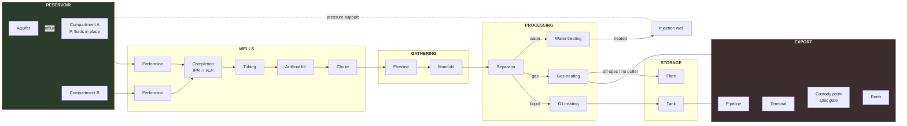
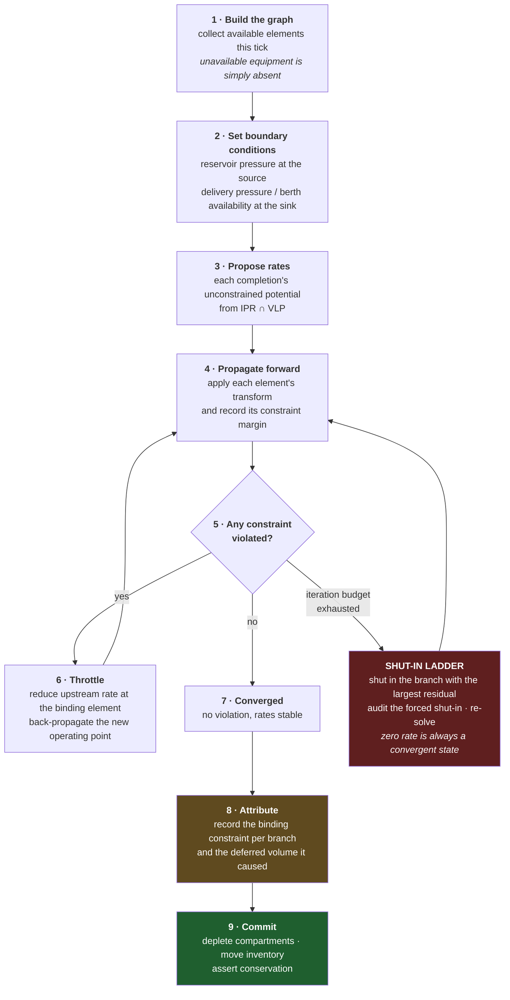
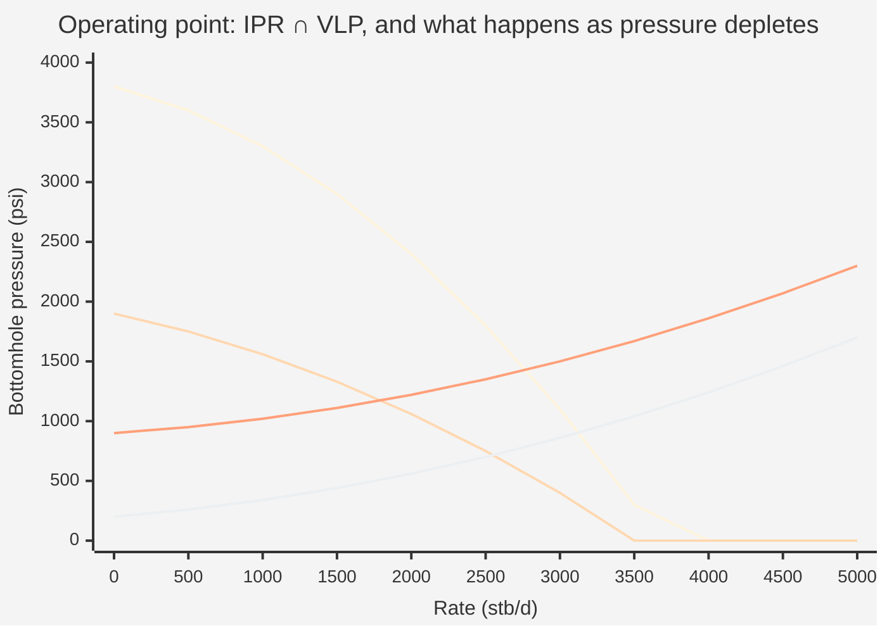
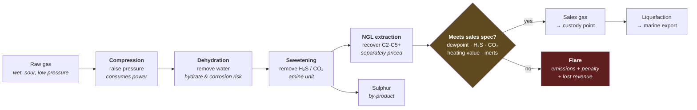
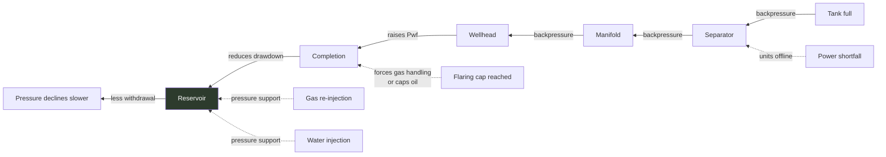

# 04 — Material and the One Flow Engine

**Status:** draft · **Date:** 2026-08-06

> **Affects:** 02, 03, 05, 12, 15, 17, 21, phases · **Affected by:** 02, 03, 05, 13, 15, 17, 21
> *(strong couplings only — the full row is in [22](22_DESIGN_COHERENCE.md) §2)*

**The central design document.** One solver moves one kind of thing — an
`IStream` of `IMaterial` — through one network, from the pore space of a
reservoir compartment to a cargo on a tanker. Oil and gas are not separate
subsystems. They are different materials in the same pipes.

---

## 1. The principle, stated precisely

> There is exactly one flow network, one solver, one material balance and one
> bottleneck report. Every physical element — a perforation, a length of tubing,
> a separator, a tank, a pipeline, a berth — is an `IFlowElement` with ports,
> constraints and a transform. The solver knows nothing else about any of them.

**What this rules out**, deliberately, because each is a shape that has caused
real trouble in simulation games of this type:

- A `ProcessOil()` method beside a `ProcessGas()` method
- A separate "oil pipeline" and "gas pipeline" type
- Production credited by one path and consumed by another (the double-count)
- Storage that fills without the upstream well ever noticing
- Capacity as a number in a config file rather than a physical consequence

**What it buys:** adding a new material (helium, hydrogen, CO₂ for sequestration)
or a new unit (a membrane separator, a cavern store) is content plus one
implementation. The solver is never touched.

---

## 2. `IStream` — the one currency

Everything that crosses an element boundary is a stream:

| Facet | Content | Why it must be here |
|---|---|---|
| **Composition** | Mass (or molar) flow rate per `IMaterial` | Mass is what is conserved. Volumes are derived, and derived at a stated condition. |
| **Pressure** | The stream's pressure | Determines whether it can flow into the next element at all |
| **Temperature** | The stream's temperature | Drives phase behaviour, viscosity, hydrate risk, spec compliance |
| **Phase split** | Fraction of each material in gas / liquid / aqueous phase at (P, T) | The thing separators act on |
| **Provenance** | Which compartments contributed, and in what proportion | Required for production allocation and for royalties |

### 2.1 Mass in, volumes out

**The engine conserves mass.** Volumes are a reporting convenience and are always
qualified by a condition:

- **Reservoir barrels (rb)** — at reservoir pressure and temperature
- **Stock tank barrels (stb)** — at standard conditions, after gas evolves out
- **Standard cubic feet (scf)** — gas at standard conditions

A barrel of oil in the reservoir is *not* a barrel at surface — it shrinks as
dissolved gas comes out. That ratio is the **formation volume factor (Bo)**, and
getting it wrong is exactly the kind of silent double-count this design is built
to prevent. Conserving mass and deriving volumes makes the error impossible: you
cannot accidentally add reservoir barrels to stock tank barrels because they are
different quantities of a dimensioned type.

### 2.2 Provenance and allocation

When two wells commingle at a manifold, the combined stream carries the
proportions each contributed. Downstream, when 10,000 stb is sold, the engine can
say how much came from which compartment. **This is not bookkeeping decoration:**
royalties differ per licence, working interests differ per field, and reserves
depletion must be booked against the right compartment. Allocation is a real
industry problem and the model gets it right by carrying it in the stream.

**Provenance survives storage.** A tank's inventory carries the mass-weighted
blend of the provenance of everything that entered it, updated on every receipt;
a cargo lifted from that tank allocates back to compartments by the inventory's
weights at lifting. Without this, allocation would silently end at the first
tank — and royalties on a commingled terminal would be unattributable, which is
exactly the class of quiet wrongness the stream design exists to prevent.

**Quality blending needs no extra machinery.** Distinct crude grades are
distinct `IMaterial`s, so a tank holding two grades *is* a composition, and the
blend's realised quality at custody falls out of the composition — the price
differential ([08](08_ECONOMICS.md) §3.1) is computed on what is actually in the
parcel. Blending a premium grade into a discounted one therefore *loses money
visibly*, and segregated storage becomes a real decision rather than a flavour
option.

---

## 3. The network

Every arrow is a stream. Every box is an `IFlowElement`.

---

## 4. The solve

The network is a constrained flow problem. Rate is set by whichever constraint
binds first, anywhere in the chain — and **that is the whole game of
debottlenecking.**

### 4.0 The solve runs once per segment, not once per tick

A tick is divided into up to four **segments** — intervals over which
availability and constraints are constant. The segment plan is built at tick
stage 4 ([03_ARCHITECTURE](03_ARCHITECTURE.md) §6.2); the solve above runs for
each segment in order; stage 6 duration-weights the results and commits once.

**Availability is segmented, never averaged.** A compressor available for 60% of
a month is *not* equivalent to a compressor at 60% capacity, because this solve
is non-linear — the binding constraint may be a different element in each case.
Segmenting is exact; averaging silently changes the answer.

Only events that change the network's topology or constraints create a boundary.
The rule, the budget and the audited merge policy are in
[21_INTEGRATION](21_INTEGRATION.md) §5.

### 4.0b The shut-in ladder — why non-convergence never ends the game

The first draft treated iteration-budget exhaustion as an unrecoverable fault
that abandoned the tick. That was a design hole: **a tick that cannot complete
is a game that cannot continue.** The player would be stopped not by the
simulation but by its numerics, with nothing to do about either.

The corrected policy is the one a real control room uses: **if a branch cannot
be brought to a stable operating point, shut it in.**

1. Exhaust the iteration budget → identify the branch with the largest residual.
2. **Shut that branch in** — a physical, audited action (`well.shutIn` with
   cause `solver-stability`), not a numerical adjustment.
3. Re-solve the reduced network, with a fresh budget.
4. Repeat if necessary. The ladder terminates **by construction**: a fully
   shut-in network is trivially convergent at zero rate.

Three properties make this acceptable where a numerical fallback would not be:

- **It is a real action with real consequences.** The deferred production is
  attributed, the shut-in appears in the audit trail with its cause, and the
  player sees exactly what the solver could not stabilise. Nothing is silent.
- **It is not a model substitution.** The same physics is solved on a smaller
  network — no simpler model is quietly swapped in, so the no-fallbacks rule
  holds.
- **Recurrence is loud.** A branch forced shut on consecutive ticks raises
  `flow.solverFault` at `C` severity with the full diagnostic: in a shipped
  game that pattern is a bug report, and the strict fault policy
  ([09](09_DIAGNOSTICS.md) §5.3) still throws on first occurrence in CI.

Mass-balance *violation* remains a halt (§7) — corrupt state is not recoverable
by shutting anything in. The distinction is: **can't converge → operate less of
the network; doesn't conserve → stop, the numbers are lies.**

### 4.1 Step 8 is a feature, not diagnostics

The solver records, for every branch, **which element bound and how much
production was lost to it**. That produces the game's most important screen:

> *"Field A produced 12,400 stb/d against a potential of 18,900 stb/d.
> Deferred: 6,500 stb/d.
> Binding constraint: **Separator SEP-01 gas capacity** (4,100 stb/d deferred) ·
> **Export tank ullage** (2,400 stb/d deferred, 6 days shut-in this month)."*

The player now knows exactly what to buy. Making the bottleneck report a
first-class solver output — rather than something inferred by a UI — is what
turns a simulation into a game.

---

## 5. The calculation chain, stage by stage

Each stage states: what enters, what the model computes, what constrains it, what
leaves, and what the player can do about it.

### Stage 1 — Reservoir → sandface (inflow)

| | |
|---|---|
| **Enters** | Compartment pressure `Pr`, fluid properties, rock properties |
| **Computes** | Flow into the wellbore as a function of drawdown `(Pr − Pwf)` |
| **Model** | **IPR (Inflow Performance Relationship)**. Above bubble point: Darcy radial inflow — rate proportional to `kh(Pr − Pwf)` divided by viscosity, formation volume factor, the log of the drainage-to-wellbore radius ratio, and skin. Below bubble point, two-phase: **Vogel's** curve, where relative rate falls off as `1 − 0.2(Pwf/Pr) − 0.8(Pwf/Pr)²`. Composite when the reservoir straddles the bubble point. |
| **Constrains** | Permeability, net pay, drawdown available, skin, and the number and length of open perforations |
| **Leaves** | A stream at bottomhole pressure with the compartment's fluid composition |
| **Player levers** | Perforate more interval · reduce skin (acidise, fracture) · drill horizontal for more contact · lower `Pwf` with lift · raise `Pr` with injection |

**Drama this produces:** as `Pr` falls, the whole IPR curve collapses downward.
The same well with the same equipment produces less every year, and no amount of
surface investment fixes it — only pressure support or more wells do.

### Stage 2 — Sandface → wellhead (outflow / lift)

| | |
|---|---|
| **Enters** | Stream at bottomhole conditions |
| **Computes** | Pressure available at surface after lifting the fluid up the tubing |
| **Model** | **VLP (Vertical Lift Performance)**: pressure lost to the *hydrostatic column* (fluid density × height — the dominant term), plus *friction* (rises with rate squared), plus *acceleration*. Gas coming out of solution up the tubing lightens the column, which helps; water loading heavies it, which kills wells. |
| **Constrains** | Tubing diameter (too narrow = friction-limited; too wide = the well loads up with liquid and dies), and whether any lift method is installed |
| **Leaves** | A stream at wellhead pressure |
| **Player levers** | Size tubing correctly · install and size artificial lift · gas lift injection rate · velocity strings for gas wells |

**The operating point.** IPR and VLP are two curves on the same axes. Their
intersection is the well's actual rate — no other rate is physically consistent.
When the curves stop intersecting, **the well dies**, and this is not a scripted
event: it falls out of the arithmetic. That moment, and the decision of whether
to spend on lift or abandon, is one of the game's best beats.

*Read it this way:* early life, the natural-flow VLP crosses the IPR at a high
rate. Late life, the same VLP barely crosses it at all — the well is nearly dead.
The ESP curve sits far lower, so it still crosses the late-life IPR at a
worthwhile rate. **That gap is what the player is buying.**

### Stage 3 — Wellhead → manifold (gathering)

| | |
|---|---|
| **Enters** | Stream at wellhead pressure |
| **Computes** | Choke performance, then flowline pressure drop |
| **Model** | Choke: critical (sonic) flow above a pressure ratio threshold — rate becomes independent of downstream pressure, which is how operators control wells; sub-critical below. Flowline: two-phase pressure drop over the line's length, diameter, roughness and elevation. |
| **Constrains** | Line size, backpressure imposed by the separator, **erosional velocity** (flow too fast destroys the pipe) |
| **Leaves** | Commingled stream at manifold pressure, with provenance from every contributing well |
| **Player levers** | Choke settings · flowline sizing · looping · a nearer manifold |

**The commingling trap, modelled honestly:** a high-pressure new well tied into a
shared line raises manifold pressure and **can shut in the older, weaker wells on
the same line.** The engine produces this for free, because it is just
backpressure arithmetic — and it is exactly the kind of non-obvious consequence
that makes an operations game worth playing.

### Stage 4 — Separation

| | |
|---|---|
| **Enters** | Multiphase commingled stream |
| **Computes** | Phase split at the separator's pressure and temperature |
| **Model** | Each material's phase fraction at (P, T) from its phase-behaviour properties; the vessel achieves a stated separation efficiency per phase pair. Carry-over (liquid in the gas line) and carry-under (gas in the liquid line) are real and quantified. |
| **Constrains** | **Two independent capacities — liquid handling and gas handling — and either can bind.** Also residence time, and slug volume for a slug catcher. |
| **Leaves** | Up to three streams: oil, gas, water |
| **Player levers** | Vessel sizing · staged separation (multiple pressure stages recover more liquid) · operating pressure |

**Staged separation is a genuinely good optimisation puzzle:** dropping pressure
in stages rather than all at once keeps more of the light ends in the liquid,
increasing stock tank oil. It costs vessels. The optimum depends on the fluid.

### Stage 5 — Oil treating

| | |
|---|---|
| **Enters** | Oil stream carrying emulsified water, salt and light ends |
| **Computes** | Water removal to BS&W spec, salt removal, vapour pressure reduction |
| **Model** | Fixed removal efficiency per unit, modified by temperature, residence time, chemical injection and how tight the emulsion is (which worsens as water cut rises) |
| **Constrains** | Throughput, heat duty, **and the export specification** |
| **Leaves** | On-spec crude to storage; recovered water to water treating; recovered gas to gas treating |
| **Player levers** | Add a treater · add a desalter · add a stabiliser · inject demulsifier · raise heat |

**Why the player builds this:** the custody transfer point rejects crude above
the contract's BS&W limit. Not "applies a price penalty" — **rejects**. Water cut
rises inexorably through field life, so at some point every field needs treating,
and the player either anticipates it or watches sales stop.

### Stage 6 — Gas treating

The longest chain, and the reason gas is capital-hungry:

| | |
|---|---|
| **Constrains** | Compressor power and head (multi-stage needed as inlet pressure falls); dehydration and sweetening throughput; NGL recovery efficiency; **the sales spec gate** |
| **Player levers** | Add compression stages · add treating units · build an NGL plant when the price spread justifies it · re-inject gas instead of selling it (pressure support **and** avoided flaring) |

**Associated gas is the classic dilemma, and the model produces it naturally:**
an oil field makes gas whether you want it or not. You can sell it (needs the
whole chain above), re-inject it (needs compression, but supports reservoir
pressure), or flare it (needs nothing, but costs emissions penalties and, in many
regimes, is capped or banned outright — which then **caps your oil production**).
Three genuinely different strategies, all defensible, all with consequences.

### Stage 7 — Water handling

| | |
|---|---|
| **Enters** | Produced water with oil in it |
| **Computes** | Oil-in-water reduction to disposal spec |
| **Constrains** | Treatment throughput, disposal well injectivity, disposal spec |
| **Leaves** | Treated water to injection or discharge; recovered oil back to oil treating |
| **Player levers** | Treatment capacity · disposal wells · convert a dead producer to an injector · shut off the watered-out zone at the perforation |

**Water is the villain of the late game, and correctly so.** It costs money to
lift, costs money to separate, costs money to treat, costs money to dispose, and
displaces oil in every piece of equipment it passes through. When the cost of
handling a barrel of water exceeds the value of the oil it comes with, **the well
is economically dead even though it is still producing.** That calculation is the
engine's abandonment trigger.

### Stage 8 — Storage

| | |
|---|---|
| **Computes** | Inventory, ullage (space remaining), and boil-off/vapour loss |
| **Constrains** | Capacity — and **a full tank propagates backpressure all the way to the reservoir** |
| **Player levers** | Tank capacity · lifting frequency · vapour recovery |

**This is the most important coupling in the export chain.** If the tanker is
late and the tanks fill, wells shut in. Production is lost and cannot be
recovered — those barrels are deferred, not stored. The player feels the whole
chain as one system precisely at this moment.

### Stage 9 — Transport

| | |
|---|---|
| **Model** | Steady-state pressure drop over length, diameter, roughness and elevation. Liquid: friction rises steeply with rate and with viscosity. Gas: flow depends on the difference of the squares of inlet and outlet pressures, so gas lines lose capacity dramatically as inlet pressure declines. |
| **Constrains** | Hydraulic capacity, pressure rating, pump/compressor power, contracted third-party capacity |
| **Player levers** | Diameter · looping · pump/compressor stations · drag-reducing agent · heating for viscous crude |

**Flow assurance** is modelled as risk flags rather than full physics: hydrate
formation risk (cold + wet + high pressure), wax deposition (cold + waxy crude),
corrosion (water + CO₂/H₂S), erosion (velocity too high). Each raises a hazard
rate for a blockage or failure incident, and each has a real mitigation the
player can buy — insulation, inhibitor injection, pigging, corrosion-resistant
alloy.

### Stage 10 — Custody transfer and export

| | |
|---|---|
| **Computes** | Metered quantity, quality assessment, and the revenue event |
| **Constrains** | **Contract specification** — off-spec is rejected, not discounted. Metering uncertainty is real and small. |
| **Player levers** | Meet spec upstream · negotiate contract terms · pick the sales point |

Then, for marine export: berth availability, cargo nomination, loading rate,
laytime and demurrage. A cargo is `ICargo` — a scheduled operation that empties
tanks, triggers a custody transfer, and pays.

---

## 6. What flows back: the couplings

The chain is not one-directional, and the back-couplings are where the system
becomes a system rather than a pipeline.

| Coupling | Effect |
|---|---|
| Tank full → shut-in | Deferred production, propagated to the reservoir |
| Separator gas limit → oil limited | You cannot produce oil without handling its gas |
| Flaring cap → oil limited | Regulation binds physics |
| Water handling limit → oil limited | Late-life fields are water-handling-limited, not reservoir-limited |
| Power shortfall → units offline | Utilities are a real dependency, not scenery |
| Injection → pressure support | The one lever that pushes back against decline |
| High-pressure well → kills weak wells | Shared-line backpressure |

**Every one of these emerges from the network solve.** None is a scripted rule.

---

## 7. Conservation: the invariant that guards everything

At the close of every tick, for every material:

> mass extracted from all compartments
> = mass delivered at custody points
> + Δ mass held in inventory (tanks, linefill, vessels)
> + mass re-injected
> + **mass consumed as fuel on site** (gensets, turbines, gas-driven compressors)
> + mass flared, vented or spilled
> + **mass discharged under permit** (treated produced water)
> + mass lost to measurement tolerance (bounded and audited)

Two terms in that balance deserve a note, because the first draft omitted both:

- **Fuel gas is a real consumer.** A gas-driven compressor burns produced gas;
  a genset burns it to power ESPs. That gas never reaches a custody point — it
  is consumed, and its combustion products land in the emissions ledger. This is
  also why electrification ([07](07_TECHNOLOGY.md) §4) *frees gas for sale*: the
  fuel term shrinks. Without the term, an engine that models fuel draw would
  fail its own conservation check — or worse, fuel would be modelled as free.
- **Permitted discharge is not a spill.** Treated produced water released within
  its discharge specification is a legitimate, accounted outflow. Conflating it
  with spills would either criminalise normal operation or hide real spills in
  a legal flow.

Violation is an **invariant fault (INV1): the tick is aborted and the engine
halts** with a per-element breakdown of where the imbalance appeared — mass
imbalance means the state itself is corrupt, which is not recoverable by playing
on. Contrast this with solver *non-convergence*, which is recoverable and is
handled by the shut-in ladder in §4.0b.

**This single check is the reason the double-count class of bug cannot survive
here.** The previous engine credited extraction by two independent paths and the
discrepancy went unnoticed for a long time, because nothing was checking. Here,
something is always checking, every tick, for every material.

---

## 8. Fidelity levels

Each model is a plugin, so the whole solver has a fidelity dial. Same
architecture, three audiences.

| Stage | Arcade | Standard *(default)* | Simulation |
|---|---|---|---|
| Inflow | Linear productivity index | Darcy + Vogel composite | Composite + rate-dependent skin, multi-layer |
| Outflow | Fixed pressure loss | Hydrostatic + friction, phase-aware | Correlation-based multiphase gradient |
| Separation | Perfect split | Efficiency-based with carry-over | Multi-stage with light-end recovery |
| Pipeline | Fixed capacity | Steady-state single-phase correlation | Two-phase with flow-regime detection |
| Reservoir | Arps decline curve | Tank material balance with drive mechanism | Multi-compartment with transmissibility |
| Phase behaviour | Fixed ratios | Black-oil correlations | Black-oil + component tracking for NGL |

**The arcade column is not a stub.** Each is a real, complete model — just a
simpler one. That distinction matters: the non-negotiables forbid stubs, and a
productivity-index inflow model is a legitimate engineering approximation used in
industry, not a placeholder.

---

## 9. Verification

How we prove the flow engine is right, before any content exists.

| # | Test | Passes when |
|---|---|---|
| FV1 | Conservation | Randomised networks, 1,000 ticks: mass balances to floating-point tolerance every tick |
| FV2 | Depletion shape | A single-well tank reservoir produces a decline curve matching an Arps hyperbolic within a tuned band |
| FV3 | Operating point | IPR ∩ VLP intersection matches an independently computed value across a parameter sweep |
| FV4 | Bottleneck attribution | In a network with one deliberately undersized element, the solver names that element and the deferred volume equals the analytic answer |
| FV5 | Backpressure propagation | Filling a terminal tank measurably reduces reservoir withdrawal within the same tick |
| FV6 | Spec gating | Off-spec gas does not reach a custody point, and the flare volume equals the rejected volume exactly |
| FV7 | Material agnosticism | A synthetic material with oil-like properties behaves identically to oil; the solver contains no material-identity branch (checked by architecture test) |
| FV8 | Determinism | Identical seed and command sequence produce an identical state hash on Windows and Linux |
| FV9 | Convergence | The solver converges within budget for every scenario in the corpus; budget exhaustion engages the shut-in ladder (§4.0b), which is audited and attributed — never a silent partial result. Under the strict policy, any forced shut-in in the corpus fails the test |
| FV10 | Allocation | Commingled production allocates back to compartments summing exactly to what was withdrawn |
| FV11 | Segmentation | A mid-tick availability change produces the exact duration-weighted result, matched against a hand calculation |
| FV12 | Segmentation ≠ averaging | A case exists where averaging availability yields a materially different, wrong answer — and the solver does not take it |
| FV13 | Segment commit atomicity | All segments solve before anything commits; a failure in the last segment leaves state byte-identical |

---

## 10. Open decisions

| # | Decision | Options | Recommendation |
|---|---|---|---|
| FD1 | Solver method | (a) iterative forward-propagate + throttle, (b) full network pressure solve (Newton) | **(a)** — converges fast on tree-shaped networks, is explainable, and yields the bottleneck attribution naturally. Revisit if looped networks become common. |
| FD2 | Phase behaviour | (a) black-oil correlations, (b) component tracking | **(a) with a component split at the NGL plant only** — full compositional tracking costs a great deal for detail the player never sees |
| FD3 | Time resolution inside a tick | (a) one steady-state solve per tick, (b) sub-steps | **(a)** — at a monthly tick, steady state is the honest model; shut-in events are handled as a duration fraction within the tick |
| FD4 | Networks with loops | (a) tree-only at first, (b) general graphs | **(a) first** — real gathering systems are overwhelmingly tree-shaped; looped export lines come with the pipeline phase |
| FD5 | Measurement uncertainty | (a) exact metering, (b) small realistic error | **(b)** — it is cheap, it is real, and it makes the audit trail meaningful |
