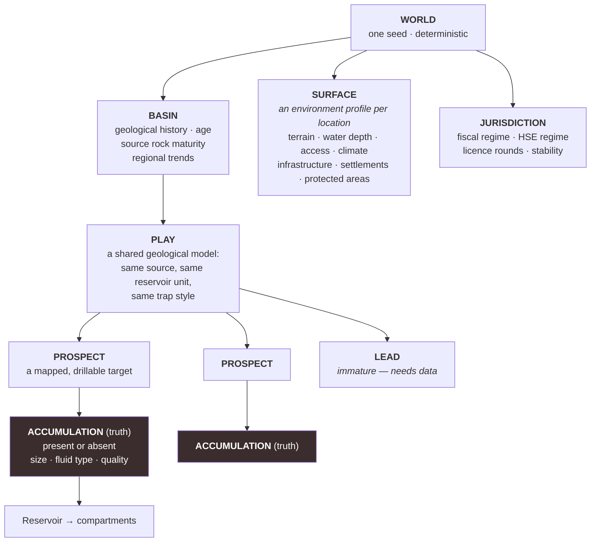
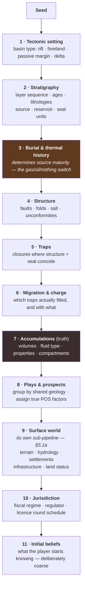
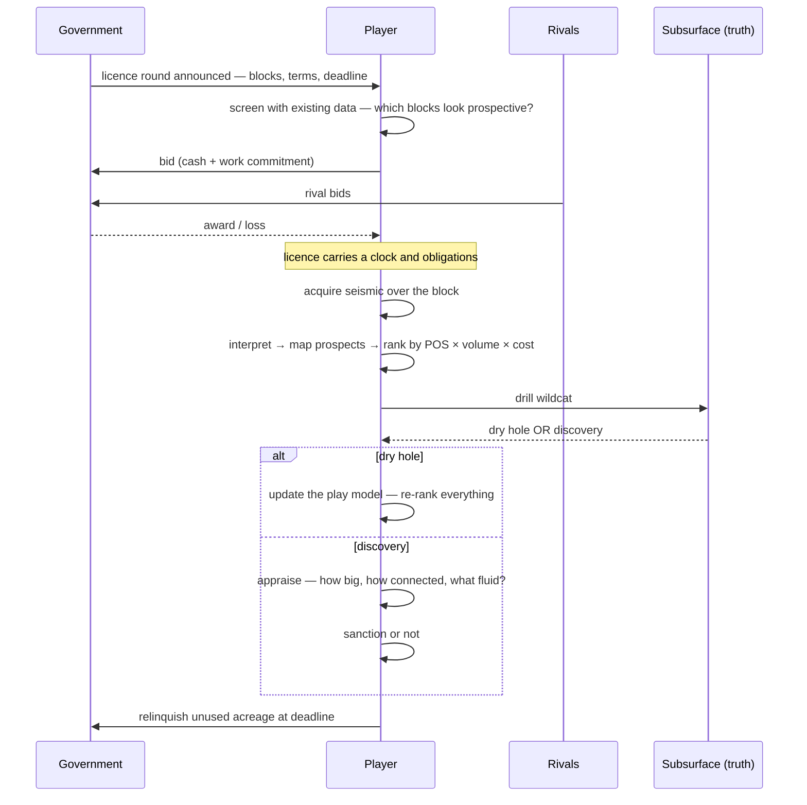
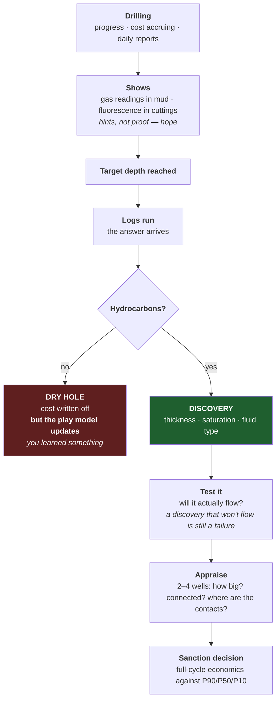

# 06 — World and Exploration

**Status:** draft · **Date:** 2026-08-06

> **Affects:** 10, 13, 18, 20, phases · **Affected by:** 00, 13, 18, 20
> *(strong couplings only — the full row is in [22](22_DESIGN_COHERENCE.md) §2)*

The map, what is hidden under it, and the loop by which the player finds it.
This is the game's front half; [04](04_MATERIAL_AND_FLOW.md) is the back half.

---

## 1. The design problem

Exploration games fail in one of two ways:

- **Too random** — drilling is a slot machine, information is decoration, and the
  player learns nothing from failure. Nothing they did mattered.
- **Too solvable** — the optimal survey-then-drill sequence is computable, so
  after twenty hours the player is executing a known algorithm.

**The answer this design takes:** make information *genuinely* reduce uncertainty
but never eliminate it, make it cost real money and real time, and make the
correlation structure of the world learnable. A player who has drilled six wells
in a basin should be measurably better at drilling the seventh — not because a
skill number went up, but because **they understand this basin now.**

> The exploration game is: **buy the right information, in the right order,
> and stop buying it at the right time.**

---

## 2. World structure



### 2.1 The play is the key structure

**A play is a correlated group of prospects.** They share a source rock, a
reservoir formation and a trapping style — so they succeed and fail *together*,
partially.

This one structural decision is what makes exploration learnable:

| Situation | Consequence |
|---|---|
| First well in a play is dry because the **source rock** never matured | Every prospect in that play just got much worse. A basin-scale lesson from one well. |
| First well finds **excellent reservoir quality but no seal** | The play has reservoir; it needs a different trap style. Re-rank toward stratigraphic traps. |
| First well is a **discovery** | Every other prospect in the play is de-risked. The player should lease more, immediately, before rivals do. |
| Second well in the play is dry despite the first being wet | The trap is the variable, not the source. Prospect-specific risk dominates. |

**The player is not learning "drilling works". They are learning *this basin*.**
That is the difference between a slot machine and a game, and it costs only a
correlation structure in world generation.

### 2.2 Chance of success — the petroleum system

Industry practice, adopted directly. A prospect works only if **all five**
elements are present:

```
POS  =  P(source) × P(reservoir) × P(seal) × P(trap) × P(timing)
```

| Element | Question | Learned from |
|---|---|---|
| **Source** | Was there organic-rich rock, buried deep enough and long enough to generate hydrocarbons? | Basin analysis, regional data, any well in the basin |
| **Reservoir** | Is there rock with enough porosity and permeability to hold and flow it? | Seismic amplitude, nearby well logs |
| **Seal** | Is there an impermeable cap to stop it escaping? | Seismic, nearby wells |
| **Trap** | Is there a geometry that collects it? | **Seismic — this is what seismic is really for** |
| **Timing** | Did the trap form *before* the hydrocarbons migrated? | Basin modelling — the subtlest and most often fatal |

Typical wildcat POS: **10–35%**. Near-field appraisal: **50–80%**.

### 2.3 Detectability and accessibility — geology has a tech dimension

The industry's deepest exploration truth: **every imaging generation re-opened
mature basins.** 3-D found fields under old fields; pre-stack depth migration
opened the subsalt; fracking turned known-but-worthless tight rock into plays.
That only works if the dependency lives on the *geology itself* — so every
generated accumulation carries two truth attributes:

**Detectability class** — what it takes for a survey to produce a lead *at all*:

| Class | Trap character | Minimum observation tier |
|---|---|---|
| D0 | Obvious structural closure | Regional data / 2-D seismic |
| D1 | Subtle structural | 3-D seismic |
| D2 | Stratigraphic | 3-D + seismic attributes |
| D3 | Obscured — subsalt, deep, poor data zones | Pre-stack depth migration |

**The rule with teeth: below the tier, a survey returns *nothing there* — not
wide error bars, nothing.** The lead never spawns in the belief layer. This is
honest to how interpretation actually fails (you cannot map what the image does
not contain), and it is what makes upgrading imaging an *exploration* act rather
than a precision upgrade. The existence of harder classes is public industry
knowledge — the map may say "beyond current imaging" — but never what is there.

**Accessibility class** — what it takes to *develop* what you found:

| Requirement | Gated by |
|---|---|
| Depth class | Drilling depth envelope tiers |
| Water depth class | Rig class; subsea tiebacks |
| HPHT | Managed pressure drilling + metallurgy tiers |
| Tight (low-k) | Commercial rates only with fracturing ([07](07_TECHNOLOGY.md) §4 — the frac row's real meaning) |
| Sour | Sales only with sweetening; metallurgy tiers to operate |

An accumulation can be findable but undevelopable — a **contingent resource
with a technology trigger**, which is exactly what the industry books it as.

### 2.3a The re-opening loop

```
mature basin, RRR falling
   → acquire the next observation tier
      → RE-SCREEN acreage you still hold (a survey over old ground, priced as one)
         → D-class leads spawn where yesterday there was nothing
            → the basin you know — infrastructure, offices, data — is a frontier again
```

Three sharp edges, all deliberate: **relinquished acreage is gone** — the
re-screening rights went with it, and a rival with better imaging finding a D2
field in your old block is the sting `rival.result` was built for. **Your own
data re-processes** — old 3-D shot years ago can be re-interpreted under a new
tier at a fraction of a new shoot. And **access classes convert on unlock** —
the tight discovery you shelved in year 8 becomes a development decision the
day fracturing arrives, which is the era campaign's engine.

**Why the five-factor decomposition matters for gameplay:** it means information
is *targeted*. Seismic mainly buys certainty about trap and reservoir. A nearby
well mainly buys certainty about source and seal. Basin modelling buys timing.
The player must decide **which factor is currently dominating their risk** and
buy the information that addresses *that one*. That is a real, non-trivial,
repeatable decision.

---

## 3. The information economy

```mermaid
flowchart LR
    subgraph SRC["INFORMATION SOURCES — cost · time · what it sees"]
        direction TB
        S0["<b>Regional / literature</b><br/>$ · instant<br/>basin-scale trends"]
        S1["<b>Gravity / magnetic</b><br/>$$ · weeks<br/>basin shape, depth to basement"]
        S2["<b>2-D seismic</b><br/>$$$ · months<br/>structure, coarse · maps leads"]
        S3["<b>3-D seismic</b><br/>$$$$$ · months<br/>structure, sharp · reservoir hints"]
        S4["<b>Wildcat well</b><br/>$$$$$$ · months<br/>ground truth at one point"]
        S5["<b>Wireline log</b><br/>$$ · days<br/>porosity, saturation, thickness"]
        S6["<b>Core</b><br/>$$$ · days<br/>everything, best accuracy, one point"]
        S7["<b>Well test</b><br/>$$$$ · days<br/>permeability, skin, fluids, connectivity"]
        S8["<b>Production history</b><br/>free · years<br/>the dynamic truth"]
        S9["<b>4-D seismic</b><br/>$$$$$$ · months<br/>fluid movement over time"]
    end
    SRC --> U["<b>Belief update</b><br/>prior + observation → posterior"]
    U --> DEC["<b>Decision</b><br/>drill · survey more · farm out · drop"]
    DEC -->|"acquire more"| SRC

    style S4 fill:#5f3a1f,color:#fff
    style S8 fill:#1f5f2f,color:#fff
```

### 3.1 Each source has an honest error model

| Source | Sees well | Sees poorly | Spatial reach |
|---|---|---|---|
| 2-D seismic | Large structures, regional geometry | Reservoir quality, small traps | Lines, not volumes |
| 3-D seismic | Trap geometry precisely; sometimes fluid contacts (bright spots) | Permeability; anything below resolution | A defined volume |
| Wireline log | Porosity, saturation, net pay — at the wellbore | Anything away from the wellbore; permeability only by proxy | One point |
| Core | Porosity, permeability, rock type — definitively | Anything away from the wellbore | Centimetres |
| Well test | Permeability, skin, boundaries, connectivity, fluid type | Detail — it gives an average | Hundreds of metres |
| Production history | The dynamic reality: connectivity, drive, compartments | Anything not yet drained | The drained volume |
| **Pressure survey** (build-up) | **Average reservoir pressure** — the number `p/Z` and material balance need | Anything but pressure | The connected volume |

**The pressure survey deserves its own note, because its price is unusual.** A
flowing well's bottomhole pressure is *not* reservoir pressure — measuring the
reservoir means **shutting the well in** and letting pressure build up for days.
The survey's real cost is therefore **deferred production**, not a fee. The `p/Z`
deduction (§9 mechanism 3) is only honest because of this: the player who wants
to *know* their reservoir must periodically choose to stop earning from it.
That is a genuine, recurring trade the industry lives with, and it converts the
best information mechanic in the game from free telemetry into a decision.

**Nothing sees everything, and the cheapest sources see least.** The player is
always trading money and time against variance — which is the actual job.

### 3.1a The environment prices the information

Acquisition cost and duration are **not properties of the source alone** — they
are a function of the source and the setting
([13_ENVIRONMENT](13_ENVIRONMENT.md) §3.1). Land seismic is cheap on plains and
expensive in jungle or swamp; marine surveys are efficient per km² but need a
**weather window**, and a missed window costs a year.

**Consequence for the exploration game:** the same prospect needs a higher
expected value to justify the same survey in a harder setting. Information
strategy is setting-dependent, which is one more reason acreage selection
(decision `DEX1`) is a real judgement rather than a volume comparison.

### 3.2 Value of information — surfaced, not hidden

Because beliefs are distributions and decisions have computable payoffs, the
engine can present, for any proposed purchase: *"3-D seismic over this prospect
costs $12M and 4 months. It would move your POS estimate from 22% ± 12% to
roughly 22% ± 5%. Expected value of that information, given your $180M
development decision: **$8M.**"*

**Recommendation: show this, and let it be wrong sometimes.** It is not a
solver — it uses the player's current (possibly mistaken) beliefs. It elevates
the decision from guesswork to informed judgement while preserving the
possibility of being confidently wrong, which is the most authentic thing about
exploration.

---

## 4. The map

Three synchronised views over the same world.

| View | Shows | Used for |
|---|---|---|
| **Surface** | Terrain, water depth, infrastructure, protected areas, settlements, licence blocks, existing facilities | Siting, logistics, access cost, environmental constraint |
| **Subsurface** | Interpreted structure, prospect outlines, well penetrations, contacts, **all drawn from beliefs with visible uncertainty** | Exploration decisions |
| **Operations** | The live flow network, rates, pressures, **bottlenecks highlighted** | Production management |

### 4.1 Rendering uncertainty is a design requirement

A prospect the player has only regional data on is drawn as a **fuzzy, indistinct
region**. After 2-D seismic it becomes a rough outline. After 3-D it is a crisp
closed contour. After drilling, the parts the well proved are solid and the rest
is still an estimate.

**The map literally sharpens as the player spends.** That is the single most
satisfying way to render an information economy, it needs no explanatory UI, and
it makes "what do I know and what am I guessing?" instantly legible.

*(The engine's obligation is to publish beliefs with their uncertainty in the
read model. Drawing them is the host's job — see
[03_ARCHITECTURE](03_ARCHITECTURE.md) §7.)*

---

## 5. World generation

Deterministic from a seed. Generated **top-down**, so correlations are real
rather than sprinkled on afterwards.



**Step 3 is the most consequential.** Burial and thermal history decides whether
a source rock generated **oil**, **gas**, or **nothing** — and it varies across a
basin with depth. This produces a real regional pattern: the deep flank of the
basin is gas-prone, the shallow margin is oil-prone, and the very shallow edge is
immature and barren. A player who works this out has learned something true about
petroleum geology, from a game, without being taught it.

### 5.1a The surface is a world, not a backdrop

Step 9 is its own causal sub-pipeline, because **the surface is where the player
actually plays**: every siting decision, every pipeline corridor, every port
choice, every community relationship happens on it. A surface that is merely a
texture under the wells makes half the decision catalogue meaningless.

Generated in order, each step consuming the last:

| # | Step | Produces | Coherence rule |
|---|---|---|---|
| 9.1 | **Terrain** | Elevation field + terrain class (plains, hills, mountain, desert, jungle, swamp, tundra) over the continuous plane (W1) | Consistent with the basin's tectonic setting — a foreland basin has its mountain front, a delta is low and wet |
| 9.2 | **Hydrology** | Rivers (downhill to the coast), lakes, coastline, bathymetry | Rivers *always* reach the sea or a basin sink; **coastal water depth is generated**, because it later limits tanker size |
| 9.3 | **Climate application** | The climate profile drapes the terrain: rainfall, temperature bands, ice, monsoon | Drives land cover, agriculture, and the seasonal access windows of [13](13_ENVIRONMENT.md) |
| 9.4 | **Settlements** | Towns and cities with population, sited where settlements actually arise — coasts, river junctions, arable land, crossroads | No town on a mountaintop; ports imply a harbour |
| 9.5 | **Transport network** | Roads and rail **connecting the settlements**, public ports at adequate harbours, airstrips | The network is connected; remoteness is now a *computed* property — distance along real infrastructure, not a painted attribute |
| 9.6 | **Utilities & industry** | Power grid reach, water sources, **existing third-party pipelines and terminals with open-access tariffs** | Third-party infrastructure clusters where a real industry would have built it — near old fields the generator itself placed in mature basins |
| 9.7 | **Land status** | Protected areas, agricultural land, urban zones, heritage sites → the sensitivity designations of [13](13_ENVIRONMENT.md) §2 | Sensitivity is *where things are*: the fishery is on the coast, the aquifer under the farmland, the town beside your best block |
| 9.8 | **Profile derivation** | The per-location `environment-profile` ([13](13_ENVIRONMENT.md) §6) is **derived from 9.1–9.7**, not authored | One source of truth: the profile is a *view* of the generated surface, so map and physics can never disagree |

**What this buys the game, concretely:**

| Surface fact | Decision it creates |
|---|---|
| Terrain classes along a corridor | Pipeline cost per km and crossing count — route choice (DDV9) becomes real routing, at corridor granularity |
| Generated water depth at ports | Tanker size limit → parcel economics → **which coast you export from matters** |
| Settlement proximity | Labour cost down, social licence exposure up, flaring restricted — near town vs remote is a genuine trade |
| Computed remoteness | Crew rotation, spares lead time, emergency response — all priced from the actual network |
| Existing third-party infrastructure | The early-game rent-vs-build option (D10) exists *in places the generator justified* |
| Land status mosaic | Permitting difficulty and sensitivity multipliers are geographic facts you can see before bidding (EV4) |

**The surface evolves — slowly, and in response to the player.** A sustained
development draws a boomtown: population grows, labour cheapens, services
appear — and social licence exposure grows with it. Abandonment reverses it
over years. One mechanism (settlement growth responds to sustained regional
employment), long period (P5), and it gives a 40-year career visible
consequences on the map itself. Deliberately modest: no city simulation, just
population and the effects already priced through labour, sensitivity and
social licence.

### 5.2 What generation guarantees

| Guarantee | Why |
|---|---|
| Deterministic from seed | Reproducible worlds; shareable seeds; testable |
| Geologically coherent | Correlations are real, so learning is possible |
| A range of outcomes | Elephants, marginal fields, dry basins — the size distribution is log-normal, as in reality |
| Always a viable path | Not necessarily an *easy* one, but never an unwinnable start |
| Regenerable | The world can be regenerated from the seed and must match byte-for-byte |
| Surface-coherent | Rivers reach the sea; ports have harbours and generated depth; the transport network is connected; settlements are sited by settlement logic; profiles are derived views of the generated surface, never authored beside it |
| Era-layered | Accumulations are distributed across detectability and accessibility classes (§2.3) so **every observation and access tier re-opens meaningful yet-to-find in mature basins** — band-tested, so tuning cannot silently strand an era |

---

## 6. Licensing and the exploration loop



### 6.1 The licence clock is the pressure

A licence is not permanent. It carries: a term, a **work commitment** (drill at
least N wells, shoot at least X km² of seismic), and a relinquishment schedule.

**This is what makes exploration urgent rather than optional.** A player sitting
on acreage doing nothing loses it and forfeits the commitment bond. The clock
turns "should I explore?" into "I must explore — where, and how much can I
afford?"

### 6.2 Rivals

AI companies bid in rounds, drill their own wells, and — critically —
**their results become public data.** A rival's dry hole in your play is free
information. A rival's discovery next to your block makes your acreage
valuable and makes the next round expensive.

This gives the world an exploration narrative the player is *part of* rather than
alone in, at modest modelling cost.

---

## 7. Discovery — the moment

The single most important beat in the game deserves explicit design.



**Design notes on this sequence:**

1. **Shows before logs.** Gas readings while drilling build hope before the answer
   arrives. Free tension, and completely authentic.
2. **A dry hole must teach.** The engine explicitly reports *why*: no reservoir,
   no seal, wrong trap, source immature. The player updates the play model, and
   every other prospect's POS moves. A dry hole that teaches nothing is the
   design failure that kills exploration games.
3. **A discovery is not a success yet.** It must flow at a commercial rate, be big
   enough, and be developable at a cost the price supports. **Discoveries that
   are never developed are extremely common in reality** and should be common
   here — they are a distinct and instructive kind of disappointment.
4. **Sanction is the real decision.** Committing hundreds of millions on a P50
   estimate that could be off by a factor of three is the biggest bet the player
   makes.

---

## 8. Progression

| Stage | Capability | Cash | The characteristic problem |
|---|---|---|---|
| **Startup** | One small block, farmed-in | Scarce, borrowed | Can you afford one well? Getting it wrong ends the run. |
| **First production** | One small field | Trickling in | Every barrel funds the next well. Cash-flow tightrope. |
| **Growth** | Several fields, real infrastructure | Positive | Portfolio: which prospects, which developments, in what order? |
| **Established** | Regional player, own export | Strong | **Reserve replacement.** Production is declining faster than you can find. |
| **Major** | Multi-basin, multi-jurisdiction | Abundant | Political risk, capital allocation, decommissioning liabilities coming due |

**The late-game problem is the interesting one and is genuinely hard**: a big
company must find *enormous* volumes just to stand still. Reserve replacement
ratio < 1.0 means the company is liquidating itself, no matter how good the cash
flow looks. That is a true and under-explored subject for a game.

---

## 9. Fun mechanisms — a checklist

Each is a specific, implementable thing, not an aspiration.

| # | Mechanism | Why it works |
|---|---|---|
| 1 | **The map sharpens as you spend** | Progress is visible and directly bought |
| 2 | **Shows while drilling** | Tension before resolution |
| 3 | **`p/Z` deduction** | The player *derives* reservoir size from data. Real technique, real satisfaction |
| 4 | **Play-level learning** | One dry hole re-ranks a dozen prospects. Failure is informative |
| 5 | **The bottleneck report** | Always a clear next thing to fix |
| 6 | **The well that dies** | IPR and VLP stop crossing. Dramatic, physical, and preventable |
| 7 | **Water breakthrough** | A slow-motion crisis you can see coming and prepare for |
| 8 | **The tanker that's late** | Tanks fill, wells shut in, the whole chain is felt as one system |
| 9 | **The licence clock** | Manufactures urgency without artificial timers |
| 10 | **Rival results as free data** | The world is alive and informative |
| 11 | **Value-of-information display** | Elevates guessing to judgement — while still allowing confident error |
| 12 | **Reserve replacement as the score** | A better, truer goal than cash, and it forces the exploration loop to stay alive |
| 13 | **The basin re-opens** | A new observation tier makes old acreage new again (§2.3a) — the map you know best grows fresh secrets |

---

## 10. Open decisions

| # | Decision | Options | Recommendation |
|---|---|---|---|
| W1 | Map representation | (a) hex grid, (b) continuous coordinates, (c) node graph | **(b)** — geology is continuous; blocks and prospects are polygons over it |
| W2 | Basin count at start | (a) one, (b) three, (c) a whole world | **(b)** — enough variety to make regional learning meaningful, small enough to know well |
| W3 | Seismic interpretation | (a) automatic on acquisition, (b) a separate paid step, (c) a player minigame | **(b)** — a real cost and delay, without a minigame that would wear out |
| W4 | Rival aggression | (a) passive bidders, (b) active operators competing for the same prospects | **(b)** — losing a block you wanted is a real and motivating sting |
| W5 | Real-world geography | (a) fictional basins, (b) real basins | **(a)** — avoids accuracy obligations and lets geology serve gameplay |
| W6 | Show POS numerically | (a) exact number, (b) qualitative band | **(a)** — the industry uses numbers; hiding them makes the game vaguer, not deeper |
