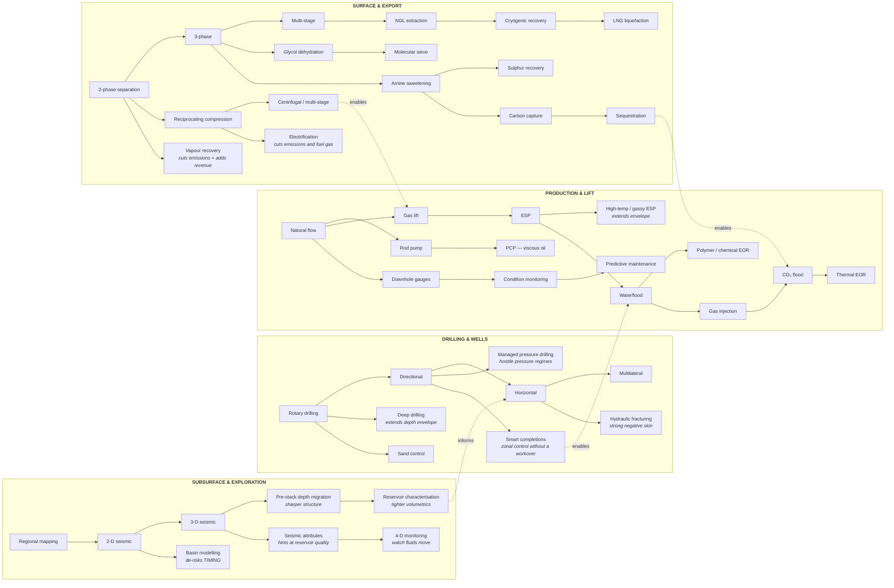

# 07 — Technology

**Status:** draft · **Date:** 2026-08-06

> **Affects:** 05, 10, 13, 14, phases · **Affected by:** 05, 10, 13, 14
> *(strong couplings only — the full row is in [22](22_DESIGN_COHERENCE.md) §2)*

---

## 1. The design rule

> **A technology changes a model, a limit, or an option — never a multiplier on
> an outcome.**

The failure mode this rules out is the tycoon-game tech tree where every node is
"+10% production" and the tree is a linear power curve with cosmetic branches.
Here, every node does one of exactly three things:

| Effect kind | Meaning | Example |
|---|---|---|
| **Unlocks an option** | Something previously impossible becomes possible | Horizontal drilling; ESP; LNG; CO₂ flooding |
| **Extends an envelope** | A physical limit moves | Max water depth; max drilling depth; max H₂S tolerance; max compression ratio |
| **Improves a model parameter** | A real physical coefficient changes | Seismic resolution; separation efficiency; pump efficiency; measurement accuracy |

Because the models are plugins ([03_ARCHITECTURE](03_ARCHITECTURE.md) §3.2), a
technology that improves seismic resolution literally **swaps the observation
model** used by seismic surveys. It is not a multiplier applied afterwards.

---

## 2. Structure

Not a tree — a **directed acyclic graph with four domains**, because real
capability is cross-cutting: better materials help drilling *and* pipelines *and*
processing.



---

> **The shipped node list** — every node with era, prerequisites, routes and
> what it opens — lives in [catalog/TECH_TREE.md](../catalog/TECH_TREE.md); the
> per-station equipment it gates lives in the
> [catalogue sheets](../catalog/CATALOG_INDEX.md). This document owns the
> *mechanisms*; those own the *inventory*.

## 2b. The exploration ladder opens geology, not just precision

Each observation node in §2's EXPL domain does two things: swaps the
observation model (narrower error bars — §4) **and extends the detectable
set** ([06](06_WORLD_AND_EXPLORATION.md) §2.3):

| Node | Precision effect | **Geology it opens** |
|---|---|---|
| 2-D seismic | Coarse structure | D0 — obvious structural traps |
| 3-D seismic | Sharp trap geometry | **D1 — subtle structural** |
| Seismic attributes | Reservoir-quality hints | **D2 — stratigraphic** |
| Pre-stack depth migration | Correct imaging under complex overburden | **D3 — subsalt and deep obscured** |
| Basin modelling | Timing de-risked | *(no new class — a POS-factor tool)* |
| 4-D monitoring | Fluid movement | *(a production tool, not exploration)* |

And the DRILL/PROD domains gate the **access classes** the same way: deep
drilling → depth classes; rig-class and subsea tech → water depth; MPD +
metallurgy → HPHT; fracturing → tight; sweetening → sour sales. **A reservoir
can therefore depend on technology twice** — once to be found, once to be
worth finding.

## 2c. Activity gating — every operation's dependencies in one place

Every scheduled activity validates its requirements **at command time, with the
missing item named** (the R17 §2.6b rule). All of it is content — operation
templates carry `requiresTech` exactly as equipment carries it:

| Activity | Technology | Equipment / tier | Environment envelope |
|---|---|---|---|
| 2-D / 3-D / PSDM survey | The observation node | Seismic kit tier | Terrain method; marine weather window |
| Re-processing old data | The new observation node | — *(cheap: no field work)* | — |
| Wildcat / development drill | Depth-class node | Rig with the depth rating | Rig class vs water depth; seasonal window |
| HPHT drill | Managed pressure drilling | HPHT-rated rig + metallurgy tier | — |
| Horizontal / multilateral | The DRILL nodes | Directional kit | — |
| Fracturing | Hydraulic fracturing | Frac spread (rentable) | **Water source** ([13](13_ENVIRONMENT.md)) |
| Acidise / workover / recomplete | — | Workover unit | Access mode |
| Lift install | The method's node | The tier (§4b.3) | Power for ESP fleets |
| Waterflood / gas / CO₂ injection | The EOR node | Injection plant tier | Disposal/CO₂ source |
| Facility unit build | The unit's node (e.g. sweetening) | The unit tier | Foundations, winterisation, module route |
| Pipeline lay | — | Pipe-spec tier (X-grade) | Terrain, crossings, ice scour |
| Subsea tieback | Subsea node | Subsea tier | Water depth class |
| LNG train | Liquefaction node | Train tier | Port water depth |
| Condition monitoring rollout | Monitoring node | Gauge/fibre tier | — |
| Decommissioning | — | Heavy-lift (offshore) | Weather window |

One rule keeps this table honest: **no activity checks technology at execution
time** — all gating is at scheduling/validation, so a mid-operation tech change
never strands work, and the rejection message is always actionable.

## 3. How a technology is acquired

Four routes, because a single research bar is dull and unrealistic:

| Route | Cost | Time | Note |
|---|---|---|---|
| **In-house R&D** | Sustained budget | Long | Cheapest per unit; you choose the direction |
| **Licence from a vendor** | Per-use fee or royalty | Immediate | Fast, expensive forever, no ownership |
| **Service company contract** | Priced into the job | Immediate | You never own it; the capability is rented |
| **Industry diffusion** | Free | Very long | Everything eventually becomes standard practice |

**Recommendation:** all four. It makes technology a *procurement* decision rather
than a research-points decision, which is both more realistic and more
interesting. A small company rents; a major develops.

### 3.0a Technology and environment share one effect vocabulary

[13_ENVIRONMENT](13_ENVIRONMENT.md) §2.1 applies the *same three effect kinds* —
restrict an option, move an envelope, change a model parameter. That is not a
coincidence; it is the mechanism by which the hostile-setting progression works:

| The environment… | …and technology |
|---|---|
| Arctic **restricts** year-round drilling to a four-month window | Winterised rigs and ice-management **move that envelope** |
| Deepwater **restricts** which rig classes are usable | Dynamic positioning **unlocks** drillships |
| A 4 °C seabed **changes** the hydrate model's parameters | Insulation and inhibitor injection **change them back** |
| Heat **derates** compression capacity | Better cooling **moves the envelope** |

**The effect-application path is written once and shared** ([R22](../phases/R22_ENVIRONMENT.md) §2.1),
so a technology that counters an environmental restriction needs no special
handling. It is also why an architecture test forbids a fourth effect kind: a
bare multiplier in either system would break the symmetry.

### 3.1 Technology has running costs

An unlocked technology is not free thereafter. Each carries an ongoing burden:
specialist crew, licence fees, higher maintenance, more power. **A company can be
over-teched for its size** — carrying capabilities it cannot fund. That is a real
failure mode and a good one to make available.

---

## 4. Worked examples

Showing the "changes a model, not a multiplier" rule in practice.

| Technology | What actually changes |
|---|---|
| **3-D seismic** | Swaps the seismic `IObservationModel` **and extends the detectable set to D1** (§2b): subtle structural leads now spawn where 2-D returned nothing. Trap-geometry uncertainty falls sharply; POS rises *because uncertainty fell*, never because a number was added. |
| **Pre-stack depth migration** | Extends the detectable set to **D3** — the subsalt wave: acreage everyone wrote off becomes frontier again, including acreage *you* wrote off and relinquished. |
| **Horizontal drilling** | `IWellPath` gains a horizontal option. Reservoir contact rises from tens to thousands of feet, so the IPR's effective drainage geometry changes. Productivity rises **as a consequence of the physics**. Costs more; risks intersecting water. |
| **Hydraulic fracturing** | Applies a large negative skin to the completion. In tight rock this is the difference between uneconomic and economic — it converts the **Tight access class** ([06](06_WORLD_AND_EXPLORATION.md) §2.3) from contingent-resource-with-technology-trigger into a development decision, on the day it unlocks. |
| **ESP** | Adds an `ILiftMethod` whose pump curve shifts the VLP downward, letting the well keep producing at reservoir pressures where natural flow has stopped. Consumes power; fails on free gas. |
| **Multi-stage separation** | Swaps the `ISeparationModel`. Recovers more stock-tank liquid from the same reservoir fluid — **more sellable oil from identical production**. |
| **Amine sweetening** | Removes an *option block*. Sour gas that could not be sold at any price becomes sellable. Entire fields become viable. |
| **Condition monitoring** | Enables the condition-based maintenance strategy: fewer failures, higher availability, higher fixed cost. |
| **CO₂ flood** | Adds an `IDriveMechanism`. Recovery factor rises by 5–15 points on a field that was nearly finished — the classic "second life" for a mature asset. |
| **Vapour recovery** | Redirects a stream that was going to the flare into sales. Cuts emissions penalties **and** adds revenue: the rare genuine win-win, so it should be expensive. |
| **Electrification** | Swaps the power source. Cuts emissions and frees fuel gas for sale, at high capital cost and a dependency on grid availability. |

---

## 4b. Technology gates the catalogue — equipment tiers

The missing link between the technology graph and the physical world: **how does
"we researched better ESPs" become more flow from well W-014?** The answer is a
two-layer system, and neither layer is a multiplier.

### 4b.1 The two layers

| Layer | What it is | Costs | Takes |
|---|---|---|---|
| **Capability** (technology) | A tech node **unlocks catalogue entries** — its third effect kind, aimed at content | The acquisition route's price (§3) | The route's duration |
| **Procurement** (equipment) | Buying and installing a specific catalogue tier on a specific asset | The tier's capital price | An `IOperation` — a workover for a downhole component, construction for a facility unit |

**The tier's datasheet IS the effect.** A Tier-3 ESP flows more than a Tier-1
not because of a bonus, but because its declared head curve is higher and its
gas tolerance wider — parameters the completion's VLP consumes directly
([SDD-003](../sdd/SDD-003_SUBSURFACE_AND_WELLS.md) §6.2). This is §1's
no-multipliers rule extended to its natural conclusion: *the catalogue is where
"improve a model parameter" lives for equipment.*

### 4b.2 Tiers exist in every place — the same pattern everywhere

| Place | Family | An example ladder | Each tier changes |
|---|---|---|---|
| Well · lift | ESP | ESP-A (standard) → ESP-B (high-rate) → ESP-C (high-temp/gas-handler) → ESP-D (PM motor) | Head curve ↑, rate range ↑, gas/temperature envelope ↑, power draw ↓ (PM), price ↑ |
| Well · lift | Rod pump | Beam gen-1 → gen-2 long-stroke | Displacement cap ↑, depth range ↑ |
| Wellbore | Tubing metallurgy | Carbon steel → 13Cr → duplex | H₂S/CO₂ service envelope ↑, corrosion severity factor ↓, price ×3–8 |
| Completion | Stimulation | Acid wash → single-stage frac → multi-stage frac | Achievable negative skin, cost, water demand |
| Facility | Compression | Reciprocating → centrifugal → electric-drive multi-stage | Throughput ↑, ratio per stage ↑, emissions ↓ (electric), power source changes |
| Facility | Dehydration | Glycol (TEG) → molecular sieve | Achievable dewpoint ↓ (deeper spec), cost ↑ |
| Facility | Metering | Orifice → turbine → coriolis | Measurement uncertainty ↓ — custody variance shrinks |
| Pipeline | Line pipe | X52 → X65 → X70 + internal coating | Pressure rating ↑ (capacity ↑ via hydraulics), roughness ↓, cost/km ↑ |
| Monitoring | Surveillance | None → downhole gauges → fibre | Enables condition-based maintenance; tightens allocation and belief updates |
| Exploration | Seismic kit | 2-D streamer → 3-D → node array | The observation model itself (§4) |
| Rigs | Rig class | Depth rating tiers · winterised class | Operation envelopes ([13](13_ENVIRONMENT.md)) |

One pattern, eleven places. **Adding a tier anywhere is one content file** — a
`well-component`, `facility-unit` or `pipe-spec` entry with a `requiresTech`
gate — and no code.

### 4b.3 A worked ladder — the ESP family

| | ESP-A | ESP-B | ESP-C | ESP-D |
|---|---|---|---|---|
| Requires tech | ESP | ESP | High-temp/gassy ESP | PM-motor ESP |
| Rate range (m³/d) | 50–300 | 200–1,500 | 150–1,200 | 150–1,200 |
| Max free gas at intake | 10 % | 15 % | **40 %** | 40 % |
| Max temperature | 100 °C | 120 °C | **175 °C** | 175 °C |
| Power draw | baseline | high | high | **−25 %** |
| Capital + install workover | low · 6 d | mid · 6 d | high · 8 d | highest · 8 d |
| Failure profile | mature | mature | **early-generation** | early-generation |

Two deliberate design notes in that table. **The rate ranges are the flow.** And
**the newest tier carries an early-generation failure profile** — reliability is
content, and first-generation equipment failing young is both realistic and a
real trade: the proven ESP-B versus the exciting ESP-C is a genuine decision,
not an upgrade arrow.

### 4b.3b Where unlocks land — the slot system

Equipment was clear: a tier fits a socket and its datasheet is read by the
socket's model. But a technology can also unlock a **material or treatment** —
a synthetic mud, a hydrate inhibitor, a polymer, purchased CO₂ — and the
question "what does it affect, and how does the system know?" needs one answer,
not per-case wiring. The answer:

**Every unlockable content entry declares what it `fits` — a typed slot — and
every slot-bearing thing in the world declares its slots.**

| SlotKind | Lives on | Example entries that fit |
|---|---|---|
| `ComponentSocket` | Completion (tubing, packer, meter, gauge…) | Tubing metallurgies, meters ([C04](../catalog/C04_WELLBORE_AND_TUBING.md), [C10](../catalog/C10_STORAGE_AND_METERING.md)) |
| `LiftSocket` | Completion | ESP tiers, rod pumps ([C05](../catalog/C05_ARTIFICIAL_LIFT.md)) |
| `DrillingFluid` | Drilling operation template | Water-based → synthetic muds ([C15](../catalog/C15_CONSUMABLES_AND_TREATMENTS.md)) |
| `CompletionFluid` | Frac/completion operations | Slickwater, crosslinked gels |
| `ChemicalInjection` | Any flow element with an injection point | Hydrate/corrosion/scale inhibitors, DRA |
| `ProcessAdditive` | A facility unit | Demulsifier at the treater |
| `InjectionStream` | Injection wells / flood plans | Water, gas, **polymer, CO₂, biocide** — stream materials and additives |
| `DriveMechanism` | Compartment (via a flood plan) | Waterflood, polymer, CO₂ drive plugins |
| `ModelSlot` | The composition | Model plugin swaps ([SDD-005](../sdd/SDD-005_CAPABILITIES_AND_EFFECTS.md)) |

**How it affects the system — two shapes, one rule:**

- **Equipment** (socketed): the owning model reads the tier's datasheet — as
  before (§4b.1).
- **Treatments and materials** (slot-assigned): the entry carries a
  **slot-scoped effect list** — `SetModelParameter`/`MoveEnvelope` records
  applied *to the owning instance only, while assigned* — plus a consumption
  and cost rate. A hydrate inhibitor on pipeline P-01 shifts *P-01's* hydrate
  margin; biocide in Field A's injection water slows *Field A's* souring curve.
  **The scoped-effect list is the treatment's datasheet** — the §4b.1 rule
  extended, still no multipliers, still auditable per contribution ("why is
  this line's hydrate margin +8 °C?" lists the inhibitor).

**Discoverability closes the loop:** `tech.available` lists each unlocked
entry with its SlotKind, every slot's picker filters by SlotKind + gating, and
the catalogue sheet names the fit in its chain-position column. A player is
never told "you unlocked Synthetic Muds" without the system — and the UI —
knowing exactly which slots, on which things, it can now fill.

### 4b.4 Renting a tier — the service-company route, made concrete

The service-contract acquisition route (§3) maps exactly onto the catalogue: a
service company will **run a gated tier for you without the tech** — at a
per-job premium, and it leaves with them. A small company frac's its first well
years before it could own fracturing. This is the route's whole meaning, and it
needed the tier system to be expressible.

### 4b.5 Where the money and time go — the full chain

```
research/licence the CAPABILITY  (route cost, route duration — §3)
   → catalogue entries appear (tech.available)
      → BUY the tier for one asset        (capital)
         → INSTALL it                     (an IOperation: workover/construction days)
            → it performs per its datasheet  (more flow, wider envelope…)
            → and costs per its datasheet    (power, maintenance, failure profile)
```

Every arrow is an existing mechanism — the tier system adds **no new engine
machinery**, only the content field (`requiresTech`) and the discipline that
equipment improvements live in datasheets, never in modifiers.

## 5. Technology as data

Every technology is a content file declaring: identity, domain, prerequisites,
acquisition routes with costs and durations, ongoing costs, and its effects —
each effect naming a model to swap, an envelope to extend, or an option to
unlock.

**No technology has code behind it.** If a technology needs new behaviour, that
behaviour is a new *model plugin*, registered independently, which the technology
merely selects. This keeps the tech tree fully moddable and keeps "add a
technology" from ever meaning "edit the engine".

---

## 6. Open decisions

| # | Decision | Options | Recommendation |
|---|---|---|---|
| TD1 | Era progression | (a) fixed start era, (b) campaign spanning 1950→2030 with era-gated tech | **(b)** — a 1960s start where 3-D seismic simply does not exist yet is a genuinely different and excellent game |
| TD2 | Rival tech | (a) player only, (b) rivals advance too | **(b)** — being out-teched is real pressure |
| TD3 | Research direction | (a) pick a node, (b) fund a domain and get probabilistic outcomes | **(b)** — R&D that reliably delivers exactly what you ordered is the least realistic part of most tycoon games |
| TD4 | Obsolescence | (a) tech is permanent, (b) old tech becomes costly as vendors drop support | **(a) first** — (b) is interesting but risks feeling punitive |
