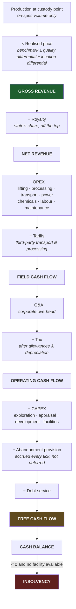

# 08 — Economics

**Status:** draft · **Date:** 2026-08-06

> **Affects:** 10, 14, 17, 18, 20, phases · **Affected by:** 13, 14, 17, 18, 20
> *(strong couplings only — the full row is in [22](22_DESIGN_COHERENCE.md) §2)*

Money is the constraint that makes every other decision matter. This document
defines how it moves.

---

## 1. The cash-flow spine



**Design note — the abandonment provision is accrued from first oil, not deferred
to the end.** Every barrel produced adds to a liability. This is correct
accounting, and it is also the honest way to make decommissioning a real
constraint rather than a surprise ending. A player who ignores it is not
protected from it.

---

## 2. Cost structure

### 2.1 CAPEX

| Category | Typical scale | Timing |
|---|---|---|
| Seismic acquisition | $M – $10sM | Front-loaded, before any revenue |
| Exploration well | $10sM – $100sM | The pure gamble |
| Appraisal wells | $10sM each | After discovery, before sanction |
| Development wells | $M – $10sM each | Through development, ongoing |
| Facilities | $10sM – $Bs | The largest single commitment |
| Pipelines | $M/km, scaling with diameter | With development |
| Terminal / export | $100sM | Once, and it gates everything |

### 2.2 OPEX and the lifting cost story

| Category | Scales with | Note |
|---|---|---|
| Fixed field OPEX | Facility count and size | Payable whether producing or not |
| Lifting cost | **Gross liquid** (oil + water) | The key one — see below |
| Water handling | Water volume | Rises through field life |
| Power / fuel | Equipment duty | ESPs and compressors dominate |
| Chemicals | Fluid conditions | Demulsifier, inhibitor, biocide |
| Maintenance | Equipment condition and strategy | See [05](05_SIMULATION_MODELS.md) §7 |
| Transport tariff | Volume × distance | Or your own pipeline's OPEX |
| **Weather downtime** | Days lost per tick | Standby cost accrues without progress ([15](15_TIME_AND_EXECUTION.md) §7) |
| **Carbon price** | Emissions × jurisdiction rate | Rises over a long campaign (HS-D3) |
| **HSE programme** | Barrier count and test frequency | The cost of not entering the maintenance spiral |
| **Environmental liability** | Spills, remediation, restoration | Accrued, not just fined ([14](14_HSE.md) §5.3) |
| G&A | Company size | The overhead of existing |

**The single most important economic mechanic in the game:**

> Lifting cost scales with **gross liquid**, but revenue scales with **oil only**.

At 90% water cut, the player lifts, separates, treats and disposes of ten barrels
of fluid to sell one barrel of oil. Cost per barrel of *oil* has risen roughly
tenfold. **This — not the reservoir running out — is what actually kills most
fields.** It is arithmetic the player can see coming, forecast, and act on:
shut off the watered zone, install a bigger pump, or abandon.

### 2.3 The economic limit

A well or field is abandoned when its incremental revenue falls below its
incremental cost. The engine computes this continuously and warns. **Abandonment
then costs money**, so the timing decision is genuinely awkward: keeping a
marginal well alive is a slow bleed, but killing it triggers a large immediate
bill. That tension is real and worth preserving exactly as it is.

---

## 3. Prices

### 3.1 Realised price

```
Realised  =  Benchmark  +  Quality differential  +  Location differential  −  Marketing
```

| Component | Driver |
|---|---|
| Benchmark | The market model (§3.2) |
| Quality differential | API gravity and sulphur. Light sweet crude commands a premium; heavy sour is discounted, sometimes steeply |
| Location differential | Distance and access to market; landlocked production is discounted hard |

**Consequence worth designing for:** two fields producing identical volumes can
have very different revenues. A player who understands quality and location
differentials will value acreage differently from one who does not — and will be
right.

### 3.2 Price models — plugins

| Model | Behaviour | Use |
|---|---|---|
| Mean-reverting stochastic | Oscillates around a long-run level with shocks | **Default.** Matches commodity behaviour |
| Cycle-driven | Explicit boom/bust with supply response | Campaign narrative |
| Historical replay | Actual price history | An era campaign |
| Scenario-scripted | Designer-authored | Tutorials, challenges |
| Flat | Constant | Testing and model isolation |

Gas is priced separately and behaves differently: regional rather than global,
more seasonal, and often contract-linked rather than spot. NGLs track both oil
and gas. **Modelling them independently produces real portfolio decisions** —
notably whether to build an NGL plant, which depends entirely on the spread.

### 3.3 Contracts

| Type | Trade-off |
|---|---|
| Spot | Full price exposure, full upside |
| Term, fixed price | Certainty; you lose the upside |
| Term, indexed | Volume certainty, price exposure |
| Take-or-pay | Buyer guarantees offtake; **you owe penalties if you cannot deliver** |
| Hedge | Costs a premium; caps the downside |

Take-or-pay is the most interesting: it stabilises revenue and simultaneously
converts an equipment failure from lost revenue into lost revenue **plus a
penalty**. Signing one is a bet on your own reliability.

---

## 4. Fiscal regimes

A plugin ([03](03_ARCHITECTURE.md) §3.2), because the regime changes the whole
character of a project.

| Regime | Mechanism | Character |
|---|---|---|
| **Royalty / tax** | Royalty off gross, then corporate tax on profit | Simple. Punishing on marginal fields — the royalty is due even at a loss |
| **Production sharing (PSC)** | Cost oil recovers spend up to a cap; profit oil splits with the state | Protects the investor's downside; the state takes more upside. **The cost recovery cap is the key parameter** |
| **Service contract** | Fee per barrel; the state owns the hydrocarbons | Low risk, low reward |
| **Sliding scale** | Government take rises with profitability or rate | Dampens both extremes |

**Gameplay:** the same discovery is a different project under each. A player who
reads the terms before bidding will pass on blocks that a naive player wins — and
the naive player's "win" will be the thing that bankrupts them. That is a
satisfying trap to leave lying around, provided the terms are always fully
visible before bidding.

---

## 5. Finance

| Instrument | Availability |
|---|---|
| Equity | Dilutes ownership; available in good times |
| Reserve-based lending | **Borrowing capacity is a function of booked reserves** — so a discovery immediately expands what you can borrow. The **rate** is a function of ESG standing ([14](14_HSE.md) §7), which is the slowest loop in the game |
| Project finance | Secured against one development; ring-fenced |
| Farm-out | Sell a share of a licence for cash and/or a carried well |
| Vendor finance | The service company waits for payment, at a price |
| **Insurance** | Premiums buy transfer of the fat tail: well control, spill liability, business interruption. Deductibles and exclusions are real; premiums re-rate on **your own incident record** — the barrier model prices your policy |

**Reserve-based lending is the mechanic that ties the two halves of the game
together.** Exploration success does not just add future revenue — it immediately
expands present borrowing capacity, which funds the next well. That is exactly
how the industry actually works, and it makes the exploration/production loop
self-reinforcing without any artificial coupling.

**Farm-out** deserves emphasis as the small company's survival tool: sell 50% of
a prospect to fund drilling it. Half of something beats all of nothing, and
learning when to farm out is a real skill.

### 5b. The asset market — reserves without the drill-bit

The liquidation spiral's exits ([21](21_INTEGRATION.md) §3) include *acquire*
and *farm in* — which obliges the market to exist. Rivals periodically offer
**discovered-but-undeveloped assets and prospect stakes** for sale
(`rival.assetOffer`, a `D`-severity event with a deadline), priced from **their
own noisy beliefs**. The player values the same asset from *their* beliefs and
whatever the data room reveals — so genuine trades exist in both directions:
a rival under-values what your basin model says is good, or over-prices a
disappointment they want off their books.

Two forms, and the operatorship rule is explicit:

| Form | You get | You become |
|---|---|---|
| **Acquisition** | The whole asset (licence, wells, data) | **Operator** — it is yours to develop |
| **Minority stake / farm-in** | A working-interest share | **Non-operated**: a passive cost-and-revenue line at the rival's pace. You are buying reserves and exposure, not control |

*Why it matters:* buying reserves is the industry's standard answer to a failing
RRR — usually at full price, which is exactly the lesson. Exploration adds
reserves at finding cost; acquisition adds them at market price; the gap between
those two numbers is the whole argument for being good at exploration.

---

## 6. Reserves — the real scoreboard

Per SPE-PRMS, computed each tick from beliefs + development plan + prices:

| Class | Meaning |
|---|---|
| **1P (Proved)** | Reasonably certain — the bankable number |
| **2P (Proved + Probable)** | The best estimate — the planning number |
| **3P (+ Possible)** | The optimistic case |
| **Contingent** | Discovered, not currently commercial |
| **Prospective** | Undiscovered potential |

### 6.1 Reserve replacement ratio

```
RRR  =  reserves added in the period  ÷  production in the period
```

**RRR is the headline score.** Below 1.0, the company is liquidating itself
however healthy the cash flow looks. This does three things at once:

1. Forces exploration to remain relevant at every stage of the game
2. Gives the late game a genuinely hard problem — a large company must find
   enormous volumes just to stand still
3. Provides a truer measure of play quality than cash, which can always be
   inflated by harvesting

**Recommendation: RRR and 2P reserves are the primary end-of-run summary
statistics, above cash.**

### 6.2 Price sensitivity

Reserves are only what is economic at current prices. **A price crash
mechanically writes down reserves**, which shrinks borrowing capacity, which
forces capital discipline — a chain reaction the player feels immediately.
This is the correct and realistic transmission of a market shock into the
company, and it emerges from definitions rather than from a scripted event.

---

## 7. Open decisions

| # | Decision | Options | Recommendation |
|---|---|---|---|
| ED1 | Accounting depth | (a) cash only, (b) cash + P&L + balance sheet | **(b)** — reserve-based lending and tax allowances need a balance sheet, and it is the difference between a tycoon game and a business simulation |
| ED2 | Insolvency | (a) game over, (b) restructuring / asset sales / takeover | **(b)** — a forced fire-sale is a far better ending than a game-over screen |
| ED3 | Currency | (a) single currency, (b) multi-currency with FX risk | **(a)** — FX adds bookkeeping, not decisions |
| ED4 | Inflation | (a) none, (b) cost inflation tied to the price cycle | **(b)** — genuinely important: **costs boom exactly when prices boom**, which is why the industry destroys value at cycle peaks. A real and rarely-modelled lesson |
| ED5 | Reserves booking | (a) engine-computed, (b) player-declarable with audit risk | **(a) first** — (b) is a fascinating later mechanic (overbook, get caught, scandal) but needs (a) working underneath |
| ED6 | Insurance | (a) none — the player carries every tail, (b) insurable classes with premiums rated on the player's record | **(b)** — it is how the industry actually holds these risks, it gives the HSE record a second economic channel beside ESG, and "self-insure and bank the premium" is a legitimate strategy for a strong operator |
