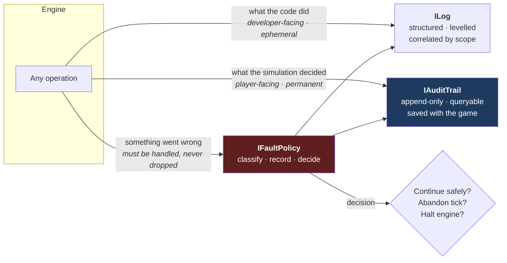
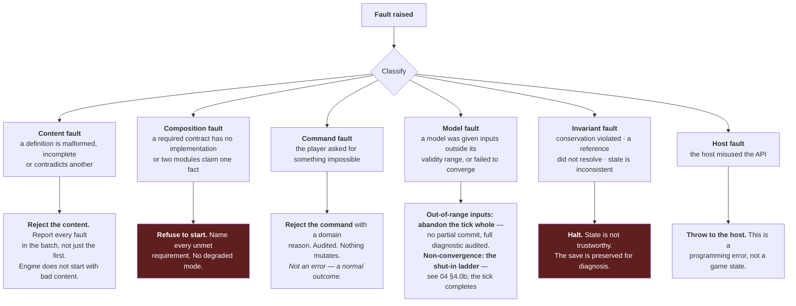

# 09 — Diagnostics: Log, Audit and Fault Policy

**Status:** draft · **Date:** 2026-08-06

> **Affects:** 03, 11, 12, 16, 21, phases · **Affected by:** 03, 11, 15, 16, 21
> *(strong couplings only — the full row is in [22](22_DESIGN_COHERENCE.md) §2)*

A first-class engine subsystem, present from the first commit, not added when
something goes wrong. Its job: **nothing that happens in this engine is
unexplained, and nothing that fails is silent.**

---

## 1. Why this is a foundation and not a utility

Three things are true of a simulation of this kind:

1. **The player will ask "why?" constantly.** Why did production drop? Why is
   this well shut in? Why was my gas rejected? Every one of those has a specific
   cause somewhere in a tick, and if the engine did not record it, the answer is
   unavailable at any price.
2. **The most dangerous bugs are the ones that do not throw.** A silently
   swallowed exception, a quietly skipped item, a default value standing in for
   a missing collaborator — these produce a game that runs perfectly and is
   wrong. They are found months later, if ever.
3. **Explanation and debugging are the same problem.** The record that tells a
   player why their field is throttled is the record that tells a developer why
   the solver misbehaved. Building it once serves both.

**Therefore:** the audit trail is not diagnostics bolted on. It is how the engine
explains itself, to players and developers alike, and it is written first.

---

## 2. Three distinct services

Commonly conflated; kept separate here because they have different lifetimes,
different consumers and different guarantees.

| | `ILog` | `IAuditTrail` | `IFaultPolicy` |
|---|---|---|---|
| **Audience** | Developer | Player **and** developer | Both |
| **Lifetime** | Session, rotated | Permanent — **saved with the game** | — |
| **Content** | Code-level events | Simulation decisions and their causes | Faults |
| **Guarantee** | Best-effort | **Append-only, complete, queryable** | Every fault reaches it |
| **Answers** | "What executed?" | "Why is the game in this state?" | "What went wrong, and what did we do?" |

---

## 3. `ILog`

Structured records, not formatted strings: an event name, a level, a set of typed
fields, and the correlation scope it occurred in.

| Level | Meaning |
|---|---|
| `Trace` | Solver iterations, per-element detail. Off by default; enormous |
| `Debug` | Per-stage summaries within a tick |
| `Info` | Tick boundaries, commands applied, operations completed |
| `Warning` | Something unusual but handled — a constraint bound unexpectedly hard |
| `Error` | A fault occurred; the fault policy handled it |
| `Critical` | The engine cannot continue |

**Correlation scopes** nest: `Session → Tick → Stage → Element → Operation`.
Every record carries its scope chain, so "show me everything that happened inside
the flow solve for well W-014 on tick 132" is a filter, not a text search.

**No log call formats a string at the call site.** Fields stay typed until a sink
renders them. This keeps `Trace` affordable when disabled and makes logs
machine-queryable.

---

## 4. `IAuditTrail` — the important one

An append-only, ordered, queryable record of **every decision the simulation
made**, saved with the game.

### 4.1 What is recorded

| Category | Examples |
|---|---|
| **Commands** | Submitted, validated, accepted or rejected with the reason, applied with the outcome |
| **State transitions** | Well status changes, facility commissioning, licence award and expiry, operation start and completion |
| **Constraints binding** | Which element throttled which branch, and the volume deferred by it |
| **Rejections** | Off-spec stream refused at a custody point, with the failing parameter and by how much |
| **Financial events** | Every cash movement with its cause |
| **Stochastic outcomes** | Every RNG draw that mattered: discovery, equipment failure, price shock — **with the stream and the value** |
| **Belief updates** | What was observed, what changed, prior → posterior |
| **Faults** | Everything the fault policy handled |
| **Invariant checks** | Result of every conservation assertion, every tick |

### 4.2 Why stochastic outcomes are recorded

Because *"the game cheated"* must be answerable. When a player's exploration well
comes up dry, the audit trail shows: the RNG stream, the draw, the threshold, and
the POS that produced the threshold. The player can verify the game was fair.

Equally important for development: a bug report with an audit trail is
**reproducible**, because seed plus command sequence plus recorded draws fully
determine the run.

### 4.3 Query surface

The audit trail is queryable in-game by entity, by time range, by category and by
cause. This directly produces player-facing features:

> **Why is well W-014 shut in?**
> *Tick 132 — shut in by the flow solver. Cause: backpressure from Manifold M-02
> exceeded W-014's wellhead capability. M-02 pressure rose at tick 131 when W-021
> came online. Deferred: 340 stb/d.*

That is not a UI feature written against special-case plumbing. **It is a query
against a record the engine keeps anyway.** Building the audit trail first is
what makes explanations cheap for the rest of the project's life.

### 4.4 Bounds

An unbounded trail grows without limit over a 40-year game. Policy:

- **Recent detail is kept in full** (a configurable window of ticks)
- **Older entries are summarised**, retaining every state transition, every
  financial event and every fault — discarding only per-tick per-element detail
- **Nothing that explains the *current* state is ever discarded.** If a decision
  in tick 4 is why something is true in tick 400, that entry survives.

---

## 5. `IFaultPolicy` — the only legal `catch`

> **Architectural law L4:** no `catch` clause outside the fault-policy module may
> discard. There is no `catch { }`, no `catch { return default; }`, no
> swallow-and-continue. Enforced by an architecture test.

### 5.1 Fault classification

### 5.2 The principle behind the table

**Severity is decided by whether continuing could produce a wrong game, not by
how inconvenient stopping is.**

- A rejected command is *not a failure* — it is the simulation correctly saying
  no, and the player gets a reason.
- A model given out-of-range inputs is a **bug**, and continuing would produce
  plausible-looking wrong numbers. Abandon the tick. **Non-convergence is the
  exception**: it gets the shut-in ladder ([04](04_MATERIAL_AND_FLOW.md) §4.0b) —
  a physical action that always lets the tick complete — because ending the game
  on a numerics failure punishes the player for the engine's limits.
- A conservation violation means barrels appeared or vanished. **Halt.** There is
  no acceptable way to continue a simulation that has stopped conserving mass;
  every number after that point is fiction.

### 5.3 Strict and resilient policies

`IFaultPolicy` is a plugin, with two shipped implementations:

| Policy | Used in | Behaviour |
|---|---|---|
| **Strict** | Development, CI, tests | Throws on everything, including warnings. Nothing is tolerated. |
| **Resilient** | Release builds | Records everything; halts only on invariant and composition faults; surfaces the rest to the player |

**Crucially, the resilient policy never *hides* anything** — it only differs in
whether it stops. A player on a release build still sees, in the audit trail,
every fault that occurred. "Resilient" means "keeps playing where it is safe to",
never "pretends it did not happen".

---

## 6. Invariant checks

Verified at tick close ([03](03_ARCHITECTURE.md) §6), every tick, in every build.

| # | Invariant |
|---|---|
| INV1 | **Mass conservation** per material — the check in [04](04_MATERIAL_AND_FLOW.md) §7 |
| INV2 | **Cash conservation** — every movement has a counterparty; the balance equals opening plus all movements |
| INV3 | **Reference integrity** — every entity id in use resolves |
| INV4 | **Single ownership** — no state key claimed by two modules |
| INV5 | **Non-negativity** — no negative inventory, volume in place, or capacity |
| INV6 | **Physical bounds** — no pressure below zero, no saturation outside 0–1, no efficiency above 1 |
| INV7 | **Temporal monotonicity** — the clock never goes backwards; cumulative production never decreases |
| INV8 | **Belief consistency** — no belief has zero variance unless directly measured |
| INV9 | **Segment closure** — segment durations within a tick sum to exactly one tick |
| INV10 | **Barrier derivation** — every barrier's strength equals the function of its underlying condition, competency and procedure; it is never independently stored |
| INV11 | **Indicator registration** — every P5/P6 coupling and every loop over two years has its registered indicator present ([21](21_INTEGRATION.md) IR1–IR2) |
| INV12 | **Cause completeness** — every `C`/`D` severity event published this tick carries a cause chain (IR6) |

Any violation is an invariant fault: **halt**, with the save preserved.

**Cost:** these are cheap — a handful of sums and comparisons against a tick that
solves a flow network. They stay enabled in release builds. The alternative,
learning about a mass-balance error from a player six months later, is far more
expensive.

---

## 7. What the player sees

The audit trail is a **game feature**, not a debug tool.

| Feature | Backed by |
|---|---|
| **Why is this well shut in?** | Constraint-binding entries |
| **Where did my money go this quarter?** | Financial event entries, grouped by cause |
| **Production loss report** | Deferred-volume entries by binding element |
| **What did I learn from this well?** | Belief-update entries |
| **Field history timeline** | State-transition entries |
| **Was that fair?** | Stochastic-outcome entries with stream, draw and threshold |
| **What did I do wrong?** | Rejected-command entries with domain reasons |
| **Barrier and integrity status** | Condition-derived barrier strength, overdue tests, deferred backlog — the leading indicators of [14_HSE](14_HSE.md) §2.2 |
| **Am I inside a downward loop?** | Standing indicators for every loop with a period over two years ([21](21_INTEGRATION.md) IR2) |
| **Where did this crisis start?** | The cause chain, walked back across ticks ([21](21_INTEGRATION.md) §7) |
| **Weather and downtime account** | Days lost per tick by cause, from the segment plan |

**The "production loss report" alone justifies the subsystem.** In real
operations it is one of the most-used reports there is: potential minus actual,
attributed by cause. It tells the player exactly what to fix next, and it exists
here because the solver already records attribution and the audit trail already
stores it.

---

## 8. Open decisions

| # | Decision | Options | Recommendation |
|---|---|---|---|
| DGD1 | Audit persistence | (a) in save file, (b) sidecar file, (c) both | **(c)** — summarised trail in the save so explanations survive a reload; full detail in a sidecar for bug reports |
| DGD2 | Invariants in release | (a) on, (b) off for performance | **(a)** — negligible cost, and silent corruption is the failure mode we most need to prevent |
| DGD3 | Log sinks | (a) file only, (b) file + in-memory ring + host callback | **(b)** — the ring buffer makes the last N events available in a crash report |
| DGD4 | Trail granularity | (a) every element every tick, (b) exceptions and transitions only | **(b) with (a) available per-entity on demand** — full detail for everything is enormous, but the player must be able to ask for it about one well |
| DGD5 | Fault policy in release | (a) strict, (b) resilient | **(b)**, with strict available via a launch flag for players filing bug reports |
