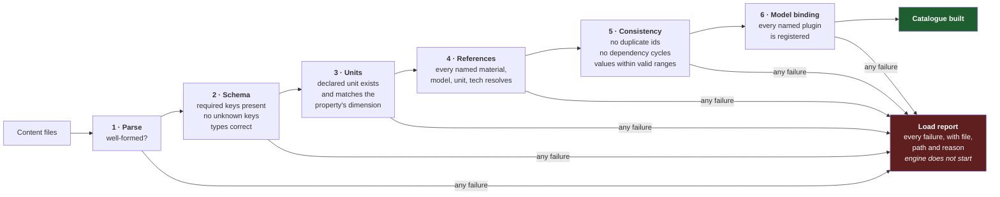

# 10 — Content and Units

**Status:** draft · **Date:** 2026-08-06

> **Affects:** 02, 05, 07, 11, 13, 14, 18, phases · **Affected by:** 01, 02, 05, 06, 07, 08, 13, 14, 18
> *(strong couplings only — the full row is in [22](22_DESIGN_COHERENCE.md) §2)*

Everything that is not a model is data. This document defines the data format,
the unit system, and the validation that stands between a content file and the
engine.

---

## 1. Units — the non-negotiable part

### 1.1 The problem

The industry runs on incompatible unit systems simultaneously. Barrels and cubic
metres. Standard cubic feet and normal cubic metres. psi, bar and kPa. °F and °C.
Millidarcies. And **API gravity, which is a nonlinear inverse transform of
density** — so an "average API" of two streams is not the average of their APIs.

Silent unit errors are the classic catastrophic bug of this domain. They do not
throw. They produce numbers that look reasonable and are wrong by a factor.

### 1.2 The solution

> **No bare number representing a physical value crosses any contract boundary.**

Every physical value is an `IQuantity`: a magnitude plus a unit, whose unit
belongs to a dimension. The rules:

| Rule | Consequence |
|---|---|
| Quantities of different dimensions cannot be added or compared | The error is inexpressible, not merely tested for |
| Multiplication and division produce a derived dimension | `volume ÷ time` **is** a rate; the type says so |
| Conversion within a dimension is exact and explicit | No implicit coercion anywhere |
| Nonlinear scales (API gravity, °F) are conversions, never units to compute in | Prevents averaging an API gravity |
| The engine computes in one canonical set; display units are a host concern | One internal truth, any presentation |

### 1.3 Canonical internal units

SI-based, because the derived-dimension algebra is clean and conversions are
exact:

| Dimension | Canonical | Common display alternatives |
|---|---|---|
| Length | m | ft |
| Mass | kg | — |
| Time | s | day, month |
| Pressure | Pa | psi, bar, kPa |
| Temperature | K | °C, °F |
| Volume | m³ | bbl, stb, rb, scf, Mscf, MMscf |
| Volumetric rate | m³/s | stb/d, Mscf/d, bopd |
| Mass rate | kg/s | t/d |
| Permeability | m² | mD |
| Viscosity | Pa·s | cP |
| Density | kg/m³ | °API *(nonlinear)*, SG |
| Energy | J | BTU, therm, MMBTU |
| Power | W | kW, hp |
| Money | currency unit | — |

**Volumes always carry their reference condition.** A stock-tank barrel and a
reservoir barrel are the same dimension and are **not interchangeable**. The
quantity carries the condition, and converting between them requires the
formation volume factor — explicitly, never implicitly. This closes the single
most likely double-count in the entire engine.

---

### 1b. The moddability contract — what you touch to change what

The global rule (README non-negotiable 11), as a table. This is the promise the
whole content architecture exists to keep:

| You want to… | You touch | Engine code? |
|---|---|---|
| Add a facility unit, well type, equipment tier, rig, vessel | One JSON file | **No** |
| Add a technology node, move it in the tree, change its gates | JSON (`tech` + `requiresTech` fields) | **No** |
| Rebalance anything — costs, curves, bands, hazard rates | JSON | **No** |
| Add a material, fluid system, environment profile, jurisdiction, fiscal regime | JSON (plugin selected by name) | **No** |
| Add a mud, chemical, injectant or any consumable | One `treatment` JSON — declares its slot and its scoped effects | **No** |
| Add a scenario, mission, challenge, campaign chapter | JSON | **No** |
| Add genuinely new *behaviour* — a new drive-mechanism law, a new unit transform | **A plugin implementation** + the JSON that names it | A new module/plugin, registered like any other — existing code untouched |
| Add a new content *kind* | Definition record + schema + an SDD note | Yes — rare and deliberate |

**Definitions versus instances, so the rule reads precisely:** JSON defines
*kinds of things* (an ESP-C, a 3-phase separator, a "tank battery" template, a
tech node). *Instances* — well W-014, the battery at Field A — are created in
play by commands and operations **referencing** definitions, and live in save
state. Modding touches definitions; playing creates instances; neither touches
engine code. Facility "types" are templates (02 §4.1); support buildings —
camps, warehouses, bases — are ordinary `facility-unit` entries whose
datasheets act on operations instead of streams.

**Why datasheets are closed rather than free-form**: the predecessor engine
loaded component properties into an untyped bag, and that bag shipped **empty
for years** — parsed from every file, read by nothing, and no error anywhere,
because a bag cannot distinguish a typo from a setting. Closed datasheets give
modders real errors with nearest-key hints, and give the engine the guarantee
that every declared property is consumed. Moddability and strictness are not in
tension — the strictness is *for* the modders.

Upgrade path: content is versioned independently of the engine (CD4), saves
record their content and mods (PR5), and migrations carry old saves forward —
so updating the game, updating content, and modding are three independent
operations.

## 2. Content types

Everything in this table is a data file. None requires code.

| Type | Declares | Examples |
|---|---|---|
| `material` | A substance and its properties | crude oil grades, natural gas, NGL components, water, CO₂, H₂S |
| `property-kind` | A named physical quantity, its dimension, valid range | porosity, permeability, skin, GOR |
| `rock-type` | Lithology and its property distributions | sandstone, carbonate, shale |
| `fluid-system` | A reservoir fluid: composition, PVT parameters | black oil, volatile oil, gas condensate, dry gas |
| `drive-mechanism` | Which model plugin, with parameters | solution gas, water drive, gas cap |
| `well-component` | Equipment specification, cost, degradation, failure profile, **`requiresTech`, `availableFromEra`** | tubing metallurgies, **ESP tiers A–D**, chokes, packers |
| `lift-method` | Lift type, envelope, model plugin, costs | gas lift, ESP, rod pump, PCP |
| `facility-unit` | A process unit: ports, transform model, capacities, costs | separator, treater, compressor, dehydrator |
| `facility-template` | A pre-composed set of units, for convenience | "small tank battery", "gas plant, 50 MMscfd" |
| `pipe-spec` | Diameter, rating, material, cost per km | line pipe catalogue |
| `vessel` | Tankers: capacity, speed, charter cost | Aframax, Suezmax, VLCC |
| `specification` | A set of stream limits at a point | sales gas spec, export crude spec, disposal water spec |
| `technology` | Prerequisites, acquisition routes, effects | see [07](07_TECHNOLOGY.md) |
| `fiscal-regime` | Revenue split rules, plugin + parameters | royalty/tax, PSC, service |
| `jurisdiction` | Regulator, regime, licence terms, environmental rules | per region |
| `basin-archetype` | World-generation parameters for a basin type | rift, foreland, passive margin, delta |
| `information-source` | Cost, duration, footprint, observation model | 2-D seismic, 3-D seismic, log suites, cores, tests |
| `contract-template` | Sales contract terms | spot, term, take-or-pay |
| `hazard` | Trigger conditions, hazard rate, consequences, mitigations | hydrates, corrosion, blowout |
| `treatment` | A consumable/material: `fits` (SlotKind), scoped effects, consumption rate, cost | muds, frac fluids, inhibitors, demulsifier, biocide, polymer, purchased CO₂ ([C15](../catalog/C15_CONSUMABLES_AND_TREATMENTS.md)) |
| `scenario` | A starting situation, objectives, scripted events | campaign missions, tutorials |
| `campaign` | Ordered chapters, declared persistence, branching | the four-era campaign |
| `objective` | A predicate, target, deadline, weight, visibility | reusable objective definitions |
| `environment-profile` | Terrain, water depth, climate, access, ground, sensitivity | plains, jungle, arctic tundra, shallow offshore |
| `climate-profile` | Seasonal baselines, variability, extreme-event rates | per region |
| `access-mode` | Road, rail, port, airstrip, helicopter, ice road; seasonal availability | with the windows they open and close |
| `hse-regime` | Inspection rigour, penalties, emissions limits, carbon price, flaring rules | per jurisdiction |
| `barrier` | What it protects against, degradation, test requirement, cost | preventive and mitigating |

---

### 2b. The catalogue sheets are the authoring spec

Equipment and technology content is not authored from imagination: each entry is
written from its row in a [catalogue sheet](../catalog/CATALOG_INDEX.md), and
each tech gate from the [TECH_TREE](../catalog/TECH_TREE.md) registry. Sheet ↔
content divergence is a coherence failure, checkable mechanically once content
exists (the same discipline SDDs impose on code — SDD-000 §8).

## 3. Format rules

Learned directly from the failure modes of the previous generation:

| Rule | Rationale |
|---|---|
| **Every file declares its type explicitly.** No inference from which keys are present. | Type inference means a file matching two shapes, or none, becomes a guess |
| **Every physical value declares its unit.** `{"value": 3200, "unit": "psi"}` — never a bare number. | A bare number is a unit bug waiting for a context switch |
| **Unknown keys are errors, not ignored.** | A typo'd key silently becoming a default is how declared settings end up unread |
| **Every declared reference must resolve at load.** | Content naming a component type with no implementation must fail loudly |
| **Equipment entries may declare `requiresTech` and `availableFromEra`.** An unregistered tech id is a load error; an ungated entry is available from the start — explicitly, not by accident | The tier system ([07](07_TECHNOLOGY.md) §4b) is carried entirely by these two fields |
| **Load reports every failure in the batch**, not just the first. | One-at-a-time error discovery makes content authoring miserable |
| **Bad content prevents startup.** No partial loads, no skipping the broken file. | A silently-skipped definition is a game missing content it thinks it has |
| **One canonical copy.** Content lives in exactly one directory. | Two copies of anything drift. They always drift. |
| **Content is validated against a schema**, and the schema ships with the engine. | Modders get real errors, not crashes |

### 3.1 Validation stages

---

## 4. Mods

A mod is a content directory plus an optional module assembly. It goes through
**the same** validation path — there is no separate mod loader, therefore no
class of bug that exists only for mods.

| Concern | Rule |
|---|---|
| Load order | Explicit, declared by dependency; cycles are a load error |
| Overriding | A mod may replace a base definition by id, and the override is recorded in the load report |
| Conflict | Two mods overriding the same id without a declared precedence is an **error**, not last-wins |
| New models | A mod may register plugin implementations through the standard module contract |
| Compatibility | A mod declares the engine content-schema version it targets |
| Save safety | A save records which mods were active; loading without them is an explicit, explained failure |

---

## 5. Balance data is content too

Every tuned number — cost scales, degradation rates, hazard probabilities, price
model parameters, world-generation distributions — lives in content, not in code.

**Two consequences worth stating:** balancing never requires a rebuild, and
"what number produced this behaviour?" is always answerable by reading a file
rather than searching source.

---

## 6. Open decisions

| # | Decision | Options | Recommendation |
|---|---|---|---|
| CD1 | Format | (a) JSON, (b) YAML, (c) TOML | **(a) JSON with schema** — universal tooling, no indentation hazards; verbosity is acceptable for machine-validated data |
| CD2 | Unit syntax | (a) `{"value": x, "unit": "psi"}`, (b) `"3200 psi"` | **(b)** — dramatically more readable, unambiguous to parse, and it makes a missing unit a visible omission rather than a missing key |
| CD3 | Schema | (a) JSON Schema, (b) engine-defined | **(a)** — editors validate as you type, which is worth a great deal to content authors and modders |
| CD4 | Content location | (a) beside the engine, (b) a versioned content package | **(b)** — content and engine version independently |
| CD5 | Localisation | (a) ids only in content, names in locale files, (b) inline names | **(a)** — separating them from the start costs nothing and retrofitting costs a lot |
