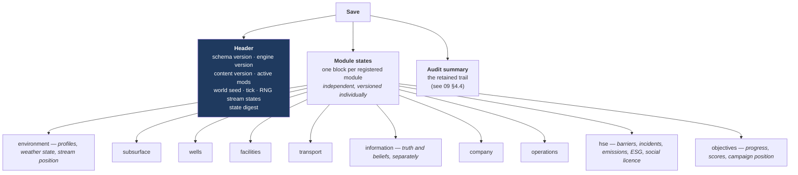

# 11 — Persistence and Determinism

**Status:** draft · **Date:** 2026-08-06

> **Affects:** 03, 09, 12, 15, phases · **Affected by:** 01, 02, 03, 09, 13, 14, 15, 19-doc
> *(strong couplings only — the full row is in [22](22_DESIGN_COHERENCE.md) §2)*

---

## 1. Requirements

| # | Requirement |
|---|---|
| PR1 | A saved game reloads to a state that is **indistinguishable** from the one saved — not approximately, exactly |
| PR2 | A reloaded game **continues identically**: same seed, same commands, same subsequent history |
| PR3 | Adding a module or a state field does **not** change the save format's shape |
| PR4 | Format changes are versioned and migrated forward; an unmigratable save is refused with an explanation, never loaded partially |
| PR5 | A save records the content and mods it depends on; loading without them fails explicitly |
| PR6 | A save is inspectable — a human can read it and a tool can diff two saves |

---

## 2. Structure: per-module state ownership

Each module registers the state keys it owns. The serializer walks the registry.

**Adding persistence for a new module is registering it.** No central schema
edit, no serializer change — the failure mode where a new manager is quietly
absent from saves cannot occur, because a module that fails to register does not
compose ([03](03_ARCHITECTURE.md) §3.1).

### 2.1 Load order is a declared contract

Modules declare their restore dependencies (facilities before the pipelines that
connect them; reservoirs before the perforations that drain them). The registry
topologically sorts them, and **a cycle is a composition error caught at startup,
not a mysterious load failure**.

**A reference that fails to resolve during restore is a fault, never a silent
drop.** "Re-link by id and drop yourself if the target is missing" is exactly how
a save quietly loses content — the load either fully succeeds or fails with an
explanation.

---

## 3. Determinism

Determinism is what makes PR2 provable, makes bug reports reproducible, and makes
the audit trail's fairness claim verifiable.

| Requirement | Mechanism |
|---|---|
| No wall-clock time in simulation logic | Only `ISimulationClock` exists; there is no other clock |
| No unseeded randomness | Only `IRandomSource`; `Random.Shared` and `Guid.NewGuid` are banned by architecture test |
| **Independent RNG streams per subsystem** | `worldgen`, `exploration`, `measurement`, `hazard`, `weather`, `price`, `market`, `operations` each draw from their own stream, **so adding a draw in one does not shift another** |
| Stable iteration order | Ordered collections everywhere state is enumerated; no dictionary-order dependence |
| Deterministic floating point | One canonical evaluation order; no parallelism inside a tick ([03](03_ARCHITECTURE.md) §10 A5) |
| Stream states are saved | Save/load preserves the exact RNG position |

### 3.1 The stream-independence point

Per-subsystem streams matter more than they look. With one global stream, adding
a single new random draw anywhere shifts every subsequent draw everywhere — so a
patch that adds one hazard check changes every world seed's geology. **With
separate streams, world generation is stable across engine versions**, which
means seeds remain shareable and comparable.

---

## 4. Verification

| # | Test | Passes when |
|---|---|---|
| PV1 | Round-trip identity | save → load → save produces byte-identical output |
| PV2 | Continuation identity | Save at tick N, load, run to N+100 — identical to running straight through to N+100 |
| PV3 | Cross-platform | Windows and Linux produce identical state digests from the same seed and commands |
| PV4 | Module coverage | Every registered module appears in the save; a module with unpersisted state fails the test |
| PV5 | Migration chain | Every historical version migrates forward to current and passes PV1 |
| PV6 | Corruption refusal | A truncated, tampered or mod-mismatched save is refused with a specific explanation, never partially loaded |
| PV7 | World regeneration | Regenerating the world from the seed reproduces the saved world exactly |
| PV8 | Digest sensitivity | Any single state change alters the digest |

**PV2 is the one that matters most** and is the one usually missing. Round-trip
equality proves the bytes match; only continuation equality proves the *behaviour*
matches — which is what a player actually experiences. It catches the whole class
of "something was restored as a value but not as a live dependency".

---

## 5. Versioning

- **Schema version** increments on any on-disk shape change.
- **Migrations are a chain**: each step moves one version forward. Any old save
  reaches current by composition.
- **Every migration has a test** built from a real save file of that version,
  committed as a fixture.
- **A save from a newer engine is refused** with a clear message, never
  best-effort loaded.

---

## 6. Open decisions

| # | Decision | Options | Recommendation |
|---|---|---|---|
| PSD1 | Format | (a) JSON, (b) binary, (c) JSON in a compressed container | **(c)** — inspectable and diffable when unpacked (requirement PR6), compact on disk |
| PSD2 | Truth persistence | (a) store the generated truth, (b) regenerate from the seed | **(a)** — the world can be *modified* in play (production changes reservoir state), so regeneration alone is insufficient; keep the seed too, and assert PV7 at generation time |
| PSD3 | Autosave | (a) every N ticks, (b) on significant events, (c) both | **(c)** — with a rolling set, because the events worth saving before are exactly the irreversible ones |
| PSD4 | Save-scumming | (a) unrestricted, (b) ironman option | **(a) default, (b) as an option** — exploration games lose their teeth if outcomes are re-rollable, but that should be the player's choice |
