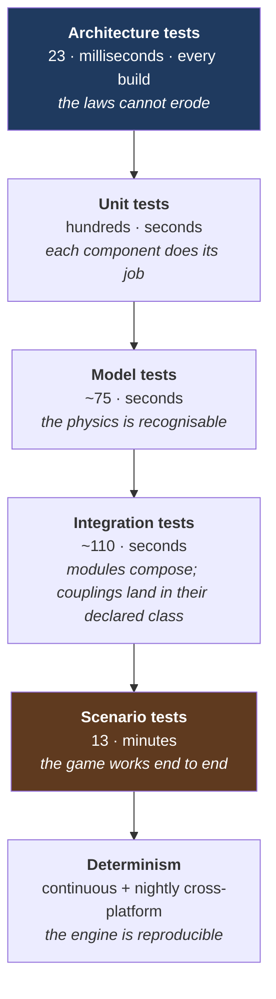

# 12 — Verification Strategy

**Status:** draft · **Date:** 2026-08-06

> **Affects:** 21, phases · **Affected by:** nearly everything — the densest column in the matrix
> *(strong couplings only — the full row is in [22](22_DESIGN_COHERENCE.md) §2)*

How each phase proves itself. Written before any code, because the test strategy
shapes the architecture rather than following it.

---

## 1. Six test kinds, each answering a different question

| Kind | Question | Runs |
|---|---|---|
| **Architecture** | Do the five laws hold? | Every build |
| **Unit** | Does this component do what it says? | Every build |
| **Model** | Does the physics produce recognisable numbers? | Every build |
| **Integration** | Do modules compose and interact correctly? | Every build |
| **Scenario** | Does a full company lifecycle work? | Every build (a few minutes) |
| **Determinism** | Is the engine reproducible? | Every build + nightly cross-platform |

---

## 2. Architecture tests — the laws, mechanised

These replace the "source-level guard test" approach of the previous generation,
which asserted on *file text* and therefore broke whenever a file was renamed and
could be defeated by a comment. **These assert on compiled metadata**, which is
rename-safe, comment-proof and cannot drift from what actually ships.

| Test | Enforces |
|---|---|
| No public or internal constructor takes a concrete type from another module | L1 |
| No optional constructor parameter has a contract type | L2 |
| No static mutable field exists outside the composition root | L2 |
| No type has a member named `Instance` | L2 |
| No method body is empty, returns a constant standing in for work, or throws `NotImplementedException` | L3 |
| Every `catch` outside the fault-policy module calls the fault policy | L4 |
| No two modules register the same state key | L5 |
| No assembly reference violates the layer order | Layering |
| No module assembly references another module's implementation assembly | Layering |
| The truth model is not reachable outside `OGSim.Information` | Information hiding |
| The flow solver contains no branch on material identity | "One engine" |
| No use of `Random.Shared`, `DateTime.Now`, `Guid.NewGuid`, or `Environment.TickCount` in simulation code | Determinism |
| No engine type references any presentation concept | Layer separation |
| No engine assembly subscribes to `IEventBus` | Notifications never carry control flow ([16](16_EVENT_MATRIX.md) §1) |
| No event payload contains a pre-formatted display string | The engine states facts; the host formats |
| The objectives assembly cannot reference the command bus | Objectives observe, never influence ([18](18_GAME_MODES.md) GM5) |
| Objective predicates cannot reference truth types | No truth leakage through scoring |
| No environment or technology effect is a bare multiplier | The three-effect vocabulary ([07](07_TECHNOLOGY.md) §1, [13](13_ENVIRONMENT.md) §2.1) |
| Barrier strength is derived from condition, not separately stored | L5, applied to HSE ([14](14_HSE.md) §2.2) |
| Every P5/P6 coupling has a registered P2/P3 leading indicator | [21_INTEGRATION](21_INTEGRATION.md) rule IR1 |
| Every loop with a period over two years publishes a standing indicator | Rule I2 |
| Every downward loop has a registered entry event at severity ≥ `W` | Rules I3, I4 |
| Every `C`/`D` event carries a cause chain of at least one link | Rule I6 |

**Every one of these corresponds to a defect class that is silent** — the
compiler is content, the game runs, and it is wrong. That is precisely the class
worth mechanising.

---

## 3. Model tests — the physics is right

Two flavours, and the distinction matters:

### 3.1 Exact tests

The model must match a closed-form answer:

| # | Check |
|---|---|
| MX1 | Darcy inflow matches the analytic rate across a parameter sweep |
| MX2 | A skin of +10 reduces productivity by the analytically predicted fraction |
| MX3 | Volumetric gas reservoir `p/Z` versus cumulative production is **exactly linear** |
| MX4 | Pipeline pressure drop matches Darcy-Weisbach for a known case |
| MX5 | Doubling diameter raises capacity by the analytically predicted factor |
| MX6 | Compression power matches the polytropic formula |
| MX7 | Every unit conversion round-trips to within floating-point tolerance |
| MX8 | Material balance closes exactly for a synthetic no-loss network |

### 3.2 Band tests

The model must land in a range observed in the real industry, with the range and
its justification recorded **in the test**:

| # | Check | Band |
|---|---|---|
| MB1 | Water-drive field recovery over life | 35 – 75 % |
| MB2 | Solution-gas-drive recovery | 5 – 30 % |
| MB3 | Fitted Arps `b` for a solved single-well field | 0.0 – 1.0 |
| MB4 | Wildcat success rate across a generated basin | 10 – 35 % |
| MB5 | Discovery size distribution | log-normal, few large, many small |
| MB6 | Lifting cost per barrel at 90% water cut vs 10% | roughly an order of magnitude higher |
| MB7 | Field life from first oil to abandonment | 15 – 40 years |

**Why bands must be tests and not judgement:** tuning drifts. A band test fails
loudly the moment a balance change pushes recovery factors to 95%, which no
amount of code review would catch.

---

## 4. Scenario tests — the whole game

End-to-end runs against a fixed seed, asserting on outcomes.

| # | Scenario | Asserts |
|---|---|---|
| SC1 | **Full lifecycle** — licence → seismic → discovery → development → plateau → decline → abandonment, ~40 years | Completes; every stage occurs; final state is plausible; all invariants hold every tick |
| SC2 | **Dry hole campaign** — five consecutive failures | Company survives or fails gracefully; play beliefs updated correctly each time |
| SC3 | **Gas development** — the full treating chain to sales spec | Off-spec gas never reaches a custody point; flare volume equals rejected volume exactly |
| SC4 | **Water breakthrough** — a strong-aquifer field | Water cut rises on an S-curve; costs rise; economic limit is reached and detected |
| SC5 | **Bottleneck cascade** — deliberately undersized separator, then pipeline, then tank | Each is correctly identified in turn; deferred volumes match analytic expectations |
| SC6 | **Price crash** — a 60% price fall mid-development | Reserves written down; borrowing capacity falls; marginal wells reach economic limit |
| SC7 | **Equipment failure** — the main compressor fails | Gas handling limited → **oil production limited**; cause correctly attributed in the audit trail |
| SC8 | **Export interruption** — a tanker is late | Tanks fill; wells shut in; production deferred, not stored; recovery on lifting |
| SC9 | **Multi-field portfolio** — three fields at different life stages | Capital allocation works; shared infrastructure allocates costs correctly |
| SC10 | **Save/load mid-lifecycle** | PV2 continuation identity holds at ten different points |
| SC11 | **Hostile environment** — arctic, four-month window, no infrastructure | Access windows bind; a missed window costs a year; the licence clock does not pause |
| SC12 | **HSE neglect** — scripted deferred maintenance over ten years | Barriers degrade, near misses rise, a serious incident eventually occurs — **and every one was preceded by a detectable indicator** (HS3) |
| SC13 | **Slow-loop visibility** — scripted play that enters the ESG and liquidation loops | Each loop's entry event fires while ≥2 exits remain, and the consequence event names the entry tick (IR3, IR5) |

**SC1 is the acceptance test for the whole engine.** Nothing is finished until
it passes.

### 4.1 Suite index

Every named verification suite across the design set, and where it is defined.

| Suite | Covers | Defined in | Runs from |
|---|---|---|---|
| L1–L5 + architecture list | The architectural laws | §2 above | R1 |
| MX1–MX8 | Exact analytic model checks | §3.1 | R4–R11 |
| MB1–MB7 | Industry band checks | §3.2 | R5–R13 |
| FV1–FV13 | The flow solver | [04](04_MATERIAL_AND_FLOW.md) §9 | R4 |
| CAL1–CAL10 | Physical calibration | [05](05_SIMULATION_MODELS.md) §10 | R20 |
| PV1–PV8 | Persistence and determinism | [11](11_PERSISTENCE.md) §4 | R19 |
| EN1–EN12 | Environment and weather | [13](13_ENVIRONMENT.md) §8 | R22 |
| HS1–HS14 | HSE and the barrier model | [14](14_HSE.md) §10 | R23 |
| TM1–TM11 | Time, pacing and segmentation | [15](15_TIME_AND_EXECUTION.md) §11 | R1 |
| EM1–EM10 | Events | [16](16_EVENT_MATRIX.md) §7 | R1, then per module |
| CI-V1–CI-V13 | Couplings and feedback loops | [17](17_CROSS_IMPACT_MATRIX.md) §7 | R20 |
| GM1–GM13 | Objectives and modes | [18](18_GAME_MODES.md) §7 | R24 |
| PD1–PD7 | The decision catalogue | [20](20_PLAYER_DECISIONS.md) §8 | R20 |
| I-V1–I-V16 | **Time × events × cross-impact integration** | [21](21_INTEGRATION.md) §8 | R20 |
| SC1–SC13 | End-to-end scenarios | §4 above | R20 |

**Three of these are structural rather than behavioural** — I-V1, I-V2 and I-V10
check *registration completeness*, so a new slow coupling added without a leading
indicator breaks the build. That is the only reliable way to keep integration
rules IR1–IRR4 true as the design grows.

---

## 5. The verification pyramid

---

## 6. Per-phase gate

**No phase is complete until all seven hold:**

1. All existing tests still pass
2. New tests exist for everything the phase added
3. Architecture tests pass — the laws were not bent to make the phase fit
4. Model tests for any physics added, with exact tests where an analytic answer
   exists
5. Determinism holds — the state digest is reproducible
6. Save round-trip **and continuation** identity hold for any new state
7. The phase's design document is updated to match what was actually built, and
   the master tracker row is ticked

---

## 7. What we deliberately do **not** do

| Not doing | Instead | Why |
|---|---|---|
| Source-text guard tests | Architecture tests on compiled metadata | Text guards break on renames and are defeated by comments — both observed repeatedly |
| Chasing a coverage percentage | Invariant checks + scenario tests | 100% coverage of wrong models proves nothing; conservation checks catch what coverage cannot |
| Mocking the physics | Real models with simple inputs | A mocked separator tests the mock |
| Golden output files as the primary check | Invariants and analytic tests, with goldens only for regression detection | A golden file tells you something changed, never whether it was correct |
| Testing through the host | Headless engine tests | The engine has no host dependency; introducing one for testing would create the coupling we designed out |
