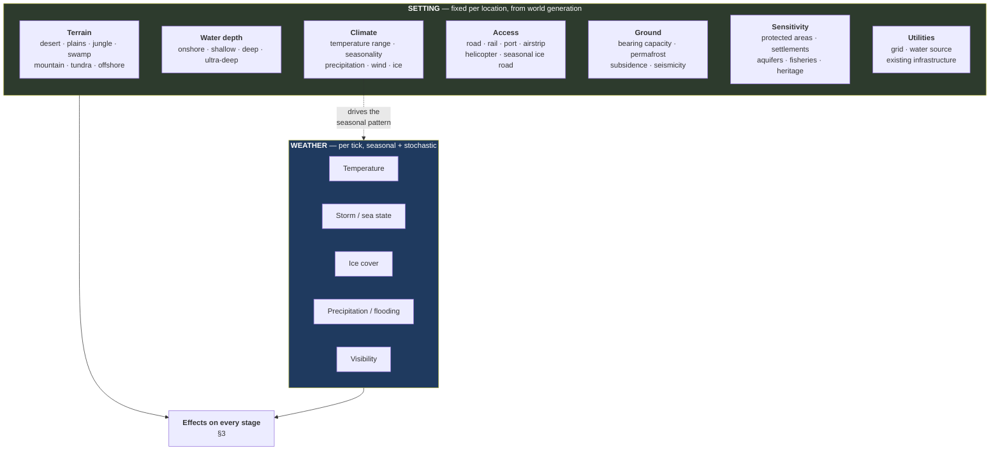
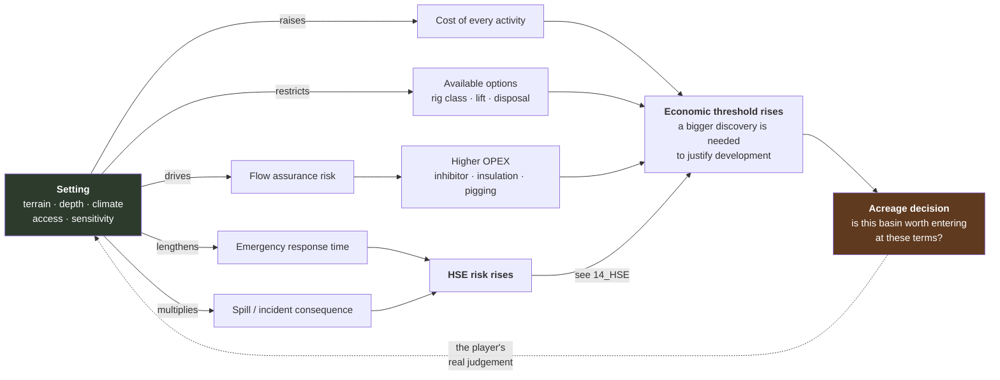

# 13 — Environment and Setting

**Status:** draft · **Date:** 2026-08-06

> **Affects:** nearly everything — the densest row in the matrix · **Affected by:** 01, 02, 03, 05, 10, 15, 17, 21
> *(strong couplings only — the full row is in [22](22_DESIGN_COHERENCE.md) §2)*

**The physical world the company operates in, and how it changes every stage of
exploration and production.** Not pollution — pollution is an *output*, covered
in [14_HSE](14_HSE.md). This document is about the environment as an **input**: a
constraint and a cost multiplier on everything the player does.

---

## 1. Why this is a foundation document, not flavour

The same reservoir, with identical rock and identical fluid, is a different
project in each of these places:

| Setting | What changes |
|---|---|
| West Texas plain | Road access, year-round drilling, cheap rigs, shallow water disposal |
| Amazon jungle | No roads, helicopter or river logistics, everything modularised, permits slow, spill consequence severe |
| North Sea, 120 m water | Platform, weather downtime, helicopter crew change, decommissioning bill in the hundreds of millions |
| Arctic tundra | **Four-month drilling window on ice roads**, permafrost foundations, freeze protection on everything |
| Deepwater, 2,000 m | Drillship day rates, subsea trees, flow assurance dominated by 4 °C seabed, no cheap intervention |
| Sahara | Heat derates every compressor, water is scarce and must be imported, remoteness dominates logistics |

**A game that ignores this makes every field the same field.** The environment is
what makes acreage selection a real judgement rather than a volume comparison,
and it is the cheapest source of variety the design has.

---

## 2. The environment model

Two layers: a **static setting** that describes a place, and a **dynamic
weather state** that changes each tick.

### 2.1 The environment applies the same three effect kinds as technology

Deliberately reusing the vocabulary from [07_TECHNOLOGY](07_TECHNOLOGY.md) §1:

| Effect kind | Environmental example |
|---|---|
| **Restricts an option** | No land rig offshore; no ice road in summer; no flaring near a settlement |
| **Moves an envelope** | Max wave height for a crane lift; max temperature for a compressor; max load for permafrost foundations |
| **Changes a model parameter** | Ambient temperature into the hydrate model; water depth into the drilling cost model; remoteness into the logistics model |

**Consequence:** environment and technology interact naturally, because they speak
the same language. Arctic operations technology *extends the envelope* the arctic
environment *restricted*. That is the whole progression arc for hostile settings,
and it needs no special mechanism.

**Combination rule** (pinned in [SDD-005](../sdd/SDD-005_CAPABILITIES_AND_EFFECTS.md)
§4.1): `effective = Min( Max(base, extensions…), restrictions… )` — extensions
raise what is possible, restrictions cap what is permitted, **restrictions
always win**. Winterisation raises arctic operability; the ice-road season still
caps it. Deterministic and order-free.

---

## 3. Effects, stage by stage

### 3.1 Exploration

| Setting factor | Effect |
|---|---|
| Terrain | Seismic acquisition method and cost: land vibroseis is cheap on plains, expensive in jungle (line cutting), very expensive in swamp/transition zone. Marine streamer is cheap per km² but needs a weather window |
| Water depth | Marine acquisition is efficient; node surveys in deep water cost more |
| Access | Crew and equipment mobilisation; helicopter-supported surveys are far costlier |
| Sensitivity | Permit duration and probability; some areas are simply closed |
| Weather | Marine surveys have **seasonal windows**; a missed window costs a year |

**Gameplay:** a prospect in a difficult setting needs a higher expected value to
justify the same survey. **The cheapest information is not always the best
value** — this is the first place environment enters a decision.

### 3.2 Drilling

| Setting factor | Effect |
|---|---|
| Terrain / water depth | **Determines the rig class**: land rig, barge, jack-up (to ~120 m), semi-submersible, drillship. Day rates differ by an order of magnitude |
| Access | Mobilisation cost and time; a remote land location may need a road built first |
| Ground | Permafrost needs insulated conductor and chilled mud; poor bearing needs piling |
| Climate | **Seasonal drilling windows** — arctic ice roads, monsoon shutdowns, hurricane season |
| Weather (dynamic) | Downtime: waiting on weather is a real and significant cost offshore |

**Gameplay:** the arctic four-month window is one of the best scheduling puzzles
available. Miss it and the well waits a year — and the licence clock does not.

### 3.3 Facilities

| Setting factor | Effect |
|---|---|
| Terrain / water depth | Onshore pad versus platform versus subsea versus floating production. Capital cost varies by more than an order of magnitude |
| Ground | Foundations, piling, subsidence monitoring |
| Climate — cold | Winterisation, freeze protection, heat tracing, enclosed modules |
| Climate — hot | **Compressors and turbines derate in heat**; cooling capacity must be oversized; vapour losses from tanks rise |
| Access | Modularisation for transport; module size limited by the route |
| Sensitivity | Footprint limits, noise limits, zero-discharge requirements, visual impact |
| Utilities | Grid connection versus self-generation; water source for injection |

**Design note:** heat derating is worth including specifically. It means a desert
field loses gas-handling capacity exactly in the hottest months, which is a real,
seasonal, non-obvious production constraint.

### 3.4 Flow assurance

**The environment *is* flow assurance.** Every risk in
[05_SIMULATION_MODELS](05_SIMULATION_MODELS.md) §8 is an ambient-condition
problem:

| Risk | Environmental driver |
|---|---|
| Hydrates | Low temperature + water + pressure. **Deepwater seabed is ~4 °C** — the worst case, always |
| Wax | Ambient below the wax appearance temperature; arctic and deepwater |
| Freezing | Cold climate; anything containing water |
| Corrosion | Marine salt air externally; produced water and acid gas internally |
| Ice scour | Arctic subsea pipelines must be buried below scour depth |

### 3.5 Transport

| Setting factor | Effect |
|---|---|
| Terrain | Pipeline cost per km varies severalfold: plains cheap, mountain and swamp expensive, river crossings costly |
| Water depth | Subsea pipelay cost and method |
| Climate | Insulation, burial depth, ice scour protection |
| Access | Where trucking is even possible; seasonal-only routes |
| Water depth at port | **Limits tanker size** — shallow ports mean smaller, less economic parcels |
| Weather (dynamic) | Berth downtime; a storm closes the port and tanks fill |

### 3.6 Operations

| Setting factor | Effect |
|---|---|
| Remoteness | Crew rotation cost, helicopter/vessel logistics, spares lead time, **emergency response time** |
| Climate | Weather standby; seasonal shutdowns; reduced productivity in extremes |
| Access | Intervention cost — a subsea well workover needs a vessel and costs many multiples of a land workover |

**Gameplay consequence worth stating:** in a remote or subsea setting,
**intervention is so expensive that the maintenance strategy must change.** Run-
to-failure is rational on a land well and irrational on a subsea well. That makes
[R18](../phases/R18_HAZARDS.md)'s strategy choice setting-dependent, which is
exactly right.

### 3.7 Abandonment

Offshore decommissioning is dramatically more expensive than onshore — platform
removal, subsea infrastructure recovery, well plugging from a vessel. Since the
provision accrues from first production ([08_ECONOMICS](08_ECONOMICS.md) §1),
**the setting is priced into every barrel from day one.**

---

## 4. Weather as a dynamic system

### 4.1 Model

A seasonal baseline per location plus stochastic variation, drawn from a
dedicated `weather` RNG stream.

| Component | Behaviour |
|---|---|
| **Seasonal cycle** | Deterministic from the climate profile and the date |
| **Stochastic variation** | Day-to-day/month-to-month noise around the baseline |
| **Extreme events** | Storms, hurricanes, freezes, floods — a hazard rate rising in the relevant season |
| **Persistence** | Weather is autocorrelated; a bad month tends to follow a bad month |

### 4.2 What weather does

| Effect | Mechanism |
|---|---|
| **Operational downtime** | Operations declare weather limits; exceeding them pauses them for a fraction of the tick |
| **Berth closure** | A closed port means no lifting — tanks fill and the field shuts in |
| **Production derating** | Ambient temperature into compression and cooling models |
| **Increased hazard** | Storms raise failure and spill hazard rates |
| **Access loss** | Ice roads melt; rivers become unnavigable; helicopters are grounded |

### 4.3 Why it must be dynamic and not just an average

An average removes the entire decision. **Weather is a game because it is
variable and forecastable-but-not-certain.** The player who builds two months of
tank storage instead of one is buying insurance against a storm season. If
weather were an average, that decision would be arithmetic; because it is a
distribution, it is judgement.

**Design decision: a forecast is available, with accuracy declining over the
horizon** — a short-range forecast is good, a seasonal outlook is a probability.
This makes weather plannable without making it solved.

---

## 5. Environment and the exploration/production feedback

**The point of the loop:** a hostile environment raises the minimum economic
field size. A 20 MMbbl discovery is a good business onshore Texas and worthless
in ultra-deepwater. **The player must know the setting before they bid**, and
that is a genuine, learnable, transferable skill.

---

## 6. Environment as content

> **Generated worlds derive their profiles.** In a generated world the
> per-location profile is a *view* computed from the surface world of
> [06](06_WORLD_AND_EXPLORATION.md) §5.1a (terrain, hydrology, settlements,
> networks, land status) — authored profiles exist only for hand-built
> scenarios. One source of truth per location, per law L5.

An `environment-profile` declares terrain, water depth, climate parameters,
access modes and their seasonal availability, ground conditions, sensitivity
designations and available utilities. Locations reference a profile; world
generation ([R15](../phases/R15_WORLD.md)) assigns them.

**Effects are declared, not coded.** A profile lists its restrictions, envelope
modifications and model-parameter changes, in the same vocabulary technology
uses. Adding "arctic offshore" is content.

---

## 7. Fidelity levels

| Level | Environment behaviour |
|---|---|
| Arcade | Setting applies cost multipliers and option restrictions; weather is a fixed availability percentage |
| **Standard** | Full setting effects; seasonal weather with stochastic variation and extreme events |
| Simulation | Adds forecast uncertainty, weather persistence, and per-operation weather limits at finer granularity |

The arcade level is a complete model, not a stub — cost multipliers and option
restrictions are legitimate and produce the main strategic effect.

---

## 8. Verification

| # | Test | Passes when |
|---|---|---|
| EN1 | Setting affects cost | The same development in six settings produces six materially different capital costs |
| EN2 | Option restriction | A land rig cannot be assigned offshore; the rejection names the reason |
| EN3 | Seasonal window | An arctic drilling operation can only be scheduled inside the ice-road window |
| EN4 | Missed window | A delayed arctic operation waits a full year, and the licence clock does not pause |
| EN5 | Heat derating | Compressor capacity falls in the hot season by the declared amount, reducing gas handling and therefore oil |
| EN6 | Deepwater hydrates | A 4 °C seabed raises hydrate risk; insulation or inhibitor mitigates it |
| EN7 | Storm closes berth | Tanks fill, wells shut in, production is deferred (links to SC8) |
| EN8 | Weather determinism | The same seed produces identical weather; the `weather` stream is independent of all others |
| EN9 | Forecast accuracy | Forecast error grows with horizon at the declared rate |
| EN10 | Remoteness and intervention | Subsea intervention cost is a large multiple of land; the optimal maintenance strategy flips accordingly |
| EN11 | Abandonment provision | Offshore provisions per barrel are materially higher than onshore from first production |
| EN12 | Content-only setting | A new environment profile added purely as content works end to end |

---

## 9. Open decisions

| # | Decision | Options | Recommendation |
|---|---|---|---|
| EV1 | Weather granularity | (a) one weather state per tick, (b) a within-tick profile (days lost) | **(b)** — at a monthly tick, "eleven days lost to weather" is the meaningful quantity, and it composes with the fractional-duration model in [15_TIME](15_TIME_AND_EXECUTION.md) |
| EV2 | Offshore at v1 | (a) onshore only, (b) onshore + shallow offshore, (c) all | **(b)** — shallow offshore adds platforms and weather without subsea, vessels and floating production. It is where most of the variety is per unit of work |
| EV3 | Climate change over a long campaign | (a) static climate, (b) drifting baselines over decades | **(a) first** — (b) is thematically strong for a 1950→2030 campaign and can be added as a content-driven baseline drift later |
| EV4 | Environment reveals | (a) setting fully visible before bidding, (b) partially unknown | **(a)** — the subsurface is the uncertainty game; making the *surface* uncertain too would be noise, not depth |
| EV5 | Seismicity / induced seismicity from injection | (a) omitted, (b) modelled | **(b) as a hazard in [14_HSE](14_HSE.md)** — it is topical, real, and directly caused by a player decision (disposal volumes) |
