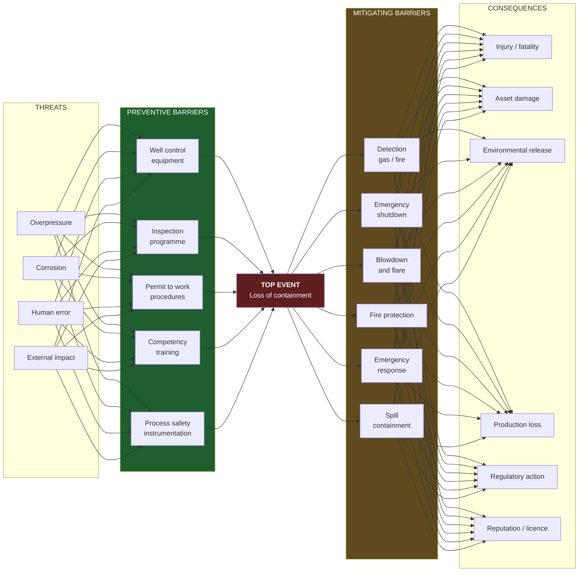

# 14 — Health, Safety and Environment

**Status:** draft · **Date:** 2026-08-06

> **Affects:** 01, 02, 03, 05, 07, 08, 10, 11, 12, 13, 16, 17, 18, 19, 20, 21, phases · **Affected by:** 01, 02, 03, 13, 16, 17, 21
> *(strong couplings only — the full row is in [22](22_DESIGN_COHERENCE.md) §2)*

HSE as a discipline the player practises, not a penalty they absorb.

---

## 1. The design problem

Most games model safety as a random bad event with a fine attached. That is
wrong in three specific ways, and each has a fix:

| Wrong | Why it fails | The fix |
|---|---|---|
| Incidents are random | The player has no agency, so it reads as punishment | **Barrier model** — incidents require multiple defences to fail, and the player buys and maintains the defences |
| Only the outcome is visible | Nothing to manage until it is too late | **Leading indicators** — barrier degradation, overdue maintenance and near-misses are visible *before* the incident |
| One "safety" number | Reality has two, and the easy one is not the one that kills you | **Process safety and personal safety, tracked separately** |

That third point is the most important thing in this document, and it is drawn
directly from how the industry actually failed. A company can have an excellent
personal-injury record — hard hats, handrails, slips and trips — while its
process-safety barriers rot. The major accidents of the last twenty years
happened at companies with award-winning personal-safety statistics.

> **Design intent: the player should be able to make their injury rate look
> excellent while quietly building toward a catastrophe — and the game should
> show them the leading indicators that say so, if they look.**

---

## 2. The barrier model

Industry practice, adopted directly: the **bow-tie**.

### 2.1 How it works mechanically

- Each **barrier** has a strength, degrades over time and under service, and is
  restored by inspection, testing, maintenance or training — each an
  `IOperation` with a cost.
- A **threat** materialises at a rate driven by conditions (pressure, corrosion
  severity, workload, weather, operation type).
- A threat becomes a **top event** only if it passes the preventive barriers —
  the probability is the product of the barriers' failure probabilities.
- Once a top event occurs, the **mitigating barriers** determine severity.

**The consequence of this design:** a well-maintained operation almost never has
a serious incident, and a neglected one eventually has a severe one. **The
distribution has a fat tail that the player controls.** That is both realistic and
good game design — it makes safety investment feel like insurance, which is
exactly what it is.

### 2.2 Barriers degrade, and degradation is visible

Barrier status is a **leading indicator**. The player can see: overdue
inspections, failed function tests, deferred maintenance backlog, expired
competency, temporary equipment in service, overridden alarms and open safety
findings.

**Every one of those is a real leading indicator used in industry**, and every
one is a thing the player can fix before anything happens.

---

## 3. Process safety versus personal safety

| | Personal safety | Process safety |
|---|---|---|
| **Concerns** | Slips, falls, vehicle accidents, manual handling, dropped objects | Loss of containment: blowout, fire, explosion, toxic release |
| **Frequency** | Common, low severity | Rare, catastrophic |
| **Leading indicators** | Observations, near-misses, training compliance | Barrier health, integrity backlog, overdue tests, safety-critical element status |
| **Improved by** | Culture, training, PPE, procedures — **cheap** | Design, inspection, maintenance, competency — **expensive** |
| **What it kills** | Individuals | Everyone, plus the company |

**Two separate indicators, tracked and displayed separately.** The cheap one is
easy to make look good. The expensive one is what ends companies.

**Design intent made explicit:** a player optimising the visible, cheap metric
while the expensive one degrades should be a *survivable and instructive*
mistake most of the time, and occasionally a company-ending one. The leading
indicators are always there to be read.

---

## 4. Health

| Hazard | Driver | Consequence |
|---|---|---|
| H₂S exposure | Sour operations | Acute — fatal at low concentration. Requires detection, breathing apparatus, competency |
| Chemical exposure | Treating chemicals, mud additives | Chronic health cost, liability |
| Noise | Compressors, turbines, flares | Chronic; hearing protection programmes |
| Fatigue | Long rotations, remote postings, extended hours | **Raises human-error threat rate across every operation** |
| Medical response | Remoteness | Time to definitive care multiplies the consequence of any injury |
| Naturally occurring radioactive material | Scale in production equipment | Waste handling obligation |

**Fatigue is the one with the most gameplay value:** it links crew management
(R12.7) directly to incident probability. Running a lean crew hard is cheaper and
raises the human-error threat rate across the whole operation. That is a real
trade-off with a real mechanism.

---

## 5. Environment (as output)

### 5.1 Emissions

| Emission | Source | Consequence |
|---|---|---|
| **CO₂** | Fuel gas, flaring, power generation | Carbon price/tax; ESG rating |
| **Methane** | Venting, fugitive leaks, incomplete flaring | **Far higher warming potential**; increasingly regulated; a leak is lost product *and* a penalty |
| Flaring volume | Associated gas with no outlet | Caps, penalties, and a production constraint ([R9](../phases/R9_GAS.md) §2.2) |
| SOx / NOx | Combustion, sour operations | Local air quality limits |
| VOC | Tank vapours, loading | Local limits; recoverable revenue via vapour recovery |

**Methane intensity deserves particular attention** because it is the one where
the environmental and economic incentives align perfectly: a leak is lost sales
gas. Leak detection and repair pays for itself, and the player should be able to
discover that.

### 5.2 Discharges and waste

Produced water (volume, oil content, disposal route), drilling waste (cuttings,
mud), chemicals, and NORM. Each has a compliant route with a cost and a
non-compliant route with a liability.

### 5.3 Spills

| Class | Typical cause | Consequence |
|---|---|---|
| Minor | Small equipment leak | Cleanup cost, reportable |
| Moderate | Tank overflow, flowline leak | Cleanup, fine, remediation obligation |
| Major | Pipeline rupture, well control incident | Large cleanup, **persistent record**, licence risk, possible operations suspension |

**Consequence severity is multiplied by environmental sensitivity**
([13_ENVIRONMENT](13_ENVIRONMENT.md) §2): the same volume released is a modest
cost in a remote desert and a company-threatening event near a fishery or a
settlement. **This is what makes sensitivity a real factor in acreage
selection**, rather than a label.

### 5.4 Land use and restoration

Footprint, access roads, and the restoration obligation at abandonment — which
accrues from first production alongside the plugging cost.

### 5.5 Induced seismicity

Per open decision EV5. High-volume water disposal into certain formations can
trigger felt seismicity. It is topical, real, and **directly caused by a player
decision** — disposal volume and location. Consequences: regulatory volume
limits, forced well shut-in, community opposition, liability.

Good design because the mitigation is genuinely interesting: reduce volumes,
find a different disposal formation, or reduce water production at source.

---

## 6. Social licence to operate

A separate standing from regulatory compliance. A company can be fully compliant
and still lose the ability to operate.

| Driver | Effect |
|---|---|
| Incident record, especially visible ones | Falls |
| Local employment and procurement | Rises |
| Community impact — noise, traffic, flaring, land access | Falls |
| Transparency and remediation performance | Rises |

**Effects:** permit approval time and probability; access negotiations; licence
round eligibility and competitiveness; workforce availability; and — in the
extreme — blockades and forced suspension.

*Rationale for including it:* it converts "being a good operator" from a moral
gesture into an operational asset with measurable value, which is both truer and
better gameplay than a virtue meter.

---

## 7. ESG and the cost of capital

Emissions intensity, methane intensity, flaring intensity, safety record and
spill record aggregate into an ESG standing that affects **the cost of
borrowing** and access to certain capital.

This closes a loop that matters: a poor environmental record raises the cost of
every future project, which reduces the capital available for the projects that
would improve the record. **A slow-acting reinforcing loop the player can fall
into and must deliberately climb out of** — documented in
[17_CROSS_IMPACT_MATRIX](17_CROSS_IMPACT_MATRIX.md) §4.

---

## 8. Incident severity and response

| Tier | Example | Immediate | Lasting |
|---|---|---|---|
| **Near miss** | Alarm on a gas detector | None | **Leading indicator — a warning that is free to heed** |
| **Minor** | Small leak, first-aid injury | Small cost | Recorded |
| **Serious** | Lost-time injury, moderate spill, equipment fire | Downtime, repair, investigation | Regulatory attention; higher inspection rate |
| **Major** | Fatality, large spill, major fire | Extended shutdown, large cost, mandatory investigation | Prosecution, licence conditions, ESG damage |
| **Catastrophic** | Blowout, multiple fatalities, major release | Field suspended, emergency response, enormous cost | Possible loss of licence; company-threatening |

**Response is an `IOperation`**: emergency response, investigation, remediation,
regulatory engagement — each with a duration and cost, and each producing
findings that must be closed before operations resume.

**Near-misses are the most valuable tier in the design.** They cost almost
nothing, they are generated by the same barrier model, and they tell an attentive
player exactly where their barriers are weakening. A player who investigates near
misses avoids the tiers above; one who ignores them does not.

---

## 9. HSE as content

`hse-regime` per jurisdiction: inspection frequency and rigour, penalty
schedules, reporting thresholds, emissions limits and carbon price, flaring
rules, discharge standards, abandonment requirements, prosecution likelihood.

`barrier` definitions: what each protects against, its degradation profile, its
test/inspection requirement, its cost.

**A strict jurisdiction with generous fiscal terms versus a permissive one with
harsh terms is a real strategic choice** — and it is authored entirely in content.

---

## 10. Verification

| # | Test | Passes when |
|---|---|---|
| HS1 | Barrier model | Incident probability equals the product of barrier failure probabilities; a fully maintained set makes serious incidents rare |
| HS2 | Neglect consequence | Sustained deferred maintenance produces a rising incident rate and eventually a severe event |
| HS3 | Leading indicators | Barrier degradation is visible before any incident; every serious incident is preceded by detectable indicators |
| HS4 | Two safety metrics | Personal and process safety move independently; a scripted "cheap safety" strategy improves one and not the other |
| HS5 | Fatigue | Lean crewing raises the human-error threat rate by the declared amount |
| HS6 | Sensitivity multiplier | An identical spill volume produces materially different consequences in two settings |
| HS7 | Methane economics | Leak detection and repair pays for itself at the declared leak rate and gas price |
| HS8 | Flaring cap | Links to R9-V8 — a cap limits oil production |
| HS9 | Induced seismicity | High disposal volumes raise seismicity risk; volume limits or an alternative formation mitigate it |
| HS10 | Social licence | Community impact reduces permit approval probability and duration measurably |
| HS11 | ESG and capital | A poor record raises the cost of borrowing by the declared amount |
| HS12 | Response operations | Every incident tier generates the correct response operations, and findings gate restart |
| HS13 | Determinism | The same seed produces identical incident sequences; every draw is audited |
| HS14 | Near-miss signal | Near-miss frequency correlates with subsequent serious-incident probability |

**HS3 is the phase's most important test.** If a serious incident can occur with
no prior detectable indicator, the model has become random punishment and the
design intent is lost.

---

## 11. Open decisions

| # | Decision | Options | Recommendation |
|---|---|---|---|
| HS-D1 | Fatalities | (a) modelled explicitly, (b) abstracted as "serious injury" | **(a)** — treating it seriously is more respectful of the subject than eliding it, and it is what makes process safety weigh properly. Presented soberly, never as a score |
| HS-D2 | Barrier granularity | (a) ~8 barrier types, (b) per-equipment barriers | **(a)** — enough to make the model real, few enough to manage |
| HS-D3 | Carbon pricing | (a) jurisdiction content only, (b) a global trajectory over a long campaign | **(b)** — a rising carbon price across a 1950→2030 campaign is a strong and truthful long-arc pressure |
| HS-D4 | Social licence | (a) included, (b) deferred | **(a)** — it is cheap and it makes environmental behaviour economically rational rather than moral |
| HS-D5 | HSE fidelity levels | (a) fixed, (b) selectable including off | **(b)** — consistent with the fidelity dial; "off" is a legitimate arcade choice |
