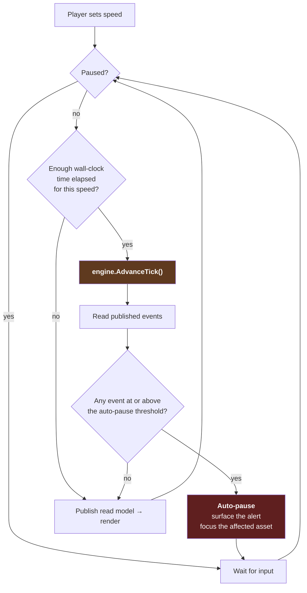

# 15 — Time and Execution Model

**Status:** draft · **Date:** 2026-08-06

> **Affects:** 03, 04, 09, 11, 12, 13, 16, 17, 19, 21, phases · **Affected by:** 03, 04, 13, 16, 17, 21
> *(strong couplings only — the full row is in [22](22_DESIGN_COHERENCE.md) §2)*

**How the simulation runs.** This supersedes open decision D1, which left the
question unanswered.

---

## 1. The answer, stated first

> **The engine is turn-based. The game is real-time-with-pause.**

These are not in conflict — they are two different layers:

| Layer | Model |
|---|---|
| **Engine** | Discrete ticks. One month per tick. `AdvanceTick()` is the only way time moves. Fully deterministic. Nothing is asynchronous. |
| **Host** | A pacing loop that calls `AdvanceTick()` at a player-controlled rate — paused, or 1×/2×/4×/8× — and **stops automatically when something needs attention.** |

**The engine never knows which mode it is in.** A headless test, a CI scenario
run and a player at 4× speed all drive the identical code path. This is what
keeps determinism, testability and replay intact.

---

## 2. Why not pure turn-based

Turn-based ("press End Turn") is right when **every turn requires a decision**.
This game is not that game.

In a 40-year career — roughly 480 ticks — a realistic decision profile looks
like:

| Period | Ticks | Ticks needing a decision |
|---|---|---|
| Exploration | ~60 | ~20 |
| Appraisal & sanction | ~24 | ~10 |
| Development | ~36 | ~25 |
| Plateau | ~120 | ~15 |
| Decline | ~180 | ~40 |
| Abandonment | ~24 | ~10 |
| **Total** | **~444** | **~120** |

**Roughly three-quarters of turns need nothing from the player.** A plateau field
producing steadily for ten years is not a sequence of decisions; it is a period
you want to pass through, watching for the moment it stops being steady.

Forcing an End Turn press on all 444 makes the good decisions rarer by
surrounding them with 320 empty ones. **Real-time-with-pause inverts this: time
flows when nothing needs you, and stops when something does.**

---

## 3. Why not pure real-time

Because the underlying physics is a monthly steady-state solve
([04](04_MATERIAL_AND_FLOW.md) §10 F3). A continuous simulation would require
either sub-monthly solving — expensive, and no more truthful, since a monthly
average is the honest resolution for reservoir behaviour — or interpolation
between monthly states, which would be a presentational lie.

**Discrete ticks with continuous presentation is the honest arrangement**: the
numbers are computed at the resolution they are meaningful at, and the *display*
is smooth.

---

## 4. The pacing loop



**The auto-pause threshold is player-configurable per event category** — see
[16_EVENT_MATRIX](16_EVENT_MATRIX.md) §5. A player deep in a development phase
may want to stop on every operation completion; one managing a mature portfolio
may want to stop only on incidents and economic-limit warnings.

### 4.1 What the pause is *for*

Auto-pause is not a notification system. It is how the player is caught **while
entering** a downward feedback loop rather than on arrival at its consequence.

The couplings that matter most take years to land
([21_INTEGRATION](21_INTEGRATION.md) §2), and a player at 8× speed passes through
years in minutes. Without pause-on-loop-entry, the slow loops — ESG, liquidation,
the maintenance spiral — would be undetectable at the speeds the game is designed
to be played at.

**That is the argument for real-time-with-pause and event severity being one
design, not two.** Speed is only safe because the alert system knows what to stop
for. The entry-event mapping is in [21_INTEGRATION](21_INTEGRATION.md) §6.

---

## 5. Time controls

| Control | Behaviour |
|---|---|
| **Pause** | The default state. Time does not advance; commands may still be issued |
| **Speed 1× / 2× / 4× / 8×** | Wall-clock seconds per tick |
| **Step one month** | A single `AdvanceTick()` — the turn-based mode, for players who want it |
| **Advance to next decision** | Runs until any event at or above the alert threshold, or a declared horizon |
| **Advance N months** | Runs N ticks or until an auto-pause |
| **Advance until condition** | Runs until a named condition holds: an operation completes, a well reaches its economic limit, cash falls below a threshold, a licence deadline approaches |

**"Advance until condition" is the most valuable control for the late game.** A
mature portfolio in a stable decade should be skippable in one action, and the
condition system is what makes that safe — you are not skipping *past* something,
you are skipping *to* the next thing that matters.

---

## 6. Sub-tick resolution

A month is coarse for some things. Several activities have durations measured in
days:

| Activity | Typical duration |
|---|---|
| Workover | 5–15 days |
| Equipment failure and repair | 2–20 days |
| Weather downtime | 0–15 days per month |
| Cargo loading | 1–3 days |
| Well test | 3–10 days |
| Facility turnaround | 10–30 days |

### 6.1 The fractional-duration model

**Decision: events carry a fraction-of-tick position and duration, and their
effects are applied proportionally within the tick.**

Worked example — a compressor fails 40% of the way into the month and takes 12
days to repair:

```
Failure at    t = 0.40 of the tick
Repair takes  12 / 30 = 0.40 of the tick
Available:    0.40 (before) + 0.20 (after) = 0.60 of the tick

⇒ The flow solve runs twice for this tick:
     segment A — 0.60 of the month, compressor available
     segment B — 0.40 of the month, compressor absent
   Production is the duration-weighted sum.
```

**Decision: within-tick segmentation, not averaging.** Averaging a compressor's
availability to 60% would produce a *different and wrong* answer, because the
network solve is non-linear — a partly-available compressor is not the same as an
absent one for 40% of the time. Segmenting is exact.

**Segment count is bounded** (recommend 4 per tick). Events are grouped into
segment boundaries; more than the budget allows are merged to the nearest
boundary, and **the merge is audited** so the approximation is never invisible.

### 6.2 What this buys

- Weather downtime is expressible as "eleven days lost", matching
  [13_ENVIRONMENT](13_ENVIRONMENT.md) open decision EV1
- A short workover does not cost a whole month of production
- Failure timing within a month matters, so response speed matters
- Cargo loading windows and berth occupancy work at their natural resolution

---

## 7. Operations spanning ticks

An `IOperation` has a duration in days, which may be a fraction of a tick or many
ticks. Each tick it advances by the elapsed fraction, accruing cost
proportionally ([R12](../phases/R12_OPERATIONS.md) §2.2), and completes when
progress reaches its duration.

**Progress can be interrupted**: weather standby, resource loss, a suspension
order. Interrupted time does not accrue progress but may still accrue cost — a
rig on standby is still on day rate, which is a real and painful cost the player
should feel.

---

## 8. Time and determinism

| Rule | Reason |
|---|---|
| Wall-clock time never enters simulation logic | Determinism ([11](11_PERSISTENCE.md) §3) |
| Tick number is the only authoritative time | One clock, no drift |
| Speed setting is a host concern the engine never sees | The same tick sequence regardless of pacing |
| Sub-tick positions are deterministic, drawn from a seeded stream | Reproducible failure timing |
| The auto-pause threshold does not affect simulation | Pausing changes what the player sees, never what happened |

**Consequence worth stating plainly:** a game played at 8× speed and the same
game played step-by-step produce **identical** histories. Speed is a viewing
choice, never a difficulty or outcome choice.

---

## 9. Calendar

Months, quarters and years are meaningful units in this domain and are modelled:

| Period | What happens |
|---|---|
| **Tick (month)** | The simulation step. Production, costs, operations |
| **Quarter** | Financial reporting; reserves recomputation ([R13](../phases/R13_ECONOMICS.md) §6 risk note) |
| **Year** | Annual accounts, tax, reserve replacement ratio, licence anniversaries, work-commitment deadlines |
| **Season** | Weather patterns, access windows ([13](13_ENVIRONMENT.md) §4) |

Real dates are used (year, month) — with **30/360 day-count arithmetic** (every
month is 30 days, the industry's own convention; pinned in
[SDD-001](../sdd/SDD-001_KERNEL_CONTRACTS.md) §3, because the /30ths segment
grid must be exact for every tick) — because era-gated technology
([07](07_TECHNOLOGY.md) open decision TD1), a carbon-price trajectory
([14](14_HSE.md) HS-D3) and historical price replay all need them.

---

## 10. Performance budget

| Constraint | Target |
|---|---|
| Single tick, mid-game (~200 flow elements, 4 segments) | **< 20 ms** |
| Single tick, large portfolio (~800 elements) | < 80 ms |
| 8× speed | One tick per ~250 ms wall-clock — comfortable headroom |
| SC1 full lifecycle (~480 ticks) | < 30 s in CI |
| Read-model snapshot | < 5 ms |

Measured from [R4](../phases/R4_FLOW_SOLVER.md) onward with a regression
threshold, so a slow change fails a build rather than being discovered late.

**Headroom argument:** at monthly ticks, even 8× speed leaves a quarter-second per
tick. The budget above is roughly an order of magnitude inside that — which is
what makes the "advance until condition" control able to burn through years of
game time in a moment.

---

## 11. Verification

| # | Test | Passes when |
|---|---|---|
| TM1 | Speed invariance | The same seed and command script produce identical state digests at every speed setting and in step mode |
| TM2 | Sub-tick segmentation | A mid-month failure produces the exact duration-weighted production, verified against a hand calculation |
| TM3 | Segmentation ≠ averaging | A case is demonstrated where averaging availability gives a materially different (wrong) answer |
| TM4 | Segment budget | Exceeding the segment budget merges to boundaries **and audits the merge** |
| TM5 | Operation progress | Fractional and multi-tick operations complete at the correct tick and fraction |
| TM6 | Standby cost | An interrupted operation accrues cost without progress |
| TM7 | Advance-until-condition | Stops at the first tick satisfying the condition, never past it |
| TM8 | Auto-pause | Fires for events at or above the configured threshold, and never alters simulation state |
| TM9 | No wall-clock | Architecture test: no simulation assembly references a wall-clock API |
| TM10 | Performance | Tick times stay within budget; recorded with a regression threshold |
| TM11 | Calendar | Quarterly and annual events fire on the correct ticks across year and era boundaries under the 30/360 convention (leap years deliberately do not exist — SDD-001 §3) |

---

## 12. Open decisions

| # | Decision | Options | Recommendation |
|---|---|---|---|
| TM-D1 | Tick length | (a) monthly, (b) weekly, (c) variable by phase | **(a) monthly** — matches industry reporting, keeps a 40-year career at ~480 ticks, and sub-tick segmentation covers everything shorter |
| TM-D2 | Segment budget | (a) 2, (b) 4, (c) unbounded | **(b) 4** — covers the realistic case of a couple of events per month; unbounded invites pathological ticks |
| TM-D3 | Turn-based option | (a) real-time only, (b) both | **(b)** — "step one month" costs nothing, since the engine is turn-based anyway, and some players will prefer it |
| TM-D4 | Auto-pause defaults | (a) conservative — stop on much, (b) permissive | **(a)** — a new player should not sail past a crisis; experienced players relax it. Configurable per category |
| TM-D5 | Real dates versus abstract "Year 1" | (a) real dates, (b) abstract | **(a)** — needed for era gating, carbon trajectories and historical price replay |
