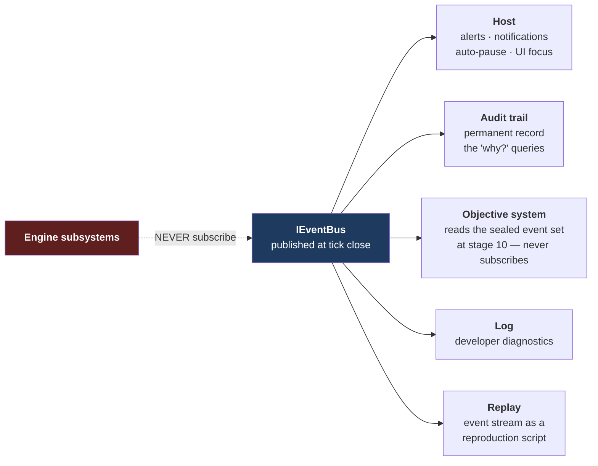

# 16 — Event Matrix

**Status:** draft · **Date:** 2026-08-06

> **Affects:** 03, 09, 12, 15, 18, 19, 20, 21, phases · **Affected by:** 03, 09, 14, 15, 18, 21
> *(strong couplings only — the full row is in [22](22_DESIGN_COHERENCE.md) §2)*

Every event the engine raises: what triggers it, what it carries, how loudly it
announces itself, and who reacts.

---

## 1. Two things called "event", kept apart

| | **Occurrence** | **Notification** |
|---|---|---|
| What it is | A thing that happens in the simulation | A message published about it |
| Where it lives | Inside a tick stage, as a state change | On `IEventBus`, at tick close |
| Who consumes it | Nothing — the state change *is* the effect | The host, the audit trail, the objective system |
| Carries control flow? | — | **Never** |

**The rule from [03_ARCHITECTURE](03_ARCHITECTURE.md) §4 restated:** no engine
code subscribes to `IEventBus` to decide what to do. The tick order is explicit;
if a subsystem needs to react to something, it reads state in its own tick stage.
Notifications flow outward only.

*Why this matters:* order-dependent behaviour hidden in event subscriptions is one
of the most expensive bug classes in simulation engines, because the outcome of a
tick depends on subscription order, which nothing declares and nothing tests.

**Exception, declared:** the objective system ([18_GAME_MODES](18_GAME_MODES.md))
evaluates against events, but it does so at **tick stage 12**, reading the sealed
event set for the tick — not by subscribing. It cannot influence the simulation,
only observe it.

---

### 1b. The two pipelines — how "everything posts centrally" actually works

The owner's instinct — *one pipeline all modules post to, processed centrally* —
is exactly the architecture, split into its two safe halves:

| Pipeline | Direction | Posted by | Processed by | Carries |
|---|---|---|---|---|
| **Command bus** | inbound | player, Advisor, scenario runner | the engine, at stage 1, in order | *intent* — everything that changes state enters here |
| **Event bus** | outbound | every module, at its stage | host (alerts/pause), audit, objectives (stage 12, sealed), replay | *announcements* — everything that happened leaves here |

What is deliberately **not** built is the third variant — modules *reacting* to
each other's events mid-tick. Module-to-module causation flows through **state
read in explicit stage order** (03 §6): HSE reads the availability state at
stage 9; it does not subscribe to `equipment.failed`. That single restriction is
what buys deterministic ordering, a visible dependency graph, no mid-tick
cascade storms, and replay — the subscription-order bug class of the
predecessor engine is unrepresentable because `Subscribe()` does not exist.

## 2. Event anatomy

| Field | Purpose |
|---|---|
| **Id** | Stable, typed identifier |
| **Category** | §3 |
| **Stage** | The tick stage that raised it — fixes what it could have read ([21](21_INTEGRATION.md) §4) |
| **Tick** and **sub-tick position** | When, to the resolution of [15_TIME](15_TIME_AND_EXECUTION.md) §6 |
| **Subject** | The entity id it concerns |
| **Payload** | Typed data — never a formatted string |
| **Severity** | §5 |
| **Cause** | The audit reference explaining *why*. **Required for `C` and `D`** ([21](21_INTEGRATION.md) rule IR6) |
| **Loop role** | Whether this is a loop **entry**, mid-loop or consequence event ([21](21_INTEGRATION.md) §6) |
| **Segment boundary** | Whether it cuts the tick — true only if it changes network topology or constraints ([21](21_INTEGRATION.md) §5) |
| **Player action** | The commands, if any, that respond to it |

**Two of these fields exist only because of the integration analysis.** *Loop
role* is what lets severity be assigned by position in a feedback loop rather
than by consequence magnitude — so the player is stopped while they can still
act. *Segment boundary* is what connects the event stream to the solver's
within-tick resolution.

**Payloads are typed, never strings.** The host formats; the engine states facts.
This keeps localisation, unit display and machine-consumption all possible from
one source.

---

## 3. Category × source × consumer

| Category | Raised by | Typical trigger | Audit category | Objective-relevant |
|---|---|---|---|---|
| **Time** | Kernel | Tick, quarter, year boundary | State transition | ✅ deadlines |
| **Command** | Command bus | Accepted / rejected | Command | ✅ |
| **Operation** | Operations | Scheduled, started, progressed, interrupted, completed, failed | State transition | ✅ |
| **Discovery** | Information | Well result, survey complete, belief updated | Belief update | ✅ |
| **Production** | Flow / Custody | Rate change, constraint bound, shut-in, restart, custody transfer | Constraint / financial | ✅ |
| **Reservoir** | Subsurface | Bubble point crossed, breakthrough, compartment inferred | State transition | ✅ |
| **Equipment** | Operations | Condition threshold, failure, repair, availability change | State transition | — |
| **HSE** | HSE | Near miss, incident, barrier degraded, inspection, finding, emissions threshold | Fault / state transition | ✅ |
| **Environment** | Environment | Season change, storm, access window open/close, forecast update | State transition | — |
| **Regulatory** | Company | Inspection, violation, penalty, order, permit decision | Financial / state | ✅ |
| **Financial** | Economics | Cash threshold, covenant, funding, insolvency risk, economic limit | Financial | ✅ |
| **Market** | Economics | Price move, shock, contract event, delivery obligation | Financial | ✅ |
| **Licence** | Company | Round announced, bid result, commitment due, expiry, relinquishment | State transition | ✅ |
| **Technology** | Company | Available, acquired, R&D outcome, era change | State transition | ✅ |
| **Objective** | Objectives | Progress, satisfied, failed, expired | State transition | — |
| **Diagnostic** | Fault policy | Content, composition, model, invariant faults | Fault | — |

---

## 4. The matrix

Severity legend: `I` info · `N` notice · `W` warning · `C` critical ·
`D` blocking decision. **⏸** = auto-pauses at the default threshold.

### 4.1 Operations and wells

| Event | Trigger | Payload | Sev | ⏸ | Player response |
|---|---|---|---|---|---|
| `operation.scheduled` | Command accepted | Operation, start, duration, cost | I | | — |
| `operation.started` | Resources committed | Operation, resources | I | | — |
| `operation.interrupted` | Weather, resource loss, order | Operation, cause, expected resumption | W | ⏸ | Reallocate, accept standby cost |
| `operation.completed` | Progress reached duration | Operation, outcome grade, actual cost | N | | Follow-on decision |
| `operation.failed` | Terminal failure | Operation, cause, sunk cost | C | ⏸ | Retry, abandon, redesign |
| `well.spudded` | Drilling started | Well, target, rig | I | | — |
| `well.shows` | Hydrocarbon indications while drilling | Well, depth, strength | N | ⏸ | Continue, core, test |
| `well.result` | Logs run | Well, discovery/dry, **failed element if dry** | **D** | ⏸ | Appraise, sidetrack, abandon, re-rank play |
| `well.tested` | Test complete | Well, rate, fluids, permeability, skin | **D** | ⏸ | Complete, stimulate, abandon |
| `well.online` | First production | Well, initial rate | N | | — |
| `well.diedNaturally` | IPR ∩ VLP empty | Well, last rate, cause | C | ⏸ | Install lift, shut in, abandon |
| `well.shutIn` | Constraint, economics, order | Well, cause, deferred rate | W | ⏸ | Debottleneck, accept |
| `well.economicLimit` | Incremental revenue < cost | Well, margin, projection | W | ⏸ | Intervene, abandon, accept |

**`well.result` carries the failed petroleum-system element** when dry — the
single most important payload field in the whole matrix
([R14](../phases/R14_INFORMATION.md) §2.5). Without it, a dry hole teaches
nothing.

### 4.2 Production and flow

| Event | Trigger | Payload | Sev | ⏸ | Player response |
|---|---|---|---|---|---|
| `flow.constraintBound` | An element limits a branch | Element, constraint, deferred volume | N | | Debottleneck |
| `flow.constraintChanged` | The binding element changes | Old, new, deltas | W | ⏸ | Re-plan capital |
| `flow.deferralThreshold` | Deferred volume exceeds a set fraction | Field, deferred, top causes | W | ⏸ | Prioritise debottlenecking |
| `flow.specRejected` | Stream fails a specification | Point, parameter, value, limit, rejected mass | C | ⏸ | Build/repair treating |
| `flow.flared` | Gas sent to flare | Volume, cause, emissions, penalty | W | | Build gas handling, re-inject |
| `flow.forcedShutIn` | Shut-in ladder engaged ([04](04_MATERIAL_AND_FLOW.md) §4.0b) | Branch, residual, deferred volume | W | ⏸ | Review the branch; simplify or repair the network |
| `flow.solverFault` | The same branch forced shut on consecutive ticks | Full diagnostic, branch history | C | ⏸ | Shut in or rebuild the branch; report a bug — this pattern should not occur |
| `reservoir.bubblePoint` | Pressure crosses `Pb` | Compartment, pressure | W | ⏸ | Expect GOR rise; plan gas handling |
| `reservoir.waterBreakthrough` | Water arrives at a perforation | Well, perforation, water cut | W | ⏸ | Zonal shutoff, water handling |
| `reservoir.compartmentInferred` | Data reveals compartmentalisation | Reservoir, evidence | **D** | ⏸ | Re-plan development |
| `tank.high` / `tank.full` | Ullage threshold / exhausted | Tank, level, hours to full | W / C | ⏸ | Schedule lifting, throttle |
| `custody.transferred` | Metered on-spec delivery | Point, volume, quality, value | I | | — |

### 4.3 HSE and environment

| Event | Trigger | Payload | Sev | ⏸ | Player response |
|---|---|---|---|---|---|
| `hse.barrierDegraded` | Barrier strength below threshold | Barrier, asset, strength, overdue work | W | ⏸ | **Schedule the work — this is the free warning** |
| `hse.nearMiss` | Threat passes some but not all barriers | Threat, barriers that held/failed | W | ⏸ | Investigate, restore barriers |
| `hse.incident` | Top event occurs | Tier, consequences, cause chain | C | ⏸ | Emergency response, investigation |
| `hse.spill` | Loss of containment to environment | Volume, material, sensitivity, liability | C | ⏸ | Response, remediation |
| `hse.emissionsThreshold` | Cap fraction reached | Type, cumulative, cap, projection | W | ⏸ | Reduce, buy allowance, curtail |
| `hse.inspection` | Regulator visit | Findings, severity | N | ⏸ | Close findings before deadline |
| `hse.order` | Improvement or shutdown order | Scope, deadline, consequence | **D** | ⏸ | Comply — operations may be suspended |
| `hse.socialLicence` | Standing crosses a threshold | Level, drivers | W | ⏸ | Community investment, impact reduction |
| `env.seasonChange` | Calendar | Season, access windows opening/closing | N | ⏸ | Schedule seasonal operations |
| `env.accessWindowClosing` | Window ends within lead time | Window, days remaining, affected ops | **D** | ⏸ | Commit or wait a year |
| `env.storm` | Extreme weather | Severity, duration, affected assets | W | ⏸ | Secure, accept downtime |
| `env.forecastUpdate` | New forecast | Horizon, conditions, confidence | I | | Plan marine operations |

**`hse.barrierDegraded` is the most valuable event in the matrix.** It is the
leading indicator that makes HSE a management discipline rather than a lottery
([14_HSE](14_HSE.md) §2.2). It must be prominent and it must arrive early.

### 4.4 Company, market and licence

| Event | Trigger | Payload | Sev | ⏸ | Player response |
|---|---|---|---|---|---|
| `licence.roundAnnounced` | Calendar | Blocks, terms, deadline | **D** | ⏸ | Screen and bid |
| `licence.bidResult` | Round closes | Won/lost, price, rival bids where public | **D** | ⏸ | Plan or re-plan |
| `licence.commitmentDue` | Deadline within lead time | Licence, obligation, progress, bond at risk | **D** | ⏸ | Execute or forfeit |
| `licence.expiring` | Term ending | Licence, date, retained acreage options | **D** | ⏸ | Relinquish, extend, develop |
| `market.priceMove` | Threshold crossed | Benchmark, old, new, driver | N | | Re-plan, hedge |
| `market.shock` | Large discontinuity | Magnitude, cause, outlook | C | ⏸ | Capital discipline, hedging |
| `contract.deliveryDue` | Obligation window | Contract, volume, penalty exposure | W | ⏸ | Ensure delivery |
| `contract.shortfall` | Under-delivery against take-or-pay | Contract, shortfall, penalty | C | ⏸ | Pay, renegotiate |
| `finance.cashThreshold` | Balance below a level | Balance, runway in months | C | ⏸ | Raise capital, cut spend, farm out |
| `finance.covenantRisk` | Ratio approaching a limit | Covenant, headroom | C | ⏸ | Deleverage |
| `finance.borrowingBaseChanged` | Reserves redetermination | Old, new, driver | W | ⏸ | Re-plan capital |
| `finance.insolvencyRisk` | Projection shows failure | Projection, options | **D** | ⏸ | Restructure, sell, farm out |
| `reserves.replacementRatio` | Annual | RRR, added, produced | N | ⏸ | **The score — explore more** |
| `rival.result` | Rival well or survey | Rival, location, result, **play implications** | N | ⏸ | Update beliefs, re-rank |
| `rival.assetOffer` | A rival offers an asset or stake for sale ([08](08_ECONOMICS.md) §5b) | Asset, asking price, data-room summary, deadline | **D** | ⏸ | Value against your own beliefs; buy, counter, or pass |
| `tech.available` | Prerequisites met / era reached | Technology, routes, costs, **newly detectable classes and newly valid activities** ([07](07_TECHNOLOGY.md) §2b–2c) | N | ⏸ | Acquire; **plan the re-screen** |
| `tech.outcome` | R&D resolves | Domain, result | N | ⏸ | — |

---

## 5. Severity and auto-pause

| Severity | Meaning | Default auto-pause |
|---|---|---|
| `I` Info | Record only | No |
| `N` Notice | Worth knowing, no action needed | No |
| `W` Warning | Something is going wrong; action is available | **Yes** |
| `C` Critical | Something has gone wrong; action is needed | **Yes** |
| `D` Decision | The simulation is waiting on a choice with a deadline | **Yes** |

**Per-category thresholds are player-configurable**
([15_TIME](15_TIME_AND_EXECUTION.md) §4). Default is conservative — new players
should not sail past a crisis at 8× speed.

### 5.1 Severity is assigned by loop position, not consequence size

The rule that makes the whole alert system work:

> **A loop-entry event is at least `W`, even when nothing has yet gone wrong.**

`hse.barrierDegraded` announces no damage at all — an inspection is overdue. It
is `W` because it is the moment the maintenance spiral becomes escapable at low
cost. `hse.incident` is `C`, but by then only response remains.

Full entry / mid-loop / consequence mapping for all six downward loops is in
[21_INTEGRATION](21_INTEGRATION.md) §6.

**`D` events carry a deadline.** If it passes without a decision, a declared
default applies and *that is itself an event*. **No decision is silently
forfeited** — losing a licence because you were not paying attention must be a
thing that announces itself, twice.

---

## 6. Event → consumer

---

## 7. Verification

| # | Test | Passes when |
|---|---|---|
| EM1 | No engine subscribers | Architecture test: no engine assembly subscribes to `IEventBus` |
| EM2 | Publication is at tick close | No event is observable mid-tick |
| EM3 | Determinism | The same seed produces an identical event stream, in identical order |
| EM4 | Typed payloads | No event payload contains a pre-formatted display string |
| EM5 | Audit correspondence | Every event has a corresponding audit entry with a cause |
| EM6 | Auto-pause purity | Pausing changes no simulation state; digests match a non-paused run |
| EM7 | Decision deadlines | An expired `D` event applies its declared default **and publishes that** |
| EM8 | Coverage | Every state change a player must react to has an event — verified against the decision catalogue in [20](20_PLAYER_DECISIONS.md) |
| EM9 | Severity discipline | No event is `C` or `D` without an available player response |
| EM10 | Sub-tick position | Events carry the correct position; ordering within a tick is deterministic |

**EM9 is a design constraint enforced as a test:** an event severe enough to stop
the game must give the player something to *do*. Otherwise it is an
announcement of doom, which is bad design.

---

## 8. Open decisions

| # | Decision | Options | Recommendation |
|---|---|---|---|
| EM-D1 | Event volume | (a) everything, (b) thresholded | **(a) published, (b) surfaced** — full stream for audit and replay; the host filters what it shows |
| EM-D2 | Event history | (a) current tick only, (b) retained | **(b) via the audit trail** — the event stream is transient; the audit trail is the record |
| EM-D3 | Player-defined alerts | (a) fixed categories, (b) custom conditions | **(b) later** — "alert me when water cut on any well exceeds 60%" is a strong power-user feature, deferred past R21 |
| EM-D4 | Grouping | (a) individual events, (b) digests when many fire together | **(b) in the host** — twelve wells shutting in from one cause is one alert, not twelve. The engine publishes all twelve with a shared cause id |
