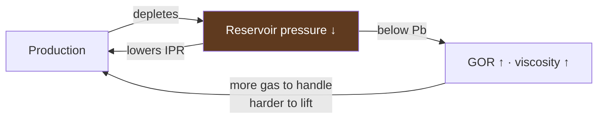
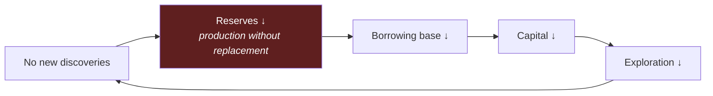
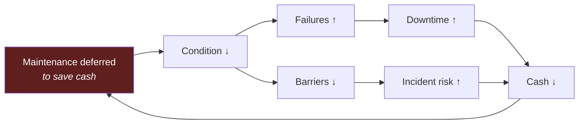
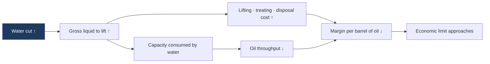
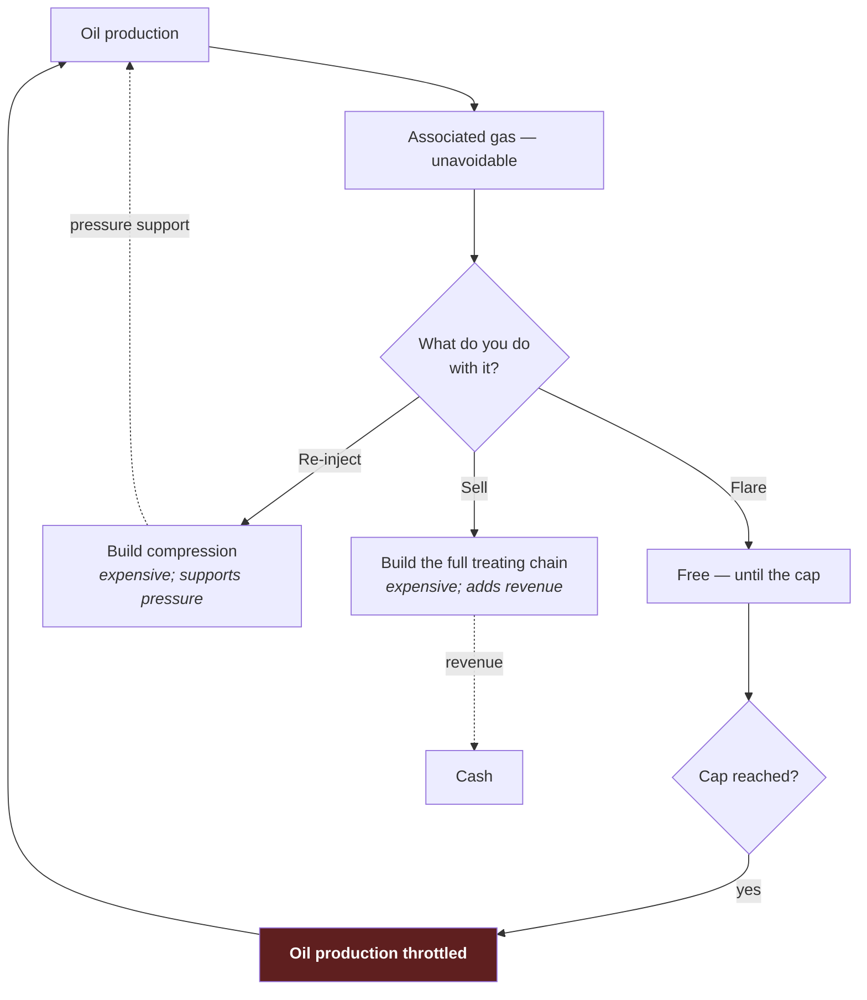
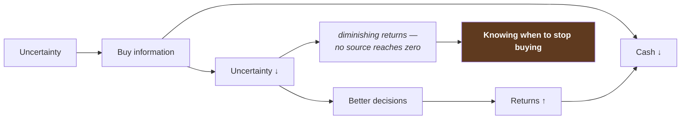
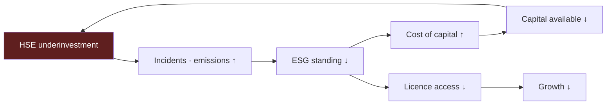
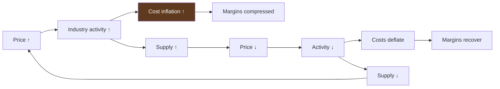
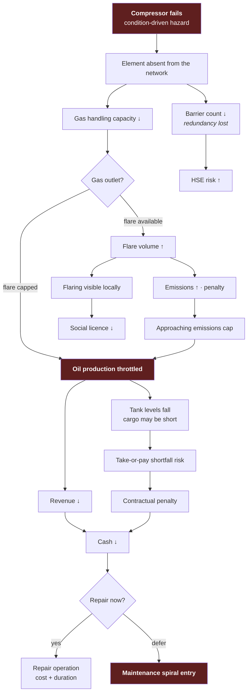

# 17 — Cross-Impact Matrix

**Status:** draft · **Date:** 2026-08-06

> **Affects:** 01, 04, 05, 08, 12, 13, 14, 15, 20, 21 · **Affected by:** 01, 04, 05, 08, 13, 14, 15, 21
> *(strong couplings only — the full row is in [22](22_DESIGN_COHERENCE.md) §2)*

How everything affects everything. The matrix, the named couplings, and — the
most useful part — **the feedback loops**, which are what make this a system
rather than a pile of subsystems.

---

## 1. The matrix

**Read as: row *influences* column.**
`●` strong and direct · `○` moderate · `·` indirect or delayed · blank = none

| ↓ influences → | RES | WEL | FAC | WAT | TRA | PWR | EQP | ENV | HSE | REG | TEC | OPS | INF | ECO |
|---|---|---|---|---|---|---|---|---|---|---|---|---|---|---|
| **RES** Reservoir | — | ● | ● | ● | ○ | · | · | | · | | | · | ● | ● |
| **WEL** Wells & lift | ● | — | ● | ● | ○ | ● | ○ | | ○ | · | | ○ | ● | ● |
| **FAC** Facilities | ● | ● | — | ● | ● | ● | ○ | · | ● | ● | | ○ | · | ● |
| **WAT** Water | ● | ● | ● | — | · | ● | ● | · | ○ | ● | | ○ | ○ | ● |
| **TRA** Transport & export | ● | ● | ● | | — | ○ | ○ | · | ○ | ○ | | ○ | · | ● |
| **PWR** Power | | ● | ● | ● | ○ | — | · | · | ○ | ○ | | · | | ● |
| **EQP** Equipment condition | · | ● | ● | ● | ● | ● | — | | ● | ○ | | ● | · | ● |
| **ENV** Environment & weather | · | ○ | ● | ○ | ● | ○ | ● | — | ● | ○ | | ● | ● | ● |
| **HSE** Health, safety, env. | | ○ | ● | ○ | ○ | · | ○ | ● | — | ● | · | ● | | ● |
| **REG** Regulation | ○ | ● | ● | ● | ○ | ○ | · | · | ● | — | · | ● | · | ● |
| **TEC** Technology | ● | ● | ● | ● | ● | ● | ● | ○ | ● | · | — | ● | ● | ● |
| **OPS** Operations & crew | ● | ● | ● | ○ | ● | · | ● | | ● | · | | — | ● | ● |
| **INF** Information & beliefs | · | ● | ● | ○ | ○ | | ○ | | ○ | | ○ | ● | — | ● |
| **ECO** Economics & market | ● | ● | ● | ● | ● | ● | ● | | ● | · | ● | ● | ● | — |

### 1.1 What the matrix shows

**The densest rows are TEC, ENV and ECO** — technology, environment and money
touch nearly everything. That is correct and intentional: they are the three
cross-cutting axes of the game.

**The densest column is ECO.** Everything eventually shows up as money, which is
what makes cash flow the integrating constraint.

**EQP → HSE is strong**, and that link is the spine of
[14_HSE](14_HSE.md): equipment condition *is* barrier condition. There is no
separate "safety stat" — safety is the state of the physical plant, plus
competency and procedures.

**RES → INF is strong and often forgotten**: the reservoir's behaviour *is* the
information source. Production history is how the player learns what they own.

---

## 2. The named couplings

The thirty that matter, with the mechanism stated. Anything not derivable from
these is decoration.

### 2.1 Within the physical chain

| # | From → To | Mechanism |
|---|---|---|
| 1 | Reservoir → Well | Pressure sets the IPR; falling pressure lowers every well's potential |
| 2 | Well → Reservoir | Withdrawal depletes; drawdown is what makes it flow |
| 3 | Reservoir → Facilities | Fluid composition and GOR set the required processing chain |
| 4 | Reservoir → Water | Water cut rises through life, driving the entire water burden |
| 5 | Facilities → Well | **Backpressure** — separator, tank and manifold pressure raise `Pwf` and cut rate |
| 6 | Transport → Facilities | Export capacity and berth availability set the ceiling everything backs up against |
| 7 | Water → Everything | Gross liquid occupies capacity in every shared vessel, pipe and pump |
| 8 | Power → Facilities & Wells | A shortfall takes units and ESPs offline before the flow solve |
| 9 | Facilities (gas) → Well | Gas-handling limits cap oil, because oil carries gas |
| 10 | Water injection → Reservoir | Pressure support — the one lever against decline |

### 2.2 Condition, environment and risk

| # | From → To | Mechanism |
|---|---|---|
| 11 | Water & sour gas → Equipment | Corrosion severity drives condition decay |
| 12 | Equipment → Availability | Failure removes an element from the network entirely |
| 13 | Equipment → HSE | Condition *is* barrier strength |
| 14 | Environment → Operations | Weather windows, downtime, access, logistics cost |
| 15 | Environment → Facilities | Foundations, winterisation, **heat derating of compression** |
| 16 | Environment → Flow assurance | Ambient temperature drives hydrate and wax risk |
| 17 | Environment → HSE | Sensitivity multiplies spill consequence; remoteness slows response |
| 18 | Operations → HSE | Fatigue and lean crewing raise the human-error threat rate |
| 19 | HSE → Operations | Incidents suspend work; findings gate restart |
| 20 | Regulation → Production | Flaring caps and emissions limits are **physical production constraints** |

### 2.3 Information, technology and money

| # | From → To | Mechanism |
|---|---|---|
| 21 | Production history → Information | The most trustworthy data about a reservoir |
| 22 | Information → Every decision | Beliefs, not truth, are what the player acts on |
| 23 | Technology → Models | Swaps a model, extends an envelope, unlocks an option |
| 24 | Economics → Everything | Cash gates every operation; nothing happens unfunded |
| 25 | Market price → Reserves | Reserves are only what is economic at current prices |
| 26 | Reserves → Borrowing base | Reserve-based lending — reserves *are* capital access |
| 27 | Custody transfer → Cash | The only revenue event |
| 28 | HSE record → Cost of capital | ESG standing changes the borrowing rate |
| 29 | Price cycle → Costs | Cost inflation tracks the cycle; margins compress at the peak |
| 30 | Licence clock → Capital allocation | Commitments force spending on someone else's schedule |

---

### 2.4 Every coupling has a delay, and the delay matters more than the strength

The matrix says *what* affects *what*; it does not say *how long it takes*. That
second question decides whether a coupling teaches the player or traps them.

**Each of the thirty couplings is classified into one of seven delay classes in
[21_INTEGRATION](21_INTEGRATION.md) §2**, from `P0` (resolved inside a single
flow solve) to `P6` (decades). The binding rule that comes out of it:

> **Every P5 or P6 coupling must have a P2 or P3 leading indicator.**
> Otherwise the player learns about it only after it has happened, which converts
> a decision into a punishment.

Checked as a structural build test (I-V1), not left to judgement.

---

## 3. Feedback loops

The most important section. A loop is where the system pushes back — and the
character of the game lives in which loops dominate at which stage.

**Each loop also has a *period*** — how long one turn around it takes — tabulated
with its detection signal and its exits in
[21_INTEGRATION](21_INTEGRATION.md) §3. Period sets difficulty: a loop that turns
in a month teaches itself; a loop that turns in five years must be announced.

### 3.1 The master balancing loop — depletion

**Balancing.** The engine of the whole game: producing is self-limiting.
Everything the player builds is an attempt to hold this loop open a little longer.

### 3.2 The growth loop — the reinforcing engine

**Reinforcing.** This is why a first discovery changes everything, and why the
early game is so tense — the player is trying to get this loop *started*.
Reserve-based lending is the coupling that makes it real rather than thematic.

### 3.3 The liquidation spiral — the same loop, reversed

**Reinforcing, downward.** The late-game problem, and it is why **RRR is the real
score** ([08_ECONOMICS](08_ECONOMICS.md) §6.1). A company with rising cash and
falling reserves is inside this loop and does not always notice.

### 3.4 The maintenance death spiral

**Reinforcing, downward.** The most instructive loop in the game, because entering
it is *locally rational every single time*. Deferring maintenance this month
always looks like the right call. The leading indicators
([14_HSE](14_HSE.md) §2.2) are what let a player see they are inside it.

### 3.5 The water spiral

**Reinforcing, downward — and it is what actually kills most fields**, not the
reservoir emptying. The counter-moves are real: zonal shutoff, more water
handling, conversion to injection.

### 3.6 The associated gas trilemma

**Balancing, through regulation.** Three defensible strategies with different
capital profiles, and the lazy one has a hard ceiling.

### 3.7 The information loop

**Balancing, with diminishing returns.** The exploration game in one diagram: the
skill is not "buy information", it is knowing when the next purchase is no longer
worth it.

### 3.8 The ESG loop

**Reinforcing, downward, and slow.** Slow loops are the hardest to notice and the
hardest to escape, which is exactly why this one belongs in the game.

### 3.9 The price cycle loop

**Balancing, with a lag** — and the lag is the lesson. Sanctioning at the peak
means paying peak costs to deliver into a trough. **This is how the industry
reliably destroys value**, and a player who learns to sanction counter-cyclically
has learned something genuinely valuable.

---

## 4. Loop dominance by game stage

Which loop the player is fighting tells you what the game *is* at that moment.

| Stage | Dominant loop | The player's problem |
|---|---|---|
| Startup | Information (3.7) | Buy the right data with almost no money |
| First discovery | Growth (3.2) | Get the reinforcing loop started before the licence clock runs out |
| Development | Price cycle (3.9) | Sanction at the right point in the cycle |
| Plateau | Depletion (3.1), maintenance (3.4) | Hold plateau; do not enter the maintenance spiral |
| Decline | Water (3.5), gas trilemma (3.6) | Manage cost per barrel; decide what to fix and what to let go |
| Maturity | Liquidation (3.3), ESG (3.8) | Replace reserves, or manage a graceful decline |

**This table is a design check.** If every stage were dominated by the same loop,
the game would be one idea repeated. Six different dominant loops across a career
is what makes the arc feel like a progression rather than a treadmill.

---

## 5. Worked cascade — one failure, traced

To show the couplings composing. A compressor fails on a mature oil field:

**Every arrow in that cascade is one of the thirty couplings in §2.** None is
special-cased; the cascade is what the engine does when you remove one element
from the network and let the tick run.

---

## 6. Design rules that follow from the matrix

| # | Rule | Because |
|---|---|---|
| CI1 | Every coupling is mechanical, never scripted | A scripted consequence cannot compose with the other twenty-nine |
| CI2 | Every constraint is discoverable | The bottleneck report names the binding element; the player can always find the near end of a chain |
| CI3 | Reinforcing loops must have visible leading indicators | Otherwise the player is inside one before they can act. Quantified as rules IR1–IRR2 in [21](21_INTEGRATION.md) |
| CI4 | Every downward loop has at least two exits | Otherwise it is a death sentence rather than a mistake |
| CI5 | No coupling is instantaneous unless it is physical | Backpressure is same-tick; ESG is a multi-year drift. The lag *is* the difficulty |
| CI6 | Loop dominance shifts by stage | Verified by §4 — if it does not, the game is one idea long |
| CI7 | Each downward loop has a registered **entry event** firing while ≥2 exits remain | An alert at the consequence is a notification of damage; an alert at entry is a decision point ([21](21_INTEGRATION.md) §6) |
| CI8 | Every consequence event names the entry event and tick that preceded it | The player must learn *where the decision was*, not just that they are in trouble |

---

## 7. Verification

| # | Test | Passes when |
|---|---|---|
| CI-V1 | Coupling coverage | Each of the thirty couplings has at least one test demonstrating it |
| CI-V2 | Cascade | The §5 cascade is reproduced end to end from a single injected compressor failure |
| CI-V3 | Loop — depletion | Sustained production measurably reduces subsequent potential |
| CI-V4 | Loop — growth | A discovery raises the borrowing base within a redetermination cycle |
| CI-V5 | Loop — liquidation | Production without replacement reduces the borrowing base over time |
| CI-V6 | Loop — maintenance | Scripted deferral produces rising failures, falling cash and rising incident risk |
| CI-V7 | Loop — water | Rising water cut raises cost per barrel of oil and advances the economic limit |
| CI-V8 | Loop — gas trilemma | All three strategies are viable; flaring alone hits the cap and throttles oil |
| CI-V9 | Loop — information | Successive purchases show diminishing variance reduction; none reaches zero |
| CI-V10 | Loop — ESG | A poor record measurably raises the cost of capital |
| CI-V11 | Loop — price cycle | Costs rise with the cycle at the declared elasticity, compressing peak margins |
| CI-V12 | Loop exits | Each downward loop has at least two demonstrated escape routes (CI4) |
| CI-V13 | Stage dominance | Across SC1, the dominant constraint shifts through the §4 sequence |

**CI-V13 is a whole-game design test**, not a unit test. If the dominant
constraint never shifts, the design has failed at the level the player actually
experiences — and no amount of correct physics fixes that.

---

## 8. Open decisions

| # | Decision | Options | Recommendation |
|---|---|---|---|
| CI-D1 | Loop visibility | (a) implicit, (b) an in-game systems view showing active loops | **(b) partially** — showing the *bottleneck* and the *leading indicators* is enough; drawing the loops explicitly would explain the game rather than let the player discover it |
| CI-D2 | Coupling strengths | (a) fixed, (b) content-tunable | **(b)** — they are balance, and balance is content |
| CI-D3 | Lag lengths | (a) fixed, (b) per-jurisdiction/per-difficulty | **(b)** — the lag is the difficulty knob for reinforcing loops, and it is a better one than a cost multiplier |
