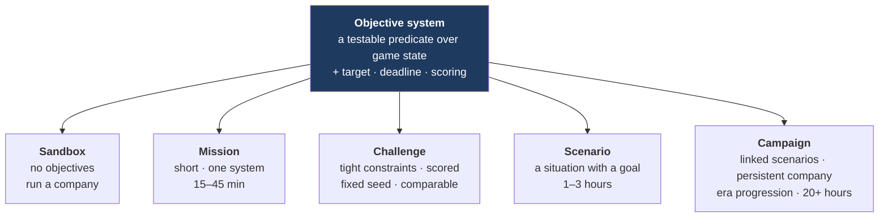

# 18 — Game Modes, Objectives, Challenges and Missions

**Status:** draft · **Date:** 2026-08-06

> **Affects:** 00, 06, 08, 10, 12, 16, 20, phases · **Affected by:** 00, 06, 08, 16, 20
> *(strong couplings only — the full row is in [22](22_DESIGN_COHERENCE.md) §2)*

Answers "what about challenges and missions, not just campaign?" — and the
answer is one objective system underneath five different-feeling modes.

---

## 1. One system, five modes

**All five are content.** The engine has no mode-specific code — an architecture
test asserts it ([R20](../phases/R20_SCENARIOS.md) §4, R20-V10). A mode is a
starting state plus a set of objectives plus a scoring rule plus optional
modifiers.

---

## 2. The objective system

### 2.1 What an objective is

| Facet | Meaning |
|---|---|
| **Predicate** | A condition over game state or over the tick's event set |
| **Target** | The value that satisfies it |
| **Deadline** | Optional — a tick, a date, or an event |
| **Weight** | Contribution to score |
| **Kind** | Required · optional · bonus · **failure condition** |
| **Visibility** | Visible from the start · revealed on a trigger · hidden until satisfied |

### 2.2 Composition

Objectives compose: `all-of`, `any-of`, `sequence` (ordered), `count-of-N`,
`sustained-for` (hold a condition for N ticks), `never` (a failure condition).

**`sustained-for` is worth calling out** — "maintain plateau for 24 months" is a
far better objective than "reach 50,000 bopd", because it tests operational
management rather than a single peak.

### 2.3 The predicate vocabulary

Objectives read the same read model the host reads. They cannot see truth
([R14](../phases/R14_INFORMATION.md) §2.1) — **an objective cannot be "find the
field at coordinates X"**, only "discover 100 MMbbl of 2P reserves". That
restriction is deliberate: an objective that knew the answer would leak it.

| Domain | Example predicates |
|---|---|
| Production | Rate, cumulative, plateau duration, uptime, deferred volume |
| Reserves | 1P/2P/3P added, RRR, recovery factor achieved |
| Economics | Cash, NPV, IRR, cost per barrel, debt ratio, capital efficiency |
| Exploration | Discoveries, success rate, finding cost per barrel |
| HSE | Incident-free duration, emissions intensity, flaring intensity, spill volume, barrier health |
| Operations | Wells drilled, on-time delivery, facility availability |
| Environment | Footprint, water recycled, restoration complete |
| Licence | Commitments satisfied, acreage held, rounds won |
| Time | By a date, within N months, before an event |

### 2.4 Evaluation

At **tick stage 12** ([03_ARCHITECTURE](03_ARCHITECTURE.md) §6), reading the
sealed state and the tick's sealed event set. Objectives observe; they never
influence the simulation. Progress changes publish `objective.*` events
([16_EVENT_MATRIX](16_EVENT_MATRIX.md) §3).

---

## 3. The five modes

### 3.1 Sandbox

No objectives. A generated world, a starting position, and a company to run. The
score is the company: reserves, RRR, cumulative value, HSE record.

**Configurable:** world seed, basin count, starting capital, jurisdiction,
era, fidelity levels, difficulty modifiers.

### 3.2 Missions — short and focused

15–45 minutes, teaching or testing **one system**, on a hand-built starting
state. The tutorial ladder is missions, and the ladder follows the physics
([R20](../phases/R20_SCENARIOS.md) §2.4):

| # | Mission | Teaches |
|---|---|---|
| 1 | *First Oil* | Complete a discovered well and get it producing |
| 2 | *The Well That Stopped* | The well died. Diagnose IPR ∩ VLP; install lift |
| 3 | *Water Arrives* | Water cut is rising. Zonal shutoff versus water handling |
| 4 | *Nowhere to Put the Gas* | A flaring cap is throttling oil. Build the chain or re-inject |
| 5 | *The Tanker Is Late* | Tanks are filling. Storage, scheduling, throttling |
| 6 | *Find the Bottleneck* | A field is producing at 60% of potential. Read the report, fix it |
| 7 | *The Dry Hole* | Read the failure diagnosis; re-rank the play |
| 8 | *How Big Is It?* | Use `p/Z` to deduce gas in place from production data |
| 9 | *The Near Miss* | Barriers are degrading. Act on leading indicators |
| 10 | *Winter Is Coming* | An arctic window. Schedule or lose a year |
| 11 | *Sanction or Wait* | A discovery at a cycle peak. Costs are inflated |
| 12 | *The Last Barrel* | Economic limit and abandonment. When to stop |

**Each mission arises from a consequence the player experiences**, not from a
text box. The game teaches petroleum engineering by making it necessary.

### 3.3 Challenges — constrained and scored

Fixed seed, tight constraints, a score, and therefore **comparable between
players**. Design patterns:

| Pattern | Example |
|---|---|
| **Constrained resource** | Develop this field with $200M and one rig |
| **Turnaround** | Take over a mismanaged asset at 40% uptime and fix it |
| **Maximise recovery** | Highest recovery factor from a marginal field |
| **Hard limit** | Develop with zero routine flaring |
| **Beat the clock** | Satisfy a work commitment in 18 months |
| **Hostile setting** | Arctic, four-month windows, no infrastructure |
| **Price shock** | Sanction, then a 60% crash at first steel |
| **Exploration efficiency** | Lowest finding cost per barrel in a fixed budget |
| **HSE perfect run** | Full development, zero serious incidents |
| **One-shot** | One well, one chance — pick the prospect |

**Scoring is multi-dimensional** (§4), so a challenge names which dimensions
count. "Maximise recovery" and "minimise finding cost" reward genuinely different
play, and a leaderboard per dimension is more interesting than one aggregate.

### 3.4 Scenarios — a situation with a goal

1–3 hours. A starting position with history — an existing company, assets,
obligations, a market context — and a goal. Richer than a mission, standalone
unlike a campaign chapter. Can carry scripted events at declared ticks.

### 3.5 Campaign

Linked scenarios with a **persistent company**: cash, technology, reserves,
reputation and staff carry forward.

**Recommended structure — era progression**, per open decision TD1:

| Chapter | Era | Character |
|---|---|---|
| 1 | 1950s–60s | 2-D seismic, vertical wells, cheap flaring, no environmental regulation. Wildcatting |
| 2 | 1970s–80s | Price shocks, offshore arrives, 3-D seismic, first serious HSE regulation |
| 3 | 1990s–2000s | Horizontal drilling, deepwater, mature-field management, EOR |
| 4 | 2010s–2020s | Emissions caps, carbon price, ESG capital constraints, methane scrutiny, decommissioning bills coming due |

**Why this works:** the same actions have different consequences in each era.
Flaring is free in Chapter 1 and ruinous in Chapter 4 — **and the wells drilled
in Chapter 1 are still the player's liability in Chapter 4.** A campaign where
your own early decisions become your late-game problem is a much better campaign
than a difficulty ramp.

**Branching:** outcomes affect the next chapter's starting position — assets
held, reputation, technology, and the abandonment liabilities inherited.

---

## 4. Scoring

**Not cash.** Cash is trivially inflatable by harvesting.

| Dimension | Measure | Why |
|---|---|---|
| **Reserves** | 2P added; RRR | Did the company build a future? |
| **Recovery** | Recovery factor achieved | Did you get the oil out, or leave it? |
| **Capital efficiency** | Value created per dollar deployed | Skill, not scale |
| **Finding cost** | $ per barrel discovered | Exploration skill |
| **Operating cost** | $ per barrel produced | Operational skill |
| **Uptime** | Actual ÷ potential production | Did you manage the asset? |
| **HSE** | Incidents; emissions and flaring intensity; spill volume | Did you do it responsibly? |
| **Legacy** | Obligations discharged; sites restored | Did you clean up? |

**A composite ranking is offered, and the individual dimensions are always
shown.** Two players with equal composite scores who got there by opposite routes
should be able to see that they did.

Scores additionally carry the **reality profile** they were earned under
(§5b.6): fidelity levels, Advisor levels, forgiveness levers. Comparisons happen
within a profile, never across.

**Design intent:** a player can "win" on cash while scoring badly on reserves,
recovery and legacy — and the game should say so plainly. That is the most
honest thing this game can teach.

---

## 5. Modifiers

A scenario, challenge or campaign chapter can set modifiers, reusing existing
mechanisms rather than adding new ones:

| Modifier | Mechanism |
|---|---|
| Fidelity level per model | The plugin dial ([03](03_ARCHITECTURE.md) §3.2) |
| Hazard intensity | `IHazardModel` selection, including off |
| Price model | `IPriceModel` selection — including historical replay |
| Fiscal regime | `IFiscalRegime` selection |
| HSE regime strictness | `hse-regime` content |
| Starting technology | Content |
| Rival aggression | Content |
| Weather severity | Environment profile |
| Ironman | Save policy ([11](11_PERSISTENCE.md) open decision PSD4) |

**No modifier is a bare difficulty multiplier.** Each selects a different
*model* or a different *content set* — consistent with the technology rule in
[07](07_TECHNOLOGY.md) §1 and enforced the same way.

---

## 5b. Reality levels — the flight-sim answer

**The game must be playable by someone who has never heard of an IPR curve.**
Flight simulators solved exactly this problem, and their solution is not "a
simpler flight model" — it is **three independent axes**, separately tunable,
with presets that bundle them. A player in MSFS with full assists is flying the
*same physics* as an expert; the autopilot is doing the work, visibly, and the
player can take over one control at a time.

### 5b.1 The three axes

| Axis | Question | Mechanism | Flight-sim analogue |
|---|---|---|---|
| **Fidelity** | What does the world compute? | Per-model plugin selection ([03](03_ARCHITECTURE.md) §3.2) — arcade / standard / simulation implementations per subsystem | Simple vs full flight model |
| **Assists** | Who does the work? | **The Advisor** (§5b.2): per-domain automation levels, acting through the same command bus as the player | Autopilot, auto-trim, auto-rudder |
| **Forgiveness** | How hard does failure bite? | Model and content selection: hazard intensity, financial safety nets, licence grace, price damping, save policy | No-damage, unlimited fuel |

**The axes are independent, and that independence is the design.** An engineer
can run full-simulation physics with logistics automated away; a newcomer can
run simplified physics but make every call personally; a story player can run
standard physics with everything assisted and failure softened. None of these is
a lesser game — they are different divisions of labour between player and
Advisor, over the same world.

### 5b.2 The Advisor — assists as an autopilot, not an engine mode

**The single most important architectural decision in this section:** assists
are not engine behaviour. The Advisor is a **player-side agent** that reads the
read model and issues (or proposes) commands through the same bus the player
uses. The engine cannot tell an Advisor command from a player command, and there
is **no `if (assistLevel)` branch anywhere in the simulation**.

| Property | Consequence |
|---|---|
| Same command bus | Every assisted action is validated, audited and replayable like any player action |
| Read model only | The Advisor knows exactly what the player could know — **it cannot peek truth**, so assists never leak the exploration game |
| Deterministic | Given the same read model and configuration it issues the same commands; replay just replays commands, so determinism is untouched |
| Outside the engine | Zero risk to the tick, the solver, or any invariant; the strict laws L1–L5 never meet an assist |

Each of the eight decision domains from [20](20_PLAYER_DECISIONS.md) gets an
independent assist level:

| Level | Behaviour | Flight-sim analogue |
|---|---|---|
| **Manual** | The Advisor is silent | Assists off |
| **Advise** | It recommends, with the reasoning shown — "install an ESP: the well died at tick 214, IPR ∩ VLP is empty, ESP envelope fits" | Flight director |
| **Confirm** | It proposes the command; the player approves or rejects | Autopilot armed |
| **Auto** | It acts, and notifies with the same reasoning | Autopilot engaged |

**Per-domain, changeable at any time, mid-game.** Taking manual control of one
domain while leaving the rest automated is precisely how a flight-sim player
learns — and it is how a tycoon player becomes an engineer without noticing.

**One domain is never automated: exploration judgement.** The Advisor will run
the arithmetic (value of information, expected volumes, bid valuation) but never
chooses which prospect to drill or how much to bid — per PD-D2's line between
arithmetic and judgement. Automating the game's central bet would automate the
game.

### 5b.3 The Advisor is the teacher

The *Advise* level is the tutorial system that never ends. Every recommendation
carries its reasoning in domain terms, drawn from the same read-model data the
player can see — so "why did it suggest that?" is always answerable, and a
player who reads the reasoning for a year of game time has quietly learned
petroleum engineering. The twelve missions (§3.2) teach the concepts once; the
Advisor reinforces them on every real occurrence.

### 5b.4 Forgiveness, itemised

All via existing mechanisms — model selection and content — none via multipliers:

| Lever | Soft | Standard | Hard |
|---|---|---|---|
| Hazards | `IHazardModel` off or gentle | Realistic | Punishing |
| Insolvency | The bank always restructures | Restructuring with real losses | Fire-sale terms |
| Licence clocks | Generous terms and grace periods | Realistic terms | Short terms, strict forfeiture |
| Price volatility | Damped model | Mean-reverting with shocks | Full cycles, bigger shocks |
| Dry-hole sting | Higher regional POS content | Realistic basin content | Frontier content |
| Save policy | Free reload | Free reload | Ironman (PSD4) |

### 5b.5 Presets

| Preset | Fidelity | Assists | Forgiveness | Alerts |
|---|---|---|---|---|
| **Story** | Arcade | Auto everywhere it is allowed | Soft | Quiet — decisions only |
| **Tycoon** *(default)* | Standard | Confirm for operations, Advise elsewhere | Standard | Conservative default |
| **Engineer** | Standard–simulation | Advise only | Standard | Full |
| **Simulation** | Simulation | Manual (Advisor available on request) | Hard | Full |
| **Custom** | any | per-domain | per-lever | per-category |

A preset is **content** — a named bundle of model selections, Advisor levels,
forgiveness levers and an alert profile ([21](21_INTEGRATION.md) I-D5). Changing
preset mid-game is allowed and logged; the axes were independent all along.

### 5b.6 Scores are stamped with the profile

Every score records the reality profile it was earned under, and leaderboards
compare within a profile (§4, GM-D2). An assisted score is not a lesser score —
it is a different game, honestly labelled. This is exactly how racing sims
handle assists, and it removes any incentive to hide the settings.

## 6. Content shape

A `scenario` declares: world source (seed or authored), starting company state,
starting assets and obligations, objectives, failure conditions, scoring
dimensions, modifiers, scripted events, and briefing text ids
([10](10_CONTENT_AND_UNITS.md) open decision CD5 — ids, not inline strings).

A `campaign` declares an ordered chapter list, what persists between them, and
the branching rules.

---

## 7. Verification

| # | Test | Passes when |
|---|---|---|
| GM1 | No mode-specific code | Architecture test: scenarios reference only content and the command surface |
| GM2 | Objective evaluation | Each predicate kind evaluates correctly against constructed states |
| GM3 | Composition | `all-of`, `any-of`, `sequence`, `count-of-N`, `sustained-for`, `never` all behave correctly |
| GM4 | No truth leakage | Architecture test: objective predicates cannot reference truth types |
| GM5 | Objectives are observers | A run with objectives and the same run without produce identical simulation digests |
| GM6 | Deadlines | An objective expiring publishes its event and applies its declared consequence |
| GM7 | Failure conditions | A `never` objective triggers correctly and ends the scenario as declared |
| GM8 | Determinism | A fixed-seed challenge is reproducible; identical play produces an identical score |
| GM9 | Scoring | Each dimension computes correctly; the composite is a declared function of them |
| GM10 | Campaign persistence | Declared state carries between chapters; undeclared state does not |
| GM11 | Branching | Outcomes select the correct next chapter and starting position |
| GM12 | Every mission is completable | Each of the twelve is achievable by its intended action, verified by a scripted play |
| GM13 | Modifiers | Each selects the declared model or content set, and none is a bare multiplier |
| GM14 | No engine assist branches | Architecture test: no simulation assembly references an assist level or the Advisor |
| GM15 | Advisor purity | The Advisor assembly reads only the R21 surface and issues only commands; a run with the Advisor at *Advise* is digest-identical to one without it |
| GM16 | Advisor determinism | The same read model and configuration produce the same recommendations, across platforms |
| GM17 | Profile stamping | Every score carries its reality profile; changing preset mid-game is recorded |

**GM5 is the important architectural test:** objectives observe and never
influence. If a run with objectives diverges from one without, the objective
system has reached into the simulation and the layering has been broken.

---

## 8. Open decisions

| # | Decision | Options | Recommendation |
|---|---|---|---|
| GM-D1 | Campaign structure | (a) linked scenarios with a persistent company, (b) one long career with era progression | **(a) with era-themed chapters** — chapter boundaries give natural save points, difficulty steps and narrative beats, while persistence preserves the "my old wells are now my liability" arc |
| GM-D2 | Leaderboards | (a) local only, (b) online | **(a) first** — deterministic fixed-seed challenges make (b) straightforward to add later, and a verifiable replay makes it cheat-resistant |
| GM-D3 | Objective visibility | (a) all visible, (b) some hidden/revealed | **(b)** — hidden bonus objectives reward exploration; required objectives are always visible |
| GM-D4 | Mission count at launch | (a) the twelve above, (b) more | **(a)** — they cover every major system once; more is content that can follow |
| GM-D5 | Narrative | (a) systems only, (b) light framing with characters | **(b) light** — a named partner, a regulator, a community representative give events a voice at low cost and no simulation impact |
| GM-D6 | Scenario editor | (a) hand-authored content files, (b) an in-game editor | **(a) first** — the content format is already the editor's data model, so (b) is additive whenever it is wanted |
| GM-D7 | Advisor competence | (a) plays a competent game, (b) deliberately mediocre so manual play beats it | **(a)** — a bad autopilot teaches distrust; the expert's edge should come from judgement calls the Advisor refuses to make (exploration), not from the Advisor being wrong |
| GM-D8 | Advisor personality | (a) neutral recommendations, (b) a voiced character (the "chief engineer") | **(b) lightly** — matches GM-D5; a named engineer explaining "why" is warmer than a system message, at no simulation cost |
