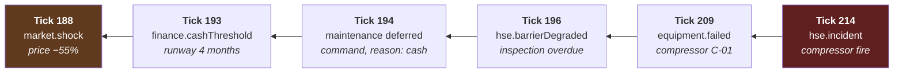

# 21 — Integration: Time × Events × Cross-Impact

**Status:** draft · **Date:** 2026-08-06

> **Affects:** 03, 04, 09, 12, 13, 14, 15, 16, 17, 19, phases · **Affected by:** 03, 04, 09, 15, 16, 17
> *(strong couplings only — the full row is in [22](22_DESIGN_COHERENCE.md) §2)*

Three documents describe three views of one machine:
[15_TIME_AND_EXECUTION](15_TIME_AND_EXECUTION.md) says *when* things happen,
[16_EVENT_MATRIX](16_EVENT_MATRIX.md) says *what is announced*, and
[17_CROSS_IMPACT_MATRIX](17_CROSS_IMPACT_MATRIX.md) says *what causes what*.

**This document is the place they meet.** It answers the questions none of them
can answer alone:

1. How long does each coupling take to land? (§2)
2. What is the characteristic period of each feedback loop, and how does that set
   its difficulty? (§3)
3. Which events fire in which tick stage, and what can therefore be known when? (§4)
4. Which events cut a tick into segments, and which do not? (§5)
5. How does an alert catch a player **entering** a loop rather than **arriving at
   its consequence**? (§6)
6. How is causality reconstructed across ticks? (§7)

---

## 1. The central claim

> **Lag is the difficulty.** A coupling whose effect lands this tick teaches
> itself. A coupling whose effect lands in three years must be announced by a
> leading indicator, or the player cannot act on it at all.

Everything in this document follows from that. The engine's job is not merely to
*model* the couplings — it is to make the slow ones **visible on a timescale the
player can act within.**

---

## 2. Propagation delay classes

Every one of the thirty couplings in
[17_CROSS_IMPACT_MATRIX](17_CROSS_IMPACT_MATRIX.md) §2 belongs to exactly one
class.

| Class | Delay | Mechanism | Player experience |
|---|---|---|---|
| **P0 · Intra-solve** | Within one flow solve | Iterative convergence | Instant. Cause and effect in the same number |
| **P1 · Intra-tick** | Across a segment boundary | Segmentation ([15](15_TIME_AND_EXECUTION.md) §6) | "We lost 12 days this month" |
| **P2 · Next tick** | 1 tick | Committed state feeding the next solve | Obvious month to month |
| **P3 · Short** | 2–6 ticks | Accumulating physical state | A trend you can see forming |
| **P4 · Medium** | 6–24 ticks | Operations, redeterminations, condition decay | Needs a chart to notice |
| **P5 · Long** | 2–10 years | Reputation, standing, cycles, R&D | **Invisible without a leading indicator** |
| **P6 · Generational** | Decades | Liabilities, era transitions, campaign carry-over | Only visible across chapters |

### 2.1 The thirty couplings, classified

| # | Coupling | Class | Note |
|---|---|---|---|
| 1 | Reservoir pressure → well IPR | **P0** | Inside the solve |
| 2 | Well withdrawal → reservoir depletion | **P2** | Committed at stage 6, felt next tick |
| 3 | Reservoir fluid → required processing chain | P4 | Composition drifts over years |
| 4 | Reservoir → water cut | P3–P5 | Slow before breakthrough, fast after |
| 5 | Facility backpressure → well rate | **P0** | The signature same-tick coupling |
| 6 | Export capacity → whole-chain ceiling | **P0** | |
| 7 | Water volume → shared capacity | **P0** | Gross liquid displaces oil immediately |
| 8 | Power shortfall → units offline | **P0** | Resolved before the solve, felt in it |
| 9 | Gas handling limit → oil cap | **P0** | Oil carries gas |
| 10 | Water injection → pressure support | **P2** | Committed, felt next tick |
| 11 | Water & sour gas → corrosion | **P4** | Condition decays over months |
| 12 | Equipment failure → element absent | **P1** | Mid-tick, creates a segment |
| 13 | Equipment condition → barrier strength | **P0** | Same fact, no delay |
| 14 | Environment → operations | **P1** | Weather days lost within the tick |
| 15 | Environment → facility design | P6 | Locked in at build; permanent |
| 16 | Ambient temperature → flow assurance | **P1** | Seasonal, within-tick |
| 17 | Sensitivity → spill consequence | **P0** | On the event |
| 18 | Fatigue → human-error rate | **P4** | Builds over rotations |
| 19 | Incident → operations suspended | **P2** | Effect lands next tick |
| 20 | Flaring cap → oil throttled | **P0** | A network constraint like any other |
| 21 | Production history → belief update | **P3** | Needs several points to infer |
| 22 | Belief → decision | **P0** | Whenever the player acts |
| 23 | Technology → model swap | **P2** | On acquisition |
| 24 | Cash → operations gated | **P0** | At scheduling |
| 25 | Price → reserves | **P4** | At redetermination, quarterly |
| 26 | Reserves → borrowing base | **P4** | Redetermination cycle |
| 27 | Custody transfer → cash | **P0** | Stage 7 → stage 8 |
| 28 | HSE record → cost of capital | **P5** | **The slowest coupling in the game** |
| 29 | Price cycle → cost inflation | **P5** | Multi-year |
| 30 | Licence clock → capital allocation | P4–P6 | Term-dependent |

### 2.2 What the classification is for

**Design rule IR1:** *every* **P5** *or* **P6** *coupling must have a* **P2** *or*
**P3** *leading indicator.*

Otherwise the player learns about it only after it has already happened, which
converts a decision into a punishment. Three examples of the rule applied:

| Slow coupling | Leading indicator | Class |
|---|---|---|
| HSE record → cost of capital (P5) | ESG standing, published every tick | P2 |
| Deferred maintenance → failure (P4) | Barrier status and backlog, published every tick | P2 |
| Price cycle → cost inflation (P5) | Cost index versus price index, published quarterly | P3 |

**Verified by test I-V1** (§8). A coupling class P5 or P6 with no registered
indicator fails the build.

---

## 3. Loop periods and difficulty

Each feedback loop in [17](17_CROSS_IMPACT_MATRIX.md) §3 has a characteristic
period — how long one turn around the loop takes.

| Loop | Type | Period | Detection | Exits |
|---|---|---|---|---|
| **3.1 Depletion** | Balancing | Continuous (P0/P2) | Pressure and rate trend | Injection, infill, lift |
| **3.2 Growth** | Reinforcing ↑ | 6–18 months | RRR, borrowing base | — *(you want to be in it)* |
| **3.3 Liquidation** | Reinforcing ↓ | 1–3 years | **RRR < 1.0** | Explore — incl. **re-screening held acreage with a new tier** ([06](06_WORLD_AND_EXPLORATION.md) §2.3a); acquire; farm in |
| **3.4 Maintenance spiral** | Reinforcing ↓ | 6–18 months | Backlog, barrier status, failure rate | Fund a catch-up; retire the worst assets |
| **3.5 Water** | Reinforcing ↓ | 1–5 years | Water cut trend, cost per barrel | Zonal shutoff; more handling; convert to injector |
| **3.6 Gas trilemma** | Balancing | Immediate at the cap (P0) | Flare volume against cap | Sell; re-inject; curtail |
| **3.7 Information** | Balancing | Per purchase, 1–6 months | Variance reduction per dollar | Stop buying |
| **3.8 ESG** | Reinforcing ↓ | **3–10 years** | ESG standing, cost of capital | Cut emissions; fix the safety record |
| **3.9 Price cycle** | Balancing | 5–10 years | Price and cost indices | Counter-cyclical sanction; hedge |

### 3.1 Period sets difficulty, not magnitude

| Period | Why it is hard | Design response |
|---|---|---|
| **Continuous / immediate** | Not hard — the feedback is the lesson | Show the number; the player learns in one tick |
| **6–18 months** | Hard enough to be interesting. You can feel it forming | Trend display; a warning event at loop entry |
| **1–3 years** | Hard. Requires deliberately looking at a chart | A recurring periodic report; annual events |
| **3–10 years** | **Very hard.** A player can be deep inside before noticing | A standing indicator, always visible, plus a threshold-crossing event |

**Design rule IR2:** *a loop with a period over two years must publish a standing
indicator that is visible without being sought.* The ESG loop and the liquidation
spiral are the two that qualify.

*Rationale:* these are the loops that end companies, and they are the loops a
player cannot discover by playing attentively for a few months. Making them
visible is not a hint system — it is the difference between a strategy game and a
trap.

### 3.2 Loop dominance and the pacing model

The stage table in [17](17_CROSS_IMPACT_MATRIX.md) §4 explains the pacing
recommendation in [15_TIME](15_TIME_AND_EXECUTION.md) §2:

| Stage | Dominant loop period | Decision density | Natural play speed |
|---|---|---|---|
| Startup | Information (months) | Low count, high stakes | Paused, deliberate |
| Exploration | Information (months) | Moderate | 1×–2×, event-driven |
| Sanction | Price cycle (years) | Very low count, highest stakes | Paused |
| Development | Immediate + medium | **High** | 1×, frequently paused |
| Plateau | Depletion + maintenance | Moderate | **4×–8×, alert-driven** |
| Decline | Water + maintenance | **High** | 1×–2× |
| Maturity | Liquidation + ESG (years) | Moderate | 4×–8× with annual review |

**This is the argument for real-time-with-pause stated quantitatively.** Plateau
and maturity are dominated by multi-year loops with low decision density — the
player should be able to move through them quickly while the alert system watches
for loop entry. Development and decline are dominated by immediate and
medium-period loops with high density — the player should be at 1×, pausing
often.

**A single fixed pace cannot serve both**, which is why "advance until condition"
([15](15_TIME_AND_EXECUTION.md) §5) is not a convenience feature but a
requirement of the loop structure.

---

## 4. Tick stages and events

Which stage raises which events, and therefore what is knowable when.
Stage numbers follow [03_ARCHITECTURE](03_ARCHITECTURE.md) §6.

| Stage | Name | Events raised | Can read |
|---|---|---|---|
| 0 | Open | `time.tick`, `time.quarter`, `time.year` | Previous tick's sealed state |
| 1 | Commands | `command.accepted`, `command.rejected` | Stage 0 |
| 2 | Environment | `env.seasonChange`, `env.storm`, `env.accessWindow*`, `env.forecastUpdate` | Stages 0–1 |
| 3 | Operations | `operation.*`, `well.spudded`, `well.shows`, `well.result`, `well.online` | Stages 0–2 |
| 4 | Availability, hazards, segmentation | `equipment.*`, `hse.nearMiss`, `hse.incident`, `power.shortfall` | Stages 0–3 |
| 5 | Solve flow *(per segment)* | `flow.constraintBound`, `flow.solverFault` | Stages 0–4 |
| 6 | Material balance | `reservoir.bubblePoint`, `reservoir.waterBreakthrough`, `tank.*`, `well.shutIn`, `well.diedNaturally`, `flow.flared` | Stages 0–5 |
| 7 | Custody & sales | `custody.transferred`, `flow.specRejected`, `contract.*` | Stages 0–6 |
| 8 | Economics | `finance.*`, `market.*`, `well.economicLimit` | Stages 0–7 |
| 9 | HSE & regulation | `hse.barrierDegraded`, `hse.spill`, `hse.emissionsThreshold`, `hse.inspection`, `hse.order`, `hse.socialLicence`, `reg.*` | Stages 0–8 |
| 10 | Information | `discovery.*`, `belief.updated`, `reservoir.compartmentInferred` | Stages 0–9 |
| 11 | Company | `reserves.*`, `licence.*`, `tech.*`, `rival.result` | Stages 0–10 |
| 12 | Objectives | `objective.*` | Stages 0–11 **(sealed)** |
| 13 | Close | *(publishes everything)* | All |

### 4.1 Three ordering consequences worth stating

**(a) Physical effects precede administrative ones.** A hazard becomes an
equipment failure at stage 4, so it is absent from *this* tick's solve. Its
penalty, investigation and barrier consequences land at stage 9, so those affect
*next* tick. **The plant reacts immediately; the paperwork follows.** That is both
correct and legible.

**(b) Beliefs update from this tick's production.** Stage 10 follows stage 6, so
the `p/Z` deduction and compartment inference use the production that just
happened. A player's understanding is always current to the last tick.

**(c) Objectives see everything and change nothing.** Stage 12 reads a sealed
state and a sealed event set. It is the last stage before close for exactly this
reason — it can observe the complete tick and has no stage after it in which to
act.

---

## 5. Events and segmentation

### 5.1 The rule

> **An event creates a segment boundary if and only if it changes the flow
> network's topology or its constraints.**

| Creates a boundary | Does not |
|---|---|
| Equipment failure or repair | Price movement |
| Well coming online or shutting in | Belief update |
| Weather transition crossing an operating limit | Financial events |
| Tank reaching full or being emptied by a lifting | Regulatory correspondence |
| Power source lost or restored | Objective progress |
| Berth occupied or released | Technology acquired *(applies at tick boundary)* |
| Facility unit commissioned or taken offline | Reserves redetermination |

*Rationale:* solving a segment costs a full network solve. Segmenting for
something that cannot change the answer is pure waste, and the rule above is
exactly the set that can.

### 5.2 The budget, and what happens when it is exceeded

Four segments per tick ([15](15_TIME_AND_EXECUTION.md) open decision TM-D2). When
more than three boundary-creating events occur in a tick:

1. Rank candidate boundaries by **estimated production impact** — the magnitude
   of the constraint change multiplied by the duration it applies for.
2. Keep the three largest.
3. Merge the remainder to the nearest retained boundary.
4. **Audit every merge**, with the event, its true position and the position it
   was merged to.

**The approximation is never invisible.** A tick with merged boundaries is
identifiable in the audit trail, and the merge error is bounded and recorded.

### 5.3 Determinism of ordering

Within a tick, events are ordered by the tuple:

```
(stage, sub-tick position, entity id, event id)
```

Every component is deterministic, and the last two guarantee a total order even
for simultaneous events on the same entity. **Two runs from the same seed produce
byte-identical event streams**, which is what makes replay and the fairness claim
in [09_DIAGNOSTICS](09_DIAGNOSTICS.md) §4.2 hold.

---

## 6. Alerts as loop-entry detectors

**The most important design idea in this document.**

An alert that fires when a loop's *consequence* arrives is a notification of
damage. An alert that fires when the player *enters* the loop is a decision
point. Severity should therefore be assigned by **loop position**, not by
consequence magnitude.

| Downward loop | **Entry event** (act here) | Mid-loop event | Consequence event (too late) |
|---|---|---|---|
| Maintenance spiral | `hse.barrierDegraded` `W` | `equipment.failed` `C` | `hse.incident` `C` |
| Water spiral | `reservoir.waterBreakthrough` `W` | `flow.constraintBound` (water) `N` | `well.economicLimit` `W` |
| Liquidation | `reserves.replacementRatio` < 1.0 `N` | `finance.borrowingBaseChanged` `W` | `finance.insolvencyRisk` `D` |
| ESG | `hse.emissionsThreshold` `W` | `hse.socialLicence` `W` | `finance.borrowingBaseChanged` `W` |
| Gas trilemma | `flow.flared` `W` | `hse.emissionsThreshold` `W` | oil throttled — `flow.constraintChanged` `W` |
| Price cycle | cost index divergence `N` | `market.priceMove` `N` | `market.shock` `C` |

### 6.1 The design rules that follow

| # | Rule |
|---|---|
| **I3** | Every downward loop has a registered **entry event**, and it fires while at least two exits remain available |
| **I4** | An entry event's default severity is at least `W`, so it auto-pauses under the default threshold |
| **I5** | A consequence event names the entry event that preceded it and the tick it fired on |

**I5 is what makes the game teach.** When `finance.insolvencyRisk` fires, it says:
*"RRR fell below 1.0 in month 214, thirty-one months ago."* The player learns not
only that they are in trouble but **where the decision was**, which is the only
way the next playthrough goes differently.

### 6.2 Alert fatigue is a real risk

An alert on every loop entry, every tick, would train the player to dismiss them.
Mitigations:

- **Entry events fire once per loop entry**, not repeatedly while inside
- **Re-entry after an exit fires again** — that is new information
- Severity **escalates with time-in-loop** when no corrective action is taken
- The host groups related alerts by shared cause id
  ([16](16_EVENT_MATRIX.md) open decision EM-D4)

---

## 7. Causality across ticks

Every event carries a **cause reference** into the audit trail. Chains span
ticks, and the audit trail can walk them backwards.



**The player can ask "why did this happen?" and walk the chain back to a price
shock twenty-six months earlier.** That is the cross-impact matrix made
queryable, and it is why the audit trail is a foundation subsystem rather than a
diagnostic tool.

**Design rule IR6:** *every* `C` *or* `D` *severity event must carry a cause chain
of at least one link.* An unexplained crisis is a bug.

---

## 8. Verification

| # | Test | Passes when |
|---|---|---|
| I-V1 | Slow couplings have indicators | Every P5/P6 coupling has a registered P2/P3 leading indicator (rule IR1) |
| I-V2 | Long loops are visible | Every loop with a period over two years publishes a standing indicator (rule IR2) |
| I-V3 | Delay classification | Each of the thirty couplings lands within its declared class, verified by injection tests |
| I-V4 | Stage-to-event map | Each event is raised only in its declared stage |
| I-V5 | Stage read isolation | No stage reads state produced by a later stage |
| I-V6 | Segmentation rule | Only topology/constraint-changing events create boundaries |
| I-V7 | Budget and merge | Exceeding the budget merges by impact rank and audits every merge |
| I-V8 | Merge error bound | Merged-boundary ticks stay within the declared production-error bound versus an unbudgeted solve |
| I-V9 | Event ordering | The four-component order is total and deterministic across platforms |
| I-V10 | Loop entry events | Every downward loop has an entry event firing while ≥2 exits remain (rule IR3) |
| I-V11 | Entry severity | Every entry event is at least `W` (rule IR4) |
| I-V12 | Consequence attribution | Every consequence event names its entry event and tick (rule IR5) |
| I-V13 | Cause chains | Every `C`/`D` event carries a chain ≥1 link (rule IR6) |
| I-V14 | Chain reconstruction | The §7 chain is reconstructible end to end from the audit trail |
| I-V15 | Alert fatigue | Entry events fire once per entry; escalation occurs only without corrective action |
| I-V16 | Pacing profile | Across SC1, achievable play speed by stage matches §3.2 |

**I-V1, I-V2 and I-V10 are build-breaking structural tests**, not behavioural
ones: they check registration completeness. A new slow coupling added without a
leading indicator fails CI, which is the only reliable way to keep rule IR1 true
as the design grows.

---

## 9. Open decisions

| # | Decision | Options | Recommendation |
|---|---|---|---|
| I-D1 | Segment budget | (a) 4 fixed, (b) adaptive by network size | **(a)** — a fixed budget makes tick cost predictable; the merge audit makes the approximation honest |
| I-D2 | Loop indicators in the UI | (a) raw numbers, (b) an explicit "you are in loop X" display | **(a) plus trend and threshold** — naming the loop would explain the game rather than let the player recognise it |
| I-D3 | Cause-chain depth in-game | (a) full chain, (b) capped at N links | **(b) capped at 10, expandable** — a full chain over 40 years is unreadable; the cap is a display concern, and the trail keeps everything |
| I-D4 | Escalation rate | (a) fixed, (b) content-tuned per loop | **(b)** — escalation pace is balance, and balance is content |
| I-D5 | Alert profiles | (a) one default, (b) presets: new player / experienced / minimal | **✅ Resolved — folded into reality presets** ([18](18_GAME_MODES.md) §5b.5): each preset carries an alert profile, and Custom exposes the per-category thresholds |
