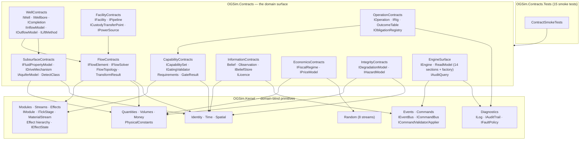
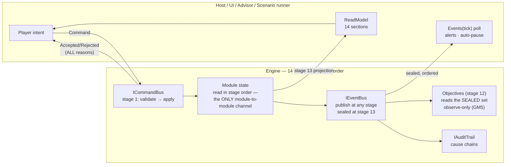

# 23 — Contract Function Matrix

> Created after the second contract pass (2026-08-06), when the contract layer
> first existed as compiling code. Where 01 maps *concepts* and 03 maps
> *modules*, this document maps the **actual C# surface**: every contract, its
> functions, who implements it, who calls it, at which stage, under which SDD,
> and which verification suite pins it. If a row here disagrees with the code
> in `OGSim/src/`, one of them is wrong and rule F-4 applies.

---

## 1. The assembly and contract dependency graph

Two assemblies exist. `OGSim.Kernel` knows nothing about oil; `OGSim.Contracts`
knows nothing about implementations. Arrows read "depends on".

Rules the graph encodes (architecture-tested at R1):

| Rule | Meaning |
|---|---|
| Kernel → nothing | no package refs, no domain words, no `System.Math` transcendentals outside DetMath |
| Contracts → Kernel only | domain shapes may use primitives; never the reverse |
| Tests → both | fakes in tests prove implementability without shipping implementations |
| No cycles | `WellContracts → FlowContracts` is one-way; `ICompletion : IFlowElement`, never the reverse |

---

## 2. The two pipelines (how everything talks)

There is **no Subscribe** — module-to-module causation flows through state in
stage order (16 §1b). Commands are the only inbound pipeline; events the only
outbound one.

---

## 3. Function matrix — kernel contracts

Legend: **Impl** = phase that ships the implementation; **Called by** = primary
consumer and stage; **Pin** = verification suite that locks behavior.

| Contract | Function | Does | SDD | Impl | Called by | Pin |
|---|---|---|---|---|---|---|
| `Money` | `RoundHalfEven(double)` | the ONE double→cents door | 009 §1 | R1 (done — kernel one-liner) | every stage-8 booking | MX-9, smoke ✅ |
| `Money` | `+ − < ×long` (checked) | overflow throws, never wraps; integer scaling exact | 001 §8 | R1 ✅ | ledger | smoke ✅ |
| `FormationVolumeFactor` | `Shrink/Swell` | the only rb↔stb door (oil) | 001 §1.1 | R1 ✅ | material balance (st 6) | MB-1, smoke ✅ |
| `GasFormationVolumeFactor` | `Shrink/Swell` | the only rm³↔sm³ door (gas) — different family, different bridge | 001 §1.1 | R1 ✅ | material balance (st 6) | MB-1, smoke ✅ |
| `ISimulationClock` | `Now/Date` | 30/360 calendar | 001 §3 | R1 | stages 0, 13 | CAL-1..4 |
| `IRandomSource` | `Stream(StreamId)` | 8 named streams, no sharing | 003 | R1 | per D-1..D-8 owner | D-tests |
| `IRandomStream` | `NextNormal` | Marsaglia polar (no trig) | 003 §2 | R1 | Measurement, Price | D-6 |
| `IEntityRegistry` | `Issue/Resolve/TryResolve` | ids never recycled; resolve-or-fault | 001 §2 | R1 | everywhere | R1-V |
| `ILog` | `Write/Scope` | structured, leveled | 011 | R1 | everywhere | — |
| `IAuditTrail` | `Record/Query` | why-chains, cents-exact | 011 §3 | R4 | stages 1–13 | AUD |
| `IFaultPolicy` | `Handle(Fault)` | 6 classes; nothing swallowed | 011 §4 | R4 | tick loop | FT |
| `IEventBus` | `Publish` → `EventId` | append-only within tick; bus stamps the id | 001 §6 | R4 | every module | EM |
| `IEventBus` | `Sealed(tick)` | total order (Stage, Day, Subject, EventId) | 001 §6 | R4 | host, Objectives (st 12) | GM5 |
| `ICommandBus` | `Submit` | inbound pipeline | 001 §7 | R4 | host, Advisor | R1 §2.5 |
| `ICommandValidator<T>` | `Validate` | pure; ALL reasons | 001 §7 | per module | bus (st 1) | R3-V2 |
| `ICommandApplier<T>` | `Apply` | cannot fail; returns AuditId | 001 §7 | per module | bus (st 1) | R1 §2.5 |
| `IModule` | `Manifest/Compose` | declare-then-compose; all-or-refuse | 001 §9 | R4 + each module | composition root | I-V1 |
| `ITickStage` | `Execute(ctx)` | one of 14, declared order | 001 §9 | R4 | tick loop | I-V5 |
| `IStateOwner` | `Capture/Restore` | canonical k/v; missing = fault, never default | 013 §3 | every stateful module | save/load | SL |
| `IEffectState` | `EffectiveEnvelope/SelectedPlugin/Parameter` | Min(Max(base, ext), restr); derived, never saved | 005 §4.2 | R17 | gating, model slots (st 2+) | R17-V |

## 4. Function matrix — domain contracts

| Contract | Function | Does | SDD | Impl | Called by | Pin |
|---|---|---|---|---|---|---|
| `IFlowElement` | `Transform(input)` | PURE physics; commit at stage 6 | 002 §5 | R8–R12 per equipment | solver (st 5) | INV1 per element |
| `IFlowElement` | `EvaluateConstraints` | capacity vs load, all kinds | 002 §5 | same | solver throttling | R8-V2 |
| `IFlowSolver` | `Solve(segment, topology)` → solutions + completion states + attribution | damped fixed-point λ=0.5 · pro-rata · shut-in ladder | 002 §7–8 | R8 | stage 5, per segment; stage 6 commits `Solutions` | FV-1..9 |
| `IFluidPropertyModel` | `Bo/Bg/Rs/Rv/MuOil/MuGas/Z/SplitAt` | black-oil in validity range; outside = fault | 003b | R5 | elements, MB | PV-1..7 |
| `IDriveMechanism` | `PressureAfter/AcceptedInjectants` | MB slot; injectant whitelist | 007 §2 | R5–R6, R18 | stage 6 | MB |
| `IAquiferModel` | `Influx` | Fetkovich-style slot | 007 §2b | R6 | drive mechanisms | MB-aq |
| `IWell / IWellbore` | trajectory, contacts | PPDM shape: well ≠ hole | 006 §2 | R6 | ops, completion | PD |
| `ICompletion` | `SolveOperatingPoint` | IPR×VLP intersection or DEAD | 006 §4 | R6 | solver boundary | R6-V6, smoke ✅ |
| `IInflowModel/IOutflowModel/ILiftMethod` | IPR / VLP / lift assist | slot-swappable per completion | 006 §4 | R6, R11 | completion | PD |
| `IFacility` | `Children/Units` | container + cost centre, NEVER physics | 006 §1 | R9 | costing, HSE | R13 |
| `IPipeline` | geometry facts | capacity emerges from hydraulics, never configured | 006 §6 | R9 | solver | FV |
| `ICustodyTransferPoint` | `Spec` | the ONLY revenue origin | 009 §1 | R12 | stage 7 | R13-V2 |
| `IPowerSource` | `MaxSupply/MeritRank` | merit-order supply at stage 4 | 006 §3b | R9 | availability | EN |
| `ICapabilitySet` | `Has/MaxDetectClass` | 2 members, deliberately | 005 §1 | R17 | gating only | R17-V |
| `IGatingValidator` | `Check(req, caps, rentals, effects)` | ALL misses; scheduling-time only | 005 §3 | R17 | command validators | R3-V2 |
| `IOperation` | `Advance(days)` | /30ths progress; outcome table | 012 §2 | R7 | stage 3 | TM |
| `IRig` | day-rate, envelope | the scarce scheduler resource | 012 §3 | R7 | ops scheduling | TM |
| `IObligationRegistry` | `Register/Due` | decommissioning etc., accrued not surprise | 009 §5 | R13 | stage 8 | EC |
| `IBeliefStore` | `Apply(Observation)/Get` | ONE conjugate update; truth never crosses | 008 §2–3 | R14 | stage 10 | I-V |
| `ILicence` | fiscal regime binding | regime is per-licence content | 009 §3 | R13 | stage 8 | EC |
| `IFiscalRegime` | `Assess(FiscalInput)` | stateless; pool carried via its own output | 009 §3 | R13 | stage 8, per licence | EC-PSC fixtures |
| `IPriceModel` | `Advance(current, stream)` | OU-in-log; Price stream ONLY | 009 §2 | R13 | stage 8 | D-2 |
| `IDegradationModel` | `NextCondition` | severity in, decay out; no RNG | 012 §2 | R10 | stage 3 | GM |
| `IHazardModel` | `FailureProbability` | maps condition→hazard; engine draws | 012 §3 | R10 | stage 4 | D-4 |
| `ICommitTarget` +3 | `CommitWithdrawal/CommitReceipt/RecordDelivery` | the ONLY mutation path out of a solve (stage 6) | 002 §9 | R8 | commit step | FV13, INV1 |
| `ICatalog<TDef>` / `ICatalogSet` | indexer, `All`, `TryGet`, `Of<TDef>` | id-sorted, save-stable; missing id = fault | 004 §6 | R3 | everything definition-driven | R3-V |
| `IContentSource` | `Name/DeclaredOrder/Files` | base order 0; same-order same-id collision = failure naming both | 004 §7 | R3 + mods | loader | R3-V11 |
| `GatedDefinition` | `RequiresTech/Era/Fits` | how a new material or device knows where it plugs in | 004 §6, 005 §4.0b | R3 | gating, slots | CI-V |
| `IModuleRegistry` | `CanBind/Bind<T>` | content stage-6 plugin binding | 004 §5 | R4 | loader | R3-V |
| `IMigrationStep` | `From/Migrate` | save chain v→v+1; gap = composition fault | 013 §5 | R19 | load path | PV5 |
| `IEngine` | `AdvanceTick/ReadModel/World/Commands/Events/Audit/WriteSave` | the WHOLE public surface | 017 | R4 + all | host | SC |
| `IEngineFactory` | `CreateNew(EngineSetup)/LoadSave` | the host's two doors in; refusal carries ALL reasons | 017 §1b | R4/R19 | host | G2/PV |
| `IAuditQuery` | `ForEntity/ByCategory/CauseChain/Losses` | explainability surface | 017 §4 | R4 | host/Advisor | AUD |

## 5. Replaceable-slot coverage (03 §3.2) — contract status

| Slot | Contract in code? | Where / when |
|---|---|---|
| Flow solver | ✅ `IFlowSolver` | FlowContracts |
| Fluid property model | ✅ `IFluidPropertyModel` | SubsurfaceContracts |
| Drive mechanism / aquifer | ✅ `IDriveMechanism` / `IAquiferModel` | SubsurfaceContracts |
| Inflow / outflow / lift | ✅ three interfaces | WellContracts |
| Fiscal regime / price model | ✅ pass 2 | EconomicsContracts |
| Degradation / hazard | ✅ pass 2 | IntegrityContracts |
| World generator | ✅ pass 5 | WorldContracts: `IWorldGenerator`/`IWorldSink` + typed handoff records; beliefs enter via the `Observation` door (R15-V10). R15.0 reviews granularity, not existence |
| Weather model | ✅ pass 5 | `IWeatherModel.NextState` (the AR(1) advance); curves/extremes stay engine-side; `ClimateRegion` declared with the world handoff |
| Observation/information sources | ✅ delivery shape (`Observation`); source interfaces internal-by-design | truth-reading side cannot be public (02 §6.1) |

## 5b. Pass-3 additions (findings 67–72)

| # | Gap | Fix |
|---|---|---|
| 67 | SDD-002 §9's "only mutation path" had no types | `ICommitTarget` + Withdrawal/Receipt/Custody family |
| 68 | The host could not save or start a game through any declared type | `IEngine.WriteSave`, `IEngineFactory`, `EngineSetup`, `EngineStartResult` (SDD-017 §1b) |
| 69 | Non-negotiable 11's front door had no contract | `ContentContracts.cs` (catalogues, sources, `GatedDefinition`, `Era`, `LoadFailure`) + `IModuleRegistry` |
| 70 | Six R21 §2.4b projections missing from the read model | `CompartmentView`, IPR/VLP curves, `SpecMargins`, `Nominations`, `PendingValueOfInformation`, `FinanceView`, `EsgRateSpread` |
| 71 | `IMigrationStep` pinned, undeclared | `PersistenceContracts.cs` |
| 72 | `Bg` returned raw `double` for the same dimension `Bo` types | `FormationVolumeFactor Bg` (SDD-003 §4 amended) |

## 5f. Pass-8 addition (finding 81)

Stage-and-screen walk: all 14 stages implementable from declared contracts ✓;
the host's screens were not — the map had no data. `IEngine.World` returns the
static `WorldView` (terrain/settlements/transport/regions, public knowledge
only); spatial anchors added to well/facility/licence/prospect views. The
believed-prospect outline (with POS) is what makes the fuzzy map (R21 G5)
renderable without ever exposing truth.

## 5e. Pass-6 additions (findings 77–78)

Systematic diff: every interface pinned in any SDD is declared in code (only
internal-by-design truth types excluded). Line-by-line audit of the remaining
kernel files caught one real error — finding 72's own fix was wrong-family:
`Bg` now returns `GasFormationVolumeFactor` (bridges `ReservoirVolume ↔
StandardGasVolume`); the oil FVF bridges to stock-tank and the two cannot mix.
Plus `NextInt` doc sync (finding 78).

## 5d. Pass-5 addition (finding 76)

Owner's call: a contracts phase defers no contracts. World-gen and weather were
the last untyped slots — the deferral rationale (unknown handoff shape) was
resolved the same way as every other gap: pin the shape in the SDD first
(SDD-010 §4, SDD-016 §1), then declare it. `WorldContracts.cs` carries both;
the 03 §3.2 replaceable-slot list is now 100% typed.

## 5c. Pass-4 additions (findings 73–75)

| # | Gap | Fix |
|---|---|---|
| 73 | `SolveReport` was diagnostics-only — no converged flows for the stage-6 commit, no committed rates for the next solve's S0 | `ElementSolution` + `CompletionState` in the report |
| 74 | Exact integer money math had no path — day-rate × days went through the double door | checked `Money * long`, both operand orders |
| 75 | Event-id issuance unspecified (total order's tiebreaker unknowable by modules) | `Publish` stamps and returns `EventId` |

## 6. What the second pass changed (findings 62–66)

| # | Gap | Fix |
|---|---|---|
| 62 | `IFlowSolver` received elements but **no topology** — connections between elements were declared nowhere in any assembly | `FlowConnection` + `FlowTopology`; solver signature now takes the wiring |
| 63 | `IGatingValidator` could not perform envelope checks — it had no access to effective envelope values | `IEffectState` (SDD-005 §4.2) declared in Kernel; validator takes it as its fourth argument |
| 64 | `TickContext.Segments` was `required` — but the plan doesn't exist until stage 4 builds it; the contract forced a lie at stages 0–3 | nullable, set exactly once by Availability; early read = I-V5 violation |
| 65 | Four replaceable models from 03 §3.2 had no contract (fiscal, price, degradation, hazard); `IPipeline` and `ICommandValidator/Applier` (SDD-001 §7) undeclared | EconomicsContracts + IntegrityContracts + IPipeline + validator/applier pair |
| 66 | Observations had no declared shape — the truth wall existed in prose only | `Observation` record + `IBeliefStore`: the ONE shape that crosses |

---

*Cross-references: [01_CONCEPT_MATRIX](01_CONCEPT_MATRIX.md) (concepts),
[03_MODULES](03_ARCHITECTURE.md) (modules and stages), [16 §1b](16_EVENT_MATRIX.md)
(the two pipelines), [22 §5](22_DESIGN_COHERENCE.md) (findings log),
[SDD_INDEX](../sdd/SDD_INDEX.md) (per-contract SDDs).*
