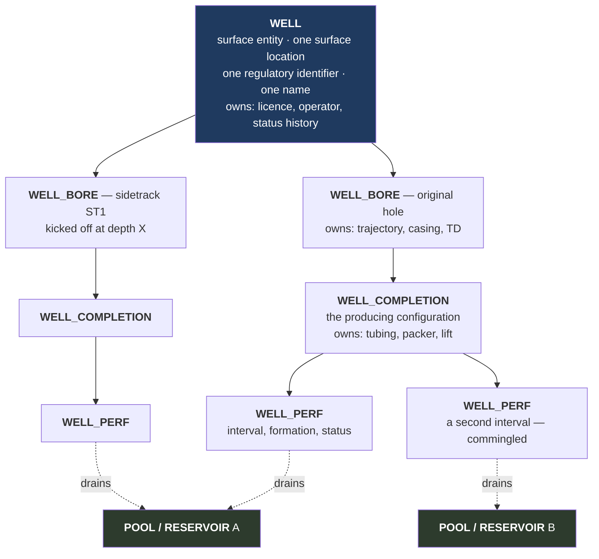

# Research — Industry data standards and what we take from them

**Status:** draft · **Date:** 2026-08-06

Why a game cares about data standards: **they have already solved the modelling
problem we are about to solve.** The petroleum industry spent decades arguing
about what a "well" is, and wrote the answer down. Borrowing their nouns and
their granularity gives us a domain model that (a) is internally consistent,
(b) expresses awkward real cases (sidetracks, recompletions, commingled
production, custody transfer) without special-casing, and (c) is legible to
anyone who knows the industry.

> **Accuracy note.** This document is written from working knowledge of these
> standards, not from a live reading of the specifications. Entity names and
> relationships are correct in substance and in the shape they imply; exact
> table names, column names and version numbers should be confirmed against the
> published models before any content-format decision is finalised. Nothing in
> the engine design depends on an exact column name — only on the *granularity*
> the standards establish.

---

## 1. The standards, and what each is for

| Standard | Body | Domain | What we take |
|---|---|---|---|
| **PPDM 3.9** | Professional Petroleum Data Management Association | Master data: wells, facilities, land, seismic, production, stratigraphy, business associates | **The entity model.** Our nouns and their granularity. |
| **WITSML** | Energistics | Drilling & completion, real-time rig data | Trajectory/survey concepts; the drilling operation vocabulary |
| **PRODML** | Energistics | Production reporting, volumes, allocation, well tests | Product types, allocation concepts, well-test structure |
| **RESQML** | Energistics | Reservoir models, grids, properties | The *property* abstraction: a named, typed, unit-bearing value attached to a subsurface object |
| **Energistics UoM** | Energistics | Units of measure | The unit system: dimensions, quantity classes, conversions |
| **OSDU** | The Open Group | Cloud data platform schemas (built substantially on the above) | Confirmation of which concepts are load-bearing across the industry |
| **SPE-PRMS** | SPE/WPC/AAPG/SPEE | Petroleum Resources Management System | Reserves and resource classification (1P/2P/3P, contingent, prospective) |
| **API MPMS** | American Petroleum Institute | Measurement | The custody-transfer concept: metering as the legal point of sale |

---

## 2. The single most important thing PPDM teaches us

### A well is not a hole in the ground.

PPDM splits what casual usage calls "a well" into a hierarchy:

**Why this matters for the game, concretely:**

| Real situation the player will hit | Flat "well = hole" model | PPDM-shaped model |
|---|---|---|
| Water breaks through in the lower zone; player wants to shut it off and produce only the upper zone | Needs a bespoke "zone" concept bolted on | Set one `WELL_PERF` to isolated. Nothing else changes. |
| The well is uneconomic; player sidetracks to a better part of the structure | Ambiguous — is it a new well? | New `WELL_BORE` on the same `WELL`. Licence, name, surface costs are shared. |
| One well produces from two reservoirs at once | Impossible or hacked | Two perforations, two reservoir links, allocation splits the production. |
| Player recompletes an old well into a shallower horizon | Special-cased | New `WELL_COMPLETION` on the existing wellbore. |
| A horizontal well contacts 3,000 ft of reservoir instead of 60 ft | Fudged with a multiplier | Falls out of trajectory geometry × perforated length. |

**Decision:** adopt the four-level hierarchy — `IWell` → `IWellbore` →
`ICompletion` → `IPerforation` — exactly. The cost is one extra level of
indirection. The benefit is that every one of the above is free.

**Deviation from PPDM:** PPDM has many more well sub-entities (`WELL_NODE`,
`WELL_LICENSE`, `WELL_ACTIVITY`, dozens of measurement tables). We collapse
measurement into `IWellTest` / `IWellLog` / `ICoreAnalysis`, and licensing into
`ILicence` at the company level. Recorded as a deliberate simplification.

---

## 3. Facility: the same lesson, one level up

PPDM's `FACILITY` is deliberately **recursive**: a facility can contain
facilities. A tank battery contains tanks and a separator. A gas plant contains
compression, dehydration and NGL trains. A terminal contains tanks and berths.

**Decision:** `IFacility` is a composite of `IFacilityUnit`s and may contain
child `IFacility`s. A facility has **no process behaviour of its own** — it is a
site, an owner, a cost centre and a container. All process behaviour lives in
units.

This is the rule that prevents the classic modelling failure where "refinery"
becomes a monolithic class with a hundred fields. There is no `Refinery` class.
There is a facility containing units, and the units are the physics.

**Facility types we instantiate** (PPDM `FACILITY_TYPE` analogues): wellsite/pad,
tank battery, gathering station, compressor station, gas processing plant, water
handling plant, pump station, terminal, LNG plant, disposal site.

---

## 4. Reservoir vs Field vs Pool

PPDM separates three things casual usage conflates:

| PPDM entity | Meaning | Our contract |
|---|---|---|
| `FIELD` | The surface-delineated area of one or more accumulations, administratively named | `IField` — an economic/administrative grouping |
| `POOL` | A single hydrocarbon accumulation, hydraulically connected | `IReservoir` — **the thing material balance is solved on** |
| `RESERVOIR` | The rock unit holding a pool | folded into `IReservoir` |

**Decision:** the unit of pressure simulation is `IReservoirCompartment` — a
hydraulically connected volume. An `IReservoir` is one or more compartments; an
`IField` is one or more reservoirs plus the surface infrastructure serving them.

This matters for a specific piece of gameplay: **compartmentalisation is a
discovery**. A player may drill three wells believing they share one tank, and
find from pressure data that they do not. That is only expressible because the
compartment is the simulated unit and the reservoir is the belief about it.

---

## 5. Product types (PRODML / PPDM `PRODUCT_TYPE`)

The industry's product list is the basis for `IMaterial`. Our set:

| Material | Phase at standard conditions | Sold as | Notes |
|---|---|---|---|
| Crude oil | liquid | yes (benchmark-priced) | quality graded by API gravity and sulphur |
| Condensate | liquid | yes | light liquid dropping out of gas |
| Natural gas (raw) | gas | no | must be treated to spec |
| Sales gas | gas | yes | on-spec methane-rich stream |
| NGL — ethane, propane, butane, pentanes+ | liquid under pressure | yes | separately priced |
| LNG | liquid (cryogenic) | yes | marine export form of sales gas |
| Produced water | liquid | no (a cost) | must be treated and disposed |
| CO₂ | gas | contaminant / EOR agent | both a problem and a tool |
| H₂S | gas | contaminant | sour service; safety and cost implications |
| Nitrogen | gas | inert contaminant | dilutes heating value |
| Sulphur | solid | by-product, sellable | from sweetening |

**Decision:** `IMaterial` is a first-class registered content type, not an enum.
Adding "helium" or "hydrogen" is a data file. The engine never switches on a
material identity — it reads the material's *properties*. This is the
"one engine for oil or gas" rule made concrete.

---

## 6. Properties: the RESQML lesson

RESQML treats a property as a first-class object: a named, typed, unit-bearing
value attached to a subsurface object, with a defined property kind.

**Decision:** `IProperty` is a real contract, not a C# property. Every physical
quantity in the subsurface and fluid model is an `IProperty` carrying:

- **kind** — porosity, permeability, pressure, temperature, saturation…
- **quantity** — a value with a unit (`IQuantity`)
- **provenance** — how we know it (assumed / seismic / log / core / test / history-match)
- **uncertainty** — a distribution, not a scalar

That last pair is what makes the exploration game work. A porosity is never
"0.22". It is "0.22 ± 0.05, known from a log". Buying a core narrows the error
bar. The player's decisions are made against beliefs, and the beliefs improve
when they pay for information. **This is not a UI feature — it is in the domain
model, at the bottom.**

---

## 7. Units of measure (Energistics UoM)

The industry is unit-hostile: barrels, cubic metres, standard cubic feet, psi,
bar, kPa, °F, °C, millidarcies, API gravity (which is a *nonlinear* transform of
density). Mixing them silently is a classic and catastrophic bug class.

**Decision:** no bare `double` crosses a contract boundary for a physical
quantity. Every physical value is an `IQuantity` = magnitude + unit, and the
unit system knows its dimension. Conversions are explicit and total. Arithmetic
between incompatible dimensions is not expressible.

The display unit system (field/imperial vs SI/metric) is a presentation choice
selected by the player; the engine computes in one canonical internal set.
Details in [10_CONTENT_AND_UNITS](../design/10_CONTENT_AND_UNITS.md).

---

## 8. Custody transfer (API MPMS)

In the real industry, **you do not get paid when you produce — you get paid when
metered volume crosses a custody transfer point on spec.** Everything upstream of
that meter is inventory and risk.

**Decision:** `ICustodyTransferPoint` is a modelled entity. Revenue is generated
*only* at one, and only for material meeting the contract's specification. This
single decision produces several pieces of gameplay for free:

- Off-spec gas (too wet, too sour, wrong heating value) is **rejected**, which is
  what forces the player to build treating.
- Volume sitting in tanks is capital, not revenue — so storage strategy matters.
- Line loss and measurement uncertainty become real, small, annoying costs.
- Sales contracts attach to a point, so "where do I sell this?" is a real
  question with more than one answer.

---

## 9. Reserves (SPE-PRMS)

PRMS classifies volumes by certainty and commerciality: **Proved (1P)**,
**Proved+Probable (2P)**, **Proved+Probable+Possible (3P)**, plus **Contingent**
(discovered, not yet commercial) and **Prospective** (undiscovered).

**Decision:** reserves are a *derived* number, computed from beliefs plus the
current development plan plus current prices. They are the game's real
scoreboard — more meaningful than cash, because they measure whether the company
has a future. **Reserve replacement ratio** (added ÷ produced) is the headline
metric.

This is also the cleanest way to make exploration feel necessary: a company with
rising cash and falling reserves is visibly dying, and the player can see it.

---

## 10. Summary of what we adopt, adapt, and reject

| Standard concept | Verdict | Reason |
|---|---|---|
| Well → Wellbore → Completion → Perforation | **Adopt whole** | Every awkward real case becomes expressible |
| Recursive Facility → Unit | **Adopt whole** | Prevents monolithic process classes |
| Field / Pool / Reservoir separation | **Adopt, renamed** | Compartment is the simulated unit; reservoir is the belief |
| Property as a first-class typed, unit-bearing, provenanced object | **Adopt whole** | It *is* the uncertainty gameplay |
| Product type registry | **Adopt whole** | Makes "one engine for oil or gas" real |
| Units of measure | **Adopt whole** | Silent unit bugs are unacceptable |
| Custody transfer as the revenue event | **Adopt whole** | Generates gameplay at no cost |
| PRMS reserves classes | **Adopt, simplified** | 1P/2P/3P + contingent; drop the full commerciality matrix |
| Business associate / land-rights model | **Adapt** | Simplified to `ICompany`, `IWorkingInterest`, `ILicence` |
| Stratigraphy (full `STRAT_NAME_SET` machinery) | **Adapt** | One named unit per reservoir; no correlation schemes |
| Seismic bin/trace/line detail | **Reject** | A survey is an information purchase with a footprint, resolution and price — not a trace database |
| Full measurement/audit table hierarchy | **Reject** | Our audit trail (G5) serves the purpose at game granularity |
| Regulatory reporting formats | **Reject** | No real regulator is consuming our output |

---

## 11. Open questions to confirm before content format is frozen

1. Exact PPDM 3.9 table/column names, if we want the content format to be
   recognisably PPDM-shaped rather than merely PPDM-informed. *(Recommendation:
   PPDM-informed is sufficient; matching column names buys nothing for a game
   and costs readability.)*
2. Whether to use the Energistics UoM catalogue verbatim (it is large) or a
   curated subset covering the ~40 quantity kinds we actually use.
   *(Recommendation: curated subset, with the same dimension algebra.)*
3. Whether reserves should be player-declarable (with the risk of overbooking and
   a scandal mechanic) or engine-computed only. *(A gameplay question, deferred
   to [08_ECONOMICS](../design/08_ECONOMICS.md).)*
