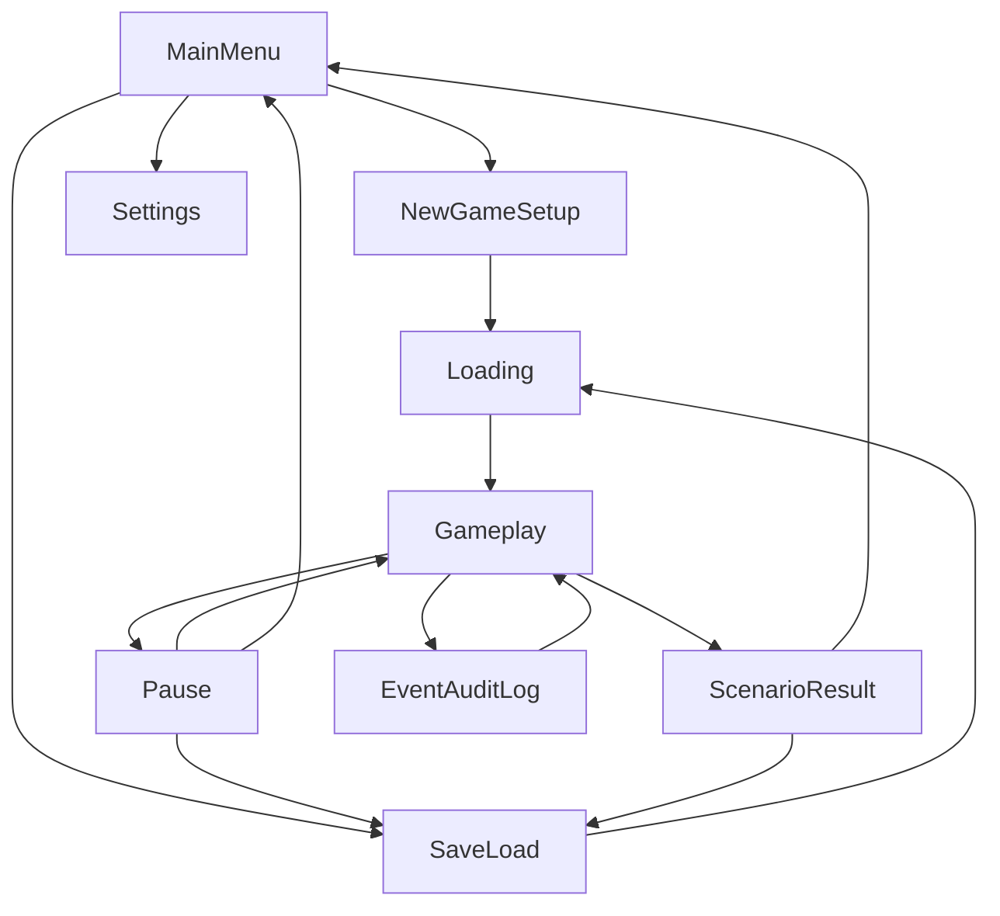

# Godot game scene plan

This plan turns the scanned Beep Game Builder UI kit and HUD components into a
concrete scene plan for OilGasSim. It is planning only. No scenes have been
created, copied, enabled, or modified.

## 1. Scope

OilGasSim is a management simulation, not a platformer, shooter, card game, or
puzzle. The Beep Game Builder genre templates are useful as **visual and
structural scaffolding**, but the game needs its own scenes:

- main menu;
- new-game setup;
- settings;
- save/load;
- gameplay workspace;
- pause;
- scenario result/game over;
- event/audit log.

## 2. Scene flow



## 3. Reusable addon scene templates

These already exist under
`addons/beep_game_builder_cs/templates/scenes/`.

| Template | Use in OilGasSim |
|---|---|
| `main_menu.tscn` | Scaffold for the OilGasSim main menu. Replace generic buttons with New Game, Load, Settings, Quit. |
| `settings_menu.tscn` | Direct settings scaffold: audio, display, game, controls tabs. |
| `save_game_menu.tscn` | Direct save-slot scaffold. |
| `load_game_menu.tscn` | Direct load-slot scaffold. |
| `hud.tscn` | Generic HUD starting point, but OilGasSim should build a management HUD rather than score/lives HUD. |
| `citybuilder_main.tscn` | Best structural reference for a management game: resource strip, right gadget, minimap, bottom dock, alerts. |
| `strategy_main.tscn` | Useful reference for top bar, turn label, and tabbed inspector screens. |
| `topdown_main.tscn` | Useful only for map/camera/tile-map scaffolding, not for OilGasSim gameplay logic. |
| `game_over.tscn` | Scaffold for insolvency/scenario result. |
| `level_summary.tscn` | Scaffold for end-of-run summary. |
| `dialog_template.tscn` | Reusable confirm/detail dialog. |
| `atmosphere.tscn` | Optional weather/day-night visual layer. |
| `topdown/pause_subscreen.tscn` | Pause overlay reference. |

## 4. HUD component findings

The addon ships genre-specific HUD components under `ecs/ui/hud/`.

| HUD component | Fit for OilGasSim |
|---|---|
| `GenreHudComponent` | Base class. Useful because it exposes `SetStat(name, text)`. |
| `CityBuilderHudComponent` | **Best fit.** Population/budget/power/happiness/date resource strip maps naturally to cash, production, wells, activities, and date. |
| `StrategyHudComponent` | **Second-best fit.** Top resource bar and turn label map naturally to cash/resources and engine tick/date. |
| `TopDownHudComponent` | Not a direct fit. Score/lives/health are action-game concepts. |
| `HudComponent` | Generic score/lives/health HUD. Use only as a reference for wiring, not as the OilGasSim HUD. |
| Other genre HUDs | Skip: cardgame, platformer, puzzle, racing, RPG, shooter, survival. |

For OilGasSim, create `OilGasHudComponent` or compose the management HUD from
lower-level kit widgets and `DataBinderHostComponent`. The existing
`CityBuilderHudComponent` and `StrategyHudComponent` are good templates to copy
structurally, not to subclass.

## 5. UI kit findings

The C# UI kit has many reusable controls. The following are the most relevant:

| Kit/component | OilGasSim use |
|---|---|
| `KitPanel` | Titled panels for dashboard, well/prospect inspector, chain view. |
| `KitPanelContainer` | Screen containers and side panels. |
| `PanelFrameComponent` | Decorative framed header for major screens. |
| `KitLabelValue` | Label/value pairs for cash, date, production, water cut, GOR. |
| `KitMeter` | Utilisation, scenario progress, facility capacity, safety metrics. |
| `KitRadialMeter` | Compact radial gauges if desired. |
| `KitCurrencyBar` | Top-bar cash display. |
| `ResourceBadgeComponent` | Top resource strip icons and values. |
| `TableComponent` | Well list, prospect list, operation list, finance table. |
| `KitTabPanel` / `KitTabStrip` | Inspector tabs and settings tabs. |
| `TabGroupComponent` | Runtime tab switching for map/dashboard/well/prospect screens. |
| `KitTooltip` / `TooltipComponent` | Explain command buttons, bottleneck causes, rejection reasons. |
| `KitModalShade` / `ModalComponent` | Confirmation dialogs and detail modals. |
| `KitToast` / `ToastNotificationComponent` | Engine events, command accept/reject, save results. |
| `KitWeatherForecastCard` / `WeatherForecastUI` | Environment forecast if engine environment data is exposed. |
| `KitSegmentedIconGroup` | Filter/selection buttons for well status, facility type, or map layer. |
| `KitPager` | Paginated lists of wells, prospects, operations, audit entries. |
| `KitOptionButton` / `KitSelect` | New-game setup choices: reality profile, fault handling, game mode. |
| `KitCheckButton` / `KitCheckBox` | Settings and confirmation options. |
| `KitSliderBar` | Audio and maybe speed/forecast controls. |
| `KitContextMenu` | Right-click actions on wells/prospects/map. |
| `DataBinderHostComponent` | Bind `FieldReadModel` values to UI without custom polling code. |

## 6. Proposed OilGasSim scenes

### 6.1 Main menu

Root: `Control` or `CanvasLayer`.

Reuse:

- `main_menu.tscn`
- `KitPushButton`
- `KitLabel`
- `ThemePresetComponent` with `OilGas` theme
- `GameInfoBinder`
- `SceneTransitionComponent`
- `AnimatedMenuComponent`

Buttons:

- New Game
- Load Game
- Settings
- Quit

Engine interaction: none, except choosing whether to create a new engine or
load a save.

### 6.2 New game setup

Root: `Control` / modal panel.

Reuse:

- `KitPanel`
- `KitOptionButton` / `KitSelect`
- `KitCheckButton`
- `KitLabelValue`
- `KitTooltip`

Fields:

- world seed;
- epoch/start date;
- reality profile;
- fault handling mode;
- scenario/mode if available.

Engine interaction:

- call the OilGasSim host to build `EngineBuilder.CreateNew` or the equivalent
  bridge command.

### 6.3 Settings

Root: `CanvasLayer` or `Control`.

Reuse:

- `settings_menu.tscn`
- `SettingsComponent`
- `KitTabPanel`
- `KitSliderBar`
- `KitOptionButton`
- `KitCheckButton`

Sections:

- Audio;
- Display;
- Gameplay/simulation pacing;
- Language;
- Controls.

Engine interaction: none. Settings belong to the Godot host.

### 6.4 Save/load

Root: `Control`.

Reuse:

- `save_game_menu.tscn`
- `load_game_menu.tscn`
- `SaveLoadManagerComponent`
- `SaveGameMenuComponent`
- `LoadGameMenuComponent`
- `KitPushButton`
- `KitPanelContainer`

OilGasSim change:

- keep the slot UI and signals;
- replace generic `GameStateManagerComponent` persistence with an OilGasSim save
  DTO that includes host metadata and the engine save payload.

Engine interaction:

- save: collect engine state from the host bridge;
- load: load engine state, then build/restore a new engine.

### 6.5 Gameplay workspace

This is the central scene and should be custom, not a generic genre main scene.

Root: `Node2D` for world/map and `CanvasLayer` for HUD, or a single `Control`
if the game is primarily UI-first.

Recommended layout:

```text
Gameplay
├── World
│   ├── Terrain/TileMap
│   ├── WellLayer
│   ├── FacilityLayer
│   └── ProspectLayer
├── HUD
│   ├── Theme
│   ├── HudCollapse
│   ├── TopBar
│   │   ├── Cash
│   │   ├── Date/Tick
│   │   ├── Wells
│   │   ├── Activities
│   │   └── ProducedThisTick
│   ├── RightPanel
│   │   ├── Minimap
│   │   ├── FacilityUtilisation
│   │   └── Environment/Weather
│   ├── BottomDock
│   │   └── Action/CommandBar
│   └── AlertStack
│       └── ToastHost
├── InspectorLayer
│   ├── WellInspector
│   ├── ProspectInspector
│   ├── FacilityInspector
│   └── ChainFlowView
├── ModalLayer
│   ├── ConfirmDialog
│   └── DetailModal
├── SimulationController
└── GameFlow
```

Reuse:

- `ResourceBadgeComponent` or `KitLabelValue` for top bar stats;
- `KitPanel` / `KitPanelContainer` for side and bottom panels;
- `MinimapComponent` for map overview;
- `KitMeter` for utilisation and scenario progress;
- `TableComponent` for well/prospect/operation lists;
- `TabGroupComponent` / `KitTabPanel` for inspector tabs;
- `TooltipComponent` for explanations;
- `ModalComponent` for confirmations;
- `ToastNotificationComponent` for engine events and command results;
- `HudCollapseComponent` to declutter the HUD;
- `DataBinderHostComponent` to bind `FieldReadModel` to the UI.

Engine interaction:

- `SimulationController` owns pause/speed and calls `AdvanceTick`;
- UI commands submit through `engine.Commands`;
- HUD updates only after a new `FieldReadModel` snapshot;
- map markers come from `FieldReadModel.Prospects` and `Wellbores`;
- chain view comes from `FieldReadModel.Chain`.

### 6.6 Pause

Root: `CanvasLayer` overlay.

Reuse:

- `GameFlowComponent` pause behavior;
- `topdown/pause_subscreen.tscn` as a structural reference;
- `KitPanel` and `KitPushButton`.

Actions:

- resume;
- save/load;
- settings;
- return to main menu.

Engine interaction: pause Godot only. Do not advance the engine while paused.

### 6.7 Scenario result / game over

Root: `Control` or `CanvasLayer`.

Reuse:

- `game_over.tscn` / `level_summary.tscn`;
- `KitPanel`;
- `KitArchetype` victory/defeat ornament sets;
- `KitLabelValue` for final metrics;
- `TableComponent` for final financial/summary tables.

States:

- insolvency/failure;
- scenario success;
- manual exit.

Engine interaction: read `FieldReadModel.Outcome`, `Insolvent`, and final
snapshot metrics.

### 6.8 Event and audit log

Root: `Control` modal or docked panel.

Reuse:

- `KitPanel`;
- `TableComponent`;
- `KitPager`;
- `KitFilter`-style selection via `KitOptionButton` / `KitSegmentedIconGroup`;
- `KitToast` for latest alert.

Views:

- latest sealed engine events;
- audit by entity/category;
- cause chains;
- production loss reports.

Engine interaction:

- `engine.Events.Sealed(tick)`;
- `engine.Audit.Query(...)`.

## 7. HUD data mapping

| Top bar/HUD element | Engine source |
|---|---|
| Cash | `FieldReadModel.Cash` |
| Date | `FieldReadModel.Date` |
| Tick | `FieldReadModel.Tick` |
| Wells | `FieldReadModel.Wells` or `Wellbores.Count` |
| Activities running | `FieldReadModel.ActivitiesRunning` |
| Produced this tick | `FieldReadModel.ProducedThisTick` |
| Outcome | `FieldReadModel.Outcome` |
| Insolvent | `FieldReadModel.Insolvent` |
| Bottlenecks | `FieldReadModel.Bottlenecks` |
| Beliefs | `FieldReadModel.Beliefs` |
| Prospects | `FieldReadModel.Prospects` |
| Well states | `FieldReadModel.Wellbores` |

## 8. Command placement

| Scene/screen | Command buttons |
|---|---|
| Gameplay map | Drill prospect, seismic survey. |
| Well inspector | Open/shut choke, abandon well, well test, wireline log, cut core. |
| Facility/chain view | Install separator, expand export. |
| Global HUD | Advance tick, pause/speed. |

Use `TooltipComponent` or `KitTooltip` to show why a command is unavailable.
Show `Rejected.Reasons` through `ToastNotificationComponent` or a detail modal.

## 9. Implementation order

Planning-only order:

1. Create an OilGasSim theme root using `ThemePresetComponent` + `OilGas` preset.
2. Build main menu, settings, and save/load from existing scene templates.
3. Build the gameplay workspace shell with top bar, side panel, bottom dock, and
   toast host.
4. Wire `SimulationController` and `EngineHost` autoloads.
5. Bind snapshot values with `DataBinderHostComponent` before adding bespoke
   UI scripts.
6. Add map, well list, prospect cards, and chain view.
7. Add inspector modals and command actions.
8. Add event/audit log and scenario result screens.
9. Add scene transitions, weather ambience, and animation polish.
10. Use `godot_mcp` to smoke-test scene navigation and simulation commands.

## 10. Risks and constraints

- Do not adopt the generic genre scene flow as the game architecture.
- `CityBuilderHudComponent` and `StrategyHudComponent` are references, not the
  final OilGasSim HUD.
- `GameSpeedComponent` is coupled to `CityEconomyComponent`; keep custom pacing.
- `SaveLoadManagerComponent` is UI-only in practice for this game; engine save
  format must be bridged separately.
- Weather/day-night visuals are presentation only. The engine remains the source
  of truth for environment and time.

## 11. Conclusion

The toolkit and HUD items are sufficient to accelerate the OilGasSim scene work.
The best approach is to reuse the menu/settings/save-load templates directly,
use the management-HUD templates (`citybuilder` and `strategy`) as structural
references, and compose the actual OilGasSim workspace from kit controls and
data binders around the engine host.

No addon or project code was changed by this plan.
